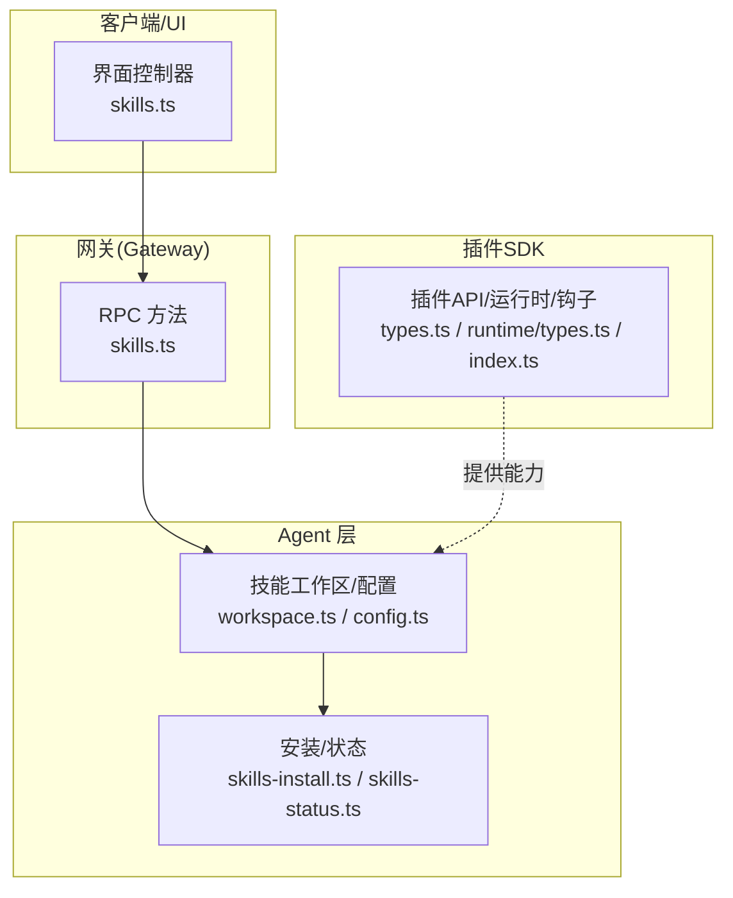
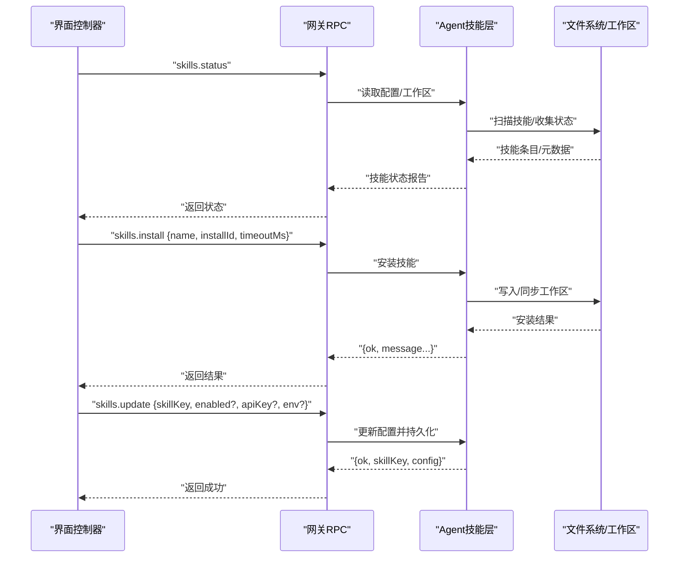
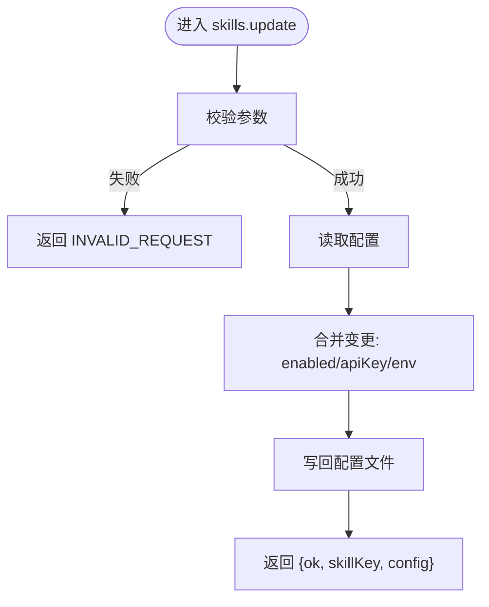
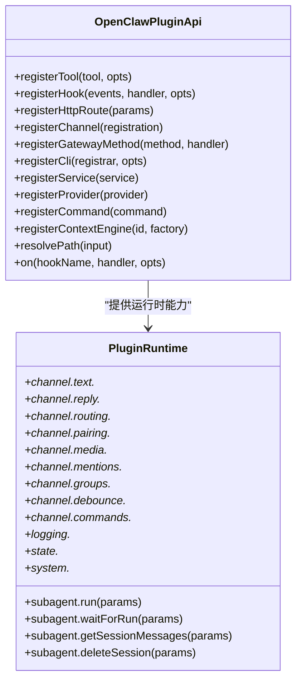
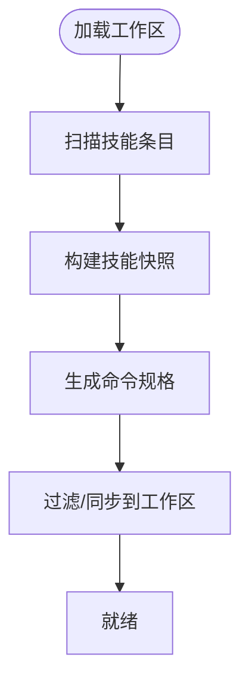
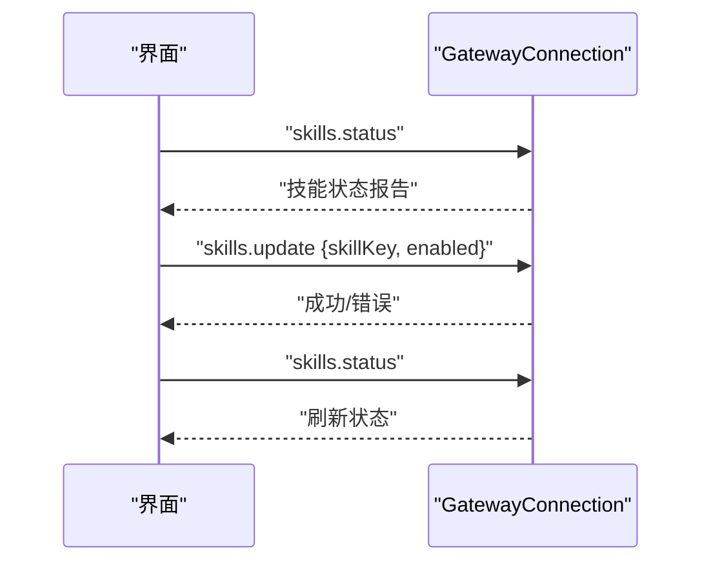
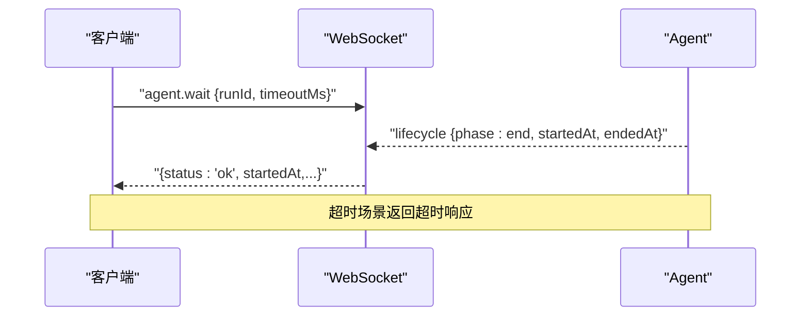
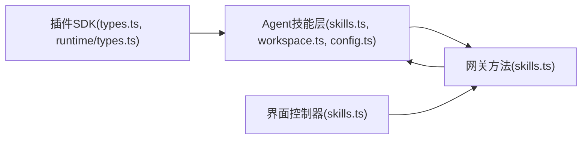

# 技能SDK和API

<cite>
**本文引用的文件**
- [src/plugin-sdk/index.ts](file://src/plugin-sdk/index.ts)
- [src/plugins/types.ts](file://src/plugins/types.ts)
- [src/plugins/runtime/types.ts](file://src/plugins/runtime/types.ts)
- [src/gateway/server-methods/skills.ts](file://src/gateway/server-methods/skills.ts)
- [src/agents/skills.ts](file://src/agents/skills.ts)
- [src/agents/skills/types.ts](file://src/agents/skills/types.ts)
- [apps/macos/Sources/OpenClaw/GatewayConnection.swift](file://apps/macos/Sources/OpenClaw/GatewayConnection.swift)
- [ui/src/ui/controllers/skills.ts](file://ui/src/ui/controllers/skills.ts)
- [src/agents/skills/serialize.ts](file://src/agents/skills/serialize.ts)
- [src/agents/skills/workspace.ts](file://src/agents/skills/workspace.ts)
- [src/agents/skills/config.ts](file://src/agents/skills/config.ts)
- [src/agents/skills/env-overrides.ts](file://src/agents/skills/env-overrides.ts)
- [src/agents/skills-install.ts](file://src/agents/skills-install.ts)
- [src/agents/skills-status.ts](file://src/agents/skills-status.ts)
- [src/gateway/server.chat.gateway-server-chat.test.ts](file://src/gateway/server.chat.gateway-server-chat.test.ts)
- [src/agents/openclaw-tools.sessions.test.ts](file://src/agents/openclaw-tools.sessions.test.ts)
- [docs/refactor/plugin-sdk.md](file://docs/refactor/plugin-sdk.md)
</cite>

## 目录
1. [简介](#简介)
2. [项目结构](#项目结构)
3. [核心组件](#核心组件)
4. [架构总览](#架构总览)
5. [详细组件分析](#详细组件分析)
6. [依赖关系分析](#依赖关系分析)
7. [性能考量](#性能考量)
8. [故障排查指南](#故障排查指南)
9. [结论](#结论)
10. [附录](#附录)

## 简介
本指南面向使用 OpenClaw 的技能开发者，系统讲解技能 SDK 与 API 的使用方法，涵盖：
- 技能 SDK 接口与工具函数
- 技能与 Agent 系统的交互方式（事件、异步等待、错误处理）
- 技能生命周期管理与状态维护
- 常见开发模式与最佳实践
- 具体调用流程与可视化图示

## 项目结构
OpenClaw 将“技能”作为可插拔能力单元，围绕以下层次组织：
- 插件 SDK：对外暴露统一的插件 API、运行时能力、钩子系统等
- 网关方法：提供技能查询、安装、更新等 RPC 能力
- Agent 层：负责技能加载、工作区同步、环境变量覆盖、命令解析等
- 客户端/界面：通过网关方法与 Agent 交互，实现技能启用/禁用、安装、密钥保存等

图表来源
- [src/plugin-sdk/index.ts](file://src/plugin-sdk/index.ts#L1-L800)
- [src/plugins/types.ts](file://src/plugins/types.ts#L248-L306)
- [src/plugins/runtime/types.ts](file://src/plugins/runtime/types.ts#L51-L64)
- [src/gateway/server-methods/skills.ts](file://src/gateway/server-methods/skills.ts#L57-L205)
- [src/agents/skills/workspace.ts](file://src/agents/skills/workspace.ts)
- [src/agents/skills/config.ts](file://src/agents/skills/config.ts)
- [src/agents/skills-install.ts](file://src/agents/skills-install.ts)
- [src/agents/skills-status.ts](file://src/agents/skills-status.ts)

章节来源
- [src/plugin-sdk/index.ts](file://src/plugin-sdk/index.ts#L1-L800)
- [src/plugins/types.ts](file://src/plugins/types.ts#L248-L306)
- [src/plugins/runtime/types.ts](file://src/plugins/runtime/types.ts#L51-L64)
- [src/gateway/server-methods/skills.ts](file://src/gateway/server-methods/skills.ts#L57-L205)

## 核心组件
- 插件 API 与运行时
  - OpenClawPluginApi：注册工具、钩子、HTTP 路由、命令、服务、提供者等
  - PluginRuntime：通道能力、日志、状态目录、子代理运行与等待、系统命令执行等
- 网关技能方法
  - skills.status：查询技能状态报告
  - skills.install：安装指定技能
  - skills.update：启用/禁用、设置 API Key、注入环境变量
- Agent 技能工作区
  - 加载/过滤/构建技能快照、命令规格、同步到工作区
  - 解析技能配置、平台与二进制依赖、环境变量覆盖
- 客户端/界面
  - 通过 RPC 请求技能状态、安装、更新，并显示消息与错误

章节来源
- [src/plugins/types.ts](file://src/plugins/types.ts#L248-L306)
- [src/plugins/runtime/types.ts](file://src/plugins/runtime/types.ts#L51-L64)
- [src/gateway/server-methods/skills.ts](file://src/gateway/server-methods/skills.ts#L57-L205)
- [src/agents/skills.ts](file://src/agents/skills.ts#L1-L47)
- [src/agents/skills/types.ts](file://src/agents/skills/types.ts#L1-L90)
- [ui/src/ui/controllers/skills.ts](file://ui/src/ui/controllers/skills.ts#L46-L157)

## 架构总览
下图展示了从界面到网关再到 Agent 的完整调用链路，以及技能安装与状态更新的关键路径。

图表来源
- [ui/src/ui/controllers/skills.ts](file://ui/src/ui/controllers/skills.ts#L46-L157)
- [src/gateway/server-methods/skills.ts](file://src/gateway/server-methods/skills.ts#L57-L205)
- [src/agents/skills-install.ts](file://src/agents/skills-install.ts)
- [src/agents/skills-status.ts](file://src/agents/skills-status.ts)

## 详细组件分析

### 组件A：技能网关方法（skills.*）
- 方法清单与职责
  - skills.status：按 agentId 或默认 Agent 查询工作区技能状态
  - skills.bins：汇总所有 Agent 工作区中的技能二进制依赖
  - skills.install：安装指定技能，支持超时控制
  - skills.update：启用/禁用、设置 API Key、注入环境变量并写回配置
- 参数与返回
  - skills.status：params 可包含 agentId；返回技能状态报告对象
  - skills.bins：返回去重排序后的二进制列表
  - skills.install：params 包含 name、installId、timeoutMs；返回安装结果
  - skills.update：params 包含 skillKey、enabled、apiKey、env；返回更新后的配置摘要
- 错误处理
  - 对无效请求参数返回 INVALID_REQUEST
  - 对未知 agentId 返回 INVALID_REQUEST
  - 安装失败返回 UNAVAILABLE 并携带错误信息

图表来源
- [src/gateway/server-methods/skills.ts](file://src/gateway/server-methods/skills.ts#L146-L204)

章节来源
- [src/gateway/server-methods/skills.ts](file://src/gateway/server-methods/skills.ts#L57-L205)

### 组件B：插件SDK与运行时（PluginRuntime）
- 运行时能力
  - 子代理运行与等待：run、waitForRun、getSessionMessages、deleteSession
  - 通道能力：文本分块、回复派发、路由、配对、媒体下载/保存、提及匹配、群组策略、防抖、命令授权
  - 日志与状态：日志器、状态目录解析
  - 系统：系统事件队列、心跳触发、命令执行、原生依赖提示
- 钩子系统
  - 支持大量生命周期钩子：模型解析前、提示构建前、消息收发、工具调用前后、会话开始/结束、子代理生成/投递/结束、网关启停等
  - 提供提示注入、模型/提供方覆盖、消息拦截与修改、工具结果持久化等扩展点

图表来源
- [src/plugins/types.ts](file://src/plugins/types.ts#L248-L306)
- [src/plugins/runtime/types.ts](file://src/plugins/runtime/types.ts#L51-L64)
- [docs/refactor/plugin-sdk.md](file://docs/refactor/plugin-sdk.md#L45-L145)

章节来源
- [src/plugins/types.ts](file://src/plugins/types.ts#L248-L306)
- [src/plugins/runtime/types.ts](file://src/plugins/runtime/types.ts#L51-L64)
- [docs/refactor/plugin-sdk.md](file://docs/refactor/plugin-sdk.md#L45-L145)

### 组件C：Agent 技能工作区与配置
- 技能工作区
  - 加载技能条目、构建技能快照、生成命令规格、过滤与同步
- 技能配置
  - 解析平台、二进制依赖、是否允许内置技能、配置路径解析、环境变量覆盖
- 安装与状态
  - 安装流程封装、状态聚合与报告

图表来源
- [src/agents/skills/workspace.ts](file://src/agents/skills/workspace.ts)
- [src/agents/skills/config.ts](file://src/agents/skills/config.ts)
- [src/agents/skills/types.ts](file://src/agents/skills/types.ts#L1-L90)

章节来源
- [src/agents/skills.ts](file://src/agents/skills.ts#L1-L47)
- [src/agents/skills/types.ts](file://src/agents/skills/types.ts#L1-L90)
- [src/agents/skills/workspace.ts](file://src/agents/skills/workspace.ts)
- [src/agents/skills/config.ts](file://src/agents/skills/config.ts)
- [src/agents/skills-install.ts](file://src/agents/skills-install.ts)
- [src/agents/skills-status.ts](file://src/agents/skills-status.ts)

### 组件D：界面与客户端交互（macOS 示例）
- 界面控制器通过 RPC 调用 skills.status、skills.install、skills.update
- 支持加载状态、错误消息、成功消息反馈
- 更新后重新加载技能状态以刷新 UI

图表来源
- [apps/macos/Sources/OpenClaw/GatewayConnection.swift](file://apps/macos/Sources/OpenClaw/GatewayConnection.swift#L554-L586)
- [ui/src/ui/controllers/skills.ts](file://ui/src/ui/controllers/skills.ts#L46-L157)

章节来源
- [apps/macos/Sources/OpenClaw/GatewayConnection.swift](file://apps/macos/Sources/OpenClaw/GatewayConnection.swift#L554-L586)
- [ui/src/ui/controllers/skills.ts](file://ui/src/ui/controllers/skills.ts#L46-L157)

### 组件E：异步等待与事件处理（Agent 等待/事件）
- agent.wait：等待指定 runId 的生命周期结束，支持超时
- 生命周期事件：lifecycle.phase=end，携带 startedAt/endedAt
- 测试用例验证了等待行为与超时处理

图表来源
- [src/gateway/server.chat.gateway-server-chat.test.ts](file://src/gateway/server.chat.gateway-server-chat.test.ts#L732-L784)
- [src/agents/openclaw-tools.sessions.test.ts](file://src/agents/openclaw-tools.sessions.test.ts#L732-L767)

章节来源
- [src/gateway/server.chat.gateway-server-chat.test.ts](file://src/gateway/server.chat.gateway-server-chat.test.ts#L732-L784)
- [src/agents/openclaw-tools.sessions.test.ts](file://src/agents/openclaw-tools.sessions.test.ts#L732-L767)

## 依赖关系分析
- 插件 SDK 暴露统一 API，Agent 层基于 SDK 的运行时能力实现技能工作区与配置管理
- 网关方法依赖 Agent 层的安装与状态模块，向上提供 RPC 接口
- 客户端通过网关方法与 Agent 交互，实现技能启用/禁用、安装、密钥保存等

图表来源
- [src/plugin-sdk/index.ts](file://src/plugin-sdk/index.ts#L1-L800)
- [src/plugins/types.ts](file://src/plugins/types.ts#L248-L306)
- [src/plugins/runtime/types.ts](file://src/plugins/runtime/types.ts#L51-L64)
- [src/gateway/server-methods/skills.ts](file://src/gateway/server-methods/skills.ts#L57-L205)
- [src/agents/skills.ts](file://src/agents/skills.ts#L1-L47)
- [src/agents/skills/workspace.ts](file://src/agents/skills/workspace.ts)
- [src/agents/skills/config.ts](file://src/agents/skills/config.ts)

章节来源
- [src/plugin-sdk/index.ts](file://src/plugin-sdk/index.ts#L1-L800)
- [src/plugins/types.ts](file://src/plugins/types.ts#L248-L306)
- [src/plugins/runtime/types.ts](file://src/plugins/runtime/types.ts#L51-L64)
- [src/gateway/server-methods/skills.ts](file://src/gateway/server-methods/skills.ts#L57-L205)
- [src/agents/skills.ts](file://src/agents/skills.ts#L1-L47)

## 性能考量
- 技能安装与状态查询涉及磁盘扫描与配置读写，建议在 UI 中加入加载状态与错误提示，避免重复请求
- 使用 keyed 异步队列串行化同一 key 的任务，减少并发冲突与资源竞争
- 子代理运行与等待应设置合理超时，防止长时间阻塞
- 媒体下载与保存需限制大小与类型，避免内存与磁盘压力

章节来源
- [src/agents/skills/serialize.ts](file://src/agents/skills/serialize.ts#L1-L14)
- [src/plugins/runtime/types.ts](file://src/plugins/runtime/types.ts#L8-L29)

## 故障排查指南
- 参数校验失败
  - 现象：返回 INVALID_REQUEST
  - 处理：检查请求参数类型与必填项
- 未知 agentId
  - 现象：返回 INVALID_REQUEST
  - 处理：确认 agentId 是否存在于已知列表
- 安装失败
  - 现象：返回 UNAVAILABLE 并携带错误信息
  - 处理：查看安装日志、网络与权限、超时时间
- 等待超时
  - 现象：agent.wait 返回超时
  - 处理：增加超时时间或检查 Agent 生命周期事件是否正确发出

章节来源
- [src/gateway/server-methods/skills.ts](file://src/gateway/server-methods/skills.ts#L57-L205)
- [src/gateway/server.chat.gateway-server-chat.test.ts](file://src/gateway/server.chat.gateway-server-chat.test.ts#L732-L784)

## 结论
OpenClaw 技能 SDK 通过统一的插件 API 与运行时能力，为技能开发提供了强大的扩展性与可控性。结合网关方法与 Agent 层的工作区管理，开发者可以高效地实现技能的安装、启用/禁用、配置注入与状态查询。配合 UI 的异步等待与事件处理机制，能够构建稳定可靠的技能交互体验。

## 附录

### A. 技能生命周期与状态维护
- 生命周期阶段
  - 安装：skills.install
  - 启用/禁用/配置：skills.update
  - 状态查询：skills.status
- 状态维护要点
  - 通过配置文件持久化 enabled、apiKey、env
  - 使用 serializeByKey 保证同一 key 的串行化操作
  - 工作区同步确保技能元数据与命令规格一致

章节来源
- [src/gateway/server-methods/skills.ts](file://src/gateway/server-methods/skills.ts#L146-L204)
- [src/agents/skills/serialize.ts](file://src/agents/skills/serialize.ts#L1-L14)
- [src/agents/skills/workspace.ts](file://src/agents/skills/workspace.ts)

### B. 常见开发模式与最佳实践
- 使用插件 API 注册工具与钩子，避免直接耦合底层实现
- 在 UI 中统一处理加载、错误与成功消息，提升用户体验
- 合理设置等待超时与重试策略，增强健壮性
- 将技能文档与资源拆分为多个文件，按需加载，降低上下文开销

章节来源
- [src/plugins/types.ts](file://src/plugins/types.ts#L248-L306)
- [ui/src/ui/controllers/skills.ts](file://ui/src/ui/controllers/skills.ts#L46-L157)
- [skills/skill-creator/SKILL.md](file://skills/skill-creator/SKILL.md#L121-L317)