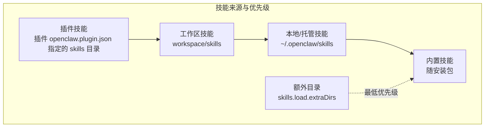
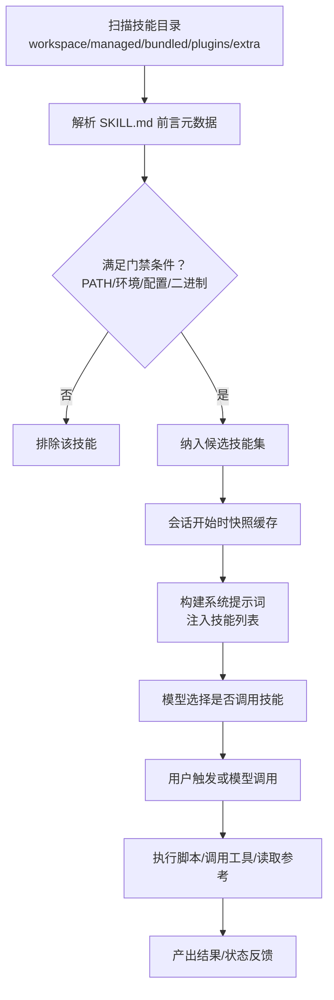
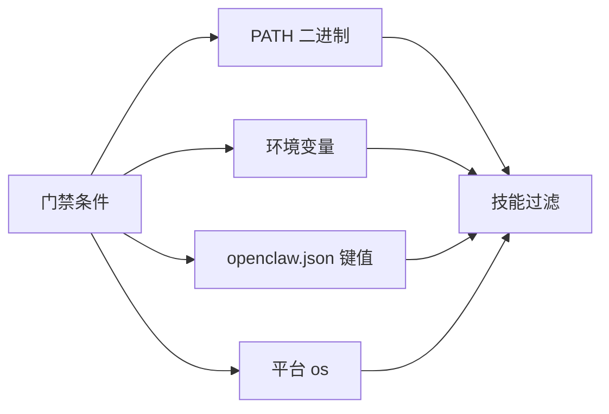

# 技能开发

<cite>
**本文引用的文件**
- [README.md](file://README.md)
- [CONTRIBUTING.md](file://CONTRIBUTING.md)
- [docs/tools/skills.md](file://docs/tools/skills.md)
- [docs/tools/skills-config.md](file://docs/tools/skills-config.md)
- [skills/skill-creator/SKILL.md](file://skills/skill-creator/SKILL.md)
- [skills/skill-creator/scripts/init_skill.py](file://skills/skill-creator/scripts/init_skill.py)
- [skills/pdf/SKILL.md](file://skills/pdf/SKILL.md)
- [skills/github/SKILL.md](file://skills/github/SKILL.md)
- [skills/canvas/SKILL.md](file://skills/canvas/SKILL.md)
- [extensions/discord/openclaw.plugin.json](file://extensions/discord/openclaw.plugin.json)
</cite>

## 目录
1. [简介](#简介)
2. [项目结构](#项目结构)
3. [核心组件](#核心组件)
4. [架构总览](#架构总览)
5. [详细组件分析](#详细组件分析)
6. [依赖分析](#依赖分析)
7. [性能考虑](#性能考虑)
8. [故障排查指南](#故障排查指南)
9. [结论](#结论)
10. [附录](#附录)

## 简介
本指南面向在 OpenClaw 平台上开发“技能（Skills）”的开发者，覆盖从技能初始化、项目结构设计、代码与资源组织、清单文件（SKILL.md）编写，到权限与环境注入、打包与发布、测试与调试、以及性能与安全注意事项的全流程。OpenClaw 使用兼容 AgentSkills 的技能目录结构，通过 YAML 前言元数据驱动触发与加载规则，并支持按环境、二进制、配置项进行“门禁过滤”，最终将可执行脚本、参考文档与资产以“渐进披露”的方式注入到智能体提示词中。

## 项目结构
OpenClaw 的技能生态由三类来源构成，按优先级从高到低依次为：工作区技能（workspace）、本地/托管技能（managed/local），以及随安装包内置的技能（bundled）。此外，插件也可自带技能目录，参与同一套加载与优先级规则。

- 技能来源与优先级
  - 工作区技能：工作空间下的 skills 目录（最高优先）
  - 本地/托管技能：用户主目录下的 ~/.openclaw/skills
  - 内置技能：随安装包提供的默认技能
  - 插件技能：启用插件时，其 openclaw.plugin.json 中列出的 skills 子目录参与加载
  - 额外目录：可通过配置 skills.load.extraDirs 追加更低优先级的扫描路径

- 技能目录结构
  - 必需：SKILL.md（包含 YAML 前言元数据与正文）
  - 可选：scripts/（可执行脚本）、references/（参考文档）、assets/（输出用资源）

图表来源
- [docs/tools/skills.md](file://docs/tools/skills.md#L13-L27)

章节来源
- [docs/tools/skills.md](file://docs/tools/skills.md#L13-L27)

## 核心组件
- 技能清单（SKILL.md）
  - YAML 前言：name、description（必填），metadata（可选，单行 JSON）
  - 正文：使用说明、工作流、参考链接、脚本与资产的组织指引
- 脚本与资源
  - scripts/：可直接运行的 Python/Bash 等脚本，适合重复性任务或需要确定性的操作
  - references/：仅在需要时按需加载的参考文档，避免占用上下文窗口
  - assets/：不直接加载入上下文的输出资源（模板、图标、字体等）
- 元数据与门禁
  - metadata.openclaw：定义平台特定字段，如 os、requires（bins/env/config）、install、emoji、homepage、primaryEnv、skillKey 等
  - 加载时根据 PATH、环境变量、配置键值与二进制存在性进行过滤
- 配置与注入
  - 在 ~/.openclaw/openclaw.json 下对技能进行启用/禁用、环境变量注入、密钥注入与自定义配置
  - 注入范围限定于一次代理会话运行周期内，结束后恢复原环境

章节来源
- [docs/tools/skills.md](file://docs/tools/skills.md#L78-L106)
- [docs/tools/skills.md](file://docs/tools/skills.md#L106-L188)
- [docs/tools/skills-config.md](file://docs/tools/skills-config.md#L13-L39)

## 架构总览
下图展示了技能从发现、门禁过滤、到被注入提示词与执行的端到端流程。

图表来源
- [docs/tools/skills.md](file://docs/tools/skills.md#L106-L188)
- [docs/tools/skills.md](file://docs/tools/skills.md#L242-L247)

章节来源
- [docs/tools/skills.md](file://docs/tools/skills.md#L106-L188)
- [docs/tools/skills.md](file://docs/tools/skills.md#L242-L247)

## 详细组件分析

### 组件一：技能清单（SKILL.md）与元数据
- 必备字段
  - name：技能名称（用于匹配与显示）
  - description：触发描述，帮助智能体判断何时使用该技能
  - metadata（可选）：单行 JSON 对象，承载平台扩展字段
- 元数据字段（platform-specific）
  - openclaw.requires：限制运行条件（bins/env/config/anyBins/os）
  - openclaw.install：安装器规格（brew/apt/npm/go/download 等）
  - openclaw.primaryEnv：与密钥注入相关的主环境变量名
  - openclaw.os：平台白名单
  - openclaw.emoji/homepage：UI 展示增强
  - openclaw.skillKey：覆盖默认键名
- 触发与使用
  - description 是模型选择是否调用技能的关键依据
  - 正文仅在触发后加载，避免上下文浪费

章节来源
- [docs/tools/skills.md](file://docs/tools/skills.md#L78-L106)
- [docs/tools/skills.md](file://docs/tools/skills.md#L106-L188)

### 组件二：脚本与资源组织（scripts/references/assets）
- scripts/
  - 适合重复性、确定性任务；可直接执行，减少上下文加载
  - 示例：PDF 处理、图像生成、表单填充等
- references/
  - 仅在需要时按需加载，避免上下文膨胀
  - 建议长文档拆分，保持 SKILL.md 精简
- assets/
  - 输出用资源（模板、图标、字体等），不加载入上下文

章节来源
- [skills/skill-creator/SKILL.md](file://skills/skill-creator/SKILL.md#L70-L100)
- [skills/pdf/SKILL.md](file://skills/pdf/SKILL.md#L1-L315)

### 组件三：门禁与安装器（requires/install）
- 门禁
  - bins：PATH 上必须存在的二进制
  - env：环境变量存在或可在配置中提供
  - config：openclaw.json 中对应路径为真值
  - anyBins：至少一个存在即可
  - os：平台白名单
- 安装器
  - 支持 brew/apt/npm/go/download 等
  - 可指定平台过滤、目标目录、stripComponents 等
  - 当多选项可用时，优先策略可配置（如 preferBrew）

章节来源
- [docs/tools/skills.md](file://docs/tools/skills.md#L106-L188)
- [docs/tools/skills-config.md](file://docs/tools/skills-config.md#L41-L52)

### 组件四：配置与环境注入（skills.entries.*）
- 启用/禁用：enabled
- 环境变量注入：env（仅当进程未设置时注入）
- 密钥注入：apiKey（支持明文或 SecretRef 对象）
- 自定义配置：config（技能自有键值）
- 注意：沙箱场景下，容器不继承宿主进程环境，需通过沙箱镜像或全局 docker.env 注入

章节来源
- [docs/tools/skills.md](file://docs/tools/skills.md#L189-L239)
- [docs/tools/skills-config.md](file://docs/tools/skills-config.md#L54-L78)

### 组件五：插件与技能（plugins + skills）
- 插件可通过 openclaw.plugin.json 声明 skills 目录
- 插件技能参与统一的加载与优先级规则
- 可通过 metadata.openclaw.requires.config 对插件配置进行门禁

章节来源
- [docs/tools/skills.md](file://docs/tools/skills.md#L41-L49)
- [extensions/discord/openclaw.plugin.json](file://extensions/discord/openclaw.plugin.json#L1-L10)

### 组件六：工作流与最佳实践（以 PDF 技能为例）
- 渐进披露：SKILL.md 保持精炼，复杂细节放入 references
- 触发明确：description 覆盖常见场景与文件类型
- 资源分离：scripts 与 assets 与正文解耦
- 安装器：为外部 CLI 提供 install 规格，提升可用性

章节来源
- [skills/pdf/SKILL.md](file://skills/pdf/SKILL.md#L1-L315)

### 组件七：示例技能（GitHub CLI 技能）
- 通过 metadata.openclaw.requires.bins 指定 gh CLI
- 提供 install 规格（brew/apt）以引导安装
- 明确适用/不适用场景，避免误用

章节来源
- [skills/github/SKILL.md](file://skills/github/SKILL.md#L1-L164)

### 组件八：示例技能（Canvas 技能）
- 解释 Canvas 主机、节点桥接与节点渲染的三层架构
- 提供配置项（端口、根目录、热重载）与调试步骤
- 强调 URL 与绑定模式的关系，避免 localhost 误用

章节来源
- [skills/canvas/SKILL.md](file://skills/canvas/SKILL.md#L1-L199)

## 依赖分析
- 技能依赖关系
  - 外部二进制：通过 requires.bins 指定（如 gh、qpdf、pdftotext 等）
  - 环境变量：通过 requires.env 或 skills.entries.<key>.env 注入
  - 配置键：通过 requires.config 与 openclaw.json 对应路径
  - 平台：通过 os 字段限定
- 插件与技能
  - 插件 openclaw.plugin.json 的 channels 与 configSchema 与技能加载无直接耦合，但插件可携带 skills 目录参与加载

图表来源
- [docs/tools/skills.md](file://docs/tools/skills.md#L106-L188)

章节来源
- [docs/tools/skills.md](file://docs/tools/skills.md#L106-L188)
- [extensions/discord/openclaw.plugin.json](file://extensions/discord/openclaw.plugin.json#L1-L10)

## 性能考虑
- 技能列表注入成本
  - 基础开销固定字符数 + 每个技能的 name/description/location 的 XML 转义长度
  - 建议控制技能数量与描述长度，避免过度膨胀
- 渐进披露
  - 将长文档放入 references，正文仅保留必要步骤与导航
- 会话快照
  - 技能候选集在会话开始时快照，变更在新会话生效；可通过 watcher 实现热更新

章节来源
- [docs/tools/skills.md](file://docs/tools/skills.md#L269-L286)
- [docs/tools/skills.md](file://docs/tools/skills.md#L242-L247)

## 故障排查指南
- Canvas 访问白屏或内容不加载
  - 检查 gateway.bind 与实际访问 URL 是否一致（Tailscale 主机名 vs 本地回环）
  - 使用 curl 直接验证 URL 可达性
- “node required”或“node not connected”
  - 确认已指定 node:<node-id> 参数且节点在线
- live reload 不生效
  - 检查 canvasHost.liveReload 开关、文件是否位于根目录、日志是否有 watcher 错误
- 技能未被加载
  - 检查 PATH、环境变量、openclaw.json 对应键值、二进制是否存在
  - 若为沙箱运行，确认容器内具备所需二进制或通过 docker.setupCommand 安装

章节来源
- [skills/canvas/SKILL.md](file://skills/canvas/SKILL.md#L151-L180)
- [docs/tools/skills.md](file://docs/tools/skills.md#L138-L147)

## 结论
OpenClaw 的技能体系以 SKILL.md 为核心，通过清晰的元数据与门禁机制实现“按需加载、按需执行”。遵循渐进披露原则、合理组织 scripts/references/assets、在 metadata 中明确依赖与安装器、并通过配置注入环境与密钥，可以构建出高效、安全、易维护的技能。结合工作流与调试建议，可显著提升开发效率与稳定性。

## 附录

### A. 技能开发流程（从零到上线）
- 理解需求与触发场景
  - 明确技能要解决的问题域与典型触发语句
- 初始化技能目录
  - 使用 skill-creator 的 init_skill.py 生成模板与资源目录
- 编写 SKILL.md
  - 填充 YAML 前言（name/description），正文给出步骤与参考
- 组织资源
  - scripts/：可复用的自动化脚本
  - references/：长文档与参考材料
  - assets/：输出用资源
- 配置门禁与安装器
  - 在 metadata.openclaw 中声明 requires（bins/env/config/anyBins/os）与 install
- 配置注入
  - 在 openclaw.json 中启用/禁用、注入 env/apiKey、自定义 config
- 测试与迭代
  - 单次会话内验证触发、执行与输出；根据反馈优化描述与资源组织
- 打包与发布
  - 使用 skill-creator 的打包脚本生成 .skill 文件，进行安全与合规校验后再分发

章节来源
- [skills/skill-creator/SKILL.md](file://skills/skill-creator/SKILL.md#L201-L211)
- [skills/skill-creator/SKILL.md](file://skills/skill-creator/SKILL.md#L335-L373)
- [skills/skill-creator/scripts/init_skill.py](file://skills/skill-creator/scripts/init_skill.py#L1-L379)

### B. 技能清单（SKILL.md）字段速查
- 必填
  - name：技能名称
  - description：触发描述
- 可选
  - metadata：单行 JSON 对象，常用字段
    - openclaw.requires.bins/env/config/anyBins/os
    - openclaw.install（brew/apt/npm/go/download）
    - openclaw.primaryEnv、openclaw.emoji、openclaw.homepage、openclaw.skillKey

章节来源
- [docs/tools/skills.md](file://docs/tools/skills.md#L78-L106)
- [docs/tools/skills.md](file://docs/tools/skills.md#L106-L188)

### C. 配置与注入要点
- skills.entries.<skillKey>
  - enabled：启用/禁用
  - env：仅在未设置时注入
  - apiKey：支持明文或 SecretRef
  - config：技能自有键值
- 沙箱场景
  - 容器不继承宿主环境，需通过 agents.defaults.sandbox.docker.env 或自定义镜像注入

章节来源
- [docs/tools/skills-config.md](file://docs/tools/skills-config.md#L54-L78)
- [docs/tools/skills.md](file://docs/tools/skills.md#L230-L239)