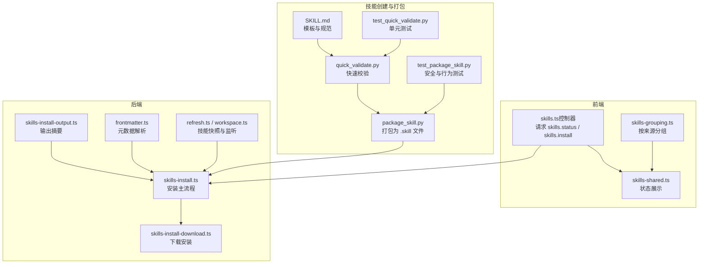
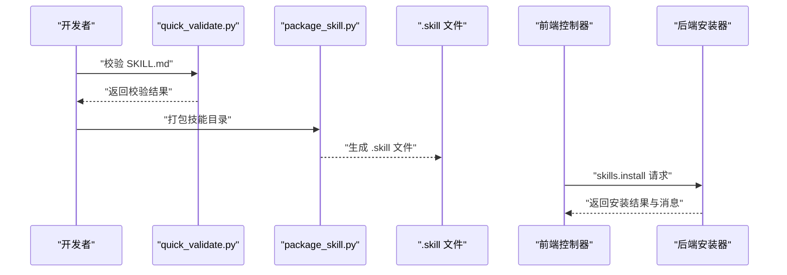
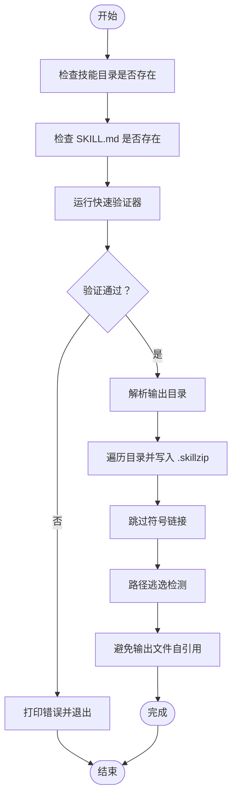
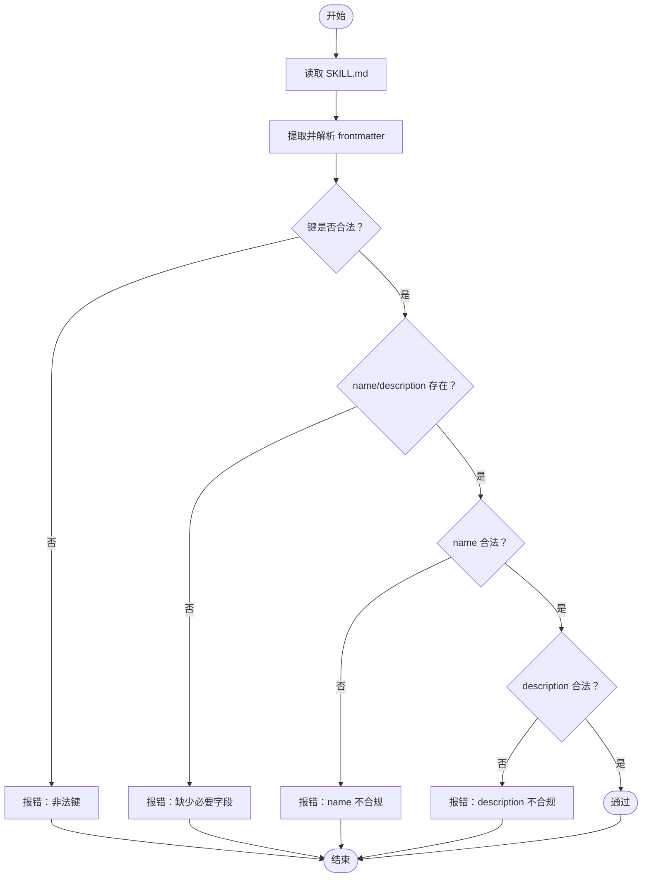
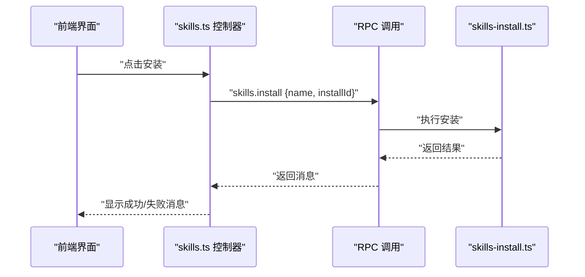
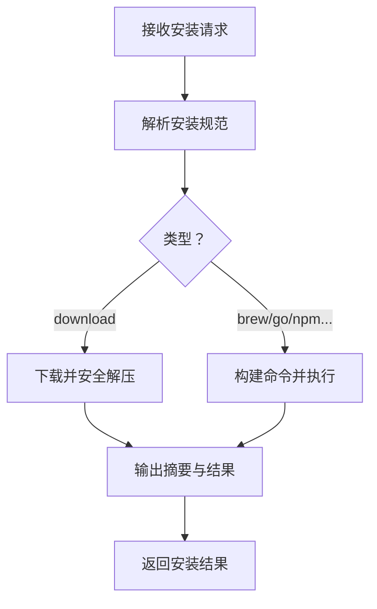
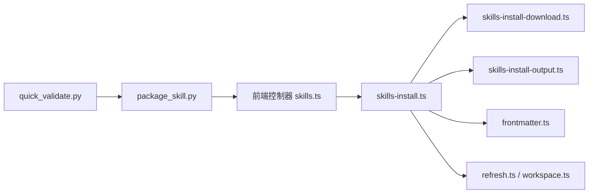

# 技能打包和分发

<cite>
**本文引用的文件**   
- [package_skill.py](file://skills/skill-creator/scripts/package_skill.py)
- [quick_validate.py](file://skills/skill-creator/scripts/quick_validate.py)
- [SKILL.md](file://skills/skill-creator/SKILL.md)
- [test_package_skill.py](file://skills/skill-creator/scripts/test_package_skill.py)
- [test_quick_validate.py](file://skills/skill-creator/scripts/test_quick_validate.py)
- [skills.ts（前端控制器）](file://ui/src/ui/controllers/skills.ts)
- [skills-shared.ts（前端视图）](file://ui/src/ui/views/skills-shared.ts)
- [skills-grouping.ts（前端视图）](file://ui/src/ui/views/skills-grouping.ts)
- [SkillsSettings.swift（macOS 设置界面）](file://apps/macos/Sources/OpenClaw/SkillsSettings.swift)
- [skills-install.ts（后端安装逻辑）](file://src/agents/skills-install.ts)
- [skills-install-output.ts（安装输出格式化）](file://src/agents/skills-install-output.ts)
- [skills-install-download.ts（下载安装实现）](file://src/agents/skills-install-download.ts)
- [skills-install.download.test.ts（下载安全测试）](file://src/agents/skills-install.download.test.ts)
- [skills.ts（后端类型定义）](file://src/agents/skills/types.ts)
- [frontmatter.ts（技能元数据解析）](file://src/agents/skills/frontmatter.ts)
- [refresh.ts（技能快照与监听）](file://src/agents/skills/refresh.ts)
- [workspace.ts（工作区技能快照）](file://src/agents/skills/workspace.ts)
</cite>

## 目录
1. [简介](#简介)
2. [项目结构](#项目结构)
3. [核心组件](#核心组件)
4. [架构总览](#架构总览)
5. [详细组件分析](#详细组件分析)
6. [依赖关系分析](#依赖关系分析)
7. [性能考量](#性能考量)
8. [故障排查指南](#故障排查指南)
9. [结论](#结论)
10. [附录](#附录)

## 简介
本指南面向需要在 OpenClaw 中创建、打包、验证、分发并安装技能的开发者与维护者。内容覆盖：
- 打包工具 package_skill.py 的功能、参数与输出格式
- 技能清单 SKILL.md 的生成与验证流程（元数据、依赖、权限）
- 技能分发最佳实践（版本管理、更新机制、兼容性）
- 技能安装与部署流程（本地环境、平台差异、安全限制）

## 项目结构
围绕“技能打包与分发”的相关文件主要分布在以下位置：
- 技能打包与验证：skills/skill-creator/scripts 下的 package_skill.py、quick_validate.py 及其测试
- 技能模板与流程说明：skills/skill-creator/SKILL.md
- 前端技能状态与安装入口：ui/src/ui/controllers/skills.ts、views/*.ts
- 后端安装与下载实现：src/agents/skills-install*.ts、src/agents/skills/*.ts
- 平台设置界面：apps/macos/Sources/OpenClaw/SkillsSettings.swift

**图表来源**
- [package_skill.py](file://skills/skill-creator/scripts/package_skill.py#L1-L140)
- [quick_validate.py](file://skills/skill-creator/scripts/quick_validate.py#L1-L160)
- [SKILL.md](file://skills/skill-creator/SKILL.md#L319-L373)
- [skills.ts（前端控制器）](file://ui/src/ui/controllers/skills.ts#L39-L157)
- [skills-install.ts](file://src/agents/skills-install.ts#L392-L471)
- [skills-install-download.ts](file://src/agents/skills-install-download.ts#L104-L142)

**章节来源**
- [package_skill.py](file://skills/skill-creator/scripts/package_skill.py#L1-L140)
- [quick_validate.py](file://skills/skill-creator/scripts/quick_validate.py#L1-L160)
- [SKILL.md](file://skills/skill-creator/SKILL.md#L319-L373)

## 核心组件
- 快速验证器（quick_validate.py）
  - 负责对 SKILL.md 进行最小化校验，包括：必需字段、格式、命名规范、长度限制等
  - 支持无 PyYAML 环境下的降级解析
- 打包器（package_skill.py）
  - 在通过验证后，将技能目录打包为 .skill 文件（zip），并进行安全检查（拒绝符号链接、路径逃逸、输出文件自引用）
  - 输出文件名与技能目录同名
- 安装器（skills-install.ts）
  - 解析安装规范，支持 download、brew、go、npm/yarn/pnpm/bun 等多种安装方式
  - 对下载安装执行安全解压（防止目录穿越）
- 前端控制器与视图
  - 控制器负责调用 skills.status 与 skills.install，并处理错误与成功消息
  - 视图负责按来源分组、状态展示与“已打包”标记

**章节来源**
- [quick_validate.py](file://skills/skill-creator/scripts/quick_validate.py#L67-L149)
- [package_skill.py](file://skills/skill-creator/scripts/package_skill.py#L28-L112)
- [skills-install.ts](file://src/agents/skills-install.ts#L392-L471)
- [skills.ts（前端控制器）](file://ui/src/ui/controllers/skills.ts#L39-L157)

## 架构总览
下图展示了从“编写 SKILL.md → 验证 → 打包 → 分发 → 安装”的完整链路。

**图表来源**
- [quick_validate.py](file://skills/skill-creator/scripts/quick_validate.py#L67-L149)
- [package_skill.py](file://skills/skill-creator/scripts/package_skill.py#L28-L112)
- [skills.ts（前端控制器）](file://ui/src/ui/controllers/skills.ts#L125-L157)
- [skills-install.ts](file://src/agents/skills-install.ts#L392-L471)

## 详细组件分析

### 组件A：技能打包器 package_skill.py
- 功能概述
  - 校验技能目录存在且包含 SKILL.md
  - 调用快速验证器进行前置校验
  - 将技能目录递归压缩为 .skill 文件（zip），保持相对目录结构
  - 安全策略：拒绝符号链接；禁止路径逃逸；避免将输出文件写入自身
- 参数与用法
  - 必选：技能目录路径
  - 可选：输出目录（默认当前目录）
- 输出格式
  - 产物：同名 .skill 文件（zip），内部根目录为技能名
- 关键安全点
  - 符号链接直接跳过
  - 排除常见版本控制与缓存目录
  - 拒绝将输出文件写入自身

**图表来源**
- [package_skill.py](file://skills/skill-creator/scripts/package_skill.py#L28-L112)

**章节来源**
- [package_skill.py](file://skills/skill-creator/scripts/package_skill.py#L28-L112)
- [test_package_skill.py](file://skills/skill-creator/scripts/test_package_skill.py#L50-L157)

### 组件B：快速验证器 quick_validate.py
- 元数据检查
  - 必须包含 name 与 description
  - 仅允许指定键集合（如 license、allowed-tools、metadata 等）
  - name 与 description 类型必须为字符串，长度与字符集受限
- 描述质量与完整性
  - 角括号不允许出现在 description 中
  - description 最大长度限制
- 降级解析
  - 若未安装 PyYAML，则使用简单解析器处理 frontmatter

**图表来源**
- [quick_validate.py](file://skills/skill-creator/scripts/quick_validate.py#L67-L149)

**章节来源**
- [quick_validate.py](file://skills/skill-creator/scripts/quick_validate.py#L67-L149)
- [test_quick_validate.py](file://skills/skill-creator/scripts/test_quick_validate.py#L13-L73)

### 组件C：技能清单 SKILL.md 与生成流程
- 清单要求
  - 必须包含 YAML frontmatter，且仅含受支持字段
  - frontmatter 中 name 与 description 是触发与识别的关键
- 生成与迭代
  - 使用 init_skill.py 初始化模板
  - 编辑 SKILL.md 与资源目录（scripts/references/assets）
  - 使用 package_skill.py 打包为 .skill 文件
- 文档与资源组织
  - 将长篇参考材料放入 references，正文保持精简
  - assets 用于最终输出使用的资源，不加载到上下文中

**章节来源**
- [SKILL.md](file://skills/skill-creator/SKILL.md#L319-L373)

### 组件D：前端安装与状态展示
- 安装流程
  - 前端控制器调用 skills.install，传入名称与安装 ID
  - 后端安装器解析安装规范并执行安装
- 状态展示
  - 按来源分组（内置、已安装、额外等）
  - 展示“已打包”“可安装”“被阻止”等状态与原因

**图表来源**
- [skills.ts（前端控制器）](file://ui/src/ui/controllers/skills.ts#L125-L157)
- [skills-install.ts](file://src/agents/skills-install.ts#L392-L471)

**章节来源**
- [skills.ts（前端控制器）](file://ui/src/ui/controllers/skills.ts#L39-L157)
- [skills-shared.ts](file://ui/src/ui/views/skills-shared.ts#L1-L52)
- [skills-grouping.ts](file://ui/src/ui/views/skills-grouping.ts#L1-L40)

### 组件E：后端安装与下载实现
- 安装规范解析
  - 支持 download、brew、go、npm/yarn/pnpm/bun 等
  - 自动选择合适的包管理器或二进制
- 下载安装的安全性
  - 校验目标目录为安全根
  - 防止目录穿越（zip-slip/tar-slip）
- 输出摘要
  - 提取关键错误行，限制长度，便于用户理解

**图表来源**
- [skills-install.ts](file://src/agents/skills-install.ts#L392-L471)
- [skills-install-download.ts](file://src/agents/skills-install-download.ts#L104-L142)
- [skills-install-output.ts](file://src/agents/skills-install-output.ts#L1-L40)

**章节来源**
- [skills-install.ts](file://src/agents/skills-install.ts#L392-L471)
- [skills-install-download.ts](file://src/agents/skills-install-download.ts#L104-L142)
- [skills-install-output.ts](file://src/agents/skills-install-output.ts#L1-L40)
- [skills-install.download.test.ts](file://src/agents/skills-install.download.test.ts#L169-L204)

## 依赖关系分析
- package_skill.py 依赖 quick_validate.py 进行前置校验
- 前端控制器 skills.ts 与后端安装器 skills-install.ts 通过 RPC 协议交互
- 后端安装器依赖 frontmatter.ts 解析元数据，依赖 refresh.ts/workspace.ts 管理技能快照与监听

**图表来源**
- [package_skill.py](file://skills/skill-creator/scripts/package_skill.py#L17-L17)
- [quick_validate.py](file://skills/skill-creator/scripts/quick_validate.py#L1-L160)
- [skills.ts（前端控制器）](file://ui/src/ui/controllers/skills.ts#L39-L157)
- [skills-install.ts](file://src/agents/skills-install.ts#L392-L471)
- [skills-install-download.ts](file://src/agents/skills-install-download.ts#L104-L142)
- [skills-install-output.ts](file://src/agents/skills-install-output.ts#L1-L40)
- [frontmatter.ts](file://src/agents/skills/frontmatter.ts#L208-L222)
- [refresh.ts](file://src/agents/skills/refresh.ts#L84-L167)
- [workspace.ts](file://src/agents/skills/workspace.ts#L567-L584)

**章节来源**
- [skills.ts（前端控制器）](file://ui/src/ui/controllers/skills.ts#L39-L157)
- [skills-install.ts](file://src/agents/skills-install.ts#L392-L471)

## 性能考量
- 打包阶段
  - 仅压缩必要文件，排除版本控制与缓存目录，减少体积与时间
  - 递归遍历时避免符号链接与路径逃逸，降低异常开销
- 安装阶段
  - 下载安装前先进行安全根校验与路径规范化，避免无效 IO
  - 输出摘要仅提取关键错误行，缩短反馈链路
- 前端渲染
  - 按来源分组与状态标记，减少不必要的重绘与计算

[本节为通用建议，无需特定文件引用]

## 故障排查指南
- 打包失败
  - 确认 SKILL.md 存在且格式正确
  - 检查是否包含符号链接或路径逃逸风险
  - 确保输出目录可写且非技能目录本身
- 安装失败
  - 查看后端返回的错误摘要，定位具体失败原因
  - 确认安装规范中的安装器可用（如 brew、npm 等）
  - 检查下载 URL 与网络连通性
- 前端无状态更新
  - 确认已连接网关并成功获取 skills.status
  - 检查是否有 allowlist 或禁用策略导致技能不可用

**章节来源**
- [test_package_skill.py](file://skills/skill-creator/scripts/test_package_skill.py#L65-L157)
- [skills-install-output.ts](file://src/agents/skills-install-output.ts#L33-L40)
- [skills.ts（前端控制器）](file://ui/src/ui/controllers/skills.ts#L39-L72)

## 结论
通过“快速验证 + 安全打包 + 多源安装”的闭环，OpenClaw 为技能的创建、分发与安装提供了清晰、可审计且跨平台的流程。遵循本文档的规范与最佳实践，可显著提升技能质量与分发效率。

[本节为总结，无需特定文件引用]

## 附录

### A. 打包工具使用说明（package_skill.py）
- 用途
  - 将技能目录打包为 .skill 文件（zip），并自动进行前置校验
- 用法
  - 必选参数：技能目录路径
  - 可选参数：输出目录（默认当前目录）
- 输出
  - 产物：技能名.skill（zip），内部根目录为技能名

**章节来源**
- [package_skill.py](file://skills/skill-creator/scripts/package_skill.py#L5-L11)
- [package_skill.py](file://skills/skill-creator/scripts/package_skill.py#L114-L136)

### B. 技能清单生成与验证要点（SKILL.md）
- 必填字段
  - name：技能名（小写字母、数字、短横线，最大长度限制）
  - description：触发与使用说明（字符串，不含角括号，长度限制）
- 允许扩展
  - license、allowed-tools、metadata 等
- 资源组织
  - references：长篇参考材料
  - scripts：可执行脚本
  - assets：输出资源

**章节来源**
- [SKILL.md](file://skills/skill-creator/SKILL.md#L319-L373)
- [quick_validate.py](file://skills/skill-creator/scripts/quick_validate.py#L98-L149)

### C. 分发与安装最佳实践
- 版本管理
  - 以技能名作为 .skill 文件名，配合外部版本号管理（如 Git 标签）
- 更新机制
  - 通过 download 类安装规范提供新版本 URL；后端执行安全解压
- 兼容性
  - 使用 allowed-tools 与 frontmatter 中的策略声明依赖
  - 在 macOS/Windows/Linux 上分别提供对应安装规范
- 安全
  - 禁止符号链接与路径逃逸
  - 下载安装严格限制在安全根目录内

**章节来源**
- [skills-install-download.ts](file://src/agents/skills-install-download.ts#L104-L142)
- [skills-install.download.test.ts](file://src/agents/skills-install.download.test.ts#L169-L204)
- [frontmatter.ts](file://src/agents/skills/frontmatter.ts#L208-L222)