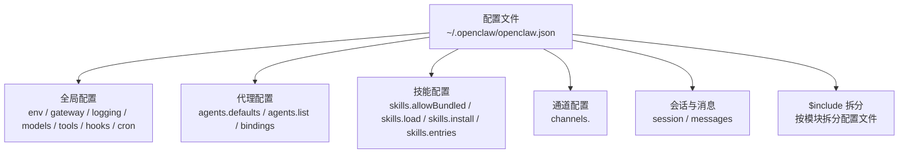
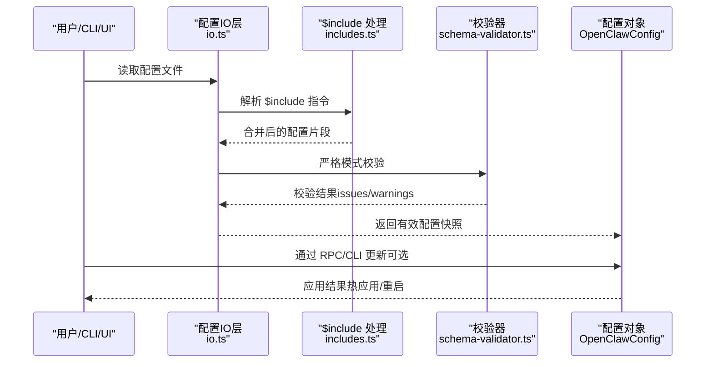
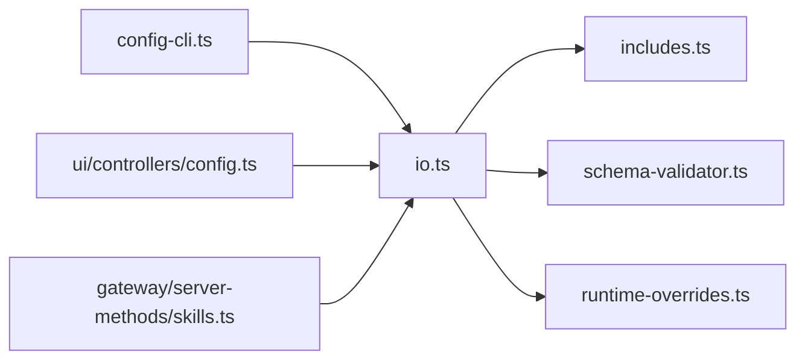

# 技能配置

<cite>
**本文引用的文件**
- [docs/tools/skills-config.md](file://docs/tools/skills-config.md)
- [docs/tools/skills.md](file://docs/tools/skills.md)
- [docs/gateway/configuration.md](file://docs/gateway/configuration.md)
- [docs/gateway/configuration-examples.md](file://docs/gateway/configuration-examples.md)
- [docs/gateway/configuration-reference.md](file://docs/gateway/configuration-reference.md)
- [src/config/io.ts](file://src/config/io.ts)
- [src/config/includes.ts](file://src/config/includes.ts)
- [src/config/includes-scan.ts](file://src/config/includes-scan.ts)
- [src/config/runtime-overrides.ts](file://src/config/runtime-overrides.ts)
- [src/cli/config-cli.ts](file://src/cli/config-cli.ts)
- [src/gateway/server-methods/skills.ts](file://src/gateway/server-methods/skills.ts)
- [src/commands/onboard-skills.ts](file://src/commands/onboard-skills.ts)
- [src/plugins/schema-validator.ts](file://src/plugins/schema-validator.ts)
- [src/gateway/protocol/index.test.ts](file://src/gateway/protocol/index.test.ts)
- [ui/src/ui/controllers/config.ts](file://ui/src/ui/controllers/config.ts)
- [ui/src/ui/views/config.ts](file://ui/src/ui/views/config.ts)
</cite>

## 目录
1. [简介](#简介)
2. [项目结构](#项目结构)
3. [核心组件](#核心组件)
4. [架构总览](#架构总览)
5. [详细组件分析](#详细组件分析)
6. [依赖分析](#依赖分析)
7. [性能考量](#性能考量)
8. [故障排除指南](#故障排除指南)
9. [结论](#结论)
10. [附录](#附录)

## 简介
本指南面向使用 OpenClaw 的技能配置系统，围绕“全局配置、代理配置、技能配置与运行时配置”的层次结构，系统讲解配置文件格式、参数设置方法、继承与覆盖规则、优先级策略，并提供环境变量、API 密钥管理、权限与安全设置等实践建议。读者可据此完成从零到一的技能配置落地，以及在多代理、多平台场景下的规模化部署与维护。

## 项目结构
OpenClaw 的配置体系以 JSON5 文件为主，位于用户主目录的配置路径中；支持按需拆分与包含（$include），并通过严格模式校验保证一致性与安全性。技能配置作为配置树的一个子域，与通道、代理、会话、工具、网关等模块协同工作。

图表来源
- [docs/gateway/configuration.md](file://docs/gateway/configuration.md#L12-L20)
- [docs/tools/skills-config.md](file://docs/tools/skills-config.md#L13-L39)

章节来源
- [docs/gateway/configuration.md](file://docs/gateway/configuration.md#L12-L20)
- [docs/tools/skills-config.md](file://docs/tools/skills-config.md#L13-L39)

## 核心组件
- 全局配置：顶层键空间，定义环境变量注入、网关行为、日志级别、模型与工具策略、自动化任务等。
- 代理配置：定义默认工作区、模型选择、心跳、沙箱、超时、并发、内存检索等；支持多代理与路由绑定。
- 技能配置：集中于 skills 节点，包含允许清单、加载策略、安装偏好、每技能覆盖项（启用、环境变量、API 密钥）。
- 运行时配置：通过 RPC 或 CLI 动态更新，支持热应用或重启生效；并支持运行时覆盖树以临时变更。

章节来源
- [docs/gateway/configuration.md](file://docs/gateway/configuration.md#L36-L59)
- [docs/tools/skills-config.md](file://docs/tools/skills-config.md#L41-L78)
- [src/config/runtime-overrides.ts](file://src/config/runtime-overrides.ts#L46-L91)

## 架构总览
下图展示配置读取、解析、校验与应用的关键流程，以及技能配置在其中的位置与交互。

图表来源
- [src/config/io.ts](file://src/config/io.ts#L940-L972)
- [src/config/includes.ts](file://src/config/includes.ts#L340-L346)
- [src/plugins/schema-validator.ts](file://src/plugins/schema-validator.ts#L106-L131)

章节来源
- [src/config/io.ts](file://src/config/io.ts#L940-L972)
- [src/config/includes.ts](file://src/config/includes.ts#L136-L346)
- [src/plugins/schema-validator.ts](file://src/plugins/schema-validator.ts#L95-L131)

## 详细组件分析

### 技能配置层次与字段
- 位置与范围：技能配置位于全局配置的 skills 节点，影响所有代理与会话。
- 允许清单：仅对“捆绑技能”生效，用于限定可加载的内置技能集合。
- 加载策略：额外扫描目录、是否监听变更、去抖间隔。
- 安装偏好：Node 管理器选择（npm/pnpm/yarn/bun），仅影响技能安装阶段。
- 每技能覆盖：启用/禁用、环境变量注入、API 密钥便捷项（明文或 SecretRef）。

章节来源
- [docs/tools/skills-config.md](file://docs/tools/skills-config.md#L13-L78)

### 技能加载与优先级
- 加载来源与顺序：工作区技能 > 本地/托管技能 > 捆绑技能；额外扫描目录最低优先级。
- 多代理隔离：每个代理拥有独立工作区，其工作区技能优先于共享技能。
- 远程节点：当网关运行在 Linux 上且连接了允许 system.run 的 macOS 节点时，可将该节点上的二进制能力映射为可用技能。

章节来源
- [docs/tools/skills.md](file://docs/tools/skills.md#L13-L40)
- [docs/tools/skills.md](file://docs/tools/skills.md#L248-L253)

### 环境变量与密钥管理
- 环境变量来源：父进程、当前工作目录 .env、全局 ~/.openclaw/.env；不互相覆盖，仅在缺失时生效。
- 配置内注入：可在配置中直接声明 env.vars；支持 `${VAR}` 变量替换。
- SecretRef：支持 env/file/exec 三种来源，统一由 secrets 提供商管理；技能 entries 中的 apiKey 支持 SecretRef。
- 运行时注入：每次代理运行开始时，按需将技能所需的 env/apiKey 注入进程，结束后恢复原环境。

章节来源
- [docs/gateway/configuration.md](file://docs/gateway/configuration.md#L449-L539)
- [docs/tools/skills.md](file://docs/tools/skills.md#L230-L241)
- [docs/tools/skills-config.md](file://docs/tools/skills-config.md#L57-L59)

### 权限控制与安全设置
- 第三方技能视为不受信任代码，建议在沙箱中执行；工作区与额外目录仅接受真实路径限制在根内的技能。
- 通过沙箱镜像或自定义 setup 命令安装所需二进制；避免在宿主环境中泄露敏感信息。
- 对外接口（Webhook/Hook）应采用强令牌与最小暴露面，谨慎开启 unsafe 内容绕过选项。

章节来源
- [docs/tools/skills.md](file://docs/tools/skills.md#L69-L77)
- [docs/gateway/configuration.md](file://docs/gateway/configuration.md#L294-L298)

### 继承、覆盖与优先级规则
- $include 合并：单文件替换、数组文件深合并（后者覆盖前者）、兄弟键后合并覆盖包含内容。
- 运行时覆盖：通过运行时覆盖树临时变更配置，适用于调试或短期策略调整。
- 代理与通道：代理默认值与列表项、通道策略与账户级覆盖共同决定最终行为。

章节来源
- [docs/gateway/configuration.md](file://docs/gateway/configuration.md#L325-L347)
- [src/config/runtime-overrides.ts](file://src/config/runtime-overrides.ts#L46-L91)

### 配置验证与错误处理
- 严格模式：未知键、类型错误、非法值将导致网关拒绝启动；doctor 命令可诊断并自动修复。
- CLI 校验：config validate 输出结构化问题，包含允许值提示；--json 可导出机器可读结果。
- RPC 速率限制：config.apply/config.patch 有速率限制，避免频繁写入。

章节来源
- [docs/gateway/configuration.md](file://docs/gateway/configuration.md#L61-L73)
- [src/cli/config-cli.ts](file://src/cli/config-cli.ts#L232-L244)
- [src/plugins/schema-validator.ts](file://src/plugins/schema-validator.ts#L106-L131)
- [docs/gateway/configuration.md](file://docs/gateway/configuration.md#L389-L447)

### 配置示例场景
- 最小化配置：设置代理工作区与通道白名单即可快速起步。
- 推荐入门：加入身份、模型、群组提及要求等常用项。
- 多平台：同时启用多个通道，按需配置各自策略。
- 安全 DM：多用户 DM 场景下建议使用 per-channel-peer 作用域。
- OAuth 与 API Key 双轨：订阅授权失败时回退至 API Key。
- 本地模型：仅使用本地模型提供者，避免外部依赖。

章节来源
- [docs/gateway/configuration-examples.md](file://docs/gateway/configuration-examples.md#L16-L49)
- [docs/gateway/configuration-examples.md](file://docs/gateway/configuration-examples.md#L448-L638)

### 控制 UI 与 RPC 集成
- 控制 UI：通过 config.get/config.schema 获取配置快照与模式，渲染表单并支持原始 JSON 编辑。
- RPC：支持 config.apply（整包替换）、config.patch（部分合并）、config.validate（离线校验）等。

章节来源
- [ui/src/ui/controllers/config.ts](file://ui/src/ui/controllers/config.ts#L39-L77)
- [ui/src/ui/views/config.ts](file://ui/src/ui/views/config.ts#L405-L420)
- [docs/gateway/configuration.md](file://docs/gateway/configuration.md#L389-L447)

## 依赖分析
- 配置 IO 层负责读取、解析、包含展开、环境变量解析与替换、严格校验与快照生成。
- $include 处理器确保安全与深度限制，防止路径穿越与循环包含。
- 运行时覆盖树提供临时性配置变更能力，便于调试与灰度。
- CLI 与 UI 通过 RPC 与本地 API 与配置系统交互，实现可视化与命令行操作。

图表来源
- [src/config/io.ts](file://src/config/io.ts#L1-L200)
- [src/config/includes.ts](file://src/config/includes.ts#L136-L346)
- [src/config/runtime-overrides.ts](file://src/config/runtime-overrides.ts#L46-L91)
- [src/cli/config-cli.ts](file://src/cli/config-cli.ts#L209-L259)
- [ui/src/ui/controllers/config.ts](file://ui/src/ui/controllers/config.ts#L39-L77)
- [src/gateway/server-methods/skills.ts](file://src/gateway/server-methods/skills.ts#L177-L204)

章节来源
- [src/config/io.ts](file://src/config/io.ts#L1-L200)
- [src/config/includes.ts](file://src/config/includes.ts#L136-L346)
- [src/config/runtime-overrides.ts](file://src/config/runtime-overrides.ts#L46-L91)
- [src/cli/config-cli.ts](file://src/cli/config-cli.ts#L209-L259)
- [ui/src/ui/controllers/config.ts](file://ui/src/ui/controllers/config.ts#L39-L77)
- [src/gateway/server-methods/skills.ts](file://src/gateway/server-methods/skills.ts#L177-L204)

## 性能考量
- 技能快照：会话启动时缓存可用技能列表，后续回合复用；变更生效于新会话或启用监听后下一回合。
- 监视与去抖：可通过 skills.load.watch 与 watchDebounceMs 控制刷新频率与抖动，平衡实时性与资源消耗。
- 环境变量与 SecretRef：尽量使用 SecretRef 与按需注入，减少宿主进程污染与日志泄露风险。

章节来源
- [docs/tools/skills.md](file://docs/tools/skills.md#L242-L247)
- [docs/tools/skills.md](file://docs/tools/skills.md#L254-L267)

## 故障排除指南
- 配置无效无法启动：使用 doctor 命令查看具体问题；根据提示修复未知键、类型或值错误。
- CLI 校验：config validate 输出结构化问题，包含允许值提示；--json 便于自动化集成。
- RPC 限制：config.apply/config.patch 有速率限制，避免频繁写入；必要时增加重试与退避。
- 环境变量缺失：配置中引用的变量未设置时会触发警告或错误；可通过 env.vars 或 .env 补齐。
- $include 错误：路径越界、循环包含、解析失败等均有明确错误信息；检查相对路径与文件存在性。

章节来源
- [docs/gateway/configuration.md](file://docs/gateway/configuration.md#L61-L73)
- [src/cli/config-cli.ts](file://src/cli/config-cli.ts#L232-L244)
- [src/plugins/schema-validator.ts](file://src/plugins/schema-validator.ts#L106-L131)
- [src/gateway/protocol/index.test.ts](file://src/gateway/protocol/index.test.ts#L14-L41)
- [src/config/includes.ts](file://src/config/includes.ts#L190-L222)

## 结论
OpenClaw 的技能配置系统以“可拆分、可校验、可覆盖、可热应用”为核心设计，结合严格的环境变量与密钥管理策略，既满足初学者快速上手，也支持复杂场景下的规模化运维。遵循本文的层次结构、优先级与安全最佳实践，可显著降低配置成本与风险。

## 附录

### 配置文件格式与参数速查
- 全局配置：见“配置参考”中的完整字段说明。
- 技能配置：见“技能配置参考”中的字段与示例。
- 示例合集：见“配置示例”，覆盖最小化、多平台、安全 DM、OAuth 回退、本地模型等场景。

章节来源
- [docs/gateway/configuration-reference.md](file://docs/gateway/configuration-reference.md#L1-L800)
- [docs/tools/skills-config.md](file://docs/tools/skills-config.md#L13-L78)
- [docs/gateway/configuration-examples.md](file://docs/gateway/configuration-examples.md#L1-L638)