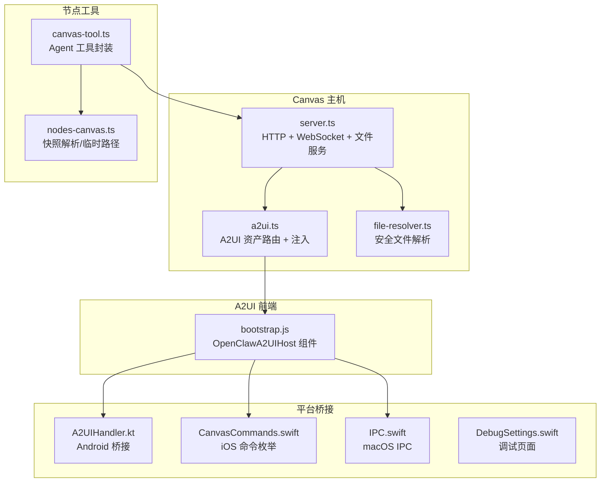
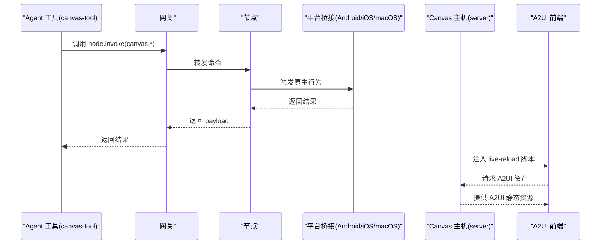
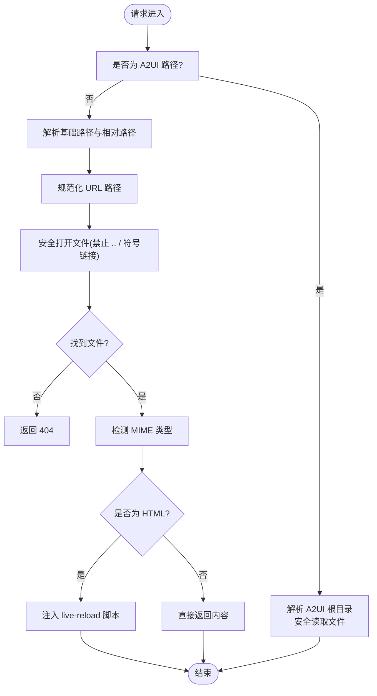
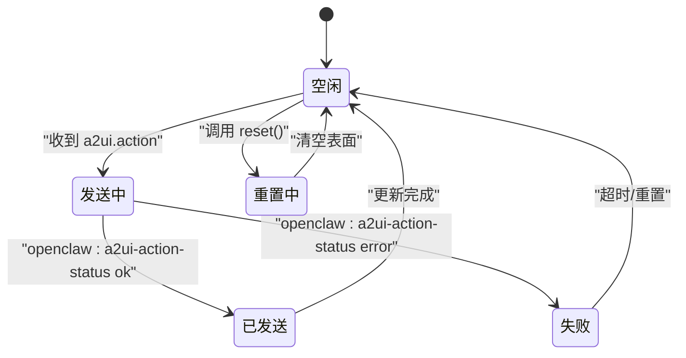
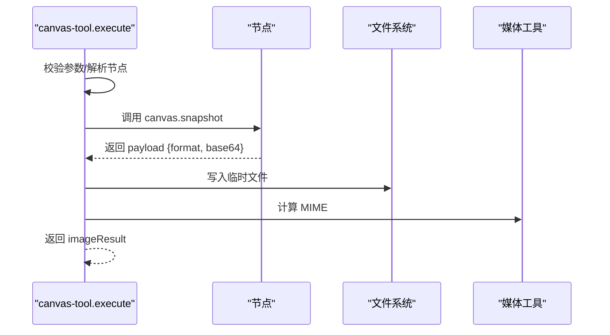
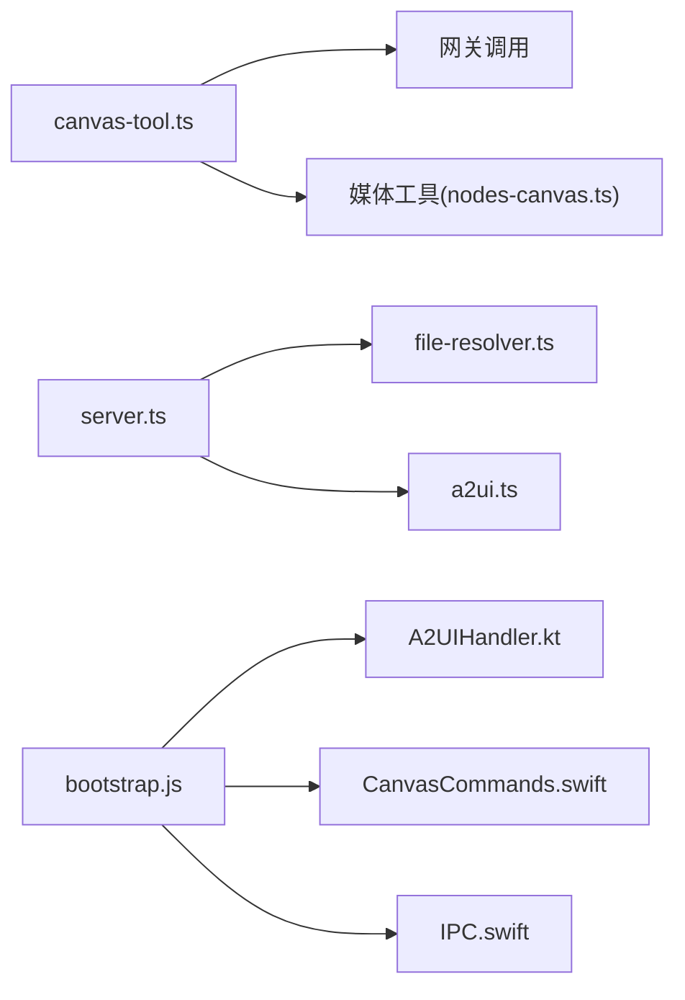

# Canvas 渲染工具

<cite>
**本文档引用的文件**
- [server.ts](file://src/canvas-host/server.ts)
- [a2ui.ts](file://src/canvas-host/a2ui.ts)
- [file-resolver.ts](file://src/canvas-host/file-resolver.ts)
- [canvas-tool.ts](file://src/agents/tools/canvas-tool.ts)
- [nodes-canvas.ts](file://src/cli/nodes-canvas.ts)
- [canvas-capability.ts](file://src/gateway/canvas-capability.ts)
- [bootstrap.js](file://apps/shared/OpenClawKit/Tools/CanvasA2UI/bootstrap.js)
- [A2UI 处理器（Android）](file://apps/android/app/src/main/java/ai/openclaw/app/node/A2UIHandler.kt)
- [Canvas 命令枚举（iOS）](file://apps/shared/OpenClawKit/Sources/OpenClawKit/CanvasCommands.swift)
- [Canvas IPC（macOS）](file://apps/macos/Sources/OpenClawIPC/IPC.swift)
- [Canvas 调试页面（macOS）](file://apps/macos/Sources/OpenClaw/DebugSettings.swift)
- [A2UI 打包脚本](file://apps/shared/OpenClawKit/Tools/CanvasA2UI/rolldown.config.mjs)
- [A2UI 资产复制脚本](file://scripts/canvas-a2ui-copy.ts)
- [Canvas 主机服务器测试](file://src/canvas-host/server.test.ts)
- [Canvas 主机状态目录测试](file://src/canvas-host/server.state-dir.test.ts)
</cite>

## 目录
1. [简介](#简介)
2. [项目结构](#项目结构)
3. [核心组件](#核心组件)
4. [架构总览](#架构总览)
5. [详细组件分析](#详细组件分析)
6. [依赖关系分析](#依赖关系分析)
7. [性能考虑](#性能考虑)
8. [故障排除指南](#故障排除指南)
9. [结论](#结论)
10. [附录](#附录)

## 简介
本文件系统性阐述 Canvas 渲染工具的设计与实现，覆盖 Canvas 主机服务、A2UI 支持、节点渲染与图像处理、配置选项、节点目标选择、渲染流程、A2UI 推送/重置/状态管理、工具与节点通信协议、错误处理与性能优化，以及快照捕获、图像块处理与媒体路径管理等关键技术实现。

## 项目结构
Canvas 渲染工具由“主机服务 + A2UI 前端 + 节点工具 + 平台桥接”构成，核心文件分布如下：
- 主机服务：HTTP 文件服务、WebSocket 实时刷新、A2UI 资产托管
- A2UI 前端：基于 Lit 的可复用 UI 组件与主题系统
- 节点工具：Agent 工具封装，统一调用节点命令
- 平台桥接：iOS/Android/macOS 通过消息通道与 Canvas 交互

**图表来源**
- [server.ts:1-479](file://src/canvas-host/server.ts#L1-L479)
- [a2ui.ts:1-210](file://src/canvas-host/a2ui.ts#L1-L210)
- [file-resolver.ts:1-51](file://src/canvas-host/file-resolver.ts#L1-L51)
- [canvas-tool.ts:1-216](file://src/agents/tools/canvas-tool.ts#L1-L216)
- [nodes-canvas.ts:1-25](file://src/cli/nodes-canvas.ts#L1-L25)
- [bootstrap.js:1-550](file://apps/shared/OpenClawKit/Tools/CanvasA2UI/bootstrap.js#L1-L550)
- [A2UI 处理器（Android）:1-44](file://apps/android/app/src/main/java/ai/openclaw/app/node/A2UIHandler.kt#L1-L44)
- [Canvas 命令枚举（iOS）:1-9](file://apps/shared/OpenClawKit/Sources/OpenClawKit/CanvasCommands.swift#L1-L9)
- [Canvas IPC（macOS）:245-270](file://apps/macos/Sources/OpenClawIPC/IPC.swift#L245-L270)
- [Canvas 调试页面（macOS）:852-896](file://apps/macos/Sources/OpenClaw/DebugSettings.swift#L852-L896)

**章节来源**
- [server.ts:1-479](file://src/canvas-host/server.ts#L1-L479)
- [a2ui.ts:1-210](file://src/canvas-host/a2ui.ts#L1-L210)
- [file-resolver.ts:1-51](file://src/canvas-host/file-resolver.ts#L1-L51)
- [canvas-tool.ts:1-216](file://src/agents/tools/canvas-tool.ts#L1-L216)
- [nodes-canvas.ts:1-25](file://src/cli/nodes-canvas.ts#L1-L25)
- [bootstrap.js:1-550](file://apps/shared/OpenClawKit/Tools/CanvasA2UI/bootstrap.js#L1-L550)
- [A2UI 处理器（Android）:1-44](file://apps/android/app/src/main/java/ai/openclaw/app/node/A2UIHandler.kt#L1-L44)
- [Canvas 命令枚举（iOS）:1-9](file://apps/shared/OpenClawKit/Sources/OpenClawKit/CanvasCommands.swift#L1-L9)
- [Canvas IPC（macOS）:245-270](file://apps/macos/Sources/OpenClawIPC/IPC.swift#L245-L270)
- [Canvas 调试页面（macOS）:852-896](file://apps/macos/Sources/OpenClaw/DebugSettings.swift#L852-L896)

## 核心组件
- Canvas 主机服务：提供静态文件服务、WebSocket 实时刷新、A2UI 资产托管与注入，支持自定义基础路径与热重载策略。
- A2UI 前端：以自定义元素形式承载多表面 UI，负责消息处理、推送/重置、状态提示与跨平台桥接。
- 节点工具：封装 canvas.present/hide/navigate/eval/snapshot/a2ui_push/a2ui_reset 等动作，统一参数校验与网关调用。
- 平台桥接：Android/iOS/macOS 通过消息通道或 IPC 将用户操作转发至节点并接收结果。

**章节来源**
- [server.ts:205-397](file://src/canvas-host/server.ts#L205-L397)
- [a2ui.ts:142-210](file://src/canvas-host/a2ui.ts#L142-L210)
- [canvas-tool.ts:80-216](file://src/agents/tools/canvas-tool.ts#L80-L216)
- [bootstrap.js:214-550](file://apps/shared/OpenClawKit/Tools/CanvasA2UI/bootstrap.js#L214-L550)

## 架构总览
Canvas 渲染工具采用“主机服务 + A2UI 前端 + Agent 工具 + 平台桥接”的分层架构。Agent 工具通过网关调用节点命令；节点通过平台桥接与原生环境交互；A2UI 前端在 Canvas 中渲染 UI 表面并通过 WebSocket 获取实时更新；Canvas 主机负责静态资源与 A2UI 资产的托管与注入。

**图表来源**
- [canvas-tool.ts:99-212](file://src/agents/tools/canvas-tool.ts#L99-L212)
- [server.ts:416-478](file://src/canvas-host/server.ts#L416-L478)
- [a2ui.ts:142-210](file://src/canvas-host/a2ui.ts#L142-L210)
- [bootstrap.js:336-360](file://apps/shared/OpenClawKit/Tools/CanvasA2UI/bootstrap.js#L336-L360)

## 详细组件分析

### Canvas 主机服务
- 功能要点
  - 静态文件服务：安全解析相对路径，拒绝越界与符号链接访问。
  - WebSocket 实时刷新：监听文件变更，向客户端广播 reload。
  - A2UI 资产托管：提供 A2UI 路径前缀，自动注入 live-reload 脚本。
  - 可配置基础路径：支持挂载到任意 basePath。
- 关键实现
  - 文件解析：规范化 URL、安全打开、禁止目录穿越与符号链接。
  - 热重载：Chokidar 监听、写入稳定阈值与轮询间隔、防抖广播。
  - A2UI 注入：在 HTML 中注入 WebSocket 连接与用户动作桥接函数。
- 性能与安全
  - 测试模式下降低等待与轮询阈值，提升反馈速度。
  - 对异常进行降级处理，避免 watcher 异常导致服务不可用。

**图表来源**
- [server.ts:301-397](file://src/canvas-host/server.ts#L301-L397)
- [file-resolver.ts:11-50](file://src/canvas-host/file-resolver.ts#L11-L50)
- [a2ui.ts:142-210](file://src/canvas-host/a2ui.ts#L142-L210)

**章节来源**
- [server.ts:205-397](file://src/canvas-host/server.ts#L205-L397)
- [file-resolver.ts:1-51](file://src/canvas-host/file-resolver.ts#L1-L51)
- [a2ui.ts:1-210](file://src/canvas-host/a2ui.ts#L1-L210)
- [Canvas 主机服务器测试:100-155](file://src/canvas-host/server.test.ts#L100-L155)

### A2UI 支持与状态管理
- 组件职责
  - OpenClawA2UIHost：维护 surfaces、pendingAction、toast 状态，处理用户动作事件与状态回调。
  - 数据处理器：基于 v0_8 的消息处理器，支持多表面与组件上下文解析。
  - 跨平台桥接：通过 WebKit 或 Android JS 接口发送用户动作。
- 状态流转
  - 发送中 → 已发送 → 成功提示；失败 → 错误提示与日志记录。
  - reset 清空所有表面并同步状态。
- UI 特性
  - 自适应布局、主题注入、状态条与吐司提示。

**图表来源**
- [bootstrap.js:378-496](file://apps/shared/OpenClawKit/Tools/CanvasA2UI/bootstrap.js#L378-L496)

**章节来源**
- [bootstrap.js:214-550](file://apps/shared/OpenClawKit/Tools/CanvasA2UI/bootstrap.js#L214-L550)

### 节点渲染与图像处理
- 节点命令
  - present/hide/navigate/eval/snapshot/a2ui_push/a2ui_reset
- 参数与校验
  - 使用 TypeBox Schema 校验参数，支持 target/url 兼容、placement、输出格式、质量、最大宽度等。
- 快照处理
  - 解析 payload，生成临时文件路径，写入 Base64 图像数据，返回图片结果。
- 路径安全
  - 仅允许在受信任的媒体根目录内读取 jsonlPath，防止越权访问。

**图表来源**
- [canvas-tool.ts:162-193](file://src/agents/tools/canvas-tool.ts#L162-L193)
- [nodes-canvas.ts:10-24](file://src/cli/nodes-canvas.ts#L10-L24)

**章节来源**
- [canvas-tool.ts:1-216](file://src/agents/tools/canvas-tool.ts#L1-L216)
- [nodes-canvas.ts:1-25](file://src/cli/nodes-canvas.ts#L1-L25)

### A2UI 推送、重置与状态管理
- 推送
  - 支持直接传入 jsonl 或 jsonlPath，读取并校验后调用 canvas.a2ui.pushJSONL。
- 重置
  - 调用 canvas.a2ui.reset 清空表面。
- 状态管理
  - 组件内部维护 pendingAction 与 toast，监听 openclaw:a2ui-action-status 更新 UI。

**章节来源**
- [canvas-tool.ts:194-212](file://src/agents/tools/canvas-tool.ts#L194-L212)
- [bootstrap.js:378-496](file://apps/shared/OpenClawKit/Tools/CanvasA2UI/bootstrap.js#L378-L496)

### 平台桥接与能力作用域
- Android
  - A2UIHandler：解析 A2UI 主机 URL，确保页面就绪，通过 WebView 桥接发送用户动作。
- iOS
  - CanvasCommands：统一命令枚举，便于在原生侧识别与处理。
- macOS
  - IPC：定义 canvas 相关 IPC 结构，支持 canvasEval/canvasSnapshot/canvasA2UI 等。
- 能力作用域
  - 通过 capability token 生成与 URL 重写，限制访问范围，避免泄露。

**章节来源**
- [A2UI 处理器（Android）:16-44](file://apps/android/app/src/main/java/ai/openclaw/app/node/A2UIHandler.kt#L16-L44)
- [Canvas 命令枚举（iOS）:3-9](file://apps/shared/OpenClawKit/Sources/OpenClawKit/CanvasCommands.swift#L3-L9)
- [Canvas IPC（macOS）:245-270](file://apps/macos/Sources/OpenClawIPC/IPC.swift#L245-L270)
- [canvas-capability.ts:20-87](file://src/gateway/canvas-capability.ts#L20-L87)

## 依赖关系分析
- 组件耦合
  - canvas-tool 依赖网关调用与节点工具解析；与媒体工具协作处理快照。
  - server 与 a2ui 协作提供资产托管与注入；file-resolver 提供安全文件访问。
  - A2UI 前端通过全局桥接函数与平台桥接交互。
- 外部依赖
  - WebSocket 用于实时刷新；Chokidar 用于文件监控；平台消息通道用于用户动作传递。

**图表来源**
- [canvas-tool.ts:99-212](file://src/agents/tools/canvas-tool.ts#L99-L212)
- [server.ts:1-479](file://src/canvas-host/server.ts#L1-L479)
- [a2ui.ts:1-210](file://src/canvas-host/a2ui.ts#L1-L210)
- [file-resolver.ts:1-51](file://src/canvas-host/file-resolver.ts#L1-L51)
- [bootstrap.js:1-550](file://apps/shared/OpenClawKit/Tools/CanvasA2UI/bootstrap.js#L1-L550)
- [A2UI 处理器（Android）:1-44](file://apps/android/app/src/main/java/ai/openclaw/app/node/A2UIHandler.kt#L1-L44)
- [Canvas 命令枚举（iOS）:1-9](file://apps/shared/OpenClawKit/Sources/OpenClawKit/CanvasCommands.swift#L1-L9)
- [Canvas IPC（macOS）:245-270](file://apps/macos/Sources/OpenClawIPC/IPC.swift#L245-L270)

**章节来源**
- [server.ts:1-479](file://src/canvas-host/server.ts#L1-L479)
- [a2ui.ts:1-210](file://src/canvas-host/a2ui.ts#L1-L210)
- [file-resolver.ts:1-51](file://src/canvas-host/file-resolver.ts#L1-L51)
- [canvas-tool.ts:1-216](file://src/agents/tools/canvas-tool.ts#L1-L216)
- [bootstrap.js:1-550](file://apps/shared/OpenClawKit/Tools/CanvasA2UI/bootstrap.js#L1-L550)

## 性能考虑
- 热重载策略
  - 在测试模式下缩短等待与轮询阈值，提升迭代效率；生产默认启用防抖与稳定阈值，减少频繁刷新。
- 文件监控
  - 忽略 dotfiles 与 node_modules，避免无关文件干扰；错误时降级关闭监控并记录告警。
- WebSocket 广播
  - 使用 Set 维护连接，批量发送；异常忽略，保证稳定性。
- A2UI 资产
  - 通过缓存与延迟解析减少重复 IO；缺失时返回 503，便于上层重试。

**章节来源**
- [server.ts:222-285](file://src/canvas-host/server.ts#L222-L285)
- [server.test.ts:243-306](file://src/canvas-host/server.test.ts#L243-L306)

## 故障排除指南
- A2UI 资产未找到
  - 现象：返回 503，提示 A2UI 资产未找到。
  - 处理：确认 A2UI 资产已打包并放置于正确目录；运行打包脚本并复制到 dist。
- 跨平台桥接缺失
  - 现象：发送失败，提示缺少原生桥接。
  - 处理：检查平台侧桥接初始化与 WebView 设置；确保注入的桥接函数可用。
- 文件路径越界
  - 现象：404，提示未找到。
  - 处理：避免使用 ../ 或符号链接；确保路径在安全根目录内。
- 快照解析失败
  - 现象：抛出 invalid canvas.snapshot payload。
  - 处理：确认节点返回的 payload 包含 format 与 base64 字段。
- 调试页面
  - macOS 提供 Canvas 调试页面，可快速验证 Canvas 主机与 A2UI 资产可用性。

**章节来源**
- [a2ui.ts:165-171](file://src/canvas-host/a2ui.ts#L165-L171)
- [bootstrap.js:473-482](file://apps/shared/OpenClawKit/Tools/CanvasA2UI/bootstrap.js#L473-L482)
- [file-resolver.ts:17-19](file://src/canvas-host/file-resolver.ts#L17-L19)
- [nodes-canvas.ts:10-18](file://src/cli/nodes-canvas.ts#L10-L18)
- [Canvas 调试页面（macOS）:852-896](file://apps/macos/Sources/OpenClaw/DebugSettings.swift#L852-L896)

## 结论
Canvas 渲染工具通过清晰的分层设计与严格的安全控制，实现了跨平台的 Canvas 主机服务、A2UI 前端与节点工具的协同工作。其热重载、能力作用域与平台桥接机制提升了开发体验与安全性；快照与媒体路径管理保障了图像处理的可靠性。建议在生产环境中合理配置热重载与监控策略，并持续完善 A2UI 资产的构建与分发流程。

## 附录

### 配置选项与环境变量
- OPENCLAW_SKIP_CANVAS_HOST：禁用 Canvas 主机（测试/CI 场景）
- OPENCLAW_STATE_DIR：指定 Canvas 默认根目录
- OPENCLAW_A2UI_SRC_DIR / OPENCLAW_A2UI_OUT_DIR：A2UI 资产源与输出目录
- OPENCLAW_A2UI_SKIP_MISSING：跳过缺失 A2UI 资产的错误

**章节来源**
- [server.ts:152-166](file://src/canvas-host/server.ts#L152-L166)
- [server.state-dir.test.ts:9-28](file://src/canvas-host/server.state-dir.test.ts#L9-L28)
- [A2UI 资产复制脚本:7-11](file://scripts/canvas-a2ui-copy.ts#L7-L11)

### A2UI 打包与复制
- 打包：使用 rolldown 配置从 UI 工作区解析依赖，输出到 src/canvas-host/a2ui/a2ui.bundle.js。
- 复制：脚本检查 index.html 与 a2ui.bundle.js 是否存在，不存在则抛错或按配置跳过。

**章节来源**
- [A2UI 打包脚本:1-39](file://apps/shared/OpenClawKit/Tools/CanvasA2UI/rolldown.config.mjs#L1-L39)
- [A2UI 资产复制脚本:13-28](file://scripts/canvas-a2ui-copy.ts#L13-L28)