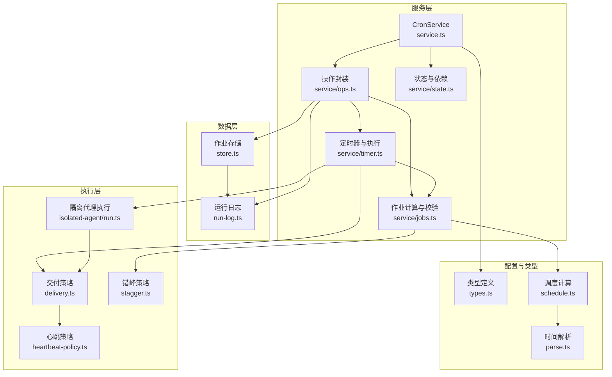
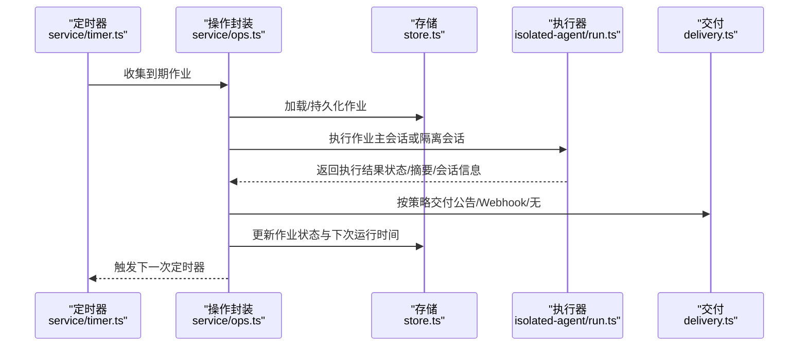
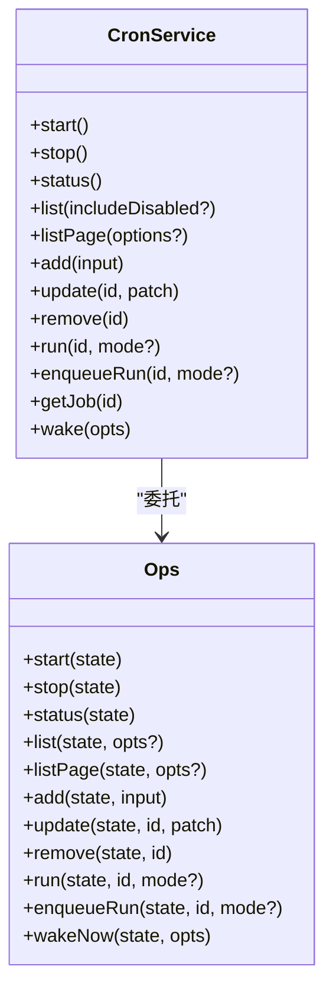
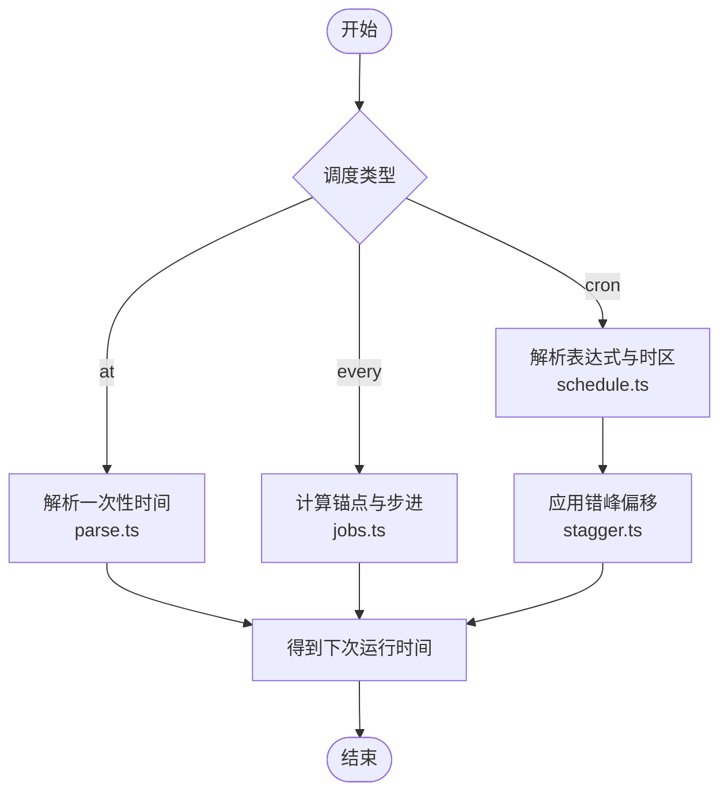
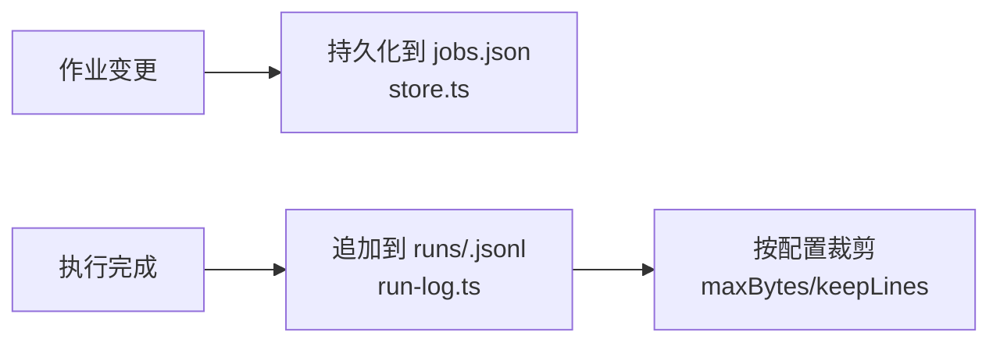
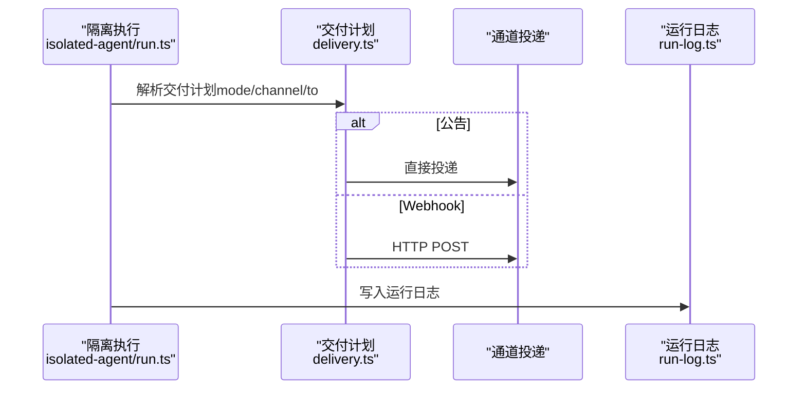
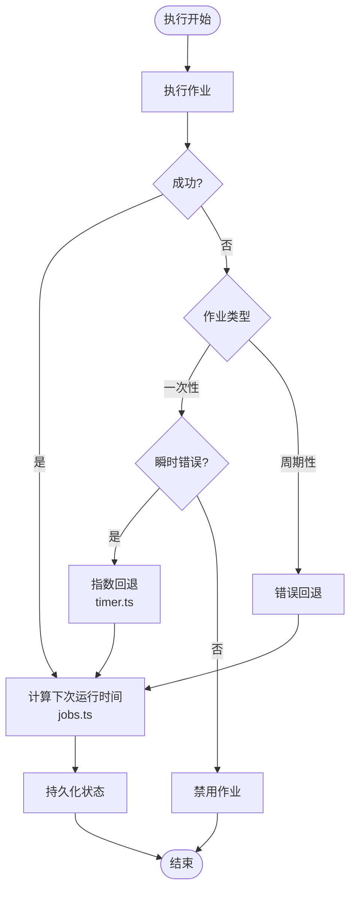
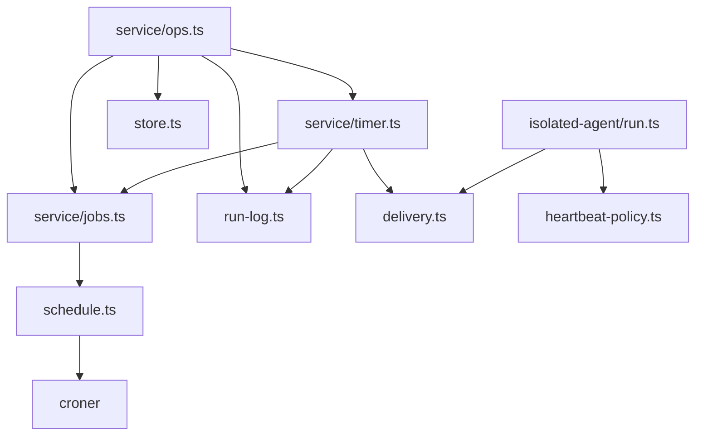

# Cron 调度工具

<cite>
**本文档引用的文件**
- [cron-jobs.md](file://docs/automation/cron-jobs.md)
- [cron.md](file://docs/cli/cron.md)
- [service.ts](file://src/cron/service.ts)
- [types.ts](file://src/cron/types.ts)
- [schedule.ts](file://src/cron/schedule.ts)
- [store.ts](file://src/cron/store.ts)
- [parse.ts](file://src/cron/parse.ts)
- [ops.ts](file://src/cron/service/ops.ts)
- [jobs.ts](file://src/cron/service/jobs.ts)
- [timer.ts](file://src/cron/service/timer.ts)
- [state.ts](file://src/cron/service/state.ts)
- [delivery.ts](file://src/cron/delivery.ts)
- [heartbeat-policy.ts](file://src/cron/heartbeat-policy.ts)
- [stagger.ts](file://src/cron/stagger.ts)
- [run-log.ts](file://src/cron/run-log.ts)
- [isolated-agent.ts](file://src/cron/isolated-agent.ts)
- [run.ts](file://src/cron/isolated-agent/run.ts)
</cite>

## 目录
1. [简介](#简介)
2. [项目结构](#项目结构)
3. [核心组件](#核心组件)
4. [架构总览](#架构总览)
5. [详细组件分析](#详细组件分析)
6. [依赖关系分析](#依赖关系分析)
7. [性能考虑](#性能考虑)
8. [故障排查指南](#故障排查指南)
9. [结论](#结论)
10. [附录](#附录)

## 简介
本文件系统性阐述 Cron 调度工具的设计与实现，覆盖作业生命周期管理（添加、更新、删除、手动执行）、调度策略（一次性、固定间隔、Cron 表达式）、执行机制（主会话与隔离会话）、交付策略（公告、Webhook、无交付）、心跳与轮询、监控与日志、故障恢复与性能优化等。文档同时给出与自动化工具的集成模式与最佳实践。

## 项目结构
Cron 子系统由“服务层 + 数据层 + 执行层 + 交付层 + 配置与运行时”构成，采用模块化设计，职责清晰、边界明确：

- 服务层：对外暴露 CronService，封装增删改查、启动停止、状态查询、手动执行等操作
- 数据层：作业持久化（jobs.json）与运行日志（每个作业一个 .jsonl）
- 执行层：定时器驱动、并发控制、超时策略、重试回退、失败告警
- 交付层：公告投递、Webhook 回调、失败通知、目标解析与去重
- 配置与运行时：会话存储路径、并发限制、超时、失败告警、运行日志裁剪

**图表来源**
- [service.ts:1-61](file://src/cron/service.ts#L1-L61)
- [ops.ts:1-594](file://src/cron/service/ops.ts#L1-L594)
- [state.ts:1-170](file://src/cron/service/state.ts#L1-L170)
- [timer.ts:1-1262](file://src/cron/service/timer.ts#L1-L1262)
- [jobs.ts:1-910](file://src/cron/service/jobs.ts#L1-L910)
- [store.ts:1-132](file://src/cron/store.ts#L1-L132)
- [run-log.ts:1-455](file://src/cron/run-log.ts#L1-L455)
- [run.ts:1-887](file://src/cron/isolated-agent/run.ts#L1-L887)
- [delivery.ts:1-302](file://src/cron/delivery.ts#L1-L302)
- [heartbeat-policy.ts:1-49](file://src/cron/heartbeat-policy.ts#L1-L49)
- [stagger.ts:1-48](file://src/cron/stagger.ts#L1-L48)
- [types.ts:1-160](file://src/cron/types.ts#L1-L160)
- [schedule.ts:1-171](file://src/cron/schedule.ts#L1-L171)
- [parse.ts:1-32](file://src/cron/parse.ts#L1-L32)

**章节来源**
- [service.ts:1-61](file://src/cron/service.ts#L1-L61)
- [store.ts:1-132](file://src/cron/store.ts#L1-L132)
- [run-log.ts:1-455](file://src/cron/run-log.ts#L1-L455)

## 核心组件
- CronService：对外 API 的统一入口，提供 start/stop/status/list/add/update/remove/run/enqueueRun/wake 等方法
- 作业模型与类型：支持 at（一次性）、every（固定间隔）、cron（Cron 表达式）三种调度；支持主会话 systemEvent 与隔离会话 agentTurn 两种执行方式
- 存储与日志：作业持久化到 jobs.json；运行日志按作业写入 runs/<jobId>.jsonl，并支持裁剪
- 定时器与执行：基于 setTimeout 的定时器，按最近一次下次运行时间唤醒；支持并发度限制、超时、错误回退、失败告警
- 交付策略：公告（直接通道投递）、Webhook（HTTP POST）、无交付；支持失败通知目的地与去重
- 错峰与稳定性：对整点类 Cron 表达式默认错峰，避免多网关同时触发导致的负载尖峰

**章节来源**
- [service.ts:7-60](file://src/cron/service.ts#L7-L60)
- [types.ts:5-160](file://src/cron/types.ts#L5-L160)
- [store.ts:9-22](file://src/cron/store.ts#L9-L22)
- [run-log.ts:64-104](file://src/cron/run-log.ts#L64-L104)
- [timer.ts:507-560](file://src/cron/service/timer.ts#L507-L560)
- [delivery.ts:50-102](file://src/cron/delivery.ts#L50-L102)
- [stagger.ts:35-47](file://src/cron/stagger.ts#L35-L47)

## 架构总览
Cron 调度器在网关进程中常驻运行，通过定时器周期性检查到期作业，执行后根据结果更新状态并安排下一次运行时间。执行分为两类：
- 主会话（main）：通过心跳机制在主上下文中执行 systemEvent
- 隔离会话（isolated/current/session:...）：在独立会话中执行 agentTurn，可选择公告或 Webhook 交付

**图表来源**
- [timer.ts:572-731](file://src/cron/service/timer.ts#L572-L731)
- [ops.ts:236-269](file://src/cron/service/ops.ts#L236-L269)
- [store.ts:24-53](file://src/cron/store.ts#L24-L53)
- [run.ts:202-800](file://src/cron/isolated-agent/run.ts#L202-L800)
- [delivery.ts:241-302](file://src/cron/delivery.ts#L241-L302)

## 详细组件分析

### 服务与操作（CronService 与 ops）
- 对外接口：start/stop/status/list/listPage/add/update/remove/run/enqueueRun/wake
- 并发与锁：所有写操作通过 locked 包裹，确保作业状态一致性
- 启动流程：加载作业、清理异常运行标记、重算下次运行时间、启动定时器
- 手动执行：支持 force（强制按当前时间计算）与 due（仅当到期时）两种模式；enqueueRun 将执行放入命令队列异步执行

**图表来源**
- [service.ts:7-60](file://src/cron/service.ts#L7-L60)
- [ops.ts:92-135](file://src/cron/service/ops.ts#L92-L135)

**章节来源**
- [service.ts:7-60](file://src/cron/service.ts#L7-L60)
- [ops.ts:92-135](file://src/cron/service/ops.ts#L92-L135)
- [ops.ts:236-269](file://src/cron/service/ops.ts#L236-L269)
- [ops.ts:542-586](file://src/cron/service/ops.ts#L542-L586)

### 作业模型与调度
- 调度类型：at（一次性）、every（固定间隔）、cron（5/6字段表达式，支持时区）
- 会话目标：main、isolated、current、session:<id>
- 执行负载：主会话使用 systemEvent，隔离会话使用 agentTurn
- 错峰策略：对整点类 Cron 表达式默认错峰（最多5分钟），可通过 staggerMs 或 exact 控制
- 时间解析：支持 ISO 8601、纯数字毫秒、日期/日期时间自动补全时区

**图表来源**
- [schedule.ts:64-139](file://src/cron/schedule.ts#L64-L139)
- [jobs.ts:241-295](file://src/cron/service/jobs.ts#L241-L295)
- [stagger.ts:39-47](file://src/cron/stagger.ts#L39-L47)
- [parse.ts:18-31](file://src/cron/parse.ts#L18-L31)

**章节来源**
- [types.ts:5-16](file://src/cron/types.ts#L5-L16)
- [schedule.ts:1-171](file://src/cron/schedule.ts#L1-L171)
- [jobs.ts:1-120](file://src/cron/service/jobs.ts#L1-L120)
- [stagger.ts:1-48](file://src/cron/stagger.ts#L1-L48)
- [parse.ts:1-32](file://src/cron/parse.ts#L1-L32)

### 存储与日志
- 作业存储：默认路径 ~/.openclaw/cron/jobs.json，支持自定义路径；写入采用原子替换与安全权限设置
- 运行日志：每个作业一个 runs/<jobId>.jsonl，支持按大小与行数裁剪；提供分页读取与过滤
- 维护策略：会话清理（按配置保留窗口清理运行会话）、日志裁剪（默认 2MB/2000 行）

**图表来源**
- [store.ts:24-106](file://src/cron/store.ts#L24-L106)
- [run-log.ts:138-169](file://src/cron/run-log.ts#L138-L169)

**章节来源**
- [store.ts:9-22](file://src/cron/store.ts#L9-L22)
- [store.ts:63-106](file://src/cron/store.ts#L63-L106)
- [run-log.ts:82-104](file://src/cron/run-log.ts#L82-L104)
- [run-log.ts:138-169](file://src/cron/run-log.ts#L138-L169)

### 执行与交付
- 执行策略：
  - 主会话：通过心跳触发 systemEvent，支持立即或等待下一个心跳
  - 隔离会话：在独立会话中执行 agentTurn，支持模型/思考级别/超时/轻量引导等参数
- 交付策略：
  - 公告：直接通过通道适配器投递，支持最佳努力（bestEffort）与失败通知
  - Webhook：POST 完成事件到指定 URL，支持授权头
  - 心跳抑制：对仅心跳响应的内容进行抑制，避免冗余投递
- 失败告警：可配置失败告警阈值与冷却时间，支持公告或 Webhook

**图表来源**
- [run.ts:202-800](file://src/cron/isolated-agent/run.ts#L202-L800)
- [delivery.ts:50-102](file://src/cron/delivery.ts#L50-L102)
- [heartbeat-policy.ts:31-49](file://src/cron/heartbeat-policy.ts#L31-L49)
- [run-log.ts:138-169](file://src/cron/run-log.ts#L138-L169)

**章节来源**
- [run.ts:1-887](file://src/cron/isolated-agent/run.ts#L1-L887)
- [delivery.ts:1-302](file://src/cron/delivery.ts#L1-L302)
- [heartbeat-policy.ts:1-49](file://src/cron/heartbeat-policy.ts#L1-L49)
- [run-log.ts:1-455](file://src/cron/run-log.ts#L1-L455)

### 定时器与重试回退
- 定时器：按最近一次下次运行时间唤醒，最小唤醒间隔为 60 秒，防止时钟跳跃与进程休眠导致的漂移
- 并发：可配置最大并发执行数，默认 1
- 超时：每作业可配置超时，超时以 AbortError 形式处理
- 重试回退：
  - 一次性作业：对瞬时错误（限流/过载/网络/服务器错误）最多重试 3 次，指数回退
  - 周期性作业：连续错误按 30s/1m/5m/15m/60m 回退，成功后重置
- 失败告警：超过阈值且不在冷却期内，发送失败通知

**图表来源**
- [timer.ts:295-474](file://src/cron/service/timer.ts#L295-L474)
- [jobs.ts:241-295](file://src/cron/service/jobs.ts#L241-L295)

**章节来源**
- [timer.ts:114-162](file://src/cron/service/timer.ts#L114-L162)
- [timer.ts:295-474](file://src/cron/service/timer.ts#L295-L474)
- [jobs.ts:305-348](file://src/cron/service/jobs.ts#L305-L348)

### CLI 与配置参考
- CLI：openclaw cron add/edit/run/list/runs 等子命令，支持一次性/周期性/公告/Webhook/错峰等参数
- 配置：cron.enabled、cron.store、maxConcurrentRuns、retry、webhook、webhookToken、sessionRetention、runLog 等
- 文档：cron-jobs.md 提供完整 JSON Schema、示例与运维建议

**章节来源**
- [cron.md:1-78](file://docs/cli/cron.md#L1-L78)
- [cron-jobs.md:442-486](file://docs/automation/cron-jobs.md#L442-L486)
- [cron-jobs.md:695-700](file://docs/automation/cron-jobs.md#L695-L700)

## 依赖关系分析
- 组件耦合：
  - service/ops 依赖 service/jobs、service/timer、store、run-log
  - service/timer 依赖 service/jobs、delivery、run-log、session-reaper
  - isolated-agent/run 依赖 delivery、heartbeat-policy、stagger 等
- 外部依赖：
  - croner：Cron 表达式解析与时区处理
  - JSON5：作业存储解析
  - Node FS：文件读写与原子替换
- 可能的循环依赖：未发现直接循环；各模块职责清晰，通过 state 注入依赖

**图表来源**
- [ops.ts:1-27](file://src/cron/service/ops.ts#L1-L27)
- [timer.ts:1-26](file://src/cron/service/timer.ts#L1-L26)
- [run.ts:1-77](file://src/cron/isolated-agent/run.ts#L1-L77)
- [schedule.ts:1-6](file://src/cron/schedule.ts#L1-L6)

**章节来源**
- [ops.ts:1-27](file://src/cron/service/ops.ts#L1-L27)
- [timer.ts:1-26](file://src/cron/service/timer.ts#L1-L26)
- [run.ts:1-77](file://src/cron/isolated-agent/run.ts#L1-L77)
- [schedule.ts:1-6](file://src/cron/schedule.ts#L1-L6)

## 性能考虑
- 高频调度的 IO 压力：大量隔离运行会产生较多会话与日志文件，建议合理设置 sessionRetention 与 runLog 参数
- 错峰策略：对整点类 Cron 默认错峰，降低尖峰负载
- 并发控制：maxConcurrentRuns 限制同时执行数量，避免资源争用
- 日志裁剪：合理设置 maxBytes/keepLines，避免磁盘膨胀
- 会话清理：定期清理过期运行会话，减少存储占用

**章节来源**
- [cron-jobs.md:505-521](file://docs/automation/cron-jobs.md#L505-L521)
- [stagger.ts:35-47](file://src/cron/stagger.ts#L35-L47)
- [timer.ts:93-99](file://src/cron/service/timer.ts#L93-L99)
- [run-log.ts:82-104](file://src/cron/run-log.ts#L82-L104)

## 故障排查指南
- 无作业运行：检查 cron.enabled 与环境变量 OPENCLAW_SKIP_CRON；确认主机时区与表达式时区一致
- 周期性作业延迟：查看回退时间表（30s/1m/5m/15m/60m），成功后自动重置
- Telegram 投递错误：使用明确的主题格式（-100...:topic:123），避免斜杠分隔
- 子代理公告重试：关注 announceRetryCount，必要时调整目标或会话状态
- 手动执行排队：enqueueRun 成功返回后，实际执行可能因并发或已到期而被跳过，使用 cron runs 查看最终结果

**章节来源**
- [cron-jobs.md:701-728](file://docs/automation/cron-jobs.md#L701-L728)
- [timer.ts:551-558](file://src/cron/service/timer.ts#L551-L558)
- [ops.ts:551-586](file://src/cron/service/ops.ts#L551-L586)

## 结论
Cron 调度工具在网关内核中提供了稳定、可扩展的自动化执行能力。通过清晰的作业模型、可靠的存储与日志、灵活的交付策略与失败告警、以及完善的性能与运维策略，能够满足从简单提醒到复杂周期任务的多样化需求。结合 CLI 与工具调用接口，用户可以便捷地管理作业、监控运行状态并进行故障排查。

## 附录

### 操作接口速查
- 添加作业：cron.add（支持 at/every/cron，主会话/隔离会话，公告/Webhook/无）
- 更新作业：cron.update（支持启用/禁用、调度变更、交付与失败告警变更）
- 删除作业：cron.remove
- 手动执行：cron.run（due/force），cron.enqueueRun（异步排队）
- 查询状态：cron.status，cron.list，cron.runs（按作业或全局分页）

**章节来源**
- [service.ts:33-59](file://src/cron/service.ts#L33-L59)
- [ops.ts:236-342](file://src/cron/service/ops.ts#L236-L342)
- [ops.ts:542-586](file://src/cron/service/ops.ts#L542-L586)
- [cron-jobs.md:695-700](file://docs/automation/cron-jobs.md#L695-L700)

### 集成模式与最佳实践
- 与心跳联动：主会话作业通过 wakeMode 控制是否立即心跳
- 与 Webhook 集成：为外部系统提供回调，支持 Authorization 头
- 与通道集成：公告投递支持多通道与主题路由，注意 Telegram 的目标格式
- 与会话集成：隔离会话可绑定当前或持久化会话，实现上下文延续

**章节来源**
- [cron-jobs.md:145-178](file://docs/automation/cron-jobs.md#L145-L178)
- [cron-jobs.md:222-233](file://docs/automation/cron-jobs.md#L222-L233)
- [delivery.ts:241-302](file://src/cron/delivery.ts#L241-L302)