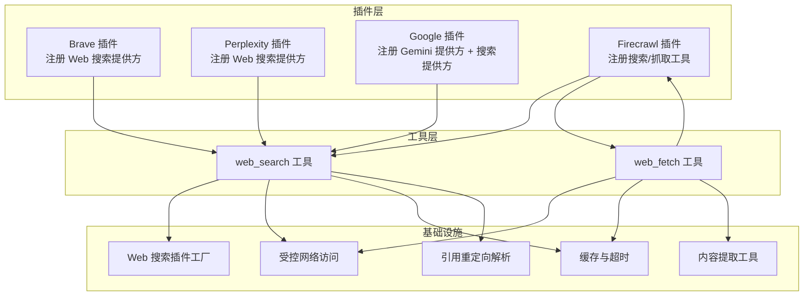
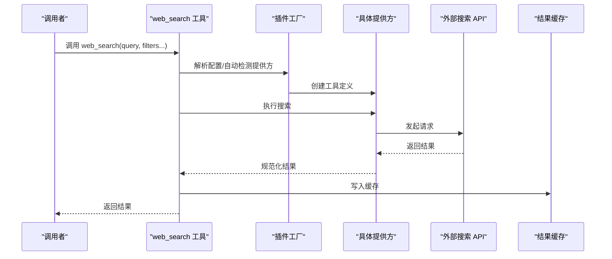
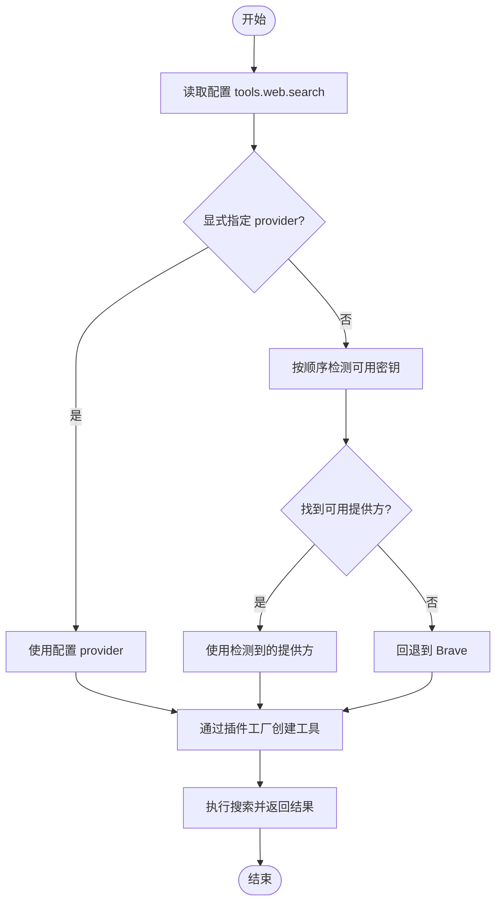
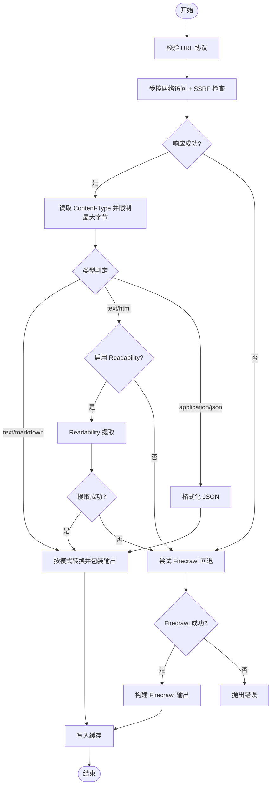
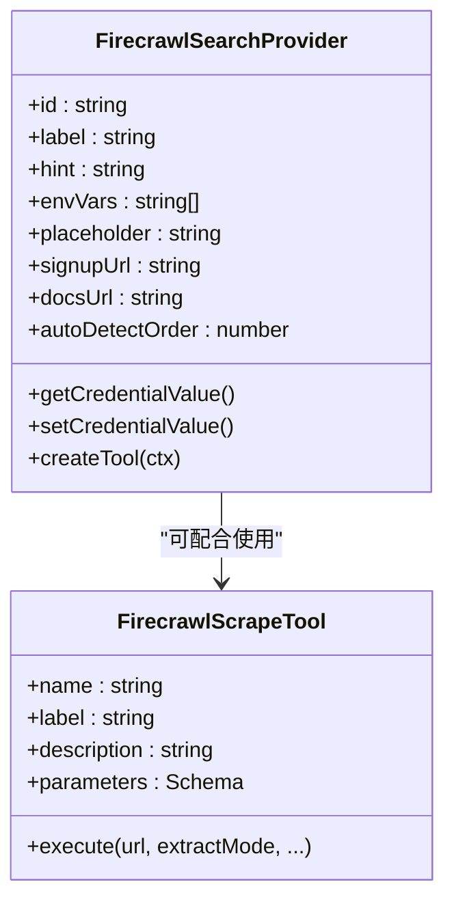
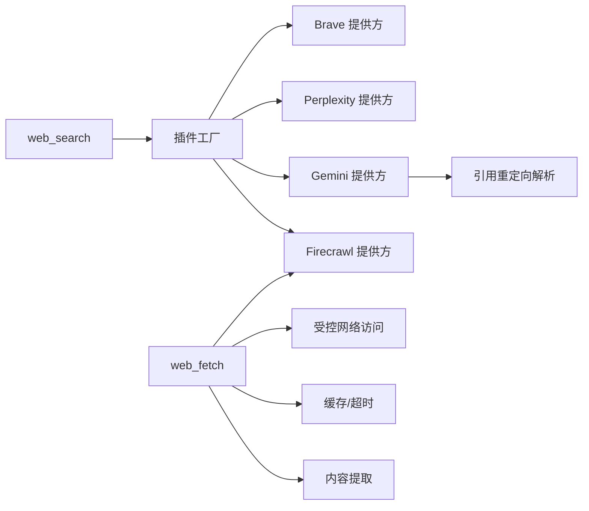

# Web 工具集

<cite>
**本文引用的文件**
- [index.ts](file://extensions/firecrawl/index.ts)
- [index.ts](file://extensions/brave/index.ts)
- [index.ts](file://extensions/perplexity/index.ts)
- [index.ts](file://extensions/google/index.ts)
- [web.md](file://docs/tools/web.md)
- [firecrawl-search-provider.ts](file://extensions/firecrawl/src/firecrawl-search-provider.ts)
- [firecrawl-scrape-tool.ts](file://extensions/firecrawl/src/firecrawl-scrape-tool.ts)
- [web-search-plugin-factory.ts](file://src/agents/tools/web-search-plugin-factory.ts)
- [web-search.ts](file://src/agents/tools/web-search.ts)
- [web-search-core.ts](file://src/agents/tools/web-search-core.ts)
- [web-search-citation-redirect.ts](file://src/agents/tools/web-search-citation-redirect.ts)
- [web-fetch.ts](file://src/agents/tools/web-fetch.ts)
- [web-fetch-utils.ts](file://src/agents/tools/web-fetch-utils.ts)
- [web-guarded-fetch.ts](file://src/agents/tools/web-guarded-fetch.ts)
- [web-shared.ts](file://src/agents/tools/web-shared.ts)
</cite>

## 目录
1. [简介](#简介)
2. [项目结构](#项目结构)
3. [核心组件](#核心组件)
4. [架构总览](#架构总览)
5. [详细组件分析](#详细组件分析)
6. [依赖关系分析](#依赖关系分析)
7. [性能考量](#性能考量)
8. [故障排查指南](#故障排查指南)
9. [结论](#结论)
10. [附录](#附录)

## 简介
本文件系统性阐述 OpenClaw 的 Web 工具集，覆盖网页搜索、内容提取与反爬虫能力。重点包括：
- 多搜索引擎集成：Brave、Perplexity、Gemini（Google Search）、Grok、Kimi、Firecrawl
- 配置选项、API 密钥管理与运行时凭据解析
- 缓存策略与请求频率控制
- 反机器人检测、请求重定向处理与内容过滤
- 安全策略、隐私保护与性能优化

## 项目结构
Web 工具由“插件注册 + 核心工具 + 共享基础设施”三层构成：
- 插件层：各搜索引擎以插件形式注册为 Web 搜索提供方，并可注册专用工具（如 Firecrawl）
- 工具层：统一的 web_search 与 web_fetch 工具，按配置或自动检测选择提供方
- 基础设施层：网络访问守卫、缓存、内容提取、SSRF 防护等共享模块

图表来源
- [index.ts:1-33](file://extensions/brave/index.ts#L1-L33)
- [index.ts:1-34](file://extensions/perplexity/index.ts#L1-L34)
- [index.ts:1-47](file://extensions/google/index.ts#L1-L47)
- [index.ts:1-21](file://extensions/firecrawl/index.ts#L1-L21)
- [web-search-plugin-factory.ts:1-95](file://src/agents/tools/web-search-plugin-factory.ts#L1-L95)
- [web-search.ts:1-149](file://src/agents/tools/web-search.ts#L1-L149)
- [web-fetch.ts:1-807](file://src/agents/tools/web-fetch.ts#L1-L807)
- [web-guarded-fetch.ts](file://src/agents/tools/web-guarded-fetch.ts)
- [web-shared.ts](file://src/agents/tools/web-shared.ts)
- [web-fetch-utils.ts](file://src/agents/tools/web-fetch-utils.ts)
- [web-search-citation-redirect.ts:1-23](file://src/agents/tools/web-search-citation-redirect.ts#L1-L23)

章节来源
- [web.md:1-425](file://docs/tools/web.md#L1-L425)

## 核心组件
- web_search：统一入口，支持多提供方；自动检测可用密钥并选择提供方；结果缓存默认 15 分钟
- web_fetch：HTTP 获取 + 可读内容提取（HTML → markdown/text），默认启用；支持 Firecrawl 回退与缓存
- Firecrawl 工具：firecrawl_search（结构化搜索）、firecrawl_scrape（JS/反爬保护页面抓取）

章节来源
- [web.md:20-425](file://docs/tools/web.md#L20-L425)
- [web-search.ts:97-149](file://src/agents/tools/web-search.ts#L97-L149)
- [web-fetch.ts:734-807](file://src/agents/tools/web-fetch.ts#L734-L807)
- [firecrawl-search-provider.ts:39-63](file://extensions/firecrawl/src/firecrawl-search-provider.ts#L39-L63)
- [firecrawl-scrape-tool.ts:48-90](file://extensions/firecrawl/src/firecrawl-scrape-tool.ts#L48-L90)

## 架构总览
Web 工具的调用链路如下：

图表来源
- [web-search.ts:97-149](file://src/agents/tools/web-search.ts#L97-L149)
- [web-search-plugin-factory.ts:34-59](file://src/agents/tools/web-search-plugin-factory.ts#L34-L59)
- [web-search-core.ts:618-688](file://src/agents/tools/web-search-core.ts#L618-L688)

## 详细组件分析

### 组件一：Web 搜索（web_search）
- 自动检测顺序：Brave → Gemini → Grok → Kimi → Perplexity → Firecrawl（若启用）
- 支持参数与过滤器因提供方而异（见下表）
- 结果缓存：默认 TTL 15 分钟，可通过配置调整

图表来源
- [web-search.ts:66-95](file://src/agents/tools/web-search.ts#L66-L95)
- [web-search.ts:115-125](file://src/agents/tools/web-search.ts#L115-L125)
- [web-search-plugin-factory.ts:34-59](file://src/agents/tools/web-search-plugin-factory.ts#L34-L59)

章节来源
- [web.md:42-53](file://docs/tools/web.md#L42-L53)
- [web-search.ts:17-33](file://src/agents/tools/web-search.ts#L17-L33)
- [web-search.ts:66-95](file://src/agents/tools/web-search.ts#L66-L95)

#### 参数与过滤器（摘要）
- 通用：query、count（1-10）
- Brave：country、language、ui_lang、search_lang、time 过滤
- Perplexity：freshness、date_after/date_before、domain_filter、max_tokens、max_tokens_per_page
- 其他：country、language、freshness、date_after、date_before

章节来源
- [web.md:299-315](file://docs/tools/web.md#L299-L315)
- [web-search-core.ts:167-297](file://src/agents/tools/web-search-core.ts#L167-L297)

### 组件二：网页抓取（web_fetch）
- 默认行为：HTTP GET + Readability 主内容提取；失败时尝试 Firecrawl 回退
- 关键配置：maxChars、maxResponseBytes、timeoutSeconds、cacheTtlMinutes、maxRedirects、userAgent、readability
- Firecrawl 集成：仅在启用且有密钥时激活；支持 onlyMainContent、maxAgeMs、proxy、storeInCache、timeoutSeconds

图表来源
- [web-fetch.ts:514-700](file://src/agents/tools/web-fetch.ts#L514-L700)
- [web-fetch.ts:702-715](file://src/agents/tools/web-fetch.ts#L702-L715)
- [web-guarded-fetch.ts](file://src/agents/tools/web-guarded-fetch.ts)
- [web-shared.ts](file://src/agents/tools/web-shared.ts)

章节来源
- [web.md:364-425](file://docs/tools/web.md#L364-L425)
- [web-fetch.ts:84-97](file://src/agents/tools/web-fetch.ts#L84-L97)
- [web-fetch.ts:129-138](file://src/agents/tools/web-fetch.ts#L129-L138)

### 组件三：Firecrawl 集成
- Firecrawl 搜索提供方：结构化结果 + 可选结果抓取
- Firecrawl 抓取工具：JS/反爬保护页面抓取，支持代理模式、缓存年龄、超时等

图表来源
- [firecrawl-search-provider.ts:39-63](file://extensions/firecrawl/src/firecrawl-search-provider.ts#L39-L63)
- [firecrawl-scrape-tool.ts:48-90](file://extensions/firecrawl/src/firecrawl-scrape-tool.ts#L48-L90)
- [index.ts:1-21](file://extensions/firecrawl/index.ts#L1-L21)

章节来源
- [web.md:129-155](file://docs/tools/web.md#L129-L155)
- [firecrawl-search-provider.ts:1-64](file://extensions/firecrawl/src/firecrawl-search-provider.ts#L1-L64)
- [firecrawl-scrape-tool.ts:1-90](file://extensions/firecrawl/src/firecrawl-scrape-tool.ts#L1-L90)

### 组件四：搜索引擎插件
- Brave：结构化结果，支持国家/语言/时间过滤；支持 LLM 上下文模式
- Perplexity：结构化结果，支持域名过滤与内容预算控制；兼容 OpenRouter/Sonar
- Google/Gemini：基于 Google Search 的 AI 合成答案 + 引用；引用 URL 经重定向解析与 SSRF 限制
- Grok/Kimi：AI 合成答案 + 引用（Moonshot Web 搜索）

章节来源
- [web.md:31-51](file://docs/tools/web.md#L31-L51)
- [web-search-core.ts:30-46](file://src/agents/tools/web-search-core.ts#L30-L46)
- [web-search-citation-redirect.ts:1-23](file://src/agents/tools/web-search-citation-redirect.ts#L1-L23)
- [index.ts:1-33](file://extensions/brave/index.ts#L1-L33)
- [index.ts:1-34](file://extensions/perplexity/index.ts#L1-L34)
- [index.ts:1-47](file://extensions/google/index.ts#L1-L47)

## 依赖关系分析
- 插件注册：各搜索引擎通过插件注册 Web 搜索提供方；Firecrawl 插件额外注册专用工具
- 工具创建：web_search 通过插件工厂创建具体工具；web_fetch 为独立工具
- 基础设施：网络访问守卫统一处理 SSRF、重定向与超时；缓存统一管理 TTL；内容提取工具提供 HTML/JSON/markdown 转换

图表来源
- [web-search-plugin-factory.ts:34-59](file://src/agents/tools/web-search-plugin-factory.ts#L34-L59)
- [web-search.ts:115-131](file://src/agents/tools/web-search.ts#L115-L131)
- [web-fetch.ts:1-807](file://src/agents/tools/web-fetch.ts#L1-L807)
- [web-guarded-fetch.ts](file://src/agents/tools/web-guarded-fetch.ts)
- [web-shared.ts](file://src/agents/tools/web-shared.ts)
- [web-search-citation-redirect.ts:1-23](file://src/agents/tools/web-search-citation-redirect.ts#L1-L23)

章节来源
- [web-search.ts:1-149](file://src/agents/tools/web-search.ts#L1-L149)
- [web-fetch.ts:1-807](file://src/agents/tools/web-fetch.ts#L1-L807)

## 性能考量
- 缓存策略：web_search 与 web_fetch 均支持缓存，默认 TTL 15 分钟；可通过配置调整
- 请求超时：默认超时 30 秒，可按工具或提供方配置覆盖
- 最大响应字节：web_fetch 对响应体大小进行上限控制，避免内存压力
- Firecrawl 回退：在 Readability 失败或不可用时自动回退，提升成功率
- 用户代理与 Accept-Language：默认模拟现代浏览器头部，提高兼容性

章节来源
- [web.md:23-24](file://docs/tools/web.md#L23-L24)
- [web.md:286-289](file://docs/tools/web.md#L286-L289)
- [web.md:384-386](file://docs/tools/web.md#L384-L386)
- [web.md:412-413](file://docs/tools/web.md#L412-L413)
- [web-shared.ts](file://src/agents/tools/web-shared.ts)
- [web-fetch.ts:117-127](file://src/agents/tools/web-fetch.ts#L117-L127)
- [web-fetch.ts:756-759](file://src/agents/tools/web-fetch.ts#L756-L759)

## 故障排查指南
- 缺失 API 密钥：当未配置任一提供方密钥时，会返回缺失密钥提示并指向文档链接
- SSRF 限制：web_fetch 在网络守卫中对私有/内部主机名进行阻断；引用重定向解析采用严格 SSRF 策略
- 错误信息包装：web_fetch 将错误详情进行包装与截断，便于安全输出
- Firecrawl 回退：若启用且密钥有效，web_fetch 会在主流程失败时尝试 Firecrawl 抓取
- 配置优先级：环境变量优先于配置字段；SecretRef 在启动/重载时原子解析

章节来源
- [web-search-core.ts:578-616](file://src/agents/tools/web-search-core.ts#L578-L616)
- [web-guarded-fetch.ts](file://src/agents/tools/web-guarded-fetch.ts)
- [web-search-citation-redirect.ts:1-23](file://src/agents/tools/web-search-citation-redirect.ts#L1-L23)
- [web-fetch.ts:219-237](file://src/agents/tools/web-fetch.ts#L219-L237)
- [web-fetch.ts:561-564](file://src/agents/tools/web-fetch.ts#L561-L564)
- [web.md:55-59](file://docs/tools/web.md#L55-L59)

## 结论
OpenClaw 的 Web 工具集通过插件化架构实现了多搜索引擎统一接入与灵活配置，结合缓存、受控网络访问与内容提取，既满足轻量网页检索需求，又能在复杂站点场景下通过 Firecrawl 提升抓取成功率。自动检测与 SecretRef 支持降低了部署门槛，同时通过 SSRF 与重定向解析保障了安全性。

## 附录

### 配置要点与最佳实践
- 使用 `openclaw configure --section web` 存储各提供方密钥至对应配置路径
- 优先使用环境变量或 SecretRef，避免明文硬编码
- 合理设置 maxChars、maxResponseBytes、timeoutSeconds 以平衡质量与性能
- 在高并发场景下适当提高 cacheTtlMinutes，减少重复请求

章节来源
- [web.md:87-109](file://docs/tools/web.md#L87-L109)
- [web.md:111-155](file://docs/tools/web.md#L111-L155)
- [web.md:277-293](file://docs/tools/web.md#L277-L293)
- [web.md:374-402](file://docs/tools/web.md#L374-L402)