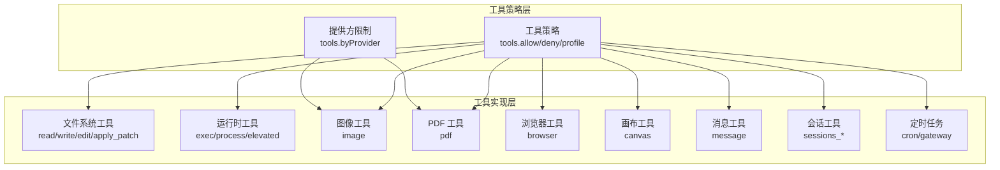
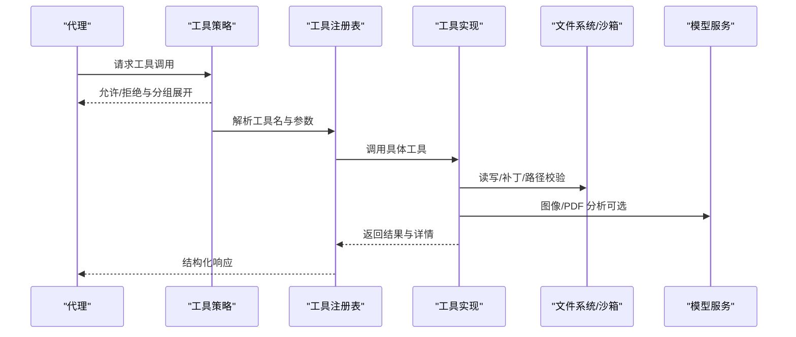
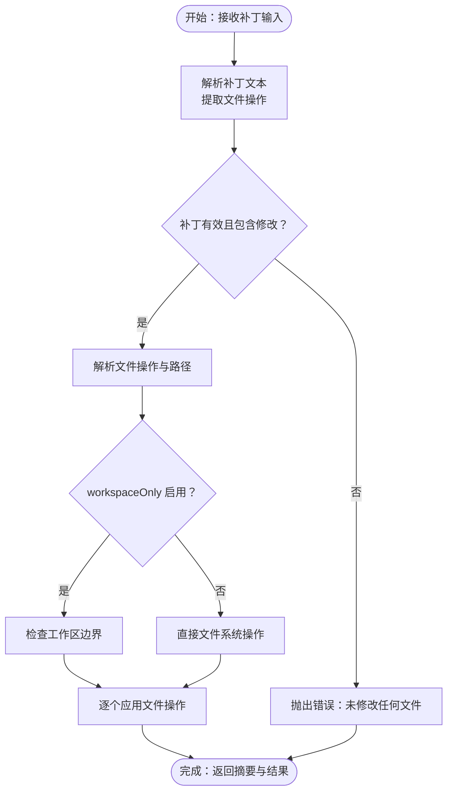
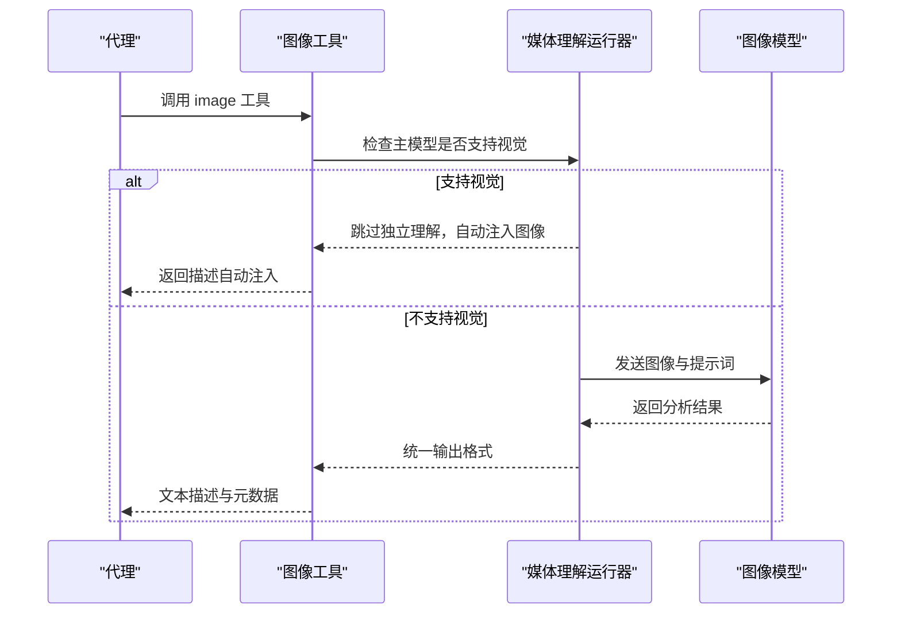
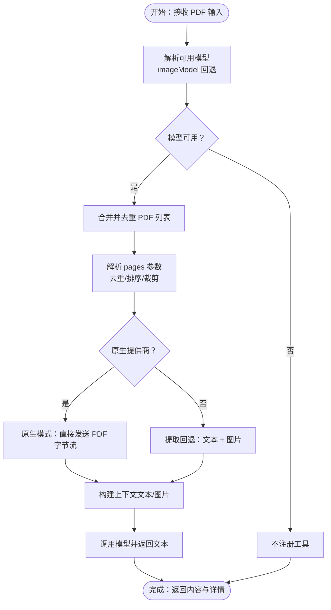
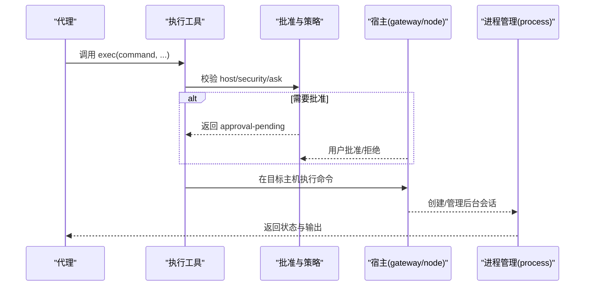
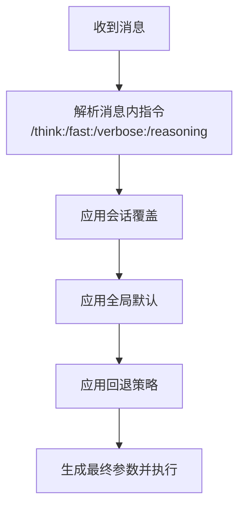
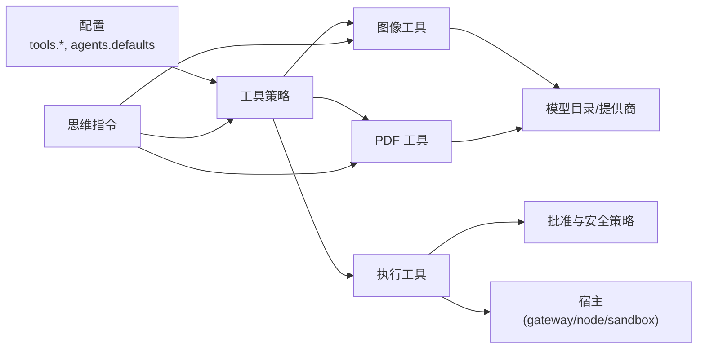

# 实用工具集

<cite>
**本文引用的文件**
- [工具索引](file://docs/tools/index.md)
- [应用补丁工具](file://docs/tools/apply-patch.md)
- [PDF 工具](file://docs/tools/pdf.md)
- [执行工具](file://docs/tools/exec.md)
- [思维级别](file://docs/tools/thinking.md)
- [节点图像支持](file://docs/nodes/images.md)
- [应用补丁实现](file://src/agents/apply-patch.ts)
- [图像工具实现](file://src/agents/tools/image-tool.ts)
- [PDF 工具实现](file://src/agents/tools/pdf-tool.ts)
- [PDF 提取实现](file://src/media/pdf-extract.ts)
- [媒体理解运行器](file://src/media-understanding/runner.ts)
- [思维指令解析](file://src/auto-reply/reply.directive.parse.test.ts)
- [思维级别解析](file://src/auto-reply/reply/directive-handling.levels.ts)
</cite>

## 目录
1. [简介](#简介)
2. [项目结构](#项目结构)
3. [核心组件](#核心组件)
4. [架构总览](#架构总览)
5. [详细组件分析](#详细组件分析)
6. [依赖关系分析](#依赖关系分析)
7. [性能考虑](#性能考虑)
8. [故障排除指南](#故障排除指南)
9. [结论](#结论)

## 简介
本文件为实用工具集的综合文档，聚焦以下能力：
- 文件系统操作：读写、编辑、补丁应用与工作区边界控制
- 代码补丁应用：多文件/多块补丁的结构化应用，实验性开关与工作区限制
- 图像分析：图像模型配置、原生视觉能力检测与自动注入、输出格式
- PDF 处理：原生提供商模式与提取回退模式、页面过滤、文本转录与图片渲染
- 执行工具：命令执行、会话管理、权限控制与安全策略
- 思维工具：思考级别、快速模式、详细日志与推理可见性

## 项目结构
实用工具集以“工具即一等公民”的理念组织，通过统一的工具策略（允许/禁止、分组、按提供方限制）暴露给代理。核心工具包括：
- 文件系统类：read、write、edit、apply_patch
- 运行时类：exec、process、elevated
- 媒体类：image、pdf
- 浏览器与画布：browser、canvas
- 会话与消息：sessions_*、message
- 定时任务：cron、gateway

图表来源
- [工具索引:179-578](file://docs/tools/index.md#L179-L578)

章节来源
- [工具索引:1-578](file://docs/tools/index.md#L1-L578)

## 核心组件
- 工具策略与分组
  - 全局/代理级 allow/deny 与 profile（minimal、coding、messaging、full）
  - 分组快捷方式：group:fs、group:runtime、group:sessions、group:ui、group:web、group:automation、group:messaging、group:nodes、group:openclaw
  - 按提供方限制：tools.byProvider 支持 provider 或 provider/model 键
- 工具清单与行为
  - apply_patch：结构化补丁应用，实验性，默认禁用；支持 workspaceOnly 限制
  - exec/process：命令执行与后台会话管理，支持 host/target、安全策略、批准流程
  - image：图像分析，支持单张或多张，支持模型覆盖与大小限制
  - pdf：PDF 分析，原生提供商模式与提取回退模式，支持页面过滤
  - browser/canvas/nodes：浏览器控制、节点画布与设备交互
  - message/sessions_*：消息发送与会话管理
  - cron/gateway：定时任务与网关更新

章节来源
- [工具索引:15-578](file://docs/tools/index.md#L15-L578)
- [应用补丁工具:1-52](file://docs/tools/apply-patch.md#L1-L52)
- [执行工具:1-205](file://docs/tools/exec.md#L1-L205)
- [PDF 工具:1-157](file://docs/tools/pdf.md#L1-L157)

## 架构总览
工具调用从代理到工具注册表，再进入具体实现。策略层在调用前进行匹配与限制，实现层负责实际操作与错误处理。

图表来源
- [工具索引:179-578](file://docs/tools/index.md#L179-L578)
- [应用补丁实现:92-123](file://src/agents/apply-patch.ts#L92-L123)
- [图像工具实现:270-303](file://src/agents/tools/image-tool.ts#L270-L303)
- [PDF 工具实现:113-527](file://src/agents/tools/pdf-tool.ts#L113-L527)

## 详细组件分析

### 文件系统操作与补丁应用
- 工作区边界与权限
  - apply_patch 默认仅限工作区（workspaceOnly=true），可通过配置关闭以允许跨目录写入/删除
  - 沙箱模式下对路径进行严格校验，防止逃逸
- 补丁格式与应用
  - 支持多文件、多块补丁，包含添加/更新/删除/重命名等操作
  - 实验性启用：需在工具策略中开启 applyPatch，并限定模型为 OpenAI 系列
- 错误与安全
  - 输入为空或无修改时抛出明确错误
  - 沙箱外写入被拒绝，确保隔离

图表来源
- [应用补丁实现:125-329](file://src/agents/apply-patch.ts#L125-L329)
- [应用补丁工具:29-42](file://docs/tools/apply-patch.md#L29-L42)

章节来源
- [应用补丁实现:92-329](file://src/agents/apply-patch.ts#L92-L329)
- [应用补丁工具:1-52](file://docs/tools/apply-patch.md#L1-L52)

### 图像分析工具
- 配置与模型选择
  - 通过 agents.defaults.imageModel 指定主模型与回退列表
  - 若主模型具备原生视觉能力，则自动将图像注入上下文，工具描述会提示避免冗余调用
- 输入与输出
  - 单图或多图（最多 20 张），支持路径或 URL
  - 输出为文本描述与提供商信息，包含尝试记录
- 限制与优化
  - 可设置最大字节数限制
  - 当主模型支持视觉时跳过独立图像理解，减少开销

图表来源
- [图像工具实现:270-303](file://src/agents/tools/image-tool.ts#L270-L303)
- [媒体理解运行器:707-741](file://src/media-understanding/runner.ts#L707-L741)

章节来源
- [图像工具实现:270-303](file://src/agents/tools/image-tool.ts#L270-L303)
- [媒体理解运行器:707-741](file://src/media-understanding/runner.ts#L707-L741)
- [节点图像支持:1-73](file://docs/nodes/images.md#L1-L73)

### PDF 处理工具
- 可用性与输入
  - 仅在能解析到可用 PDF 模型时注册（优先 imageModel 回退）
  - 支持单个或多个 PDF，最多 10 个/次调用
- 执行模式
  - 原生提供商模式：Anthropic、Google，直接发送原始 PDF 字节流，不支持 pages 参数
  - 提取回退模式：先提取文本，若文本不足则渲染页面为 PNG，再发送至模型
- 页面过滤与限制
  - pages 支持 1 基数范围与去重排序，受最大页数限制
  - 像素预算固定，避免过度渲染
- 配置项
  - pdfModel.primary/fallbacks、pdfMaxBytesMb、pdfMaxPages
- 输出与错误
  - 返回文本内容与 details（模型、是否原生、重写路径等）
  - 明确的错误类型：缺少输入、过多 PDF、不支持的引用方案、原生模式下使用 pages

图表来源
- [PDF 工具实现:113-527](file://src/agents/tools/pdf-tool.ts#L113-L527)
- [PDF 提取实现:84-104](file://src/media/pdf-extract.ts#L84-L104)
- [PDF 工具:1-157](file://docs/tools/pdf.md#L1-L157)

章节来源
- [PDF 工具实现:113-527](file://src/agents/tools/pdf-tool.ts#L113-L527)
- [PDF 提取实现:84-104](file://src/media/pdf-extract.ts#L84-L104)
- [PDF 工具:1-157](file://docs/tools/pdf.md#L1-L157)

### 执行工具与安全策略
- 参数与行为
  - command 必填；支持 workdir、env、yieldMs、background、timeout、pty、host、security、ask、node、elevated
  - 若 process 不可用，exec 将同步执行并忽略 yieldMs/background
- 安全与权限
  - host=gateway/node 时需要批准与安全策略（deny/allowlist/full）
  - 禁止环境注入（如 LD_*、DYLD_*），拒绝 env.PATH 与加载器覆盖
  - sandbox 关闭时，显式请求 sandbox 将失败
- 路径与环境
  - 不同 host 的 PATH 合并与注入策略不同，sandbox 下可使用 pathPrepend
- 会话覆盖与授权
  - /exec 可设置会话级默认值，仅授权发送者生效
- 应用补丁（实验性子工具）
  - 作为 exec 的子工具启用，仅支持 OpenAI 系列模型，可配置 allowModels

图表来源
- [执行工具:1-205](file://docs/tools/exec.md#L1-L205)
- [应用补丁工具:184-205](file://docs/tools/apply-patch.md#L184-L205)

章节来源
- [执行工具:1-205](file://docs/tools/exec.md#L1-L205)
- [应用补丁工具:184-205](file://docs/tools/apply-patch.md#L184-L205)

### 思维工具与指令
- 思考级别（/think）
  - 支持 off/minimal/low/medium/high/xhigh/adaptive 等别名
  - 解析顺序：消息内指令 → 会话覆盖 → 全局默认 → 回退策略
  - 不同提供商默认与映射不同（如 Anthropic 4.6 默认 adaptive，Z.AI 二元映射等）
- 快速模式（/fast）
  - on/off，按模型应用相应低延迟配置
- 详细日志（/verbose）
  - on（最小）/full/off，影响工具摘要与输出转发
- 推理可见性（/reasoning）
  - on/off/stream，控制推理消息是否随回复单独发送

图表来源
- [思维级别:1-94](file://docs/tools/thinking.md#L1-L94)
- [思维指令解析:46-84](file://src/auto-reply/reply.directive.parse.test.ts#L46-L84)
- [思维级别解析:1-36](file://src/auto-reply/reply/directive-handling.levels.ts#L1-L36)

章节来源
- [思维级别:1-94](file://docs/tools/thinking.md#L1-L94)
- [思维指令解析:46-84](file://src/auto-reply/reply.directive.parse.test.ts#L46-L84)
- [思维级别解析:1-36](file://src/auto-reply/reply/directive-handling.levels.ts#L1-L36)

## 依赖关系分析
- 工具策略依赖于配置（tools.allow/deny/profile/byProvider）与代理配置（agents.defaults.*）
- 图像与 PDF 工具依赖模型目录与提供商能力（是否支持视觉/文档输入）
- 执行工具依赖批准策略与安全策略，以及宿主环境（gateway/node/sandbox）
- 思维指令解析贯穿消息处理链路，影响后续推理与输出格式

图表来源
- [工具索引:179-578](file://docs/tools/index.md#L179-L578)
- [图像工具实现:270-303](file://src/agents/tools/image-tool.ts#L270-L303)
- [PDF 工具实现:113-527](file://src/agents/tools/pdf-tool.ts#L113-L527)
- [执行工具:1-205](file://docs/tools/exec.md#L1-L205)
- [思维级别:1-94](file://docs/tools/thinking.md#L1-L94)

章节来源
- [工具索引:179-578](file://docs/tools/index.md#L179-L578)
- [图像工具实现:270-303](file://src/agents/tools/image-tool.ts#L270-L303)
- [PDF 工具实现:113-527](file://src/agents/tools/pdf-tool.ts#L113-L527)
- [执行工具:1-205](file://docs/tools/exec.md#L1-L205)
- [思维级别:1-94](file://docs/tools/thinking.md#L1-L94)

## 性能考虑
- 图像分析
  - 主模型具备视觉能力时跳过独立理解，减少往返与计算
  - 限制并发与附件数量，避免超大文件
- PDF 处理
  - 原生提供商模式避免本地渲染，提升吞吐
  - 提取回退模式采用像素预算控制图片渲染成本
- 执行工具
  - 后台会话与进程管理降低阻塞
  - 安全策略与批准流程避免高风险操作

## 故障排除指南
- apply_patch
  - 未提供输入或无修改：抛出错误
  - 沙箱外写入被拒：检查 workspaceOnly 设置与路径
- PDF 工具
  - 缺少输入或超过数量限制：检查 pdf/pdfs 参数
  - 原生提供商使用 pages：移除 pages 或更换模型
  - 不支持的引用方案：使用 file://、http(s)://
- 执行工具
  - host=node 无配对节点：确认节点绑定与连接
  - 安全策略拒绝：调整 tools.exec.security 或获得批准
  - PATH 注入被拒绝：使用 pathPrepend 或标准安装路径
- 思维指令
  - 无效级别：检查别名与提供商支持情况
  - 会话覆盖未生效：确认指令位置与权限

章节来源
- [应用补丁实现:92-123](file://src/agents/apply-patch.ts#L92-L123)
- [PDF 工具实现:486-510](file://src/agents/tools/pdf-tool.ts#L486-L510)
- [执行工具:1-205](file://docs/tools/exec.md#L1-L205)
- [思维级别:1-94](file://docs/tools/thinking.md#L1-L94)

## 结论
实用工具集通过统一的策略层与模块化的实现层，提供了安全、可控且高效的文件系统、图像分析、PDF 处理与执行能力。结合思维指令与会话工具，能够满足从开发到运维的多样化需求。建议在生产环境中：
- 明确工具策略与提供方限制
- 合理配置工作区边界与安全策略
- 优先使用原生提供商模式处理 PDF 与图像
- 通过批准与审计流程保障执行工具的安全性