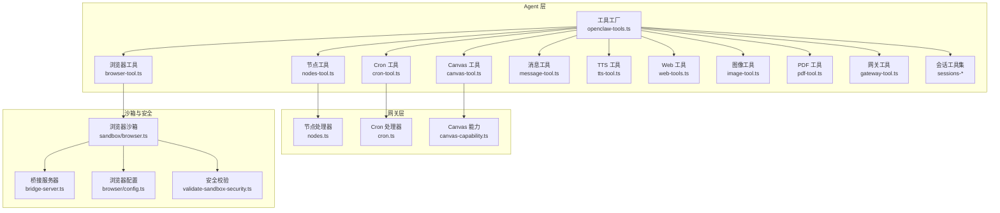
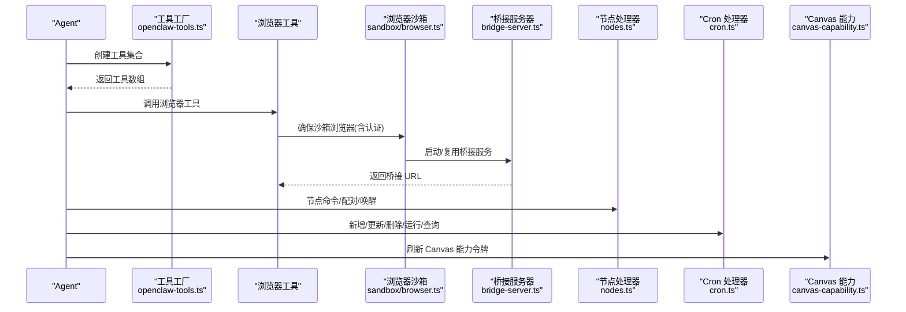
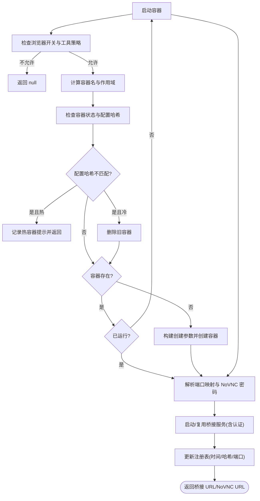
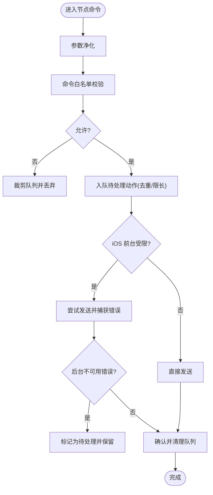
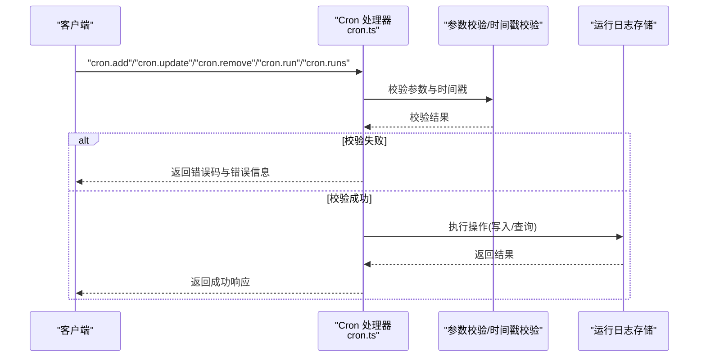
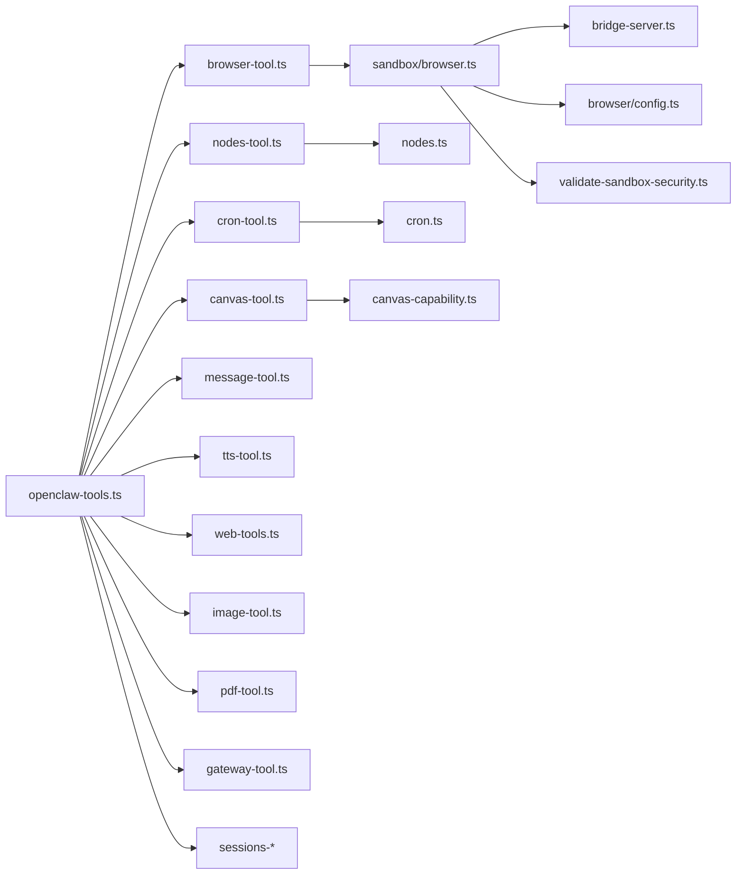

# 工具系统

<cite>
**本文引用的文件**   
- [src/agents/openclaw-tools.ts](file://src/agents/openclaw-tools.ts)
- [src/agents/sandbox/browser.ts](file://src/agents/sandbox/browser.ts)
- [src/gateway/server-methods/cron.ts](file://src/gateway/server-methods/cron.ts)
- [src/gateway/server-methods/nodes.ts](file://src/gateway/server-methods/nodes.ts)
- [src/gateway/canvas-capability.ts](file://src/gateway/canvas-capability.ts)
- [src/gateway/node-command-policy.ts](file://src/gateway/node-command-policy.ts)
- [src/gateway/node-invoke-sanitize.ts](file://src/gateway/node-invoke-sanitize.ts)
- [src/cron/types.ts](file://src/cron/types.ts)
- [src/cron/normalize.ts](file://src/cron/normalize.ts)
- [src/cron/run-log.ts](file://src/cron/run-log.ts)
- [src/cron/validate-timestamp.ts](file://src/cron/validate-timestamp.ts)
- [src/browser/bridge-server.ts](file://src/browser/bridge-server.ts)
- [src/browser/config.ts](file://src/browser/config.ts)
- [src/browser/constants.ts](file://src/browser/constants.ts)
- [src/agents/sandbox/config-hash.ts](file://src/agents/sandbox/config-hash.ts)
- [src/agents/sandbox/docker.ts](file://src/agents/sandbox/docker.ts)
- [src/agents/sandbox/novnc-auth.ts](file://src/agents/sandbox/novnc-auth.ts)
- [src/agents/sandbox/registry.ts](file://src/agents/sandbox/registry.ts)
- [src/agents/sandbox/shared.ts](file://src/agents/sandbox/shared.ts)
- [src/agents/sandbox/tool-policy.ts](file://src/agents/sandbox/tool-policy.ts)
- [src/agents/sandbox/validate-sandbox-security.ts](file://src/agents/sandbox/validate-sandbox-security.ts)
- [src/agents/sandbox/workspace-mounts.ts](file://src/agents/sandbox/workspace-mounts.ts)
- [src/agents/tools/browser-tool.ts](file://src/agents/tools/browser-tool.ts)
- [src/agents/tools/canvas-tool.ts](file://src/agents/tools/canvas-tool.ts)
- [src/agents/tools/nodes-tool.ts](file://src/agents/tools/nodes-tool.ts)
- [src/agents/tools/cron-tool.ts](file://src/agents/tools/cron-tool.ts)
- [src/agents/tools/message-tool.ts](file://src/agents/tools/message-tool.ts)
- [src/agents/tools/tts-tool.ts](file://src/agents/tools/tts-tool.ts)
- [src/agents/tools/web-tools.ts](file://src/agents/tools/web-tools.ts)
- [src/agents/tools/image-tool.ts](file://src/agents/tools/image-tool.ts)
- [src/agents/tools/pdf-tool.ts](file://src/agents/tools/pdf-tool.ts)
- [src/agents/tools/gateway-tool.ts](file://src/agents/tools/gateway-tool.ts)
- [src/agents/tools/agents-list-tool.ts](file://src/agents/tools/agents-list-tool.ts)
- [src/agents/tools/sessions-list-tool.ts](file://src/agents/tools/sessions-list-tool.ts)
- [src/agents/tools/sessions-history-tool.ts](file://src/agents/tools/sessions-history-tool.ts)
- [src/agents/tools/sessions-send-tool.ts](file://src/agents/tools/sessions-send-tool.ts)
- [src/agents/tools/sessions-yield-tool.ts](file://src/agents/tools/sessions-yield-tool.ts)
- [src/agents/tools/sessions-spawn-tool.ts](file://src/agents/tools/sessions-spawn-tool.ts)
- [src/agents/tools/subagents-tool.ts](file://src/agents/tools/subagents-tool.ts)
- [src/agents/tools/session-status-tool.ts](file://src/agents/tools/session-status-tool.ts)
- [src/plugins/tools.ts](file://src/plugins/tools.ts)
- [src/secrets/runtime.ts](file://src/secrets/runtime.ts)
- [src/utils/message-channel.ts](file://src/utils/message-channel.ts)
- [src/agents/agent-scope.ts](file://src/agents/agent-scope.ts)
- [src/agents/sandbox/fs-bridge.ts](file://src/agents/sandbox/fs-bridge.ts)
- [src/agents/sandbox/types.ts](file://src/agents/sandbox/types.ts)
- [src/agents/spawned-context.ts](file://src/agents/spawned-context.ts)
- [src/agents/tool-fs-policy.ts](file://src/agents/tool-fs-policy.ts)
- [src/agents/workspace-dir.ts](file://src/agents/workspace-dir.ts)
- [src/gateway/protocol/index.js](file://src/gateway/protocol/index.js)
- [src/gateway/server-methods/nodes.handlers.invoke-result.js](file://src/gateway/server-methods/nodes.handlers.invoke-result.js)
- [src/gateway/server-methods/nodes.helpers.js](file://src/gateway/server-methods/nodes.helpers.js)
- [src/infra/device-pairing.js](file://src/infra/device-pairing.js)
- [src/infra/node-pairing.js](file://src/infra/node-pairing.js)
- [src/infra/push-apns.js](file://src/infra/push-apns.js)
- [src/config/config.js](file://src/config/config.js)
- [src/config/port-defaults.js](file://src/config/port-defaults.js)
- [src/runtime.js](file://src/runtime.js)
- [src/gateway/server-methods/types.js](file://src/gateway/server-methods/types.js)
- [src/gateway/canvas-capability.js](file://src/gateway/canvas-capability.js)
- [src/gateway/node-command-policy.js](file://src/gateway/node-command-policy.js)
- [src/gateway/node-invoke-sanitize.js](file://src/gateway/node-invoke-sanitize.js)
- [src/cron/types.js](file://src/cron/types.js)
- [src/cron/normalize.js](file://src/cron/normalize.js)
- [src/cron/run-log.js](file://src/cron/run-log.js)
- [src/cron/validate-timestamp.js](file://src/cron/validate-timestamp.js)
- [src/browser/bridge-server.js](file://src/browser/bridge-server.js)
- [src/browser/config.js](file://src/browser/config.js)
- [src/browser/constants.js](file://src/browser/constants.js)
- [src/agents/sandbox/config-hash.js](file://src/agents/sandbox/config-hash.js)
- [src/agents/sandbox/docker.js](file://src/agents/sandbox/docker.js)
- [src/agents/sandbox/novnc-auth.js](file://src/agents/sandbox/novnc-auth.js)
- [src/agents/sandbox/registry.js](file://src/agents/sandbox/registry.js)
- [src/agents/sandbox/shared.js](file://src/agents/sandbox/shared.js)
- [src/agents/sandbox/tool-policy.js](file://src/agents/sandbox/tool-policy.js)
- [src/agents/sandbox/validate-sandbox-security.js](file://src/agents/sandbox/validate-sandbox-security.js)
- [src/agents/sandbox/workspace-mounts.js](file://src/agents/sandbox/workspace-mounts.js)
- [src/agents/tools/browser-tool.js](file://src/agents/tools/browser-tool.js)
- [src/agents/tools/canvas-tool.js](file://src/agents/tools/canvas-tool.js)
- [src/agents/tools/nodes-tool.js](file://src/agents/tools/nodes-tool.js)
- [src/agents/tools/cron-tool.js](file://src/agents/tools/cron-tool.js)
- [src/agents/tools/message-tool.js](file://src/agents/tools/message-tool.js)
- [src/agents/tools/tts-tool.js](file://src/agents/tools/tts-tool.js)
- [src/agents/tools/web-tools.js](file://src/agents/tools/web-tools.js)
- [src/agents/tools/image-tool.js](file://src/agents/tools/image-tool.js)
- [src/agents/tools/pdf-tool.js](file://src/agents/tools/pdf-tool.js)
- [src/agents/tools/gateway-tool.js](file://src/agents/tools/gateway-tool.js)
- [src/agents/tools/agents-list-tool.js](file://src/agents/tools/agents-list-tool.js)
- [src/agents/tools/sessions-list-tool.js](file://src/agents/tools/sessions-list-tool.js)
- [src/agents/tools/sessions-history-tool.js](file://src/agents/tools/sessions-history-tool.js)
- [src/agents/tools/sessions-send-tool.js](file://src/agents/tools/sessions-send-tool.js)
- [src/agents/tools/sessions-yield-tool.js](file://src/agents/tools/sessions-yield-tool.js)
- [src/agents/tools/sessions-spawn-tool.js](file://src/agents/tools/sessions-spawn-tool.js)
- [src/agents/tools/subagents-tool.js](file://src/agents/tools/subagents-tool.js)
- [src/agents/tools/session-status-tool.js](file://src/agents/tools/session-status-tool.js)
- [src/plugins/tools.js](file://src/plugins/tools.js)
- [src/secrets/runtime.js](file://src/secrets/runtime.js)
- [src/utils/message-channel.js](file://src/utils/message-channel.js)
- [src/agents/agent-scope.js](file://src/agents/agent-scope.js)
- [src/agents/sandbox/fs-bridge.js](file://src/agents/sandbox/fs-bridge.js)
- [src/agents/sandbox/types.js](file://src/agents/sandbox/types.js)
- [src/agents/spawned-context.js](file://src/agents/spawned-context.js)
- [src/agents/tool-fs-policy.js](file://src/agents/tool-fs-policy.js)
- [src/agents/workspace-dir.js](file://src/agents/workspace-dir.js)
</cite>

## 目录
1. [简介](#简介)
2. [项目结构](#项目结构)
3. [核心组件](#核心组件)
4. [架构总览](#架构总览)
5. [详细组件分析](#详细组件分析)
6. [依赖关系分析](#依赖关系分析)
7. [性能考量](#性能考量)
8. [故障排查指南](#故障排查指南)
9. [结论](#结论)
10. [附录](#附录)

## 简介
本章节面向 OpenClaw 的工具系统与自动化能力，系统性阐述以下核心工具与能力：
- 浏览器控制：通过沙箱容器与桥接服务实现安全可控的浏览器操作，支持无头模式、CDP 连接与远程评估。
- Canvas 渲染：在网关侧生成 Canvas 能力令牌，为节点侧渲染与交互提供受控访问通道。
- 节点管理：设备配对、唤醒、命令白名单与待处理动作队列，保障跨平台（尤其是 iOS）前台受限场景下的稳定性。
- Cron 调度：基于网关的 Cron 作业生命周期管理（新增、更新、删除、立即运行、查询运行日志），并进行参数校验与时间戳验证。
- 技能系统：通过插件与内置工具扩展 Agent 的能力边界，统一工具注册与调用入口。

同时，文档覆盖安全策略、权限控制与沙箱机制，给出配置选项、API 接口与集成模式，并提供工具开发指南与最佳实践。

## 项目结构
OpenClaw 的工具系统围绕“Agent 工具工厂 + 网关请求处理器 + 沙箱与安全模块”组织，关键目录与职责如下：
- src/agents/openclaw-tools.ts：工具工厂，集中创建浏览器、Canvas、节点、Cron、消息、TTS、会话管理、网关、Web 搜索/抓取、图像/PDF 等工具。
- src/gateway/server-methods/*：网关层请求处理器，暴露节点、Cron 等 RPC 方法。
- src/agents/sandbox/*：浏览器沙箱实现，包括镜像检查、容器生命周期、端口映射、NoVNC 认证、配置哈希与安全校验。
- src/browser/*：浏览器桥接服务器、配置解析与默认常量。
- src/gateway/canvas-capability.ts：Canvas 能力令牌签发与有效期管理。
- src/gateway/node-command-policy.ts、src/gateway/node-invoke-sanitize.ts：节点命令白名单与参数净化。
- src/cron/*：Cron 类型、规范化、运行日志与时间戳校验。
- 插件与运行时 Web 工具：从运行时元数据中注入 Web 搜索/抓取能力，统一工具注册。

图表来源
- [src/agents/openclaw-tools.ts:30-241](file://src/agents/openclaw-tools.ts#L30-L241)
- [src/agents/sandbox/browser.ts:129-401](file://src/agents/sandbox/browser.ts#L129-L401)
- [src/gateway/server-methods/nodes.ts:493-800](file://src/gateway/server-methods/nodes.ts#L493-L800)
- [src/gateway/server-methods/cron.ts:24-310](file://src/gateway/server-methods/cron.ts#L24-L310)
- [src/gateway/canvas-capability.ts](file://src/gateway/canvas-capability.ts)

章节来源
- [src/agents/openclaw-tools.ts:30-241](file://src/agents/openclaw-tools.ts#L30-L241)

## 核心组件
- 工具工厂 createOpenClawTools：按会话上下文与配置创建一组工具集合，包含浏览器、Canvas、节点、Cron、消息、TTS、Web 搜索/抓取、图像/PDF、会话管理、子代理、网关等；并加载插件工具。
- 浏览器工具 createBrowserTool：封装沙箱浏览器桥接 URL、宿主控制许可与会话键，供 Agent 调用。
- Canvas 工具 createCanvasTool：基于全局配置创建 Canvas 工具，用于生成能力令牌与渲染。
- 节点工具 createNodesTool：封装节点命令路由、线程/频道上下文、媒体命令许可与模型视觉能力。
- Cron 工具 createCronTool：封装会话键，供 Agent 触发 Cron 生命周期管理。
- 网关工具 createGatewayTool：封装会话键与配置，供 Agent 查询网关状态或执行网关侧任务。
- 会话工具集：会话列表、历史、发送、yield、spawn、子代理、状态等，统一由工具工厂注入。
- 插件工具：通过 resolvePluginTools 注入，避免与内置工具重名。

章节来源
- [src/agents/openclaw-tools.ts:30-241](file://src/agents/openclaw-tools.ts#L30-L241)
- [src/plugins/tools.ts](file://src/plugins/tools.ts)
- [src/secrets/runtime.ts](file://src/secrets/runtime.ts)
- [src/utils/message-channel.ts](file://src/utils/message-channel.ts)
- [src/agents/agent-scope.ts](file://src/agents/agent-scope.ts)
- [src/agents/sandbox/fs-bridge.ts](file://src/agents/sandbox/fs-bridge.ts)
- [src/agents/spawned-context.ts](file://src/agents/spawned-context.ts)
- [src/agents/tool-fs-policy.ts](file://src/agents/tool-fs-policy.ts)
- [src/agents/workspace-dir.ts](file://src/agents/workspace-dir.ts)

## 架构总览
下图展示工具系统在 Agent、网关与沙箱之间的交互路径，以及关键安全与鉴权环节。

图表来源
- [src/agents/openclaw-tools.ts:139-241](file://src/agents/openclaw-tools.ts#L139-L241)
- [src/agents/sandbox/browser.ts:129-401](file://src/agents/sandbox/browser.ts#L129-L401)
- [src/gateway/server-methods/nodes.ts:493-800](file://src/gateway/server-methods/nodes.ts#L493-L800)
- [src/gateway/server-methods/cron.ts:24-310](file://src/gateway/server-methods/cron.ts#L24-L310)
- [src/gateway/canvas-capability.ts](file://src/gateway/canvas-capability.ts)

## 详细组件分析

### 浏览器控制（Browser）
- 功能要点
  - 沙箱镜像与网络校验：确保所需镜像存在、网络模式合法。
  - 容器生命周期：按作用域（共享/会话/代理）命名与重建，配置哈希不匹配时热容器提示或重建。
  - 端口映射与 NoVNC：自动解析 CDP 端口映射，可选启用 NoVNC 并签发观察令牌。
  - 桥接服务：启动/复用浏览器桥接服务，支持自动挂载工作区与绑定源码路径。
  - 权限与策略：根据工具策略判断是否允许浏览器工具；支持宿主控制许可。
- 关键流程

图表来源
- [src/agents/sandbox/browser.ts:129-401](file://src/agents/sandbox/browser.ts#L129-L401)
- [src/agents/sandbox/config-hash.ts](file://src/agents/sandbox/config-hash.ts)
- [src/agents/sandbox/docker.ts](file://src/agents/sandbox/docker.ts)
- [src/agents/sandbox/novnc-auth.ts](file://src/agents/sandbox/novnc-auth.ts)
- [src/agents/sandbox/registry.ts](file://src/agents/sandbox/registry.ts)
- [src/agents/sandbox/tool-policy.ts](file://src/agents/sandbox/tool-policy.ts)
- [src/agents/sandbox/validate-sandbox-security.ts](file://src/agents/sandbox/validate-sandbox-security.ts)
- [src/agents/sandbox/workspace-mounts.ts](file://src/agents/sandbox/workspace-mounts.ts)
- [src/browser/bridge-server.ts](file://src/browser/bridge-server.ts)
- [src/browser/config.ts](file://src/browser/config.ts)
- [src/browser/constants.ts](file://src/browser/constants.ts)

章节来源
- [src/agents/sandbox/browser.ts:129-401](file://src/agents/sandbox/browser.ts#L129-L401)
- [src/agents/tools/browser-tool.ts](file://src/agents/tools/browser-tool.ts)
- [src/browser/bridge-server.ts](file://src/browser/bridge-server.ts)
- [src/browser/config.ts](file://src/browser/config.ts)
- [src/browser/constants.ts](file://src/browser/constants.ts)

### Canvas 渲染（Canvas）
- 功能要点
  - 能力令牌签发：为节点侧 Canvas 渲染与交互生成短期有效令牌，限定 TTL。
  - 作用域 URL：结合客户端提供的 Canvas Host 基础 URL 生成带令牌的访问地址。
- 集成要点
  - 网关侧刷新节点 Canvas 能力令牌接口，返回带过期时间的令牌与 URL。

章节来源
- [src/gateway/canvas-capability.ts](file://src/gateway/canvas-capability.ts)
- [src/gateway/server-methods/nodes.ts:780-800](file://src/gateway/server-methods/nodes.ts#L780-L800)

### 节点管理（Nodes）
- 功能要点
  - 设备配对：请求、列出、批准、拒绝、校验令牌与重命名。
  - 连接与唤醒：APNs 直连/中继推送，节流与重试策略，等待重连。
  - 命令白名单与参数净化：限制前台受限命令，净化转发参数。
  - 待处理动作队列：针对 iOS 前台受限错误，缓存并重放允许的命令。
- 关键流程

图表来源
- [src/gateway/server-methods/nodes.ts:157-278](file://src/gateway/server-methods/nodes.ts#L157-L278)
- [src/gateway/node-command-policy.ts](file://src/gateway/node-command-policy.ts)
- [src/gateway/node-invoke-sanitize.ts](file://src/gateway/node-invoke-sanitize.ts)
- [src/infra/push-apns.js](file://src/infra/push-apns.js)

章节来源
- [src/gateway/server-methods/nodes.ts:493-800](file://src/gateway/server-methods/nodes.ts#L493-L800)
- [src/gateway/node-command-policy.ts](file://src/gateway/node-command-policy.ts)
- [src/gateway/node-invoke-sanitize.ts](file://src/gateway/node-invoke-sanitize.ts)
- [src/infra/device-pairing.js](file://src/infra/device-pairing.js)
- [src/infra/node-pairing.js](file://src/infra/node-pairing.js)
- [src/infra/push-apns.js](file://src/infra/push-apns.js)

### Cron 调度（Cron）
- 功能要点
  - 生命周期管理：新增、更新（含时间戳校验）、删除、立即运行、查询运行日志（分页）。
  - 参数校验与错误格式化：统一错误码与错误形状。
  - 时间戳验证：确保调度表达式的时间戳合法。
- 关键流程

图表来源
- [src/gateway/server-methods/cron.ts:24-310](file://src/gateway/server-methods/cron.ts#L24-L310)
- [src/cron/types.ts](file://src/cron/types.ts)
- [src/cron/normalize.ts](file://src/cron/normalize.ts)
- [src/cron/run-log.ts](file://src/cron/run-log.ts)
- [src/cron/validate-timestamp.ts](file://src/cron/validate-timestamp.ts)
- [src/gateway/protocol/index.js](file://src/gateway/protocol/index.js)

章节来源
- [src/gateway/server-methods/cron.ts:24-310](file://src/gateway/server-methods/cron.ts#L24-L310)
- [src/cron/types.ts](file://src/cron/types.ts)
- [src/cron/normalize.ts](file://src/cron/normalize.ts)
- [src/cron/run-log.ts](file://src/cron/run-log.ts)
- [src/cron/validate-timestamp.ts](file://src/cron/validate-timestamp.ts)

### 技能系统（插件与工具扩展）
- 功能要点
  - 插件工具注入：通过 resolvePluginTools 在工具工厂中注入插件声明的工具，避免与内置工具重名。
  - 运行时 Web 工具：从运行时元数据中注入 Web 搜索/抓取能力，统一工具注册。
- 集成要点
  - 工具工厂在返回工具数组前合并插件工具，形成最终可用工具集。

章节来源
- [src/plugins/tools.ts](file://src/plugins/tools.ts)
- [src/secrets/runtime.ts](file://src/secrets/runtime.ts)
- [src/agents/openclaw-tools.ts:219-240](file://src/agents/openclaw-tools.ts#L219-L240)

### 其他工具概览
- 消息工具：封装当前频道、线程、消息 ID、回复模式与显式目标要求，支持多渠道自动线程路由。
- TTS 工具：基于配置与频道上下文生成语音输出。
- Web 工具：Web 搜索与抓取，支持沙箱化与运行时能力注入。
- 图像/PDF 工具：基于配置与工作区/沙箱策略读取媒体内容。
- 会话工具集：会话列表、历史、发送、yield、spawn、子代理、状态等，统一由工具工厂注入。

章节来源
- [src/agents/tools/message-tool.ts](file://src/agents/tools/message-tool.ts)
- [src/agents/tools/tts-tool.ts](file://src/agents/tools/tts-tool.ts)
- [src/agents/tools/web-tools.ts](file://src/agents/tools/web-tools.ts)
- [src/agents/tools/image-tool.ts](file://src/agents/tools/image-tool.ts)
- [src/agents/tools/pdf-tool.ts](file://src/agents/tools/pdf-tool.ts)
- [src/agents/tools/sessions-list-tool.ts](file://src/agents/tools/sessions-list-tool.ts)
- [src/agents/tools/sessions-history-tool.ts](file://src/agents/tools/sessions-history-tool.ts)
- [src/agents/tools/sessions-send-tool.ts](file://src/agents/tools/sessions-send-tool.ts)
- [src/agents/tools/sessions-yield-tool.ts](file://src/agents/tools/sessions-yield-tool.ts)
- [src/agents/tools/sessions-spawn-tool.ts](file://src/agents/tools/sessions-spawn-tool.ts)
- [src/agents/tools/subagents-tool.ts](file://src/agents/tools/subagents-tool.ts)
- [src/agents/tools/session-status-tool.ts](file://src/agents/tools/session-status-tool.ts)

## 依赖关系分析
- 组件耦合
  - 工具工厂对各工具模块有聚合依赖，但工具内部尽量解耦于 Agent 上下文。
  - 浏览器工具依赖沙箱模块；沙箱模块依赖桥接服务器与浏览器配置。
  - 节点工具依赖网关节点处理器；Cron 工具依赖网关 Cron 处理器。
  - Canvas 工具依赖网关 Canvas 能力模块。
- 外部依赖
  - Docker 与端口映射、NoVNC、APNs 推送、CDP 协议。
- 潜在循环依赖
  - 工具工厂与各工具模块之间为单向依赖，未见循环。

图表来源
- [src/agents/openclaw-tools.ts:30-241](file://src/agents/openclaw-tools.ts#L30-L241)
- [src/agents/sandbox/browser.ts:129-401](file://src/agents/sandbox/browser.ts#L129-L401)
- [src/gateway/server-methods/nodes.ts:493-800](file://src/gateway/server-methods/nodes.ts#L493-L800)
- [src/gateway/server-methods/cron.ts:24-310](file://src/gateway/server-methods/cron.ts#L24-L310)
- [src/gateway/canvas-capability.ts](file://src/gateway/canvas-capability.ts)

## 性能考量
- 浏览器沙箱
  - 热容器检测与提示：减少频繁重建带来的延迟。
  - 端口映射解析与 CDP 就绪检测：避免无效连接与超时重试。
  - NoVNC 密码与令牌：仅在启用时生成，降低额外开销。
- 节点命令
  - APNs 推送节流与重试：避免频繁唤醒导致的资源浪费。
  - 待处理队列长度与 TTL：防止内存膨胀与僵尸任务。
- Cron
  - 分页查询与状态过滤：降低日志读取压力。
  - 时间戳校验前置：减少无效调度执行。

## 故障排查指南
- 浏览器沙箱
  - 症状：CDP 无法连接或端口映射异常
  - 排查：检查容器状态、端口映射解析、桥接服务认证；必要时重建容器
  - 参考：[ensureSandboxBrowser:129-401](file://src/agents/sandbox/browser.ts#L129-L401)
- 节点命令
  - 症状：iOS 前台受限导致命令失败
  - 排查：确认命令是否在前台受限清单；检查后台不可用错误；查看待处理队列
  - 参考：[maybeWakeNodeWithApns:280-388](file://src/gateway/server-methods/nodes.ts#L280-L388), [enqueuePendingNodeAction:190-216](file://src/gateway/server-methods/nodes.ts#L190-L216)
- Cron
  - 症状：调度无效或日志查询失败
  - 排查：核对参数校验与时间戳；检查日志路径与分页参数
  - 参考：[cronHandlers:24-310](file://src/gateway/server-methods/cron.ts#L24-L310), [validateScheduleTimestamp](file://src/cron/validate-timestamp.ts)

章节来源
- [src/agents/sandbox/browser.ts:129-401](file://src/agents/sandbox/browser.ts#L129-L401)
- [src/gateway/server-methods/nodes.ts:280-388](file://src/gateway/server-methods/nodes.ts#L280-L388)
- [src/gateway/server-methods/nodes.ts:190-216](file://src/gateway/server-methods/nodes.ts#L190-L216)
- [src/gateway/server-methods/cron.ts:24-310](file://src/gateway/server-methods/cron.ts#L24-L310)

## 结论
OpenClaw 的工具系统以“工具工厂 + 网关处理器 + 沙箱与安全模块”为核心，实现了浏览器控制、Canvas 渲染、节点管理、Cron 调度与技能扩展的完整自动化闭环。通过严格的参数校验、时间戳验证、命令白名单与待处理队列机制，系统在保证易用性的同时兼顾安全性与稳定性。建议在生产环境中：
- 明确工具策略与沙箱配置，定期重建热容器以应用新配置
- 对节点命令实施最小权限原则，结合前台受限策略优化用户体验
- 使用 Cron 的分页与状态过滤，配合日志归档策略降低存储压力
- 通过插件与运行时 Web 工具扩展 Agent 能力，保持工具注册去重与版本一致

## 附录

### 安全策略、权限控制与沙箱机制
- 工具策略：通过 isToolAllowed 控制是否允许某类工具（如浏览器）。
- 沙箱安全：网络模式校验、配置哈希校验、容器重建提示、NoVNC 密码与令牌。
- 节点命令白名单：限制前台受限命令，净化转发参数，避免越权调用。
- Canvas 能力令牌：短期有效，限定访问范围与 TTL。

章节来源
- [src/agents/sandbox/tool-policy.ts](file://src/agents/sandbox/tool-policy.ts)
- [src/agents/sandbox/validate-sandbox-security.ts](file://src/agents/sandbox/validate-sandbox-security.ts)
- [src/gateway/node-command-policy.ts](file://src/gateway/node-command-policy.ts)
- [src/gateway/node-invoke-sanitize.ts](file://src/gateway/node-invoke-sanitize.ts)
- [src/gateway/canvas-capability.ts](file://src/gateway/canvas-capability.ts)

### 配置选项与集成模式
- 浏览器沙箱
  - 开关与镜像：浏览器开关、镜像名称、网络模式、CDP 端口范围
  - NoVNC：启用/禁用、密码、端口
  - 工作区挂载：绑定源码根目录、工作区路径、工作目录
  - 参考：[ensureSandboxBrowser:129-401](file://src/agents/sandbox/browser.ts#L129-L401), [resolveSandboxBrowserDockerCreateConfig](file://src/agents/sandbox/config.js)
- 节点
  - 命令白名单与前台受限策略、APNs 推送配置
  - 参考：[nodeCommandPolicy](file://src/gateway/node-command-policy.ts), [push-apns](file://src/infra/push-apns.js)
- Cron
  - 调度表达式、时间戳校验、运行日志分页与过滤
  - 参考：[cronHandlers:24-310](file://src/gateway/server-methods/cron.ts#L24-L310), [validateScheduleTimestamp](file://src/cron/validate-timestamp.ts)
- Canvas
  - 能力令牌 TTL、作用域 URL 生成
  - 参考：[canvas-capability](file://src/gateway/canvas-capability.ts)

章节来源
- [src/agents/sandbox/browser.ts:129-401](file://src/agents/sandbox/browser.ts#L129-L401)
- [src/gateway/server-methods/nodes.ts:493-800](file://src/gateway/server-methods/nodes.ts#L493-L800)
- [src/gateway/server-methods/cron.ts:24-310](file://src/gateway/server-methods/cron.ts#L24-L310)
- [src/gateway/canvas-capability.ts](file://src/gateway/canvas-capability.ts)

### API 接口与使用方法
- 节点
  - node.pair.request / node.pair.list / node.pair.approve / node.pair.reject / node.pair.verify / node.rename / node.list / node.describe / node.canvas.capability.refresh
  - 参考：[nodes.ts:493-800](file://src/gateway/server-methods/nodes.ts#L493-L800)
- Cron
  - cron.list / cron.status / cron.add / cron.update / cron.remove / cron.run / cron.runs
  - 参考：[cron.ts:24-310](file://src/gateway/server-methods/cron.ts#L24-L310)
- 浏览器
  - 通过工具工厂创建浏览器工具后，由沙箱模块负责容器与桥接服务管理
  - 参考：[openclaw-tools.ts:139-144](file://src/agents/openclaw-tools.ts#L139-L144), [sandbox/browser.ts:129-401](file://src/agents/sandbox/browser.ts#L129-L401)
- Canvas
  - 通过工具工厂创建 Canvas 工具或网关刷新能力令牌
  - 参考：[openclaw-tools.ts](file://src/agents/openclaw-tools.ts#L145), [nodes.ts:780-800](file://src/gateway/server-methods/nodes.ts#L780-L800)

章节来源
- [src/gateway/server-methods/nodes.ts:493-800](file://src/gateway/server-methods/nodes.ts#L493-L800)
- [src/gateway/server-methods/cron.ts:24-310](file://src/gateway/server-methods/cron.ts#L24-L310)
- [src/agents/openclaw-tools.ts:139-144](file://src/agents/openclaw-tools.ts#L139-L144)
- [src/agents/sandbox/browser.ts:129-401](file://src/agents/sandbox/browser.ts#L129-L401)

### 工具开发指南与最佳实践
- 自定义工具
  - 在工具工厂中注册新工具，确保名称唯一，避免与内置工具冲突
  - 若涉及文件系统或网络，明确沙箱策略与权限边界
  - 提供参数校验与错误处理，遵循统一错误码规范
- 插件生态
  - 使用 resolvePluginTools 注入插件工具，保持与内置工具一致的生命周期与上下文
  - 通过运行时 Web 工具元数据注入外部能力，提升工具扩展性
- 最佳实践
  - 优先使用沙箱与最小权限原则，避免直接系统级调用
  - 对易失败操作（如节点命令、Cron 运行）采用幂等与重试策略
  - 对日志与运行指标进行分页与过滤，避免一次性读取过多数据

章节来源
- [src/agents/openclaw-tools.ts:219-240](file://src/agents/openclaw-tools.ts#L219-L240)
- [src/plugins/tools.ts](file://src/plugins/tools.ts)
- [src/secrets/runtime.ts](file://src/secrets/runtime.ts)