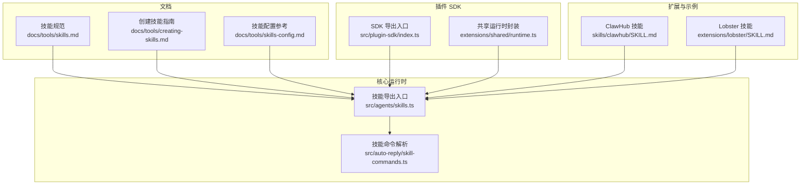
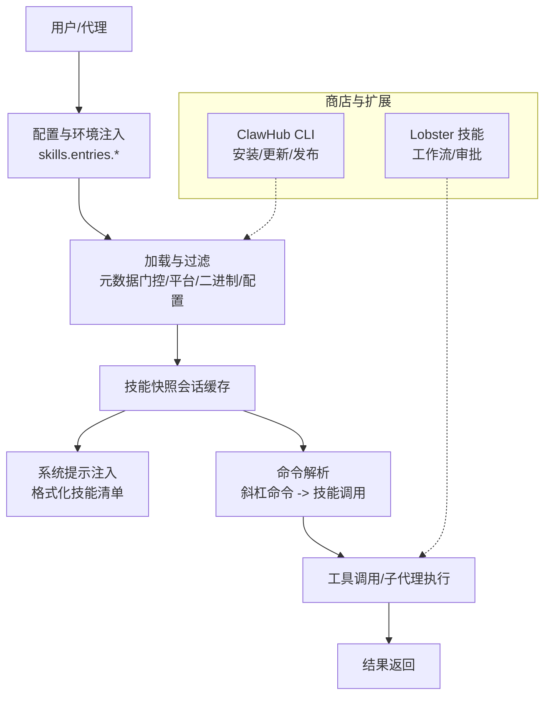
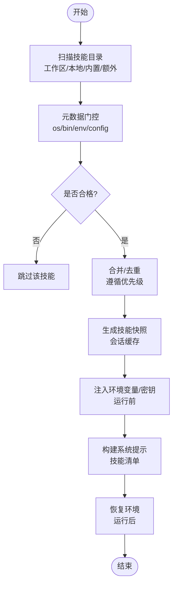
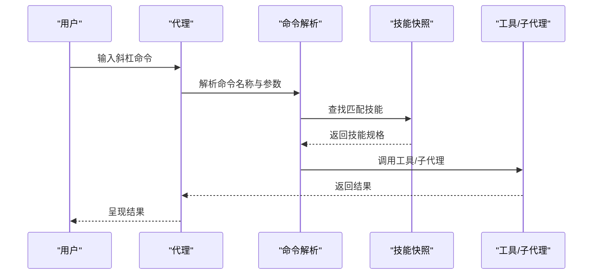
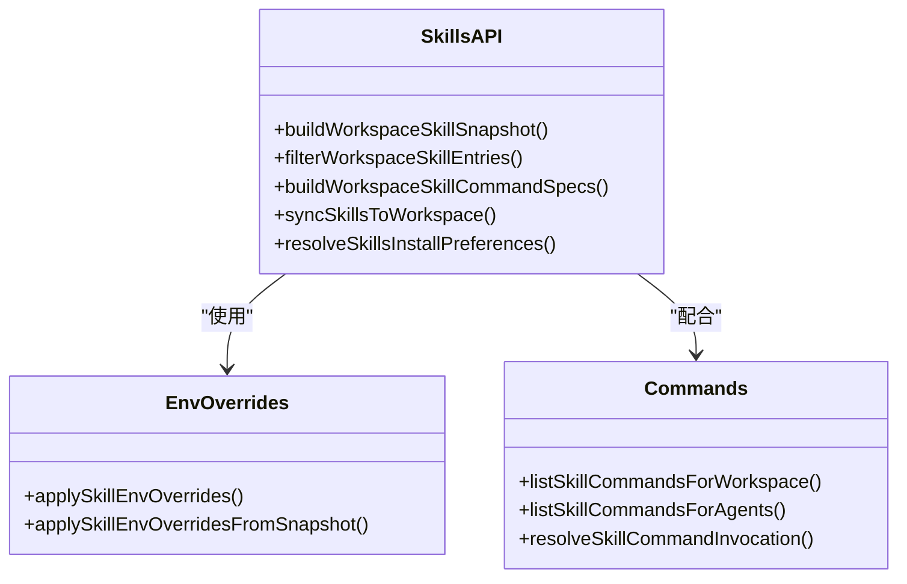
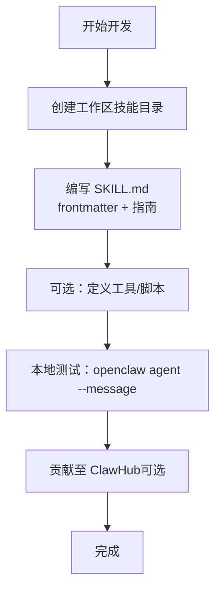
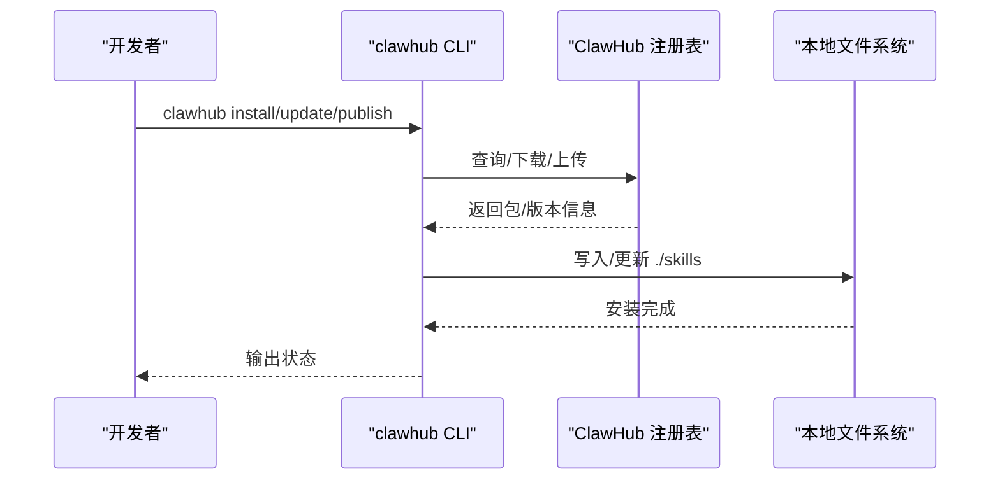

# 技能系统

<cite>
**本文引用的文件**
- [docs/tools/skills.md](file://docs/tools/skills.md)
- [docs/tools/creating-skills.md](file://docs/tools/creating-skills.md)
- [docs/tools/skills-config.md](file://docs/tools/skills-config.md)
- [src/agents/skills.ts](file://src/agents/skills.ts)
- [src/auto-reply/skill-commands.ts](file://src/auto-reply/skill-commands.ts)
- [src/plugin-sdk/index.ts](file://src/plugin-sdk/index.ts)
- [extensions/shared/runtime.ts](file://extensions/shared/runtime.ts)
- [skills/clawhub/SKILL.md](file://skills/clawhub/SKILL.md)
- [extensions/lobster/SKILL.md](file://extensions/lobster/SKILL.md)
</cite>

## 目录
1. [简介](#简介)
2. [项目结构](#项目结构)
3. [核心组件](#核心组件)
4. [架构总览](#架构总览)
5. [详细组件分析](#详细组件分析)
6. [依赖关系分析](#依赖关系分析)
7. [性能考量](#性能考量)
8. [故障排查指南](#故障排查指南)
9. [结论](#结论)
10. [附录](#附录)

## 简介
本文件系统化阐述 OpenClaw 的“技能（Skills）”体系：从安装、配置到管理，覆盖与工具系统的集成、加载机制与依赖管理；提供技能开发指南、模板使用与自定义技能创建；总结配置项、参数传递与结果处理最佳实践；涵盖技能商店（ClawHub）、版本管理与兼容性检查；解释与代理系统的交互模式、权限控制与安全注意事项。

## 项目结构
技能系统围绕以下层次组织：
- 文档层：技能规范、配置参考、商店使用指南
- 核心运行时：技能加载、过滤、命令解析与提示注入
- 插件 SDK：为扩展提供统一能力接口与运行时封装
- 扩展与示例：插件内嵌技能、示例技能（如 ClawHub、Lobster）

**图表来源**
- [docs/tools/skills.md:1-303](file://docs/tools/skills.md#L1-L303)
- [docs/tools/creating-skills.md:1-59](file://docs/tools/creating-skills.md#L1-L59)
- [docs/tools/skills-config.md:1-78](file://docs/tools/skills-config.md#L1-L78)
- [src/agents/skills.ts:1-47](file://src/agents/skills.ts#L1-L47)
- [src/auto-reply/skill-commands.ts:1-205](file://src/auto-reply/skill-commands.ts#L1-L205)
- [src/plugin-sdk/index.ts:1-872](file://src/plugin-sdk/index.ts#L1-L872)
- [extensions/shared/runtime.ts:1-15](file://extensions/shared/runtime.ts#L1-L15)
- [skills/clawhub/SKILL.md:1-78](file://skills/clawhub/SKILL.md#L1-L78)
- [extensions/lobster/SKILL.md:1-98](file://extensions/lobster/SKILL.md#L1-L98)

**章节来源**
- [docs/tools/skills.md:1-303](file://docs/tools/skills.md#L1-L303)
- [docs/tools/creating-skills.md:1-59](file://docs/tools/creating-skills.md#L1-L59)
- [docs/tools/skills-config.md:1-78](file://docs/tools/skills-config.md#L1-L78)
- [src/agents/skills.ts:1-47](file://src/agents/skills.ts#L1-L47)
- [src/auto-reply/skill-commands.ts:1-205](file://src/auto-reply/skill-commands.ts#L1-L205)
- [src/plugin-sdk/index.ts:1-872](file://src/plugin-sdk/index.ts#L1-L872)
- [extensions/shared/runtime.ts:1-15](file://extensions/shared/runtime.ts#L1-L15)
- [skills/clawhub/SKILL.md:1-78](file://skills/clawhub/SKILL.md#L1-L78)
- [extensions/lobster/SKILL.md:1-98](file://extensions/lobster/SKILL.md#L1-L98)

## 核心组件
- 技能加载与过滤：负责扫描多源技能目录、应用元数据门控规则、构建“可执行技能快照”，并按会话缓存以提升性能。
- 技能命令解析：将用户输入的斜杠命令映射到具体技能与参数，支持去重与规范化。
- 配置与环境注入：在每次代理运行前，按优先级注入环境变量与密钥，结束后恢复原环境。
- 插件 SDK：提供统一的运行时封装、日志后端、Webhook/请求等基础设施能力，供扩展与技能共同使用。
- 示例与商店：内置示例技能与 ClawHub 商店集成，支持搜索、安装、更新、发布与版本管理。

**章节来源**
- [src/agents/skills.ts:1-47](file://src/agents/skills.ts#L1-L47)
- [src/auto-reply/skill-commands.ts:1-205](file://src/auto-reply/skill-commands.ts#L1-L205)
- [src/plugin-sdk/index.ts:1-872](file://src/plugin-sdk/index.ts#L1-L872)
- [extensions/shared/runtime.ts:1-15](file://extensions/shared/runtime.ts#L1-L15)
- [skills/clawhub/SKILL.md:1-78](file://skills/clawhub/SKILL.md#L1-L78)
- [extensions/lobster/SKILL.md:1-98](file://extensions/lobster/SKILL.md#L1-L98)

## 架构总览
技能系统通过“文档规范 + 运行时实现 + 插件 SDK + 示例/商店”的组合，形成可发现、可配置、可扩展、可治理的闭环。

**图表来源**
- [docs/tools/skills.md:106-188](file://docs/tools/skills.md#L106-L188)
- [docs/tools/skills-config.md:13-78](file://docs/tools/skills-config.md#L13-L78)
- [src/auto-reply/skill-commands.ts:36-129](file://src/auto-reply/skill-commands.ts#L36-L129)
- [skills/clawhub/SKILL.md:1-78](file://skills/clawhub/SKILL.md#L1-L78)
- [extensions/lobster/SKILL.md:1-98](file://extensions/lobster/SKILL.md#L1-L98)

## 详细组件分析

### 组件一：技能安装、配置与管理
- 多源加载与优先级
  - 源顺序：工作区技能（最高）→ 本地管理技能 → 内置技能（最低），额外目录可通过配置追加（最低优先级）。
  - 多代理场景下，每个代理拥有独立工作区技能，共享本地管理技能。
- 元数据门控（加载期过滤）
  - 支持基于操作系统、二进制存在、环境变量或配置路径的条件筛选；可声明“始终启用”“主密钥环境变量”“安装器描述”等。
  - 沙箱场景需同时满足宿主机与容器内的依赖。
- 配置覆盖
  - 在宿主进程作用域注入环境变量与密钥；支持对特定技能开启/关闭、设置自定义配置字段。
  - 可限制仅允许某些内置技能参与。
- 环境注入与恢复
  - 每次代理运行开始时注入，结束时恢复，避免污染全局环境。
- 监视与热重载
  - 可启用文件监视，在 SKILL.md 变更时刷新技能快照；同一会话复用已选技能列表，新会话生效。
- 远程节点与跨平台
  - 当网关运行于 Linux 而连接了允许执行的 macOS 节点时，若节点具备所需二进制，可将 macOS 专属技能纳入候选（通过节点工具执行）。

**图表来源**
- [docs/tools/skills.md:13-48](file://docs/tools/skills.md#L13-L48)
- [docs/tools/skills.md:106-188](file://docs/tools/skills.md#L106-L188)
- [docs/tools/skills.md:189-246](file://docs/tools/skills.md#L189-L246)

**章节来源**
- [docs/tools/skills.md:13-48](file://docs/tools/skills.md#L13-L48)
- [docs/tools/skills.md:106-188](file://docs/tools/skills.md#L106-L188)
- [docs/tools/skills.md:189-246](file://docs/tools/skills.md#L189-L246)

### 组件二：技能与工具系统的集成
- 工具表面由技能定义，代理通过系统提示了解可用工具；当用户触发斜杠命令或模型建议时，系统解析为具体技能调用。
- 插件可自带技能目录，随插件启用而参与加载与门控。
- 子代理/工具调用在运行时进行，支持沙箱隔离与审批策略。

**图表来源**
- [src/auto-reply/skill-commands.ts:36-129](file://src/auto-reply/skill-commands.ts#L36-L129)
- [src/agents/skills.ts:26-34](file://src/agents/skills.ts#L26-L34)

**章节来源**
- [src/auto-reply/skill-commands.ts:36-129](file://src/auto-reply/skill-commands.ts#L36-L129)
- [src/agents/skills.ts:26-34](file://src/agents/skills.ts#L26-L34)

### 组件三：技能加载机制与依赖管理
- 加载入口与导出
  - 提供构建工作区技能快照、过滤条目、构建命令规范、同步到工作区等能力。
  - 安装偏好（如 Node 管理器、是否优先 Homebrew）由配置解析得出。
- 依赖与安装器
  - 元数据中可声明二进制依赖、环境变量依赖与配置路径依赖；可提供安装器描述（brew/node/go/download 等），用于 UI 或 CLI 引导安装。
  - 平台过滤与多安装器择优策略由运行时处理。

**图表来源**
- [src/agents/skills.ts:1-47](file://src/agents/skills.ts#L1-L47)
- [src/auto-reply/skill-commands.ts:1-205](file://src/auto-reply/skill-commands.ts#L1-L205)

**章节来源**
- [src/agents/skills.ts:1-47](file://src/agents/skills.ts#L1-L47)
- [src/auto-reply/skill-commands.ts:1-205](file://src/auto-reply/skill-commands.ts#L1-L205)

### 组件四：技能开发指南与模板使用
- 自定义技能创建步骤
  - 在工作区创建技能目录，编写 SKILL.md（含 YAML frontmatter 与说明），必要时定义工具或脚本。
  - 使用 CLI 或重启网关后刷新，使新技能被发现与索引。
- 最佳实践
  - 简洁明确地指导模型做什么而非如何做；优先安全，避免任意命令注入；先本地测试再上线。
- 模板与示例
  - 内置示例技能（如 ClawHub、Lobster）可作为模板参考，学习元数据门控、安装器描述与工作流设计。

**图表来源**
- [docs/tools/creating-skills.md:17-59](file://docs/tools/creating-skills.md#L17-L59)
- [skills/clawhub/SKILL.md:1-78](file://skills/clawhub/SKILL.md#L1-L78)
- [extensions/lobster/SKILL.md:1-98](file://extensions/lobster/SKILL.md#L1-L98)

**章节来源**
- [docs/tools/creating-skills.md:17-59](file://docs/tools/creating-skills.md#L17-L59)
- [skills/clawhub/SKILL.md:1-78](file://skills/clawhub/SKILL.md#L1-L78)
- [extensions/lobster/SKILL.md:1-98](file://extensions/lobster/SKILL.md#L1-L98)

### 组件五：技能商店、版本管理与兼容性
- 商店与 CLI
  - 通过 ClawHub CLI 实现搜索、安装、更新、列出与发布；默认注册表与工作目录可配置。
  - 更新采用哈希匹配与版本解析，支持强制升级与批量更新。
- 版本与兼容性
  - 元数据中的安装器描述支持平台过滤；安装偏好（Node 管理器、Homebrew 优先）影响安装行为。
  - 沙箱场景需确保容器内具备二进制依赖。

**图表来源**
- [skills/clawhub/SKILL.md:1-78](file://skills/clawhub/SKILL.md#L1-L78)
- [docs/tools/skills.md:50-68](file://docs/tools/skills.md#L50-L68)

**章节来源**
- [skills/clawhub/SKILL.md:1-78](file://skills/clawhub/SKILL.md#L1-L78)
- [docs/tools/skills.md:50-68](file://docs/tools/skills.md#L50-L68)

### 组件六：与代理系统的交互模式、权限控制与安全
- 交互模式
  - 用户通过斜杠命令触发技能；也可直接工具派发（当技能声明为工具派发）。
- 权限与沙箱
  - 第三方技能视为不受信任代码；建议对高风险工具使用沙箱运行。
  - 沙箱内不继承宿主进程环境，需通过全局或镜像方式注入。
- 安全注意
  - 严格限制提示词与日志中的敏感信息；仅在宿主运行时注入环境变量与密钥；遵循最小权限原则。

**章节来源**
- [docs/tools/skills.md:69-77](file://docs/tools/skills.md#L69-L77)
- [docs/tools/skills-config.md:67-78](file://docs/tools/skills-config.md#L67-L78)
- [docs/tools/skills.md:106-147](file://docs/tools/skills.md#L106-L147)

## 依赖关系分析
- 文档驱动：技能规范与配置参考为实现提供契约。
- 运行时耦合：命令解析依赖技能快照；环境注入贯穿运行生命周期。
- 插件 SDK：统一运行时封装，降低扩展与技能实现复杂度。
- 示例与商店：提供可复用范式与生态能力。

**图表来源**
- [docs/tools/skills.md:1-303](file://docs/tools/skills.md#L1-L303)
- [docs/tools/skills-config.md:1-78](file://docs/tools/skills-config.md#L1-L78)
- [src/plugin-sdk/index.ts:1-872](file://src/plugin-sdk/index.ts#L1-L872)
- [extensions/shared/runtime.ts:1-15](file://extensions/shared/runtime.ts#L1-L15)

**章节来源**
- [src/plugin-sdk/index.ts:1-872](file://src/plugin-sdk/index.ts#L1-L872)
- [extensions/shared/runtime.ts:1-15](file://extensions/shared/runtime.ts#L1-L15)

## 性能考量
- 技能快照缓存：会话启动时快照化，后续轮次复用，减少重复扫描与过滤成本。
- 文件监视与去抖：可配置监视与去抖参数，平衡实时性与资源消耗。
- 提示注入开销：技能清单注入为确定性字符数开销，建议控制技能数量与字段长度。

**章节来源**
- [docs/tools/skills.md:242-286](file://docs/tools/skills.md#L242-L286)
- [docs/tools/skills-config.md:17-21](file://docs/tools/skills-config.md#L17-L21)

## 故障排查指南
- 技能未出现
  - 检查 SKILL.md 是否符合规范（frontmatter 单行键、metadata 单行 JSON 对象）。
  - 确认门控条件（平台、二进制、环境变量、配置路径）是否满足。
  - 若为沙箱，确认容器内依赖已安装。
- 命令无法识别
  - 确认斜杠命令名称与技能声明一致，注意大小写与空格/下划线归一化。
  - 检查保留命令名冲突。
- 环境变量未生效
  - 确认宿主运行时注入逻辑；沙箱内需通过全局环境或镜像注入。
- 更新/安装异常
  - 使用 ClawHub CLI 列出/更新；检查网络与注册表配置；必要时指定版本或强制更新。

**章节来源**
- [docs/tools/skills.md:78-188](file://docs/tools/skills.md#L78-L188)
- [src/auto-reply/skill-commands.ts:135-205](file://src/auto-reply/skill-commands.ts#L135-L205)
- [docs/tools/skills-config.md:67-78](file://docs/tools/skills-config.md#L67-L78)
- [skills/clawhub/SKILL.md:1-78](file://skills/clawhub/SKILL.md#L1-L78)

## 结论
OpenClaw 的技能系统以“AgentSkills + Pi 兼容”的规范为基础，结合严格的门控与环境注入机制，实现了可发现、可治理、可扩展且安全可控的能力面。通过 CLI/商店生态与插件 SDK，开发者可以快速创建、分发与维护高质量技能，同时在多代理、多平台与沙箱环境下保持一致的行为与体验。

## 附录
- 关键实现路径参考
  - 技能加载与过滤：[src/agents/skills.ts:26-34](file://src/agents/skills.ts#L26-L34)
  - 环境注入：[src/agents/skills.ts:14-16](file://src/agents/skills.ts#L14-L16)
  - 命令解析：[src/auto-reply/skill-commands.ts:36-129](file://src/auto-reply/skill-commands.ts#L36-L129)
  - 安装偏好解析：[src/agents/skills.ts:36-46](file://src/agents/skills.ts#L36-L46)
  - 插件 SDK 导出：[src/plugin-sdk/index.ts:1-872](file://src/plugin-sdk/index.ts#L1-L872)
  - 共享运行时封装：[extensions/shared/runtime.ts:1-15](file://extensions/shared/runtime.ts#L1-L15)
  - 示例技能（ClawHub）：[skills/clawhub/SKILL.md:1-78](file://skills/clawhub/SKILL.md#L1-L78)
  - 示例技能（Lobster）：[extensions/lobster/SKILL.md:1-98](file://extensions/lobster/SKILL.md#L1-L98)