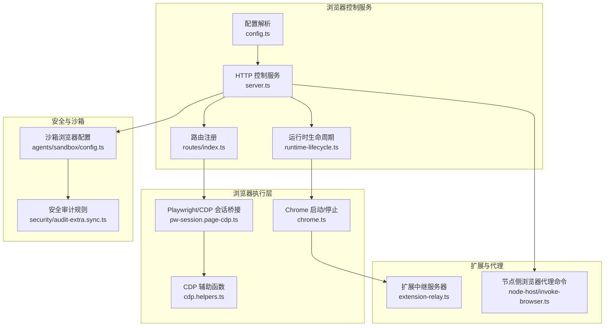
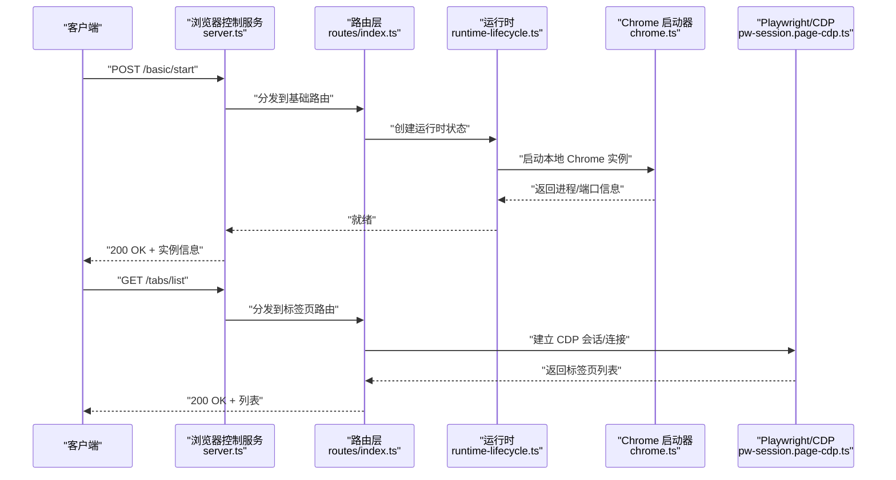
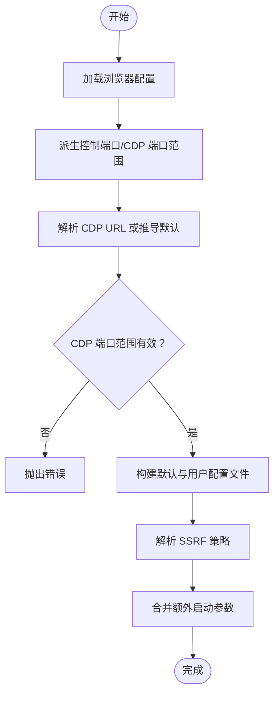
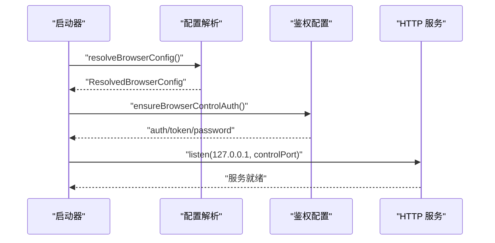
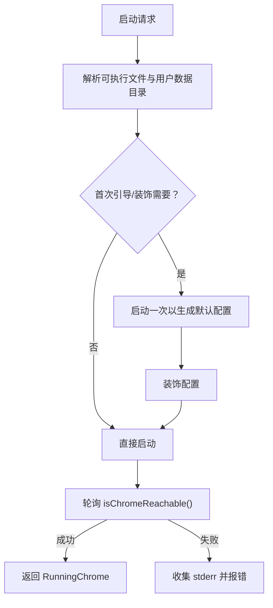
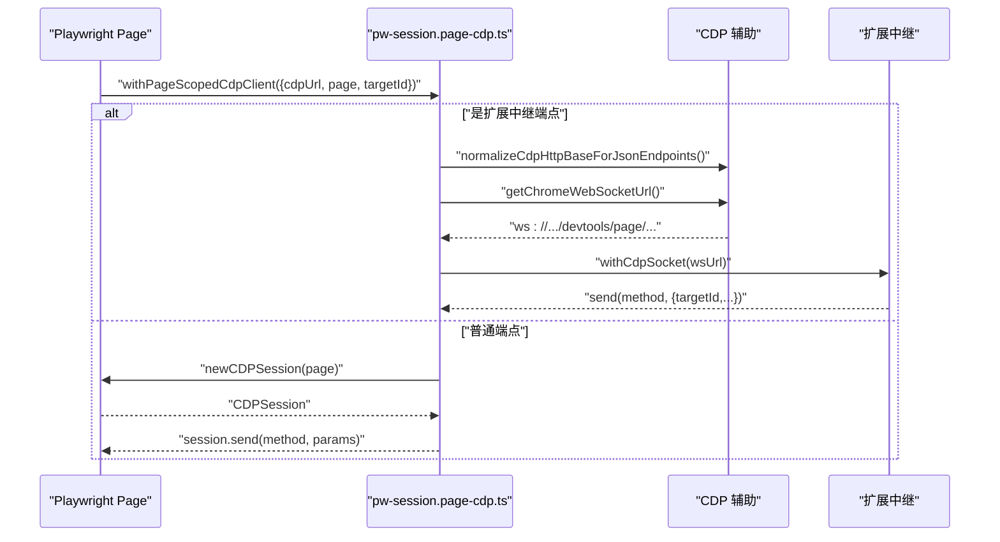
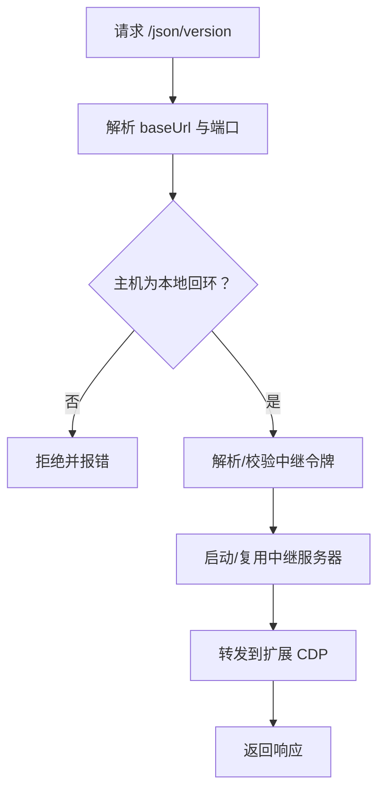
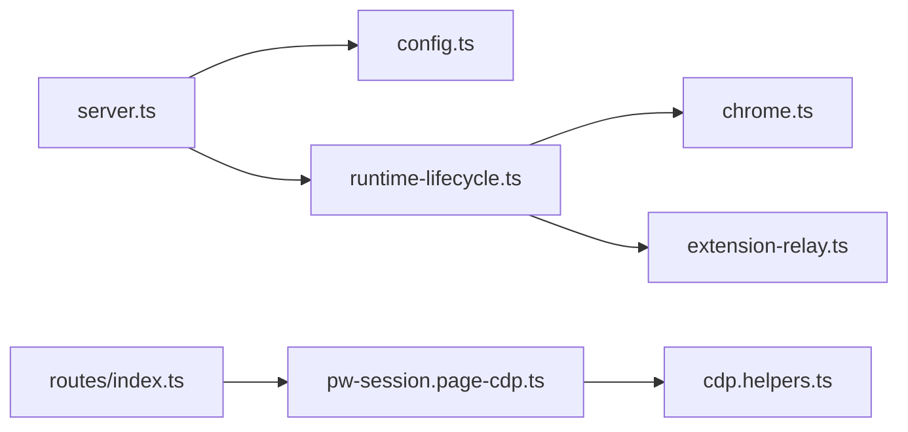

# 浏览器控制工具

<cite>
**本文引用的文件**
- [src/browser/config.ts](file://src/browser/config.ts)
- [src/browser/server.ts](file://src/browser/server.ts)
- [src/browser/chrome.ts](file://src/browser/chrome.ts)
- [src/browser/runtime-lifecycle.ts](file://src/browser/runtime-lifecycle.ts)
- [src/browser/routes/index.ts](file://src/browser/routes/index.ts)
- [src/browser/constants.ts](file://src/browser/constants.ts)
- [src/browser/profiles.ts](file://src/browser/profiles.ts)
- [src/browser/pw-session.page-cdp.ts](file://src/browser/pw-session.page-cdp.ts)
- [src/browser/cdp.helpers.ts](file://src/browser/cdp.helpers.ts)
- [src/browser/extension-relay.ts](file://src/browser/extension-relay.ts)
- [src/node-host/invoke-browser.ts](file://src/node-host/invoke-browser.ts)
- [src/agents/sandbox/config.ts](file://src/agents/sandbox/config.ts)
- [src/security/audit-extra.sync.ts](file://src/security/audit-extra.sync.ts)
- [assets/chrome-extension/manifest.json](file://assets/chrome-extension/manifest.json)
- [assets/chrome-extension/background.js](file://assets/chrome-extension/background.js)
- [assets/chrome-extension/options.js](file://assets/chrome-extension/options.js)
- [docs/tools/browser.md](file://docs/tools/browser.md)
- [docs/tools/browser-login.md](file://docs/tools/browser-login.md)
- [docs/tools/browser-linux-troubleshooting.md](file://docs/tools/browser-linux-troubleshooting.md)
- [docs/tools/browser-wsl2-windows-remote-cdp-troubleshooting.md](file://docs/tools/browser-wsl2-windows-remote-cdp-troubleshooting.md)
</cite>

## 目录
1. [简介](#简介)
2. [项目结构](#项目结构)
3. [核心组件](#核心组件)
4. [架构总览](#架构总览)
5. [详细组件分析](#详细组件分析)
6. [依赖关系分析](#依赖关系分析)
7. [性能考量](#性能考量)
8. [故障排除指南](#故障排除指南)
9. [结论](#结论)
10. [附录](#附录)

## 简介
本文件系统性阐述 OpenClaw 的浏览器控制能力，覆盖浏览器实例管理、标签页操作、UI 交互、快照与截图、配置体系、多实例支持、用户浏览器集成与主机浏览器模式、安全策略与沙箱机制，以及 Playwright 集成、CDP 连接、代理与扩展中继认证等高级主题。目标是帮助开发者与运维人员在理解实现细节的同时，快速上手并安全地使用浏览器控制工具。

## 项目结构
浏览器控制子系统由“配置解析”“HTTP 控制服务”“Chrome 启动与生命周期”“路由注册”“Playwright/CDP 会话桥接”“扩展中继”“沙箱与安全审计”等多个模块组成，围绕统一的配置模型与端口分配策略运行。

**图表来源**
- [src/browser/config.ts:200-306](file://src/browser/config.ts#L200-L306)
- [src/browser/server.ts:20-86](file://src/browser/server.ts#L20-L86)
- [src/browser/runtime-lifecycle.ts:6-25](file://src/browser/runtime-lifecycle.ts#L6-L25)
- [src/browser/routes/index.ts:7-11](file://src/browser/routes/index.ts#L7-L11)
- [src/browser/chrome.ts:256-433](file://src/browser/chrome.ts#L256-L433)
- [src/browser/pw-session.page-cdp.ts:42-81](file://src/browser/pw-session.page-cdp.ts#L42-L81)
- [src/browser/cdp.helpers.ts:72-97](file://src/browser/cdp.helpers.ts#L72-L97)
- [src/browser/extension-relay.ts:225-264](file://src/browser/extension-relay.ts#L225-L264)
- [src/node-host/invoke-browser.ts:210-237](file://src/node-host/invoke-browser.ts#L210-L237)
- [src/agents/sandbox/config.ts:53-67](file://src/agents/sandbox/config.ts#L53-L67)
- [src/security/audit-extra.sync.ts:942-979](file://src/security/audit-extra.sync.ts#L942-L979)

**章节来源**
- [src/browser/config.ts:200-306](file://src/browser/config.ts#L200-L306)
- [src/browser/server.ts:20-86](file://src/browser/server.ts#L20-L86)
- [src/browser/routes/index.ts:7-11](file://src/browser/routes/index.ts#L7-L11)

## 核心组件
- 配置解析与默认值：负责解析浏览器启用状态、CDP 端口范围、远程超时、颜色、可执行路径、无沙箱模式、仅附加模式、默认与用户配置文件、SSRF 策略、额外启动参数、扩展中继绑定主机等。
- HTTP 控制服务：基于 Express 构建，安装通用与鉴权中间件，注册基础、标签页、代理等路由，监听本地回环地址。
- Chrome 启动与生命周期：解析可执行文件、准备用户数据目录、装饰配置、首次引导、健康探测、优雅关闭。
- 路由注册：聚合基础、标签页、代理三类路由。
- Playwright/CDP 会话桥接：在页面上下文内建立 CDP 会话或通过扩展中继直连 WebSocket。
- 扩展中继：为扩展驱动的 CDP 提供本地反向代理与认证头注入。
- 沙箱与安全审计：容器网络隔离、CDP 入口限制、暴露风险提示。

**章节来源**
- [src/browser/config.ts:19-51](file://src/browser/config.ts#L19-L51)
- [src/browser/server.ts:53-85](file://src/browser/server.ts#L53-L85)
- [src/browser/chrome.ts:256-433](file://src/browser/chrome.ts#L256-L433)
- [src/browser/routes/index.ts:7-11](file://src/browser/routes/index.ts#L7-L11)
- [src/browser/pw-session.page-cdp.ts:42-81](file://src/browser/pw-session.page-cdp.ts#L42-L81)
- [src/browser/extension-relay.ts:225-264](file://src/browser/extension-relay.ts#L225-L264)
- [src/agents/sandbox/config.ts:53-67](file://src/agents/sandbox/config.ts#L53-L67)

## 架构总览
浏览器控制采用“配置驱动 + 本地 HTTP 服务 + 多模式 CDP 连接”的架构。服务仅监听 127.0.0.1，结合令牌或密码鉴权；支持三种驱动模式：
- OpenClaw 自管实例（本地启动）
- 扩展中继（通过扩展提供的 CDP）
- 已存在会话（用户浏览器现有会话）

**图表来源**
- [src/browser/server.ts:20-86](file://src/browser/server.ts#L20-L86)
- [src/browser/routes/index.ts:7-11](file://src/browser/routes/index.ts#L7-L11)
- [src/browser/runtime-lifecycle.ts:6-25](file://src/browser/runtime-lifecycle.ts#L6-L25)
- [src/browser/chrome.ts:256-433](file://src/browser/chrome.ts#L256-L433)
- [src/browser/pw-session.page-cdp.ts:42-81](file://src/browser/pw-session.page-cdp.ts#L42-L81)

## 详细组件分析

### 组件一：浏览器配置与端口分配
- 解析逻辑要点
  - 启用开关、评估开关、控制端口派生、CDP 端口范围派生与校验、协议与主机判定、远程超时与握手超时、颜色、可执行路径、headless/noSandbox、仅附加模式、默认与用户配置文件、SSRF 策略、额外参数、扩展中继绑定主机。
  - 默认配置常量集中于常量文件，确保一致性。
  - 端口分配策略与保留端口在 profiles 模块中定义，避免冲突。
- 关键行为
  - 当未显式提供 CDP URL 时，自动推导位于控制端口+1 的 HTTP CDP 地址。
  - 用户配置文件“user”用于现有会话附加场景。
  - 支持 WebSocket/HTTPS 协议的 CDP URL 并保持原样以保留查询参数。

**图表来源**
- [src/browser/config.ts:200-306](file://src/browser/config.ts#L200-L306)
- [src/browser/constants.ts:1-9](file://src/browser/constants.ts#L1-L9)
- [src/browser/profiles.ts:15-45](file://src/browser/profiles.ts#L15-L45)

**章节来源**
- [src/browser/config.ts:200-306](file://src/browser/config.ts#L200-L306)
- [src/browser/constants.ts:1-9](file://src/browser/constants.ts#L1-L9)
- [src/browser/profiles.ts:15-45](file://src/browser/profiles.ts#L15-L45)

### 组件二：HTTP 控制服务与鉴权
- 启动流程
  - 加载全局配置，解析浏览器配置，若禁用则不启动。
  - 尝试自动配置鉴权（令牌），若失败且无显式鉴权则拒绝启动。
  - 安装通用与鉴权中间件，注册路由，绑定到 127.0.0.1:controlPort。
- 停止流程
  - 停止已知浏览器实例，关闭 HTTP 服务器，清理运行时状态。
- 鉴权模式
  - 支持令牌、密码或关闭（off）三种模式，日志记录当前模式。

**图表来源**
- [src/browser/server.ts:20-86](file://src/browser/server.ts#L20-L86)

**章节来源**
- [src/browser/server.ts:20-86](file://src/browser/server.ts#L20-L86)

### 组件三：Chrome 启动、可达性与健康检查
- 启动步骤
  - 解析可执行文件（按平台），准备用户数据目录，必要时首次引导与装饰。
  - 以指定 CDP 端口启动，轮询可达性，失败时收集 stderr 提示（如 Linux 无沙箱建议）。
- 健康检查
  - 对 HTTP CDP：请求 /json/version；对 WebSocket CDP：握手后发送 Browser.getVersion 命令验证。
- 停止策略
  - 优先 SIGTERM，超时后 SIGKILL；轮询确认退出。

**图表来源**
- [src/browser/chrome.ts:256-433](file://src/browser/chrome.ts#L256-L433)
- [src/browser/chrome.ts:103-166](file://src/browser/chrome.ts#L103-L166)

**章节来源**
- [src/browser/chrome.ts:256-433](file://src/browser/chrome.ts#L256-L433)
- [src/browser/chrome.ts:103-166](file://src/browser/chrome.ts#L103-L166)

### 组件四：Playwright 与 CDP 会话桥接
- 目标
  - 在 Playwright Page 上下文中获取 CDP 会话，或通过扩展中继直连 WebSocket。
- 识别中继
  - 通过 /json/version 的 Browser 字段判断是否为扩展中继端点。
- 两种路径
  - 页面级：page.context().newCDPSession(page)，调用 session.send。
  - 中继直连：从 CDP HTTP 基础获取 WebSocket URL，通过 withCdpSocket 发送消息并附带 targetId。
- 认证头注入
  - 通过 getHeadersWithAuth 合并扩展中继认证头与 URL 中的 Basic 凭据。

**图表来源**
- [src/browser/pw-session.page-cdp.ts:20-81](file://src/browser/pw-session.page-cdp.ts#L20-L81)
- [src/browser/cdp.helpers.ts:72-97](file://src/browser/cdp.helpers.ts#L72-L97)

**章节来源**
- [src/browser/pw-session.page-cdp.ts:20-81](file://src/browser/pw-session.page-cdp.ts#L20-L81)
- [src/browser/cdp.helpers.ts:72-97](file://src/browser/cdp.helpers.ts#L72-L97)

### 组件五：扩展中继与认证
- 功能
  - 为扩展驱动的 CDP 提供本地反向代理，确保只接受本地回环地址，支持重连与命令等待策略。
- 认证
  - 通过环境变量与令牌集合进行访问控制，自动解析端口对应的认证令牌。
- 安全
  - 严格要求 CDP URL 主机为本地回环；支持自定义 bindHost 以适配不同网络环境。

**图表来源**
- [src/browser/extension-relay.ts:114-153](file://src/browser/extension-relay.ts#L114-L153)
- [src/browser/extension-relay.ts:225-264](file://src/browser/extension-relay.ts#L225-L264)

**章节来源**
- [src/browser/extension-relay.ts:114-153](file://src/browser/extension-relay.ts#L114-L153)
- [src/browser/extension-relay.ts:225-264](file://src/browser/extension-relay.ts#L225-L264)

### 组件六：多实例支持与用户浏览器集成
- 多实例
  - 通过配置文件为每个实例分配独立 CDP 端口，避免冲突；支持显式范围传入以避免多实例碰撞。
- 用户浏览器集成
  - “user”配置文件用于现有会话附加（existing-session），无需本地启动，适合与用户已打开的浏览器协同。
- 主机浏览器模式
  - 通过解析可执行文件与启动参数，支持 headless/noSandbox 等模式，满足不同部署环境需求。

**章节来源**
- [src/browser/profiles.ts:15-45](file://src/browser/profiles.ts#L15-L45)
- [src/browser/config.ts:312-367](file://src/browser/config.ts#L312-L367)
- [src/browser/chrome.ts:297-313](file://src/browser/chrome.ts#L297-L313)

### 组件七：安全策略、权限控制与沙箱机制
- 安全策略
  - SSRF 策略：允许私有网络访问与否、允许主机名白名单等，浏览器默认信任网络模式。
  - CDP 访问限制：通过断言与 URL 规范化确保仅允许受控端点。
- 权限控制
  - HTTP 服务仅监听 127.0.0.1，结合令牌或密码鉴权；扩展中继强制本地回环。
- 沙箱机制
  - 沙箱浏览器容器网络可配置，默认网络与绑定挂载；若使用桥接网络且未限制 CDP 源范围，将触发安全审计警告。
- 审计与修复建议
  - 若发现未限制 CDP 源范围，建议设置专用桥接网络或设置 cdpSourceRange 限制入口。

**章节来源**
- [src/browser/config.ts:101-128](file://src/browser/config.ts#L101-L128)
- [src/browser/cdp.helpers.ts:43-59](file://src/browser/cdp.helpers.ts#L43-L59)
- [src/agents/sandbox/config.ts:53-67](file://src/agents/sandbox/config.ts#L53-L67)
- [src/security/audit-extra.sync.ts:942-979](file://src/security/audit-extra.sync.ts#L942-L979)

### 组件八：Playwright 集成与标签页操作
- 集成方式
  - 通过 pw-session.page-cdp.ts 在页面上下文内建立 CDP 会话，支持按 targetId 发送命令。
- 标签页操作
  - 路由层注册标签页相关接口，结合 CDP 命令实现新建、切换、关闭、截图、快照等操作。
- 快照与截图
  - 截图通过 CDP 命令实现；AI 快照具备字符上限与高效深度配置，避免过大负载。

**章节来源**
- [src/browser/pw-session.page-cdp.ts:42-81](file://src/browser/pw-session.page-cdp.ts#L42-L81)
- [src/browser/routes/index.ts:7-11](file://src/browser/routes/index.ts#L7-L11)
- [src/browser/constants.ts:6-9](file://src/browser/constants.ts#L6-L9)

### 组件九：节点侧浏览器代理命令与权限控制
- 用途
  - 在节点环境中通过代理命令访问浏览器控制接口，支持路径与配置参数。
- 权限控制
  - 若代理禁用则直接拒绝；若启用了允许的配置文件列表，则对非 /profiles 路径请求校验目标配置文件是否在允许列表中。

**章节来源**
- [src/node-host/invoke-browser.ts:210-237](file://src/node-host/invoke-browser.ts#L210-L237)

## 依赖关系分析
- 组件耦合
  - server.ts 依赖 config.ts 与 runtime-lifecycle.ts；runtime-lifecycle.ts 依赖 chrome.ts 与 extension-relay.ts。
  - routes/index.ts 聚合基础、标签页、代理路由；pw-session.page-cdp.ts 依赖 cdp.helpers.ts。
- 外部依赖
  - Playwright-core 用于页面与 CDP 会话；Express 用于 HTTP 服务；Node child_process/fs/os/path 用于进程与文件系统。
- 可能的循环依赖
  - 代码组织清晰，未见直接循环导入；各模块职责单一，通过上下文与状态传递解耦。

**图表来源**
- [src/browser/server.ts:1-100](file://src/browser/server.ts#L1-L100)
- [src/browser/config.ts:1-372](file://src/browser/config.ts#L1-L372)
- [src/browser/runtime-lifecycle.ts:1-61](file://src/browser/runtime-lifecycle.ts#L1-L61)
- [src/browser/chrome.ts:1-466](file://src/browser/chrome.ts#L1-L466)
- [src/browser/extension-relay.ts:114-264](file://src/browser/extension-relay.ts#L114-L264)
- [src/browser/routes/index.ts:1-12](file://src/browser/routes/index.ts#L1-L12)
- [src/browser/pw-session.page-cdp.ts:1-81](file://src/browser/pw-session.page-cdp.ts#L1-L81)
- [src/browser/cdp.helpers.ts:61-97](file://src/browser/cdp.helpers.ts#L61-L97)

**章节来源**
- [src/browser/server.ts:1-100](file://src/browser/server.ts#L1-L100)
- [src/browser/routes/index.ts:1-12](file://src/browser/routes/index.ts#L1-L12)

## 性能考量
- 启动与健康检查
  - 启动阶段采用轮询与超时控制，避免阻塞；健康检查区分 HTTP 与 WebSocket 路径，减少不必要的握手成本。
- CDP 会话
  - 页面级会话与中继直连并存，按需选择；targetId 限定命令作用域，降低全局扫描开销。
- SSRF 与安全
  - 严格的 URL 断言与白名单策略，避免无效或高风险请求导致资源浪费。
- 日志与可观测性
  - 关键路径输出子系统日志，便于定位性能瓶颈与异常。

[本节为通用指导，不直接分析具体文件]

## 故障排除指南
- Linux 启动失败（无沙箱）
  - 现象：启动 CDP 失败，stderr 包含权限或共享内存相关提示。
  - 处理：在配置中启用无沙箱模式，或在容器中以非 root 运行并调整共享内存限制。
- WSL2/远程 CDP 连接问题
  - 现象：无法通过本地回环访问远端 CDP。
  - 处理：使用扩展中继并在本地回环绑定，或通过隧道映射端口；确保令牌与源 IP 限制正确。
- 代理命令被拒
  - 现象：节点侧代理命令返回不可用或请求无效。
  - 处理：检查代理是否启用与允许的配置文件列表；确认请求路径与目标配置文件在允许范围内。
- 沙箱暴露风险
  - 现象：安全审计提示 CDP 桥接网络未限制源范围。
  - 处理：为浏览器容器使用专用桥接网络，或设置 cdpSourceRange 限制入口。

**章节来源**
- [src/browser/chrome.ts:402-414](file://src/browser/chrome.ts#L402-L414)
- [docs/tools/browser-linux-troubleshooting.md](file://docs/tools/browser-linux-troubleshooting.md)
- [docs/tools/browser-wsl2-windows-remote-cdp-troubleshooting.md](file://docs/tools/browser-wsl2-windows-remote-cdp-troubleshooting.md)
- [src/node-host/invoke-browser.ts:210-237](file://src/node-host/invoke-browser.ts#L210-L237)
- [src/security/audit-extra.sync.ts:942-979](file://src/security/audit-extra.sync.ts#L942-L979)

## 结论
OpenClaw 的浏览器控制工具以“配置驱动 + 本地 HTTP 服务 + 多模式 CDP 连接”为核心，既支持本地启动的 OpenClaw 实例，也兼容扩展中继与用户现有会话。通过严格的鉴权、SSRF 策略与沙箱审计，保障了在复杂部署环境中的安全性与稳定性。配合 Playwright/CDP 会话桥接与丰富的标签页操作接口，能够满足从自动化到 UI 交互的广泛场景。

[本节为总结，不直接分析具体文件]

## 附录
- 扩展与代理
  - Chrome 扩展清单与后台脚本用于与浏览器控制服务协作，提供认证与选项管理。
- 文档参考
  - 浏览器工具与登录、Linux 故障排除、WSL2 远程 CDP 故障排除等专题文档，可作为实操补充。

**章节来源**
- [assets/chrome-extension/manifest.json](file://assets/chrome-extension/manifest.json)
- [assets/chrome-extension/background.js](file://assets/chrome-extension/background.js)
- [assets/chrome-extension/options.js](file://assets/chrome-extension/options.js)
- [docs/tools/browser.md](file://docs/tools/browser.md)
- [docs/tools/browser-login.md](file://docs/tools/browser-login.md)
- [docs/tools/browser-linux-troubleshooting.md](file://docs/tools/browser-linux-troubleshooting.md)
- [docs/tools/browser-wsl2-windows-remote-cdp-troubleshooting.md](file://docs/tools/browser-wsl2-windows-remote-cdp-troubleshooting.md)