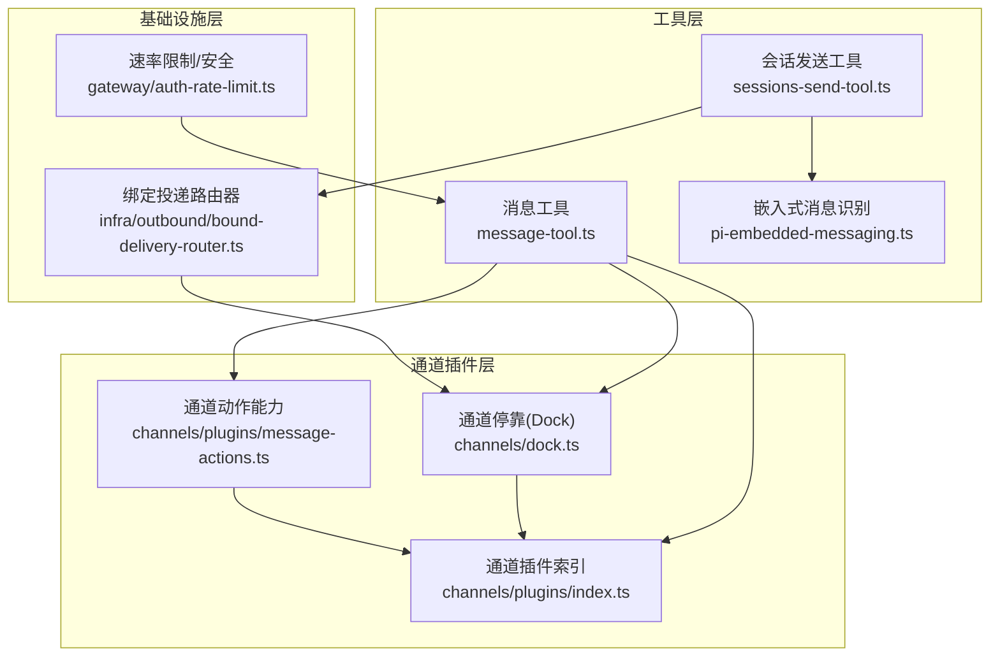
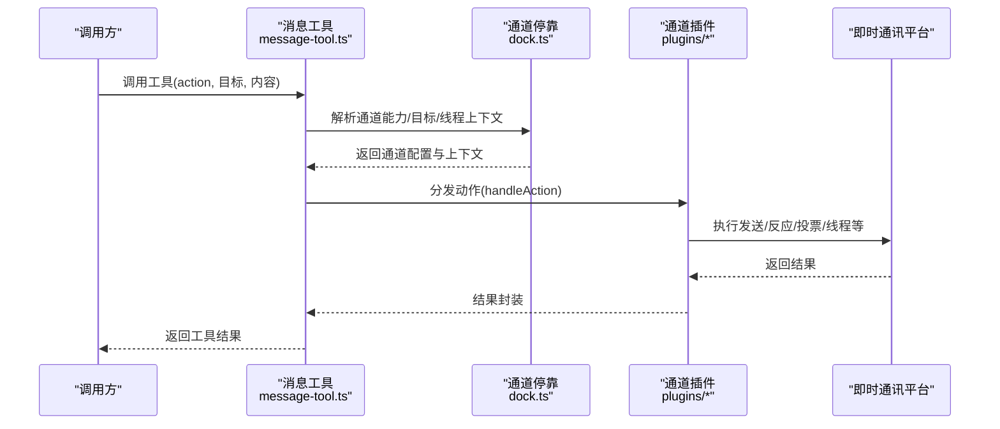
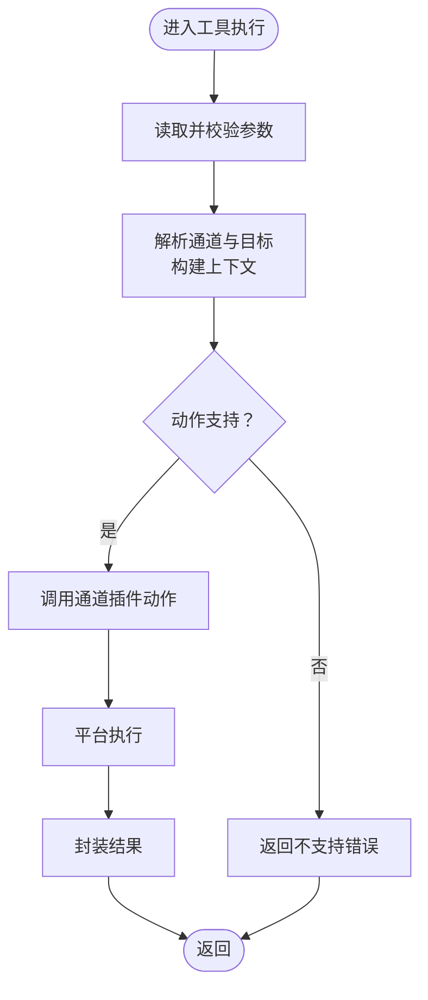
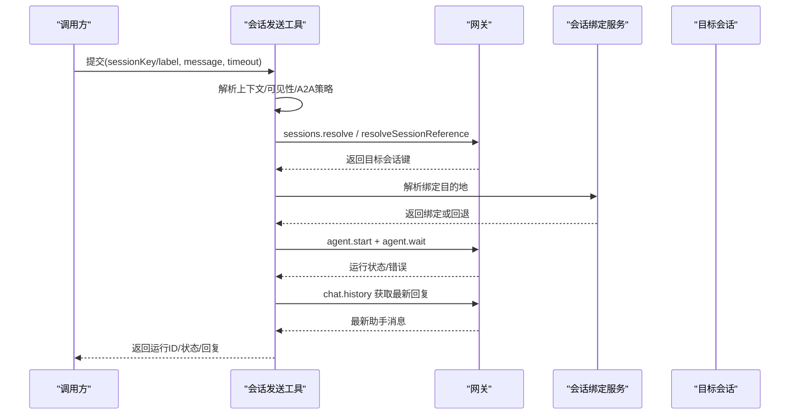
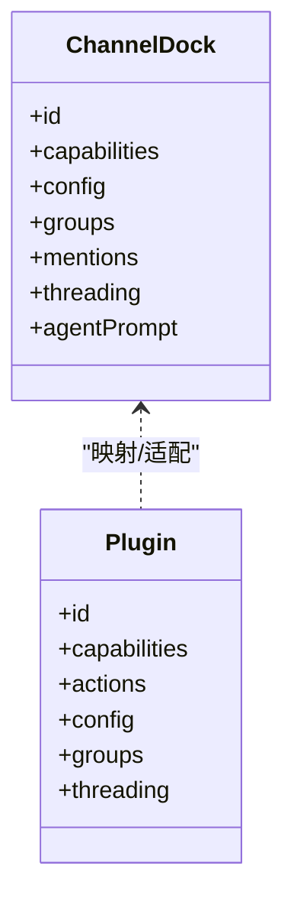
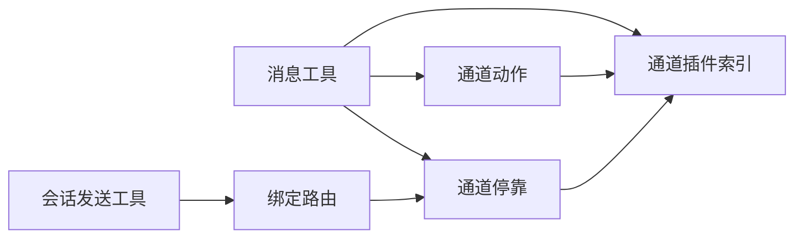

# 消息发送工具

<cite>
**本文档引用的文件**
- [sessions-send-tool.ts](file://src/agents/tools/sessions-send-tool.ts)
- [message-tool.ts](file://src/agents/tools/message-tool.ts)
- [pi-embedded-messaging.ts](file://src/agents/pi-embedded-messaging.ts)
- [sessions-helpers.ts](file://src/agents/tools/sessions-helpers.ts)
- [dock.ts](file://src/channels/dock.ts)
- [index.ts](file://src/channels/plugins/index.ts)
- [message-actions.ts](file://src/channels/plugins/message-actions.ts)
- [whatsapp.ts](file://src/config/types.whatsapp.ts)
- [zod-schema.providers-whatsapp.ts](file://src/config/zod-schema.providers-whatsapp.ts)
- [channel.setup.ts](file://extensions/whatsapp/src/channel.setup.ts)
- [channel.ts](file://extensions/whatsapp/src/channel.ts)
- [send-reactions.ts](file://extensions/signal/src/send-reactions.ts)
- [send-reactions.test.ts](file://extensions/signal/src/send-reactions.test.ts)
- [listeners.ts](file://extensions/discord/src/monitor/listeners.ts)
- [channel.ts](file://extensions/mattermost/src/channel.ts)
- [bound-delivery-router.ts](file://src/infra/outbound/bound-delivery-router.ts)
- [session-binding-channel-agnostic.md](file://docs/experiments/plans/session-binding-channel-agnostic.md)
- [auth-rate-limit.ts](file://src/gateway/auth-rate-limit.ts)
- [auth-context.ts](file://src/gateway/server/ws-connection/auth-context.ts)
- [unauthorized-flood-guard.test.ts](file://src/gateway/server/ws-connection/unauthorized-flood-guard.test.ts)
- [loop-rate-limiter.ts](file://extensions/imessage/src/monitor/loop-rate-limiter.ts)
- [command-gating.ts](file://src/channels/command-gating.ts)
- [command-gating.test.ts](file://src/channels/command-gating.test.ts)
- [SECURITY.md](file://SECURITY.md)
</cite>

## 目录
1. [简介](#简介)
2. [项目结构](#项目结构)
3. [核心组件](#核心组件)
4. [架构总览](#架构总览)
5. [详细组件分析](#详细组件分析)
6. [依赖关系分析](#依赖关系分析)
7. [性能考虑](#性能考虑)
8. [故障排除指南](#故障排除指南)
9. [结论](#结论)
10. [附录](#附录)

## 简介
本文件系统性阐述消息发送工具在跨平台即时通讯中的设计与实现，覆盖以下关键能力：
- 跨平台消息发送：通过统一的“消息工具”对接多通道（Telegram、WhatsApp、Discord、Slack、Signal、iMessage、IRC、Google Chat、Mattermost 等），按通道特性进行目标解析、能力适配与内容投递。
- 频道操作与权限控制：支持频道级配置、允许白名单、组策略、提及要求、线程模式等；对高风险动作（如封禁、踢出）要求可信请求者身份。
- 会话管理与路由：提供“会话发送”工具，支持跨会话消息、标签解析、沙箱可见性、A2A（Agent-to-Agent）策略与超时等待；结合会话绑定服务实现线程/子代理的精准路由。
- 反应与交互：各通道的反应（Reaction）添加/移除、投票、媒体、按钮/组件、线程/话题管理等。
- 安全策略与限流：认证限流、未授权连接防护、循环速率限制、命令访问组授权、错误分类与隔离。

## 项目结构
消息发送工具由“工具层”“通道插件层”“基础设施层”三部分组成：
- 工具层：提供统一的消息工具与会话发送工具，负责参数校验、上下文构建、结果封装。
- 通道插件层：为每个即时通讯平台提供能力注册、目标解析、线程上下文、组策略等。
- 基础设施层：会话绑定、路由选择、速率限制、安全审计等。

**图表来源**
- [message-tool.ts:1-800](file://src/agents/tools/message-tool.ts#L1-L800)
- [sessions-send-tool.ts:1-368](file://src/agents/tools/sessions-send-tool.ts#L1-L368)
- [pi-embedded-messaging.ts:1-42](file://src/agents/pi-embedded-messaging.ts#L1-L42)
- [index.ts:1-118](file://src/channels/plugins/index.ts#L1-L118)
- [dock.ts:1-637](file://src/channels/dock.ts#L1-L637)
- [message-actions.ts:1-99](file://src/channels/plugins/message-actions.ts#L1-L99)
- [bound-delivery-router.ts:49-91](file://src/infra/outbound/bound-delivery-router.ts#L49-L91)
- [auth-rate-limit.ts:1-23](file://src/gateway/auth-rate-limit.ts#L1-L23)

**章节来源**
- [message-tool.ts:1-800](file://src/agents/tools/message-tool.ts#L1-L800)
- [dock.ts:1-637](file://src/channels/dock.ts#L1-L637)
- [index.ts:1-118](file://src/channels/plugins/index.ts#L1-L118)

## 核心组件
- 消息工具（Message Tool）
  - 动作集合：send、broadcast、react、poll、pin、threads 等，按当前通道能力动态暴露。
  - 参数动态构建：根据通道支持的能力（组件、按钮、卡片、块）与轮询参数定义生成工具 Schema。
  - 目标解析：支持单目标、多目标、账户级默认目标、回复/线程上下文。
  - 行为扩展：通过通道插件 actions 接口扩展新动作，统一执行入口。
- 会话发送工具（Sessions Send Tool）
  - 跨会话消息：通过会话键或标签定位目标会话，支持沙箱可见性与 A2A 策略。
  - 上下文保护：输入参数校验、超时等待、历史提取、错误状态返回。
  - 绑定路由：结合会话绑定服务，优先命中已绑定的目标，否则回退到主通道。
- 通道插件与停靠（Channel Plugins & Dock）
  - 能力注册：声明 chatTypes、reactions、media、polls、nativeCommands、threads 等。
  - 目标解析：允许白名单、默认目标、提及规则、线程上下文构建。
  - 组策略：组内是否需要提及、工具策略、介绍提示等。
- 嵌入式消息识别
  - 识别 sessions_send 与 message 工具的发送动作，支持 provider docking 的自定义动作。

**章节来源**
- [message-tool.ts:549-770](file://src/agents/tools/message-tool.ts#L549-L770)
- [sessions-send-tool.ts:27-368](file://src/agents/tools/sessions-send-tool.ts#L27-L368)
- [dock.ts:238-556](file://src/channels/dock.ts#L238-L556)
- [pi-embedded-messaging.ts:11-42](file://src/agents/pi-embedded-messaging.ts#L11-L42)

## 架构总览
消息发送从工具调用开始，经通道插件解析与适配，最终落到具体平台的实现。会话发送工具额外引入会话绑定与上下文保护。

**图表来源**
- [message-tool.ts:792-800](file://src/agents/tools/message-tool.ts#L792-L800)
- [dock.ts:558-637](file://src/channels/dock.ts#L558-L637)
- [message-actions.ts:82-99](file://src/channels/plugins/message-actions.ts#L82-L99)

## 详细组件分析

### 消息工具（跨平台发送与操作）
- 动作与能力
  - 动作集合：基于通道插件 actions 列表与当前通道能力动态生成，确保 send 为基础能力。
  - 能力开关：组件（components）、按钮（buttons）、卡片（cards）、块（blocks）、交互（interactive）、轮询（polls）等按通道启用。
- 参数与路由
  - 支持单目标/多目标、账户级默认目标、回复/线程上下文、静默/最佳努力等。
  - 对 Telegram、Discord、Slack 等平台提供专用参数（如 Telegram 回复参数、Discord 组件、Slack Blocks）。
- 执行流程
  - 参数读取与校验 → 目标标准化 → 通道动作分发 → 平台执行 → 结果封装。

**图表来源**
- [message-tool.ts:792-800](file://src/agents/tools/message-tool.ts#L792-L800)
- [message-actions.ts:82-99](file://src/channels/plugins/message-actions.ts#L82-L99)

**章节来源**
- [message-tool.ts:549-770](file://src/agents/tools/message-tool.ts#L549-L770)
- [message-tool.ts:772-800](file://src/agents/tools/message-tool.ts#L772-L800)

### 会话发送工具（跨会话消息）
- 会话解析与可见性
  - 支持 sessionKey 或 label 定位目标；label 模式下可限定 agentId 与沙箱可见范围。
  - A2A 策略：跨代理发送需开启并满足允许列表；沙箱模式限制仅能解析自身派生的会话。
- 上下文与保护
  - 输入参数校验、超时等待、历史提取、错误状态返回；对并发/超时/错误进行明确区分。
  - 会话可见性守卫：根据策略与请求者角色决定是否允许发送。
- 绑定路由
  - 优先使用会话绑定服务解析目标；若无绑定则回退到主通道；避免隐藏重定向。

**图表来源**
- [sessions-send-tool.ts:77-368](file://src/agents/tools/sessions-send-tool.ts#L77-L368)
- [bound-delivery-router.ts:49-91](file://src/infra/outbound/bound-delivery-router.ts#L49-L91)

**章节来源**
- [sessions-send-tool.ts:27-368](file://src/agents/tools/sessions-send-tool.ts#L27-L368)
- [sessions-helpers.ts:78-92](file://src/agents/tools/sessions-helpers.ts#L78-L92)
- [bound-delivery-router.ts:49-91](file://src/infra/outbound/bound-delivery-router.ts#L49-L91)

### 通道插件与停靠（能力与上下文）
- 通道能力
  - Telegram：原生命令、阻塞流、线程/话题、媒体、反应、轮询。
  - WhatsApp：直聊/群聊、轮询、反应、媒体、提及剥离、线程 ReplyToId。
  - Discord：原生命令、线程、组件、反应、媒体、阻塞流合并。
  - Slack：原生命令、线程、反应、媒体、阻塞流合并、线程回复模式。
  - Signal：直聊/群组、反应、媒体、阻塞流合并。
  - 其他：IRC、Google Chat、Mattermost、iMessage、LINE 等。
- 线程上下文
  - 不同平台的线程/话题标识不同，停靠模块统一构建 currentChannelId 与 currentThreadTs，并处理 ReplyToId 的兼容。
- 组策略与提及
  - 各通道支持 requireMention、工具策略、组介绍提示等，用于控制组内行为。

**图表来源**
- [dock.ts:65-82](file://src/channels/dock.ts#L65-L82)
- [dock.ts:238-556](file://src/channels/dock.ts#L238-L556)

**章节来源**
- [dock.ts:238-556](file://src/channels/dock.ts#L238-L556)
- [index.ts:74-84](file://src/channels/plugins/index.ts#L74-L84)

### 平台特定功能与示例

#### WhatsApp
- 配置与策略
  - 支持 reactions、sendMessage、polls 等动作开关；组策略、允许白名单、历史限制、文本分片等。
  - 认可反应（ackReaction）策略：支持在直聊/群聊中按策略自动反应。
- 线程与提及
  - 线程上下文使用 ReplyToId；提及剥离正则由通道共享模块提供。
- 设置适配
  - 插件提供 group 策略解析、目录查询、消息目标规范化等。

**章节来源**
- [whatsapp.ts:14-39](file://src/config/types.whatsapp.ts#L14-L39)
- [zod-schema.providers-whatsapp.ts:119-159](file://src/config/zod-schema.providers-whatsapp.ts#L119-L159)
- [channel.setup.ts:180-198](file://extensions/whatsapp/src/channel.setup.ts#L180-L198)
- [channel.ts:193-233](file://extensions/whatsapp/src/channel.ts#L193-L233)

#### Telegram
- 线程上下文
  - 优先使用 MessageThreadId；ReplyToId 在私聊中作为消息 ID，避免无效 message_thread_id。
- 默认目标与允许白名单
  - 支持按账户解析 defaultTo 与 allowFrom，并格式化前缀。

**章节来源**
- [dock.ts:262-280](file://src/channels/dock.ts#L262-L280)

#### Discord
- 反应通知
  - 根据 reaction 通知模式（off/all/allowlist/own）决定是否通知；线程场景下并行处理。
- 组件与线程
  - 支持组件、线程、阻塞流合并等。

**章节来源**
- [listeners.ts:588-624](file://extensions/discord/src/monitor/listeners.ts#L588-L624)
- [dock.ts:319-359](file://src/channels/dock.ts#L319-L359)

#### Signal
- 反应操作
  - 支持添加/移除反应；支持按 recipient 或 groupIds；targetAuthor 可选，默认回退到 recipient。
- 参数校验
  - 添加反应必须提供 emoji；移除反应必须提供 emoji 与有效时间戳。

**章节来源**
- [send-reactions.ts:164-190](file://extensions/signal/src/send-reactions.ts#L164-L190)
- [send-reactions.test.ts:36-65](file://extensions/signal/src/send-reactions.test.ts#L36-L65)

#### Mattermost
- 反应操作
  - 必须提供 messageId/postId 与 emoji；支持移除反应。

**章节来源**
- [channel.ts:94-144](file://extensions/mattermost/src/channel.ts#L94-L144)

### 会话绑定与上下文保护
- 绑定路由
  - 若存在唯一活跃绑定，则优先使用；否则回退到主通道；当有请求者信息时可避免歧义。
- 会话绑定实验
  - 明确目的：修复令牌复用、记录 webhook 出站活动、避免隐式主通道回退等；保持现有安全默认不变。

**章节来源**
- [bound-delivery-router.ts:49-91](file://src/infra/outbound/bound-delivery-router.ts#L49-L91)
- [session-binding-channel-agnostic.md:131-181](file://docs/experiments/plans/session-binding-channel-agnostic.md#L131-L181)

## 依赖关系分析
- 工具到插件
  - 消息工具通过通道插件索引与停靠模块获取能力与上下文；动作分发由通道插件 actions 实现。
- 会话到绑定
  - 会话发送工具依赖会话绑定服务解析目标；若无绑定则回退。
- 安全与限流
  - 认证限流与未授权洪水防护在网关层实施；通道层面提供命令访问组授权与可信请求者要求。

**图表来源**
- [message-tool.ts:792-800](file://src/agents/tools/message-tool.ts#L792-L800)
- [dock.ts:558-637](file://src/channels/dock.ts#L558-L637)
- [message-actions.ts:82-99](file://src/channels/plugins/message-actions.ts#L82-L99)
- [bound-delivery-router.ts:49-91](file://src/infra/outbound/bound-delivery-router.ts#L49-L91)

**章节来源**
- [index.ts:74-84](file://src/channels/plugins/index.ts#L74-L84)
- [dock.ts:238-556](file://src/channels/dock.ts#L238-L556)

## 性能考虑
- 文本分片与阻塞流合并
  - 不同平台设置不同的文本分片上限与阻塞流合并策略，以平衡传输效率与平台限制。
- 循环速率限制
  - iMessage 提供每对话窗口内的循环速率限制，抑制快速重复引发队列溢出。
- 超时与等待
  - 会话发送工具支持超时等待与历史提取，避免长时间阻塞；对 gateway 超时进行明确状态区分。

**章节来源**
- [dock.ts:91-95](file://src/channels/dock.ts#L91-L95)
- [loop-rate-limiter.ts:1-44](file://extensions/imessage/src/monitor/loop-rate-limiter.ts#L1-L44)
- [sessions-send-tool.ts:311-330](file://src/agents/tools/sessions-send-tool.ts#L311-L330)

## 故障排除指南
- 认证与速率限制
  - 网关层提供滑动窗口认证限流与未授权洪水防护，避免暴力尝试与滥用。
- 错误分类
  - 将上下文溢出与计费错误区分开来，避免错误归类导致的误判。
- 命令访问组授权
  - 当启用访问组时，未配置授权器将拒绝；可通过授权器组合或模式配置调整行为。
- 通道动作可信请求者
  - 对高风险动作（如 Discord 的 timeout/kick/ban）要求可信请求者身份，否则抛出错误。

**章节来源**
- [auth-rate-limit.ts:1-23](file://src/gateway/auth-rate-limit.ts#L1-L23)
- [auth-context.ts:114-134](file://src/gateway/server/ws-connection/auth-context.ts#L114-L134)
- [unauthorized-flood-guard.test.ts:1-48](file://src/gateway/server/ws-connection/unauthorized-flood-guard.test.ts#L1-L48)
- [command-gating.ts:1-29](file://src/channels/command-gating.ts#L1-L29)
- [command-gating.test.ts:1-111](file://src/channels/command-gating.test.ts#L1-L111)
- [message-actions.ts:15-18](file://src/channels/plugins/message-actions.ts#L15-L18)

## 结论
消息发送工具通过统一的工具接口与通道插件体系，实现了跨平台即时通讯的一致体验与可控能力。会话发送工具强化了跨会话通信的安全与路由精度，结合会话绑定与上下文保护，确保在复杂场景下的稳定性与可追溯性。平台特定能力（反应、投票、线程、组件等）在通道停靠与插件中集中管理，便于扩展与维护。安全与限流策略贯穿工具与通道两端，保障系统整体的健壮性。

## 附录
- 嵌入式消息识别
  - 识别 sessions_send 与 message 的发送动作，支持 provider docking 的自定义动作提取。
- 平台能力清单
  - Telegram、WhatsApp、Discord、Slack、Signal、iMessage、IRC、Google Chat、Mattermost 等均在停靠模块中声明能力与上下文。

**章节来源**
- [pi-embedded-messaging.ts:11-42](file://src/agents/pi-embedded-messaging.ts#L11-L42)
- [dock.ts:238-556](file://src/channels/dock.ts#L238-L556)