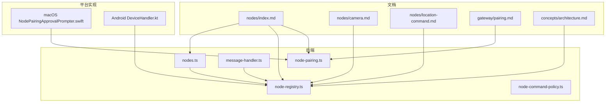
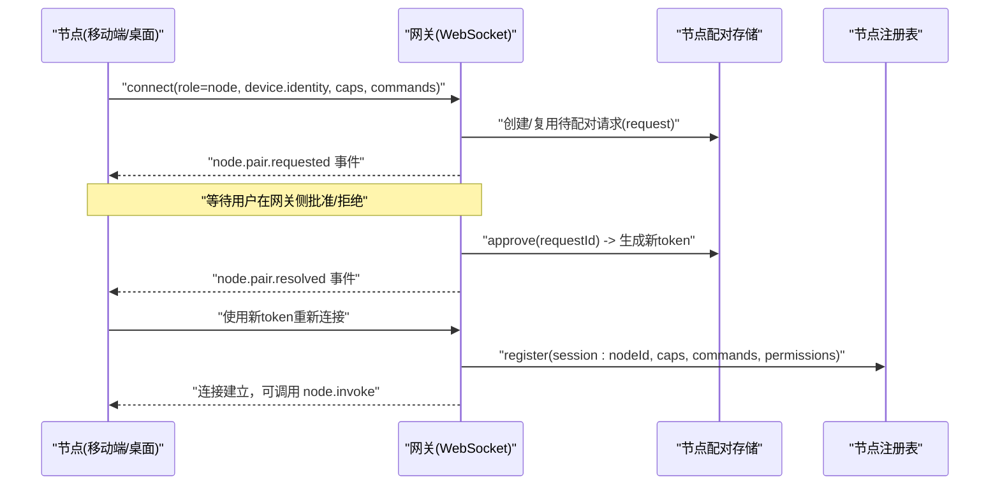
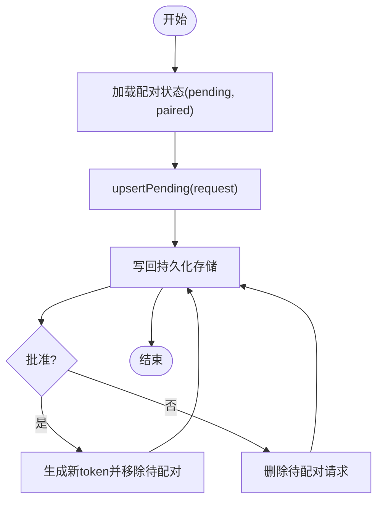
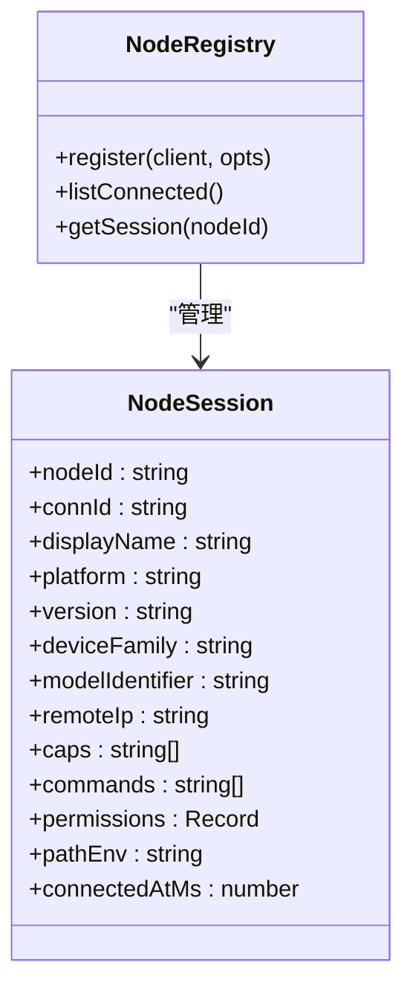
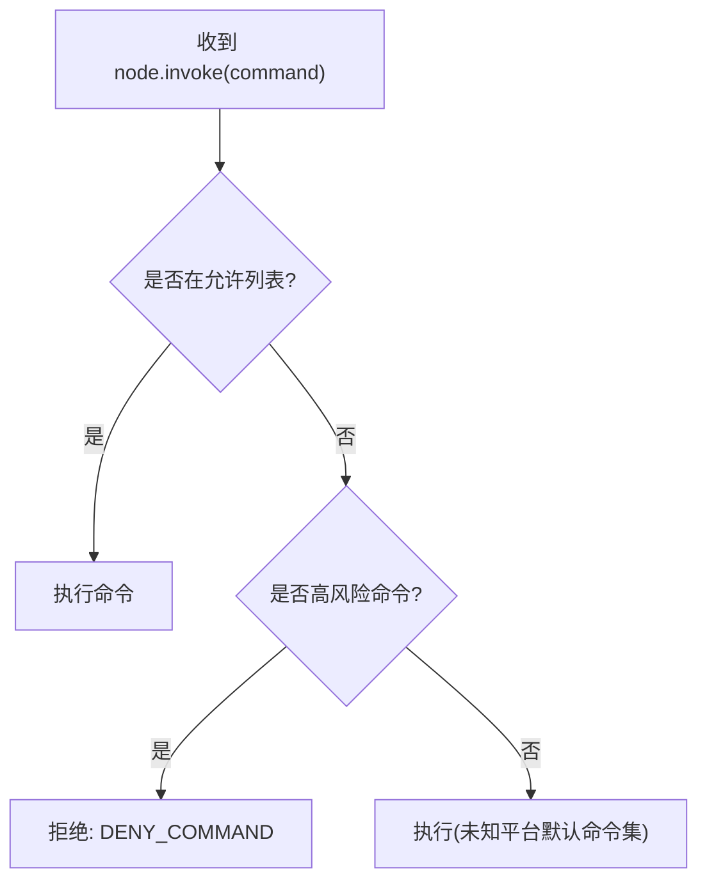
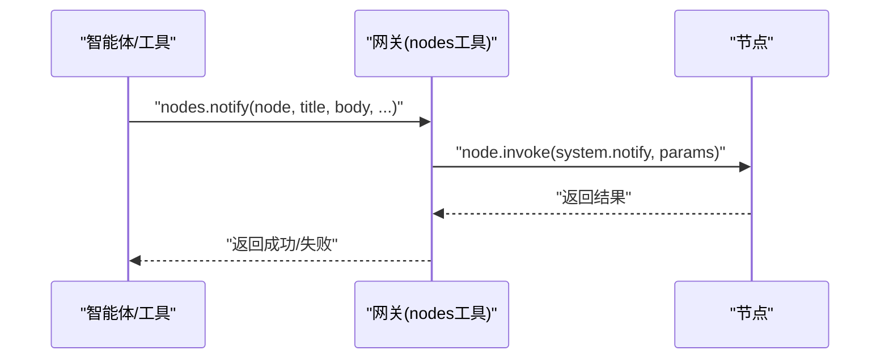
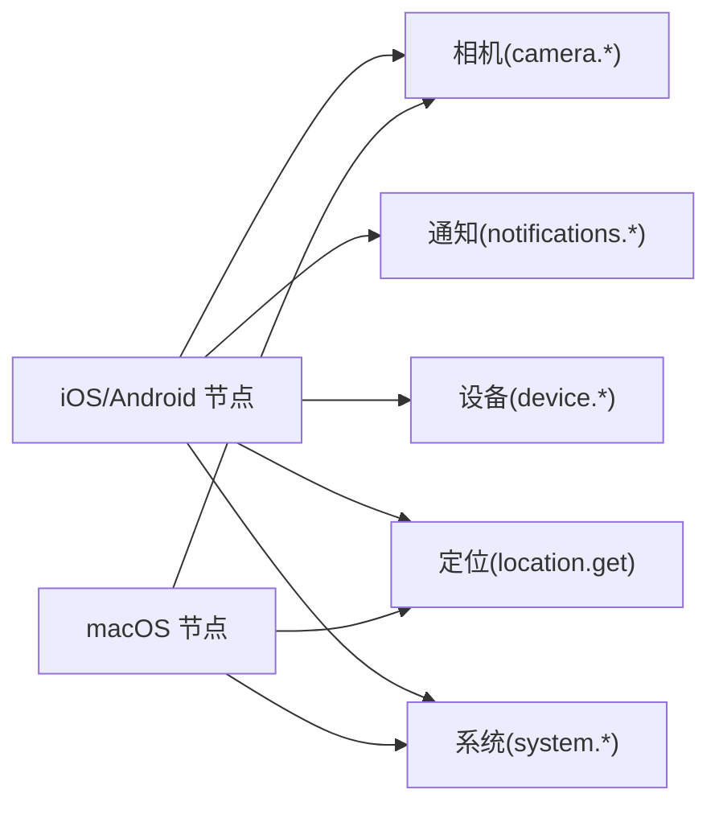
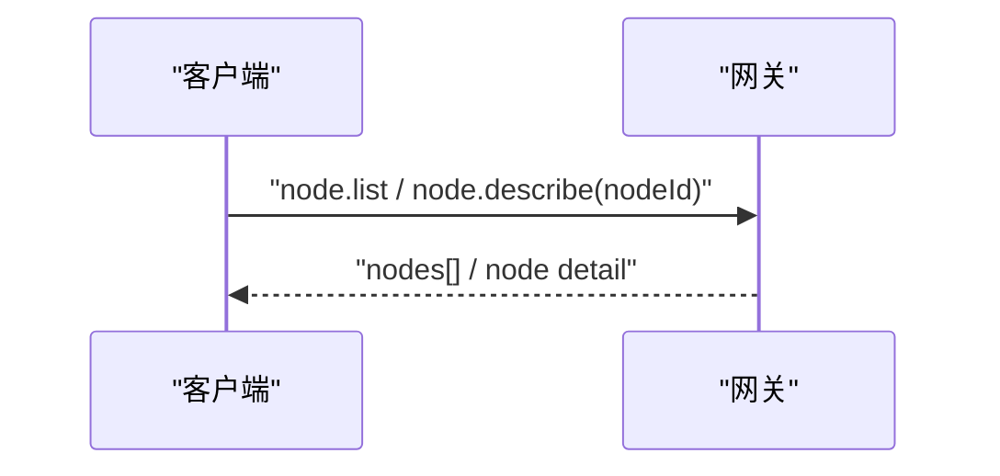
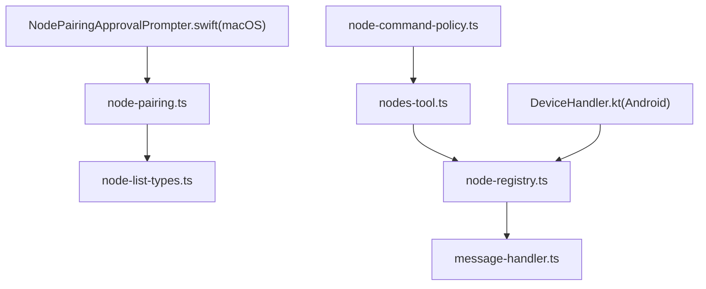

# 节点管理系统

<cite>
**本文档引用的文件**
- [README.md](file://README.md)
- [docs/nodes/index.md](file://docs/nodes/index.md)
- [docs/nodes/audio.md](file://docs/nodes/audio.md)
- [docs/nodes/camera.md](file://docs/nodes/camera.md)
- [docs/nodes/location-command.md](file://docs/nodes/location-command.md)
- [docs/gateway/pairing.md](file://docs/gateway/pairing.md)
- [docs/concepts/architecture.md](file://docs/concepts/architecture.md)
- [src/infra/node-pairing.ts](file://src/infra/node-pairing.ts)
- [src/gateway/server-methods/nodes.ts](file://src/gateway/server-methods/nodes.ts)
- [src/shared/node-list-types.ts](file://src/shared/node-list-types.ts)
- [apps/macos/Sources/OpenClaw/NodePairingApprovalPrompter.swift](file://apps/macos/Sources/OpenClaw/NodePairingApprovalPrompter.swift)
- [src/agents/tools/nodes-tool.ts](file://src/agents/tools/nodes-tool.ts)
- [src/gateway/node-command-policy.ts](file://src/gateway/node-command-policy.ts)
- [apps/android/app/src/main/java/ai/openclaw/app/node/DeviceHandler.kt](file://apps/android/app/src/main/java/ai/openclaw/app/node/DeviceHandler.kt)
- [src/gateway/node-registry.ts](file://src/gateway/node-registry.ts)
- [src/gateway/server/ws-connection/message-handler.ts](file://src/gateway/server/ws-connection/message-handler.ts)
- [test/gateway.multi.e2e.test.ts](file://test/gateway.multi.e2e.test.ts)
</cite>

## 目录
1. [简介](#简介)
2. [项目结构](#项目结构)
3. [核心组件](#核心组件)
4. [架构总览](#架构总览)
5. [详细组件分析](#详细组件分析)
6. [依赖关系分析](#依赖关系分析)
7. [性能考虑](#性能考虑)
8. [故障排除指南](#故障排除指南)
9. [结论](#结论)
10. [附录](#附录)

## 简介
本文件系统化梳理 OpenClaw 节点管理能力，覆盖节点发现、配对、状态管理、设备控制与权限校验，以及与网关通信协议、安全验证机制。内容基于官方文档与源码实现，帮助开发者与运维人员快速理解并正确使用节点系统。

## 项目结构
- 文档侧：nodes 专题文档、网关配对文档、架构文档等，提供高层设计与使用说明。
- 代码侧：节点配对存储与策略、节点注册与会话管理、节点命令白名单与安全策略、跨平台节点实现（macOS/Android）、网关 WebSocket 连接处理与节点接入流程等。

**图表来源**
- [docs/nodes/index.md:1-386](file://docs/nodes/index.md#L1-L386)
- [docs/gateway/pairing.md:1-100](file://docs/gateway/pairing.md#L1-L100)
- [docs/concepts/architecture.md:1-47](file://docs/concepts/architecture.md#L1-L47)
- [src/infra/node-pairing.ts:53-273](file://src/infra/node-pairing.ts#L53-L273)
- [src/gateway/node-registry.ts:1-79](file://src/gateway/node-registry.ts#L1-L79)
- [src/gateway/server-methods/nodes.ts:656-753](file://src/gateway/server-methods/nodes.ts#L656-L753)
- [src/gateway/node-command-policy.ts:41-74](file://src/gateway/node-command-policy.ts#L41-L74)
- [src/gateway/server/ws-connection/message-handler.ts:983-1017](file://src/gateway/server/ws-connection/message-handler.ts#L983-L1017)
- [apps/macos/Sources/OpenClaw/NodePairingApprovalPrompter.swift:138-171](file://apps/macos/Sources/OpenClaw/NodePairingApprovalPrompter.swift#L138-L171)
- [apps/android/app/src/main/java/ai/openclaw/app/node/DeviceHandler.kt:130-168](file://apps/android/app/src/main/java/ai/openclaw/app/node/DeviceHandler.kt#L130-L168)

**章节来源**
- [README.md:1-560](file://README.md#L1-L560)
- [docs/concepts/architecture.md:1-47](file://docs/concepts/architecture.md#L1-L47)

## 核心组件
- 节点配对与状态管理：负责待配对请求的创建、轮询与过期清理，已配对节点的持久化与重连记录。
- 节点注册与会话：维护节点连接、能力集、命令集、权限映射与环境变量等元数据。
- 节点命令策略：定义高风险命令白名单、未知平台默认命令集与平台差异命令集。
- 节点工具与代理：封装节点状态、描述、通知、相机、屏幕录制、定位、设备信息、系统命令调用等工具方法。
- 平台实现：macOS 侧配对提示器与 Android 侧设备能力与权限上报。

**章节来源**
- [src/infra/node-pairing.ts:53-273](file://src/infra/node-pairing.ts#L53-L273)
- [src/gateway/node-registry.ts:1-79](file://src/gateway/node-registry.ts#L1-L79)
- [src/gateway/node-command-policy.ts:41-74](file://src/gateway/node-command-policy.ts#L41-L74)
- [src/agents/tools/nodes-tool.ts:31-247](file://src/agents/tools/nodes-tool.ts#L31-L247)
- [apps/macos/Sources/OpenClaw/NodePairingApprovalPrompter.swift:138-171](file://apps/macos/Sources/OpenClaw/NodePairingApprovalPrompter.swift#L138-L171)
- [apps/android/app/src/main/java/ai/openclaw/app/node/DeviceHandler.kt:130-168](file://apps/android/app/src/main/java/ai/openclaw/app/node/DeviceHandler.kt#L130-L168)

## 架构总览
节点系统以 WebSocket 作为统一控制面，节点在连接时声明角色与能力，网关侧进行设备配对与会话登记，随后通过 node.invoke 调用节点命令，实现跨平台设备控制与状态查询。

**图表来源**
- [docs/gateway/pairing.md:27-71](file://docs/gateway/pairing.md#L27-L71)
- [src/infra/node-pairing.ts:104-182](file://src/infra/node-pairing.ts#L104-L182)
- [src/gateway/server/ws-connection/message-handler.ts:997-1017](file://src/gateway/server/ws-connection/message-handler.ts#L997-L1017)
- [src/gateway/node-registry.ts:38-79](file://src/gateway/node-registry.ts#L38-L79)

**章节来源**
- [docs/concepts/architecture.md:12-47](file://docs/concepts/architecture.md#L12-L47)
- [docs/gateway/pairing.md:1-100](file://docs/gateway/pairing.md#L1-L100)

## 详细组件分析

### 节点配对与状态管理
- 待配对请求 TTL 与自动清理、请求幂等与修复模式、批准后轮换 token。
- 状态持久化到本地文件，支持列出待配对与已配对节点。
- macOS 侧配对提示器周期拉取并同步配对列表，确保多实例一致性。

**图表来源**
- [src/infra/node-pairing.ts:104-182](file://src/infra/node-pairing.ts#L104-L182)
- [src/infra/node-pairing.ts:71-77](file://src/infra/node-pairing.ts#L71-L77)

**章节来源**
- [src/infra/node-pairing.ts:53-273](file://src/infra/node-pairing.ts#L53-L273)
- [apps/macos/Sources/OpenClaw/NodePairingApprovalPrompter.swift:138-171](file://apps/macos/Sources/OpenClaw/NodePairingApprovalPrompter.swift#L138-L171)

### 节点注册与会话管理
- 注册时提取节点标识、显示名、平台版本、设备型号、远端 IP、能力集、命令集、权限映射与 PATH 环境。
- 维护按 nodeId 与连接 ID 的双向映射，记录连接时间并支持查询在线节点列表。

**图表来源**
- [src/gateway/node-registry.ts:1-79](file://src/gateway/node-registry.ts#L1-L79)

**章节来源**
- [src/gateway/node-registry.ts:1-79](file://src/gateway/node-registry.ts#L1-L79)
- [src/gateway/server/ws-connection/message-handler.ts:983-1017](file://src/gateway/server/ws-connection/message-handler.ts#L983-L1017)

### 节点命令策略与安全
- 默认高风险命令集合（相机、屏幕录制、联系人、日历、提醒事项、短信发送等），需显式加入允许列表。
- 未知平台默认命令集包含画布、相机、定位、通知等常用命令。
- iOS 节点不支持 system.run/which，仅支持通知；未知平台保守默认不开放 system.run/which。

**图表来源**
- [src/gateway/node-command-policy.ts:41-74](file://src/gateway/node-command-policy.ts#L41-L74)

**章节来源**
- [src/gateway/node-command-policy.ts:41-74](file://src/gateway/node-command-policy.ts#L41-L74)
- [docs/nodes/index.md:315-329](file://docs/nodes/index.md#L315-L329)

### 节点工具与代理（nodes 工具）
- 支持动作：状态、描述、待配对、批准/拒绝、通知、相机抓拍/列表/视频、照片最新、屏幕录制、定位获取、通知列表/动作、设备状态/信息/权限/健康、系统运行、通用调用等。
- 通知优先级与投递方式、相机面向与质量参数、定位精度与超时策略等均有明确约束。

**图表来源**
- [src/agents/tools/nodes-tool.ts:31-247](file://src/agents/tools/nodes-tool.ts#L31-L247)

**章节来源**
- [src/agents/tools/nodes-tool.ts:31-247](file://src/agents/tools/nodes-tool.ts#L31-L247)
- [docs/nodes/index.md:159-329](file://docs/nodes/index.md#L159-L329)

### 跨平台节点能力与权限
- iOS/Android 节点：相机抓拍/视频、通知列表/动作、设备状态/信息/权限/健康、定位获取、系统通知等。
- 权限映射：相机、麦克风、位置、通知、运动传感器等，Android 还包含短信发送能力。
- macOS 节点：画布、相机、屏幕录制、系统运行/通知等，受 TCC 与执行审批控制。

**图表来源**
- [docs/nodes/camera.md:1-163](file://docs/nodes/camera.md#L1-L163)
- [docs/nodes/location-command.md:1-99](file://docs/nodes/location-command.md#L1-L99)
- [apps/android/app/src/main/java/ai/openclaw/app/node/DeviceHandler.kt:130-168](file://apps/android/app/src/main/java/ai/openclaw/app/node/DeviceHandler.kt#L130-L168)

**章节来源**
- [docs/nodes/camera.md:1-163](file://docs/nodes/camera.md#L1-L163)
- [docs/nodes/location-command.md:1-99](file://docs/nodes/location-command.md#L1-L99)
- [apps/android/app/src/main/java/ai/openclaw/app/node/DeviceHandler.kt:130-168](file://apps/android/app/src/main/java/ai/openclaw/app/node/DeviceHandler.kt#L130-L168)
- [docs/nodes/index.md:355-381](file://docs/nodes/index.md#L355-L381)

### 节点发现与状态查询
- 通过 node.list 与 node.describe 获取节点列表与详情，包含已配对/已连接状态、能力集、命令集、权限映射等。
- 支持按节点 ID 查询并合并在线节点与配对状态。

**图表来源**
- [src/gateway/server-methods/nodes.ts:656-753](file://src/gateway/server-methods/nodes.ts#L656-L753)

**章节来源**
- [src/gateway/server-methods/nodes.ts:656-753](file://src/gateway/server-methods/nodes.ts#L656-L753)
- [src/shared/node-list-types.ts:1-51](file://src/shared/node-list-types.ts#L1-L51)

## 依赖关系分析
- 节点配对存储依赖于异步锁与原子写入，保证并发安全。
- 节点注册表依赖 WebSocket 连接上下文，连接建立后完成节点会话登记。
- 节点命令策略影响工具层调用，决定命令是否允许执行。
- 平台实现（macOS/Android）提供权限映射与能力上报，驱动节点能力集。

**图表来源**
- [src/infra/node-pairing.ts:53-273](file://src/infra/node-pairing.ts#L53-L273)
- [src/shared/node-list-types.ts:1-51](file://src/shared/node-list-types.ts#L1-L51)
- [src/gateway/node-registry.ts:1-79](file://src/gateway/node-registry.ts#L1-L79)
- [src/gateway/server/ws-connection/message-handler.ts:983-1017](file://src/gateway/server/ws-connection/message-handler.ts#L983-L1017)
- [src/agents/tools/nodes-tool.ts:31-247](file://src/agents/tools/nodes-tool.ts#L31-L247)
- [src/gateway/node-command-policy.ts:41-74](file://src/gateway/node-command-policy.ts#L41-L74)
- [apps/android/app/src/main/java/ai/openclaw/app/node/DeviceHandler.kt:130-168](file://apps/android/app/src/main/java/ai/openclaw/app/node/DeviceHandler.kt#L130-L168)
- [apps/macos/Sources/OpenClaw/NodePairingApprovalPrompter.swift:138-171](file://apps/macos/Sources/OpenClaw/NodePairingApprovalPrompter.swift#L138-L171)

**章节来源**
- [src/infra/node-pairing.ts:53-273](file://src/infra/node-pairing.ts#L53-L273)
- [src/gateway/node-registry.ts:1-79](file://src/gateway/node-registry.ts#L1-L79)
- [src/gateway/server/ws-connection/message-handler.ts:983-1017](file://src/gateway/server/ws-connection/message-handler.ts#L983-L1017)
- [src/agents/tools/nodes-tool.ts:31-247](file://src/agents/tools/nodes-tool.ts#L31-L247)
- [src/gateway/node-command-policy.ts:41-74](file://src/gateway/node-command-policy.ts#L41-L74)
- [apps/android/app/src/main/java/ai/openclaw/app/node/DeviceHandler.kt:130-168](file://apps/android/app/src/main/java/ai/openclaw/app/node/DeviceHandler.kt#L130-L168)
- [apps/macos/Sources/OpenClaw/NodePairingApprovalPrompter.swift:138-171](file://apps/macos/Sources/OpenClaw/NodePairingApprovalPrompter.swift#L138-L171)

## 性能考虑
- 节点命令返回媒体数据时，存在大小限制与压缩策略，避免超大负载导致消息溢出。
- 屏幕录制与视频片段长度受限，防止过长片段造成内存与带宽压力。
- 前台要求：画布与相机相关命令仅在前台可用，后台调用返回不可用错误，减少资源滥用。
- 定位请求设置超时与最大年龄，避免长时间阻塞与过期数据。

[本节为通用指导，无需特定文件引用]

## 故障排除指南
- 节点未连接或状态异常：使用 nodes status 查看已知/已配对/已连接数量与详情，确认配对与连接状态。
- 无法执行命令：检查命令是否在允许列表中，高风险命令需显式加入 allowCommands；未知平台默认命令集可能不包含某些命令。
- 权限问题：相机/麦克风/定位/通知等权限缺失会导致相应命令失败；在平台侧开启权限后再尝试。
- 配对流程：若未出现配对提示，检查网关配对存储与 macOS 提示器同步；必要时通过 CLI 列出待配对并批准。
- 多实例一致性：macOS 提示器会周期拉取配对列表并同步，确保多实例一致。

**章节来源**
- [docs/nodes/index.md:159-329](file://docs/nodes/index.md#L159-L329)
- [docs/nodes/camera.md:60-101](file://docs/nodes/camera.md#L60-L101)
- [docs/nodes/location-command.md:74-86](file://docs/nodes/location-command.md#L74-L86)
- [apps/macos/Sources/OpenClaw/NodePairingApprovalPrompter.swift:138-171](file://apps/macos/Sources/OpenClaw/NodePairingApprovalPrompter.swift#L138-L171)

## 结论
节点管理系统以 WebSocket 为核心，结合设备配对与节点注册，形成统一的跨平台设备控制与状态查询能力。通过严格的命令策略与权限映射，保障安全性与可控性；通过工具层抽象简化调用流程。建议在生产环境中：
- 明确命令白名单，仅开放必要命令；
- 在平台侧完善权限引导与提示；
- 使用 nodes 工具与 CLI 进行日常运维与排障；
- 关注前台限制与媒体大小限制，避免性能与稳定性问题。

[本节为总结性内容，无需特定文件引用]

## 附录

### 节点工具核心操作清单
- 通知：nodes.notify（支持优先级与投递方式）
- 系统命令：nodes.run（macOS 节点支持 system.run）
- 相机：nodes.camera.snap/clip/list
- 屏幕录制：nodes.screen.record
- 定位：nodes.location.get（精度、超时、最大年龄）
- 设备信息：nodes.device.status/info/permissions/health
- 通知列表与动作：nodes.notifications.list/action
- 通用调用：nodes.invoke（底层 node.invoke）

**章节来源**
- [src/agents/tools/nodes-tool.ts:31-247](file://src/agents/tools/nodes-tool.ts#L31-L247)
- [docs/nodes/index.md:159-329](file://docs/nodes/index.md#L159-L329)

### 节点与网关通信协议要点
- 设备身份与配对：节点在 connect 时携带 device 身份，网关为设备+角色颁发令牌；本地连接可自动批准，远程连接需签名挑战。
- TLS 与证书固定：支持 WS TLS，客户端可固定证书指纹。
- API 范围：完整暴露网关 API（status、channels、models、chat、agent、sessions、nodes、approvals 等）。

**章节来源**
- [docs/zh-CN/gateway/protocol.md:199-221](file://docs/zh-CN/gateway/protocol.md#L199-L221)
- [docs/concepts/architecture.md:12-47](file://docs/concepts/architecture.md#L12-L47)

### 端到端测试参考
- 多网关实例场景下验证 WS、HTTP 与节点配对流程。

**章节来源**
- [test/gateway.multi.e2e.test.ts:1-42](file://test/gateway.multi.e2e.test.ts#L1-L42)