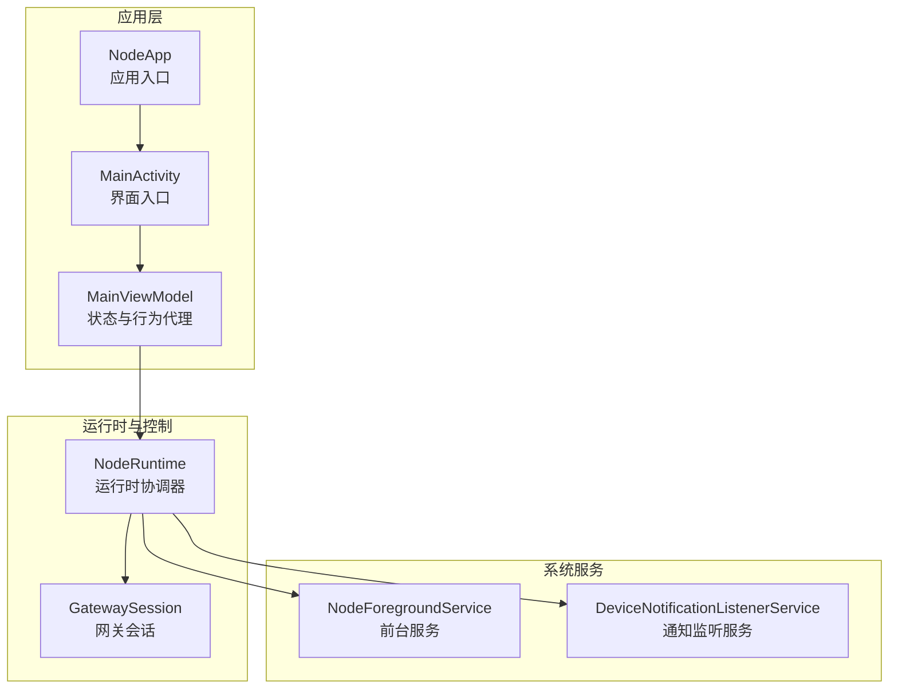
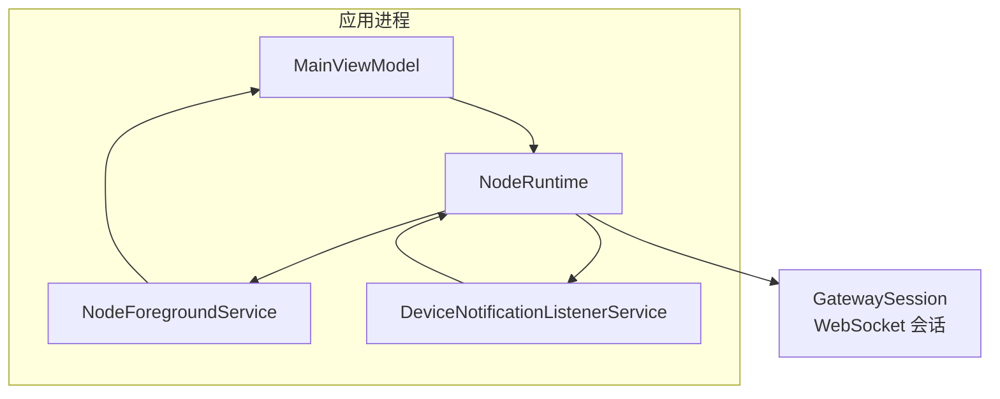
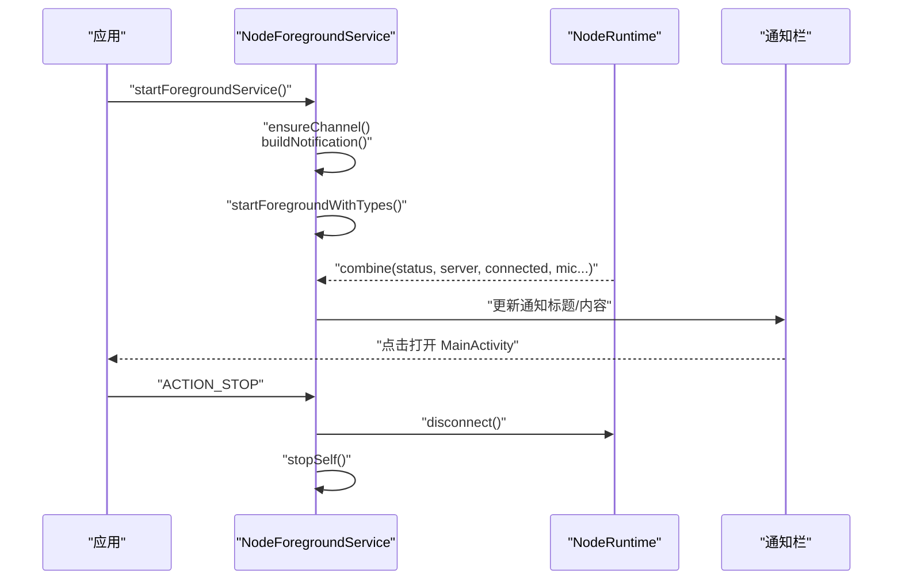
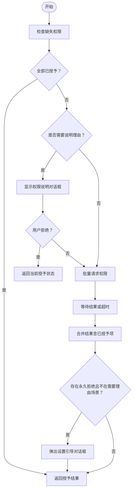
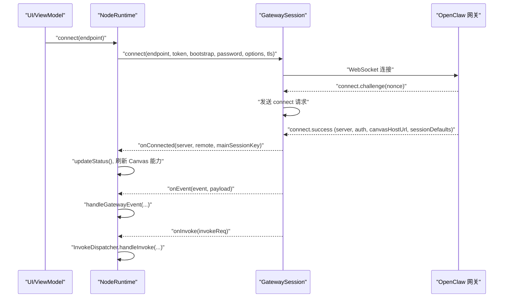
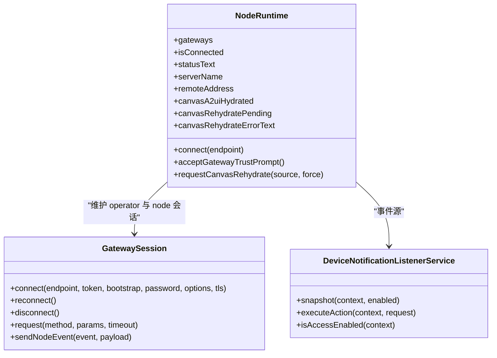
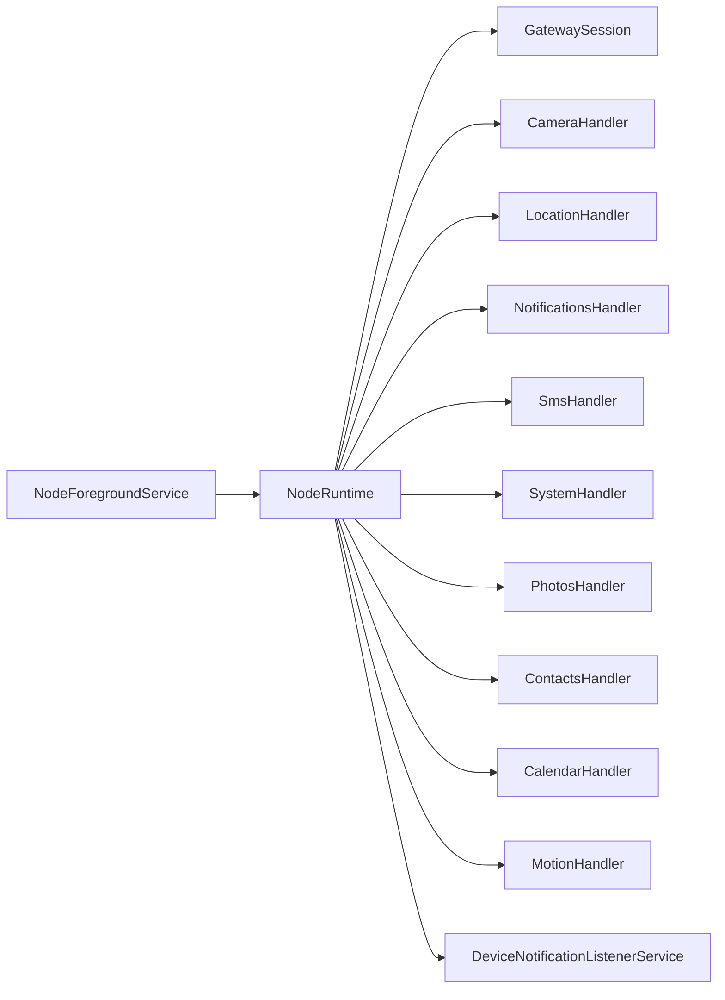

# Android 应用

<cite>
**本文引用的文件**
- [apps/android/app/src/main/java/ai/openclaw/app/MainActivity.kt](file://apps/android/app/src/main/java/ai/openclaw/app/MainActivity.kt)
- [apps/android/app/src/main/java/ai/openclaw/app/MainViewModel.kt](file://apps/android/app/src/main/java/ai/openclaw/app/MainViewModel.kt)
- [apps/android/app/src/main/java/ai/openclaw/app/NodeApp.kt](file://apps/android/app/src/main/java/ai/openclaw/app/NodeApp.kt)
- [apps/android/app/src/main/java/ai/openclaw/app/NodeRuntime.kt](file://apps/android/app/src/main/java/ai/openclaw/app/NodeRuntime.kt)
- [apps/android/app/src/main/java/ai/openclaw/app/NodeForegroundService.kt](file://apps/android/app/src/main/java/ai/openclaw/app/NodeForegroundService.kt)
- [apps/android/app/src/main/java/ai/openclaw/app/PermissionRequester.kt](file://apps/android/app/src/main/java/ai/openclaw/app/PermissionRequester.kt)
- [apps/android/app/src/main/java/ai/openclaw/app/node/DeviceNotificationListenerService.kt](file://apps/android/app/src/main/java/ai/openclaw/app/node/DeviceNotificationListenerService.kt)
- [apps/android/app/src/main/java/ai/openclaw/app/gateway/GatewaySession.kt](file://apps/android/app/src/main/java/ai/openclaw/app/gateway/GatewaySession.kt)
- [apps/android/app/src/main/AndroidManifest.xml](file://apps/android/app/src/main/AndroidManifest.xml)
- [apps/android/app/build.gradle.kts](file://apps/android/app/build.gradle.kts)
- [apps/android/build.gradle.kts](file://apps/android/build.gradle.kts)
</cite>

## 目录
1. [简介](#简介)
2. [项目结构](#项目结构)
3. [核心组件](#核心组件)
4. [架构总览](#架构总览)
5. [详细组件分析](#详细组件分析)
6. [依赖关系分析](#依赖关系分析)
7. [性能考虑](#性能考虑)
8. [故障排查指南](#故障排查指南)
9. [结论](#结论)
10. [附录](#附录)

## 简介
本文件面向 Android 平台的 OpenClaw 节点应用，系统性阐述其功能实现与架构设计，重点覆盖以下方面：
- 后台服务与前台服务：如何在前台服务中维持稳定连接并动态更新通知。
- 通知管理：通过无障碍通知监听服务采集与控制设备通知。
- 无障碍服务：通知访问授权、快照与动作执行。
- 设备控制：相机、位置、短信、联系人、日历、运动、通知等能力的封装与调用。
- 权限体系：运行时权限请求、拒绝处理与引导用户前往设置。
- 与 OpenClaw 网关的连接机制：自动发现、TLS 指纹校验、会话建立、事件与调用分发、重连策略。
- 数据同步与状态上报：Canvas A2UI 重载、节点能力刷新、状态文本与远端地址展示。
- 开发环境与构建：Gradle 配置、签名发布、混淆与打包产物命名。

本说明兼顾非技术读者，提供从高层到代码级的可视化图示与路径指引，帮助快速理解与上手。

## 项目结构
Android 应用位于 apps/android/app 目录，采用 Kotlin + Jetpack Compose UI，使用 OkHttp WebSocket 进行网关通信，配合协程进行异步任务编排。核心模块划分如下：
- 应用入口与生命周期：NodeApp、MainActivity、MainViewModel
- 前台服务：NodeForegroundService（连接状态通知）
- 权限管理：PermissionRequester（多权限一次性申请、拒绝引导）
- 无障碍服务：DeviceNotificationListenerService（通知监听、快照、动作）
- 网关通信：GatewaySession（WebSocket 会话、连接参数、事件与调用处理）
- 设备控制：node 包下的各 Handler 与 Manager（相机、位置、短信、通知、系统等）
- 构建与签名：app/build.gradle.kts（含签名、混淆、打包命名）

**图表来源**
- [apps/android/app/src/main/java/ai/openclaw/app/NodeApp.kt:1-27](file://apps/android/app/src/main/java/ai/openclaw/app/NodeApp.kt#L1-L27)
- [apps/android/app/src/main/java/ai/openclaw/app/MainActivity.kt:1-64](file://apps/android/app/src/main/java/ai/openclaw/app/MainActivity.kt#L1-L64)
- [apps/android/app/src/main/java/ai/openclaw/app/MainViewModel.kt:1-211](file://apps/android/app/src/main/java/ai/openclaw/app/MainViewModel.kt#L1-L211)
- [apps/android/app/src/main/java/ai/openclaw/app/NodeRuntime.kt:1-1177](file://apps/android/app/src/main/java/ai/openclaw/app/NodeRuntime.kt#L1-L1177)
- [apps/android/app/src/main/java/ai/openclaw/app/NodeForegroundService.kt:1-159](file://apps/android/app/src/main/java/ai/openclaw/app/NodeForegroundService.kt#L1-L159)
- [apps/android/app/src/main/java/ai/openclaw/app/node/DeviceNotificationListenerService.kt:1-378](file://apps/android/app/src/main/java/ai/openclaw/app/node/DeviceNotificationListenerService.kt#L1-L378)
- [apps/android/app/src/main/java/ai/openclaw/app/gateway/GatewaySession.kt:1-966](file://apps/android/app/src/main/java/ai/openclaw/app/gateway/GatewaySession.kt#L1-L966)

**章节来源**
- [apps/android/app/src/main/java/ai/openclaw/app/MainActivity.kt:1-64](file://apps/android/app/src/main/java/ai/openclaw/app/MainActivity.kt#L1-L64)
- [apps/android/app/src/main/java/ai/openclaw/app/MainViewModel.kt:1-211](file://apps/android/app/src/main/java/ai/openclaw/app/MainViewModel.kt#L1-L211)
- [apps/android/app/src/main/java/ai/openclaw/app/NodeApp.kt:1-27](file://apps/android/app/src/main/java/ai/openclaw/app/NodeApp.kt#L1-L27)
- [apps/android/app/src/main/java/ai/openclaw/app/NodeRuntime.kt:1-1177](file://apps/android/app/src/main/java/ai/openclaw/app/NodeRuntime.kt#L1-L1177)
- [apps/android/app/src/main/java/ai/openclaw/app/NodeForegroundService.kt:1-159](file://apps/android/app/src/main/java/ai/openclaw/app/NodeForegroundService.kt#L1-L159)
- [apps/android/app/src/main/java/ai/openclaw/app/node/DeviceNotificationListenerService.kt:1-378](file://apps/android/app/src/main/java/ai/openclaw/app/node/DeviceNotificationListenerService.kt#L1-L378)
- [apps/android/app/src/main/java/ai/openclaw/app/gateway/GatewaySession.kt:1-966](file://apps/android/app/src/main/java/ai/openclaw/app/gateway/GatewaySession.kt#L1-L966)

## 核心组件
- NodeApp：应用入口，初始化严格模式（调试）。
- MainActivity：设置主题、窗口标志、启动前台服务；绑定 ViewModel 与权限请求器。
- MainViewModel：暴露运行时状态流与操作方法，桥接 UI 与 NodeRuntime。
- NodeRuntime：核心运行时，负责：
  - 网关发现与连接（GatewaySession）、TLS 指纹校验与信任提示
  - Canvas A2UI 重载与状态上报
  - 设备控制能力（相机、位置、短信、通知、系统、联系人、日历、运动等）
  - 语音与聊天集成（MicCapture、TalkMode、ChatController）
  - 前台状态切换与语音会话停止
- NodeForegroundService：前台服务，持续显示连接状态通知，支持断开动作。
- PermissionRequester：统一的运行时权限请求与拒绝引导，必要时跳转系统设置。
- DeviceNotificationListenerService：通知监听服务，提供快照与动作执行（打开、清除、回复）。

**章节来源**
- [apps/android/app/src/main/java/ai/openclaw/app/NodeApp.kt:1-27](file://apps/android/app/src/main/java/ai/openclaw/app/NodeApp.kt#L1-L27)
- [apps/android/app/src/main/java/ai/openclaw/app/MainActivity.kt:1-64](file://apps/android/app/src/main/java/ai/openclaw/app/MainActivity.kt#L1-L64)
- [apps/android/app/src/main/java/ai/openclaw/app/MainViewModel.kt:1-211](file://apps/android/app/src/main/java/ai/openclaw/app/MainViewModel.kt#L1-L211)
- [apps/android/app/src/main/java/ai/openclaw/app/NodeRuntime.kt:1-1177](file://apps/android/app/src/main/java/ai/openclaw/app/NodeRuntime.kt#L1-L1177)
- [apps/android/app/src/main/java/ai/openclaw/app/NodeForegroundService.kt:1-159](file://apps/android/app/src/main/java/ai/openclaw/app/NodeForegroundService.kt#L1-L159)
- [apps/android/app/src/main/java/ai/openclaw/app/PermissionRequester.kt:1-134](file://apps/android/app/src/main/java/ai/openclaw/app/PermissionRequester.kt#L1-L134)
- [apps/android/app/src/main/java/ai/openclaw/app/node/DeviceNotificationListenerService.kt:1-378](file://apps/android/app/src/main/java/ai/openclaw/app/node/DeviceNotificationListenerService.kt#L1-L378)

## 架构总览
下图展示了应用与系统服务、网关之间的交互关系，以及前台服务对连接状态的持续反馈。

**图表来源**
- [apps/android/app/src/main/java/ai/openclaw/app/MainViewModel.kt:1-211](file://apps/android/app/src/main/java/ai/openclaw/app/MainViewModel.kt#L1-L211)
- [apps/android/app/src/main/java/ai/openclaw/app/NodeRuntime.kt:1-1177](file://apps/android/app/src/main/java/ai/openclaw/app/NodeRuntime.kt#L1-L1177)
- [apps/android/app/src/main/java/ai/openclaw/app/NodeForegroundService.kt:1-159](file://apps/android/app/src/main/java/ai/openclaw/app/NodeForegroundService.kt#L1-L159)
- [apps/android/app/src/main/java/ai/openclaw/app/node/DeviceNotificationListenerService.kt:1-378](file://apps/android/app/src/main/java/ai/openclaw/app/node/DeviceNotificationListenerService.kt#L1-L378)
- [apps/android/app/src/main/java/ai/openclaw/app/gateway/GatewaySession.kt:1-966](file://apps/android/app/src/main/java/ai/openclaw/app/gateway/GatewaySession.kt#L1-L966)

## 详细组件分析

### 前台服务与通知管理
- NodeForegroundService 在 onCreate 中创建通知通道并启动前台，随后订阅 NodeRuntime 的状态流，动态更新通知标题与内容（包含连接状态、服务器名、麦克风监听状态），并提供“断开”动作。
- 通知类型为 FOREGROUND_SERVICE_TYPE_DATA_SYNC，确保在后台也能稳定运行。
- 通过 PendingIntent 启动 MainActivity，便于用户进入应用查看状态。

**图表来源**
- [apps/android/app/src/main/java/ai/openclaw/app/NodeForegroundService.kt:1-159](file://apps/android/app/src/main/java/ai/openclaw/app/NodeForegroundService.kt#L1-L159)
- [apps/android/app/src/main/java/ai/openclaw/app/NodeRuntime.kt:1-1177](file://apps/android/app/src/main/java/ai/openclaw/app/NodeRuntime.kt#L1-L1177)

**章节来源**
- [apps/android/app/src/main/java/ai/openclaw/app/NodeForegroundService.kt:1-159](file://apps/android/app/src/main/java/ai/openclaw/app/NodeForegroundService.kt#L1-L159)

### 权限系统与无障碍服务
- 权限请求：PermissionRequester 使用 ActivityResultLauncher 批量请求权限，若被拒且不在需要理由场景，则弹出引导对话框并跳转系统设置页面。
- 无障碍服务：DeviceNotificationListenerService 继承 NotificationListenerService，提供通知快照、事件推送与动作执行（打开、清除、回复），并通过静态方法暴露启用检查、快照获取与动作执行。

**图表来源**
- [apps/android/app/src/main/java/ai/openclaw/app/PermissionRequester.kt:1-134](file://apps/android/app/src/main/java/ai/openclaw/app/PermissionRequester.kt#L1-L134)

**章节来源**
- [apps/android/app/src/main/java/ai/openclaw/app/PermissionRequester.kt:1-134](file://apps/android/app/src/main/java/ai/openclaw/app/PermissionRequester.kt#L1-L134)
- [apps/android/app/src/main/java/ai/openclaw/app/node/DeviceNotificationListenerService.kt:1-378](file://apps/android/app/src/main/java/ai/openclaw/app/node/DeviceNotificationListenerService.kt#L1-L378)

### 与 OpenClaw 网关的连接机制
- 自动发现与信任：NodeRuntime 通过 GatewayDiscovery 获取可用网关列表，结合上次发现的稳定 ID 与本地存储的 TLS 指纹，安全地自动连接可信网关。
- TLS 指纹校验：首次连接时探测远端指纹，弹出信任提示，用户确认后保存指纹并重连。
- 会话建立：NodeRuntime 维护两个 GatewaySession（operator 与 node），分别负责与网关的控制面与节点面通信，支持断线重连、事件分发与调用回包。
- 事件与调用：GatewaySession 监听“node.invoke.request”事件，转发给 NodeRuntime 的 InvokeDispatcher，后者根据命令路由到具体 Handler（如相机、通知、系统等）。

**图表来源**
- [apps/android/app/src/main/java/ai/openclaw/app/NodeRuntime.kt:1-1177](file://apps/android/app/src/main/java/ai/openclaw/app/NodeRuntime.kt#L1-L1177)
- [apps/android/app/src/main/java/ai/openclaw/app/gateway/GatewaySession.kt:1-966](file://apps/android/app/src/main/java/ai/openclaw/app/gateway/GatewaySession.kt#L1-L966)

**章节来源**
- [apps/android/app/src/main/java/ai/openclaw/app/NodeRuntime.kt:1-1177](file://apps/android/app/src/main/java/ai/openclaw/app/NodeRuntime.kt#L1-L1177)
- [apps/android/app/src/main/java/ai/openclaw/app/gateway/GatewaySession.kt:1-966](file://apps/android/app/src/main/java/ai/openclaw/app/gateway/GatewaySession.kt#L1-L966)

### 设备控制与状态上报
- 相机：CameraCaptureManager 与 CameraHandler 提供拍照、HUD 状态与闪光灯触发。
- 位置：LocationCaptureManager 与 LocationHandler 提供位置采集与精度控制。
- 短信：SmsManager 与 SmsHandler 提供短信发送与可用性检测。
- 通知：NotificationsHandler 与 DeviceNotificationListenerService 提供通知快照与动作执行。
- 系统与媒体：SystemHandler、PhotosHandler、ContactsHandler、CalendarHandler、MotionHandler 等覆盖系统与媒体相关能力。
- Canvas A2UI：NodeRuntime 支持请求 Canvas 重载、超时与错误提示，同时维护 A2UI 状态与 Hydration。

**图表来源**
- [apps/android/app/src/main/java/ai/openclaw/app/NodeRuntime.kt:1-1177](file://apps/android/app/src/main/java/ai/openclaw/app/NodeRuntime.kt#L1-L1177)
- [apps/android/app/src/main/java/ai/openclaw/app/node/DeviceNotificationListenerService.kt:1-378](file://apps/android/app/src/main/java/ai/openclaw/app/node/DeviceNotificationListenerService.kt#L1-L378)
- [apps/android/app/src/main/java/ai/openclaw/app/gateway/GatewaySession.kt:1-966](file://apps/android/app/src/main/java/ai/openclaw/app/gateway/GatewaySession.kt#L1-L966)

**章节来源**
- [apps/android/app/src/main/java/ai/openclaw/app/NodeRuntime.kt:1-1177](file://apps/android/app/src/main/java/ai/openclaw/app/NodeRuntime.kt#L1-L1177)
- [apps/android/app/src/main/java/ai/openclaw/app/node/DeviceNotificationListenerService.kt:1-378](file://apps/android/app/src/main/java/ai/openclaw/app/node/DeviceNotificationListenerService.kt#L1-L378)
- [apps/android/app/src/main/java/ai/openclaw/app/gateway/GatewaySession.kt:1-966](file://apps/android/app/src/main/java/ai/openclaw/app/gateway/GatewaySession.kt#L1-L966)

### Android 权限系统、前台服务、电池优化与后台执行限制
- 权限声明与需求：
  - 网络与前台服务：INTERNET、ACCESS_NETWORK_STATE、FOREGROUND_SERVICE、FOREGROUND_SERVICE_DATA_SYNC、POST_NOTIFICATIONS
  - 位置与 Wi‑Fi：ACCESS_FINE_LOCATION、ACCESS_COARSE_LOCATION、NEARBLY_WIFI_DEVICES
  - 摄像头、录音、短信、存储、联系人、日历、运动识别等
  - 无障碍服务：BIND_NOTIFICATION_LISTENER_SERVICE
- 前台服务类型：FOREGROUND_SERVICE_TYPE_DATA_SYNC，用于数据同步类前台服务。
- 电池优化与后台限制：应用通过前台服务维持连接，避免被系统限制；通知通道设置为低重要性并禁用徽章，减少打扰。
- 后台执行限制：应用在前台服务中保持连接，同时在 UI 停止时主动停止语音会话，降低后台占用。

**章节来源**
- [apps/android/app/src/main/AndroidManifest.xml:1-78](file://apps/android/app/src/main/AndroidManifest.xml#L1-L78)
- [apps/android/app/src/main/java/ai/openclaw/app/NodeForegroundService.kt:1-159](file://apps/android/app/src/main/java/ai/openclaw/app/NodeForegroundService.kt#L1-L159)
- [apps/android/app/src/main/java/ai/openclaw/app/NodeRuntime.kt:1-1177](file://apps/android/app/src/main/java/ai/openclaw/app/NodeRuntime.kt#L1-L1177)

### 开发环境配置、Gradle 构建流程、签名发布与性能优化
- Gradle 插件与版本：
  - Android Application、Android Test、ktlint、Compose、Serialization 插件
  - Kotlin JVM 目标为 17
- 构建配置：
  - compileSdk/targetSdk/minSdk、versionCode/versionName
  - release 启用混淆与资源收缩，debug 关闭
  - 多 ABI 支持（armeabi-v7a、arm64-v8a、x86、x86_64）
  - 自定义打包命名 openclaw-{versionName}-{buildType}.apk
- 签名发布：
  - 通过 gradle.properties 中的 OPENCLAW_ANDROID_STORE_FILE、STORE_PASSWORD、KEY_ALIAS、KEY_PASSWORD 注入
  - 仅在满足条件时启用 release 签名，否则抛错提示
- 性能优化建议：
  - 启用 R8 混淆与资源收缩（release）
  - 仅保留必要图标与依赖，避免大体积资源
  - 使用协程与状态流避免主线程阻塞
  - 前台服务类型明确，减少被系统回收风险

**章节来源**
- [apps/android/app/build.gradle.kts:1-263](file://apps/android/app/build.gradle.kts#L1-L263)
- [apps/android/build.gradle.kts:1-8](file://apps/android/build.gradle.kts#L1-L8)

## 依赖关系分析
- 组件耦合：
  - NodeRuntime 对 GatewaySession、Handler、Manager 具有强依赖，作为运行时中枢
  - NodeForegroundService 仅依赖 NodeRuntime 的状态流，低耦合
  - PermissionRequester 与无障碍服务独立于核心业务，通过 UI 层调用
- 外部依赖：
  - OkHttp 用于 WebSocket 通信
  - CameraX 用于相机能力
  - Material3、Compose BOM 用于 UI
  - Kotlinx Serialization 用于 JSON 解析
- 可能的循环依赖：未见直接循环；NodeRuntime 通过回调与事件与服务解耦。

**图表来源**
- [apps/android/app/src/main/java/ai/openclaw/app/NodeRuntime.kt:1-1177](file://apps/android/app/src/main/java/ai/openclaw/app/NodeRuntime.kt#L1-L1177)
- [apps/android/app/src/main/java/ai/openclaw/app/NodeForegroundService.kt:1-159](file://apps/android/app/src/main/java/ai/openclaw/app/NodeForegroundService.kt#L1-L159)
- [apps/android/app/src/main/java/ai/openclaw/app/node/DeviceNotificationListenerService.kt:1-378](file://apps/android/app/src/main/java/ai/openclaw/app/node/DeviceNotificationListenerService.kt#L1-L378)
- [apps/android/app/src/main/java/ai/openclaw/app/gateway/GatewaySession.kt:1-966](file://apps/android/app/src/main/java/ai/openclaw/app/gateway/GatewaySession.kt#L1-L966)

**章节来源**
- [apps/android/app/src/main/java/ai/openclaw/app/NodeRuntime.kt:1-1177](file://apps/android/app/src/main/java/ai/openclaw/app/NodeRuntime.kt#L1-L1177)

## 性能考虑
- 协程与状态流：大量使用 StateFlow 与协程，避免阻塞主线程，提升响应性。
- 前台服务：使用 FOREGROUND_SERVICE_TYPE_DATA_SYNC，降低被系统回收概率。
- 混淆与裁剪：release 构建开启 R8 与资源收缩，减小包体与 DEX 大小。
- 依赖精简：按需引入 Compose 与 Material 组件，避免全量引入导致体积膨胀。
- 网络层：OkHttp 配置长读超时与心跳间隔，适配 WebSocket 场景。

[本节为通用指导，无需特定文件来源]

## 故障排查指南
- 无法连接网关：
  - 检查 TLS 指纹是否已保存并匹配；若首次连接，确认信任提示已接受
  - 查看状态文本与远端地址是否更新；确认自动发现与上次发现的稳定 ID 是否一致
- 通知监听不可用：
  - 确认系统设置中已开启通知访问；可通过 isAccessEnabled 检查
  - 快照为空或不可用时，检查服务是否已连接
- 权限被拒：
  - 使用 PermissionRequester 的引导对话框；必要时跳转系统设置手动开启
- 前台服务异常：
  - 检查通知通道创建与通知更新逻辑；确认 FOREGROUND_SERVICE_TYPE_DATA_SYNC 正确设置
- Canvas A2UI 重载失败：
  - 确认节点已连接；查看重载错误文本并重试；必要时手动触发重载

**章节来源**
- [apps/android/app/src/main/java/ai/openclaw/app/NodeRuntime.kt:1-1177](file://apps/android/app/src/main/java/ai/openclaw/app/NodeRuntime.kt#L1-L1177)
- [apps/android/app/src/main/java/ai/openclaw/app/node/DeviceNotificationListenerService.kt:1-378](file://apps/android/app/src/main/java/ai/openclaw/app/node/DeviceNotificationListenerService.kt#L1-L378)
- [apps/android/app/src/main/java/ai/openclaw/app/PermissionRequester.kt:1-134](file://apps/android/app/src/main/java/ai/openclaw/app/PermissionRequester.kt#L1-L134)
- [apps/android/app/src/main/java/ai/openclaw/app/NodeForegroundService.kt:1-159](file://apps/android/app/src/main/java/ai/openclaw/app/NodeForegroundService.kt#L1-L159)

## 结论
该 Android 应用围绕 NodeRuntime 构建，通过前台服务维持与 OpenClaw 网关的稳定连接，结合权限管理与无障碍服务实现设备控制与通知管理。其架构清晰、职责分离，配合 Gradle 的签名与混淆配置，具备良好的可维护性与发布准备度。针对后台执行限制与电池优化，应用通过前台服务与状态流驱动的 UI 交互，有效平衡了用户体验与系统资源占用。

[本节为总结，无需特定文件来源]

## 附录
- 构建与发布要点：
  - 设置 gradle.properties 中的签名参数以启用 release 签名
  - 使用自定义打包命名规则，便于分发与版本追踪
  - release 构建启用混淆与资源收缩，注意保留必要的网络与序列化配置

**章节来源**
- [apps/android/app/build.gradle.kts:1-263](file://apps/android/app/build.gradle.kts#L1-L263)