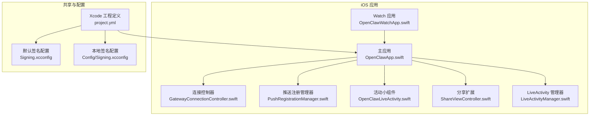
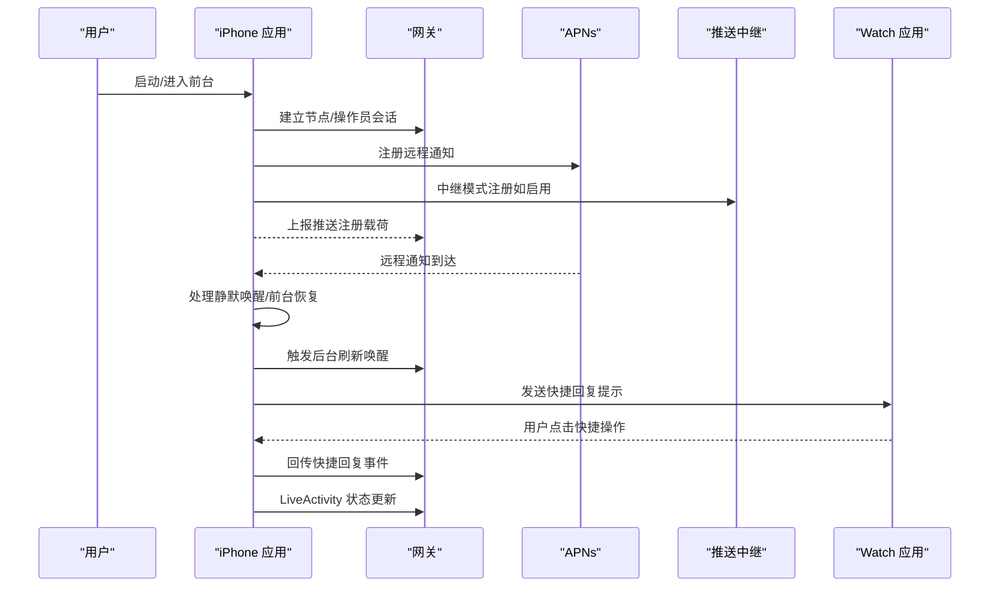
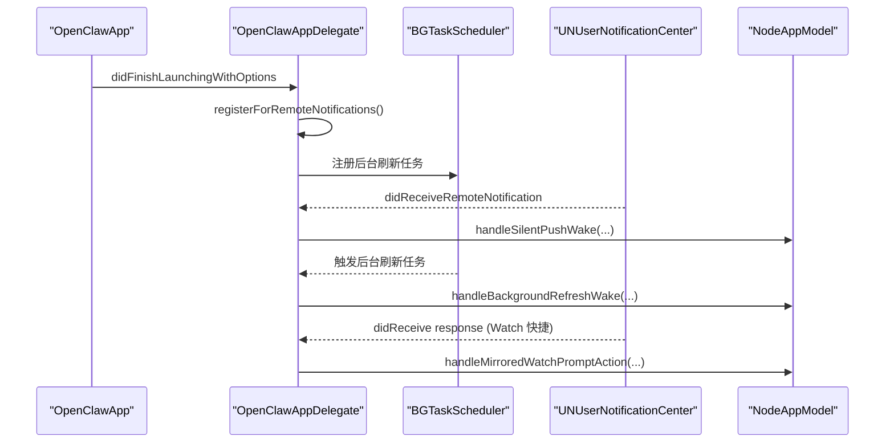
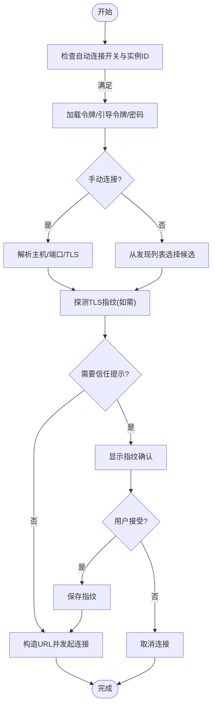
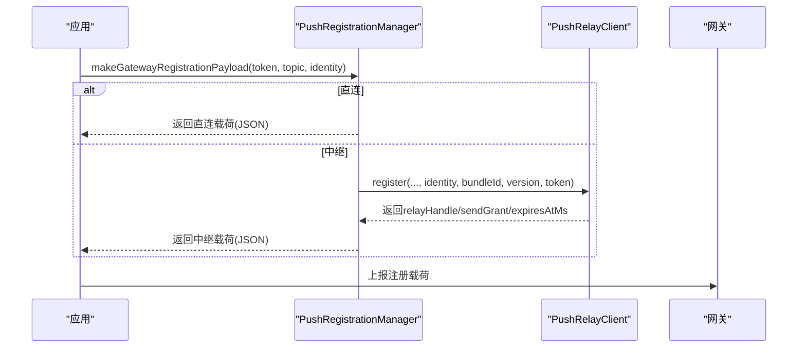
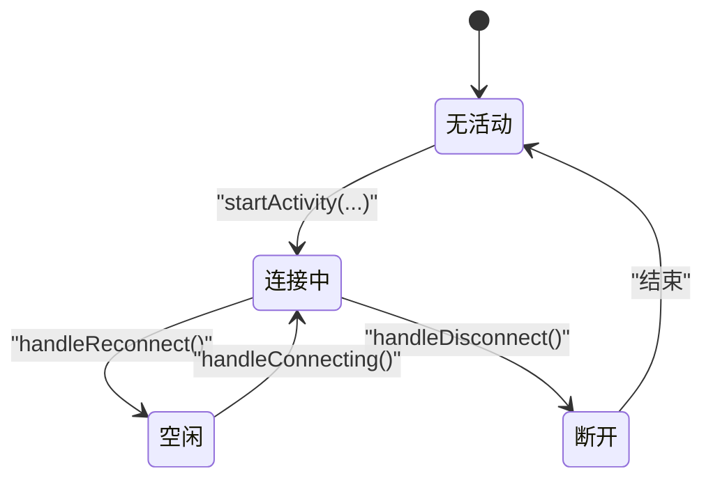
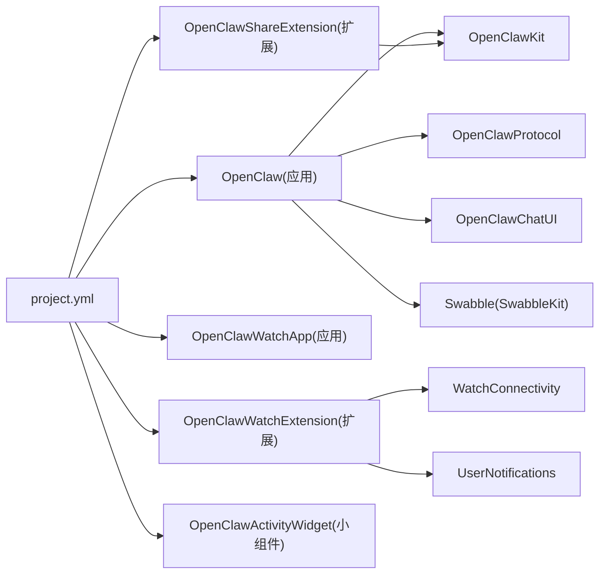

# iOS 应用

<cite>
**本文引用的文件**
- [apps/ios/README.md](file://apps/ios/README.md)
- [apps/ios/project.yml](file://apps/ios/project.yml)
- [apps/ios/Signing.xcconfig](file://apps/ios/Signing.xcconfig)
- [apps/ios/Config/Signing.xcconfig](file://apps/ios/Config/Signing.xcconfig)
- [apps/ios/Sources/OpenClawApp.swift](file://apps/ios/Sources/OpenClawApp.swift)
- [apps/ios/Sources/Gateway/GatewayConnectionController.swift](file://apps/ios/Sources/Gateway/GatewayConnectionController.swift)
- [apps/ios/Sources/Push/PushRegistrationManager.swift](file://apps/ios/Sources/Push/PushRegistrationManager.swift)
- [apps/ios/Sources/LiveActivity/LiveActivityManager.swift](file://apps/ios/Sources/LiveActivity/LiveActivityManager.swift)
- [apps/ios/Sources/Model/NodeAppModel.swift](file://apps/ios/Sources/Model/NodeAppModel.swift)
- [apps/ios/ActivityWidget/OpenClawLiveActivity.swift](file://apps/ios/ActivityWidget/OpenClawLiveActivity.swift)
- [apps/ios/ActivityWidget/OpenClawActivityWidgetBundle.swift](file://apps/ios/ActivityWidget/OpenClawActivityWidgetBundle.swift)
- [apps/ios/ShareExtension/ShareViewController.swift](file://apps/ios/ShareExtension/ShareViewController.swift)
- [apps/ios/WatchApp/Info.plist](file://apps/ios/WatchApp/Info.plist)
- [apps/ios/WatchExtension/Sources/OpenClawWatchApp.swift](file://apps/ios/WatchExtension/Sources/OpenClawWatchApp.swift)
</cite>

## 目录
1. [简介](#简介)
2. [项目结构](#项目结构)
3. [核心组件](#核心组件)
4. [架构总览](#架构总览)
5. [详细组件分析](#详细组件分析)
6. [依赖关系分析](#依赖关系分析)
7. [性能与电池优化](#性能与电池优化)
8. [故障排查指南](#故障排查指南)
9. [结论](#结论)
10. [附录](#附录)

## 简介
本文件面向 iOS 平台的 OpenClaw 客户端应用，系统性阐述其功能特性与实现要点，覆盖后台处理、活动小组件（Live Activity）、分享扩展、与 Watch 应用的联动，以及与 macOS 应用的协同机制。同时提供 iOS 权限模型、沙盒限制、后台任务与电池优化策略的说明，并给出开发环境搭建、调试技巧与发布流程的最佳实践。

## 项目结构
iOS 应用位于 apps/ios 目录，采用 Swift 6 与 SwiftUI 构建，使用 XcodeGen 生成工程，通过 xcconfig 统一管理签名与构建配置。项目包含主应用、分享扩展、活动小组件、Watch 应用与扩展等模块；同时通过共享包 OpenClawKit 提供协议与通用能力支持。

图表来源
- [apps/ios/project.yml:1-340](file://apps/ios/project.yml#L1-L340)
- [apps/ios/Sources/OpenClawApp.swift:1-549](file://apps/ios/Sources/OpenClawApp.swift#L1-L549)
- [apps/ios/Sources/Gateway/GatewayConnectionController.swift:1-800](file://apps/ios/Sources/Gateway/GatewayConnectionController.swift#L1-L800)
- [apps/ios/Sources/Push/PushRegistrationManager.swift:1-170](file://apps/ios/Sources/Push/PushRegistrationManager.swift#L1-L170)
- [apps/ios/Sources/LiveActivity/LiveActivityManager.swift:1-126](file://apps/ios/Sources/LiveActivity/LiveActivityManager.swift#L1-L126)
- [apps/ios/ActivityWidget/OpenClawLiveActivity.swift](file://apps/ios/ActivityWidget/OpenClawLiveActivity.swift)
- [apps/ios/ShareExtension/ShareViewController.swift](file://apps/ios/ShareExtension/ShareViewController.swift)
- [apps/ios/WatchExtension/Sources/OpenClawWatchApp.swift:1-29](file://apps/ios/WatchExtension/Sources/OpenClawWatchApp.swift#L1-L29)

章节来源
- [apps/ios/project.yml:1-340](file://apps/ios/project.yml#L1-L340)
- [apps/ios/Signing.xcconfig:1-23](file://apps/ios/Signing.xcconfig#L1-L23)
- [apps/ios/Config/Signing.xcconfig:1-22](file://apps/ios/Config/Signing.xcconfig#L1-L22)

## 核心组件
- 主应用与生命周期：负责应用启动、场景切换、远程通知与静默唤醒、后台刷新任务调度、与 Watch 快捷回复的通知桥接。
- 网关连接控制器：负责网关发现、信任提示、TLS 指纹校验、自动重连与能力/命令/权限注册。
- 推送注册管理器：根据构建配置选择直连或中继模式，封装 APNs 注册载荷，管理中继注册状态与过期刷新。
- LiveActivity 管理器：最小化地维护连接健康状态的实时活动，支持启动、连接中、空闲、断开等状态更新与重复实例清理。
- 分享扩展：将系统分享内容转发到已连接的网关会话。
- Watch 集成：Watch 扩展接收快捷回复，通过通知桥接回 iPhone 并触发网关侧动作；iPhone 亦可镜像 Watch 的提示为系统通知以便在后台快速操作。

章节来源
- [apps/ios/Sources/OpenClawApp.swift:1-549](file://apps/ios/Sources/OpenClawApp.swift#L1-L549)
- [apps/ios/Sources/Gateway/GatewayConnectionController.swift:1-800](file://apps/ios/Sources/Gateway/GatewayConnectionController.swift#L1-L800)
- [apps/ios/Sources/Push/PushRegistrationManager.swift:1-170](file://apps/ios/Sources/Push/PushRegistrationManager.swift#L1-L170)
- [apps/ios/Sources/LiveActivity/LiveActivityManager.swift:1-126](file://apps/ios/Sources/LiveActivity/LiveActivityManager.swift#L1-L126)
- [apps/ios/ShareExtension/ShareViewController.swift](file://apps/ios/ShareExtension/ShareViewController.swift)
- [apps/ios/WatchExtension/Sources/OpenClawWatchApp.swift:1-29](file://apps/ios/WatchExtension/Sources/OpenClawWatchApp.swift#L1-L29)

## 架构总览
下图展示 iOS 应用与网关、推送中继、系统服务及 Watch 的交互关系，以及关键事件流（远程通知、静默唤醒、后台刷新、LiveActivity 状态）。

图表来源
- [apps/ios/Sources/OpenClawApp.swift:50-160](file://apps/ios/Sources/OpenClawApp.swift#L50-L160)
- [apps/ios/Sources/Gateway/GatewayConnectionController.swift:90-285](file://apps/ios/Sources/Gateway/GatewayConnectionController.swift#L90-L285)
- [apps/ios/Sources/Push/PushRegistrationManager.swift:41-142](file://apps/ios/Sources/Push/PushRegistrationManager.swift#L41-L142)
- [apps/ios/Sources/LiveActivity/LiveActivityManager.swift:27-62](file://apps/ios/Sources/LiveActivity/LiveActivityManager.swift#L27-L62)

## 详细组件分析

### 主应用与生命周期（OpenClawApp.swift）
- AppDelegate 负责远程通知注册、失败日志记录、静默推送处理、后台刷新任务注册与调度、场景切换时的唤醒计划、以及 Watch 快捷回复通知的解析与路由。
- 应用入口 OpenClawApp 初始化模型与连接控制器，注入环境变量并在场景变化时同步状态。
- 异常捕获：安装未捕获异常处理器，便于 SwiftUI/WebKit 内部异常的诊断。

图表来源
- [apps/ios/Sources/OpenClawApp.swift:50-160](file://apps/ios/Sources/OpenClawApp.swift#L50-L160)
- [apps/ios/Sources/OpenClawApp.swift:472-497](file://apps/ios/Sources/OpenClawApp.swift#L472-L497)

章节来源
- [apps/ios/Sources/OpenClawApp.swift:1-549](file://apps/ios/Sources/OpenClawApp.swift#L1-L549)

### 网关连接控制器（GatewayConnectionController.swift）
- 发现与信任：基于 Bonjour/MDNS 发现网关，必要时弹出指纹确认；支持手动输入主机/端口并进行 TLS 指纹探测与存储。
- 自动重连：根据用户设置与上次连接记录，在前台/场景激活时尝试自动连接；仅对已信任的网关执行自动连接。
- 注册能力：动态收集当前设备能力、命令与权限，作为节点角色注册到网关，确保能力变更即时生效。
- 场景感知：后台时停止发现，前台时恢复并尝试重连。

图表来源
- [apps/ios/Sources/Gateway/GatewayConnectionController.swift:90-285](file://apps/ios/Sources/Gateway/GatewayConnectionController.swift#L90-L285)

章节来源
- [apps/ios/Sources/Gateway/GatewayConnectionController.swift:1-800](file://apps/ios/Sources/Gateway/GatewayConnectionController.swift#L1-L800)

### 推送注册管理器（PushRegistrationManager.swift）
- 直连模式：直接上报 APNs Token、主题与环境至网关。
- 中继模式：在官方/生产环境下，通过中继服务器完成注册，返回中继句柄与发送授权，持久化状态以避免频繁注册；对过期进行提前刷新。
- 载荷编码：统一编码为 JSON 字符串，供网关侧消费。

图表来源
- [apps/ios/Sources/Push/PushRegistrationManager.swift:41-142](file://apps/ios/Sources/Push/PushRegistrationManager.swift#L41-L142)

章节来源
- [apps/ios/Sources/Push/PushRegistrationManager.swift:1-170](file://apps/ios/Sources/Push/PushRegistrationManager.swift#L1-L170)

### LiveActivity 管理器（LiveActivityManager.swift）
- 生命周期：启动、连接中、空闲、断开等状态；启动前清理重复实例，保持单一活动。
- 状态更新：根据连接状态动态更新活动内容，保证用户可见的健康指示。

图表来源
- [apps/ios/Sources/LiveActivity/LiveActivityManager.swift:18-62](file://apps/ios/Sources/LiveActivity/LiveActivityManager.swift#L18-L62)

章节来源
- [apps/ios/Sources/LiveActivity/LiveActivityManager.swift:1-126](file://apps/ios/Sources/LiveActivity/LiveActivityManager.swift#L1-L126)

### 分享扩展（ShareExtension/ShareViewController.swift）
- 将系统分享的内容（文本、图片、视频等）转发到当前网关会话，实现“从任意应用一键分享到 OpenClaw”的能力。

章节来源
- [apps/ios/ShareExtension/ShareViewController.swift](file://apps/ios/ShareExtension/ShareViewController.swift)

### Watch 集成（WatchExtension/Sources/OpenClawWatchApp.swift）
- Watch 应用负责接收快捷回复请求，向 iPhone 发送草稿并等待结果反馈；iPhone 侧通过通知桥接将快捷回复事件回传到网关，实现跨设备联动。

章节来源
- [apps/ios/WatchExtension/Sources/OpenClawWatchApp.swift:1-29](file://apps/ios/WatchExtension/Sources/OpenClawWatchApp.swift#L1-L29)

## 依赖关系分析
- 工程与目标：主应用依赖 OpenClawKit、OpenClawChatUI、OpenClawProtocol、SwabbleKit；扩展与小组件分别依赖系统框架与共享包。
- 构建配置：通过 project.yml 统一声明 Bundle ID 前缀、部署版本、Swift 版本、后台模式、权限描述与 App Intents 元数据开关；Signing.xcconfig 与 Config/Signing.xcconfig 提供默认签名与本地覆盖。
- 目标间关系：主应用嵌入分享扩展与活动小组件；Watch 应用与扩展独立构建，通过 WatchConnectivity 与 UserNotifications 协作。

图表来源
- [apps/ios/project.yml:38-281](file://apps/ios/project.yml#L38-L281)

章节来源
- [apps/ios/project.yml:1-340](file://apps/ios/project.yml#L1-L340)
- [apps/ios/Signing.xcconfig:1-23](file://apps/ios/Signing.xcconfig#L1-L23)
- [apps/ios/Config/Signing.xcconfig:1-22](file://apps/ios/Config/Signing.xcconfig#L1-L22)

## 性能与电池优化
- 后台任务与唤醒
  - 使用后台应用刷新任务（BGAppRefreshTask）定期触发后台唤醒，避免长时后台运行导致的系统回收。
  - 静默推送到达时优先尝试唤醒，若未处理则安排稍后刷新，降低无效唤醒频率。
- 位置与自动化
  - 位置事件驱动的自动化应以显著移动/地理围栏为触发源，避免持续高功耗的 GPS 轮询。
  - 在后台验证资源影响，确保短时间窗口内不产生持续高热与过度耗电。
- 语音与麦克风
  - 语音唤醒与“Talk”模式互斥，Talk 激活期间抑制唤醒捕获，避免资源竞争与功耗叠加。
- 连接与重连
  - 前台优先：前台使用最可靠；后台尽量减少命令下发，避免阻塞与反复重连。
  - 自动重连策略：仅对已信任网关自动连接，减少无效握手与网络波动带来的能耗。

章节来源
- [apps/ios/README.md:146-186](file://apps/ios/README.md#L146-L186)
- [apps/ios/Sources/OpenClawApp.swift:76-156](file://apps/ios/Sources/OpenClawApp.swift#L76-L156)

## 故障排查指南
- 构建与签名基线
  - 重新生成工程（xcodegen generate），核对团队与 Bundle ID。
- 网关状态与配对
  - 在“设置 -> 网关”查看状态、服务器与远端地址；若显示配对/认证阻塞，先在 Telegram 执行配对批准，再重连。
- 发现与日志
  - 启用“发现调试日志”，查看“设置 -> 网关 -> 发现日志”定位问题。
- 网络路径
  - 切换到手动主机/端口 + TLS，验证直连路径。
- 日志过滤
  - Xcode 控制台按子系统/类别过滤：ai.openclaw.ios、GatewayDiag、APNs registration failed。
- 背景期望
  - 先在前台复现，再测试后台切回后的重连与恢复行为。

章节来源
- [apps/ios/README.md:196-218](file://apps/ios/README.md#L196-L218)

## 结论
该 iOS 应用围绕“节点角色”与“操作员角色”的双会话设计，结合 LiveActivity、分享扩展与 Watch 集成，形成完整的跨设备自动化与交互体验。通过严格的 TLS 信任机制、可控的后台唤醒与刷新策略，以及清晰的推送中继注册流程，兼顾了安全性、稳定性与能效。建议在后续迭代中进一步完善后台命令白名单与重连协调，持续优化位置事件驱动的自动化体验与电池影响评估。

## 附录

### iOS 权限模型与沙盒限制
- 权限与用途
  - 本地网络：用于发现与连接网关。
  - 相机/相册/麦克风/运动/日历/提醒事项/位置：按功能启用，遵循最小权限原则。
  - 音频后台：支持语音相关后台播放。
  - 远程通知：用于静默唤醒与推送桥接。
- 沙盒限制
  - 应用间通信通过扩展与 Watch 扩展实现；与 macOS 协同通过网关中转，避免越权访问。

章节来源
- [apps/ios/project.yml:124-158](file://apps/ios/project.yml#L124-L158)

### 与 macOS 应用的协同机制
- 设备配对与状态同步
  - 通过网关进行配对与会话建立，节点与操作员会话分别承载设备能力与聊天/语音等功能。
- 远程控制
  - iPhone 与 Watch 的快捷回复经由通知桥接回传到网关，实现远程控制与快速响应。
- Watch 集成
  - Watch 扩展负责快捷回复草稿与发送结果反馈，iPhone 侧负责与网关的最终交互。

章节来源
- [apps/ios/Sources/OpenClawApp.swift:265-470](file://apps/ios/Sources/OpenClawApp.swift#L265-L470)
- [apps/ios/WatchExtension/Sources/OpenClawWatchApp.swift:1-29](file://apps/ios/WatchExtension/Sources/OpenClawWatchApp.swift#L1-L29)

### 开发环境搭建与发布流程
- 开发环境
  - Xcode 16+、pnpm、xcodegen；Apple 开发签名配置；本地可使用 LocalSigning.xcconfig 或 .local-signing.xcconfig 进行唯一 Bundle ID 覆盖。
- 手动部署
  - 在仓库根目录安装依赖，执行脚本配置签名，生成工程并打开项目运行。
- Beta 发布
  - 通过 Fastlane 上传 TestFlight；官方构建使用 canonical Bundle ID、直连中继参数与生产 APNs 环境；版本号来源于根 package.json。
- APNs 期望
  - 本地/手动构建默认直连与沙盒环境；官方构建需具备 Push Notifications 能力与正确的推送主题。

章节来源
- [apps/ios/README.md:18-114](file://apps/ios/README.md#L18-L114)
- [apps/ios/project.yml:88-111](file://apps/ios/project.yml#L88-L111)