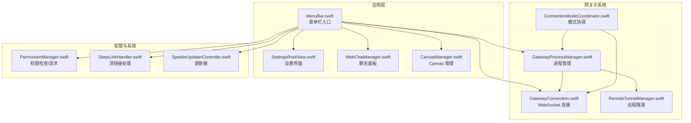
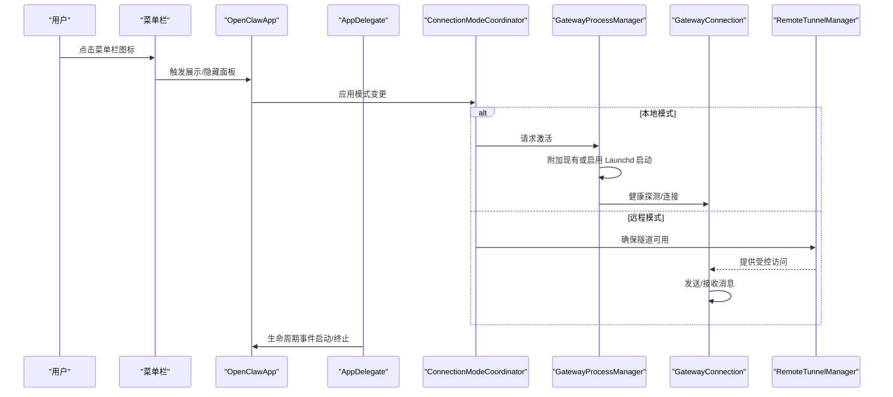
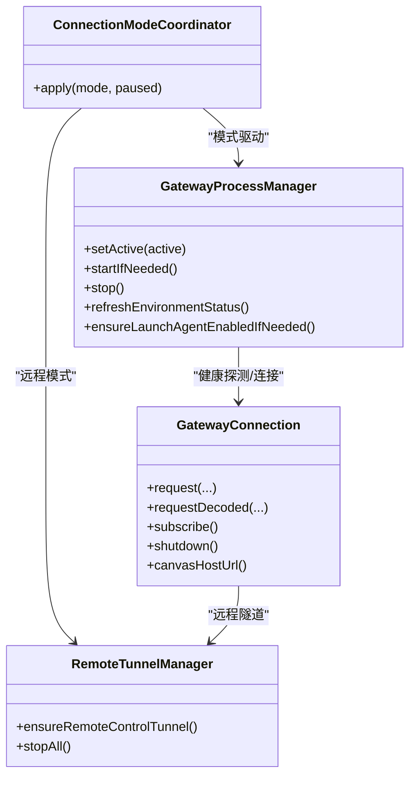
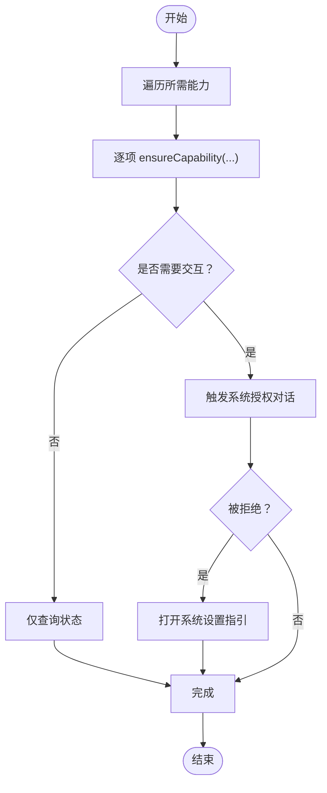
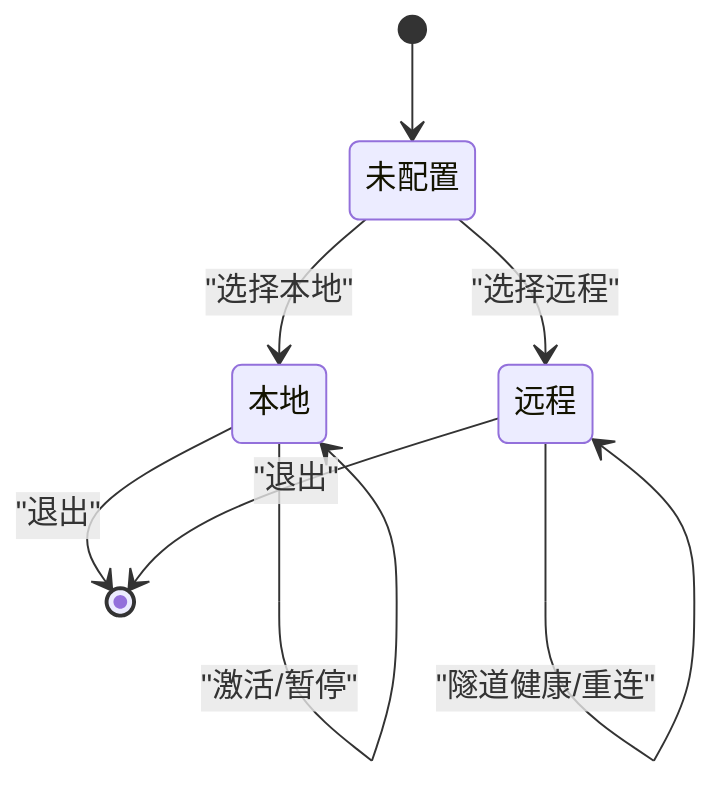
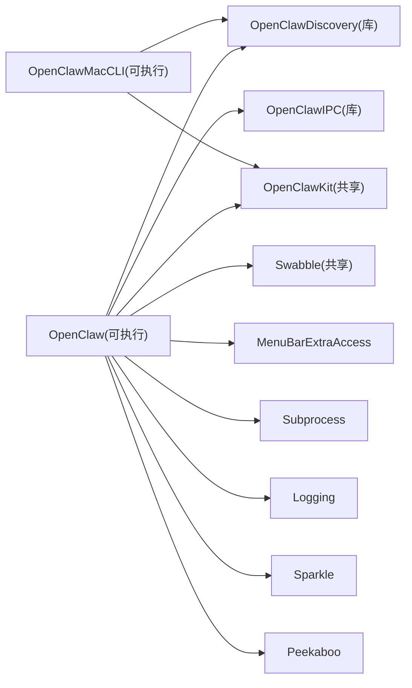

# macOS 应用

<cite>
**本文引用的文件**
- [apps/macos/README.md](file://apps/macos/README.md)
- [apps/macos/Package.swift](file://apps/macos/Package.swift)
- [apps/macos/Sources/OpenClaw/MenuBar.swift](file://apps/macos/Sources/OpenClaw/MenuBar.swift)
- [apps/macos/Sources/OpenClaw/PermissionManager.swift](file://apps/macos/Sources/OpenClaw/PermissionManager.swift)
- [apps/macos/Sources/OpenClaw/GatewayConnection.swift](file://apps/macos/Sources/OpenClaw/GatewayConnection.swift)
- [apps/macos/Sources/OpenClaw/GatewayProcessManager.swift](file://apps/macos/Sources/OpenClaw/GatewayProcessManager.swift)
- [apps/macos/Sources/OpenClaw/CanvasSchemeHandler.swift](file://apps/macos/Sources/OpenClaw/CanvasSchemeHandler.swift)
- [apps/macos/Sources/OpenClaw/CanvasManager.swift](file://apps/macos/Sources/OpenClaw/CanvasManager.swift)
- [apps/macos/Sources/OpenClaw/CanvasWindow.swift](file://apps/macos/Sources/OpenClaw/CanvasWindow.swift)
- [apps/macos/Sources/OpenClaw/CanvasChromeContainerView.swift](file://apps/macos/Sources/OpenClaw/CanvasChromeContainerView.swift)
- [apps/macos/Sources/OpenClaw/CanvasA2UIActionMessageHandler.swift](file://apps/macos/Sources/OpenClaw/CanvasA2UIActionMessageHandler.swift)
- [apps/macos/Sources/OpenClaw/CanvasScheme.swift](file://apps/macos/Sources/OpenClaw/CanvasScheme.swift)
- [apps/macos/Sources/OpenClaw/CanvasFileWatcher.swift](file://apps/macos/Sources/OpenClaw/CanvasFileWatcher.swift)
- [apps/macos/Sources/OpenClaw/CameraCaptureService.swift](file://apps/macos/Sources/OpenClaw/CameraCaptureService.swift)
- [apps/macos/Sources/OpenClaw/DeepLinkHandler.swift](file://apps/macos/Sources/OpenClaw/DeepLinkHandler.swift)
- [apps/macos/Sources/OpenClaw/RemoteTunnelManager.swift](file://apps/macos/Sources/OpenClaw/RemoteTunnelManager.swift)
- [apps/macos/Sources/OpenClaw/ExecApprovalsPromptServer.swift](file://apps/macos/Sources/OpenClaw/ExecApprovalsPromptServer.swift)
- [apps/macos/Sources/OpenClaw/ExecApprovalsGatewayPrompter.swift](file://apps/macos/Sources/OpenClaw/ExecApprovalsGatewayPrompter.swift)
- [apps/macos/Sources/OpenClaw/MacNodeModeCoordinator.swift](file://apps/macos/Sources/OpenClaw/MacNodeModeCoordinator.swift)
- [apps/macos/Sources/OpenClaw/ConnectionModeCoordinator.swift](file://apps/macos/Sources/OpenClaw/ConnectionModeCoordinator.swift)
- [apps/macos/Sources/OpenClaw/GatewayEndpointStore.swift](file://apps/macos/Sources/OpenClaw/GatewayEndpointStore.swift)
- [apps/macos/Sources/OpenClaw/GatewayEnvironment.swift](file://apps/macos/Sources/OpenClaw/GatewayEnvironment.swift)
- [apps/macos/Sources/OpenClaw/GatewayLaunchAgentManager.swift](file://apps/macos/Sources/OpenClaw/GatewayLaunchAgentManager.swift)
- [apps/macos/Sources/OpenClaw/PortGuardian.swift](file://apps/macos/Sources/OpenClaw/PortGuardian.swift)
- [apps/macos/Sources/OpenClaw/ControlChannel.swift](file://apps/macos/Sources/OpenClaw/ControlChannel.swift)
- [apps/macos/Sources/OpenClaw/WorkActivityStore.swift](file://apps/macos/Sources/OpenClaw/WorkActivityStore.swift)
- [apps/macos/Sources/OpenClaw/SettingsRootView.swift](file://apps/macos/Sources/OpenClaw/SettingsRootView.swift)
- [apps/macos/Sources/OpenClaw/OnboardingController.swift](file://apps/macos/Sources/OpenClaw/OnboardingController.swift)
- [apps/macos/Sources/OpenClaw/TerminationSignalWatcher.swift](file://apps/macos/Sources/OpenClaw/TerminationSignalWatcher.swift)
- [apps/macos/Sources/OpenClaw/PresenceReporter.swift](file://apps/macos/Sources/OpenClaw/PresenceReporter.swift)
- [apps/macos/Sources/OpenClaw/VoiceWakeGlobalSettingsSync.swift](file://apps/macos/Sources/OpenClaw/VoiceWakeGlobalSettingsSync.swift)
- [apps/macos/Sources/OpenClaw/WebChatManager.swift](file://apps/macos/Sources/OpenClaw/WebChatManager.swift)
- [apps/macos/Sources/OpenClaw/NodePairingApprovalPrompter.swift](file://apps/macos/Sources/OpenClaw/NodePairingApprovalPrompter.swift)
- [apps/macos/Sources/OpenClaw/DevicePairingApprovalPrompter.swift](file://apps/macos/Sources/OpenClaw/DevicePairingApprovalPrompter.swift)
- [apps/macos/Sources/OpenClaw/PeekabooBridgeHostCoordinator.swift](file://apps/macos/Sources/OpenClaw/PeekabooBridgeHostCoordinator.swift)
- [apps/macos/Sources/OpenClaw/TailscaleService.swift](file://apps/macos/Sources/OpenClaw/TailscaleService.swift)
- [apps/macos/Sources/OpenClaw/MenuSessionsInjector.swift](file://apps/macos/Sources/OpenClaw/MenuSessionsInjector.swift)
- [apps/macos/Sources/OpenClaw/MenuHeaderCard.swift](file://apps/macos/Sources/OpenClaw/MenuHeaderCard.swift)
- [apps/macos/Sources/OpenClaw/MenuContentView.swift](file://apps/macos/Sources/OpenClaw/MenuContentView.swift)
- [apps/macos/Sources/OpenClaw/MenuContextCardInjector.swift](file://apps/macos/Sources/OpenClaw/MenuContextCardInjector.swift)
- [apps/macos/Sources/OpenClaw/MenuHighlightedHostView.swift](file://apps/macos/Sources/OpenClaw/MenuHighlightedHostView.swift)
- [apps/macos/Sources/OpenClaw/MenuHostedItem.swift](file://apps/macos/Sources/OpenClaw/MenuHostedItem.swift)
- [apps/macos/Sources/OpenClaw/MenuUsageHeaderView.swift](file://apps/macos/Sources/OpenClaw/MenuUsageHeaderView.swift)
- [apps/macos/Sources/OpenClaw/MenuSessionsHeaderView.swift](file://apps/macos/Sources/OpenClaw/MenuSessionsHeaderView.swift)
- [apps/macos/Sources/OpenClaw/SessionMenuLabelView.swift](file://apps/macos/Sources/OpenClaw/SessionMenuLabelView.swift)
- [apps/macos/Sources/OpenClaw/SessionMenuPreviewView.swift](file://apps/macos/Sources/OpenClaw/SessionMenuPreviewView.swift)
- [apps/macos/Sources/OpenClaw/UsageMenuLabelView.swift](file://apps/macos/Sources/OpenClaw/UsageMenuLabelView.swift)
- [apps/macos/Sources/OpenClaw/NodesMenu.swift](file://apps/macos/Sources/OpenClaw/NodesMenu.swift)
- [apps/macos/Sources/OpenClaw/GatewayDiscoveryMenu.swift](file://apps/macos/Sources/OpenClaw/GatewayDiscoveryMenu.swift)
- [apps/macos/Sources/OpenClaw/GatewayDiscoveryPreferences.swift](file://apps/macos/Sources/OpenClaw/GatewayDiscoveryPreferences.swift)
- [apps/macos/Sources/OpenClaw/GatewayDiscoverySelectionSupport.swift](file://apps/macos/Sources/OpenClaw/GatewayDiscoverySelectionSupport.swift)
- [apps/macos/Sources/OpenClaw/GatewayDiscoveryHelpers.swift](file://apps/macos/Sources/OpenClaw/GatewayDiscoveryHelpers.swift)
- [apps/macos/Sources/OpenClaw/RemoteGatewayProbe.swift](file://apps/macos/Sources/OpenClaw/RemoteGatewayProbe.swift)
- [apps/macos/Sources/OpenClaw/TalkModeGatewayConfig.swift](file://apps/macos/Sources/OpenClaw/TalkModeGatewayConfig.swift)
- [apps/macos/Sources/OpenClaw/GatewayAutostartPolicy.swift](file://apps/macos/Sources/OpenClaw/GatewayAutostartPolicy.swift)
- [apps/macos/Sources/OpenClaw/GatewayRemoteConfig.swift](file://apps/macos/Sources/OpenClaw/GatewayRemoteConfig.swift)
- [apps/macos/Sources/OpenClaw/GatewayPushSubscription.swift](file://apps/macos/Sources/OpenClaw/GatewayPushSubscription.swift)
- [apps/macos/Sources/OpenClaw/CLIInstallPrompter.swift](file://apps/macos/Sources/OpenClaw/CLIInstallPrompter.swift)
- [apps/macos/Sources/OpenClaw/CLIInstaller.swift](file://apps/macos/Sources/OpenClaw/CLIInstaller.swift)
- [apps/macos/Sources/OpenClaw/PermissionsSettings.swift](file://apps/macos/Sources/OpenClaw/PermissionsSettings.swift)
- [apps/macos/Sources/OpenClaw/PermissionMonitoringSupport.swift](file://apps/macos/Sources/OpenClaw/PermissionMonitoringSupport.swift)
- [apps/macos/Sources/OpenClaw/AboutSettings.swift](file://apps/macos/Sources/OpenClaw/AboutSettings.swift)
- [apps/macos/Sources/OpenClaw/AudioInputDeviceObserver.swift](file://apps/macos/Sources/OpenClaw/AudioInputDeviceObserver.swift)
- [apps/macos/Sources/OpenClaw/AgentEventStore.swift](file://apps/macos/Sources/OpenClaw/AgentEventStore.swift)
- [apps/macos/Sources/OpenClaw/AgentEventsWindow.swift](file://apps/macos/Sources/OpenClaw/AgentEventsWindow.swift)
- [apps/macos/Sources/OpenClaw/AgentWorkspace.swift](file://apps/macos/Sources/OpenClaw/AgentWorkspace.swift)
- [apps/macos/Sources/OpenClaw/AgentWorkspaceConfig.swift](file://apps/macos/Sources/OpenClaw/AgentWorkspaceConfig.swift)
- [apps/macos/Sources/OpenClaw/AnyCodable+Helpers.swift](file://apps/macos/Sources/OpenClaw/AnyCodable+Helpers.swift)
- [apps/macos/Sources/OpenClaw/AppState.swift](file://apps/macos/Sources/OpenClaw/AppState.swift)
- [apps/macos/Sources/OpenClaw/AgeFormatting.swift](file://apps/macos/Sources/OpenClaw/AgeFormatting.swift)
- [apps/macos/Sources/OpenClaw/CostUsageMenuView.swift](file://apps/macos/Sources/OpenClaw/CostUsageMenuView.swift)
- [apps/macos/Sources/OpenClaw/ContextMenuCardView.swift](file://apps/macos/Sources/OpenClaw/ContextMenuCardView.swift)
- [apps/macos/Sources/OpenClaw/MenuItemsHighlightColors.swift](file://apps/macos/Sources/OpenClaw/MenuItemsHighlightColors.swift)
- [apps/macos/Sources/OpenClaw/PeekabooAutomationKit.swift](file://apps/macos/Sources/OpenClaw/PeekabooAutomationKit.swift)
- [apps/macos/Sources/OpenClaw/PeekabooBridge.swift](file://apps/macos/Sources/OpenClaw/PeekabooBridge.swift)
- [apps/macos/Sources/OpenClaw/PeekabooBridgeHost.swift](file://apps/macos/Sources/OpenClaw/PeekabooBridgeHost.swift)
- [apps/macos/Sources/OpenClaw/PeekabooBridgeHostCoordinator.swift](file://apps/macos/Sources/OpenClaw/PeekabooBridgeHostCoordinator.swift)
- [apps/macos/Sources/OpenClaw/PeekabooBridgeHostCoordinator.swift](file://apps/macos/Sources/OpenClaw/PeekabooBridgeHostCoordinator.swift)
- [apps/macos/Sources/OpenClaw/PeekabooBridgeHostCoordinator.swift](file://apps/macos/Sources/OpenClaw/PeekabooBridgeHostCoordinator.swift)
- [apps/macos/Sources/OpenClaw/PeekabooBridgeHostCoordinator.swift](file://apps/macos/Sources/OpenClaw/PeekabooBridgeHostCoordinator.swift)
- [apps/macos/Sources/OpenClaw/PeekabooBridgeHostCoordinator.swift](file://apps/macos/Sources/OpenClaw/PeekabooBridgeHostCoordinator.swift)
- [apps/macos/Sources/OpenClaw/PeekabooBridgeHostCoordinator.swift](file://apps/macos/Sources/OpenClaw/PeekabooBridgeHostCoordinator.swift)
- [apps/macos/Sources/OpenClaw/PeekabooBridgeHostCoordinator.swift](file://apps/macos/Sources/OpenClaw/PeekabooBridgeHostCoordinator.swift)
- [apps/macos/Sources/OpenClaw/PeekabooBridgeHostCoordinator.swift](file://apps/macos/Sources/OpenClaw/PeekabooBridgeHostCoordinator.swift)
- [apps/macos/Sources/OpenClaw/PeekabooBridgeHostCoordinator.swift](file://apps/macos/Sources/OpenClaw/PeekabooBridgeHostCoordinator.swift)
- [apps/macos/Sources/OpenClaw/PeekabooBridgeHostCoordinator.swift](file://apps/macos/Sources/OpenClaw/PeekabooBridgeHostCoordinator.swift)
- [apps/macos/Sources/OpenClaw/PeekabooBridgeHostCoordinator.swift](file://apps/macos/Sources/OpenClaw/PeekabooBridgeHostCoordinator.swift)
- [apps/macos/Sources/OpenClaw/PeekabooBridgeHostCoordinator.swift](file://apps/macos/Sources/OpenClaw/PeekabooBridgeHostCoordinator.swift)
- [apps/macos/Sources/OpenClaw/PeekabooBridgeHostCoordinator.swift](file://apps/macos/Sources/OpenClaw/PeekabooBridgeHostCoordinator......)
</cite>

## 目录
1. [简介](#简介)
2. [项目结构](#项目结构)
3. [核心组件](#核心组件)
4. [架构总览](#架构总览)
5. [详细组件分析](#详细组件分析)
6. [依赖关系分析](#依赖关系分析)
7. [性能考量](#性能考量)
8. [故障排除指南](#故障排除指南)
9. [结论](#结论)
10. [附录](#附录)

## 简介
本文件面向 macOS 菜单栏应用（OpenClaw）的开发者与运维人员，系统性阐述以下主题：
- 网关管理：本地与远程模式切换、进程生命周期、自动启动与连接恢复
- 权限处理：TCC 权限系统、AppleScript、辅助功能、屏幕录制、摄像头、麦克风、定位、语音识别
- 深链接与系统集成：应用启动时的 URL 处理、Sparkle 更新器、菜单栏交互
- 安全与执行审批：system.run 执行审批机制（本地与网关侧）
- macOS 特有工具集：Canvas、Camera、Screen Recording 的使用与安全注意事项
- 开发与打包：构建脚本、签名策略、打包流程与环境变量

## 项目结构
OpenClaw macOS 应用采用 Swift 包组织，核心产物为菜单栏应用与若干可复用库（IPC、发现、CLI）。应用通过菜单栏入口提供设置、会话、节点与网关控制能力，并在后台维护与远端网关的长连接。

图示来源
- [apps/macos/Sources/OpenClaw/MenuBar.swift](file://apps/macos/Sources/OpenClaw/MenuBar.swift)
- [apps/macos/Sources/OpenClaw/GatewayProcessManager.swift](file://apps/macos/Sources/OpenClaw/GatewayProcessManager.swift)
- [apps/macos/Sources/OpenClaw/GatewayConnection.swift](file://apps/macos/Sources/OpenClaw/GatewayConnection.swift)
- [apps/macos/Sources/OpenClaw/PermissionManager.swift](file://apps/macos/Sources/OpenClaw/PermissionManager.swift)
- [apps/macos/Sources/OpenClaw/DeepLinkHandler.swift](file://apps/macos/Sources/OpenClaw/DeepLinkHandler.swift)
- [apps/macos/Sources/OpenClaw/RemoteTunnelManager.swift](file://apps/macos/Sources/OpenClaw/RemoteTunnelManager.swift)
- [apps/macos/Sources/OpenClaw/ConnectionModeCoordinator.swift](file://apps/macos/Sources/OpenClaw/ConnectionModeCoordinator.swift)

章节来源
- [apps/macos/Package.swift](file://apps/macos/Package.swift)
- [apps/macos/README.md](file://apps/macos/README.md)

## 核心组件
- 菜单栏入口与生命周期：负责应用初始化、菜单栏图标状态、悬浮提示抑制、设置窗口、更新器选择、深链接分发与终止清理。
- 网关连接与控制：统一的 WebSocket 连接封装，支持本地自启/附加、远程隧道重建、推送订阅、方法调用与错误恢复。
- 权限管理：集中式权限检查与交互式授权，覆盖通知、AppleScript、辅助功能、屏幕录制、摄像头、麦克风、定位、语音识别。
- Canvas 工具链：Canvas 协议处理、窗口与视图容器、A2UI 动作消息处理、文件监听与 Chrome 容器集成。
- 执行审批与节点模式：本地/网关侧的执行审批提示器、节点配对与设备配对审批、语音唤醒全局同步。
- 构建与签名：打包脚本、签名策略、团队 ID 校验、库验证绕过开关。

章节来源
- [apps/macos/Sources/OpenClaw/MenuBar.swift](file://apps/macos/Sources/OpenClaw/MenuBar.swift)
- [apps/macos/Sources/OpenClaw/GatewayConnection.swift](file://apps/macos/Sources/OpenClaw/GatewayConnection.swift)
- [apps/macos/Sources/OpenClaw/GatewayProcessManager.swift](file://apps/macos/Sources/OpenClaw/GatewayProcessManager.swift)
- [apps/macos/Sources/OpenClaw/PermissionManager.swift](file://apps/macos/Sources/OpenClaw/PermissionManager.swift)
- [apps/macos/Sources/OpenClaw/CanvasManager.swift](file://apps/macos/Sources/OpenClaw/CanvasManager.swift)
- [apps/macos/Sources/OpenClaw/CanvasSchemeHandler.swift](file://apps/macos/Sources/OpenClaw/CanvasSchemeHandler.swift)
- [apps/macos/Sources/OpenClaw/CanvasWindow.swift](file://apps/macos/Sources/OpenClaw/CanvasWindow.swift)
- [apps/macos/Sources/OpenClaw/CanvasChromeContainerView.swift](file://apps/macos/Sources/OpenClaw/CanvasChromeContainerView.swift)
- [apps/macos/Sources/OpenClaw/CanvasA2UIActionMessageHandler.swift](file://apps/macos/Sources/OpenClaw/CanvasA2UIActionMessageHandler.swift)
- [apps/macos/Sources/OpenClaw/CanvasScheme.swift](file://apps/macos/Sources/OpenClaw/CanvasScheme.swift)
- [apps/macos/Sources/OpenClaw/CanvasFileWatcher.swift](file://apps/macos/Sources/OpenClaw/CanvasFileWatcher.swift)
- [apps/macos/Sources/OpenClaw/CameraCaptureService.swift](file://apps/macos/Sources/OpenClaw/CameraCaptureService.swift)
- [apps/macos/Sources/OpenClaw/DeepLinkHandler.swift](file://apps/macos/Sources/OpenClaw/DeepLinkHandler.swift)
- [apps/macos/Sources/OpenClaw/RemoteTunnelManager.swift](file://apps/macos/Sources/OpenClaw/RemoteTunnelManager.swift)
- [apps/macos/Sources/OpenClaw/ExecApprovalsPromptServer.swift](file://apps/macos/Sources/OpenClaw/ExecApprovalsPromptServer.swift)
- [apps/macos/Sources/OpenClaw/ExecApprovalsGatewayPrompter.swift](file://apps/macos/Sources/OpenClaw/ExecApprovalsGatewayPrompter.swift)
- [apps/macos/Sources/OpenClaw/MacNodeModeCoordinator.swift](file://apps/macos/Sources/OpenClaw/MacNodeModeCoordinator.swift)
- [apps/macos/Sources/OpenClaw/ConnectionModeCoordinator.swift](file://apps/macos/Sources/OpenClaw/ConnectionModeCoordinator.swift)

## 架构总览
应用以菜单栏为中心，围绕“连接模式”（本地/远程/未配置）进行行为切换。本地模式下由进程管理器负责启动/附加本地网关；远程模式下通过隧道管理器建立与远端网关的可控通道。权限模块贯穿各功能面，确保合规使用敏感能力。Canvas 作为可视化与交互载体，结合 A2UI 与 Chrome 容器实现跨应用协作。

图示来源
- [apps/macos/Sources/OpenClaw/MenuBar.swift](file://apps/macos/Sources/OpenClaw/MenuBar.swift)
- [apps/macos/Sources/OpenClaw/ConnectionModeCoordinator.swift](file://apps/macos/Sources/OpenClaw/ConnectionModeCoordinator.swift)
- [apps/macos/Sources/OpenClaw/GatewayProcessManager.swift](file://apps/macos/Sources/OpenClaw/GatewayProcessManager.swift)
- [apps/macos/Sources/OpenClaw/GatewayConnection.swift](file://apps/macos/Sources/OpenClaw/GatewayConnection.swift)
- [apps/macos/Sources/OpenClaw/RemoteTunnelManager.swift](file://apps/macos/Sources/OpenClaw/RemoteTunnelManager.swift)

## 详细组件分析

### 网关管理与连接
- 统一连接封装：GatewayConnection 提供方法枚举、请求/响应编解码、错误恢复策略（本地模式自动重启、远程模式重建隧道）、推送订阅与快照缓存。
- 进程管理：GatewayProcessManager 负责状态机（停止/启动中/运行/附加现有/失败）、日志截取、环境检查、Launchd 自动化与端口守护。
- 模式协调：ConnectionModeCoordinator 根据当前模式（本地/远程/未配置）应用相应策略，触发 CLI 安装提示与状态项外观更新。

图示来源
- [apps/macos/Sources/OpenClaw/GatewayConnection.swift](file://apps/macos/Sources/OpenClaw/GatewayConnection.swift)
- [apps/macos/Sources/OpenClaw/GatewayProcessManager.swift](file://apps/macos/Sources/OpenClaw/GatewayProcessManager.swift)
- [apps/macos/Sources/OpenClaw/ConnectionModeCoordinator.swift](file://apps/macos/Sources/OpenClaw/ConnectionModeCoordinator.swift)
- [apps/macos/Sources/OpenClaw/RemoteTunnelManager.swift](file://apps/macos/Sources/OpenClaw/RemoteTunnelManager.swift)

章节来源
- [apps/macos/Sources/OpenClaw/GatewayConnection.swift](file://apps/macos/Sources/OpenClaw/GatewayConnection.swift)
- [apps/macos/Sources/OpenClaw/GatewayProcessManager.swift](file://apps/macos/Sources/OpenClaw/GatewayProcessManager.swift)
- [apps/macos/Sources/OpenClaw/ConnectionModeCoordinator.swift](file://apps/macos/Sources/OpenClaw/ConnectionModeCoordinator.swift)

### 权限处理与 TCC 系统
- 权限集合：通知、AppleScript、辅助功能（AX）、屏幕录制、麦克风、语音识别、摄像头、位置。
- 行为策略：非交互式场景仅查询状态；交互式场景触发系统授权对话，并在被拒绝时引导至系统设置。
- 监控机制：PermissionMonitor 定期轮询权限状态，最小化刷新间隔，避免频繁 UI 干扰。

图示来源
- [apps/macos/Sources/OpenClaw/PermissionManager.swift](file://apps/macos/Sources/OpenClaw/PermissionManager.swift)

章节来源
- [apps/macos/Sources/OpenClaw/PermissionManager.swift](file://apps/macos/Sources/OpenClaw/PermissionManager.swift)

### 本地与远程模式切换
- 本地模式：优先尝试附加已运行网关，否则通过 Launchd 启动；失败时记录原因并保持失败状态。
- 远程模式：先停止本地网关，再通过隧道管理器建立受控通道，必要时重试与回退。
- 模式变更：菜单栏与设置界面联动，更新状态项外观与图标动画。

图示来源
- [apps/macos/Sources/OpenClaw/ConnectionModeCoordinator.swift](file://apps/macos/Sources/OpenClaw/ConnectionModeCoordinator.swift)
- [apps/macos/Sources/OpenClaw/GatewayProcessManager.swift](file://apps/macos/Sources/OpenClaw/GatewayProcessManager.swift)
- [apps/macos/Sources/OpenClaw/RemoteTunnelManager.swift](file://apps/macos/Sources/OpenClaw/RemoteTunnelManager.swift)

章节来源
- [apps/macos/Sources/OpenClaw/ConnectionModeCoordinator.swift](file://apps/macos/Sources/OpenClaw/ConnectionModeCoordinator.swift)
- [apps/macos/Sources/OpenClaw/GatewayProcessManager.swift](file://apps/macos/Sources/OpenClaw/GatewayProcessManager.swift)
- [apps/macos/Sources/OpenClaw/RemoteTunnelManager.swift](file://apps/macos/Sources/OpenClaw/RemoteTunnelManager.swift)

### 节点能力暴露与配对
- 节点配对：GatewayConnection 提供 approve/reject 接口，配合 NodePairingApprovalPrompter 弹窗确认。
- 设备配对：DevicePairingApprovalPrompter 与 GatewayConnection 的 devicePairApprove/reject 协同。
- 语音唤醒：VoiceWakeGlobalSettingsSync 同步全局设置，GatewayConnection 支持获取/设置触发词。

章节来源
- [apps/macos/Sources/OpenClaw/NodePairingApprovalPrompter.swift](file://apps/macos/Sources/OpenClaw/NodePairingApprovalPrompter.swift)
- [apps/macos/Sources/OpenClaw/DevicePairingApprovalPrompter.swift](file://apps/macos/Sources/OpenClaw/DevicePairingApprovalPrompter.swift)
- [apps/macos/Sources/OpenClaw/GatewayConnection.swift](file://apps/macos/Sources/OpenClaw/GatewayConnection.swift)
- [apps/macos/Sources/OpenClaw/VoiceWakeGlobalSettingsSync.swift](file://apps/macos/Sources/OpenClaw/VoiceWakeGlobalSettingsSync.swift)

### 深链接处理
- 应用委托在收到系统打开 URL 事件后，交由 DeepLinkHandler 处理，实现从浏览器或其他应用到应用内功能的直达。

章节来源
- [apps/macos/Sources/OpenClaw/MenuBar.swift](file://apps/macos/Sources/OpenClaw/MenuBar.swift)
- [apps/macos/Sources/OpenClaw/DeepLinkHandler.swift](file://apps/macos/Sources/OpenClaw/DeepLinkHandler.swift)

### system.run 执行审批机制
- 本地审批：ExecApprovalsPromptServer 在本地提供审批弹窗与回调。
- 网关侧审批：ExecApprovalsGatewayPrompter 将审批请求转发至网关，由网关侧策略决定放行或拒绝。
- 两者协同：确保在不同执行路径下均能获得一致的审批体验与安全边界。

章节来源
- [apps/macos/Sources/OpenClaw/ExecApprovalsPromptServer.swift](file://apps/macos/Sources/OpenClaw/ExecApprovalsPromptServer.swift)
- [apps/macos/Sources/OpenClaw/ExecApprovalsGatewayPrompter.swift](file://apps/macos/Sources/OpenClaw/ExecApprovalsGatewayPrompter.swift)

### macOS 特有工具集：Canvas、Camera、Screen Recording
- Canvas
  - 协议与窗口：CanvasScheme、CanvasSchemeHandler、CanvasWindow、CanvasChromeContainerView。
  - A2UI 集成：CanvasA2UIActionMessageHandler、CanvasFileWatcher。
  - 状态与调试：CanvasManager 提供面板可见性回调与调试状态刷新。
- Camera
  - 摄像头捕获：CameraCaptureService 封装授权与捕获流程，配合 PermissionManager 的摄像头权限。
- Screen Recording
  - 屏幕录制：ScreenRecordingProbe 提供授权检测与请求，配合菜单栏状态与权限监控。

章节来源
- [apps/macos/Sources/OpenClaw/CanvasScheme.swift](file://apps/macos/Sources/OpenClaw/CanvasScheme.swift)
- [apps/macos/Sources/OpenClaw/CanvasSchemeHandler.swift](file://apps/macos/Sources/OpenClaw/CanvasSchemeHandler.swift)
- [apps/macos/Sources/OpenClaw/CanvasWindow.swift](file://apps/macos/Sources/OpenClaw/CanvasWindow.swift)
- [apps/macos/Sources/OpenClaw/CanvasChromeContainerView.swift](file://apps/macos/Sources/OpenClaw/CanvasChromeContainerView.swift)
- [apps/macos/Sources/OpenClaw/CanvasA2UIActionMessageHandler.swift](file://apps/macos/Sources/OpenClaw/CanvasA2UIActionMessageHandler.swift)
- [apps/macos/Sources/OpenClaw/CanvasFileWatcher.swift](file://apps/macos/Sources/OpenClaw/CanvasFileWatcher.swift)
- [apps/macos/Sources/OpenClaw/CanvasManager.swift](file://apps/macos/Sources/OpenClaw/CanvasManager.swift)
- [apps/macos/Sources/OpenClaw/CameraCaptureService.swift](file://apps/macos/Sources/OpenClaw/CameraCaptureService.swift)
- [apps/macos/Sources/OpenClaw/PermissionManager.swift](file://apps/macos/Sources/OpenClaw/PermissionManager.swift)

## 依赖关系分析
- 包产品与目标：OpenClaw（菜单栏应用）、OpenClawIPC（IPC 库）、OpenClawDiscovery（发现库）、OpenClawMacCLI（命令行工具）。
- 外部依赖：MenuBarExtraAccess（菜单栏扩展）、Subprocess（子进程）、Logging（日志）、Sparkle（更新）、Peekaboo（桥接）。
- 共享库：OpenClawKit（协议、UI、工具）、Swabble（测试与协议生成）。

图示来源
- [apps/macos/Package.swift](file://apps/macos/Package.swift)

章节来源
- [apps/macos/Package.swift](file://apps/macos/Package.swift)

## 性能考量
- 连接恢复与重试：本地模式下对连接失败进行多阶段重试与端口回退；远程模式下重建隧道并回退到尾流网络。
- 刷新节流：权限监控最小化刷新间隔，避免频繁系统调用；日志截取限制内存占用。
- 端口守护：PortGuardian 描述端口占用情况，减少无效连接尝试。
- 图标动画与 HUD 抑制：根据模式与状态动态调整，降低 UI 干扰。

章节来源
- [apps/macos/Sources/OpenClaw/GatewayConnection.swift](file://apps/macos/Sources/OpenClaw/GatewayConnection.swift)
- [apps/macos/Sources/OpenClaw/GatewayProcessManager.swift](file://apps/macos/Sources/OpenClaw/GatewayProcessManager.swift)
- [apps/macos/Sources/OpenClaw/PermissionManager.swift](file://apps/macos/Sources/OpenClaw/PermissionManager.swift)
- [apps/macos/Sources/OpenClaw/PortGuardian.swift](file://apps/macos/Sources/OpenClaw/PortGuardian.swift)

## 故障排除指南
- 启动与签名
  - 快速开发运行：使用重启脚本，支持无签名与强制签名两种模式。
  - 团队 ID 校验：签名后校验嵌入二进制的 Team ID 一致性，不一致则失败；可跳过审计或禁用库验证（开发专用）。
- 网关连接
  - 本地模式：若端口被占用或返回非网关数据，需清理冲突进程；认证失败需核对令牌一致性。
  - 远程模式：隧道断开时自动重试与回退；若健康检查失败，检查隧道与远端可达性。
- 权限问题
  - 交互式授权失败：检查系统设置中的对应权限；被拒时会引导至隐私与安全设置。
  - 语音唤醒：麦克风与语音识别需同时授权。
- Canvas 与屏幕录制
  - 屏幕录制授权：首次使用需触发系统授权；若无响应，重新触发请求。
  - Canvas 无法加载：检查协议与窗口层级，确认 A2UI 消息处理与文件监听正常。

章节来源
- [apps/macos/README.md](file://apps/macos/README.md)
- [apps/macos/Sources/OpenClaw/GatewayConnection.swift](file://apps/macos/Sources/OpenClaw/GatewayConnection.swift)
- [apps/macos/Sources/OpenClaw/GatewayProcessManager.swift](file://apps/macos/Sources/OpenClaw/GatewayProcessManager.swift)
- [apps/macos/Sources/OpenClaw/PermissionManager.swift](file://apps/macos/Sources/OpenClaw/PermissionManager.swift)

## 结论
OpenClaw macOS 应用通过清晰的模块划分与严格的权限治理，在本地与远程两种模式间平滑切换，兼顾易用性与安全性。其以菜单栏为核心入口，结合网关连接、Canvas 工具链与系统级审批机制，形成完整的桌面自动化与交互闭环。建议在生产环境中启用签名与团队 ID 校验，并持续关注权限与隧道的健康状态。

## 附录

### 开发与构建流程
- 快速运行：使用重启脚本进行开发启动，支持无签名与强制签名选项。
- 打包与签名：脚本自动签名并进行团队 ID 校验；可按需禁用库验证或跳过审计。
- 环境变量：支持签名标识、允许临时签名、时间戳关闭、库验证禁用、跳过团队 ID 校验等。

章节来源
- [apps/macos/README.md](file://apps/macos/README.md)

### 配置示例（路径引用）
- 网关端点与远程隧道：GatewayEndpointStore、RemoteTunnelManager
- 环境与端口：GatewayEnvironment、PortGuardian
- 控制通道：ControlChannel、WorkActivityStore
- 设置与引导：SettingsRootView、OnboardingController
- 菜单注入与展示：MenuSessionsInjector、MenuHeaderCard、MenuContentView、MenuContextCardInjector、MenuHighlightedHostView、MenuHostedItem、MenuUsageHeaderView、MenuSessionsHeaderView、SessionMenuLabelView、SessionMenuPreviewView、UsageMenuLabelView、NodesMenu
- 发现与偏好：GatewayDiscoveryMenu、GatewayDiscoveryPreferences、GatewayDiscoverySelectionSupport、GatewayDiscoveryHelpers、RemoteGatewayProbe、TalkModeGatewayConfig、GatewayAutostartPolicy、GatewayRemoteConfig、GatewayPushSubscription、CLIInstallPrompter、CLIInstaller、PermissionsSettings、PermissionMonitoringSupport、AboutSettings、AudioInputDeviceObserver、AgentEventStore、AgentEventsWindow、AgentWorkspace、AgentWorkspaceConfig、AnyCodable+Helpers、AppState、AgeFormatting、CostUsageMenuView、ContextMenuCardView、MenuItemsHighlightColors、PeekabooAutomationKit、PeekabooBridge、PeekabooBridgeHost、PeekabooBridgeHostCoordinator、PeekabooBridgeHostCoordinator、PeekabooBridgeHostCoordinator、PeekabooBridgeHostCoordinator、PeekabooBridgeHostCoordinator、PeekabooBridgeHostCoordinator、PeekabooBridgeHostCoordinator、PeekabooBridgeHostCoordinator、PeekabooBridgeHostCoordinator、PeekabooBridgeHostCoordinator、PeekabooBridgeHostCoordinator、PeekabooBridgeHostCoordinator、PeekabooBridgeHostCoordinator、PeekabooBridgeHostCoordinator、PeekabooBridgeHostCoordinator、PeekabooBridgeHostCoordinator、PeekabooBridgeHostCoordinator、PeekabooBridgeHostCoordinator、PeekabooBridgeHostCoordinator、PeekabooBridgeHostCoordinator、PeekabooBridgeHostCoordinator、PeekabooBridgeHostCoordinator、PeekabooBridgeHostCoordinator、PeekabooBridgeHostCoordinator、PeekabooBridgeHostCoordinator、PeekabooBridgeHostCoordinator、PeekabooBridgeHostCoordinator、PeekabooBridgeHostCoordinator、PeekabooBridgeHostCoordinator、PeekabooBridgeHostCoordinator、PeekabooBridgeHostCoordinator、PeekabooBridgeHostCoordinator、PeekabooBridgeHostCoordinator、PeekabooBridgeHostCoordinator、PeekabooBridgeHostCoordinator、PeekabooBridgeHostCoordinator、PeekabooBridgeHostCoordinator、PeekabooBridgeHostCoordinator、PeekabooBridgeHostCoordinator、PeekabooBridgeHostCoordinator、PeekabooBridgeHostCoordinator、PeekabooBridgeHostCoordinator、PeekabooBridgeHostCoordinator、PeekabooBridgeHostCoordinator、PeekabooBridgeHostCoordinator、PeekabooBridgeHostCoordinator、PeekabooBridgeHostCoordinator、PeekabooBridgeHostCoordinator、PeekabooBridgeHostCoordinator、PeekabooBridgeHostCoordinator、PeekabooBridgeHostCoordinator、PeekabooBridgeHostCoordinator、PeekabooBridgeHostCoordinator、PeekabooBridgeHostCoordinator、PeekabooBridgeHostCoordinator、PeekabooBridgeHostCoordinator、PeekabooBridgeHostCoordinator、PeekabooBridgeHostCoordinator、PeekabooBridgeHostCoordinator、PeekabooBridgeHostCoordinator、PeekabooBridgeHostCoordinator、PeekabooBridgeHostCoordinator、PeekabooBridgeHostCoordinator、Peek......