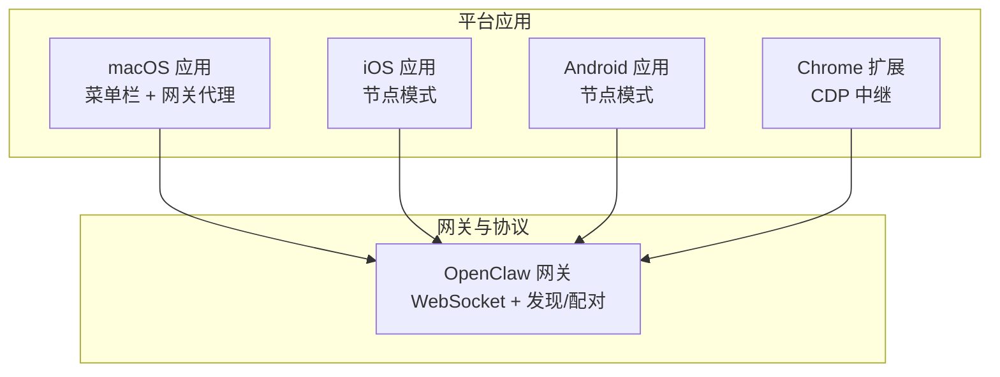
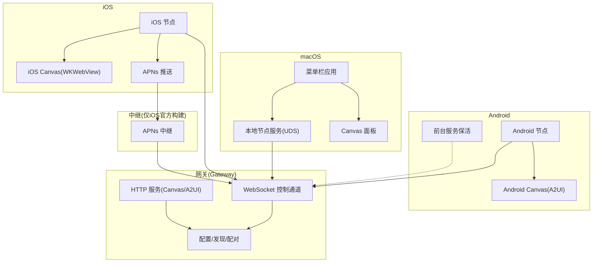
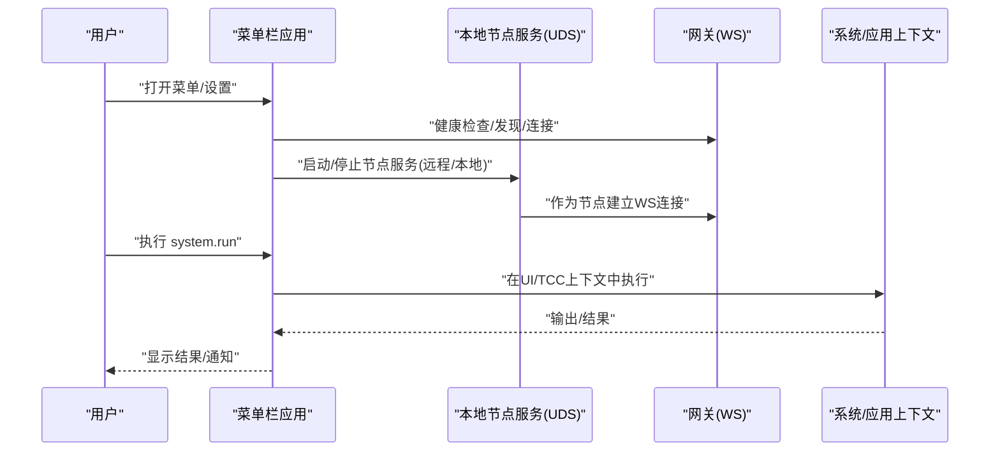
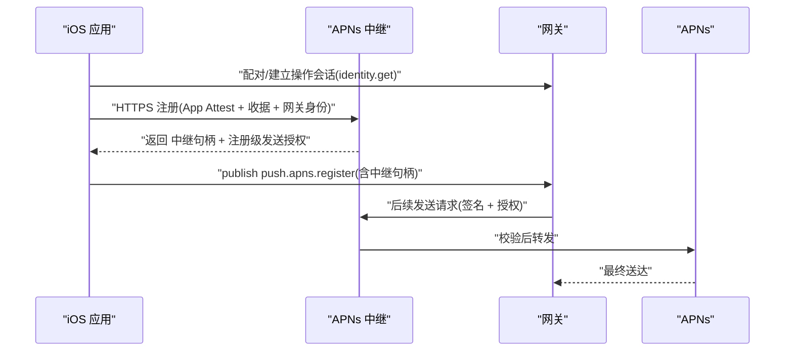
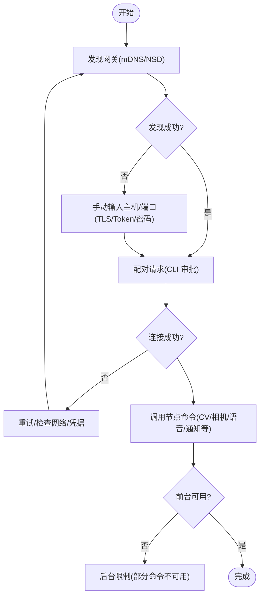
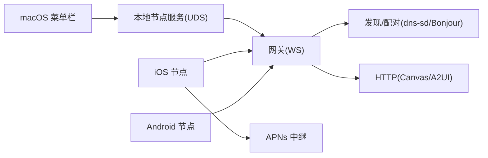

# 平台应用

<cite>
**本文引用的文件**
- [apps/macos/README.md](file://apps/macos/README.md)
- [docs/platforms/macos.md](file://docs/platforms/macos.md)
- [docs/platforms/mac/permissions.md](file://docs/platforms/mac/permissions.md)
- [docs/platforms/mac/canvas.md](file://docs/platforms/mac/canvas.md)
- [docs/platforms/mac/remote.md](file://docs/platforms/mac/remote.md)
- [docs/platforms/mac/menu-bar.md](file://docs/platforms/mac/menu-bar.md)
- [docs/platforms/mac/voicewake.md](file://docs/platforms/mac/voicewake.md)
- [apps/ios/README.md](file://apps/ios/README.md)
- [docs/platforms/ios.md](file://docs/platforms/ios.md)
- [apps/android/README.md](file://apps/android/README.md)
- [docs/platforms/android.md](file://docs/platforms/android.md)
- [assets/chrome-extension/README.md](file://assets/chrome-extension/README.md)
</cite>

## 目录
1. [简介](#简介)
2. [项目结构](#项目结构)
3. [核心组件](#核心组件)
4. [架构总览](#架构总览)
5. [详细组件分析](#详细组件分析)
6. [依赖关系分析](#依赖关系分析)
7. [性能考量](#性能考量)
8. [故障排除指南](#故障排除指南)
9. [结论](#结论)
10. [附录](#附录)

## 简介
本文件系统性介绍 OpenClaw 在各平台的应用实现与使用指南，覆盖 macOS 菜单栏应用、iOS 与 Android 节点应用以及桌面客户端（浏览器扩展）的功能特性、权限管理、本地能力集成与远程控制机制。内容基于仓库内官方文档与平台说明，帮助开发者与用户完成安装部署、配置选项与故障排除，并提供平台开发与自定义应用的最佳实践。

## 项目结构
OpenClaw 的平台应用主要分布在以下目录：
- apps/macos：macOS 应用源码与打包脚本
- apps/ios：iOS 应用源码与构建流程
- apps/android：Android 应用源码与测试/性能工具链
- docs/platforms：平台级使用与运维文档
- assets/chrome-extension：浏览器扩展用于连接本地网关进行自动化

**图表来源**
- [docs/platforms/macos.md:1-227](file://docs/platforms/macos.md#L1-L227)
- [docs/platforms/ios.md:1-217](file://docs/platforms/ios.md#L1-L217)
- [docs/platforms/android.md:1-168](file://docs/platforms/android.md#L1-L168)
- [assets/chrome-extension/README.md:1-24](file://assets/chrome-extension/README.md#L1-L24)

**章节来源**
- [apps/macos/README.md:1-65](file://apps/macos/README.md#L1-L65)
- [apps/ios/README.md:1-218](file://apps/ios/README.md#L1-L218)
- [apps/android/README.md:1-233](file://apps/android/README.md#L1-L233)
- [docs/platforms/macos.md:1-227](file://docs/platforms/macos.md#L1-L227)
- [docs/platforms/ios.md:1-217](file://docs/platforms/ios.md#L1-L217)
- [docs/platforms/android.md:1-168](file://docs/platforms/android.md#L1-L168)
- [assets/chrome-extension/README.md:1-24](file://assets/chrome-extension/README.md#L1-L24)

## 核心组件
- macOS 菜单栏应用：负责权限持有、网关生命周期管理、暴露本地能力（Canvas、Camera、Screen、system.run）、可选的 PeekabooBridge、深链触发 agent 运行等。
- iOS 节点应用：以 node 角色连接网关，支持 Canvas、屏幕快照、相机抓拍、位置、Talk 模式、语音唤醒；提供本地/官方构建的推送通道差异与中继信任模型。
- Android 节点应用：以 node 角色连接网关，支持聊天、Canvas/A2UI、相机、语音、通知、联系人/日历/运动等命令；强调前台服务保活与权限请求。
- 浏览器扩展：通过本地 CDP 中继服务器将网关与现有 Chrome 标签页连接，便于自动化。

**章节来源**
- [docs/platforms/macos.md:10-74](file://docs/platforms/macos.md#L10-L74)
- [docs/platforms/ios.md:10-217](file://docs/platforms/ios.md#L10-L217)
- [docs/platforms/android.md:10-168](file://docs/platforms/android.md#L10-L168)
- [assets/chrome-extension/README.md:1-24](file://assets/chrome-extension/README.md#L1-L24)

## 架构总览
下图展示各平台节点与网关之间的交互关系，包括发现、配对、控制通道与数据通道、Canvas/A2UI 渲染、推送通道（含 iOS 官方构建的中继信任模型）等。

**图表来源**
- [docs/platforms/macos.md:26-74](file://docs/platforms/macos.md#L26-L74)
- [docs/platforms/ios.md:52-150](file://docs/platforms/ios.md#L52-L150)
- [docs/platforms/android.md:75-168](file://docs/platforms/android.md#L75-L168)

## 详细组件分析

### macOS 菜单栏应用
- 功能职责
  - 菜单栏状态与通知、TCC 权限持有（通知、辅助功能、屏幕录制、麦克风、语音识别、自动化/AppleScript）
  - 启动/连接网关（本地或远程），在远程模式下通过 SSH 隧道转发控制端口
  - 暴露 macOS 专属能力（Canvas、Camera、Screen、system.run）
  - 可选运行 PeekabooBridge，安装全局 CLI
- 连接与模式
  - 本地模式：若本地已有网关则附加，否则通过 launchd 安装并启动
  - 远程模式：通过 SSH 隧道连接远端网关，本地仅启动节点服务以便网关可达
- 权限与安全
  - system.run 命令受“执行审批”策略控制，存储于本地 JSON 文件，支持默认策略、询问策略与白名单
  - 深链 openclaw://agent 支持无钥匙静默运行与带钥匙的无人值守模式
- 开发与打包
  - 提供快速开发运行脚本与打包签名流程，支持自动选择签名身份、Team ID 审计、库验证绕过等环境变量

**图表来源**
- [docs/platforms/macos.md:26-111](file://docs/platforms/macos.md#L26-L111)

**章节来源**
- [docs/platforms/macos.md:10-111](file://docs/platforms/macos.md#L10-L111)
- [docs/platforms/mac/remote.md:10-85](file://docs/platforms/mac/remote.md#L10-L85)
- [docs/platforms/mac/permissions.md:10-51](file://docs/platforms/mac/permissions.md#L10-L51)
- [docs/platforms/mac/canvas.md:10-126](file://docs/platforms/mac/canvas.md#L10-L126)
- [apps/macos/README.md:1-65](file://apps/macos/README.md#L1-L65)

### iOS 节点应用
- 功能职责
  - 以 node 角色连接网关（LAN Bonjour 或跨网络 Tailscale DNS-SD，或手动主机端口）
  - 暴露 Canvas、屏幕截图、相机抓拍、位置、Talk 模式、语音唤醒
  - 接收 node.invoke 命令并上报节点状态事件
- 配对与连接
  - 通过设置中的发现列表或手动输入主机端口连接
  - 通过 CLI 审批设备配对请求后方可连接
- 推送通道（官方构建）
  - 使用外部 APNs 中继，注册时携带 App Attest 与应用收据，由中继返回“中继句柄 + 注册级发送授权”，并将该绑定委托给已配对的网关身份
  - 网关侧通过设备身份签名向中继发起发送请求，中继校验授权与签名后转发至 APNs
  - 该设计确保生产 APNs 凭证不落入用户网关，且防止网关间互相复用注册
- 已知限制
  - 严格后台命令限制（Canvas、Camera、Screen、Talk 在后台受限）
  - 位置自动化需“始终”权限
  - 语音唤醒与 Talk 共享麦克风资源，Talk 抑制唤醒捕获

**图表来源**
- [docs/platforms/ios.md:52-150](file://docs/platforms/ios.md#L52-L150)

**章节来源**
- [apps/ios/README.md:1-218](file://apps/ios/README.md#L1-L218)
- [docs/platforms/ios.md:10-217](file://docs/platforms/ios.md#L10-L217)

### Android 节点应用
- 功能职责
  - 以 node 角色直接连接网关（mDNS/NSD + WebSocket），支持 Setup Code 与 Manual 模式
  - 聊天、Canvas/A2UI、相机、语音、通知、联系人/日历/运动等命令
  - 通过前台服务保活，持久化通知
- 连接与配对
  - 优先使用 mDNS/NSD 发现；跨网络建议使用 Wide-Area Bonjour/unicast DNS-SD + Tailscale Split DNS
  - 首次配对后自动重连；CLI 审批设备请求
- 权限与集成
  - 需要相机、录音、通知、位置等权限；按需在引导/设置流程中请求
  - Canvas/A2UI 命令需要节点处于前台且 Canvas WebView 已就绪
- 性能与测试
  - 提供宏基准与热点分析脚本，支持 adb reverse 本地 USB 测试

**图表来源**
- [docs/platforms/android.md:26-168](file://docs/platforms/android.md#L26-L168)

**章节来源**
- [apps/android/README.md:1-233](file://apps/android/README.md#L1-L233)
- [docs/platforms/android.md:1-168](file://docs/platforms/android.md#L1-L168)

### 浏览器扩展（Chrome）
- 用途
  - 将 OpenClaw 与现有 Chrome 标签页连接，通过本地 CDP 中继服务器实现自动化
- 使用流程
  - 构建/运行网关并启用浏览器控制，确保中继服务器可达
  - 安装扩展到稳定路径，开启开发者模式后“加载未打包”，固定扩展图标
  - 在目标标签页点击图标进行附加/分离
- 配置项
  - 中继端口默认 18792
  - 网关令牌需与 gateway.auth.token 对应

**章节来源**
- [assets/chrome-extension/README.md:1-24](file://assets/chrome-extension/README.md#L1-L24)

## 依赖关系分析
- macOS
  - 本地节点服务通过 Unix Domain Socket 与菜单栏应用通信，再经 WebSocket 连接网关
  - system.run 在 UI/TCC 上下文中执行，受本地“执行审批”策略控制
  - 远程模式依赖 SSH 隧道，网关看到的节点 IP 为 127.0.0.1（可通过直连传输改变）
- iOS
  - 本地构建默认直连 APNs；官方构建通过中继注册并委托网关身份，避免网关持有原始 APNs 凭证
- Android
  - 依赖前台服务维持连接，Canvas/A2UI 需前台 WebView 就绪
  - 跨网络发现依赖 Wide-Area Bonjour/unicast DNS-SD + Split DNS

**图表来源**
- [docs/platforms/macos.md:61-74](file://docs/platforms/macos.md#L61-L74)
- [docs/platforms/ios.md:160-174](file://docs/platforms/ios.md#L160-L174)
- [docs/platforms/android.md:66-74](file://docs/platforms/android.md#L66-L74)

**章节来源**
- [docs/platforms/macos.md:61-74](file://docs/platforms/macos.md#L61-L74)
- [docs/platforms/ios.md:160-174](file://docs/platforms/ios.md#L160-L174)
- [docs/platforms/android.md:66-74](file://docs/platforms/android.md#L66-L74)

## 性能考量
- macOS
  - system.run 环境变量过滤与允许列表合并，避免注入敏感变量；shell 包装器在允许模式下尝试解包内层可执行路径
  - 远程模式下 SSH 隧道使用 BatchMode/ExitOnForwardFailure/keepalive，减少抖动
- iOS
  - 语音唤醒与 Talk 共享麦克风，Talk 活跃时抑制唤醒捕获；后台音频可能被系统挂起
- Android
  - 前台服务保活与持久通知；宏基准与热点分析脚本可用于冷启动与帧时序优化
  - Canvas/A2UI 命令需前台 WebView 就绪，避免后台不可用错误

**章节来源**
- [docs/platforms/macos.md:75-111](file://docs/platforms/macos.md#L75-L111)
- [docs/platforms/ios.md:200-211](file://docs/platforms/ios.md#L200-L211)
- [apps/android/README.md:63-96](file://apps/android/README.md#L63-L96)

## 故障排除指南
- macOS
  - 权限提示消失：退出应用、清理系统设置隐私条目、从同一路径重新授予；必要时使用 tccutil 重置；某些权限需重启 macOS 后才出现
  - 远程模式隧道失败：确认 SSH 可达、PATH 正确、Baileys 登录状态；如需真实客户端 IP，切换为直连传输
  - system.run 失败：检查执行审批策略、白名单匹配与环境变量过滤
- iOS
  - 无法收到推送：检查推送能力/配置文件/主题是否匹配；本地构建默认直连 APNs，官方构建需中继注册成功
  - 后台命令不可用：将应用置于前台，或接受后台限制
  - 重装后重连失败：钥匙串配对令牌清除，需重新配对
- Android
  - 无法发现网关：跨网络使用 Wide-Area Bonjour/unicast DNS-SD + Split DNS；或使用手动主机端口
  - A2UI 不可用：确保网关 Canvas 主机运行并可达；保持应用在 Screen 标签页，节点会在首次 A2UI 失败后 TTL 安全重试一次
  - NODE_BACKGROUND_UNAVAILABLE：保持前台并激活 Screen 标签页

**章节来源**
- [docs/platforms/mac/permissions.md:27-51](file://docs/platforms/mac/permissions.md#L27-L51)
- [docs/platforms/mac/remote.md:68-85](file://docs/platforms/mac/remote.md#L68-L85)
- [docs/platforms/ios.md:205-211](file://docs/platforms/ios.md#L205-L211)
- [apps/ios/README.md:177-218](file://apps/ios/README.md#L177-L218)
- [apps/android/README.md:169-233](file://apps/android/README.md#L169-L233)
- [docs/platforms/android.md:169-168](file://docs/platforms/android.md#L169-L168)

## 结论
OpenClaw 在多平台提供了统一的节点连接与控制体验：macOS 菜单栏应用负责权限与网关生命周期管理并暴露本地能力；iOS 与 Android 节点应用分别面向移动场景，提供丰富的 Canvas/A2UI、媒体与系统能力；浏览器扩展则打通了网页自动化。通过清晰的发现/配对协议、远程控制与推送中继机制，OpenClaw 实现了从本地到云端的灵活部署与安全控制。

## 附录

### 平台开发与自定义应用最佳实践
- macOS
  - 固定安装路径、一致的 Bundle ID 与真实证书签名，确保 TCC 权限持久
  - 使用 LaunchAgent 管理网关生命周期；system.run 策略最小化权限与明确白名单
  - 远程模式优先使用 SSH 隧道，必要时采用直连并配置真实 IP 显示
- iOS
  - 官方构建必须通过中继注册并委托网关身份；本地构建直连 APNs
  - 后台命令严格限制，前台优先；位置自动化需“始终”权限
- Android
  - 前台服务保活与持久通知；跨网络使用 Wide-Area Bonjour/unicast DNS-SD + Split DNS
  - Canvas/A2UI 命令需前台 WebView 就绪；集成测试前确保网关 Canvas 主机可达
- 浏览器扩展
  - 确保本地 CDP 中继可达；扩展安装后固定图标，按需附加/分离目标标签页

**章节来源**
- [docs/platforms/macos.md:165-227](file://docs/platforms/macos.md#L165-L227)
- [apps/macos/README.md:58-65](file://apps/macos/README.md#L58-L65)
- [docs/platforms/ios.md:115-150](file://docs/platforms/ios.md#L115-L150)
- [apps/ios/README.md:50-114](file://apps/ios/README.md#L50-L114)
- [docs/platforms/android.md:66-168](file://docs/platforms/android.md#L66-L168)
- [apps/android/README.md:116-168](file://apps/android/README.md#L116-L168)
- [assets/chrome-extension/README.md:1-24](file://assets/chrome-extension/README.md#L1-L24)