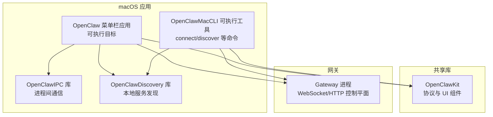
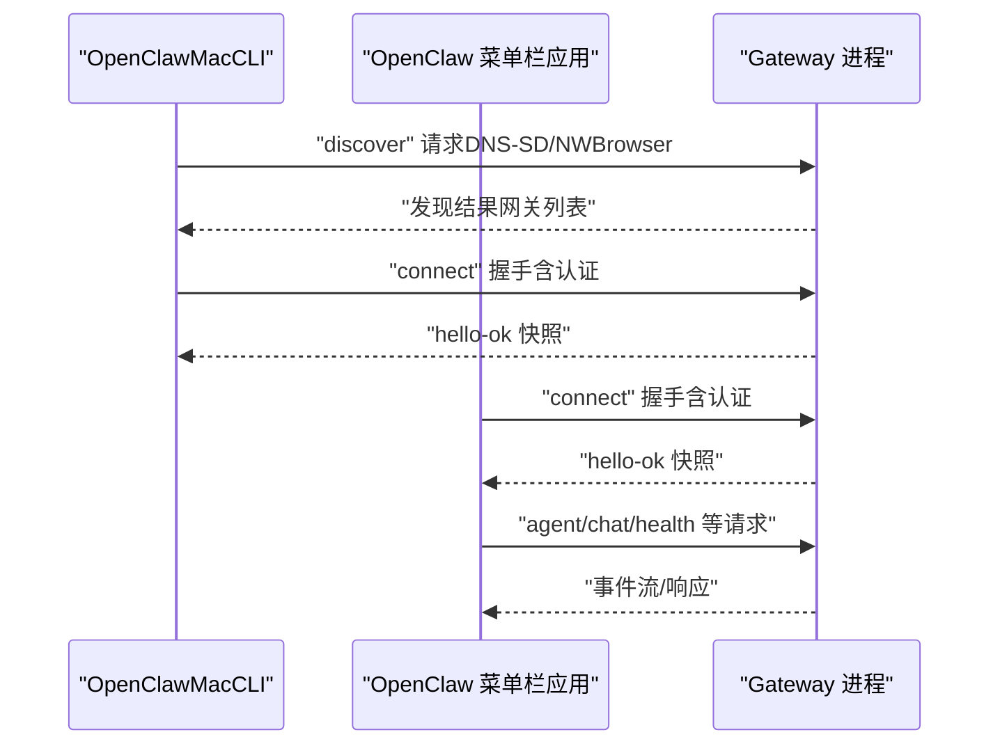
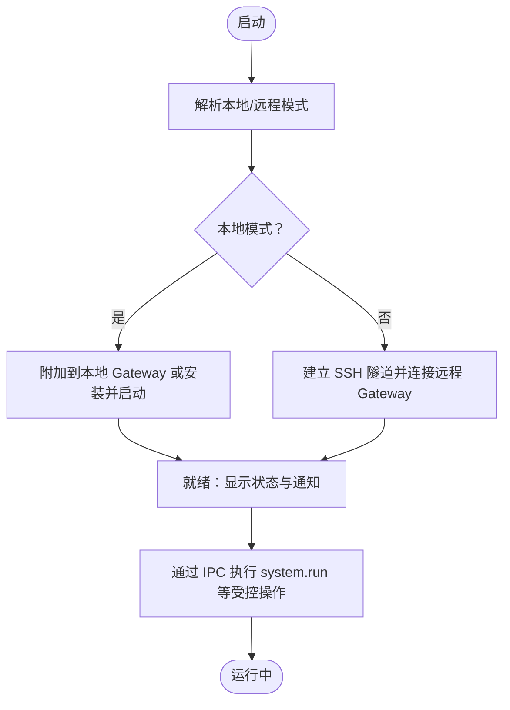
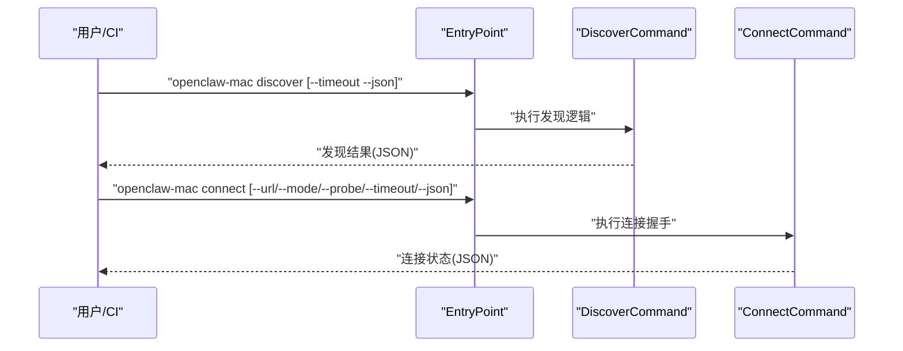
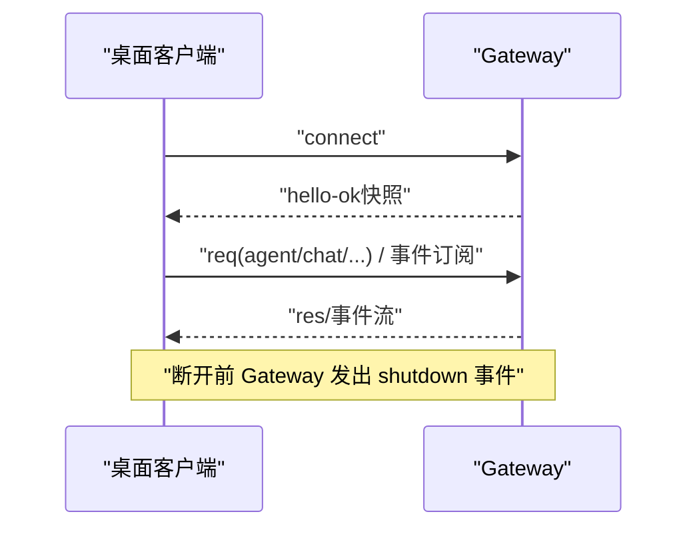
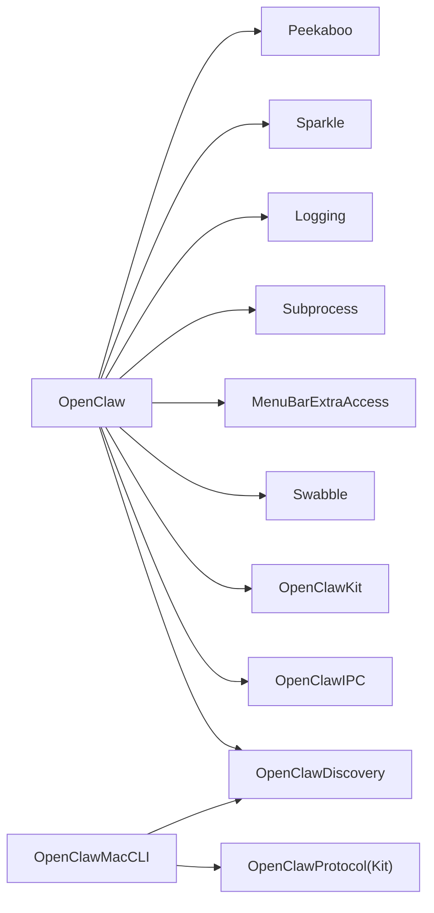

# 桌面客户端

<cite>
**本文引用的文件**
- [apps/macos/README.md](file://apps/macos/README.md)
- [apps/macos/Package.swift](file://apps/macos/Package.swift)
- [apps/macos/Sources/OpenClaw/Resources/Info.plist](file://apps/macos/Sources/OpenClaw/Resources/Info.plist)
- [apps/macos/Sources/OpenClawMacCLI/EntryPoint.swift](file://apps/macos/Sources/OpenClawMacCLI/EntryPoint.swift)
- [apps/macos/Sources/OpenClawMacCLI/ConnectCommand.swift](file://apps/macos/Sources/OpenClawMacCLI/ConnectCommand.swift)
- [apps/macos/Sources/OpenClawMacCLI/DiscoverCommand.swift](file://apps/macos/Sources/OpenClawMacCLI/DiscoverCommand.swift)
- [apps/shared/OpenClawKit/Package.swift](file://apps/shared/OpenClawKit/Package.swift)
- [docs/gateway/index.md](file://docs/gateway/index.md)
- [docs/platforms/macos.md](file://docs/platforms/macos.md)
- [docs/platforms/linux.md](file://docs/platforms/linux.md)
- [docs/platforms/windows.md](file://docs/platforms/windows.md)
- [scripts/package-mac-app.sh](file://scripts/package-mac-app.sh)
- [scripts/codesign-mac-app.sh](file://scripts/codesign-mac-app.sh)
- [scripts/restart-mac.sh](file://scripts/restart-mac.sh)
</cite>

## 目录
1. [简介](#简介)
2. [项目结构](#项目结构)
3. [核心组件](#核心组件)
4. [架构总览](#架构总览)
5. [详细组件分析](#详细组件分析)
6. [依赖关系分析](#依赖关系分析)
7. [性能考量](#性能考量)
8. [故障排查指南](#故障排查指南)
9. [结论](#结论)
10. [附录](#附录)

## 简介
本文件面向桌面客户端（主要为 macOS）的实现与使用，覆盖跨平台兼容性、原生功能集成、系统权限处理、与网关的通信机制、本地服务发现与远程连接配置，并提供各平台的开发环境搭建、打包发布与用户部署指南。当前仓库中未包含 Windows/Linux 原生桌面应用，但提供了在 Windows 上通过 WSL2 使用 CLI 的完整流程以及 Linux 的 Gateway 运行与服务管理方法；同时，仓库规划了未来在 Windows 与 Linux 平台开发原生桌面应用。

## 项目结构
桌面客户端相关的核心位置集中在 apps/macos 与 apps/shared/OpenClawKit，前者包含菜单栏应用与 CLI 工具，后者提供跨平台协议与 UI 组件库。网关运行与操作文档位于 docs/gateway 与 docs/platforms。

图表来源
- [apps/macos/Package.swift:26-78](file://apps/macos/Package.swift#L26-L78)
- [apps/shared/OpenClawKit/Package.swift:20-52](file://apps/shared/OpenClawKit/Package.swift#L20-L52)

章节来源
- [apps/macos/Package.swift:1-93](file://apps/macos/Package.swift#L1-L93)
- [apps/shared/OpenClawKit/Package.swift:1-62](file://apps/shared/OpenClawKit/Package.swift#L1-L62)

## 核心组件
- OpenClaw（菜单栏应用）
  - 作为 macOS 菜单栏常驻应用，负责权限管理、通知、屏幕录制、摄像头、麦克风、自动化等系统能力的调用与代理。
  - 通过 IPC 与本地节点服务交互，支持 system.run 等高权限操作。
- OpenClawIPC
  - 提供与本地节点服务通信的 IPC 能力，用于安全地执行受限命令与传递上下文。
- OpenClawDiscovery
  - 封装本地服务发现逻辑，支持通过 NWBrowser 与 DNS-SD 回退策略发现网关实例。
- OpenClawMacCLI
  - 提供命令行工具，支持 discover/connect 等诊断与连接能力，便于脱离 GUI 验证网关连通性。
- OpenClawKit
  - 跨平台协议与 UI 组件库，为 macOS/iOS 共享协议定义与聊天 UI 提供基础。

章节来源
- [apps/macos/Package.swift:26-78](file://apps/macos/Package.swift#L26-L78)
- [apps/shared/OpenClawKit/Package.swift:20-52](file://apps/shared/OpenClawKit/Package.swift#L20-L52)

## 架构总览
桌面客户端与网关之间的交互采用统一的 WebSocket 协议，桌面端负责：
- 本地服务发现（NWBrowser + DNS-SD 回退）
- 远程模式下的 SSH 隧道复用
- 本地模式下直接连接本地 Gateway
- 通过 IPC 执行需要系统权限的操作（如 system.run）

图表来源
- [apps/macos/Sources/OpenClawMacCLI/DiscoverCommand.swift](file://apps/macos/Sources/OpenClawMacCLI/DiscoverCommand.swift)
- [apps/macos/Sources/OpenClawMacCLI/ConnectCommand.swift](file://apps/macos/Sources/OpenClawMacCLI/ConnectCommand.swift)
- [docs/gateway/index.md:202-214](file://docs/gateway/index.md#L202-L214)

章节来源
- [docs/platforms/macos.md:165-198](file://docs/platforms/macos.md#L165-L198)
- [docs/gateway/index.md:27-61](file://docs/gateway/index.md#L27-L61)

## 详细组件分析

### macOS 菜单栏应用与权限
- 权限与用途
  - 通知、屏幕录制、摄像头、麦克风、语音识别、自动化（AppleScript）、位置信息等。
- 启动与打包
  - 开发运行：通过脚本快速重启应用与签名选项。
  - 打包：生成并签名 .app 包，支持团队 ID 审计与库验证绕过（仅限开发）。
- Info.plist 关键项
  - Bundle 标识、版本、最小系统版本、LSUIElement（菜单栏元素）、URL Scheme（深链）、权限描述、App Transport Security 等。

图表来源
- [apps/macos/Sources/OpenClaw/Resources/Info.plist:23-64](file://apps/macos/Sources/OpenClaw/Resources/Info.plist#L23-L64)
- [apps/macos/README.md:17-23](file://apps/macos/README.md#L17-L23)

章节来源
- [apps/macos/Sources/OpenClaw/Resources/Info.plist:1-82](file://apps/macos/Sources/OpenClaw/Resources/Info.plist#L1-L82)
- [apps/macos/README.md:1-65](file://apps/macos/README.md#L1-L65)

### OpenClawMacCLI：连接与发现
- DiscoverCommand
  - 支持超时、包含本地过滤、JSON 输出，便于自动化比对。
- ConnectCommand
  - 支持指定 URL、模式（local/remote）、探测、超时、JSON 输出。
- EntryPoint
  - 统一入口，组织参数解析与子命令分派。

图表来源
- [apps/macos/Sources/OpenClawMacCLI/EntryPoint.swift](file://apps/macos/Sources/OpenClawMacCLI/EntryPoint.swift)
- [apps/macos/Sources/OpenClawMacCLI/DiscoverCommand.swift](file://apps/macos/Sources/OpenClawMacCLI/DiscoverCommand.swift)
- [apps/macos/Sources/OpenClawMacCLI/ConnectCommand.swift](file://apps/macos/Sources/OpenClawMacCLI/ConnectCommand.swift)

章节来源
- [apps/macos/Sources/OpenClawMacCLI/EntryPoint.swift](file://apps/macos/Sources/OpenClawMacCLI/EntryPoint.swift)
- [apps/macos/Sources/OpenClawMacCLI/DiscoverCommand.swift](file://apps/macos/Sources/OpenClawMacCLI/DiscoverCommand.swift)
- [apps/macos/Sources/OpenClawMacCLI/ConnectCommand.swift](file://apps/macos/Sources/OpenClawMacCLI/ConnectCommand.swift)

### 网关通信与协议
- 运行模型
  - 单进程路由/控制平面/通道连接，多路复用同一端口的 WebSocket 控制/RPC、HTTP API（OpenAI 兼容、工具调用等）、控制 UI 与钩子。
  - 默认绑定回环地址，需认证（token/password）。
- 远程访问
  - 推荐 Tailscale/VPN，回退 SSH 隧道；隧道内仍需正确认证。
- 协议要点
  - 客户端首帧必须为 connect；网关返回 hello-ok 快照；请求格式 req(method, params) → res(ok/payload|error)；常见事件包括 connect.challenge、agent、chat、presence、tick、health、heartbeat、shutdown。

图表来源
- [docs/gateway/index.md:76-123](file://docs/gateway/index.md#L76-L123)
- [docs/gateway/index.md:202-214](file://docs/gateway/index.md#L202-L214)

章节来源
- [docs/gateway/index.md:27-123](file://docs/gateway/index.md#L27-L123)
- [docs/gateway/index.md:202-214](file://docs/gateway/index.md#L202-L214)

### 本地服务发现与远程连接
- 本地发现
  - NWBrowser 优先，DNS-SD 回退；可通过 CLI 对比差异。
- 远程模式
  - 保持稳定的本地端口转发，复用健康隧道或按需重启；SSH 批处理与退出即停配置确保稳定性；隧道内 IP 报告为 127.0.0.1，若需真实 IP 可选择直连传输。
- 深链（Deep Link）
  - 注册 openclaw:// URL Scheme，支持无头模式密钥触发无人值守运行。

章节来源
- [docs/platforms/macos.md:171-219](file://docs/platforms/macos.md#L171-L219)
- [docs/platforms/macos.md:112-138](file://docs/platforms/macos.md#L112-L138)

### 跨平台兼容性与系统权限
- macOS
  - 菜单栏应用 + 权限弹窗（TCC）；LaunchAgent 管理；PeekabooBridge 可选；system.run 通过 IPC 在 UI/TCC 上下文中执行。
- Linux
  - Gateway 完全支持；推荐 Node 作为运行时；systemd 用户服务默认安装；Windows 建议通过 WSL2 使用。
- Windows
  - 原生桌面应用尚未实现，建议通过 WSL2 使用 CLI；Windows 端 CLI 正在改进，部分本地 CLI 功能可用。

章节来源
- [docs/platforms/macos.md:1-227](file://docs/platforms/macos.md#L1-L227)
- [docs/platforms/linux.md:1-95](file://docs/platforms/linux.md#L1-L95)
- [docs/platforms/windows.md:1-242](file://docs/platforms/windows.md#L1-L242)

## 依赖关系分析
- 组件耦合
  - OpenClaw 依赖 OpenClawIPC、OpenClawDiscovery、OpenClawKit、Swabble、MenuBarExtraAccess、Subprocess、Logging、Sparkle、Peekaboo。
  - OpenClawMacCLI 依赖 Discovery 与 OpenClawKit/Protocol。
  - OpenClawKit 提供协议与 UI 组件，被 macOS/iOS 共享。
- 外部依赖
  - Sparkle（更新）、Peekaboo（UI 自动化桥接）、MenuBarExtraAccess（菜单栏扩展）、swift-log（日志）、swift-subprocess（子进程）。

图表来源
- [apps/macos/Package.swift:42-57](file://apps/macos/Package.swift#L42-L57)
- [apps/macos/Package.swift:68-76](file://apps/macos/Package.swift#L68-L76)
- [apps/shared/OpenClawKit/Package.swift:20-52](file://apps/shared/OpenClawKit/Package.swift#L20-L52)

章节来源
- [apps/macos/Package.swift:1-93](file://apps/macos/Package.swift#L1-L93)
- [apps/shared/OpenClawKit/Package.swift:1-62](file://apps/shared/OpenClawKit/Package.swift#L1-L62)

## 性能考量
- 本地发现
  - NWBrowser 优先可降低延迟；DNS-SD 回退保证可达性。
- 隧道复用
  - 复用健康隧道减少握手与重建成本；SSH 批处理与 keepalive 保障稳定。
- IPC 与权限
  - system.run 通过 IPC 在 UI/TCC 上下文执行，避免频繁弹窗；执行审批策略（deny/allowlist/ask）减少误操作风险。
- 打包与签名
  - 开发阶段可启用库验证绕过（禁用库验证），但发布构建应关闭以满足系统策略。

章节来源
- [apps/macos/README.md:47-56](file://apps/macos/README.md#L47-L56)
- [docs/platforms/macos.md:200-219](file://docs/platforms/macos.md#L200-L219)

## 故障排查指南
- 网关健康检查
  - 使用 openclaw gateway status、channels status --probe、logs --follow 等命令进行健康与通道检查。
- 连接问题
  - 确认认证（token/password）与绑定模式；检查端口占用与非回环绑定的认证要求。
- 本地发现差异
  - 对比 openclaw-mac discover 与 openclaw gateway discover 的输出，定位网络发现差异。
- macOS 特定
  - 深链参数校验与无人值守密钥；LaunchAgent 标签与 kickstart/bootout 操作；Team ID 审计失败时的签名策略。

章节来源
- [docs/gateway/index.md:27-61](file://docs/gateway/index.md#L27-L61)
- [docs/gateway/index.md:235-244](file://docs/gateway/index.md#L235-L244)
- [docs/platforms/macos.md:171-198](file://docs/platforms/macos.md#L171-L198)
- [apps/macos/README.md:37-45](file://apps/macos/README.md#L37-L45)

## 结论
本仓库的桌面客户端以 macOS 为核心，通过菜单栏应用与 CLI 工具实现与网关的稳定连接、本地服务发现与远程隧道复用，并以 IPC 安全地执行需要系统权限的操作。Linux 与 Windows 当前以 CLI 与 WSL2 流程为主，未来计划开发原生桌面应用。整体设计强调安全性（权限弹窗、执行审批）、可观测性（健康检查、日志）、可维护性（LaunchAgent/systemd、服务生命周期）与跨平台一致性（共享协议库）。

## 附录

### 开发环境搭建（macOS）
- 快速运行
  - 使用脚本一键重启应用，支持跳过签名或强制签名。
- 打包与签名
  - 生成并签名 .app 包；自动校验嵌入二进制的 Team ID；开发可禁用库验证。
- 常用环境变量
  - 签名身份、允许临时签名、时间戳离线调试、禁用库验证、跳过 Team ID 审计等。

章节来源
- [apps/macos/README.md:3-65](file://apps/macos/README.md#L3-L65)
- [scripts/package-mac-app.sh](file://scripts/package-mac-app.sh)
- [scripts/codesign-mac-app.sh](file://scripts/codesign-mac-app.sh)
- [scripts/restart-mac.sh](file://scripts/restart-mac.sh)

### 打包发布与用户部署
- macOS
  - 通过脚本打包并签名 .app；LaunchAgent 管理服务；支持无人值守深链触发。
- Linux
  - 默认安装 systemd 用户服务；必要时启用持久化登录（linger）；system 服务适用于共享主机。
- Windows（WSL2）
  - 推荐通过 WSL2 使用 CLI；Windows 端 CLI 正在改进；Scheduled Tasks 优先但可回退到启动项。

章节来源
- [docs/platforms/macos.md:130-169](file://docs/platforms/macos.md#L130-L169)
- [docs/platforms/linux.md:65-95](file://docs/platforms/linux.md#L65-L95)
- [docs/platforms/windows.md:47-62](file://docs/platforms/windows.md#L47-L62)