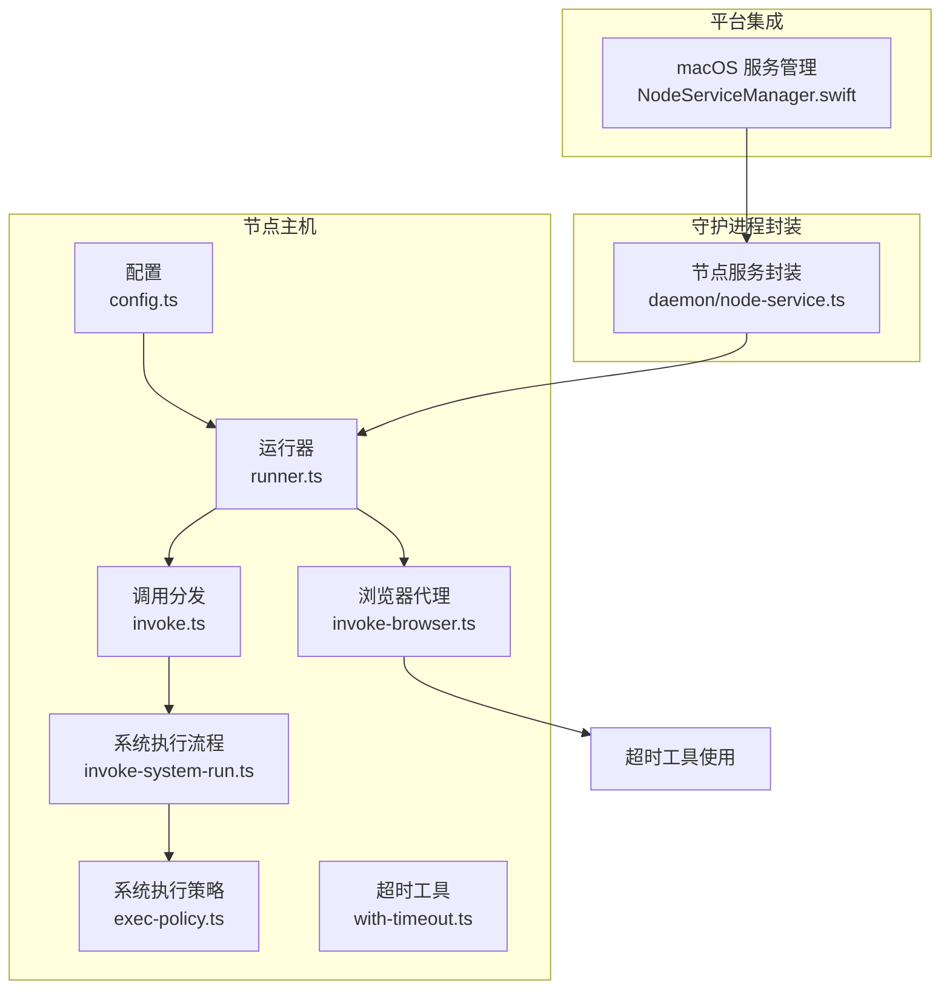
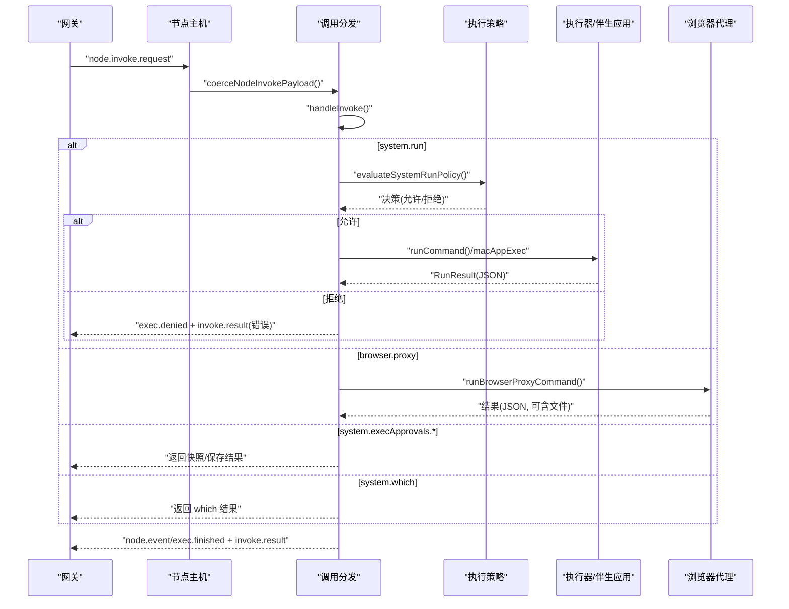
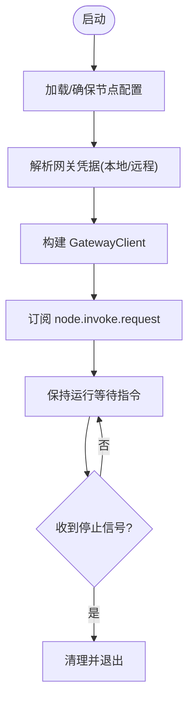
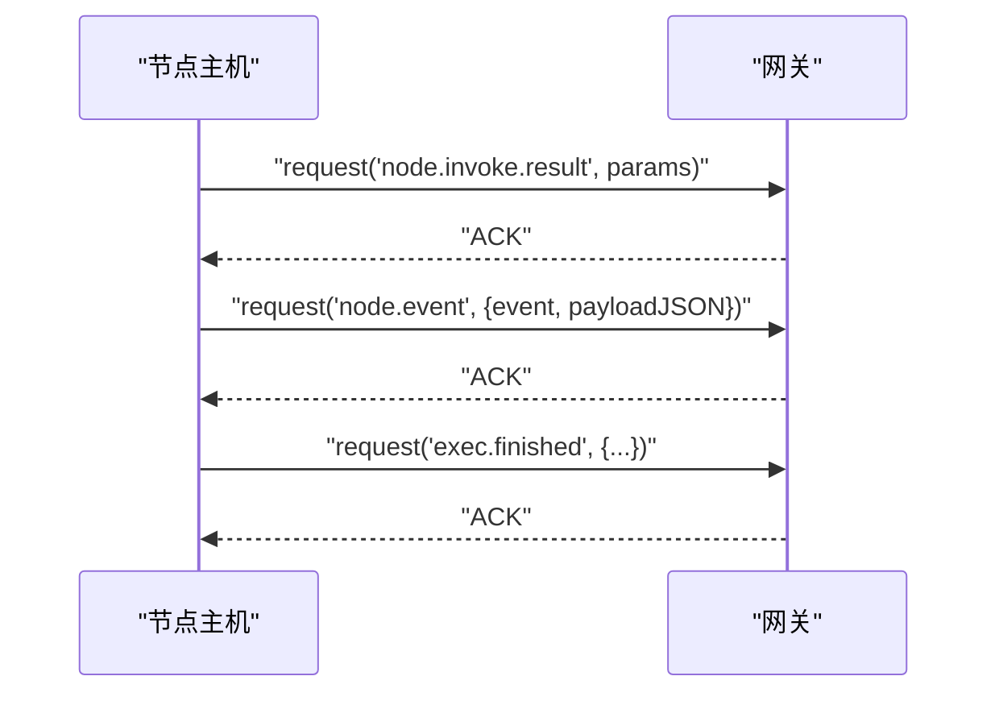
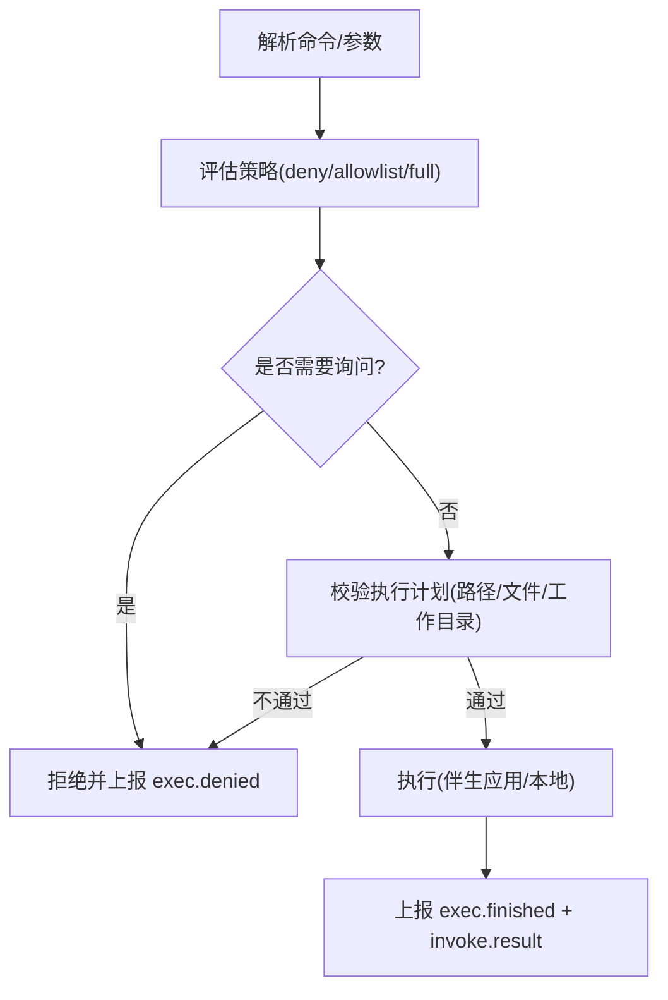
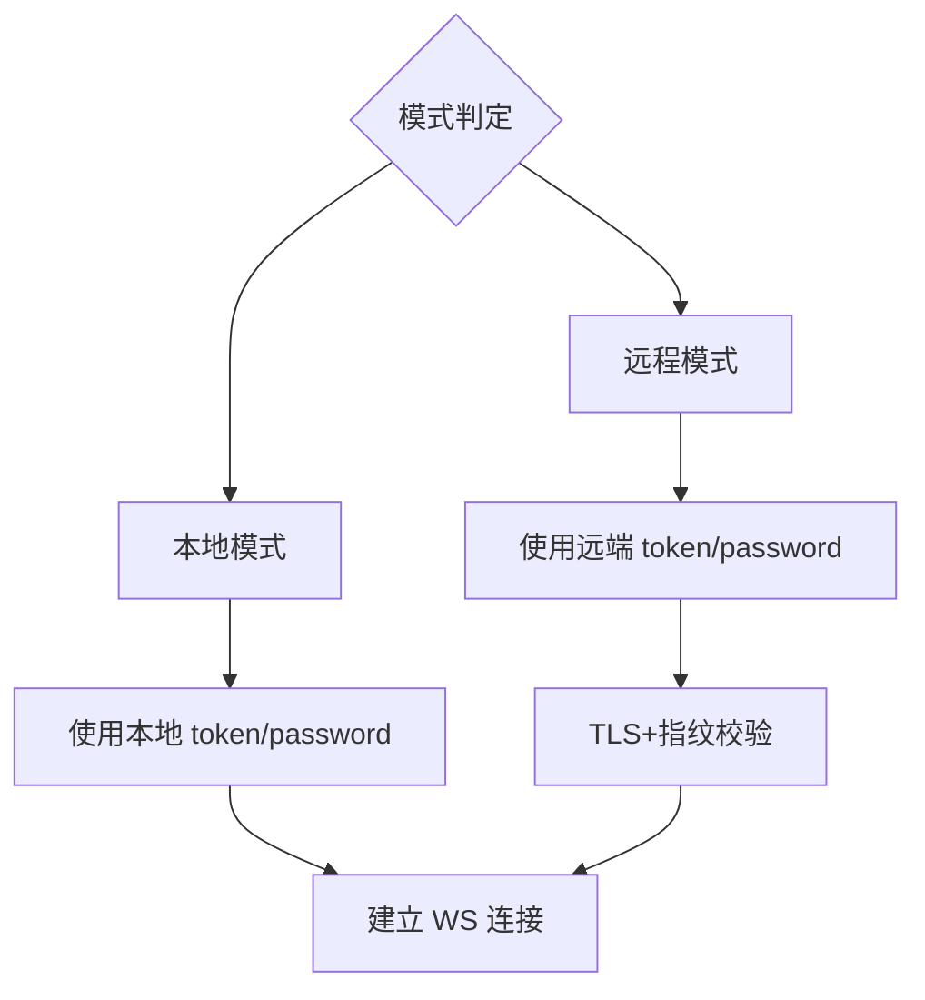
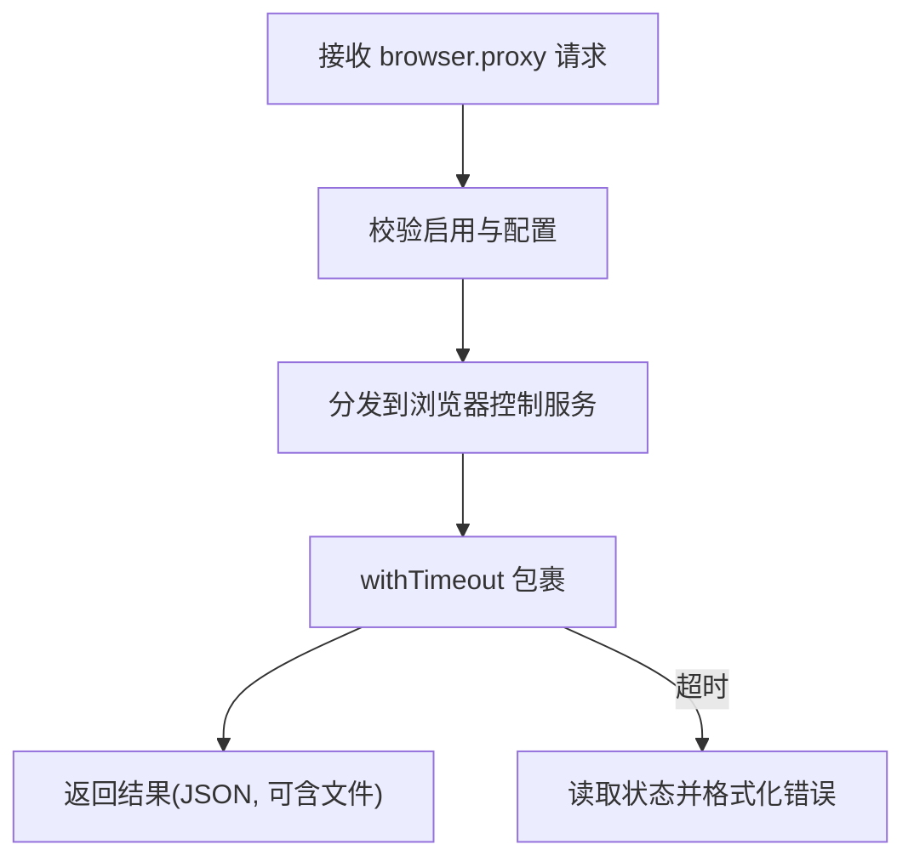
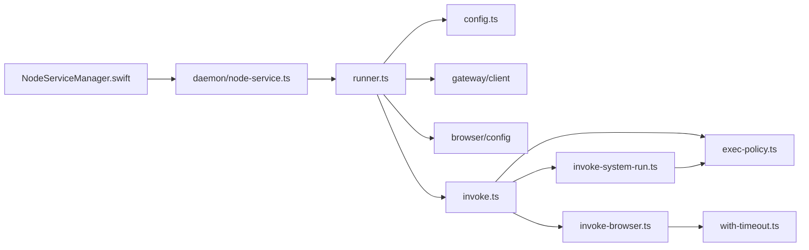

# 节点主机服务

<cite>
**本文引用的文件**
- [src/node-host/config.ts](file://src/node-host/config.ts)
- [src/node-host/runner.ts](file://src/node-host/runner.ts)
- [src/node-host/invoke.ts](file://src/node-host/invoke.ts)
- [src/node-host/invoke-system-run.ts](file://src/node-host/invoke-system-run.ts)
- [src/node-host/invoke-browser.ts](file://src/node-host/invoke-browser.ts)
- [src/node-host/exec-policy.ts](file://src/node-host/exec-policy.ts)
- [src/node-host/with-timeout.ts](file://src/node-host/with-timeout.ts)
- [src/daemon/node-service.ts](file://src/daemon/node-service.ts)
- [apps/macos/Sources/OpenClaw/NodeServiceManager.swift](file://apps/macos/Sources/OpenClaw/NodeServiceManager.swift)
- [src/config/types.node-host.ts](file://src/config/types.node-host.ts)
</cite>

## 目录
1. [简介](#简介)
2. [项目结构](#项目结构)
3. [核心组件](#核心组件)
4. [架构总览](#架构总览)
5. [详细组件分析](#详细组件分析)
6. [依赖关系分析](#依赖关系分析)
7. [性能考量](#性能考量)
8. [故障排除指南](#故障排除指南)
9. [结论](#结论)
10. [附录](#附录)

## 简介
本文件系统性阐述“节点主机服务”的架构与实现，覆盖进程管理、IPC 通信、权限控制与生命周期管理；对比本地模式与远程模式差异；解释 SSH 隧道与端口转发在远程场景中的作用；详述安全模型、访问控制与审计日志；并提供服务配置、监控指标与故障排除的实用指南。

## 项目结构
节点主机服务由以下关键模块组成：
- 运行时与生命周期：负责启动、连接网关、事件分发与持久化配置
- 命令执行与策略：解析命令、评估执行策略、执行系统调用或通过伴生应用执行
- 浏览器代理：在受控环境下代理浏览器操作，支持超时与文件回传
- 守护进程封装：为不同平台注入服务环境变量并统一安装/卸载/重启等操作
- 平台集成：macOS 上通过 Swift 封装对系统服务的启停

**图表来源**
- [src/node-host/config.ts:1-67](file://src/node-host/config.ts#L1-L67)
- [src/node-host/runner.ts:1-230](file://src/node-host/runner.ts#L1-L230)
- [src/node-host/invoke.ts:1-661](file://src/node-host/invoke.ts#L1-L661)
- [src/node-host/invoke-system-run.ts:1-569](file://src/node-host/invoke-system-run.ts#L1-L569)
- [src/node-host/invoke-browser.ts:1-339](file://src/node-host/invoke-browser.ts#L1-L339)
- [src/node-host/exec-policy.ts:1-135](file://src/node-host/exec-policy.ts#L1-L135)
- [src/node-host/with-timeout.ts:1-36](file://src/node-host/with-timeout.ts#L1-L36)
- [src/daemon/node-service.ts:1-67](file://src/daemon/node-service.ts#L1-L67)
- [apps/macos/Sources/OpenClaw/NodeServiceManager.swift:1-48](file://apps/macos/Sources/OpenClaw/NodeServiceManager.swift#L1-L48)

**章节来源**
- [src/node-host/config.ts:1-67](file://src/node-host/config.ts#L1-L67)
- [src/node-host/runner.ts:1-230](file://src/node-host/runner.ts#L1-L230)
- [src/node-host/invoke.ts:1-661](file://src/node-host/invoke.ts#L1-L661)
- [src/node-host/invoke-system-run.ts:1-569](file://src/node-host/invoke-system-run.ts#L1-L569)
- [src/node-host/invoke-browser.ts:1-339](file://src/node-host/invoke-browser.ts#L1-L339)
- [src/node-host/exec-policy.ts:1-135](file://src/node-host/exec-policy.ts#L1-L135)
- [src/node-host/with-timeout.ts:1-36](file://src/node-host/with-timeout.ts#L1-L36)
- [src/daemon/node-service.ts:1-67](file://src/daemon/node-service.ts#L1-L67)
- [apps/macos/Sources/OpenClaw/NodeServiceManager.swift:1-48](file://apps/macos/Sources/OpenClaw/NodeServiceManager.swift#L1-L48)

## 核心组件
- 配置管理（config.ts）
  - 维护节点标识、显示名、网关地址与 TLS 指纹等信息，并以原子方式写入
  - 默认值生成与校验，确保节点唯一性
- 运行器（runner.ts）
  - 解析并注入 PATH、设备身份、浏览器代理能力开关
  - 构建 GatewayClient，订阅 node.invoke.request 事件并派发到 invoke 分发器
  - 支持本地/远程模式凭据解析与 TLS 参数传递
- 调用分发（invoke.ts）
  - 支持 system.run、system.execApprovals.*、system.which、browser.proxy 等命令
  - 输出截断、编码解码、错误包装与事件上报
- 系统执行策略（exec-policy.ts + invoke-system-run.ts）
  - 安全级别（deny/allowlist/full）、询问策略（off/on-miss/always）、白名单匹配与计划校验
  - Windows Shell 包装器阻断、伴生应用执行回退、屏幕录制权限检查
- 浏览器代理（invoke-browser.ts）
  - 受控浏览器操作路由、超时控制、文件读取与 MIME 推断、状态诊断
- 守护进程封装（daemon/node-service.ts）
  - 为不同平台注入服务标记、类型、标签/单元名、任务脚本名等环境变量
  - 提供 install/uninstall/stop/restart/isLoaded/readCommand/readRuntime 的统一入口
- 平台集成（NodeServiceManager.swift）
  - macOS 上通过命令行调用 openclaw node start/stop，并记录错误日志

**章节来源**
- [src/node-host/config.ts:1-67](file://src/node-host/config.ts#L1-L67)
- [src/node-host/runner.ts:144-229](file://src/node-host/runner.ts#L144-L229)
- [src/node-host/invoke.ts:417-556](file://src/node-host/invoke.ts#L417-L556)
- [src/node-host/exec-policy.ts:52-134](file://src/node-host/exec-policy.ts#L52-L134)
- [src/node-host/invoke-system-run.ts:558-568](file://src/node-host/invoke-system-run.ts#L558-L568)
- [src/node-host/invoke-browser.ts:210-338](file://src/node-host/invoke-browser.ts#L210-L338)
- [src/daemon/node-service.ts:44-66](file://src/daemon/node-service.ts#L44-L66)
- [apps/macos/Sources/OpenClaw/NodeServiceManager.swift:7-29](file://apps/macos/Sources/OpenClaw/NodeServiceManager.swift#L7-L29)

## 架构总览
节点主机服务采用“客户端-服务端”模式：节点主机作为 WebSocket 客户端连接网关，接收指令后在本地执行或通过伴生应用执行，并将结果与事件回传。

**图表来源**
- [src/node-host/runner.ts:200-219](file://src/node-host/runner.ts#L200-L219)
- [src/node-host/invoke.ts:417-556](file://src/node-host/invoke.ts#L417-L556)
- [src/node-host/invoke-system-run.ts:396-556](file://src/node-host/invoke-system-run.ts#L396-L556)
- [src/node-host/invoke-browser.ts:210-338](file://src/node-host/invoke-browser.ts#L210-L338)

## 详细组件分析

### 进程管理与生命周期
- 启动流程
  - 读取并确保节点配置（含节点 ID、显示名、网关参数）
  - 解析浏览器代理能力与网关凭据（本地/远程模式）
  - 构造 GatewayClient，设置 capabilities、commands、TLS 指纹等
  - 订阅 node.invoke.request 事件，派发到 handleInvoke
  - 启动后保持运行，等待指令
- 关闭与重试
  - 连接失败与关闭事件会输出日志，客户端内部持续重试
- 平台守护进程
  - 通过 resolveNodeService 注入平台特定环境变量（launchd/systemd/windows）
  - 提供 install/uninstall/stop/restart/isLoaded/readCommand/readRuntime

**图表来源**
- [src/node-host/runner.ts:144-229](file://src/node-host/runner.ts#L144-L229)
- [src/daemon/node-service.ts:44-66](file://src/daemon/node-service.ts#L44-L66)

**章节来源**
- [src/node-host/runner.ts:144-229](file://src/node-host/runner.ts#L144-L229)
- [src/daemon/node-service.ts:12-66](file://src/daemon/node-service.ts#L12-L66)

### IPC 通信与事件模型
- 请求/响应
  - 节点主机通过 GatewayClient.request 发送 node.invoke.result
  - 最终结果与事件（exec.finished、exec.denied、node.event）异步上报
- 事件流
  - onEvent 中仅处理 node.invoke.request，其余事件忽略
  - 执行过程中的事件通过 sendNodeEvent 异步发送，不阻塞主流程

**图表来源**
- [src/node-host/invoke.ts:594-660](file://src/node-host/invoke.ts#L594-L660)
- [src/node-host/runner.ts:200-219](file://src/node-host/runner.ts#L200-L219)

**章节来源**
- [src/node-host/invoke.ts:594-660](file://src/node-host/invoke.ts#L594-L660)
- [src/node-host/runner.ts:200-219](file://src/node-host/runner.ts#L200-L219)

### 权限控制与安全模型
- 安全级别
  - deny：完全禁用
  - allowlist：仅白名单命令允许，Shell 包装器默认阻断
  - full：宽松模式
- 询问策略
  - off：不提示
  - on-miss：白名单缺失时提示
  - always：每次均提示
- 白名单与计划校验
  - 对 argv/segments 进行分析，结合 cwd/env/skillBins 自动放行
  - 执行前对计划进行严格校验，防止路径漂移与可变操作数变更
- 伴生应用执行
  - macOS 下优先走伴生应用执行，失败时可回退至本地执行
  - 屏幕录制权限缺失直接拒绝
- 环境与输出
  - 严格清洗环境变量，限制 PATH 修改
  - 输出截断与编码解码，避免过大负载与乱码问题

**图表来源**
- [src/node-host/exec-policy.ts:52-134](file://src/node-host/exec-policy.ts#L52-L134)
- [src/node-host/invoke-system-run.ts:272-556](file://src/node-host/invoke-system-run.ts#L272-L556)

**章节来源**
- [src/node-host/exec-policy.ts:1-135](file://src/node-host/exec-policy.ts#L1-L135)
- [src/node-host/invoke-system-run.ts:1-569](file://src/node-host/invoke-system-run.ts#L1-L569)

### 本地模式与远程模式
- 本地模式
  - 节点主机直接使用本地凭据（token/password），不继承远端配置
  - 禁止从远端继承 token/password，避免本地 token 不匹配
- 远程模式
  - 使用远端凭据，支持 TLS 与指纹校验
  - 通过网关进行指令下发与结果回传

**图表来源**
- [src/node-host/runner.ts:112-142](file://src/node-host/runner.ts#L112-L142)

**章节来源**
- [src/node-host/runner.ts:112-142](file://src/node-host/runner.ts#L112-L142)

### SSH 隧道、端口转发与网络连接
- 远程模式下，节点主机通过网关建立 WebSocket 连接，无需直接暴露本地端口
- 端口转发与隧道通常由网关侧或基础设施层处理，节点主机仅感知已建立的连接
- TLS 指纹用于防止中间人攻击，确保连接完整性

**章节来源**
- [src/node-host/runner.ts:154-175](file://src/node-host/runner.ts#L154-L175)

### 浏览器代理与超时控制
- 受控代理
  - 仅允许白名单路径与方法，支持查询参数与请求体
  - 文件读取限制大小，自动检测 MIME 类型
- 超时与诊断
  - 统一超时控制，超时会读取浏览器状态并格式化诊断信息
  - 对 ws-backed 路径（如截图/PDF）提供更详细的诊断

**图表来源**
- [src/node-host/invoke-browser.ts:210-338](file://src/node-host/invoke-browser.ts#L210-L338)
- [src/node-host/with-timeout.ts:1-36](file://src/node-host/with-timeout.ts#L1-L36)

**章节来源**
- [src/node-host/invoke-browser.ts:1-339](file://src/node-host/invoke-browser.ts#L1-L339)
- [src/node-host/with-timeout.ts:1-36](file://src/node-host/with-timeout.ts#L1-L36)

### 平台集成（macOS）
- 通过 NodeServiceManager.swift 调用 openclaw node start/stop
- 记录错误日志，便于排障

**章节来源**
- [apps/macos/Sources/OpenClaw/NodeServiceManager.swift:7-29](file://apps/macos/Sources/OpenClaw/NodeServiceManager.swift#L7-L29)

## 依赖关系分析
- 模块耦合
  - runner.ts 依赖 config.ts、gateway/client、browser/config、infra/* 等
  - invoke.ts 依赖 gateway/client、infra/exec-approvals、infra/exec-host、node-host/* 子模块
  - invoke-system-run.ts 依赖 exec-policy.ts、infra/system-run-*、infra/exec-approvals
  - invoke-browser.ts 依赖 browser/*、media/mime、with-timeout.ts
  - daemon/node-service.ts 依赖 constants/service 与平台特定名称解析
- 外部依赖
  - WebSocket 客户端（GatewayClient）
  - 伴生应用执行接口（macOS）
  - 文件系统与子进程执行

**图表来源**
- [src/node-host/runner.ts:1-230](file://src/node-host/runner.ts#L1-L230)
- [src/node-host/invoke.ts:1-661](file://src/node-host/invoke.ts#L1-L661)
- [src/node-host/invoke-system-run.ts:1-569](file://src/node-host/invoke-system-run.ts#L1-L569)
- [src/node-host/invoke-browser.ts:1-339](file://src/node-host/invoke-browser.ts#L1-L339)
- [src/node-host/exec-policy.ts:1-135](file://src/node-host/exec-policy.ts#L1-L135)
- [src/node-host/with-timeout.ts:1-36](file://src/node-host/with-timeout.ts#L1-L36)
- [src/daemon/node-service.ts:1-67](file://src/daemon/node-service.ts#L1-L67)
- [apps/macos/Sources/OpenClaw/NodeServiceManager.swift:1-48](file://apps/macos/Sources/OpenClaw/NodeServiceManager.swift#L1-L48)

**章节来源**
- [src/node-host/runner.ts:1-230](file://src/node-host/runner.ts#L1-L230)
- [src/node-host/invoke.ts:1-661](file://src/node-host/invoke.ts#L1-L661)
- [src/node-host/invoke-system-run.ts:1-569](file://src/node-host/invoke-system-run.ts#L1-L569)
- [src/node-host/invoke-browser.ts:1-339](file://src/node-host/invoke-browser.ts#L1-L339)
- [src/node-host/exec-policy.ts:1-135](file://src/node-host/exec-policy.ts#L1-L135)
- [src/node-host/with-timeout.ts:1-36](file://src/node-host/with-timeout.ts#L1-L36)
- [src/daemon/node-service.ts:1-67](file://src/daemon/node-service.ts#L1-L67)
- [apps/macos/Sources/OpenClaw/NodeServiceManager.swift:1-48](file://apps/macos/Sources/OpenClaw/NodeServiceManager.swift#L1-L48)

## 性能考量
- 输出截断与编码
  - 对 stdout/stderr 进行容量限制与尾部截断，避免大输出拖慢通信
  - Windows 控制台编码动态探测与解码，减少乱码与额外转换成本
- 超时控制
  - 统一超时机制，避免长时间阻塞导致资源占用
- 白名单命中优化
  - 命中白名单时记录使用情况，有助于后续自动放行与降低策略开销
- 伴生应用执行
  - 在 macOS 上优先使用伴生应用，减少沙箱外交互与系统调用成本

**章节来源**
- [src/node-host/invoke.ts:32-163](file://src/node-host/invoke.ts#L32-L163)
- [src/node-host/invoke-system-run.ts:506-521](file://src/node-host/invoke-system-run.ts#L506-L521)
- [src/node-host/invoke-browser.ts:125-133](file://src/node-host/invoke-browser.ts#L125-L133)

## 故障排除指南
- 连接失败/关闭
  - 观察 onConnectError/onClose 日志，确认网关可达性、凭据正确性与 TLS 指纹
- 执行被拒
  - 查看策略决策原因（security=deny/approval-required/allowlist-miss）
  - 若为 Windows Shell 包装器阻断，按提示进行一次性/永久放行或使用 --ask
  - 若为计划不匹配，检查 argv/cwd/env 是否发生漂移
- 伴生应用不可用
  - macOS 下若强制要求伴生应用且不可达，将被拒绝；可关闭强制或修复伴生应用
- 浏览器代理超时
  - 检查浏览器状态（CDP HTTP/WS、URL、传输），定位卡顿或无响应
  - 缩短超时或优化目标页面复杂度
- 配置问题
  - 确认节点配置文件存在且权限为 0600，节点 ID 自动生成但可手动指定
  - 本地模式不要混用远端凭据，避免 token 不一致

**章节来源**
- [src/node-host/runner.ts:210-218](file://src/node-host/runner.ts#L210-L218)
- [src/node-host/invoke-system-run.ts:157-184](file://src/node-host/invoke-system-run.ts#L157-L184)
- [src/node-host/invoke-system-run.ts:470-487](file://src/node-host/invoke-system-run.ts#L470-L487)
- [src/node-host/invoke-browser.ts:178-208](file://src/node-host/invoke-browser.ts#L178-L208)
- [src/node-host/config.ts:56-59](file://src/node-host/config.ts#L56-L59)

## 结论
节点主机服务通过清晰的模块划分与严格的策略控制，在保证安全性的同时提供了强大的系统执行与浏览器代理能力。其生命周期管理、IPC 通信与跨平台守护进程封装完善，适配本地与远程两种模式，并具备完善的超时与诊断机制，便于运维与排障。

## 附录

### 服务配置参考
- 节点主机配置项（示例）
  - browserProxy.enabled：是否启用浏览器代理（默认开启）
  - browserProxy.allowProfiles：允许通过代理访问的浏览器配置文件名列表（可选）

**章节来源**
- [src/config/types.node-host.ts:1-12](file://src/config/types.node-host.ts#L1-L12)