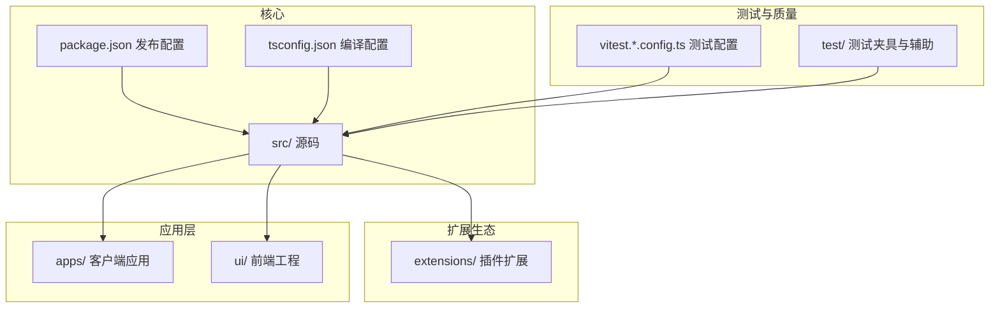
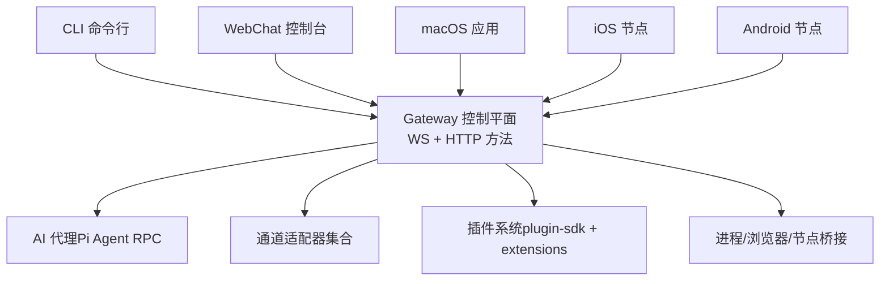
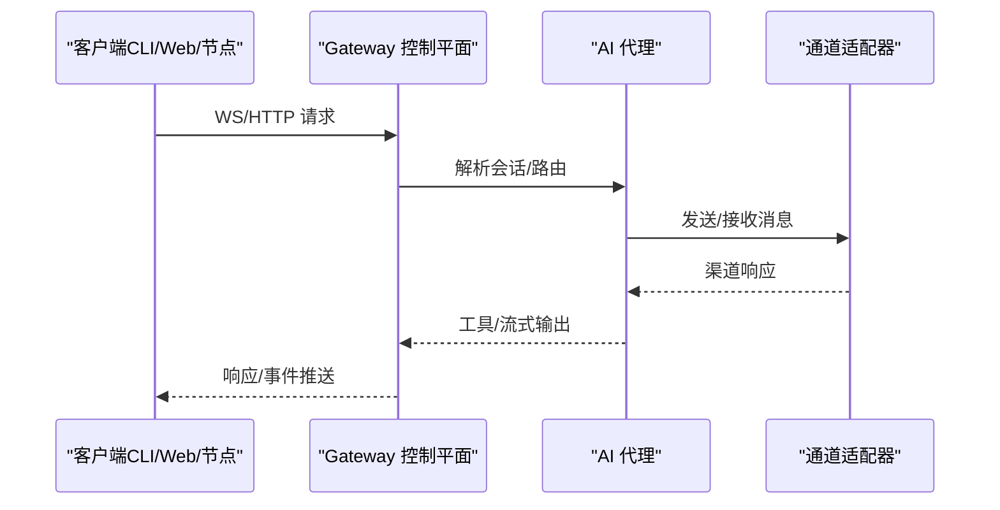
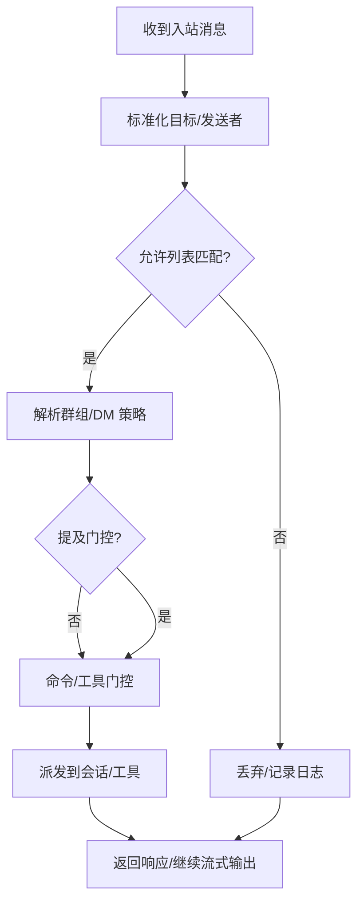
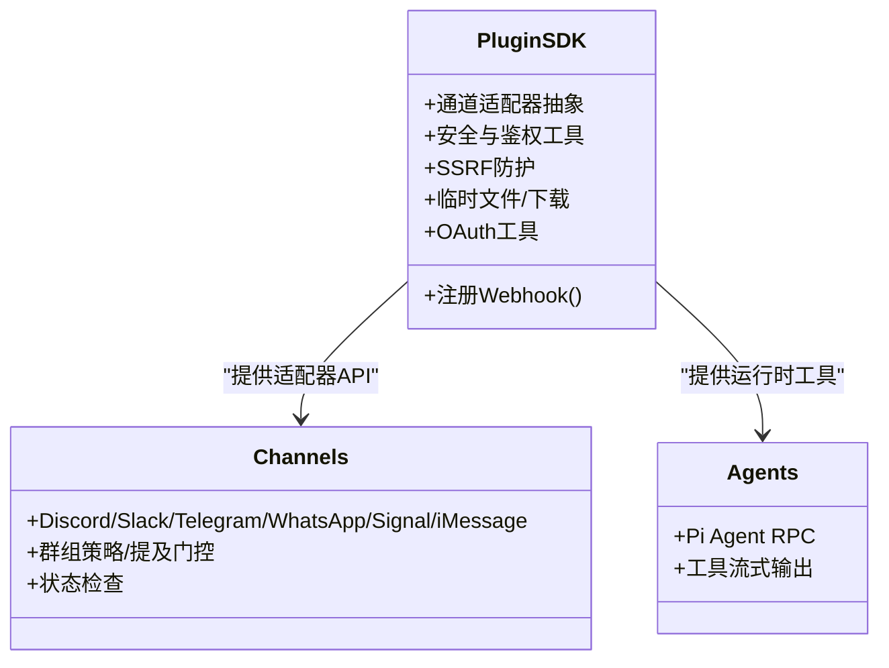
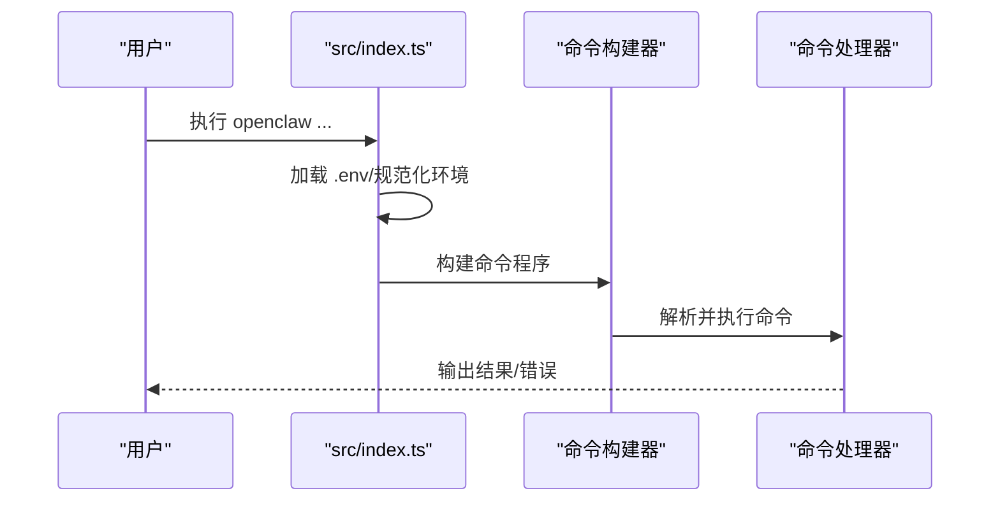
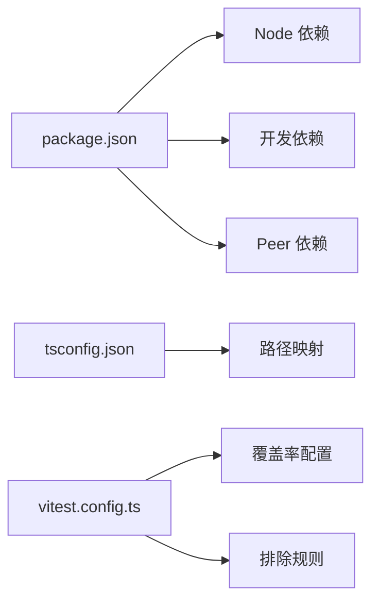

# 代码结构和架构

<cite>
**本文档引用的文件**
- [package.json](file://package.json)
- [tsconfig.json](file://tsconfig.json)
- [README.md](file://README.md)
- [vitest.config.ts](file://vitest.config.ts)
- [vitest.unit.config.ts](file://vitest.unit.config.ts)
- [vitest.gateway.config.ts](file://vitest.gateway.config.ts)
- [vitest.extensions.config.ts](file://vitest.extensions.config.ts)
- [src/index.ts](file://src/index.ts)
- [src/plugin-sdk/index.ts](file://src/plugin-sdk/index.ts)
</cite>

## 目录
1. [简介](#简介)
2. [项目结构](#项目结构)
3. [核心组件](#核心组件)
4. [架构总览](#架构总览)
5. [详细组件分析](#详细组件分析)
6. [依赖分析](#依赖分析)
7. [性能考虑](#性能考虑)
8. [故障排查指南](#故障排查指南)
9. [结论](#结论)
10. [附录](#附录)

## 简介
OpenClaw 是一个在用户设备上运行的个人 AI 助手，支持多通道消息集成与本地控制平面。其核心是“网关”（Gateway），作为会话、通道、工具与事件的统一控制平面；同时提供 CLI、WebChat、macOS/iOS/Android 节点应用等前端入口，并通过插件开发框架（plugin-sdk）扩展能力。

本文件聚焦于代码结构与架构，涵盖分层设计、模块化组织、组件间依赖关系，以及 TypeScript 配置、测试与代码质量工具设置，并总结架构决策的背景与权衡。

## 项目结构
仓库采用多包/多模块混合布局：
- 核心源码位于 src/，按功能域划分子目录（如 gateway、channels、agents、plugin-sdk、cli 等）
- 扩展生态位于 extensions/，每个扩展独立实现 openclaw.plugin.json 并导出 index.ts
- 应用层位于 apps/（macOS、iOS、Android），共享库在 apps/shared/OpenClawKit
- UI 在 ui/，使用 Vite + Vitest
- 测试在 test/ 与各模块 src/**/*.test.ts、extensions/**/*.test.ts

图示来源
- [package.json](file://package.json#L1-L458)
- [tsconfig.json](file://tsconfig.json#L1-L29)
- [vitest.config.ts](file://vitest.config.ts#L1-L203)

章节来源
- [package.json](file://package.json#L1-L458)
- [README.md](file://README.md#L1-L560)

## 核心组件
- 网关（gateway）：WebSocket 控制平面，承载会话、存在性、配置、定时任务、Webhook、工具调用与事件分发
- 通道系统（channels）：多渠道适配器（Telegram、Discord、Slack、WhatsApp、Signal、iMessage、BlueBubbles、IRC、Teams、Matrix、Feishu、LINE、Mattermost、Nextcloud Talk、Nostr、Synology Chat、Tlon、Twitch、Zalo、WebChat 等）
- AI 代理（agents）：基于 Pi Agent 的 RPC 运行时，支持工具流式输出与块流式输出
- 插件开发框架（plugin-sdk）：统一的插件 API、Webhook 注册、通道适配器抽象、安全与鉴权工具
- 命令行界面（cli）：openclaw 可执行入口，提供 onboarding、gateway、agent、wizard、doctor 等命令
- 扩展（extensions）：社区/企业自定义插件，遵循 openclaw.plugin.json 规范

章节来源
- [src/index.ts](file://src/index.ts#L1-L94)
- [src/plugin-sdk/index.ts](file://src/plugin-sdk/index.ts#L1-L812)

## 架构总览
OpenClaw 采用“控制平面 + 多通道适配 + 插件扩展”的分层架构：
- 表现层：CLI、WebChat、桌面/移动端节点
- 控制平面：Gateway（WebSocket + HTTP 方法），负责路由、会话、工具、事件
- 适配层：channels 下各平台适配器，统一抽象消息收发、群组策略、提及门控、媒体处理
- 执行层：agents（Pi Agent RPC）、process/exec（系统命令）、browser（Chrome/CDP）
- 扩展层：plugin-sdk 提供插件 API，extensions 实现具体插件

图示来源
- [README.md](file://README.md#L185-L238)
- [src/index.ts](file://src/index.ts#L1-L94)

## 详细组件分析

### 网关（gateway）
- 职责：会话管理、存在性、配置、定时任务、Webhook、工具方法、事件分发
- 关键点：HTTP 方法注册、WS 控制面、桥接通道与工具、远程暴露（Tailscale Serve/Funnel）

图示来源
- [README.md](file://README.md#L185-L238)

章节来源
- [README.md](file://README.md#L185-L238)

### 通道系统（channels）
- 职责：统一抽象各渠道的消息收发、群组策略、提及门控、媒体处理、状态检查
- 设计：以插件化适配器为核心，提供 onboarding、normalize、directory、group-mentions、status-issues 等工具集

图示来源
- [src/plugin-sdk/index.ts](file://src/plugin-sdk/index.ts#L527-L562)

章节来源
- [src/plugin-sdk/index.ts](file://src/plugin-sdk/index.ts#L527-L562)

### AI 代理（agents）
- 职责：执行工具链、流式输出、块流式输出、会话上下文管理
- 运行模式：RPC（Pi Agent），支持子代理派生与会话隔离

章节来源
- [README.md](file://README.md#L146-L148)

### 插件开发框架（plugin-sdk）
- 职责：统一插件 API、Webhook 注册与鉴权、通道适配器抽象、安全与鉴权工具、SSRF 保护、临时文件与 OAuth 工具
- 导出：大量类型与工具函数，覆盖账户解析、群组策略、提及门控、媒体处理、状态汇总、Windows Spawn 等

图示来源
- [src/plugin-sdk/index.ts](file://src/plugin-sdk/index.ts#L1-L812)

章节来源
- [src/plugin-sdk/index.ts](file://src/plugin-sdk/index.ts#L1-L812)

### 命令行界面（cli）
- 入口：src/index.ts 构建并解析命令行参数，安装未捕获异常处理器，加载 dotenv、环境规范化、端口可用性检查等
- 能力：onboarding、gateway、agent、wizard、doctor、hooks、nodes、sessions 等

图示来源
- [src/index.ts](file://src/index.ts#L1-L94)

章节来源
- [src/index.ts](file://src/index.ts#L1-L94)

### 扩展（extensions）
- 结构：每个扩展包含 openclaw.plugin.json 与 index.ts，遵循统一导出规范
- 作用：在不修改核心代码的前提下扩展新渠道或能力

章节来源
- [README.md](file://README.md#L264-L269)

## 依赖分析
- 包管理与发布：package.json 定义 bin、exports、scripts、dependencies/devDependencies/peerDependencies，支持 pnpm 工作区与 overrides
- 类型系统：tsconfig.json 使用 NodeNext 模块与解析、严格模式、路径映射至 src/plugin-sdk
- 测试体系：vitest.config.ts 统一配置别名、覆盖率阈值、排除范围；vitest.unit.config.ts、vitest.gateway.config.ts、vitest.extensions.config.ts 分场景覆盖

图示来源
- [package.json](file://package.json#L1-L458)
- [tsconfig.json](file://tsconfig.json#L1-L29)
- [vitest.config.ts](file://vitest.config.ts#L1-L203)

章节来源
- [package.json](file://package.json#L1-L458)
- [tsconfig.json](file://tsconfig.json#L1-L29)
- [vitest.config.ts](file://vitest.config.ts#L1-L203)

## 性能考虑
- 并行测试：根据 CPU 核数动态设置最大 worker 数，CI 下 Windows/非 Windows 分支优化
- 覆盖率锚定：仅统计被测试套件实际覆盖的 src 文件，避免嵌套 src 导致的膨胀
- 排斥大面：对难以单元测试的模块（如 gateway 服务端、浏览器控制、通道集成）采用 e2e/手动验证
- 运行时保障：最小 Node 版本断言、端口占用检测、未捕获异常处理

章节来源
- [vitest.config.ts](file://vitest.config.ts#L7-L11)
- [vitest.config.ts](file://vitest.config.ts#L79-L200)
- [src/index.ts](file://src/index.ts#L36-L44)

## 故障排查指南
- 端口占用：通过端口检查与错误描述定位占用进程，必要时自动释放
- 异常处理：全局安装未捕获异常/拒绝处理器，格式化错误信息后退出
- 环境问题：加载 .env、规范化环境变量、确保 CLI 在 PATH 中
- 网络与安全：SSRF 保护、HTTPS URL 白名单、请求体大小限制与速率限制

章节来源
- [src/index.ts](file://src/index.ts#L1-L94)
- [vitest.config.ts](file://vitest.config.ts#L116-L199)

## 结论
OpenClaw 通过清晰的分层与模块化设计，实现了“控制平面 + 通道适配 + 插件扩展”的可演进架构。TypeScript 配置与 Vitest 测试体系保证了代码质量与可维护性；严格的运行时保障与安全工具提升了生产稳定性。扩展生态通过 plugin-sdk 与 openclaw.plugin.json 降低了集成门槛，便于社区贡献与企业定制。

## 附录

### TypeScript 配置要点
- 模块与解析：module/moduleResolution 为 NodeNext，支持 ts 扩展导入
- 严格模式：开启严格类型检查，提升类型安全
- 路径映射：为 openclaw/plugin-sdk 提供别名，便于插件开发
- 输出目录：outDir 为 dist，配合构建脚本生成发布产物

章节来源
- [tsconfig.json](file://tsconfig.json#L1-L29)

### 测试与代码质量工具
- Vitest：统一别名、超时与 worker 设置、覆盖率阈值、排除规则
- 单元测试：vitest.unit.config.ts 限定在核心逻辑，排除 gateway/telegram 等集成面
- 网关专项：vitest.gateway.config.ts 仅覆盖 gateway 测试
- 扩展专项：vitest.extensions.config.ts 仅覆盖 extensions 测试
- 脚本：package.json scripts 提供格式化、lint、构建、测试、打包等完整流水线

章节来源
- [vitest.config.ts](file://vitest.config.ts#L1-L203)
- [vitest.unit.config.ts](file://vitest.unit.config.ts#L1-L31)
- [vitest.gateway.config.ts](file://vitest.gateway.config.ts#L1-L4)
- [vitest.extensions.config.ts](file://vitest.extensions.config.ts#L1-L4)
- [package.json](file://package.json#L217-L334)