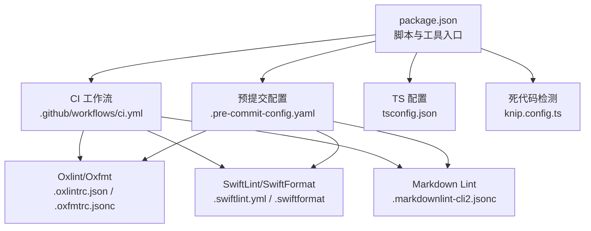
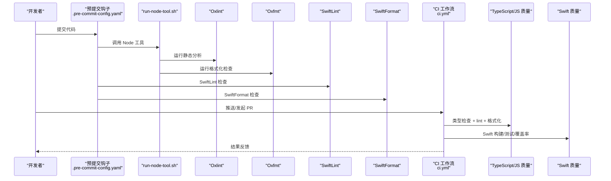
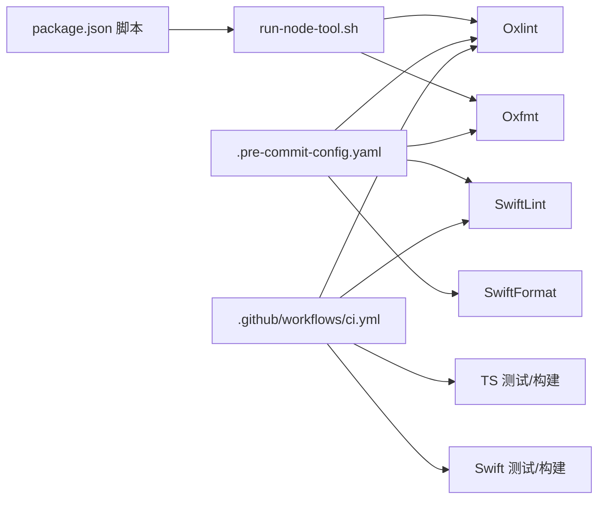

# 代码规范与质量

<cite>
**本文引用的文件**   
- [package.json](file://package.json)
- [.github/workflows/ci.yml](file://.github/workflows/ci.yml)
- [.swiftlint.yml](file://.swiftlint.yml)
- [.swiftformat](file://.swiftformat)
- [.markdownlint-cli2.jsonc](file://.markdownlint-cli2.jsonc)
- [.oxlintrc.json](file://.oxlintrc.json)
- [.oxfmtrc.jsonc](file://.oxfmtrc.jsonc)
- [.pre-commit-config.yaml](file://.pre-commit-config.yaml)
- [tsconfig.json](file://tsconfig.json)
- [knip.config.ts](file://knip.config.ts)
- [scripts/pre-commit/run-node-tool.sh](file://scripts/pre-commit/run-node-tool.sh)
- [docs/concepts/markdown-formatting.md](file://docs/concepts/markdown-formatting.md)
- [CONTRIBUTING.md](file://CONTRIBUTING.md)
</cite>

## 目录
1. [简介](#简介)
2. [项目结构](#项目结构)
3. [核心组件](#核心组件)
4. [架构总览](#架构总览)
5. [详细组件分析](#详细组件分析)
6. [依赖分析](#依赖分析)
7. [性能考虑](#性能考虑)
8. [故障排查指南](#故障排查指南)
9. [结论](#结论)
10. [附录](#附录)

## 简介
本文件为 OpenClaw 项目的“代码规范与质量”指南，覆盖以下内容：
- TypeScript/JavaScript 编码规范与质量工具链（ESLint、Prettier、Oxlint、Oxfmt）
- Swift 代码风格与质量工具链（SwiftLint、SwiftFormat）
- Markdown 格式与校验规则
- 自动化格式化、静态分析与质量门禁（CI、pre-commit）
- 代码审查检查清单、命名约定、注释规范与文档编写标准
- 代码质量度量指标与持续改进策略

本规范以仓库现有配置与脚本为依据，确保团队协作一致性与交付质量。

## 项目结构
OpenClaw 采用多语言混合工程：TypeScript/JavaScript 主体、Swift 客户端（macOS/iOS）、Python 技能脚本、以及大量文档与自动化脚本。质量体系围绕以下关键点展开：
- 统一的包管理与脚本入口（package.json）
- CI 质量门禁（.github/workflows/ci.yml）
- 语言特定的静态分析与格式化配置
- 预提交钩子（pre-commit）保障本地质量
- 文档格式与链接校验

图表来源
- [package.json:1-481](file://package.json#L1-L481)
- [.github/workflows/ci.yml:1-827](file://.github/workflows/ci.yml#L1-L827)
- [.pre-commit-config.yaml:1-158](file://.pre-commit-config.yaml#L1-L158)
- [.oxlintrc.json:1-40](file://.oxlintrc.json#L1-L40)
- [.oxfmtrc.jsonc:1-27](file://.oxfmtrc.jsonc#L1-L27)
- [.swiftlint.yml:1-151](file://.swiftlint.yml#L1-L151)
- [.swiftformat:1-52](file://.swiftformat#L1-L52)
- [.markdownlint-cli2.jsonc:1-53](file://.markdownlint-cli2.jsonc#L1-L53)
- [tsconfig.json:1-30](file://tsconfig.json#L1-L30)
- [knip.config.ts:1-106](file://knip.config.ts#L1-L106)

章节来源
- [package.json:1-481](file://package.json#L1-L481)
- [.github/workflows/ci.yml:1-827](file://.github/workflows/ci.yml#L1-L827)

## 核心组件
- TypeScript/JavaScript 质量工具链
  - 静态分析：Oxlint（类型感知），可选 ESLint 插件生态
  - 格式化：Oxfmt（统一格式化器）
  - 死代码检测：Knip（生产依赖、导出与入口扫描）
  - 文档格式：markdownlint-cli2
- Swift 质量工具链
  - 静态分析：SwiftLint（规则集与严重级别）
  - 格式化：SwiftFormat（缩进、换行、导入分组等）
- 预提交与 CI
  - 预提交：统一调用 run-node-tool.sh 执行 Node 工具，跨 pnpm/bun/npm/npx
  - CI：按变更范围裁剪任务，集中执行类型检查、lint、格式化、Swift 检查与测试

章节来源
- [package.json:214-346](file://package.json#L214-L346)
- [.oxlintrc.json:1-40](file://.oxlintrc.json#L1-L40)
- [.oxfmtrc.jsonc:1-27](file://.oxfmtrc.jsonc#L1-L27)
- [.swiftlint.yml:1-151](file://.swiftlint.yml#L1-L151)
- [.swiftformat:1-52](file://.swiftformat#L1-L52)
- [.markdownlint-cli2.jsonc:1-53](file://.markdownlint-cli2.jsonc#L1-L53)
- [.pre-commit-config.yaml:1-158](file://.pre-commit-config.yaml#L1-L158)
- [scripts/pre-commit/run-node-tool.sh:1-32](file://scripts/pre-commit/run-node-tool.sh#L1-L32)
- [.github/workflows/ci.yml:141-277](file://.github/workflows/ci.yml#L141-L277)

## 架构总览
下图展示从开发者本地到 CI 的质量门禁流程，涵盖格式化、静态分析与 Swift 检查。

图表来源
- [.pre-commit-config.yaml:117-158](file://.pre-commit-config.yaml#L117-L158)
- [scripts/pre-commit/run-node-tool.sh:14-28](file://scripts/pre-commit/run-node-tool.sh#L14-L28)
- [.github/workflows/ci.yml:209-234](file://.github/workflows/ci.yml#L209-L234)
- [.github/workflows/ci.yml:530-606](file://.github/workflows/ci.yml#L530-L606)

## 详细组件分析

### TypeScript/JavaScript 编码规范与质量工具
- 静态分析（Oxlint）
  - 启用类型感知模式，严格类别（correctness/perf/suspicious）错误级别
  - 关闭若干规则以平衡项目现状，保留关键规则如 no-explicit-any
  - 忽略模式覆盖生成物、第三方目录与模板文件
- 格式化（Oxfmt）
  - 统一 tab 宽度与缩进；启用 import 排序与 package.json 字段排序
  - 忽略模式覆盖 apps/、assets/、docs/_layouts/ 等
- 死代码检测（Knip）
  - 基于根入口与工作区定义扫描未使用导出与依赖
  - 忽略测试与 fixtures、部分生成文件与外部目录
- 文档格式（markdownlint-cli2）
  - 针对 docs/**/*.md 与 README.md，放宽行长、标题重复等规则
  - 允许特定 HTML 元素用于文档组件系统

章节来源
- [package.json:229-288](file://package.json#L229-L288)
- [.oxlintrc.json:1-40](file://.oxlintrc.json#L1-L40)
- [.oxfmtrc.jsonc:1-27](file://.oxfmtrc.jsonc#L1-L27)
- [knip.config.ts:1-106](file://knip.config.ts#L1-L106)
- [.markdownlint-cli2.jsonc:1-53](file://.markdownlint-cli2.jsonc#L1-L53)

### Swift 代码风格与质量工具
- SwiftLint
  - 分析器规则：unused_declaration、unused_import
  - 开关规则：array_init、contains_over_first_not_nil、multiline_parameters 等
  - 禁用规则：与 SwiftFormat 冲突的空白类规则，以及风格类规则
  - 复杂度与长度阈值：函数体长度、参数数量、文件长度、嵌套层级、元组大小、行长
- SwiftFormat
  - Swift 版本 6.2，强制 self，导入分组策略
  - 缩进 4 空格，最大行长 120，空格与括号风格
  - 排除生成物与第三方目录

章节来源
- [.swiftlint.yml:1-151](file://.swiftlint.yml#L1-L151)
- [.swiftformat:1-52](file://.swiftformat#L1-L52)

### Markdown 格式与文档质量
- 规则要点
  - 放宽行长、标题重复、列表编号等通用规则
  - 允许文档组件元素（如 Card、Tabs、CodeGroup 等）
  - 忽略 zh-CN/i18n 模板与本地产物
- 使用场景
  - Outbound 渠道 Markdown 转 IR 的渲染管线与 chunking 行为在概念文档中有明确说明

章节来源
- [.markdownlint-cli2.jsonc:1-53](file://.markdownlint-cli2.jsonc#L1-L53)
- [docs/concepts/markdown-formatting.md:1-131](file://docs/concepts/markdown-formatting.md#L1-L131)

### 预提交与 CI 质量门禁
- 预提交
  - 基础文件卫生：尾随空白、文件结尾、YAML、大文件、合并冲突
  - 秘密检测：detect-secrets 基线与排除规则
  - Shell 检查：shellcheck（仅错误级别）
  - GitHub Actions：actionlint、zizmor 审计
  - Python：ruff 检查与 pytest 测试（skills）
  - 项目检查：pnpm audit、oxlint、oxfmt、swiftlint、swiftformat
  - Node 工具通过 run-node-tool.sh 统一调用，支持 pnpm/bun/npm/npx
- CI
  - 文档变更快速路径：仅运行文档检查
  - 变更范围检测：按 Node/Windows/macOS/Android/Python 技能裁剪任务
  - 质量门禁：类型检查、lint、格式化、UI 安全策略检查、Swift 构建/测试/覆盖率
  - 并行与资源：测试分片、内存限制、缓存策略

章节来源
- [.pre-commit-config.yaml:1-158](file://.pre-commit-config.yaml#L1-L158)
- [scripts/pre-commit/run-node-tool.sh:1-32](file://scripts/pre-commit/run-node-tool.sh#L1-L32)
- [.github/workflows/ci.yml:18-80](file://.github/workflows/ci.yml#L18-L80)
- [.github/workflows/ci.yml:209-234](file://.github/workflows/ci.yml#L209-L234)
- [.github/workflows/ci.yml:530-606](file://.github/workflows/ci.yml#L530-L606)

### 命名约定与注释规范
- 命名约定
  - TypeScript：遵循 tsconfig 中严格模式与路径映射，避免宽松类型
  - Swift：类型名长度阈值、函数参数数量与复杂度控制
- 注释规范
  - 保持简洁清晰，解释“为什么”而非“是什么”
  - 对跨渠道格式化逻辑、复杂 chunking 规则进行充分注释
- 文档注释
  - 文档组件允许的 HTML 元素白名单，确保渲染一致性

章节来源
- [tsconfig.json:1-30](file://tsconfig.json#L1-L30)
- [.swiftlint.yml:103-150](file://.swiftlint.yml#L103-L150)
- [docs/concepts/markdown-formatting.md:1-131](file://docs/concepts/markdown-formatting.md#L1-L131)

### 代码审查检查清单
- 本地自检
  - pnpm build && pnpm check && pnpm test
  - 针对 Swift：swiftlint、swiftformat
  - 针对文档：pnpm check:docs
- CI 通过性
  - 文档变更仅运行文档检查
  - Node 变更运行类型检查、lint、格式化
  - macOS 变更运行 TS 测试与 Swift 构建/测试
- 安全与合规
  - 秘密检测、依赖审计、GitHub Actions 审计
- 变更范围
  - 仅与本次改动相关的平台/模块运行测试

章节来源
- [CONTRIBUTING.md:88-100](file://CONTRIBUTING.md#L88-L100)
- [.github/workflows/ci.yml:18-80](file://.github/workflows/ci.yml#L18-L80)
- [.github/workflows/ci.yml:209-234](file://.github/workflows/ci.yml#L209-L234)
- [.pre-commit-config.yaml:24-76](file://.pre-commit-config.yaml#L24-L76)

### 文档编写标准
- 结构与风格
  - 使用允许的 HTML 元素（Card、Tabs、CodeGroup 等）提升可读性
  - 放宽行长与标题重复规则，聚焦内容质量
- 链接与国际化
  - 忽略 zh-CN/i18n 模板与本地产物，避免误报
- Markdown 渲染与 chunking
  - 参考“Markdown Formatting”概念文档，确保跨渠道一致性

章节来源
- [.markdownlint-cli2.jsonc:1-53](file://.markdownlint-cli2.jsonc#L1-L53)
- [docs/concepts/markdown-formatting.md:1-131](file://docs/concepts/markdown-formatting.md#L1-L131)

## 依赖分析
- 语言工具链耦合
  - Node 工具通过 run-node-tool.sh 解耦不同包管理器
  - Swift 工具由 CI 与预提交分别执行，互不干扰
- 任务耦合与解耦
  - CI 通过“文档变更检测”与“变更范围检测”降低无关任务开销
  - Knip 与死代码扫描独立于主构建，避免阻塞

图表来源
- [package.json:214-346](file://package.json#L214-L346)
- [scripts/pre-commit/run-node-tool.sh:14-28](file://scripts/pre-commit/run-node-tool.sh#L14-L28)
- [.pre-commit-config.yaml:117-158](file://.pre-commit-config.yaml#L117-L158)
- [.github/workflows/ci.yml:209-234](file://.github/workflows/ci.yml#L209-L234)

章节来源
- [package.json:214-346](file://package.json#L214-L346)
- [.pre-commit-config.yaml:117-158](file://.pre-commit-config.yaml#L117-L158)
- [.github/workflows/ci.yml:209-234](file://.github/workflows/ci.yml#L209-L234)

## 性能考虑
- 测试分片与资源
  - CI 使用分片与内存上限，减少 OOM 风险
  - Windows 与 macOS 任务并发受控，避免资源争用
- 死代码与体积
  - Knip 生产依赖扫描，减少打包体积与加载时间
- 格式化与分析效率
  - Oxfmt 与 Oxlint 在 CI 中并行执行，缩短反馈周期

章节来源
- [.github/workflows/ci.yml:190-202](file://.github/workflows/ci.yml#L190-L202)
- [.github/workflows/ci.yml:418-451](file://.github/workflows/ci.yml#L418-L451)
- [knip.config.ts:1-106](file://knip.config.ts#L1-L106)

## 故障排查指南
- 预提交失败
  - 检查 run-node-tool.sh 是否正确选择包管理器
  - 针对 Swift：确认 .swiftlint.yml 与 .swiftformat 配置未被忽略
- CI 失败
  - 查看“文档变更检测”与“变更范围检测”是否误判
  - 确认 Node 版本与缓存命中情况
- 文档问题
  - 使用 pnpm check:docs 或 markdownlint-cli2 单独验证
- 秘密泄露检测
  - 更新 .secrets.baseline 并排除已知误报

章节来源
- [scripts/pre-commit/run-node-tool.sh:14-31](file://scripts/pre-commit/run-node-tool.sh#L14-L31)
- [.pre-commit-config.yaml:24-76](file://.pre-commit-config.yaml#L24-L76)
- [.github/workflows/ci.yml:18-80](file://.github/workflows/ci.yml#L18-L80)

## 结论
本规范以现有配置为基础，建立了“本地预提交 + CI 质量门禁”的闭环，覆盖 TypeScript/JavaScript、Swift 与 Markdown 的质量与一致性要求。建议团队：
- 严格遵守脚本入口与工具链约定
- 在 PR 中提供前后对比截图与说明
- 持续优化 Knip 与 Oxlint 规则，逐步收紧质量门槛

## 附录

### TypeScript/JavaScript 脚本与命令速查
- 格式化与检查
  - pnpm format / pnpm format:check / pnpm format:fix
  - pnpm lint / pnpm lint:fix
  - pnpm check（含 host-env 策略、插件导出、UI 安全策略等）
- 文档检查
  - pnpm check:docs（格式、lint、链接、国际化词表）
- 死代码与体积
  - pnpm deadcode:report / pnpm deadcode:knip / pnpm deadcode:ts-prune / pnpm deadcode:ts-unused

章节来源
- [package.json:229-288](file://package.json#L229-L288)

### Swift 工具链速查
- 本地检查
  - swiftlint --config .swiftlint.yml
  - swiftformat --lint --config .swiftformat apps/macos/Sources
- CI 步骤
  - 选择 Xcode 版本、安装 SwiftLint/SwiftFormat
  - Swift build（release）、swift test（并生成覆盖率）

章节来源
- [.github/workflows/ci.yml:555-606](file://.github/workflows/ci.yml#L555-L606)
- [.swiftlint.yml:1-151](file://.swiftlint.yml#L1-L151)
- [.swiftformat:1-52](file://.swiftformat#L1-L52)

### Markdown 格式速查
- 验证与修复
  - pnpm lint:docs / pnpm lint:docs:fix
- 规则要点
  - MD013、MD025、MD029、MD033（允许的元素）、MD036、MD040、MD041、MD046 放宽

章节来源
- [.markdownlint-cli2.jsonc:1-53](file://.markdownlint-cli2.jsonc#L1-L53)