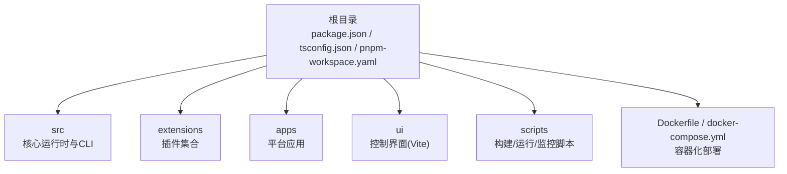
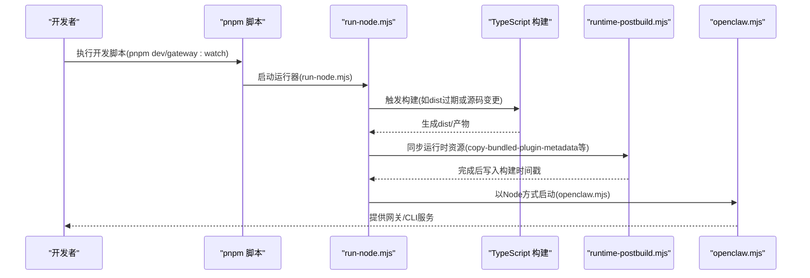
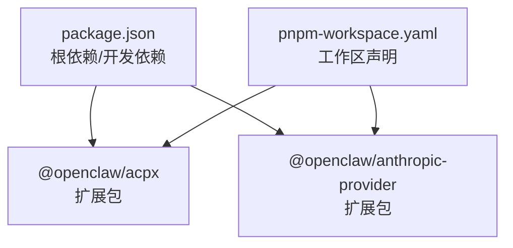

# 开发环境搭建

<cite>
**本文档引用的文件**
- [package.json](file://package.json)
- [pnpm-workspace.yaml](file://pnpm-workspace.yaml)
- [tsconfig.json](file://tsconfig.json)
- [Dockerfile](file://Dockerfile)
- [docker-compose.yml](file://docker-compose.yml)
- [README.md](file://README.md)
- [scripts/run-node.mjs](file://scripts/run-node.mjs)
- [scripts/watch-node.mjs](file://scripts/watch-node.mjs)
- [scripts/ui.js](file://scripts/ui.js)
- [ui/package.json](file://ui/package.json)
- [ui/vite.config.ts](file://ui/vite.config.ts)
- [extensions/acpx/package.json](file://extensions/acpx/package.json)
- [extensions/acpx/openclaw.plugin.json](file://extensions/acpx/openclaw.plugin.json)
- [extensions/anthropic/package.json](file://extensions/anthropic/package.json)
- [extensions/anthropic/openclaw.plugin.json](file://extensions/anthropic/openclaw.plugin.json)
- [scripts/runtime-postbuild.mjs](file://scripts/runtime-postbuild.mjs)
</cite>

## 目录
1. [简介](#简介)
2. [项目结构](#项目结构)
3. [核心组件](#核心组件)
4. [架构总览](#架构总览)
5. [详细组件分析](#详细组件分析)
6. [依赖关系分析](#依赖关系分析)
7. [性能考虑](#性能考虑)
8. [故障排除指南](#故障排除指南)
9. [结论](#结论)
10. [附录](#附录)

## 简介
本指南面向希望在本地搭建 OpenClaw 开发环境的开发者，覆盖以下主题：
- Node.js 22+ 环境配置与包管理器（pnpm）安装
- TypeScript 编译配置与开发工具链设置
- 克隆仓库、安装依赖、构建与运行流程
- IDE 配置与调试建议
- 跨平台开发支持（macOS、Windows、Linux）
- Docker 开发环境与本地网关配置
- 插件开发环境搭建与调试
- 常见环境问题排查与解决方案

## 项目结构
OpenClaw 采用多包工作区（monorepo）结构，核心目录与职责如下：
- 根目录：项目根配置、脚本与文档
- apps：各平台应用（Android、iOS、macOS）源码与测试
- extensions：可插拔扩展（插件）集合
- src：核心运行时与 CLI 源码
- ui：控制界面（Vite + Lit）前端
- scripts：构建、打包、监控与运行辅助脚本
- packages：通用包（如 clawbot、moltbot）

**图表来源**
- [package.json](file://package.json)
- [pnpm-workspace.yaml](file://pnpm-workspace.yaml)

**章节来源**
- [package.json](file://package.json)
- [pnpm-workspace.yaml](file://pnpm-workspace.yaml)

## 核心组件
- Node.js 运行时：要求版本 ≥ 22，推荐使用 pnpm 作为包管理器
- TypeScript：严格类型检查与模块解析配置
- 构建系统：基于 tsdown 的 TypeScript 构建脚本与后处理
- 开发工具链：Vitest 单元测试、Vite 前端开发服务器、Chokidar 文件监听
- Docker：多阶段构建与容器编排，支持浏览器预装与 Docker CLI

**章节来源**
- [package.json](file://package.json)
- [tsconfig.json](file://tsconfig.json)
- [Dockerfile](file://Dockerfile)
- [ui/package.json](file://ui/package.json)

## 架构总览
下图展示从源码到可执行产物的关键路径，以及开发模式下的自动构建与重启机制。

**图表来源**
- [scripts/run-node.mjs](file://scripts/run-node.mjs)
- [scripts/runtime-postbuild.mjs](file://scripts/runtime-postbuild.mjs)
- [package.json](file://package.json)

## 详细组件分析

### Node.js 与包管理器环境
- Node.js 版本要求：≥ 22（由 engines 字段声明）
- 包管理器：优先使用 pnpm；packageManager 字段指定 pnpm 版本
- 工作区：pnpm-workspace.yaml 声明了根工作区与扩展插件工作区

建议安装步骤（以 pnpm 为例）：
- 安装 pnpm：参考官方安装指南
- 在项目根目录执行：pnpm install 安装所有依赖
- 如需 UI 子包开发：pnpm ui:dev 或 pnpm ui:build

**章节来源**
- [package.json](file://package.json)
- [pnpm-workspace.yaml](file://pnpm-workspace.yaml)

### TypeScript 编译配置
- 模块目标：NodeNext，模块解析 NodeNext
- 目标语言：ES2023
- 严格模式：启用
- 路径映射：为 openclaw/plugin-sdk 等提供别名
- 输出目录：dist

开发时常用命令：
- pnpm build：完整构建（含插件SDK类型导出）
- pnpm build:docker：容器内构建专用
- pnpm build:plugin-sdk:dts：仅生成插件SDK类型定义

**章节来源**
- [tsconfig.json](file://tsconfig.json)
- [package.json](file://package.json)

### 开发工具链与脚本
- run-node.mjs：开发运行器，负责检测源码变更并触发构建，随后启动 openclaw.mjs
- watch-node.mjs：基于 chokidar 的文件监听器，支持热重启
- scripts/ui.js：统一 UI 子包的安装、开发与构建入口
- Vitest：单元测试与端到端测试配置位于根目录与 ui 目录
- Vite：控制界面开发服务器与构建输出

常用开发命令：
- pnpm dev：启动主进程（TypeScript 直接运行）
- pnpm gateway:watch：监听并自动重启网关进程
- pnpm ui:dev / ui:build：控制界面开发与构建

**章节来源**
- [scripts/run-node.mjs](file://scripts/run-node.mjs)
- [scripts/watch-node.mjs](file://scripts/watch-node.mjs)
- [scripts/ui.js](file://scripts/ui.js)
- [ui/vite.config.ts](file://ui/vite.config.ts)
- [package.json](file://package.json)

### IDE 配置与调试建议
- 推荐使用 VS Code 并安装 TypeScript/JavaScript 相关扩展
- 使用 TypeScript 直接运行（tsx）进行调试，便于断点与堆栈跟踪
- 在 run-node.mjs 中设置断点，可观察构建触发逻辑与重启行为
- 对于 UI 子包，使用 Vite 开发服务器配合浏览器调试

**章节来源**
- [scripts/run-node.mjs](file://scripts/run-node.mjs)
- [ui/vite.config.ts](file://ui/vite.config.ts)

### 跨平台开发支持
- macOS：官方推荐平台，支持菜单栏应用与设备节点
- Linux：可在小实例上运行网关，通过 Tailscale 或 SSH 隧道访问
- Windows：推荐使用 WSL2，兼容大多数功能
- 平台差异：部分原生能力（如 macOS TCC 权限）在非 macOS 上不可用

**章节来源**
- [README.md](file://README.md)

### Docker 开发环境
- 多阶段构建：分离扩展依赖提取层与构建层，减少无关变更导致的缓存失效
- 运行时镜像：基于 node:24-bookworm（或 slim），非 root 用户运行
- 可选增强：预装 Chromium/Xvfb、Docker CLI（用于沙箱容器管理）
- docker-compose.yml：提供网关与 CLI 服务的编排，支持挂载配置与工作空间目录

常用构建与运行命令：
- docker build：构建镜像（可传入扩展与系统包参数）
- docker compose up：启动服务
- docker compose down：停止并清理

**章节来源**
- [Dockerfile](file://Dockerfile)
- [docker-compose.yml](file://docker-compose.yml)

### 本地网关配置
- 默认绑定：回环地址（127.0.0.1），可通过 --bind 参数调整
- 端口：默认 18789（WebSocket 控制面），可映射到宿主机
- 认证：可通过环境变量或配置文件设置令牌与安全策略
- 健康检查：内置 /healthz 与 /readyz 探针

**章节来源**
- [Dockerfile](file://Dockerfile)
- [docker-compose.yml](file://docker-compose.yml)

### 插件开发环境
- 插件结构：每个扩展包含 package.json 与 openclaw.plugin.json
- 插件清单：openclaw.plugin.json 定义插件 ID、名称、描述、技能与配置模式
- 开发流程：在 extensions/<plugin> 下开发，使用 pnpm install 安装依赖，通过 run-node.mjs 监听并自动重启
- 示例插件：
  - acpx：提供 ACP 运行时后端，支持命令路径、版本策略、权限模式、MCP 服务器等配置
  - anthropic-provider：提供 Anthropic 模型提供商，支持 OAuth 与 API Key

**章节来源**
- [extensions/acpx/package.json](file://extensions/acpx/package.json)
- [extensions/acpx/openclaw.plugin.json](file://extensions/acpx/openclaw.plugin.json)
- [extensions/anthropic/package.json](file://extensions/anthropic/package.json)
- [extensions/anthropic/openclaw.plugin.json](file://extensions/anthropic/openclaw.plugin.json)
- [scripts/run-node.mjs](file://scripts/run-node.mjs)

## 依赖关系分析
- 根依赖：核心运行时与 CLI 依赖
- 开发依赖：TypeScript、Vitest、Vite、oxlint 等
- peerDependencies：可选原生依赖（如 node-llama-cpp），按需安装
- pnpm overrides：对部分依赖进行版本锁定与修复
- 工作区：extensions/* 与 packages/* 作为独立工作区参与构建与发布

**图表来源**
- [package.json](file://package.json)
- [pnpm-workspace.yaml](file://pnpm-workspace.yaml)
- [extensions/acpx/package.json](file://extensions/acpx/package.json)
- [extensions/anthropic/package.json](file://extensions/anthropic/package.json)

**章节来源**
- [package.json](file://package.json)
- [pnpm-workspace.yaml](file://pnpm-workspace.yaml)

## 性能考虑
- 构建缓存：Docker 构建使用 pnpm store 缓存，降低内存压力
- UI 构建：Vite 优化依赖与分块大小警告阈值，提升开发体验
- 监控与重启：watch-node.mjs 基于 chokidar 精准监听，避免不必要的重启
- 浏览器预装：在容器中预装 Chromium 可显著减少首次启动等待

**章节来源**
- [Dockerfile](file://Dockerfile)
- [ui/vite.config.ts](file://ui/vite.config.ts)
- [scripts/watch-node.mjs](file://scripts/watch-node.mjs)

## 故障排除指南
常见问题与解决思路：
- Node 版本不匹配
  - 症状：安装失败或运行时报错
  - 解决：升级至 Node ≥ 22，并确保 pnpm 使用正确版本
- pnpm 安装失败或超时
  - 症状：网络波动导致依赖安装中断
  - 解决：重试安装，或在 Docker 构建中启用重试与缓存
- UI 子包依赖缺失
  - 症状：执行 ui:dev/ui:build 报错
  - 解决：先执行 pnpm ui:install，再运行开发/构建命令
- 文件监听无效
  - 症状：修改代码后未触发重启
  - 解决：确认 run-node.mjs 的监听路径与过滤规则，检查 chokidar 是否报错
- Docker 端口冲突
  - 症状：容器无法映射端口
  - 解决：调整 docker-compose.yml 中的端口映射或宿主机占用端口

**章节来源**
- [package.json](file://package.json)
- [scripts/ui.js](file://scripts/ui.js)
- [scripts/run-node.mjs](file://scripts/run-node.mjs)
- [scripts/watch-node.mjs](file://scripts/watch-node.mjs)
- [docker-compose.yml](file://docker-compose.yml)

## 结论
通过本指南，您可以在 macOS、Windows（WSL2）、Linux 上快速搭建 OpenClaw 开发环境，并掌握 TypeScript 构建、插件开发与 Docker 容器化部署的要点。建议优先使用 pnpm 与 TypeScript 直接运行方式进行开发，结合 watch-node.mjs 实现高效迭代；生产与部署场景可采用 Docker 多阶段构建与 docker-compose 编排。

## 附录

### 快速开始（从源码）
- 克隆仓库并进入目录
- 安装依赖：pnpm install
- UI 子包准备：pnpm ui:build（首次自动安装依赖）
- 构建：pnpm build
- 启动向导：pnpm openclaw onboard --install-daemon
- 开发循环：pnpm gateway:watch

**章节来源**
- [README.md](file://README.md)
- [package.json](file://package.json)