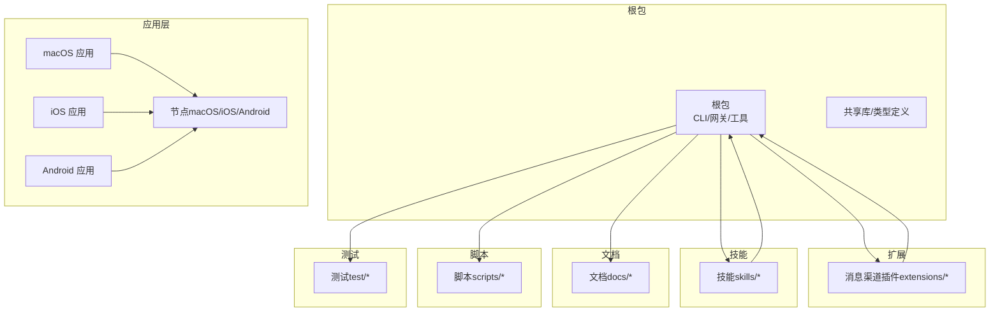
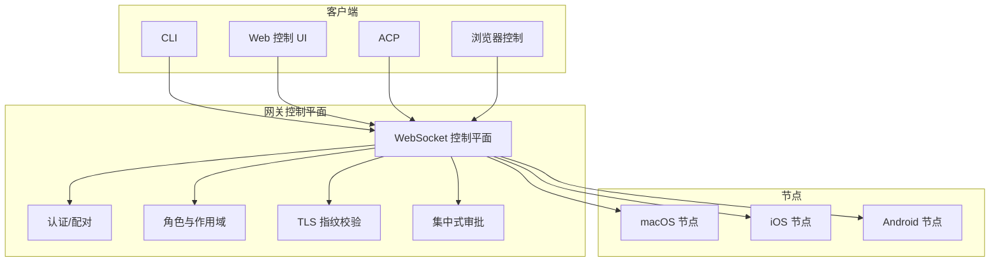
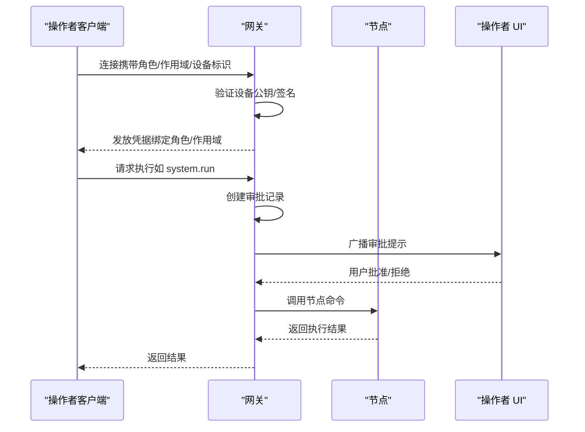
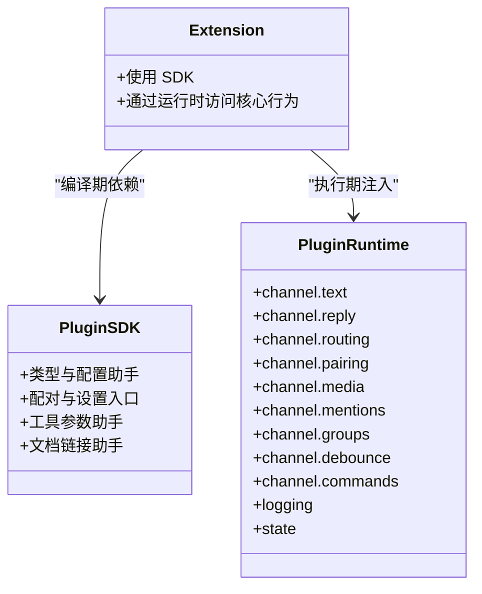
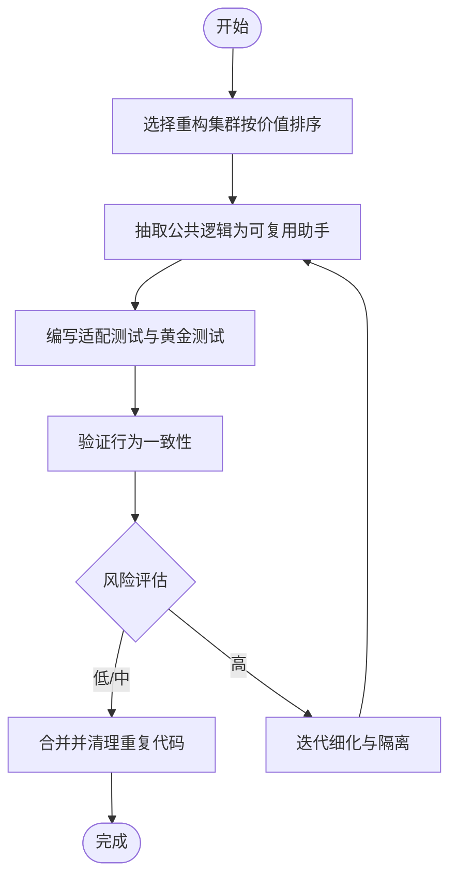
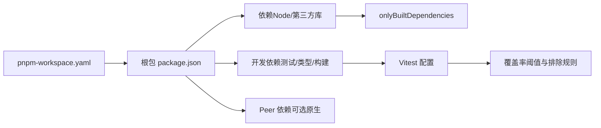

# 开发者指南

<cite>
**本文档引用的文件**
- [README.md](file://README.md)
- [CONTRIBUTING.md](file://CONTRIBUTING.md)
- [VISION.md](file://VISION.md)
- [SECURITY.md](file://SECURITY.md)
- [package.json](file://package.json)
- [pnpm-workspace.yaml](file://pnpm-workspace.yaml)
- [tsconfig.json](file://tsconfig.json)
- [vitest.config.ts](file://vitest.config.ts)
- [.github/workflows/ci.yml](file://.github/workflows/ci.yml)
- [docs/ci.md](file://docs/ci.md)
- [scripts/ui.js](file://scripts/ui.js)
- [docs/refactor/clawnet.md](file://docs/refactor/clawnet.md)
- [docs/refactor/cluster.md](file://docs/refactor/cluster.md)
- [docs/refactor/plugin-sdk.md](file://docs/refactor/plugin-sdk.md)
</cite>

## 目录
1. [简介](#简介)
2. [项目结构](#项目结构)
3. [核心组件](#核心组件)
4. [架构总览](#架构总览)
5. [详细组件分析](#详细组件分析)
6. [依赖关系分析](#依赖关系分析)
7. [性能考虑](#性能考虑)
8. [故障排除指南](#故障排除指南)
9. [结论](#结论)
10. [附录](#附录)

## 简介
OpenClaw 是一个可在用户设备上运行的个人 AI 助手，支持多通道消息接入（如 WhatsApp、Telegram、Discord、Slack、Google Chat、Signal、iMessage、BlueBubbles、IRC、Microsoft Teams、Matrix、Feishu、LINE、Mattermost、Nextcloud Talk、Nostr、Synology Chat、Tlon、Twitch、Zalo、Zalo Personal、WebChat），并能在 macOS/iOS/Android 上进行语音唤醒与实时画布协作。其核心是“网关控制平面”，负责会话、路由、工具与事件管理。

本开发者指南面向希望参与 OpenClaw 开发的工程师，覆盖开发环境搭建、代码结构、编码规范、提交流程、重构计划、架构演进、设计模式、插件开发、工具扩展、功能定制、测试策略、持续集成与质量保证、社区贡献与发布流程等。

## 项目结构
仓库采用多包工作区（pnpm workspace）组织，核心目录包括：
- 根包：CLI、网关、代理、工具与通用基础设施
- 应用层：macOS、iOS、Android 客户端与配套节点
- 扩展（extensions）：各消息渠道插件
- 技能（skills）：可安装的技能集合
- 文档（docs）：概念、参考、平台、工具、网关等文档
- 脚本（scripts）：构建、打包、协议生成、校验等自动化脚本
- 测试（test）：端到端、单元、集成测试配置与辅助

**图表来源**
- [pnpm-workspace.yaml:1-18](file://pnpm-workspace.yaml#L1-L18)
- [package.json:1-481](file://package.json#L1-L481)

**章节来源**
- [pnpm-workspace.yaml:1-18](file://pnpm-workspace.yaml#L1-L18)
- [package.json:1-481](file://package.json#L1-L481)

## 核心组件
- 网关（Gateway）：WebSocket 控制平面，承载配置、会话、通道、模型、节点、日志等全量 API 表面；默认仅绑定本地回环，远程访问通过 SSH 或 Tailscale。
- CLI：命令行入口，提供 onboarding、gateway 运行、消息发送、代理交互、医生检查等功能。
- 插件系统：通过 openclaw/plugin-sdk 提供稳定 API，所有扩展通过 SDK 与运行时交互，避免直接导入 src/**。
- 扩展（Channels）：各消息渠道插件（Telegram、Discord、Slack、Google Chat、Signal、Matrix、IRC、Mattermost、BlueBubbles、Zalo、Zalo Personal、Nostr、Synology Chat、Tlon、Twitch、LINE、WebChat 等）。
- 技能（Skills）：可安装的工具化能力，支持内置、托管与工作区技能。
- 节点（Nodes）：在设备上执行本地动作（系统命令、相机、屏幕录制、通知等），通过网关桥接或统一协议连接。
- UI：Web 控制界面与 Canvas 主机，由网关直接提供服务。

**章节来源**
- [README.md:185-270](file://README.md#L185-L270)
- [docs/refactor/plugin-sdk.md:1-215](file://docs/refactor/plugin-sdk.md#L1-L215)

## 架构总览
OpenClaw 的核心是“网关控制平面 + 多角色网络协议 + 统一插件 SDK”。当前存在两类传输：WebSocket 控制平面与节点桥接（JSONL over TCP）。重构目标是统一为单一 WS 协议，明确“操作者（operator）”与“节点（node）”角色，引入配对认证、作用域授权、TLS 指纹校验与集中式审批。

**图表来源**
- [docs/refactor/clawnet.md:43-108](file://docs/refactor/clawnet.md#L43-L108)
- [docs/refactor/clawnet.md:111-247](file://docs/refactor/clawnet.md#L111-L247)

**章节来源**
- [docs/refactor/clawnet.md:1-418](file://docs/refactor/clawnet.md#L1-L418)

## 详细组件分析

### 网关与协议重构（Clawnet）
- 目标：统一协议栈，明确角色与作用域，实现设备级配对与 TLS 指纹校验，集中式审批。
- 当前问题：两套协议（WS 控制平面 + 节点桥接）、审批分散、身份重复、TLS 仅桥接启用。
- 设计要点：单协议 + 角色（node/operator）+ 作用域（read/write/admin + approvals/pairing）+ 设备公钥绑定 + 可选 mTLS。
- 迁移路径：先在 WS 增加角色/作用域，保持桥接兼容，逐步迁移节点到 WS，最终去桥接。

**图表来源**
- [docs/refactor/clawnet.md:155-247](file://docs/refactor/clawnet.md#L155-L247)

**章节来源**
- [docs/refactor/clawnet.md:1-418](file://docs/refactor/clawnet.md#L1-L418)

### 插件 SDK 重构（Plugin SDK Refactor）
- 目标：所有消息渠道插件使用统一 SDK + 运行时，禁止直接导入 src/**，确保外部插件可独立开发与升级。
- SDK 内容：类型、配置助手、配对助手、工具参数助手、文档链接助手等。
- 运行时内容：文本分块、回复派发器、路由解析、配对存储、媒体下载保存、提及匹配、群组策略、防抖、命令授权等。
- 迁移策略：分阶段替换桥接代码，验证行为一致性，最终强制约束。

**图表来源**
- [docs/refactor/plugin-sdk.md:25-144](file://docs/refactor/plugin-sdk.md#L25-L144)

**章节来源**
- [docs/refactor/plugin-sdk.md:1-215](file://docs/refactor/plugin-sdk.md#L1-L215)

### 重构集群（Refactor Cluster Backlog）
- 价值排序：按 LOC 减少潜力、安全性与覆盖面排序，优先提取“通道插件配置与安全脚手架”“扩展运行时单例样板”“设置向导步骤”“多账户配置模式片段”“Webhook 与监控生命周期”等。
- 风险评估：中低风险为主，需保持助手组合性与窄而深的接口。

**图表来源**
- [docs/refactor/cluster.md:1-300](file://docs/refactor/cluster.md#L1-L300)

**章节来源**
- [docs/refactor/cluster.md:1-300](file://docs/refactor/cluster.md#L1-L300)

### 插件开发指南
- 插件结构：遵循 openclaw/plugin-sdk，通过 api.runtime 访问核心行为，避免直接导入 src/**。
- 配置与安全：使用 SDK 的配置与安全适配器，统一账户管理、DM 策略、允许列表等。
- 生命周期：利用 SDK 的启动与监控生命周期助手，减少样板代码。
- 测试：编写适配测试与黄金测试，确保路由、配对、允许列表、提及门控等行为一致。

**章节来源**
- [docs/refactor/plugin-sdk.md:153-215](file://docs/refactor/plugin-sdk.md#L153-L215)

### 工具扩展与功能定制
- 工具（Tools）：浏览器控制、Canvas、节点、定时任务、会话工具、Discord/Slack 动作等。
- 自动化：Webhook、Gmail Pub/Sub、轮询与心跳机制。
- 定制：通过工作区技能与插件扩展，结合配置与路由策略实现个性化体验。

**章节来源**
- [README.md:163-176](file://README.md#L163-L176)

### 编码规范与提交流程
- 快速开始：Node ≥22，推荐 pnpm，从源码构建后通过 openclaw onboard 安装守护进程。
- 提交前检查：本地测试、类型检查、格式化、lint、协议生成与校验、UI 安全策略检查。
- PR 要求：聚焦单一主题、描述变更动机、附带截图（UI/视觉变化）、遵守美国英语拼写与语法、尊重 CODEOWNERS 安全所有权范围。
- AI/ vibe-coded PR：欢迎透明标注，建议本地运行 Codex review 并处理机器人评论。

**章节来源**
- [README.md:92-111](file://README.md#L92-L111)
- [CONTRIBUTING.md:82-142](file://CONTRIBUTING.md#L82-L142)

## 依赖关系分析
- 包管理：pnpm workspace 管理根包与子包，onlyBuiltDependencies 显式声明原生依赖，避免二进制安装失败。
- 类型系统：TypeScript 严格模式，NodeNext 模块解析，路径别名映射 openclaw/* 到 src 下对应模块。
- 运行时要求：Node.js 22.12.0+，包含关键安全补丁；Docker 运行建议只读文件系统与最小权限。
- 依赖审计：CI 中运行 detect-secrets 与生产依赖审计，防止私钥泄露与供应链风险。

**图表来源**
- [pnpm-workspace.yaml:1-18](file://pnpm-workspace.yaml#L1-L18)
- [package.json:405-481](file://package.json#L405-L481)
- [vitest.config.ts:62-153](file://vitest.config.ts#L62-L153)

**章节来源**
- [pnpm-workspace.yaml:1-18](file://pnpm-workspace.yaml#L1-L18)
- [package.json:405-481](file://package.json#L405-L481)
- [vitest.config.ts:1-156](file://vitest.config.ts#L1-L156)

## 性能考虑
- 启动内存：CI 中包含 CLI 启动内存检查，确保冷启动资源占用可控。
- 并发与分片：测试在 Linux/Windows 上使用分片与并发 worker，合理设置内存上限避免 OOM。
- 覆盖率门槛：核心代码覆盖率阈值（行/函数/分支/语句）在 Vitest 中设定，避免过度排除导致覆盖率漂移。
- 平台差异：Windows CI 限制 worker 数量并调整内存参数，macOS Swift 构建与测试顺序执行以提升队列吞吐。

**章节来源**
- [.github/workflows/ci.yml:235-257](file://.github/workflows/ci.yml#L235-L257)
- [vitest.config.ts:30-153](file://vitest.config.ts#L30-L153)

## 故障排除指南
- 安全与信任模型：遵循“个人助理”信任模型，网关调用者被视为受信操作者；会话标识仅为路由控制，不等同于多租户授权边界。
- 插件信任：插件作为网关可信计算基的一部分，安装/启用即授予与本地代码同等的信任级别；报告漏洞需展示越权边界绕过。
- Web 界面安全：默认仅本地使用，非本地暴露需强认证与防火墙/Tailscale 控制；Canvas 主机为受信场景下的 LAN/tailnet 场景。
- 运行时要求：确认 Node 版本满足安全补丁要求；Docker 运行建议只读与最小权限。
- UI 安全策略：CI 强制检查“原始 window.open”等不安全调用，避免 XSS 风险。

**章节来源**
- [SECURITY.md:91-250](file://SECURITY.md#L91-L250)

## 结论
OpenClaw 通过“网关控制平面 + 统一协议 + 插件 SDK”的架构演进，持续降低重复代码、强化安全与可用性，并为社区贡献者提供清晰的扩展路径。开发者应遵循统一的编码规范与提交流程，配合完善的测试与 CI 策略，共同推进项目稳定性与可维护性。

## 附录

### 开发环境搭建
- 运行时：Node.js ≥22.12.0，推荐 pnpm。
- 从源码构建：克隆仓库后执行安装、UI 构建与主包构建，再通过 openclaw onboard 安装守护进程。
- 常用脚本：构建、测试、检查、协议生成与校验、UI 构建与开发服务器等。

**章节来源**
- [README.md:92-111](file://README.md#L92-L111)
- [package.json:214-346](file://package.json#L214-L346)

### 测试策略与 CI
- CI 作业：文档变更检测、变更范围检测、类型/格式/Lint、秘密扫描、构建产物、发布校验、Node 测试分片、Windows 测试分片、macOS Swift 检查、Android 构建与测试。
- 本地等效：pnpm check、pnpm test、pnpm check:docs、pnpm release:check。
- Vitest 配置：别名映射 openclaw/*、测试包含/排除规则、覆盖率阈值与排除清单。

**章节来源**
- [.github/workflows/ci.yml:1-827](file://.github/workflows/ci.yml#L1-L827)
- [docs/ci.md:1-57](file://docs/ci.md#L1-L57)
- [vitest.config.ts:1-156](file://vitest.config.ts#L1-L156)

### 插件与技能开发
- 插件：使用 openclaw/plugin-sdk，通过 api.runtime 访问核心行为；遵循迁移计划，逐步去除直接导入 src/**。
- 技能：优先在 ClawHub 发布，核心技能新增需具备强产品或安全理由。

**章节来源**
- [VISION.md:66-71](file://VISION.md#L66-L71)
- [docs/refactor/plugin-sdk.md:153-215](file://docs/refactor/plugin-sdk.md#L153-L215)

### 社区贡献与发布
- 贡献流程：先讨论/提问，再开 PR；保持 PR 聚焦、描述动机、附截图；尊重安全所有权范围。
- 代码审查：作者拥有审查对话，需自行解决或回复；AI/ vibe-coded PR 需本地 Codex review 并处理评论。
- 发布：遵循版本与渠道策略（stable/beta/dev），CI 在 main 推送后执行构建与发布校验。

**章节来源**
- [CONTRIBUTING.md:82-172](file://CONTRIBUTING.md#L82-L172)
- [README.md:83-90](file://README.md#L83-L90)