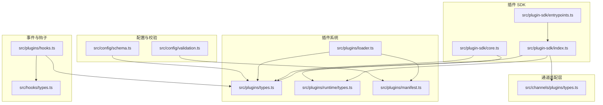
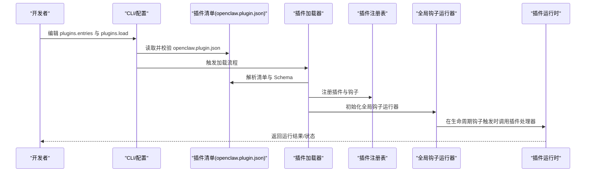
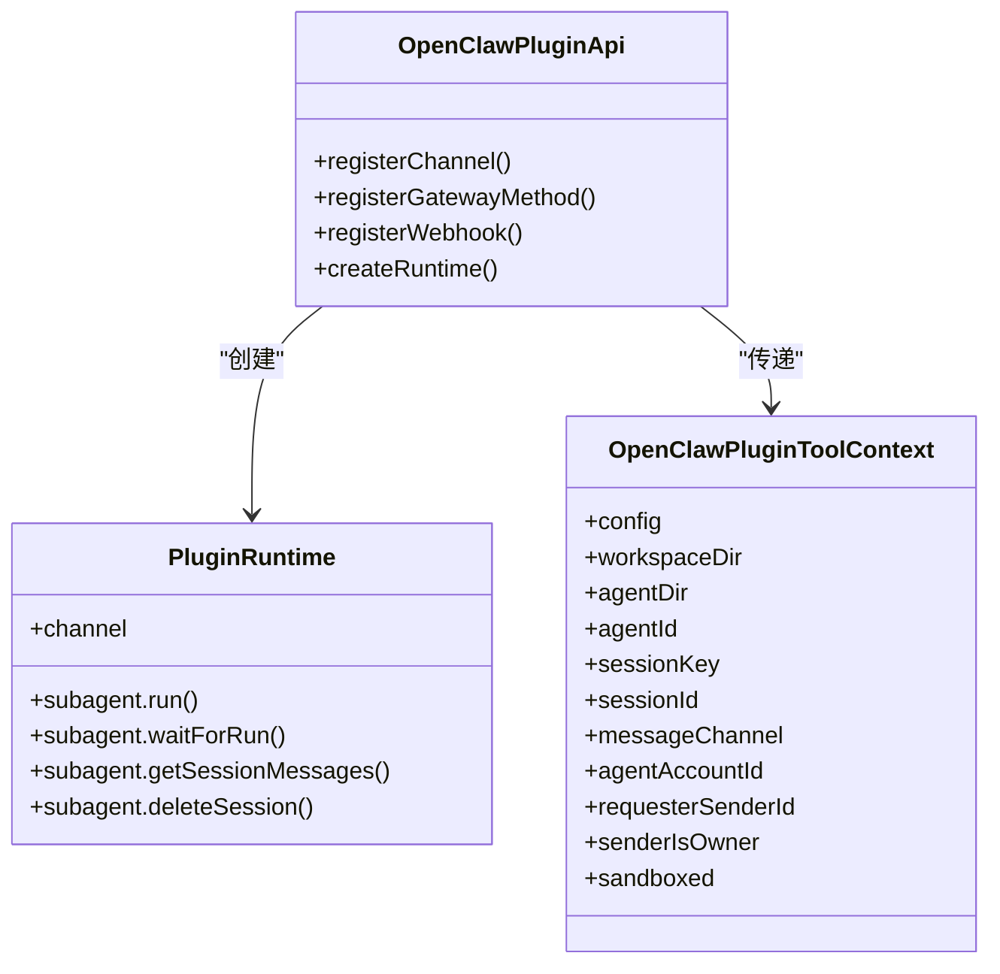
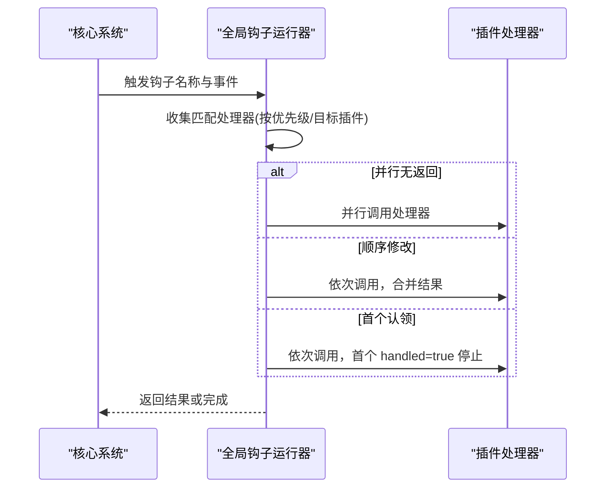
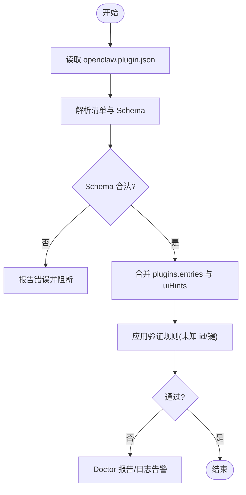
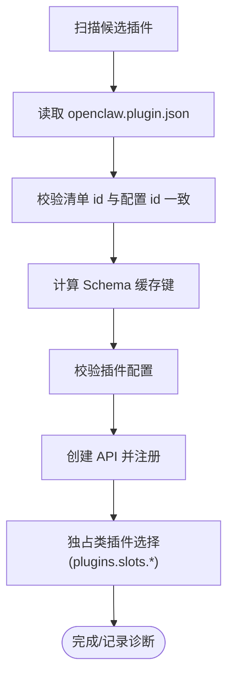
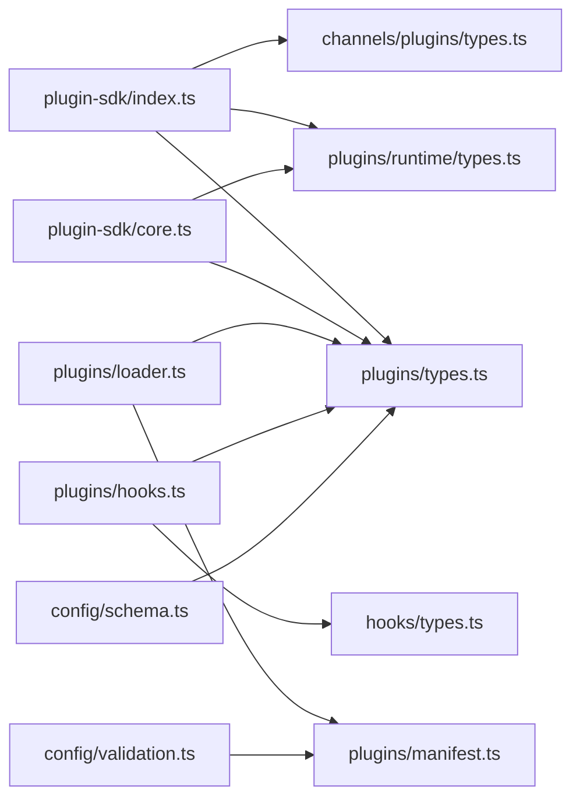

# 插件 SDK 概述

<cite>
**本文档引用的文件**
- [index.ts](file://src/plugin-sdk/index.ts)
- [core.ts](file://src/plugin-sdk/core.ts)
- [entrypoints.ts](file://src/plugin-sdk/entrypoints.ts)
- [types.ts](file://src/plugins/types.ts)
- [types.ts](file://src/channels/plugins/types.ts)
- [runtime/types.ts](file://src/plugins/runtime/types.ts)
- [hooks.ts](file://src/plugins/hooks.ts)
- [types.ts](file://src/hooks/types.ts)
- [loader.ts](file://src/plugins/loader.ts)
- [manifest.ts](file://src/plugins/manifest.ts)
- [manifest.md](file://docs/plugins/manifest.md)
- [plugins.md](file://docs/cli/plugins.md)
- [plugin.md](file://docs/zh-CN/tools/plugin.md)
- [validation.ts](file://src/config/validation.ts)
- [schema.ts](file://src/config/schema.ts)
</cite>

## 目录
1. [引言](#引言)
2. [项目结构](#项目结构)
3. [核心组件](#核心组件)
4. [架构总览](#架构总览)
5. [详细组件分析](#详细组件分析)
6. [依赖关系分析](#依赖关系分析)
7. [性能考量](#性能考量)
8. [故障排查指南](#故障排查指南)
9. [结论](#结论)
10. [附录](#附录)

## 引言
本文件为 OpenClaw 插件 SDK 的系统化概述，面向插件开发者与维护者，聚焦于 SDK 的架构设计、核心接口、扩展机制、事件系统与生命周期钩子、安装配置与基本使用示例，以及插件与核心系统的交互方式与数据流。文档以仓库现有实现为依据，结合 CLI 文档与配置规范，帮助读者快速理解并高效开发兼容 OpenClaw 的插件。

## 项目结构
OpenClaw 的插件 SDK 主要位于 src/plugin-sdk 目录，同时与插件系统、通道适配层、钩子系统、配置校验等模块紧密耦合。下图展示与插件 SDK 直接相关的核心文件与模块关系：

**图表来源**
- [index.ts:1-872](file://src/plugin-sdk/index.ts#L1-L872)
- [core.ts:1-139](file://src/plugin-sdk/core.ts#L1-L139)
- [entrypoints.ts:1-37](file://src/plugin-sdk/entrypoints.ts#L1-L37)
- [types.ts:1-1775](file://src/plugins/types.ts#L1-L1775)
- [runtime/types.ts:1-64](file://src/plugins/runtime/types.ts#L1-L64)
- [hooks.ts:252-920](file://src/plugins/hooks.ts#L252-L920)
- [types.ts:1-68](file://src/hooks/types.ts#L1-L68)
- [loader.ts:356-383](file://src/plugins/loader.ts#L356-L383)
- [manifest.ts:65-108](file://src/plugins/manifest.ts#L65-L108)
- [validation.ts:581-623](file://src/config/validation.ts#L581-L623)
- [schema.ts:177-225](file://src/config/schema.ts#L177-L225)

**章节来源**
- [index.ts:1-872](file://src/plugin-sdk/index.ts#L1-L872)
- [core.ts:1-139](file://src/plugin-sdk/core.ts#L1-L139)
- [entrypoints.ts:1-37](file://src/plugin-sdk/entrypoints.ts#L1-L37)

## 核心组件
- 插件 SDK 入口与导出聚合：通过 index.ts 将插件 API、运行时、通道适配、工具函数、Webhook、SSRF、时间与路径等能力统一导出，便于插件侧按需引入。
- 插件 SDK 核心能力封装：core.ts 提供与沙箱、设备配对、OAuth 结果构建、自托管模型配置、临时目录解析、网关绑定地址解析、Tailscale 状态解析等能力的封装。
- 插件 SDK 子路径与打包：entrypoints.ts 定义 SDK 的子路径入口、打包映射与产物清单，确保多入口分发与类型声明一致。

关键职责与边界：
- SDK 聚合层：负责对外暴露稳定 API，屏蔽内部模块细节。
- 核心封装层：提供与运行环境强相关的工具函数与配置辅助。
- 打包与分发层：保证多入口与类型声明的一致性与可维护性。

**章节来源**
- [index.ts:1-872](file://src/plugin-sdk/index.ts#L1-L872)
- [core.ts:1-139](file://src/plugin-sdk/core.ts#L1-L139)
- [entrypoints.ts:1-37](file://src/plugin-sdk/entrypoints.ts#L1-L37)

## 架构总览
OpenClaw 插件体系由“清单与发现”“加载与注册”“运行时与通道适配”“事件钩子系统”“配置与校验”五大层面构成。下图展示插件从发现到运行的关键交互：

**图表来源**
- [manifest.ts:65-108](file://src/plugins/manifest.ts#L65-L108)
- [loader.ts:1152-1261](file://src/plugins/loader.ts#L1152-L1261)
- [hooks.ts:252-920](file://src/plugins/hooks.ts#L252-L920)
- [validation.ts:581-623](file://src/config/validation.ts#L581-L623)

## 详细组件分析

### 组件一：插件 API 与运行时接口
- OpenClawPluginApi：插件与核心交互的 API 容器，承载注册通道、HTTP 路由、Webhook、配置 Schema、运行时上下文等能力。
- PluginRuntime：提供子代理运行、等待、会话消息查询、删除会话等能力，支持多通道适配。
- OpenClawPluginToolContext：工具执行上下文，包含会话键、请求者身份、沙箱标记等，确保工具在受控环境中运行。

**图表来源**
- [types.ts:1-800](file://src/plugins/types.ts#L1-L800)
- [runtime/types.ts:1-64](file://src/plugins/runtime/types.ts#L1-L64)

**章节来源**
- [types.ts:1-800](file://src/plugins/types.ts#L1-L800)
- [runtime/types.ts:1-64](file://src/plugins/runtime/types.ts#L1-L64)

### 组件二：事件系统与生命周期钩子
- 钩子元数据与入口：OpenClawHookMetadata 描述钩子事件、导出名、依赖、安装信息等；HookEntry 表示已解析的钩子条目。
- 钩子运行器：支持并行无返回钩子、顺序修改型钩子、首个“认领”型钩子（handled=true）等策略；提供全局初始化与统计能力。
- 生命周期钩子：如 gateway_start、gateway_stop 等，贯穿网关启动/停止过程，插件可订阅并执行副作用。

**图表来源**
- [hooks.ts:252-920](file://src/plugins/hooks.ts#L252-L920)
- [types.ts:1-68](file://src/hooks/types.ts#L1-L68)

**章节来源**
- [hooks.ts:252-920](file://src/plugins/hooks.ts#L252-L920)
- [types.ts:1-68](file://src/hooks/types.ts#L1-L68)

### 组件三：插件清单与配置 Schema
- 清单要求：每个原生插件必须提供 openclaw.plugin.json，包含 id 与 configSchema；Schema 在配置读取/写入时验证，非运行时。
- 验证规则：未知 channels.* 键、未知插件 id、Schema 缺失或损坏均视为错误；禁用插件保留配置并告警。
- 配置增强：控制界面使用 JSON Schema + uiHints 渲染表单；运行时根据发现的插件增强 uiHints。

**图表来源**
- [manifest.ts:65-108](file://src/plugins/manifest.ts#L65-L108)
- [validation.ts:581-623](file://src/config/validation.ts#L581-L623)
- [schema.ts:177-225](file://src/config/schema.ts#L177-L225)

**章节来源**
- [manifest.md:1-100](file://docs/plugins/manifest.md#L1-L100)
- [manifest.ts:65-108](file://src/plugins/manifest.ts#L65-L108)
- [validation.ts:581-623](file://src/config/validation.ts#L581-L623)
- [schema.ts:177-225](file://src/config/schema.ts#L177-L225)

### 组件四：模块加载与注册机制
- 加载流程：扫描插件根目录，解析清单与 Schema，校验插件 id 一致性，验证配置值，构造 API 并注册通道/钩子。
- 注册模式：支持 setup-only/setup-runtime 两种模式，允许仅注册设置阶段的通道适配。
- 冲突与选择：对独占类插件（如 memory），通过 plugins.slots.* 选择唯一生效插件，其余禁用并输出诊断。

**图表来源**
- [loader.ts:1152-1261](file://src/plugins/loader.ts#L1152-L1261)
- [loader.ts:356-383](file://src/plugins/loader.ts#L356-L383)

**章节来源**
- [loader.ts:1152-1261](file://src/plugins/loader.ts#L1152-L1261)
- [loader.ts:356-383](file://src/plugins/loader.ts#L356-L383)

### 组件五：安装配置与基本使用
- CLI 管理：支持 list/info/enable/disable/uninstall/update 等命令；支持 npm 包安装、本地路径安装、链接安装（--link）、归档安装等。
- 配置开关：plugins.enabled、plugins.allow、plugins.deny、plugins.load.paths、plugins.entries.<id> 等；配置变更需重启网关。
- 使用示例（基于文档）：
  - 启用/禁用插件：openclaw plugins enable/disable <id>
  - 安装本地插件：openclaw plugins install -l ./my-plugin
  - 更新插件：openclaw plugins update <id> 或 --all

**章节来源**
- [plugins.md:1-122](file://docs/cli/plugins.md#L1-L122)
- [plugin.md:182-239](file://docs/zh-CN/tools/plugin.md#L182-L239)

## 依赖关系分析
- 松耦合聚合：SDK index.ts 作为聚合层，避免插件直接依赖内部实现细节。
- 强内聚封装：core.ts 将运行时相关能力封装为可复用工具，降低插件实现复杂度。
- 双向依赖控制：插件类型定义与钩子类型定义相互独立，通过钩子运行器协调调用。

**图表来源**
- [index.ts:1-872](file://src/plugin-sdk/index.ts#L1-L872)
- [core.ts:1-139](file://src/plugin-sdk/core.ts#L1-L139)
- [types.ts:1-1775](file://src/plugins/types.ts#L1-L1775)
- [runtime/types.ts:1-64](file://src/plugins/runtime/types.ts#L1-L64)
- [hooks.ts:252-920](file://src/plugins/hooks.ts#L252-L920)
- [types.ts:1-68](file://src/hooks/types.ts#L1-L68)
- [loader.ts:1152-1261](file://src/plugins/loader.ts#L1152-L1261)
- [manifest.ts:65-108](file://src/plugins/manifest.ts#L65-L108)
- [validation.ts:581-623](file://src/config/validation.ts#L581-L623)
- [schema.ts:177-225](file://src/config/schema.ts#L177-L225)

**章节来源**
- [index.ts:1-872](file://src/plugin-sdk/index.ts#L1-L872)
- [core.ts:1-139](file://src/plugin-sdk/core.ts#L1-L139)
- [types.ts:1-1775](file://src/plugins/types.ts#L1-L1775)
- [hooks.ts:252-920](file://src/plugins/hooks.ts#L252-L920)

## 性能考量
- 模块缓存与动态导入：CLI 测试显示动态导入模块在首次后复用缓存，减少重复加载开销。
- 钩子并发策略：并行无返回钩子可提升吞吐，但需注意资源竞争与幂等性；顺序修改钩子与认领钩子适合需要合并/首个生效的场景。
- 配置 Schema 缓存：加载器根据清单 mtime 生成缓存键，避免重复校验。

实践建议：
- 对高频钩子采用并行策略，但确保处理器内部线程安全。
- 对需要全局一致性的钩子采用顺序策略，避免竞态。
- 合理拆分插件职责，避免单插件承担过多通道与钩子。

**章节来源**
- [deps.test.ts:85-95](file://src/cli/deps.test.ts#L85-L95)
- [hooks.ts:252-920](file://src/plugins/hooks.ts#L252-L920)
- [loader.ts:356-383](file://src/plugins/loader.ts#L356-L383)

## 故障排查指南
常见问题与定位方法：
- 清单缺失或 Schema 不合法：检查 openclaw.plugin.json 是否存在、id 与 entries.<id> 是否一致、configSchema 是否满足要求。
- 配置验证失败：查看 Doctor 报告与日志，确认 plugins.entries.<id>.config 是否符合 Schema。
- 未知插件 id/通道键：核对 plugins.allow/deny/entries/slots 与清单声明是否一致。
- 独占类插件冲突：检查 plugins.slots.* 是否正确选择，其他同类型插件将被禁用。
- 安装/更新异常：确认 npm 安装规范、归档格式与完整性校验；必要时使用 --dry-run 预检。

**章节来源**
- [manifest.md:68-100](file://docs/plugins/manifest.md#L68-L100)
- [validation.ts:581-623](file://src/config/validation.ts#L581-L623)
- [loader.ts:1152-1261](file://src/plugins/loader.ts#L1152-L1261)
- [plugins.md:44-122](file://docs/cli/plugins.md#L44-L122)

## 结论
OpenClaw 插件 SDK 通过清晰的聚合层、稳定的运行时接口、灵活的事件钩子与严格的清单/配置校验，为插件生态提供了高扩展性与可维护性。开发者可基于 SDK 快速实现通道适配、工具集成、生命周期钩子与配置 UI，同时遵循清单与配置规范，确保插件在生产环境中的稳定性与安全性。

## 附录

### 术语定义
- 插件清单：openclaw.plugin.json，描述插件 id、configSchema、channels、providers、uiHints 等。
- 插件种类：如 memory、context-engine 等，部分种类为独占，通过 plugins.slots.* 选择。
- 钩子：在特定生命周期或事件点触发的回调，支持并行、顺序与认领三种策略。
- 运行时：插件执行的沙箱化环境，提供子代理运行、会话管理与通道适配。

### 安装与配置示例（基于文档）
- 启用/禁用：openclaw plugins enable/disable <id>
- 本地链接安装：openclaw plugins install -l ./my-plugin
- 配置示例：参考 plugins.entries.<id>.enabled 与 .config 字段，变更后需重启网关。

**章节来源**
- [plugins.md:22-122](file://docs/cli/plugins.md#L22-L122)
- [plugin.md:182-239](file://docs/zh-CN/tools/plugin.md#L182-L239)