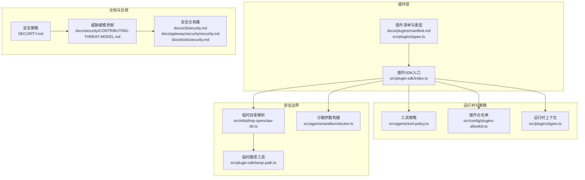
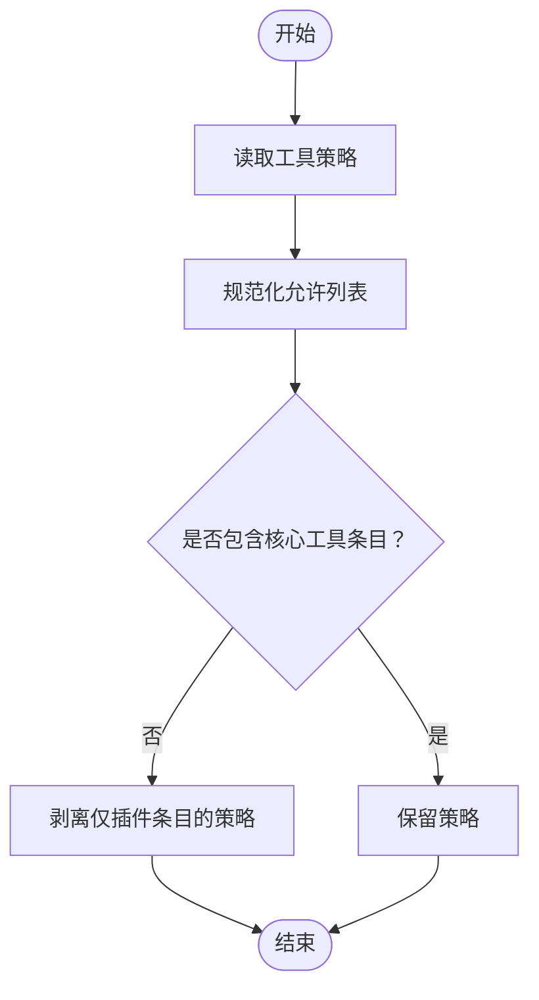
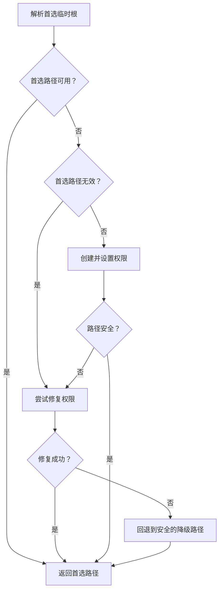
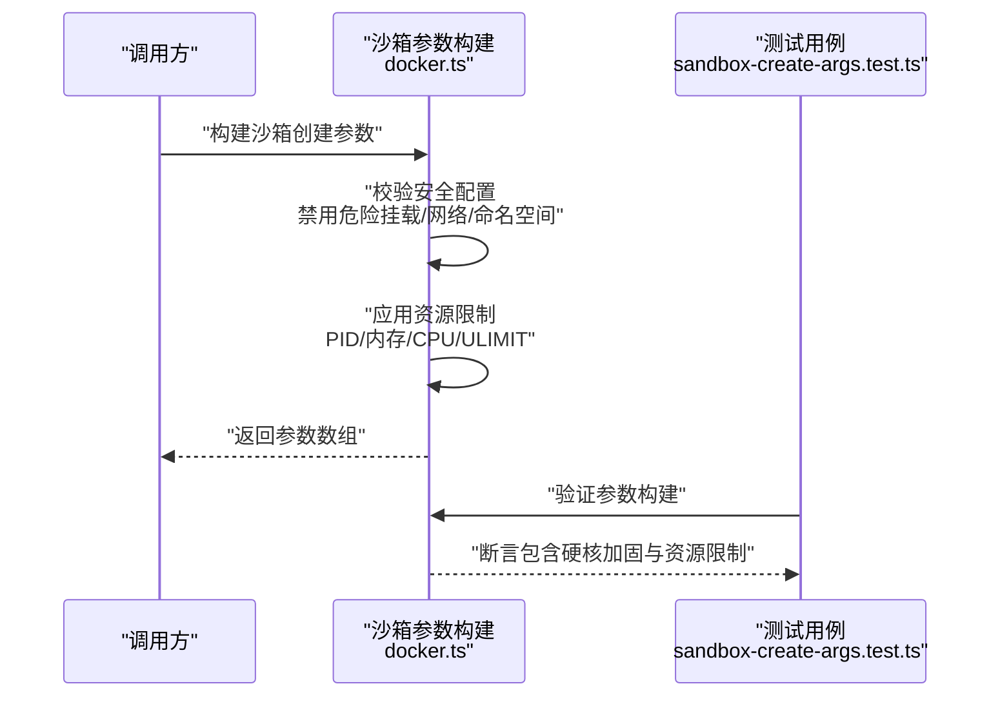
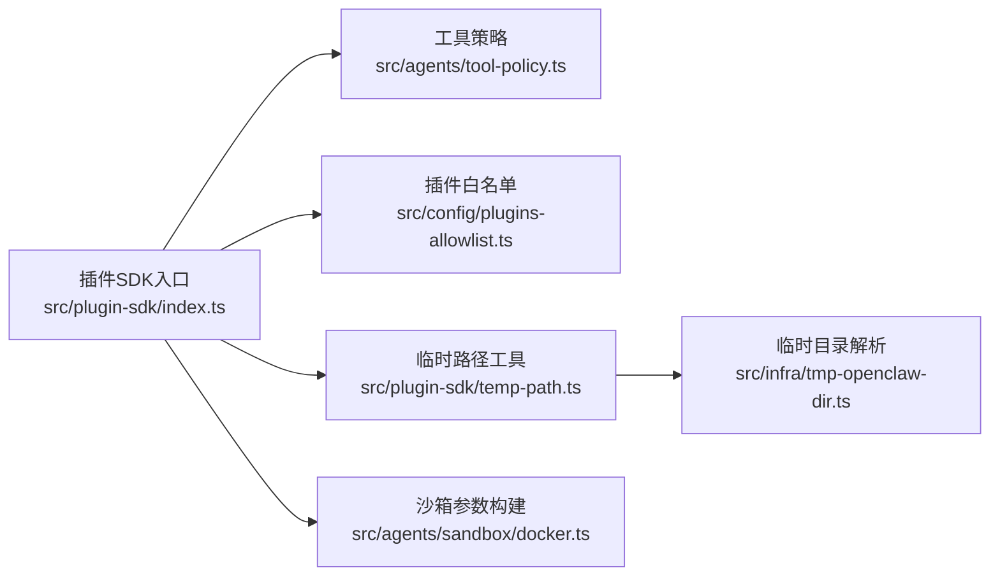

# 插件安全与权限

<cite>
**本文引用的文件**
- [SECURITY.md](file://SECURITY.md)
- [CONTRIBUTING-THREAT-MODEL.md](file://docs/security/CONTRIBUTING-THREAT-MODEL.md)
- [index.ts](file://src/plugin-sdk/index.ts)
- [types.ts](file://src/plugins/types.ts)
- [tmp-openclaw-dir.ts](file://src/infra/tmp-openclaw-dir.ts)
- [temp-path.ts](file://src/plugin-sdk/temp-path.ts)
- [tool-policy.ts](file://src/agents/tool-policy.ts)
- [plugins-allowlist.ts](file://src/config/plugins-allowlist.ts)
- [docker.ts](file://src/agents/sandbox/docker.ts)
- [sandbox-create-args.test.ts](file://src/agents/sandbox-create-args.test.ts)
- [pi-tools-agent-config.test.ts](file://src/agents/pi-tools-agent-config.test.ts)
- [manifest.md](file://docs/plugins/manifest.md)
- [plugin.md](file://docs/tools/plugin.md)
- [sandboxing.md](file://docs/gateway/sandboxing.md)
- [sandbox-vs-tool-policy-vs-elevated.md](file://docs/gateway/sandbox-vs-tool-policy-vs-elevated.md)
- [security.md](file://docs/cli/security.md)
- [security.md](file://docs/gateway/security/security.md)
- [security.md](file://docs/tools/security.md)
- [security.md](file://docs/security/formal-verification.md)
- [security.md](file://docs/security/CONTRIBUTING-THREAT-MODEL.md)
</cite>

## 目录
1. [引言](#引言)
2. [项目结构](#项目结构)
3. [核心组件](#核心组件)
4. [架构总览](#架构总览)
5. [详细组件分析](#详细组件分析)
6. [依赖关系分析](#依赖关系分析)
7. [性能考量](#性能考量)
8. [故障排查指南](#故障排查指南)
9. [结论](#结论)
10. [附录](#附录)

## 引言
本文件聚焦于 OpenClaw 的插件安全与权限管理体系，系统阐述插件权限模型、安全限制与沙箱机制，覆盖访问控制、资源隔离与安全边界，并提供安全最佳实践、漏洞防护与风险评估方法，以及插件签名验证、代码审计与安全扫描流程、插件更新与版本管理、安全配置指南与合规性要求。

## 项目结构
围绕插件安全与权限的关键代码与文档分布如下：
- 安全策略与威胁建模：根目录安全政策与威胁模型贡献指南
- 插件 SDK 与类型定义：统一导出插件能力、运行时上下文、工具与钩子接口
- 插件信任边界与临时目录安全：插件被视为可信组件，临时目录受控
- 工具策略与插件白名单：工具调用策略与插件安装白名单
- 沙箱实现与参数构建：容器级沙箱安全加固参数与校验
- 文档与规范：插件清单、工具与安全相关 CLI 文档

```mermaid
graph TB
A["安全策略<br/>SECURITY.md"] --> B["威胁建模贡献<br/>CONTRIBUTING-THREAT-MODEL.md"]
C["插件SDK入口<br/>src/plugin-sdk/index.ts"] --> D["插件类型定义<br/>src/plugins/types.ts"]
E["临时目录解析<br/>src/infra/tmp-openclaw-dir.ts"] --> F["临时路径工具<br/>src/plugin-sdk/temp-path.ts"]
G["工具策略<br/>src/agents/tool-policy.ts"] --> H["插件白名单<br/>src/config/plugins-allowlist.ts"]
I["沙箱参数构建<br/>src/agents/sandbox/docker.ts"] --> J["沙箱测试用例<br/>src/agents/sandbox-create-args.test.ts"]
K["插件工具策略测试<br/>src/agents/pi-tools-agent-config.test.ts"] --> L["插件清单规范<br/>docs/plugins/manifest.md"]
M["插件工具文档<br/>docs/tools/plugin.md"] --> N["网关沙箱文档<br/>docs/gateway/sandboxing.md"]
O["沙箱/工具策略对比<br/>docs/gateway/sandbox-vs-tool-policy-vs-elevated.md"] --> P["CLI安全命令<br/>docs/cli/security.md"]
Q["网关安全文档<br/>docs/gateway/security/security.md"] --> R["工具安全文档<br/>docs/tools/security.md"]
S["形式化验证<br/>docs/security/formal-verification.md"] --> T["威胁建模贡献<br/>docs/security/CONTRIBUTING-THREAT-MODEL.md"]
```

图示来源
- [SECURITY.md:1-293](file://SECURITY.md#L1-L293)
- [CONTRIBUTING-THREAT-MODEL.md:1-91](file://docs/security/CONTRIBUTING-THREAT-MODEL.md#L1-L91)
- [index.ts:1-872](file://src/plugin-sdk/index.ts#L1-L872)
- [types.ts:1-1775](file://src/plugins/types.ts#L1-L1775)
- [tmp-openclaw-dir.ts:1-170](file://src/infra/tmp-openclaw-dir.ts#L1-L170)
- [temp-path.ts:1-85](file://src/plugin-sdk/temp-path.ts#L1-L85)
- [tool-policy.ts:156-210](file://src/agents/tool-policy.ts#L156-L210)
- [plugins-allowlist.ts:1-15](file://src/config/plugins-allowlist.ts#L1-L15)
- [docker.ts:292-344](file://src/agents/sandbox/docker.ts#L292-L344)
- [sandbox-create-args.test.ts:41-73](file://src/agents/sandbox-create-args.test.ts#L41-L73)
- [pi-tools-agent-config.test.ts:570-611](file://src/agents/pi-tools-agent-config.test.ts#L570-L611)
- [manifest.md](file://docs/plugins/manifest.md)
- [plugin.md](file://docs/tools/plugin.md)
- [sandboxing.md](file://docs/gateway/sandboxing.md)
- [sandbox-vs-tool-policy-vs-elevated.md](file://docs/gateway/sandbox-vs-tool-policy-vs-elevated.md)
- [security.md](file://docs/cli/security.md)
- [security.md](file://docs/gateway/security/security.md)
- [security.md](file://docs/tools/security.md)
- [security.md](file://docs/security/formal-verification.md)

章节来源
- [SECURITY.md:1-293](file://SECURITY.md#L1-L293)
- [CONTRIBUTING-THREAT-MODEL.md:1-91](file://docs/security/CONTRIBUTING-THREAT-MODEL.md#L1-L91)
- [index.ts:1-872](file://src/plugin-sdk/index.ts#L1-L872)
- [types.ts:1-1775](file://src/plugins/types.ts#L1-L1775)
- [tmp-openclaw-dir.ts:1-170](file://src/infra/tmp-openclaw-dir.ts#L1-L170)
- [temp-path.ts:1-85](file://src/plugin-sdk/temp-path.ts#L1-L85)
- [tool-policy.ts:156-210](file://src/agents/tool-policy.ts#L156-L210)
- [plugins-allowlist.ts:1-15](file://src/config/plugins-allowlist.ts#L1-L15)
- [docker.ts:292-344](file://src/agents/sandbox/docker.ts#L292-L344)
- [sandbox-create-args.test.ts:41-73](file://src/agents/sandbox-create-args.test.ts#L41-L73)
- [pi-tools-agent-config.test.ts:570-611](file://src/agents/pi-tools-agent-config.test.ts#L570-L611)
- [manifest.md](file://docs/plugins/manifest.md)
- [plugin.md](file://docs/tools/plugin.md)
- [sandboxing.md](file://docs/gateway/sandboxing.md)
- [sandbox-vs-tool-policy-vs-elevated.md](file://docs/gateway/sandbox-vs-tool-policy-vs-elevated.md)
- [security.md](file://docs/cli/security.md)
- [security.md](file://docs/gateway/security/security.md)
- [security.md](file://docs/tools/security.md)
- [security.md](file://docs/security/formal-verification.md)

## 核心组件
- 插件信任模型与边界
  - 插件作为网关可信计算基的一部分，安装或启用即获得与本地主机代码相同的信任级别；插件执行读取环境变量/文件或运行主机命令的行为在该信任边界内被预期。任何安全报告必须展示越界（如未认证插件加载、允许列表/策略绕过、沙箱/路径安全绕过），而不仅是来自已安装插件的恶意行为。
- 插件 SDK 与类型系统
  - 统一导出插件工具工厂、钩子注册、运行时上下文、HTTP 路由注册、Webhook 目标解析与守卫、临时路径工具等，为插件提供一致的运行与安全接口。
- 工具策略与插件白名单
  - 工具策略可剥离仅针对插件工具的允许列表，避免误封核心工具；插件安装白名单确保仅允许受信插件进入运行时。
- 临时目录与媒体处理边界
  - 专用临时根用于媒体中转与沙箱邻接工件，严格限制绝对临时路径仅限于受管临时根；插件扩展应使用 SDK 提供的临时路径工具而非直接使用系统默认临时目录。
- 沙箱机制与参数校验
  - 容器级沙箱通过严格的参数构建与安全校验，禁用危险挂载、网络模式与安全配置，限制 PID、内存、CPU、文件句柄等资源，启用 seccomp/AppArmor 等强制保护。

章节来源
- [SECURITY.md:108-114](file://SECURITY.md#L108-L114)
- [index.ts:1-872](file://src/plugin-sdk/index.ts#L1-L872)
- [types.ts:1-1775](file://src/plugins/types.ts#L1-L1775)
- [tool-policy.ts:156-210](file://src/agents/tool-policy.ts#L156-L210)
- [plugins-allowlist.ts:1-15](file://src/config/plugins-allowlist.ts#L1-L15)
- [tmp-openclaw-dir.ts:1-170](file://src/infra/tmp-openclaw-dir.ts#L1-L170)
- [temp-path.ts:1-85](file://src/plugin-sdk/temp-path.ts#L1-L85)
- [docker.ts:292-344](file://src/agents/sandbox/docker.ts#L292-L344)

## 架构总览
下图展示插件在 OpenClaw 中的安全与权限交互架构：从插件清单与类型定义到运行时上下文、工具策略、临时目录与沙箱参数构建，再到安全边界与合规性文档。

图示来源
- [manifest.md](file://docs/plugins/manifest.md)
- [types.ts:1-1775](file://src/plugins/types.ts#L1-L1775)
- [index.ts:1-872](file://src/plugin-sdk/index.ts#L1-L872)
- [tool-policy.ts:156-210](file://src/agents/tool-policy.ts#L156-L210)
- [plugins-allowlist.ts:1-15](file://src/config/plugins-allowlist.ts#L1-L15)
- [tmp-openclaw-dir.ts:1-170](file://src/infra/tmp-openclaw-dir.ts#L1-L170)
- [temp-path.ts:1-85](file://src/plugin-sdk/temp-path.ts#L1-L85)
- [docker.ts:292-344](file://src/agents/sandbox/docker.ts#L292-L344)
- [SECURITY.md:1-293](file://SECURITY.md#L1-L293)
- [CONTRIBUTING-THREAT-MODEL.md:1-91](file://docs/security/CONTRIBUTING-THREAT-MODEL.md#L1-L91)
- [security.md](file://docs/cli/security.md)
- [security.md](file://docs/gateway/security/security.md)
- [security.md](file://docs/tools/security.md)

## 详细组件分析

### 插件权限模型与信任边界
- 插件被视为可信组件，安装/启用后即获得与本地主机代码相同的信任级别；其行为（如读取环境变量/文件、执行主机命令）在该信任边界内被预期。
- 安全报告必须展示越界（例如未认证插件加载、允许列表/策略绕过、沙箱/路径安全绕过），否则不构成越权问题。

章节来源
- [SECURITY.md:108-114](file://SECURITY.md#L108-L114)

### 插件 SDK 与运行时上下文
- SDK 导出插件工具工厂、钩子注册、运行时上下文、HTTP 路由注册、Webhook 目标解析与守卫、临时路径工具等，统一插件开发与运行接口。
- 运行时上下文包含会话键、请求者标识、是否所有者、沙箱状态等，用于策略与授权判断。

章节来源
- [index.ts:1-872](file://src/plugin-sdk/index.ts#L1-L872)
- [types.ts:72-87](file://src/plugins/types.ts#L72-L87)

### 工具策略与插件白名单
- 工具策略剥离仅针对插件工具的允许列表，避免误封核心工具；混合核心与插件条目时保留策略。
- 插件安装白名单确保仅允许受信插件进入运行时，自动补齐缺失的插件 ID。

图示来源
- [tool-policy.ts:156-210](file://src/agents/tool-policy.ts#L156-L210)
- [plugins-allowlist.ts:1-15](file://src/config/plugins-allowlist.ts#L1-L15)

章节来源
- [tool-policy.ts:156-210](file://src/agents/tool-policy.ts#L156-L210)
- [plugins-allowlist.ts:1-15](file://src/config/plugins-allowlist.ts#L1-L15)

### 临时目录与媒体处理边界
- 专用临时根用于媒体中转与沙箱邻接工件，严格限制绝对临时路径仅限于受管临时根；插件扩展应使用 SDK 提供的临时路径工具而非直接使用系统默认临时目录。
- 临时目录解析具备权限修复与降级回退逻辑，确保安全性与可用性。

图示来源
- [tmp-openclaw-dir.ts:34-169](file://src/infra/tmp-openclaw-dir.ts#L34-L169)
- [temp-path.ts:43-84](file://src/plugin-sdk/temp-path.ts#L43-L84)

章节来源
- [tmp-openclaw-dir.ts:1-170](file://src/infra/tmp-openclaw-dir.ts#L1-L170)
- [temp-path.ts:1-85](file://src/plugin-sdk/temp-path.ts#L1-L85)
- [SECURITY.md:195-211](file://SECURITY.md#L195-L211)

### 沙箱机制与参数校验
- 容器级沙箱通过严格的参数构建与安全校验，禁用危险挂载、网络模式与安全配置，限制 PID、内存、CPU、文件句柄等资源，启用 seccomp/AppArmor 等强制保护。
- 测试用例覆盖硬核加固与资源限制标志，确保沙箱配置符合安全基线。

图示来源
- [docker.ts:292-344](file://src/agents/sandbox/docker.ts#L292-L344)
- [sandbox-create-args.test.ts:41-73](file://src/agents/sandbox-create-args.test.ts#L41-L73)

章节来源
- [docker.ts:292-344](file://src/agents/sandbox/docker.ts#L292-L344)
- [sandbox-create-args.test.ts:41-73](file://src/agents/sandbox-create-args.test.ts#L41-L73)
- [pi-tools-agent-config.test.ts:570-611](file://src/agents/pi-tools-agent-config.test.ts#L570-L611)

### 插件清单与工具文档
- 插件清单规范定义了插件元数据与能力声明，确保在安装前进行最小权限与功能对齐。
- 插件工具文档涵盖工具注册、权限与安全注意事项，指导插件开发者遵循最小权限原则。

章节来源
- [manifest.md](file://docs/plugins/manifest.md)
- [plugin.md](file://docs/tools/plugin.md)

### 网关安全与沙箱对比
- 网关安全文档提供安全审计与加固建议，包括工具文件系统硬核、子代理委派硬核、Web 界面安全等。
- 沙箱与工具策略、提升权限三者边界清晰：沙箱提供执行环境隔离，工具策略控制工具调用范围，提升权限用于特定高危操作的显式授权。

章节来源
- [security.md](file://docs/gateway/security/security.md)
- [sandboxing.md](file://docs/gateway/sandboxing.md)
- [sandbox-vs-tool-policy-vs-elevated.md](file://docs/gateway/sandbox-vs-tool-policy-vs-elevated.md)

## 依赖关系分析
- 插件 SDK 对工具策略与插件白名单存在直接依赖，以确保插件工具在策略范围内运行且仅允许受信插件。
- 临时路径工具依赖临时目录解析，保障插件在受控临时根内进行媒体处理。
- 沙箱参数构建依赖安全校验逻辑，确保容器运行时安全基线。

图示来源
- [index.ts:1-872](file://src/plugin-sdk/index.ts#L1-L872)
- [tool-policy.ts:156-210](file://src/agents/tool-policy.ts#L156-L210)
- [plugins-allowlist.ts:1-15](file://src/config/plugins-allowlist.ts#L1-L15)
- [temp-path.ts:1-85](file://src/plugin-sdk/temp-path.ts#L1-L85)
- [tmp-openclaw-dir.ts:1-170](file://src/infra/tmp-openclaw-dir.ts#L1-L170)
- [docker.ts:292-344](file://src/agents/sandbox/docker.ts#L292-L344)

章节来源
- [index.ts:1-872](file://src/plugin-sdk/index.ts#L1-L872)
- [tool-policy.ts:156-210](file://src/agents/tool-policy.ts#L156-L210)
- [plugins-allowlist.ts:1-15](file://src/config/plugins-allowlist.ts#L1-L15)
- [temp-path.ts:1-85](file://src/plugin-sdk/temp-path.ts#L1-L85)
- [tmp-openclaw-dir.ts:1-170](file://src/infra/tmp-openclaw-dir.ts#L1-L170)
- [docker.ts:292-344](file://src/agents/sandbox/docker.ts#L292-L344)

## 性能考量
- 沙箱参数构建与安全校验在启动阶段完成，避免运行时频繁校验带来的开销。
- 临时路径工具采用临时目录与清理策略，减少磁盘碎片与 IO 压力。
- 工具策略剥离仅插件条目可降低策略解析复杂度，避免不必要的策略匹配成本。

## 故障排查指南
- 插件越界与信任模型
  - 若报告仅涉及已安装插件的恶意行为，需补充越界证据（未认证插件加载、允许列表/策略绕过、沙箱/路径安全绕过）。
- 临时目录与媒体处理
  - 确认插件使用 SDK 提供的临时路径工具；检查临时根权限与可用性，必要时触发权限修复或降级回退。
- 沙箱参数与资源限制
  - 检查沙箱参数构建日志与测试用例断言，确认资源限制与安全配置未被错误放宽。
- 工具策略与插件白名单
  - 验证策略是否正确剥离仅插件条目；确认插件白名单包含必要的插件 ID。

章节来源
- [SECURITY.md:49-71](file://SECURITY.md#L49-L71)
- [tmp-openclaw-dir.ts:34-169](file://src/infra/tmp-openclaw-dir.ts#L34-L169)
- [temp-path.ts:43-84](file://src/plugin-sdk/temp-path.ts#L43-L84)
- [docker.ts:292-344](file://src/agents/sandbox/docker.ts#L292-L344)
- [tool-policy.ts:156-210](file://src/agents/tool-policy.ts#L156-L210)
- [plugins-allowlist.ts:1-15](file://src/config/plugins-allowlist.ts#L1-L15)

## 结论
OpenClaw 的插件安全与权限体系以“插件信任模型”为核心，结合工具策略、插件白名单、临时目录边界与容器级沙箱参数校验，形成多层安全防线。遵循最小权限原则、严格越界验证与持续安全审计，是保障插件生态安全的关键。

## 附录

### 安全最佳实践
- 仅安装受信插件并启用插件白名单；定期审查允许列表。
- 使用 SDK 提供的临时路径工具，避免直接使用系统默认临时目录。
- 启用沙箱并配置资源限制与安全配置；避免放宽安全基线。
- 在工具策略中明确最小权限，避免过度授权。

章节来源
- [SECURITY.md:212-250](file://SECURITY.md#L212-L250)
- [SECURITY.md:251-293](file://SECURITY.md#L251-L293)
- [tool-policy.ts:156-210](file://src/agents/tool-policy.ts#L156-L210)
- [plugins-allowlist.ts:1-15](file://src/config/plugins-allowlist.ts#L1-L15)
- [temp-path.ts:1-85](file://src/plugin-sdk/temp-path.ts#L1-L85)
- [docker.ts:292-344](file://src/agents/sandbox/docker.ts#L292-L344)

### 漏洞防护与风险评估
- 利用威胁建模贡献流程识别与评估潜在攻击向量，结合 MITRE ATLAS 框架进行分类与风险分级。
- 定期进行安全扫描与代码审计，关注越界与信任模型相关的风险点。

章节来源
- [CONTRIBUTING-THREAT-MODEL.md:1-91](file://docs/security/CONTRIBUTING-THREAT-MODEL.md#L1-L91)
- [SECURITY.md:282-293](file://SECURITY.md#L282-L293)

### 插件签名验证、代码审计与安全扫描流程
- 插件签名验证：在安装前对插件包进行完整性与来源验证，确保与受信发布源一致。
- 代码审计：基于工具策略与沙箱参数校验结果，重点审查插件对系统资源与外部服务的访问路径。
- 安全扫描：利用 detect-secrets 等工具进行自动化扫描，结合安全策略进行人工复核。

章节来源
- [SECURITY.md:282-293](file://SECURITY.md#L282-L293)

### 插件更新机制、版本管理与安全补丁发布
- 版本管理：遵循语义化版本，记录破坏性变更与安全修复。
- 更新机制：优先通过受信渠道分发更新，确保更新包签名与完整性校验。
- 安全补丁发布：在发现漏洞后，及时发布补丁并通知用户升级。

章节来源
- [SECURITY.md:1-293](file://SECURITY.md#L1-L293)

### 安全配置指南与合规性要求
- 网关绑定与访问控制：推荐本地回环绑定，避免公网暴露；使用强认证与防火墙控制。
- Docker 安全：非 root 用户运行、只读文件系统、丢弃多余容器能力。
- 形式化验证：参考形式化验证文档，提升关键模块的正确性与安全性。

章节来源
- [SECURITY.md:232-281](file://SECURITY.md#L232-L281)
- [security.md](file://docs/security/formal-verification.md)