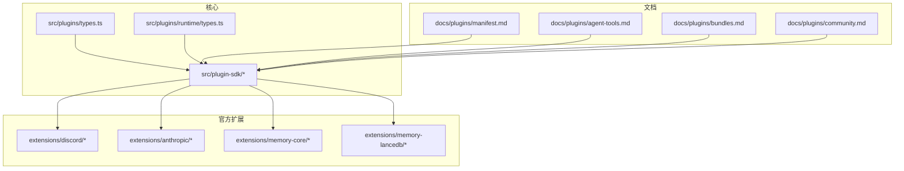
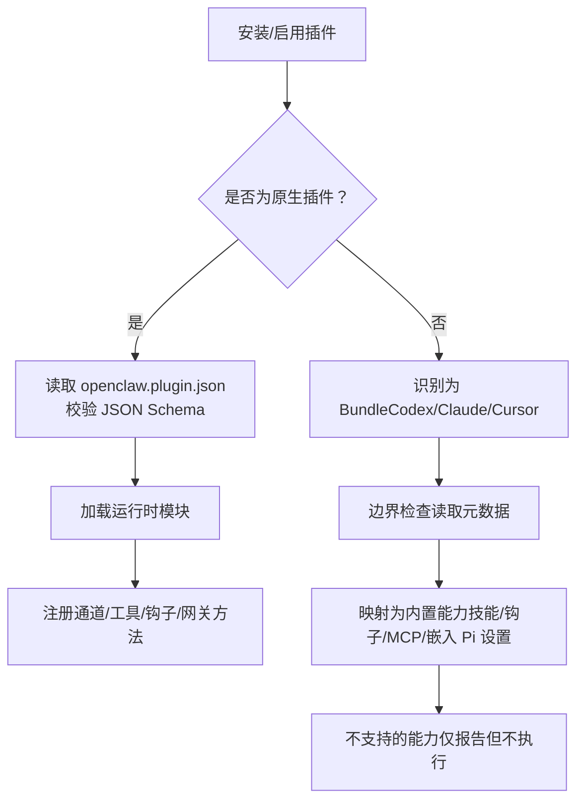
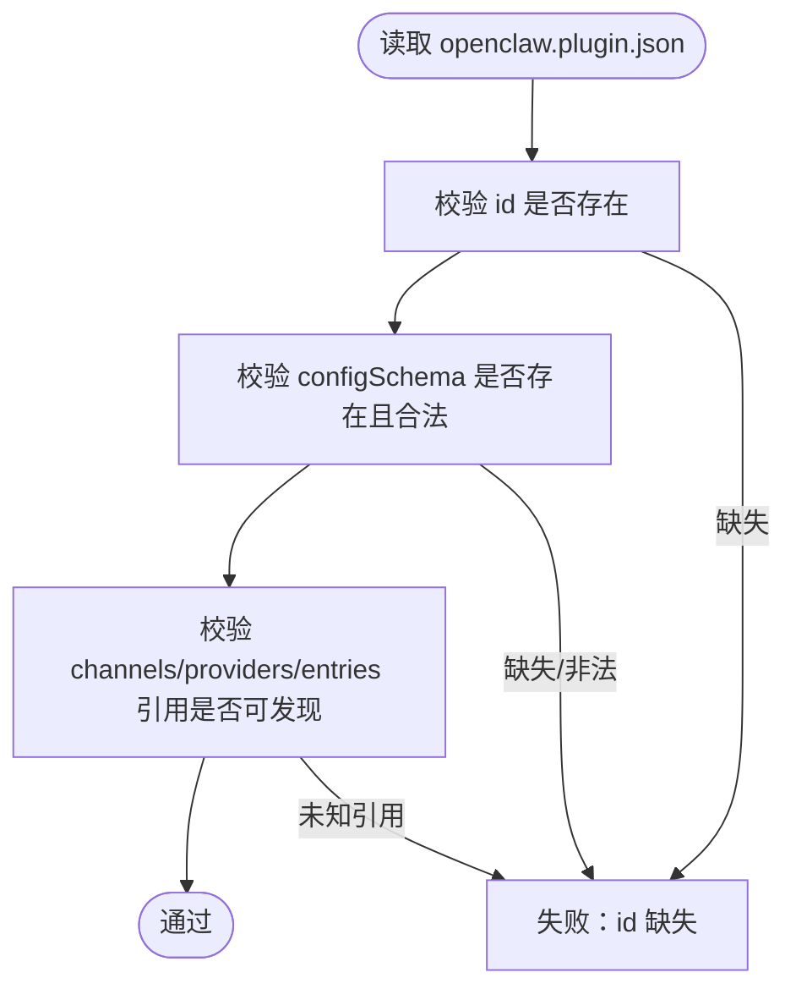
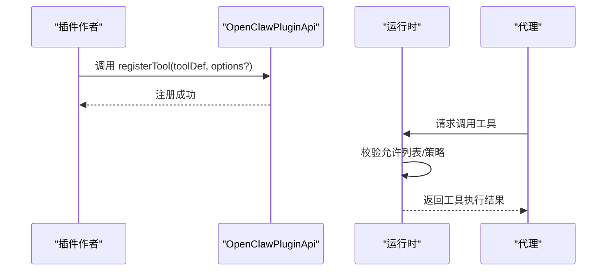
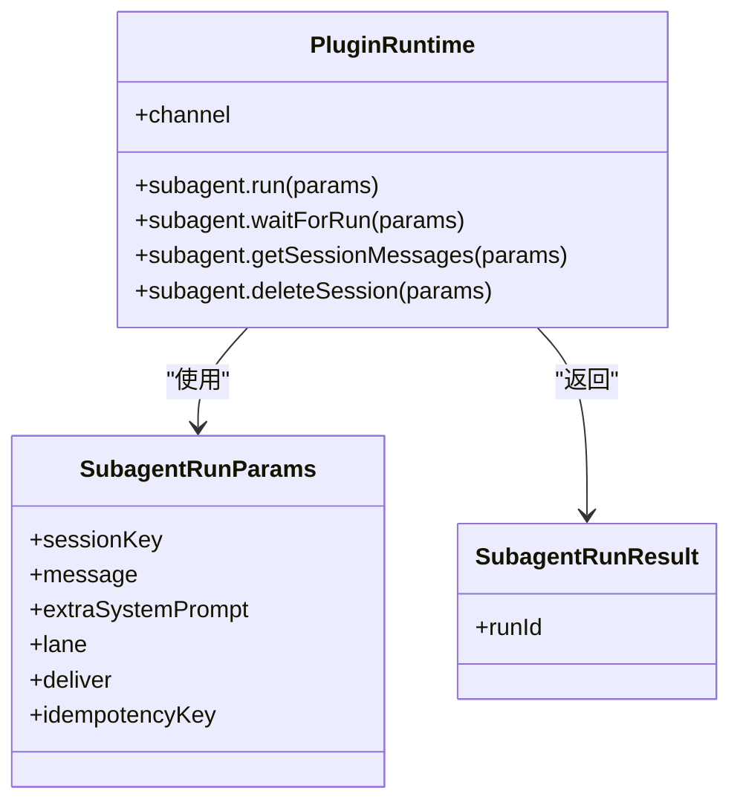
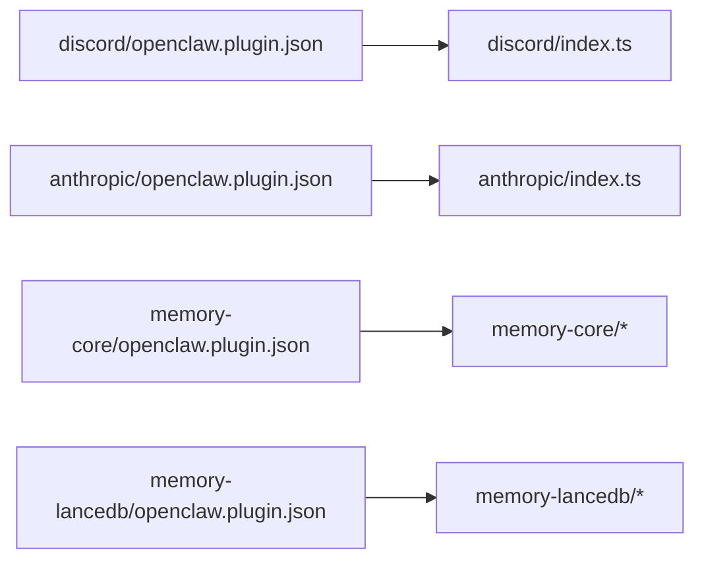
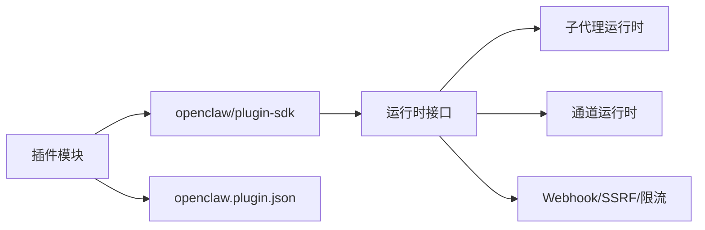

# 插件开发指南

<cite>
**本文引用的文件**
- [docs/plugins/manifest.md](file://docs/plugins/manifest.md)
- [docs/plugins/agent-tools.md](file://docs/plugins/agent-tools.md)
- [docs/plugins/bundles.md](file://docs/plugins/bundles.md)
- [docs/plugins/community.md](file://docs/plugins/community.md)
- [src/plugin-sdk/index.ts](file://src/plugin-sdk/index.ts)
- [src/plugin-sdk/allowlist-resolution.ts](file://src/plugin-sdk/allowlist-resolution.ts)
- [src/plugins/types.ts](file://src/plugins/types.ts)
- [src/plugins/runtime/types.ts](file://src/plugins/runtime/types.ts)
- [extensions/discord/openclaw.plugin.json](file://extensions/discord/openclaw.plugin.json)
- [extensions/anthropic/openclaw.plugin.json](file://extensions/anthropic/openclaw.plugin.json)
- [extensions/memory-lancedb/openclaw.plugin.json](file://extensions/memory-lancedb/openclaw.plugin.json)
- [extensions/memory-core/openclaw.plugin.json](file://extensions/memory-core/openclaw.plugin.json)
- [extensions/discord/index.ts](file://extensions/discord/index.ts)
- [extensions/anthropic/index.ts](file://extensions/anthropic/index.ts)
</cite>

## 目录
1. [简介](#简介)
2. [项目结构](#项目结构)
3. [核心组件](#核心组件)
4. [架构总览](#架构总览)
5. [详细组件分析](#详细组件分析)
6. [依赖分析](#依赖分析)
7. [性能考虑](#性能考虑)
8. [故障排除指南](#故障排除指南)
9. [结论](#结论)
10. [附录](#附录)

## 简介
本指南面向希望为 OpenClaw 开发与发布插件的开发者，覆盖从项目结构、清单文件格式、依赖与元数据配置，到工具注册、打包分发、版本管理、调试与性能优化、以及权限与安全沙箱等全生命周期内容。OpenClaw 支持两类插件形态：
- 原生插件：以 openclaw.plugin.json 清单 + 运行时模块的形式在进程内执行。
- 包装插件（Bundle）：兼容 Codex/Clude/Cursor 的外部包，由 OpenClaw 解析元数据映射为内置能力。

## 项目结构
OpenClaw 插件生态主要分布在以下位置：
- 核心 SDK 与类型定义：src/plugin-sdk 与 src/plugins
- 官方扩展插件：extensions/<name>（如 discord、anthropic、memory-*）
- 文档与规范：docs/plugins/*.md
- 插件清单样例：各扩展目录下的 openclaw.plugin.json

**图表来源**
- [src/plugin-sdk/index.ts:1-800](file://src/plugin-sdk/index.ts#L1-L800)
- [src/plugins/types.ts:1-800](file://src/plugins/types.ts#L1-L800)
- [src/plugins/runtime/types.ts:1-64](file://src/plugins/runtime/types.ts#L1-L64)
- [docs/plugins/manifest.md:1-100](file://docs/plugins/manifest.md#L1-L100)
- [docs/plugins/agent-tools.md:1-100](file://docs/plugins/agent-tools.md#L1-L100)
- [docs/plugins/bundles.md:1-293](file://docs/plugins/bundles.md#L1-L293)
- [docs/plugins/community.md:1-52](file://docs/plugins/community.md#L1-L52)

**章节来源**
- [src/plugin-sdk/index.ts:1-800](file://src/plugin-sdk/index.ts#L1-L800)
- [src/plugins/types.ts:1-800](file://src/plugins/types.ts#L1-L800)
- [src/plugins/runtime/types.ts:1-64](file://src/plugins/runtime/types.ts#L1-L64)
- [docs/plugins/manifest.md:1-100](file://docs/plugins/manifest.md#L1-L100)
- [docs/plugins/agent-tools.md:1-100](file://docs/plugins/agent-tools.md#L1-L100)
- [docs/plugins/bundles.md:1-293](file://docs/plugins/bundles.md#L1-L293)
- [docs/plugins/community.md:1-52](file://docs/plugins/community.md#L1-L52)

## 核心组件
- 插件 SDK 入口与导出：统一导出插件 API、运行时、通道适配器、工具与钩子、Webhook、SSRF 防护、状态辅助等能力。
- 插件类型系统：定义 OpenClawPluginApi、ProviderPlugin、OpenClawPluginTool 等核心类型，约束插件注册与运行契约。
- 插件运行时：提供子代理（subagent）运行、等待、会话消息查询与删除等接口；通道运行时抽象。
- 工具与清单：支持在插件中注册 agent 工具（可选/必选），并通过 openclaw.plugin.json 提供严格 JSON Schema 校验与 UI 提示。

**章节来源**
- [src/plugin-sdk/index.ts:1-800](file://src/plugin-sdk/index.ts#L1-L800)
- [src/plugins/types.ts:1-800](file://src/plugins/types.ts#L1-L800)
- [src/plugins/runtime/types.ts:1-64](file://src/plugins/runtime/types.ts#L1-L64)

## 架构总览
OpenClaw 插件系统分为“原生插件”和“包装插件”两条路径。原生插件通过 openclaw.plugin.json 清单进行发现与校验，随后加载运行时模块；包装插件则由 OpenClaw 读取其元数据并映射为内置特性。

**图表来源**
- [docs/plugins/bundles.md:31-83](file://docs/plugins/bundles.md#L31-L83)
- [docs/plugins/manifest.md:29-34](file://docs/plugins/manifest.md#L29-L34)

**章节来源**
- [docs/plugins/bundles.md:1-293](file://docs/plugins/bundles.md#L1-L293)
- [docs/plugins/manifest.md:1-100](file://docs/plugins/manifest.md#L1-L100)

## 详细组件分析

### 组件 A：插件清单与 JSON Schema（openclaw.plugin.json）
- 必填字段
  - id：插件标识符（必须全局唯一）
  - configSchema：插件配置的 JSON Schema（即使无配置也必须提供）
- 可选字段
  - kind：插件种类（如 memory/context-engine）
  - channels/providers：该插件注册的频道/提供商 ID 列表
  - providerAuthEnvVars：提供商凭据环境变量映射（用于免启动探测）
  - skills：相对插件根目录的技能目录列表
  - name/description/uiHints/version：展示与 UI 提示信息
- 校验行为
  - 未知 channels.* 或插件 id 将被视为错误
  - 插件禁用但配置存在时，保留配置并在诊断中警告
- 兼容性
  - 原生插件清单是必需的，包括本地文件系统加载场景
  - providerAuthEnvVars 用于低成本的凭据探针与环境变量校验

**图表来源**
- [docs/plugins/manifest.md:36-84](file://docs/plugins/manifest.md#L36-L84)

**章节来源**
- [docs/plugins/manifest.md:1-100](file://docs/plugins/manifest.md#L1-L100)

### 组件 B：插件工具注册（Agent Tools）
- 工具类型
  - 必选工具：默认可用
  - 可选工具：需通过 allowlists 显式启用
- 注册方式
  - 在插件入口函数中调用 api.registerTool(...) 注册
  - 可通过 { optional: true } 指定为可选
- 可见性与策略
  - 通过 agents[].tools.allow / tools.allow 控制
  - 支持按插件 id 或前缀启用整组工具
  - 受工具策略、按提供商分组、沙箱策略等影响

**图表来源**
- [docs/plugins/agent-tools.md:19-84](file://docs/plugins/agent-tools.md#L19-L84)
- [src/plugins/types.ts:89-98](file://src/plugins/types.ts#L89-L98)

**章节来源**
- [docs/plugins/agent-tools.md:1-100](file://docs/plugins/agent-tools.md#L1-L100)
- [src/plugins/types.ts:89-98](file://src/plugins/types.ts#L89-L98)

### 组件 C：插件运行时与子代理（Subagent）
- 子代理运行接口
  - run：提交一次会话运行请求
  - waitForRun：等待运行完成或超时
  - getSessionMessages：查询会话消息
  - deleteSession：删除会话（可选清理转录）
- 通道运行时
  - 通过 api.runtime.channel 访问通道特定能力

**图表来源**
- [src/plugins/runtime/types.ts:8-63](file://src/plugins/runtime/types.ts#L8-L63)

**章节来源**
- [src/plugins/runtime/types.ts:1-64](file://src/plugins/runtime/types.ts#L1-L64)

### 组件 D：插件 SDK 入口与导出
- SDK 统一导出大量能力，包括：
  - 通道适配器与类型（Discord/iMessage/Slack/Telegram/Signal/WhatsApp/LINE 等）
  - 工具与钩子、Webhook、SSRF 防护、状态辅助、OAuth 工具、临时路径、命令运行等
  - 运行时工具（日志、时间、去重缓存、持久化去重、HTTP 体限制、速率限制等）
- 插件应仅通过 SDK 导出访问运行时，避免直接导入内部 src 实现

**章节来源**
- [src/plugin-sdk/index.ts:1-800](file://src/plugin-sdk/index.ts#L1-L800)

### 组件 E：插件示例与清单样例
- Discord 插件
  - 清单：声明 channels: ["discord"]
  - 注册：设置运行时并注册频道插件，按注册模式决定是否加载子代理钩子
- Anthropic 提供商插件
  - 清单：声明 providers: ["anthropic"] 与 providerAuthEnvVars
  - 注册：实现 ProviderPlugin，包含认证方法、动态模型解析、默认思考级别、缓存 TTL 等
- Memory 插件
  - memory-core：基础内存插件，kind: "memory"
  - memory-lancedb：带 UI 提示与 JSON Schema 的向量内存插件，含敏感字段标记与高级选项

**图表来源**
- [extensions/discord/openclaw.plugin.json:1-10](file://extensions/discord/openclaw.plugin.json#L1-L10)
- [extensions/discord/index.ts:1-23](file://extensions/discord/index.ts#L1-L23)
- [extensions/anthropic/openclaw.plugin.json:1-13](file://extensions/anthropic/openclaw.plugin.json#L1-L13)
- [extensions/anthropic/index.ts:1-319](file://extensions/anthropic/index.ts#L1-L319)
- [extensions/memory-core/openclaw.plugin.json:1-10](file://extensions/memory-core/openclaw.plugin.json#L1-L10)
- [extensions/memory-lancedb/openclaw.plugin.json:1-89](file://extensions/memory-lancedb/openclaw.plugin.json#L1-L89)

**章节来源**
- [extensions/discord/openclaw.plugin.json:1-10](file://extensions/discord/openclaw.plugin.json#L1-L10)
- [extensions/discord/index.ts:1-23](file://extensions/discord/index.ts#L1-L23)
- [extensions/anthropic/openclaw.plugin.json:1-13](file://extensions/anthropic/openclaw.plugin.json#L1-L13)
- [extensions/anthropic/index.ts:1-319](file://extensions/anthropic/index.ts#L1-L319)
- [extensions/memory-core/openclaw.plugin.json:1-10](file://extensions/memory-core/openclaw.plugin.json#L1-L10)
- [extensions/memory-lancedb/openclaw.plugin.json:1-89](file://extensions/memory-lancedb/openclaw.plugin.json#L1-L89)

### 组件 F：插件包与分发（Bundle）
- 支持的 Bundle 生态：Codex、Claude、Cursor
- 行为差异
  - Codex：.codex-plugin/plugin.json + skills/hooks/.mcp.json/.app.json
  - Claude：manifest 或默认布局（skills/commands/agents/hooks/.mcp.json/.lsp.json/settings.json）
  - Cursor：.cursor-plugin/plugin.json + skills/.cursor/commands/.cursor/agents/.cursor/rules/.cursor/hooks.json/.mcp.json
- 安全边界
  - Bundle 不在进程中执行运行时代码，仅映射已支持的内置能力
  - 对路径与设置文件进行边界检查

**章节来源**
- [docs/plugins/bundles.md:1-293](file://docs/plugins/bundles.md#L1-L293)

### 组件 G：社区插件与质量标准
- 上架要求
  - npm 发布、GitHub 源码仓库、清晰文档与问题跟踪、维护信号
- 提交流程
  - 通过 PR 添加条目，包含名称、npm 包名、仓库地址、简述与安装命令
- 评审标准
  - 功能实用、文档完善、安全可靠；低质量或无人维护的插件可能被拒绝

**章节来源**
- [docs/plugins/community.md:1-52](file://docs/plugins/community.md#L1-L52)

## 依赖分析
- 插件对 SDK 的依赖
  - 插件通过 openclaw/plugin-sdk 导出访问运行时与工具，避免直接导入 src 内部实现
- 插件对清单的依赖
  - openclaw.plugin.json 是发现与校验的唯一依据，缺失或非法会导致安装/验证失败
- 插件对运行时的依赖
  - 子代理运行、通道适配、Webhook、SSRF 防护等均通过运行时接口提供

**图表来源**
- [src/plugin-sdk/index.ts:1-800](file://src/plugin-sdk/index.ts#L1-L800)
- [src/plugins/runtime/types.ts:1-64](file://src/plugins/runtime/types.ts#L1-L64)
- [docs/plugins/manifest.md:29-34](file://docs/plugins/manifest.md#L29-L34)

**章节来源**
- [src/plugin-sdk/index.ts:1-800](file://src/plugin-sdk/index.ts#L1-L800)
- [src/plugins/runtime/types.ts:1-64](file://src/plugins/runtime/types.ts#L1-L64)
- [docs/plugins/manifest.md:1-100](file://docs/plugins/manifest.md#L1-L100)

## 性能考虑
- 工具与钩子
  - 尽量将昂贵操作异步化，避免阻塞运行时
  - 对可选工具采用延迟初始化与缓存策略
- 子代理运行
  - 合理设置 lane 与幂等键，减少重复计算
  - 使用 getSessionMessages 获取增量上下文，避免全量传输
- Webhook 与 SSRF
  - 使用内置的请求体限制与速率限制，防止资源滥用
  - 严格遵循 SSRF 策略，避免访问私有网络

[本节为通用指导，无需具体文件分析]

## 故障排除指南
- 清单与配置
  - 若提示未知 channels.* 或插件 id，检查 openclaw.plugin.json 中的声明与引用
  - 插件禁用但配置存在时，保留配置并在 Doctor 中查看警告
- Bundle 能力未生效
  - 使用 openclaw plugins info <id> 查看能力映射，确认是否“检测到但未连线”
  - Claude commands/agents/hooks/settings 等当前支持有限
- 工具不可用
  - 检查 agents[].tools.allow 或全局 tools.allow 是否包含对应插件或工具名
  - 可选工具需显式启用
- 权限与安全
  - Bundle 不在进程中执行运行时代码，仅映射已支持的内置能力
  - 对第三方 Bundle 保持谨慎，仅信任已暴露的功能

**章节来源**
- [docs/plugins/manifest.md:74-84](file://docs/plugins/manifest.md#L74-L84)
- [docs/plugins/bundles.md:139-157](file://docs/plugins/bundles.md#L139-L157)
- [docs/plugins/agent-tools.md:65-93](file://docs/plugins/agent-tools.md#L65-L93)

## 结论
OpenClaw 插件体系以严格的清单与 JSON Schema 校验为基础，结合丰富的 SDK 能力与运行时接口，既支持原生插件的强能力扩展，又通过 Bundle 机制兼容多生态外部包。开发者应优先遵循清单规范、合理设计工具与钩子、充分利用运行时提供的安全与性能工具，并通过社区标准进行高质量分发。

[本节为总结，无需具体文件分析]

## 附录

### A. 插件清单字段速查
- 必填
  - id：插件标识符
  - configSchema：JSON Schema（即使空对象也必须）
- 常用可选
  - kind：插件种类（如 memory/context-engine）
  - channels/providers：注册的频道/提供商 ID
  - providerAuthEnvVars：提供商凭据环境变量映射
  - skills：技能目录列表
  - name/description/uiHints/version：展示与 UI 提示

**章节来源**
- [docs/plugins/manifest.md:36-67](file://docs/plugins/manifest.md#L36-L67)

### B. 插件工具注册要点
- 必选 vs 可选：通过 { optional: true } 区分
- 启用方式：agents[].tools.allow 或 tools.allow
- 冲突规避：工具名不得与核心工具冲突

**章节来源**
- [docs/plugins/agent-tools.md:19-93](file://docs/plugins/agent-tools.md#L19-L93)

### C. 插件开发模板（步骤）
- 创建 openclaw.plugin.json，填写 id 与 configSchema
- 在插件入口中实现 register(api)，按需注册 Provider/Channel/Tool/Hook/Runtime
- 如需可选工具，提供 UI 提示与最小化配置项
- 通过本地安装与 Doctor 校验清单与配置

**章节来源**
- [docs/plugins/manifest.md:29-34](file://docs/plugins/manifest.md#L29-L34)
- [src/plugin-sdk/index.ts:1-800](file://src/plugin-sdk/index.ts#L1-L800)