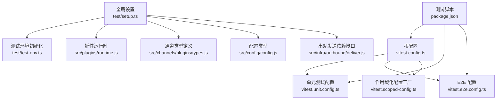
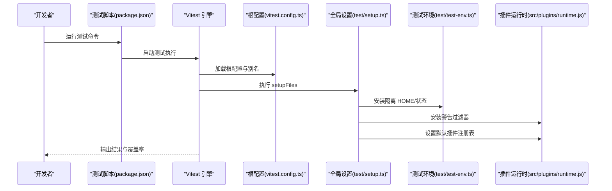
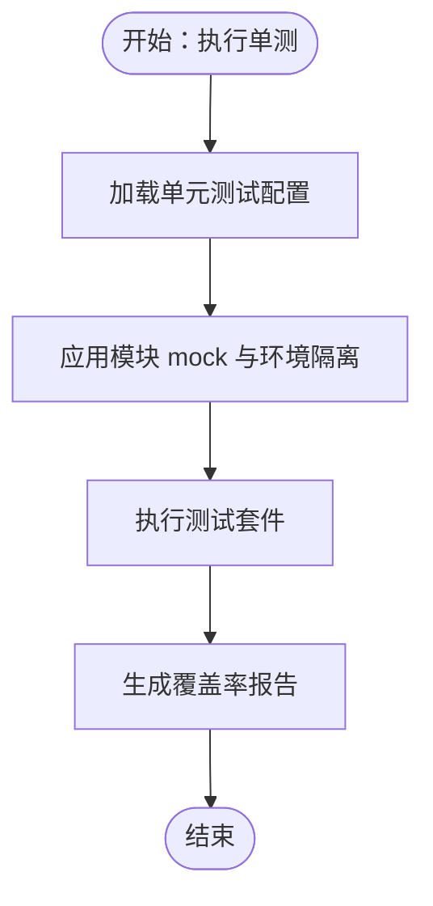
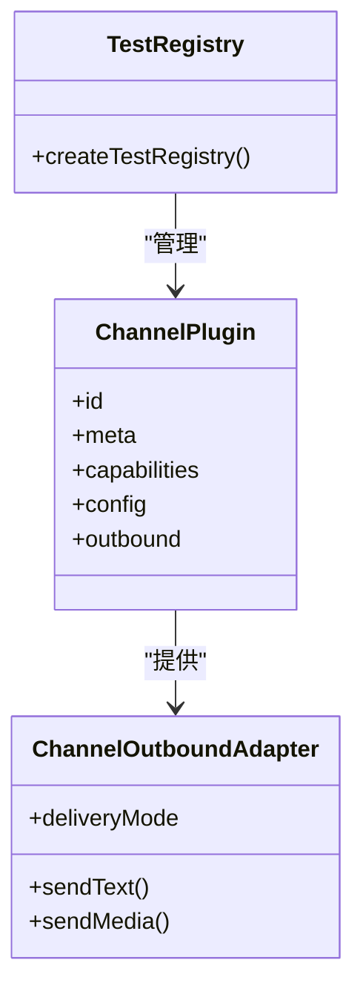
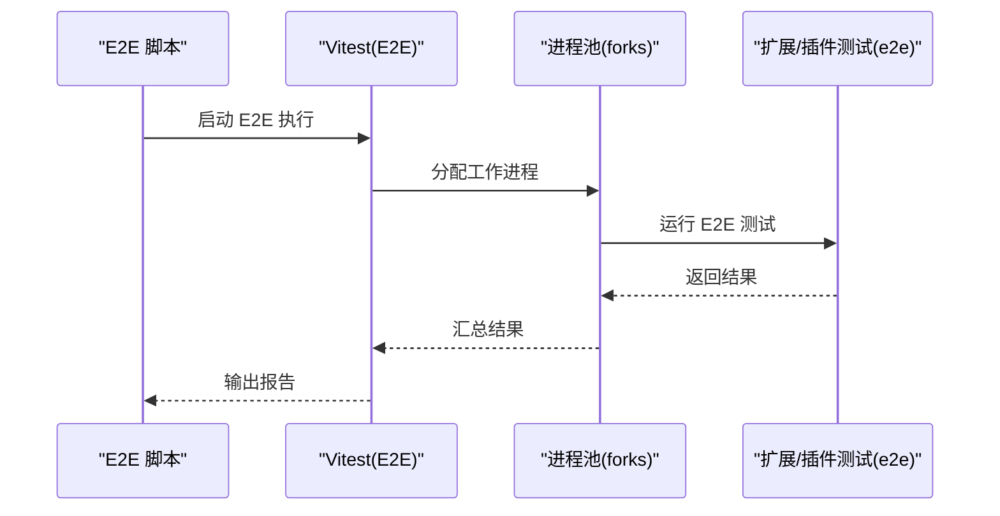
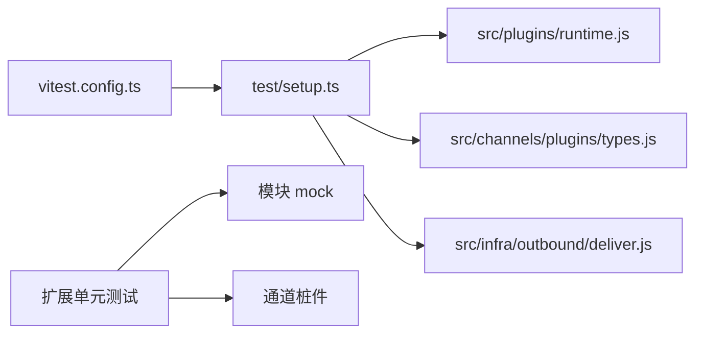

# 插件测试与调试

<cite>
**本文引用的文件**
- [vitest.config.ts](file://vitest.config.ts)
- [vitest.unit.config.ts](file://vitest.unit.config.ts)
- [vitest.e2e.config.ts](file://vitest.e2e.config.ts)
- [vitest.scoped-config.ts](file://vitest.scoped-config.ts)
- [package.json](file://package.json)
- [test/setup.ts](file://test/setup.ts)
- [test/global-setup.ts](file://test/global-setup.ts)
- [test/test-env.ts](file://test/test-env.ts)
- [test/test-utils/channel-plugins.ts](file://test/test-utils/channel-plugins.ts)
- [src/plugins/runtime.js](file://src/plugins/runtime.js)
- [src/infra/warning-filter.js](file://src/infra/warning-filter.js)
- [src/channels/plugins/types.js](file://src/channels/plugins/types.js)
- [src/config/config.js](file://src/config/config.js)
- [src/infra/outbound/deliver.js](file://src/infra/outbound/deliver.js)
- [extensions/anthropic/index.test.ts](file://extensions/anthropic/index.test.ts)
- [extensions/anthropic/index.ts](file://extensions/anthropic/index.ts)
- [extensions/github-copilot/index.test.ts](file://extensions/github-copilot/index.test.ts)
- [extensions/github-copilot/token.test.ts](file://extensions/github-copilot/token.test.ts)
- [extensions/github-copilot/usage.test.ts](file://extensions/github-copilot/usage.test.ts)
- [extensions/google/oauth.test.ts](file://extensions/google/oauth.test.ts)
- [extensions/google/oauth.token.ts](file://extensions/google/oauth.token.ts)
- [extensions/google/oauth.flow.ts](file://extensions/google/oauth.flow.ts)
- [extensions/google/oauth.http.ts](file://extensions/google/oauth.http.ts)
- [extensions/google/oauth.project.ts](file://extensions/google/oauth.project.ts)
- [extensions/google/oauth.shared.ts](file://extensions/google/oauth.shared.ts)
- [extensions/google/oauth.credentials.ts](file://extensions/google/oauth.credentials.ts)
- [extensions/google/oauth.ts](file://extensions/google/oauth.ts)
- [extensions/google/index.ts](file://extensions/google/index.ts)
- [extensions/firecrawl/index.test.ts](file://extensions/firecrawl/index.test.ts)
- [extensions/firecrawl/index.ts](file://extensions/firecrawl/index.ts)
- [extensions/diffs/index.test.ts](file://extensions/diffs/index.test.ts)
- [extensions/diffs/index.ts](file://extensions/diffs/index.ts)
- [extensions/feishu/index.test.ts](file://extensions/feishu/index.test.ts)
- [extensions/feishu/index.ts](file://extensions/feishu/index.ts)
- [extensions/matrix/index.test.ts](file://extensions/matrix/index.test.ts)
- [extensions/matrix/index.ts](file://extensions/matrix/index.ts)
- [extensions/mattermost/index.test.ts](file://extensions/mattermost/index.test.ts)
- [extensions/mattermost/index.ts](file://extensions/mattermost/index.ts)
- [extensions/nostr/index.ts](file://extensions/nostr/index.ts)
- [extensions/nostr/test/index.ts](file://extensions/nostr/test/index.ts)
- [extensions/openshell/src/index.ts](file://extensions/openshell/src/index.ts)
- [extensions/memory-lancedb/index.test.ts](file://extensions/memory-lancedb/index.test.ts)
- [extensions/memory-lancedb/index.ts](file://extensions/memory-lancedb/index.ts)
- [extensions/voice-call/src/manager.test.ts](file://extensions/voice-call/src/manager.test.ts)
- [extensions/voice-call/src/media-stream.test.ts](file://extensions/voice-call/src/media-stream.test.ts)
- [src/plugins/voice-call.plugin.test.ts](file://src/plugins/voice-call.plugin.test.ts)
- [extensions/acpx/src/runtime.test.ts](file://extensions/acpx/src/runtime.test.ts)
- [extensions/acpx/src/runtime-internals/events.test.ts](file://extensions/acpx/src/runtime-internals/events.test.ts)
- [extensions/acpx/src/runtime-internals/jsonrpc.test.ts](file://extensions/acpx/src/runtime-internals/jsonrpc.test.ts)
- [extensions/acpx/src/runtime-internals/process.test.ts](file://extensions/acpx/src/runtime-internals/process.test.ts)
- [extensions/acpx/src/runtime-internals/mcp-agent-command.test.ts](file://extensions/acpx/src/runtime-internals/mcp-agent-command.test.ts)
- [extensions/acpx/src/runtime-internals/mcp-proxy.test.ts](file://extensions/acpx/src/runtime-internals/mcp-proxy.test.ts)
- [extensions/acpx/src/runtime-internals/control-errors.test.ts](file://extensions/acpx/src/runtime-internals/control-errors.test.ts)
- [extensions/acpx/src/config.test.ts](file://extensions/acpx/src/config.test.ts)
- [extensions/acpx/src/ensure.test.ts](file://extensions/acpx/src/ensure.test.ts)
- [extensions/acpx/src/service.test.ts](file://extensions/acpx/src/service.test.ts)
- [extensions/bluebubbles/src/accounts.test.ts](file://extensions/bluebubbles/src/accounts.test.ts)
- [extensions/bluebubbles/src/actions.test.ts](file://extensions/bluebubbles/src/actions.test.ts)
- [extensions/bluebubbles/src/attachments.test.ts](file://extensions/bluebubbles/src/attachments.test.ts)
- [extensions/bluebubbles/src/chat.test.ts](file://extensions/bluebubbles/src/chat.test.ts)
- [extensions/bluebubbles/src/config-schema.test.ts](file://extensions/bluebubbles/src/config-schema.test.ts)
- [extensions/bluebubbles/src/media-send.test.ts](file://extensions/bluebubbles/src/media-send.test.ts)
- [extensions/bluebubbles/src/monitor-normalize.test.ts](file://extensions/bluebubbles/src/monitor-normalize.test.ts)
- [extensions/bluebubbles/src/monitor-self-chat-cache.test.ts](file://extensions/bluebubbles/src/monitor-self-chat-cache.test.ts)
- [extensions/bluebubbles/src/monitor.test.ts](file://extensions/bluebubbles/src/monitor.test.ts)
- [extensions/discord/src/monitor.tool-result.accepts-guild-messages-mentionpatterns-match.e2e.test.ts](file://extensions/discord/src/monitor.tool-result.accepts-guild-messages-mentionpatterns-match.e2e.test.ts)
- [extensions/telegram/src/bot.media.downloads-media-file-path-no-file-download.e2e.test.ts](file://extensions/telegram/src/bot.media.downloads-media-file-path-no-file-download.e2e.test.ts)
- [extensions/whatsapp/src/auto-reply.web-auto-reply.connection-and-logging.e2e.test.ts](file://extensions/whatsapp/src/auto-reply.web-auto-reply.connection-and-logging.e2e.test.ts)
- [src/agents/cli-runner.bundle-mcp.e2e.test.ts](file://src/agents/cli-runner.bundle-mcp.e2e.test.ts)
- [src/agents/pi-embedded-runner.e2e.test.ts](file://src/agents/pi-embedded-runner.e2e.test.ts)
- [src/agents/pi-embedded-runner.run-embedded-pi-agent.auth-profile-rotation.e2e.test.ts](file://src/agents/pi-embedded-runner.run-embedded-pi-agent.auth-profile-rotation.e2e.test.ts)
- [src/agents/pi-embedded-runner.sessions-yield.e2e.test.ts](file://src/agents/pi-embedded-runner.sessions-yield.e2e.test.ts)
- [src/agents/pi-model-discovery.compat.e2e.test.ts](file://src/agents/pi-model-discovery.compat.e2e.test.ts)
- [src/agents/pi-tools.before-tool-call.e2e.test.ts](file://src/agents/pi-tools.before-tool-call.e2e.test.ts)
- [src/agents/pi-tools.before-tool-call.integration.e2e.test.ts](file://src/agents/pi-tools.before-tool-call.integration.e2e.test.ts)
- [src/agents/sandbox-agent-config.agent-specific-sandbox-config.e2e.test.ts](file://src/agents/sandbox-agent-config.agent-specific-sandbox-config.e2e.test.ts)
- [src/agents/subagent-announce.format.e2e.test.ts](file://src/agents/subagent-announce.format.e2e.test.ts)
- [src/agents/subagent-registry.archive.e2e.test.ts](file://src/agents/subagent-registry.archive.e2e.test.ts)
- [src/agents/subagent-registry.lifecycle-retry-grace.e2e.test.ts](file://src/agents/subagent-registry.lifecycle-retry-grace.e2e.test.ts)
- [src/agents/subagent-registry.nested.e2e.test.ts](file://src/agents/subagent-registry.nested.e2e.test.ts)
- [src/agents/model-fallback.run-embedded.e2e.test.ts](file://src/agents/model-fallback.run-embedded.e2e.test.ts)
- [src/agents/openai-ws-stream.e2e.test.ts](file://src/agents/openai-ws-stream.e2e.test.ts)
- [src/agents/model-fallback.run-embedded.e2e.test.ts](file://src/agents/model-fallback.run-embedded.e2e.test.ts)
- [src/agents/openai-ws-stream.e2e.test.ts](file://src/agents/openai-ws-stream.e2e.test.ts)
- [src/agents/anthropic.setup-token.live.test.ts](file://src/agents/anthropic.setup-token.live.test.ts)
- [src/agents/google-gemini-switch.live.test.ts](file://src/agents/google-gemini-switch.live.test.ts)
- [src/agents/minimax.live.test.ts](file://src/agents/minimax.live.test.ts)
- [src/agents/models.profiles.live.test.ts](file://src/agents/models.profiles.live.test.ts)
- [src/agents/moonshot.live.test.ts](file://src/agents/moonshot.live.test.ts)
- [src/agents/pi-embedded-runner-extraparams.live.test.ts](file://src/agents/pi-embedded-runner-extraparams.live.test.ts)
- [src/agents/zai.live.test.ts](file://src/agents/zai.live.test.ts)
- [src/browser/pw-session.browserless.live.test.ts](file://src/browser/pw-session.browserless.live.test.ts)
- [src/gateway/android-node.capabilities.live.test.ts](file://src/gateway/android-node.capabilities.live.test.ts)
- [src/gateway/gateway-cli-backend.live.test.ts](file://src/gateway/gateway-cli-backend.live.test.ts)
- [src/gateway/gateway-models.profiles.live.test.ts](file://src/gateway/gateway-models.profiles.live.test.ts)
- [src/media-understanding/providers/deepgram/audio.live.test.ts](file://src/media-understanding/providers/deepgram/audio.live.test.ts)
</cite>

## 目录
1. [简介](#简介)
2. [项目结构](#项目结构)
3. [核心组件](#核心组件)
4. [架构总览](#架构总览)
5. [详细组件分析](#详细组件分析)
6. [依赖分析](#依赖分析)
7. [性能考虑](#性能考虑)
8. [故障排查指南](#故障排查指南)
9. [结论](#结论)
10. [附录](#附录)

## 简介
本指南面向插件开发者与测试工程师，系统讲解如何在该仓库中编写与运行单元测试、集成测试与端到端（E2E）测试；如何使用测试框架与模拟对象；如何准备测试数据；如何配置调试工具、日志与错误追踪；如何满足覆盖率与性能要求；以及如何将测试接入自动化与持续集成流水线。文中所有技术细节均基于仓库现有配置与实现进行归纳总结。

## 项目结构
该仓库采用多包工作区与多平台应用并存的组织方式，测试体系以 Vitest 为核心，结合多种专用配置文件覆盖不同测试场景，并通过脚本统一调度。

- 测试框架与配置
  - 根级 Vitest 主配置定义了别名解析、超时、隔离策略、覆盖率阈值与排除范围等全局行为。
  - 单元测试专用配置裁剪了包含/排除范围，聚焦纯函数与小模块。
  - E2E 配置强调进程隔离与可选的并发度控制，确保跨进程稳定性。
  - 可复用的“作用域化”配置工厂用于按需定制测试集合。
- 测试入口与脚本
  - package.json 中提供丰富的测试脚本，涵盖单测、E2E、Live、UI、Docker 场景等。
  - 全局与本地测试环境初始化脚本负责隔离 HOME/状态、安装警告过滤器、注册默认插件集等。
- 插件生态
  - 扩展（extensions）目录下大量插件自带单元测试与部分 E2E 测试，是插件测试的最佳参考。
  - 插件 SDK 的导出与别名在根配置中统一映射，便于在测试中按 openclaw/plugin-sdk/* 路径导入。

**图表来源**
- [vitest.config.ts:1-156](file://vitest.config.ts#L1-L156)
- [vitest.unit.config.ts:1-28](file://vitest.unit.config.ts#L1-L28)
- [vitest.e2e.config.ts:1-33](file://vitest.e2e.config.ts#L1-L33)
- [vitest.scoped-config.ts:1-18](file://vitest.scoped-config.ts#L1-L18)
- [package.json:214-346](file://package.json#L214-L346)
- [test/setup.ts:1-194](file://test/setup.ts#L1-L194)
- [test/test-env.ts](file://test/test-env.ts)
- [src/plugins/runtime.js](file://src/plugins/runtime.js)
- [src/channels/plugins/types.js](file://src/channels/plugins/types.js)
- [src/config/config.js](file://src/config/config.js)
- [src/infra/outbound/deliver.js](file://src/infra/outbound/deliver.js)

**章节来源**
- [vitest.config.ts:1-156](file://vitest.config.ts#L1-L156)
- [vitest.unit.config.ts:1-28](file://vitest.unit.config.ts#L1-L28)
- [vitest.e2e.config.ts:1-33](file://vitest.e2e.config.ts#L1-L33)
- [vitest.scoped-config.ts:1-18](file://vitest.scoped-config.ts#L1-L18)
- [package.json:214-346](file://package.json#L214-L346)
- [test/setup.ts:1-194](file://test/setup.ts#L1-L194)

## 核心组件
- 测试框架与执行器
  - 使用 Vitest 进行单元与集成测试，E2E 使用进程池隔离，支持覆盖率统计与阈值控制。
- 测试环境与隔离
  - 通过全局 setup 将 HOME 与状态隔离，安装进程警告过滤器，注入默认插件注册表，避免跨文件污染。
- 模拟与桩件
  - 对外部依赖（如特定平台 SDK）进行模块层 mock，对通道插件出站发送进行桩件封装，便于可控测试。
- 测试数据与配置
  - 基于通道插件配置解析能力，构造最小可用配置片段，或从环境变量读取令牌来源。
- 覆盖率与阈值
  - v8 提供商，文本与 LCOV 报告，针对核心源码设置行/函数/分支/语句阈值，排除大型集成面与入口文件。

**章节来源**
- [test/setup.ts:1-194](file://test/setup.ts#L1-L194)
- [vitest.config.ts:30-153](file://vitest.config.ts#L30-L153)

## 架构总览
下图展示了测试运行时的关键交互：测试脚本触发 Vitest，加载根配置与全局设置，按需引入扩展/插件测试文件，执行前进行环境隔离与插件注册，执行后恢复时钟与清理状态。

**图表来源**
- [package.json:310-346](file://package.json#L310-L346)
- [vitest.config.ts:12-61](file://vitest.config.ts#L12-L61)
- [test/setup.ts:34-194](file://test/setup.ts#L34-L194)
- [test/test-env.ts](file://test/test-env.ts)
- [src/plugins/runtime.js](file://src/plugins/runtime.js)

## 详细组件分析

### 单元测试（Unit）
- 目标与范围
  - 验证纯函数、小模块与独立逻辑，避免外部副作用。
  - 通过专用配置裁剪包含/排除范围，聚焦 src 下的业务模块与插件 SDK。
- 关键实践
  - 使用模块 mock 替换外部依赖，确保测试稳定。
  - 利用作用域化配置工厂按需组合测试集合。
  - 通过全局设置安装警告过滤器与默认插件注册表，减少跨文件干扰。
- 示例参考
  - 扩展插件单元测试：如 Anthropic、GitHub Copilot、Google OAuth、FireCrawl、Diffs、Feishu、Matrix、Mattermost、Nostr、Memory-LanceDB 等。
  - 插件内部运行时与事件处理：如 ACX 的 runtime、runtime-internals、service、config、ensure 等。
  - Bluebubbles 通道插件：accounts、actions、attachments、chat、config-schema、media-send、monitor 族等。

**图表来源**
- [vitest.unit.config.ts:1-28](file://vitest.unit.config.ts#L1-L28)
- [test/setup.ts:3-194](file://test/setup.ts#L3-L194)

**章节来源**
- [vitest.unit.config.ts:1-28](file://vitest.unit.config.ts#L1-L28)
- [test/setup.ts:3-194](file://test/setup.ts#L3-L194)
- [extensions/anthropic/index.test.ts](file://extensions/anthropic/index.test.ts)
- [extensions/github-copilot/index.test.ts](file://extensions/github-copilot/index.test.ts)
- [extensions/github-copilot/token.test.ts](file://extensions/github-copilot/token.test.ts)
- [extensions/github-copilot/usage.test.ts](file://extensions/github-copilot/usage.test.ts)
- [extensions/google/oauth.test.ts](file://extensions/google/oauth.test.ts)
- [extensions/google/oauth.token.ts](file://extensions/google/oauth.token.ts)
- [extensions/google/oauth.flow.ts](file://extensions/google/oauth.flow.ts)
- [extensions/google/oauth.http.ts](file://extensions/google/oauth.http.ts)
- [extensions/google/oauth.project.ts](file://extensions/google/oauth.project.ts)
- [extensions/google/oauth.shared.ts](file://extensions/google/oauth.shared.ts)
- [extensions/google/oauth.credentials.ts](file://extensions/google/oauth.credentials.ts)
- [extensions/google/oauth.ts](file://extensions/google/oauth.ts)
- [extensions/firecrawl/index.test.ts](file://extensions/firecrawl/index.test.ts)
- [extensions/diffs/index.test.ts](file://extensions/diffs/index.test.ts)
- [extensions/feishu/index.test.ts](file://extensions/feishu/index.test.ts)
- [extensions/matrix/index.test.ts](file://extensions/matrix/index.test.ts)
- [extensions/mattermost/index.test.ts](file://extensions/mattermost/index.test.ts)
- [extensions/nostr/index.ts](file://extensions/nostr/index.ts)
- [extensions/nostr/test/index.ts](file://extensions/nostr/test/index.ts)
- [extensions/memory-lancedb/index.test.ts](file://extensions/memory-lancedb/index.test.ts)
- [extensions/acpx/src/runtime.test.ts](file://extensions/acpx/src/runtime.test.ts)
- [extensions/acpx/src/runtime-internals/events.test.ts](file://extensions/acpx/src/runtime-internals/events.test.ts)
- [extensions/acpx/src/runtime-internals/jsonrpc.test.ts](file://extensions/acpx/src/runtime-internals/jsonrpc.test.ts)
- [extensions/acpx/src/runtime-internals/process.test.ts](file://extensions/acpx/src/runtime-internals/process.test.ts)
- [extensions/acpx/src/runtime-internals/mcp-agent-command.test.ts](file://extensions/acpx/src/runtime-internals/mcp-agent-command.test.ts)
- [extensions/acpx/src/runtime-internals/mcp-proxy.test.ts](file://extensions/acpx/src/runtime-internals/mcp-proxy.test.ts)
- [extensions/acpx/src/runtime-internals/control-errors.test.ts](file://extensions/acpx/src/runtime-internals/control-errors.test.ts)
- [extensions/acpx/src/config.test.ts](file://extensions/acpx/src/config.test.ts)
- [extensions/acpx/src/ensure.test.ts](file://extensions/acpx/src/ensure.test.ts)
- [extensions/acpx/src/service.test.ts](file://extensions/acpx/src/service.test.ts)
- [extensions/bluebubbles/src/accounts.test.ts](file://extensions/bluebubbles/src/accounts.test.ts)
- [extensions/bluebubbles/src/actions.test.ts](file://extensions/bluebubbles/src/actions.test.ts)
- [extensions/bluebubbles/src/attachments.test.ts](file://extensions/bluebubbles/src/attachments.test.ts)
- [extensions/bluebubbles/src/chat.test.ts](file://extensions/bluebubbles/src/chat.test.ts)
- [extensions/bluebubbles/src/config-schema.test.ts](file://extensions/bluebubbles/src/config-schema.test.ts)
- [extensions/bluebubbles/src/media-send.test.ts](file://extensions/bluebubbles/src/media-send.test.ts)
- [extensions/bluebubbles/src/monitor-normalize.test.ts](file://extensions/bluebubbles/src/monitor-normalize.test.ts)
- [extensions/bluebubbles/src/monitor-self-chat-cache.test.ts](file://extensions/bluebubbles/src/monitor-self-chat-cache.test.ts)
- [extensions/bluebubbles/src/monitor.test.ts](file://extensions/bluebubbles/src/monitor.test.ts)

### 集成测试（Integration）
- 目标与范围
  - 验证模块间协作、通道适配器、插件生命周期与配置解析等。
- 关键实践
  - 使用默认插件注册表与通道桩件，模拟真实发送路径但不触达真实网关。
  - 通过配置解析函数验证账户列表与解析逻辑。
- 示例参考
  - 通道插件桩件与注册：在全局设置中创建默认注册表，包含 Discord、Slack、Telegram、WhatsApp、Signal、iMessage 等。
  - 出站发送桩件：根据通道 ID 选择实际发送回调，否则返回固定消息 ID，便于断言。

**图表来源**
- [test/setup.ts:83-128](file://test/setup.ts#L83-L128)
- [test/setup.ts:130-175](file://test/setup.ts#L130-L175)
- [src/channels/plugins/types.js](file://src/channels/plugins/types.js)
- [src/infra/outbound/deliver.js](file://src/infra/outbound/deliver.js)

**章节来源**
- [test/setup.ts:50-128](file://test/setup.ts#L50-L128)
- [test/setup.ts:130-175](file://test/setup.ts#L130-L175)

### 端到端测试（E2E）
- 目标与范围
  - 在真实或近似真实的环境中验证完整流程，如代理/频道监控、媒体下载、嵌入式模型运行、语音通话等。
- 关键实践
  - 使用进程池隔离，避免 VM 复用导致的状态泄漏。
  - 支持可选并发度与静默/详细输出，便于 CI 与本地调试。
  - 通过脚本驱动 Docker/E2E 安装与网络连通性验证。
- 示例参考
  - Discord 监控工具结果校验、Telegram 媒体下载、WhatsApp 自动回复连接与日志、Agent 嵌入式运行与会话、OpenAI WebSocket 流式响应、Live 模型与网关能力等。

**图表来源**
- [vitest.e2e.config.ts:20-32](file://vitest.e2e.config.ts#L20-L32)
- [package.json:320-329](file://package.json#L320-L329)

**章节来源**
- [vitest.e2e.config.ts:1-33](file://vitest.e2e.config.ts#L1-L33)
- [package.json:320-329](file://package.json#L320-L329)
- [extensions/discord/src/monitor.tool-result.accepts-guild-messages-mentionpatterns-match.e2e.test.ts](file://extensions/discord/src/monitor.tool-result.accepts-guild-messages-mentionpatterns-match.e2e.test.ts)
- [extensions/telegram/src/bot.media.downloads-media-file-path-no-file-download.e2e.test.ts](file://extensions/telegram/src/bot.media.downloads-media-file-path-no-file-download.e2e.test.ts)
- [extensions/whatsapp/src/auto-reply.web-auto-reply.connection-and-logging.e2e.test.ts](file://extensions/whatsapp/src/auto-reply.web-auto-reply.connection-and-logging.e2e.test.ts)
- [src/agents/cli-runner.bundle-mcp.e2e.test.ts](file://src/agents/cli-runner.bundle-mcp.e2e.test.ts)
- [src/agents/pi-embedded-runner.e2e.test.ts](file://src/agents/pi-embedded-runner.e2e.test.ts)
- [src/agents/pi-embedded-runner.run-embedded-pi-agent.auth-profile-rotation.e2e.test.ts](file://src/agents/pi-embedded-runner.run-embedded-pi-agent.auth-profile-rotation.e2e.test.ts)
- [src/agents/pi-embedded-runner.sessions-yield.e2e.test.ts](file://src/agents/pi-embedded-runner.sessions-yield.e2e.test.ts)
- [src/agents/pi-model-discovery.compat.e2e.test.ts](file://src/agents/pi-model-discovery.compat.e2e.test.ts)
- [src/agents/pi-tools.before-tool-call.e2e.test.ts](file://src/agents/pi-tools.before-tool-call.e2e.test.ts)
- [src/agents/pi-tools.before-tool-call.integration.e2e.test.ts](file://src/agents/pi-tools.before-tool-call.integration.e2e.test.ts)
- [src/agents/sandbox-agent-config.agent-specific-sandbox-config.e2e.test.ts](file://src/agents/sandbox-agent-config.agent-specific-sandbox-config.e2e.test.ts)
- [src/agents/subagent-announce.format.e2e.test.ts](file://src/agents/subagent-announce.format.e2e.test.ts)
- [src/agents/subagent-registry.archive.e2e.test.ts](file://src/agents/subagent-registry.archive.e2e.test.ts)
- [src/agents/subagent-registry.lifecycle-retry-grace.e2e.test.ts](file://src/agents/subagent-registry.lifecycle-retry-grace.e2e.test.ts)
- [src/agents/subagent-registry.nested.e2e.test.ts](file://src/agents/subagent-registry.nested.e2e.test.ts)
- [src/agents/model-fallback.run-embedded.e2e.test.ts](file://src/agents/model-fallback.run-embedded.e2e.test.ts)
- [src/agents/openai-ws-stream.e2e.test.ts](file://src/agents/openai-ws-stream.e2e.test.ts)

### 测试数据与配置准备
- 通道插件配置
  - 使用配置解析函数列出账户 ID 与解析账户配置，支持空回退为 default。
- 环境变量与令牌来源
  - 通过环境变量指示令牌来源（如 Telegram Bot Token），便于在不同环境下切换。
- 默认注册表
  - 在全局设置中创建默认插件注册表，包含多个通道插件，便于在测试中直接使用。

**章节来源**
- [test/setup.ts:102-126](file://test/setup.ts#L102-L126)
- [test/setup.ts:146-151](file://test/setup.ts#L146-L151)
- [test/setup.ts:130-175](file://test/setup.ts#L130-L175)

### 模拟对象与桩件
- 模块 mock
  - 在全局设置中对特定平台 SDK 进行 mock，屏蔽真实调用。
- 通道出站桩件
  - 根据通道 ID 选择实际发送回调，若无则返回固定消息 ID，便于断言。
- 插件桩件
  - 创建最小化的 ChannelPlugin，暴露 meta、capabilities、config、outbound 字段，便于集成测试。

**章节来源**
- [test/setup.ts:3-11](file://test/setup.ts#L3-L11)
- [test/setup.ts:54-81](file://test/setup.ts#L54-L81)
- [test/setup.ts:83-128](file://test/setup.ts#L83-L128)

### 调试工具与日志
- 警告过滤器
  - 在全局设置中安装进程警告过滤器，减少噪声。
- 实时时钟与定时器
  - 在 afterEach 中确保恢复真实时钟，避免跨文件定时器泄漏。
- 日志与输出
  - 根配置提供较长的测试与钩子超时，E2E 配置支持静默/详细输出开关。

**章节来源**
- [test/setup.ts:48-48](file://test/setup.ts#L48-L48)
- [test/setup.ts:189-193](file://test/setup.ts#L189-L193)
- [vitest.config.ts:30-37](file://vitest.config.ts#L30-L37)
- [vitest.e2e.config.ts:15-28](file://vitest.e2e.config.ts#L15-L28)

### 错误追踪与故障排查
- 环境隔离
  - 使用 withIsolatedTestHome 与全局设置确保 HOME 与状态隔离，避免跨测试污染。
- 注册表一致性
  - 默认注册表不可变，测试中如需替换会在 afterEach 恢复，保证一致性。
- 跨文件污染防护
  - 在 vmForks 池中启用 unstubEnvs/unstubGlobals，避免环境与全局泄漏。

**章节来源**
- [test/setup.ts:32-36](file://test/setup.ts#L32-L36)
- [test/setup.ts:177-189](file://test/setup.ts#L177-L189)
- [vitest.config.ts:33-37](file://vitest.config.ts#L33-L37)

### 覆盖率要求与性能测试
- 覆盖率阈值
  - 行/函数/分支/语句阈值分别为 70%/70%/55%/70%，仅统计被测试套件实际执行的源码。
- 排除策略
  - 排除扩展、应用、UI、测试自身、入口与服务器桥接等大面集成模块，确保阈值稳定。
- 性能测试
  - 提供性能预算与热点分析脚本，便于识别回归。

**章节来源**
- [vitest.config.ts:62-153](file://vitest.config.ts#L62-L153)
- [package.json:334-335](file://package.json#L334-L335)

### 安全测试与 Live 测试
- Live 测试
  - 通过 OPENCLAW_LIVE_TEST 等环境变量启用真实后端交互，覆盖真实模型与网关能力。
- 安全与鉴权
  - Google OAuth 系列测试覆盖 token、flow、http、project、shared、credentials 等模块，验证鉴权链路。

**章节来源**
- [package.json:329-329](file://package.json#L329-L329)
- [extensions/google/oauth.test.ts](file://extensions/google/oauth.test.ts)
- [extensions/google/oauth.token.ts](file://extensions/google/oauth.token.ts)
- [extensions/google/oauth.flow.ts](file://extensions/google/oauth.flow.ts)
- [extensions/google/oauth.http.ts](file://extensions/google/oauth.http.ts)
- [extensions/google/oauth.project.ts](file://extensions/google/oauth.project.ts)
- [extensions/google/oauth.shared.ts](file://extensions/google/oauth.shared.ts)
- [extensions/google/oauth.credentials.ts](file://extensions/google/oauth.credentials.ts)

### 测试自动化与持续集成
- 脚本编排
  - package.json 提供 test、test:e2e、test:live、test:docker:* 等脚本，统一入口。
- CI 友好
  - 根配置自动识别 CI 环境并调整工作进程数与超时，E2E 配置支持并发度与输出级别控制。
- Docker 与安装脚本
  - 提供 Docker 化的 E2E 安装与清理脚本，便于在容器内稳定运行。

**章节来源**
- [package.json:306-346](file://package.json#L306-L346)
- [vitest.config.ts:8-11](file://vitest.config.ts#L8-L11)
- [vitest.e2e.config.ts:6-14](file://vitest.e2e.config.ts#L6-L14)

## 依赖分析
- 组件耦合
  - 测试依赖根配置与全局设置，后者依赖插件运行时与通道类型定义。
  - 插件桩件依赖通道类型与出站发送接口，确保测试与真实实现一致。
- 外部依赖
  - 扩展插件测试广泛依赖各平台 SDK 与服务端 API，通过 mock 降低外部耦合风险。
- 循环依赖
  - 通过模块别名与作用域化配置避免循环导入问题。

**图表来源**
- [vitest.config.ts:12-29](file://vitest.config.ts#L12-L29)
- [test/setup.ts:34-128](file://test/setup.ts#L34-L128)
- [src/plugins/runtime.js](file://src/plugins/runtime.js)
- [src/channels/plugins/types.js](file://src/channels/plugins/types.js)
- [src/infra/outbound/deliver.js](file://src/infra/outbound/deliver.js)

**章节来源**
- [vitest.config.ts:12-29](file://vitest.config.ts#L12-L29)
- [test/setup.ts:34-128](file://test/setup.ts#L34-L128)

## 性能考虑
- 并发与隔离
  - 单测默认 fork 池，E2E 显式 fork 以避免 VM 状态泄漏。
  - CI 环境自动调整工作进程数，兼顾速度与稳定性。
- 超时与资源
  - 根配置提供较长超时，适配复杂测试；E2E 可按需降低并发以节省资源。
- 覆盖率锚定
  - 仅统计被测试套件执行的源码，避免大面集成模块影响阈值稳定性。

**章节来源**
- [vitest.config.ts:38-40](file://vitest.config.ts#L38-L40)
- [vitest.config.ts:30-37](file://vitest.config.ts#L30-L37)
- [vitest.e2e.config.ts:24-26](file://vitest.e2e.config.ts#L24-L26)
- [vitest.config.ts:62-76](file://vitest.config.ts#L62-L76)

## 故障排查指南
- 跨文件污染
  - 若出现环境泄漏或全局泄漏，检查是否启用了 vmForks 池且未开启 unstubEnvs/unstubGlobals。
- 时钟相关失败
  - 若测试涉及定时器，请确保在 afterEach 中恢复真实时钟。
- 插件注册异常
  - 默认注册表不可变，如测试中修改请在 afterEach 恢复。
- E2E 不稳定
  - 调整 OPENCLAW_E2E_WORKERS 或切换为详细输出模式定位问题。

**章节来源**
- [vitest.config.ts:33-37](file://vitest.config.ts#L33-L37)
- [test/setup.ts:189-193](file://test/setup.ts#L189-L193)
- [test/setup.ts:177-189](file://test/setup.ts#L177-L189)
- [vitest.e2e.config.ts:9-14](file://vitest.e2e.config.ts#L9-L14)

## 结论
本指南基于仓库现有配置与实现，给出了插件测试与调试的系统化方法：以 Vitest 为核心，结合单元、集成与 E2E 三类测试，配合环境隔离、模块 mock、通道桩件与覆盖率阈值，形成可维护、可观测、可自动化的测试体系。建议在新增插件时参照扩展插件测试样例，遵循统一的配置与实践，确保质量与稳定性。

## 附录
- 快速上手
  - 运行单测：使用脚本启动单元测试配置。
  - 运行 E2E：使用脚本启动 E2E 配置，必要时设置并发度与输出级别。
  - 查看覆盖率：在单测脚本中启用覆盖率统计。
- 参考文件索引
  - 根配置与专用配置：[vitest.config.ts:1-156](file://vitest.config.ts#L1-L156)、[vitest.unit.config.ts:1-28](file://vitest.unit.config.ts#L1-L28)、[vitest.e2e.config.ts:1-33](file://vitest.e2e.config.ts#L1-L33)、[vitest.scoped-config.ts:1-18](file://vitest.scoped-config.ts#L1-L18)
  - 测试脚本：[package.json:306-346](file://package.json#L306-L346)
  - 全局设置与环境：[test/setup.ts:1-194](file://test/setup.ts#L1-L194)、[test/global-setup.ts:1-7](file://test/global-setup.ts#L1-L7)、[test/test-env.ts](file://test/test-env.ts)
  - 插件与通道类型：[src/plugins/runtime.js](file://src/plugins/runtime.js)、[src/channels/plugins/types.js](file://src/channels/plugins/types.js)、[src/infra/outbound/deliver.js](file://src/infra/outbound/deliver.js)
  - 扩展插件测试样例：参见“详细组件分析”中的各插件测试文件索引