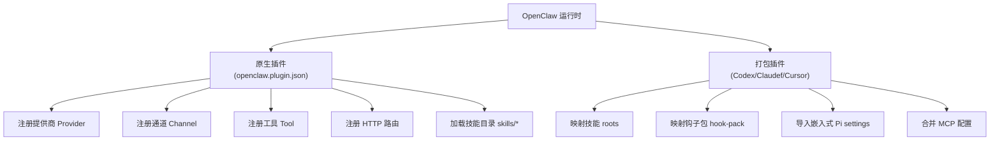
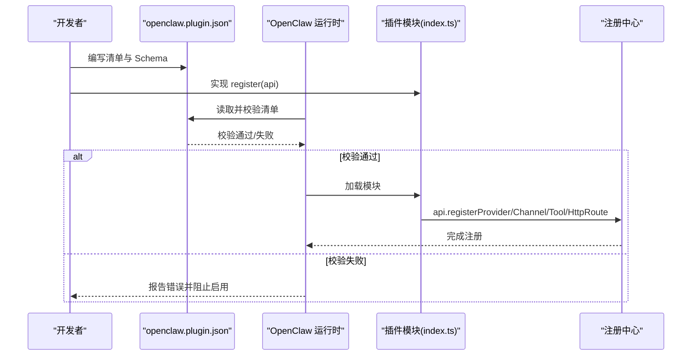
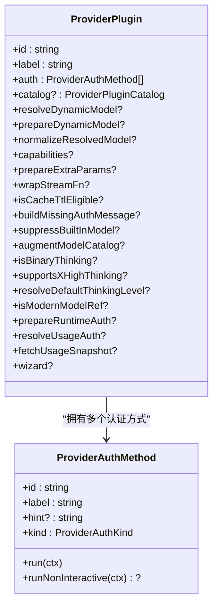
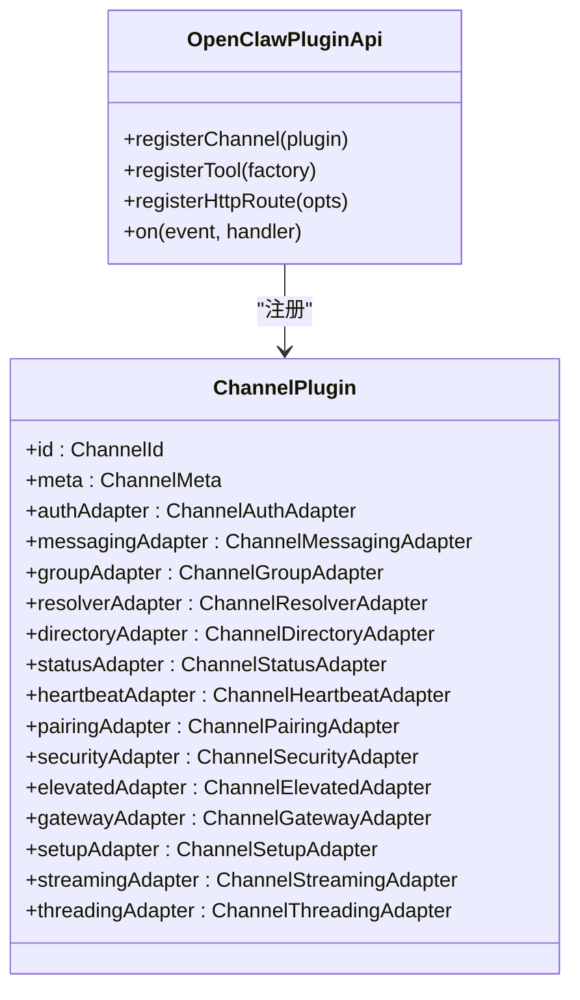
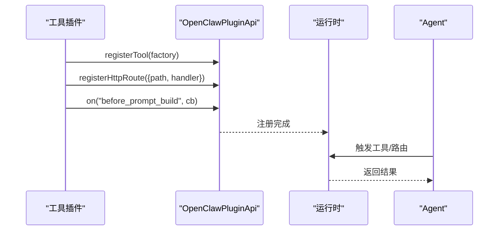
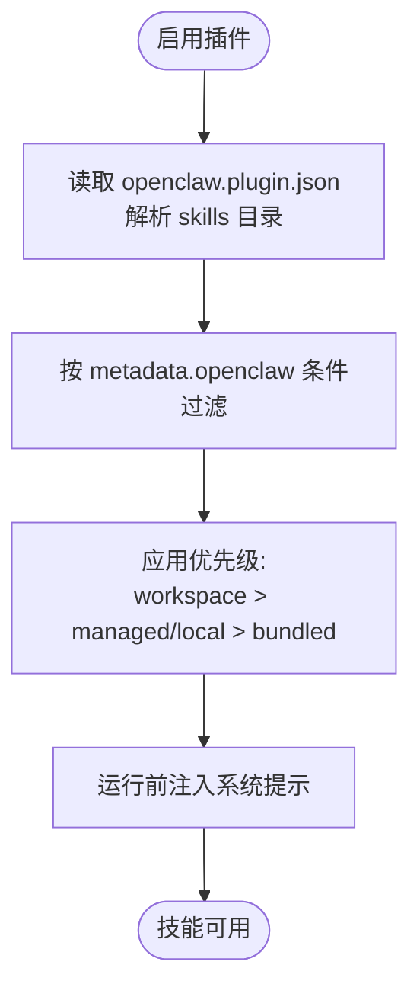
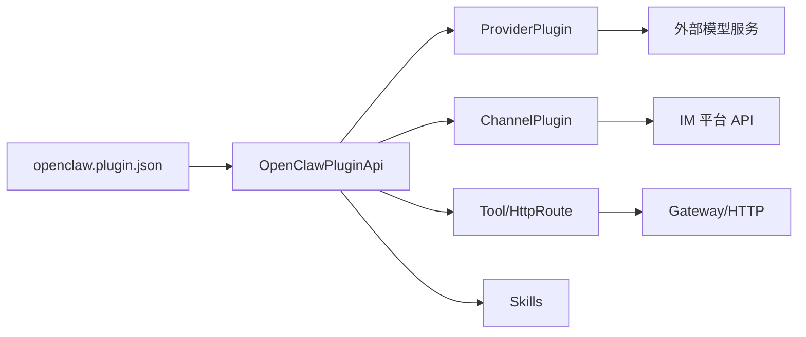

# 插件类型与用途

<cite>
**本文引用的文件**
- [manifest.md](file://docs/plugins/manifest.md)
- [bundles.md](file://docs/plugins/bundles.md)
- [index.ts](file://src/plugin-sdk/index.ts)
- [types.ts](file://src/plugins/types.ts)
- [types.ts](file://src/channels/plugins/types.ts)
- [manifest.md](file://docs/plugins/manifest.md)
- [model-providers.md](file://docs/concepts/model-providers.md)
- [index.ts](file://extensions/discord/index.ts)
- [openclaw.plugin.json](file://extensions/discord/openclaw.plugin.json)
- [index.ts](file://extensions/anthropic/index.ts)
- [openclaw.plugin.json](file://extensions/anthropic/openclaw.plugin.json)
- [index.ts](file://extensions/diffs/index.ts)
- [openclaw.plugin.json](file://extensions/diffs/openclaw.plugin.json)
- [skills.md](file://docs/tools/skills.md)
</cite>

## 目录
1. [引言](#引言)
2. [项目结构](#项目结构)
3. [核心组件](#核心组件)
4. [架构总览](#架构总览)
5. [详细组件分析](#详细组件分析)
6. [依赖分析](#依赖分析)
7. [性能考量](#性能考量)
8. [故障排查指南](#故障排查指南)
9. [结论](#结论)
10. [附录](#附录)

## 引言
本文件系统化阐述 OpenClaw 的插件体系：提供商插件（AI 模型）、通道插件（即时通讯平台）、工具插件（功能扩展）与技能插件（能力教学）。我们将从分类标准、接口规范、开发模式、配置与集成方法、兼容性与安全边界、性能与最佳实践等维度进行深入解析，并给出选择与排障建议。

## 项目结构
OpenClaw 将“插件”分为两类：
- 原生插件（native plugin）：由 openclaw.plugin.json 描述，具备严格清单与 JSON Schema 校验，支持注册提供商、通道、工具、HTTP 路由、技能等。
- 打包插件（bundle plugin）：第三方生态（Codex/Claudef/Cursor）的元数据包，OpenClaw 在不执行其运行时的前提下，映射为本地特性（如技能、钩子、MCP 配置、嵌入式 Pi 设置）。

图表来源
- [manifest.md:10-35](file://docs/plugins/manifest.md#L10-L35)
- [bundles.md:10-45](file://docs/plugins/bundles.md#L10-L45)

章节来源
- [manifest.md:10-35](file://docs/plugins/manifest.md#L10-L35)
- [bundles.md:10-45](file://docs/plugins/bundles.md#L10-L45)

## 核心组件
- 插件清单与校验
  - 每个原生插件必须在插件根目录提供 openclaw.plugin.json，包含 id、configSchema 等字段；缺失或非法将阻断配置验证。
  - 支持 kind、channels、providers、providerAuthEnvVars、skills、uiHints、version 等可选字段。
- 插件 SDK 类型与 API
  - 提供 OpenClawPluginApi，用于注册提供商、通道、工具、HTTP 路由、钩子、生命周期事件等。
  - 提供 PluginRuntime、PluginLogger、OpenClawPluginConfigSchema 等类型支撑插件开发。
- 插件种类与职责
  - 提供商插件：定义模型提供商行为（认证、动态模型解析、流包装、用量查询、思考策略等）。
  - 通道插件：对接即时通讯平台（Discord、Telegram、Slack 等），提供消息收发、群组、目录、状态等适配器。
  - 工具插件：注册工具函数、HTTP 路由、系统上下文注入等。
  - 技能插件：通过 openclaw.plugin.json 的 skills 字段声明技能目录，参与技能加载与优先级。

章节来源
- [manifest.md:36-100](file://docs/plugins/manifest.md#L36-L100)
- [index.ts:1-200](file://src/plugin-sdk/index.ts#L1-L200)
- [types.ts:52-120](file://src/plugins/types.ts#L52-L120)

## 架构总览
OpenClaw 插件系统围绕“清单驱动 + 类型约束 + 注册 API”的模式工作。原生插件在安装后先进行清单与 Schema 校验，再按注册项接入运行时。打包插件则走“内容/元数据包”路径，在安全边界内映射为可用特性。

图表来源
- [manifest.md:29-84](file://docs/plugins/manifest.md#L29-L84)
- [index.ts:100-170](file://src/plugin-sdk/index.ts#L100-L170)

章节来源
- [manifest.md:29-84](file://docs/plugins/manifest.md#L29-L84)
- [index.ts:100-170](file://src/plugin-sdk/index.ts#L100-L170)

## 详细组件分析

### 提供商插件（AI 模型）
- 角色与职责
  - 定义提供商认证方式（OAuth/API Key/Token/设备码/自定义）。
  - 提供模型目录、动态模型解析、传输规范化、额外参数准备、流包装、缓存 TTL、缺省思考级别、现代模型匹配、用量认证与快照获取等。
- 开发模式
  - 在插件入口中调用 api.registerProvider(...)，传入 id、label、auth 列表、wizard、catalog、resolveDynamicModel、prepareDynamicModel、normalizeResolvedModel、capabilities、prepareExtraParams、wrapStreamFn、isCacheTtlEligible、buildMissingAuthMessage、suppressBuiltInModel、augmentModelCatalog、isBinaryThinking、supportsXHighThinking、resolveDefaultThinkingLevel、isModernModelRef、prepareRuntimeAuth、resolveUsageAuth、fetchUsageSnapshot 等。
- 配置与集成
  - 清单中可声明 providerAuthEnvVars，使通用环境变量探测无需加载插件运行时。
  - 通过 models.providers 或内置插件提供的 catalog 合并到最终模型目录。
- 兼容性与安全
  - 对第三方代理与 OpenAI/Anthropic 兼容端点采用统一处理；对非原生端点强制兼容开关，避免不支持的角色导致 400。
- 性能与最佳实践
  - 使用 isCacheTtlEligible、prepareExtraParams、wrapStreamFn 等钩子减少重复网络请求与参数转换。
  - 动态模型解析应尽量轻量，必要时使用 prepareDynamicModel 预热缓存。
  - 用量查询与快照获取应设置合理超时与重试策略。

图表来源
- [types.ts:545-738](file://src/plugins/types.ts#L545-L738)

章节来源
- [model-providers.md:35-106](file://docs/concepts/model-providers.md#L35-L106)
- [types.ts:545-738](file://src/plugins/types.ts#L545-L738)

### 通道插件（即时通讯平台）
- 角色与职责
  - 为特定平台（Discord、Telegram、Slack、iMessage、Signal、WhatsApp、LINE、Matrix、Mattermost、Google Chat、Feishu、Nostr、IRC、WhastApp、Zalo、ZaloUser 等）提供认证、消息收发、群组/目录、线程、状态、心跳、配对、安全策略等适配器。
- 开发模式
  - 在插件入口中调用 api.registerChannel(...) 注册 ChannelPlugin；可结合 api.registerTool、api.registerHttpRoute、api.on(...) 等扩展能力。
- 配置与集成
  - 清单中通过 channels 字段声明该插件注册的通道 id；每个通道通常有独立的配置 Schema 与 UI 提示。
- 兼容性与安全
  - 通道适配器遵循统一的 ChannelPlugin 接口，确保跨平台一致性。
  - 安全策略、DM 策略、提及与工具策略等在通道层统一管理。
- 性能与最佳实践
  - 合理使用线程工具上下文、分片发送、媒体加载优化等。
  - 通道状态汇总与问题收集有助于快速定位连接与权限问题。

图表来源
- [types.ts:9-67](file://src/channels/plugins/types.ts#L9-L67)
- [index.ts:1-120](file://src/plugin-sdk/index.ts#L1-L120)

章节来源
- [types.ts:9-67](file://src/channels/plugins/types.ts#L9-L67)
- [index.ts:1-120](file://src/plugin-sdk/index.ts#L1-L120)

### 工具插件（功能扩展）
- 角色与职责
  - 注册工具函数（AnyAgentTool）、HTTP 路由、系统上下文注入（如 before_prompt_build）、会话绑定服务等。
- 开发模式
  - 在插件入口中调用 api.registerTool(...)、api.registerHttpRoute(...)、api.on(...) 等。
- 配置与集成
  - 可通过 configSchema 与 uiHints 提供 UI 友好的配置体验；支持默认值与安全开关。
- 兼容性与安全
  - 工具执行受沙箱与工具策略控制；HTTP 路由支持鉴权与限流。
- 性能与最佳实践
  - 工具应尽量幂等、可缓存；HTTP 路由需注意并发与资源占用。

图表来源
- [index.ts:14-42](file://extensions/diffs/index.ts#L14-L42)
- [index.ts:150-210](file://src/plugin-sdk/index.ts#L150-L210)

章节来源
- [index.ts:14-42](file://extensions/diffs/index.ts#L14-L42)
- [index.ts:150-210](file://src/plugin-sdk/index.ts#L150-L210)

### 技能插件（能力教学）
- 角色与职责
  - 通过 openclaw.plugin.json 的 skills 字段声明技能目录，参与技能加载、优先级与过滤。
- 开发模式
  - 在插件根目录提供 skills 子目录，每个技能以 SKILL.md 为主文件；可通过 metadata.openclaw 控制加载条件（二进制、环境变量、配置项等）。
- 配置与集成
  - 支持在 openclaw.json 中对技能进行启用、密钥注入、环境变量覆盖与自定义配置。
- 兼容性与安全
  - 第三方技能视为不受信代码，应谨慎启用；推荐沙箱执行与最小权限原则。
- 性能与最佳实践
  - 技能列表会在会话开始时快照复用，变更在新会话生效；可开启技能监视器实现热更新。

图表来源
- [skills.md:41-48](file://docs/tools/skills.md#L41-L48)
- [skills.md:106-137](file://docs/tools/skills.md#L106-L137)

章节来源
- [skills.md:41-48](file://docs/tools/skills.md#L41-L48)
- [skills.md:106-137](file://docs/tools/skills.md#L106-L137)

## 依赖分析
- 插件发现与注册
  - 原生插件：以 openclaw.plugin.json 为入口，先校验再注册。
  - 打包插件：检测并归一化为内部记录，映射支持表面，未映射的能力仅作“已检测但未连线”提示。
- 组件耦合
  - 插件 SDK 提供统一 API，降低提供商、通道、工具、技能的耦合度。
  - 通道与提供商分别通过各自的适配器接口解耦具体平台差异。
- 外部依赖与集成点
  - 提供商插件与外部模型服务交互；通道插件与各 IM 平台 API 交互；工具插件与 HTTP/Gateway 交互。
- 循环依赖
  - 插件注册流程在启动阶段完成，避免运行期循环依赖。

图表来源
- [manifest.md:29-84](file://docs/plugins/manifest.md#L29-L84)
- [index.ts:100-170](file://src/plugin-sdk/index.ts#L100-L170)

章节来源
- [manifest.md:29-84](file://docs/plugins/manifest.md#L29-L84)
- [index.ts:100-170](file://src/plugin-sdk/index.ts#L100-L170)

## 性能考量
- 清单与 Schema 校验在配置读写时进行，避免运行期开销。
- 提供商插件的动态模型解析与用量查询应设置超时与重试；缓存 TTL 与参数预处理可显著降低延迟。
- 通道插件的消息分片、媒体加载与线程工具上下文需关注并发与内存占用。
- 工具插件与 HTTP 路由应限制并发与请求体大小，防止资源耗尽。
- 技能列表快照与监视器可减少提示构建成本，提升响应速度。

## 故障排查指南
- 清单与 Schema 错误
  - 症状：启用插件时报错，Doctor 显示清单/Schema 错误。
  - 处理：检查 openclaw.plugin.json 的必需字段与 JSON Schema，确保无未知通道/提供商 id。
- 通道连接问题
  - 症状：无法登录、消息收发失败、状态异常。
  - 处理：查看通道状态汇总与问题收集，核对凭据、权限与网络连通性。
- 提供商认证与用量
  - 症状：模型不可用、用量查询失败。
  - 处理：确认提供商认证方式与凭据；检查用量认证与快照获取逻辑。
- 工具与路由异常
  - 症状：工具执行失败、HTTP 路由 4xx/5xx。
  - 处理：检查工具参数、HTTP 路由鉴权与限流配置。
- 技能加载与权限
  - 症状：技能未出现、执行报错。
  - 处理：核对 metadata.openclaw 条件、二进制与环境变量、配置项；确认沙箱权限。

章节来源
- [manifest.md:74-84](file://docs/plugins/manifest.md#L74-L84)
- [index.ts:210-280](file://src/plugin-sdk/index.ts#L210-L280)

## 结论
OpenClaw 的插件体系以清单与类型为核心，提供统一的注册 API 与严格的校验机制，既保证了扩展性，又维持了安全性与可维护性。通过提供商、通道、工具与技能四类插件的协同，用户可以灵活组合 AI 模型、即时通讯平台与功能扩展，构建强大的自动化工作流。

## 附录

### 插件分类标准与兼容性
- 分类标准
  - 提供商插件：通过 providers 字段声明；支持认证、目录、动态模型、用量等钩子。
  - 通道插件：通过 channels 字段声明；提供消息、群组、目录、状态等适配器。
  - 工具插件：通过 registerTool/registerHttpRoute 注册；可注入系统上下文。
  - 技能插件：通过 skills 字段声明；遵循 AgentSkills 规范。
- 兼容性
  - 原生插件：严格清单与 Schema 校验。
  - 打包插件：Codex/Claudef/Cursor 生态映射为本地特性，未映射能力仅提示“已检测但未连线”。

章节来源
- [manifest.md:54-100](file://docs/plugins/manifest.md#L54-L100)
- [bundles.md:84-158](file://docs/plugins/bundles.md#L84-L158)

### 开发模式与集成方法
- 提供商插件
  - 在插件入口中实现 registerProvider，配置 auth、catalog、resolveDynamicModel、prepareExtraParams、wrapStreamFn、resolveUsageAuth、fetchUsageSnapshot 等。
- 通道插件
  - 在插件入口中实现 registerChannel，结合 registerTool、registerHttpRoute、on(...) 扩展能力。
- 工具插件
  - 在插件入口中实现 registerTool、registerHttpRoute、on(...)，提供系统上下文注入。
- 技能插件
  - 在 openclaw.plugin.json 中声明 skills 目录，编写 SKILL.md 并按 metadata.openclaw 控制加载。

章节来源
- [types.ts:545-738](file://src/plugins/types.ts#L545-L738)
- [types.ts:9-67](file://src/channels/plugins/types.ts#L9-L67)
- [index.ts:7-22](file://extensions/discord/index.ts#L7-L22)
- [index.ts:261-318](file://extensions/anthropic/index.ts#L261-L318)
- [index.ts:14-42](file://extensions/diffs/index.ts#L14-L42)
- [skills.md:78-105](file://docs/tools/skills.md#L78-L105)

### 配置要求与接口规范
- 清单字段
  - 必需：id、configSchema。
  - 可选：kind、channels、providers、providerAuthEnvVars、skills、name、description、uiHints、version。
- 接口规范
  - OpenClawPluginApi：registerProvider、registerChannel、registerTool、registerHttpRoute、on、logger、runtime 等。
  - ProviderPlugin：认证、目录、动态模型、传输、缓存、用量、思考策略、现代模型匹配等钩子。
  - ChannelPlugin：认证、消息、群组、目录、状态、心跳、配对、安全、网关、设置、流式、线程等适配器。

章节来源
- [manifest.md:36-100](file://docs/plugins/manifest.md#L36-L100)
- [index.ts:100-170](file://src/plugin-sdk/index.ts#L100-L170)
- [types.ts:545-738](file://src/plugins/types.ts#L545-L738)
- [types.ts:9-67](file://src/channels/plugins/types.ts#L9-L67)

### 示例参考
- 通道插件（Discord）
  - 清单：openclaw.plugin.json 包含 id、channels、空配置 Schema。
  - 入口：注册 ChannelPlugin，设置运行时，按需注册子代理钩子。
- 提供商插件（Anthropic）
  - 清单：openclaw.plugin.json 包含 id、providers、providerAuthEnvVars、空配置 Schema。
  - 入口：注册 ProviderPlugin，定义 setup-token 认证、动态模型兼容、现代模型匹配、缺省思考级别、用量认证与快照获取、缓存 TTL。
- 工具插件（Diffs）
  - 清单：openclaw.plugin.json 包含 id、name、description、skills、uiHints、完整配置 Schema。
  - 入口：注册工具、HTTP 路由、before_prompt_build 事件，注入系统上下文。

章节来源
- [openclaw.plugin.json:1-10](file://extensions/discord/openclaw.plugin.json#L1-L10)
- [index.ts:7-22](file://extensions/discord/index.ts#L7-L22)
- [openclaw.plugin.json:1-13](file://extensions/anthropic/openclaw.plugin.json#L1-L13)
- [index.ts:261-318](file://extensions/anthropic/index.ts#L261-L318)
- [openclaw.plugin.json:1-183](file://extensions/diffs/openclaw.plugin.json#L1-L183)
- [index.ts:14-42](file://extensions/diffs/index.ts#L14-L42)