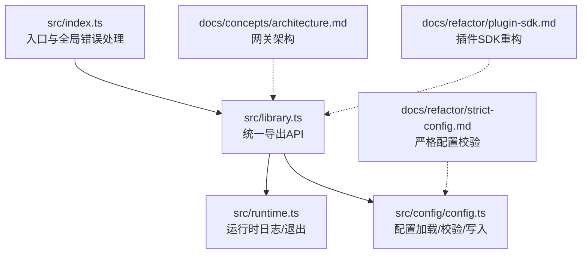
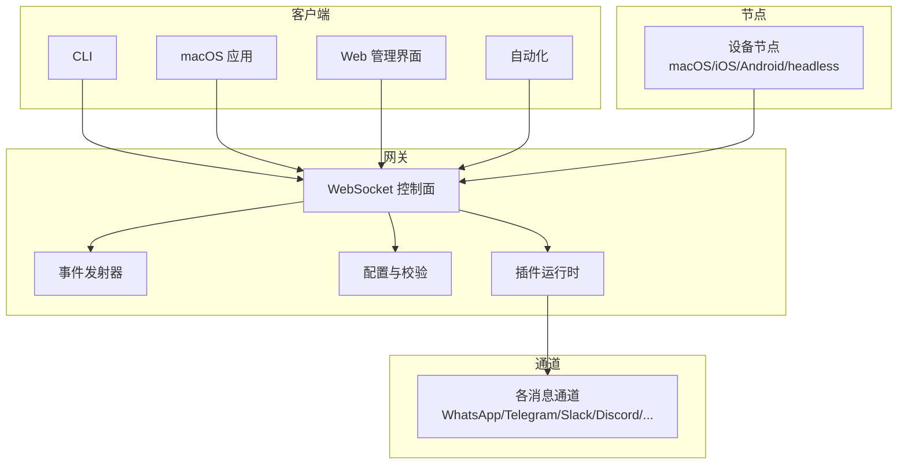
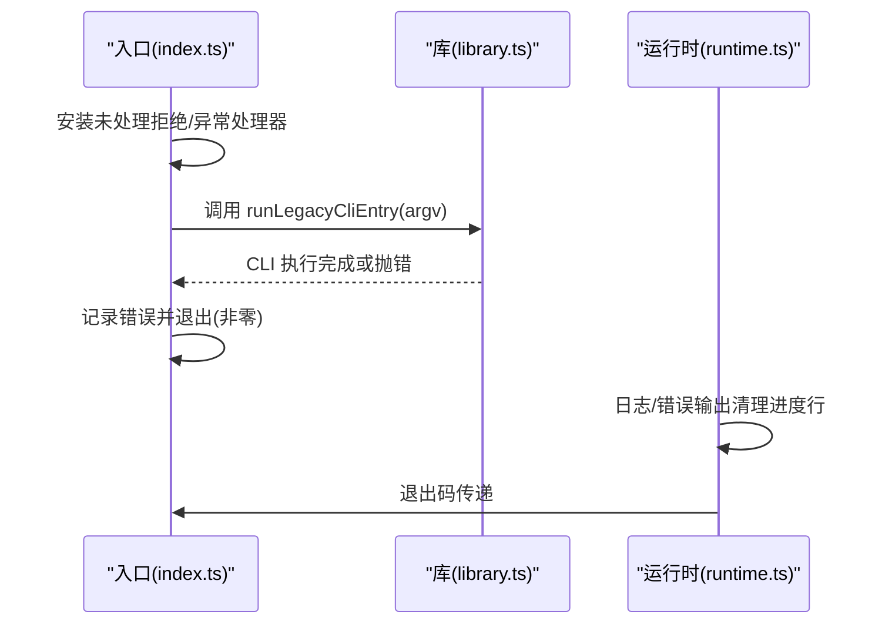
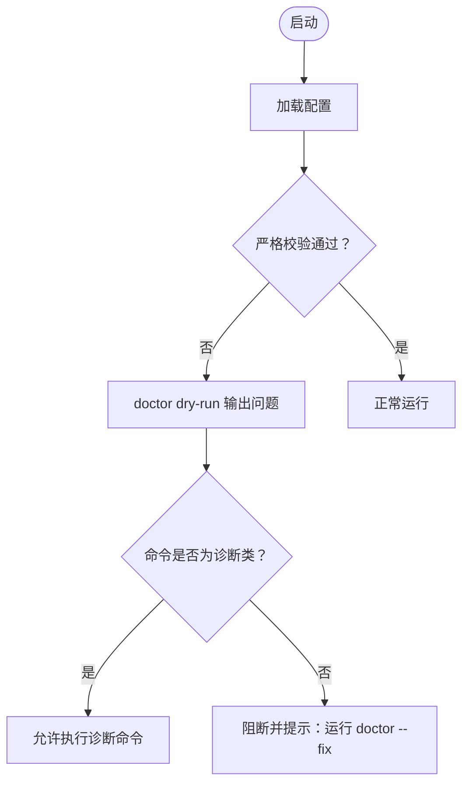
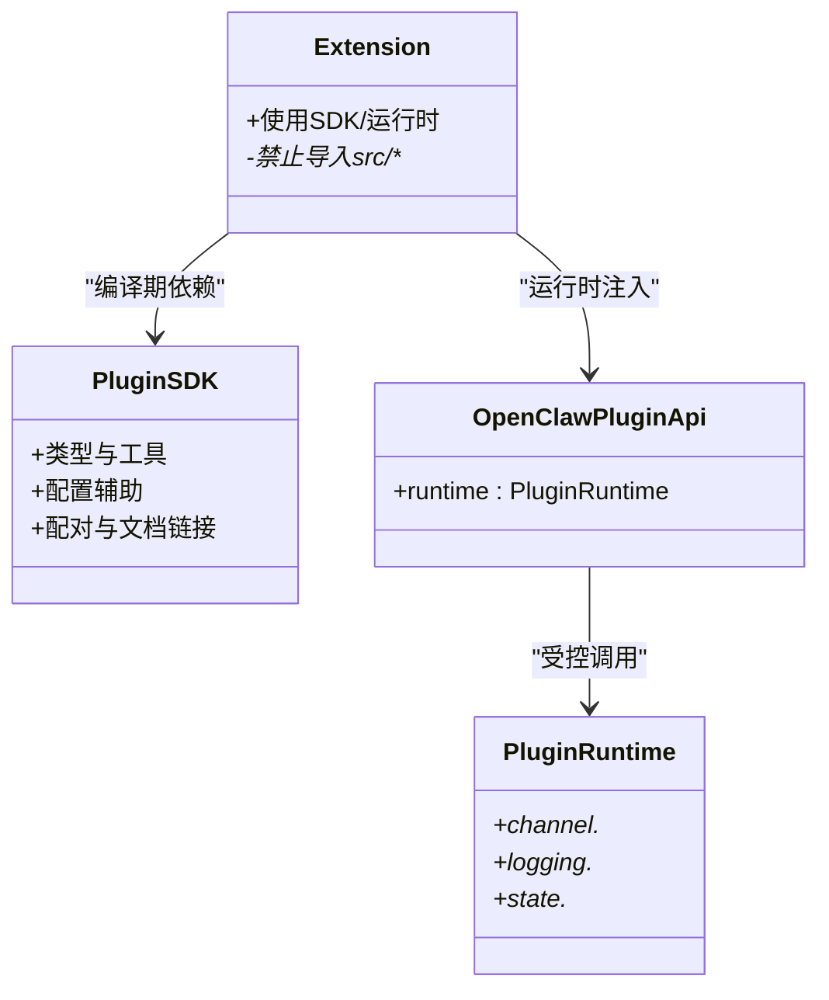
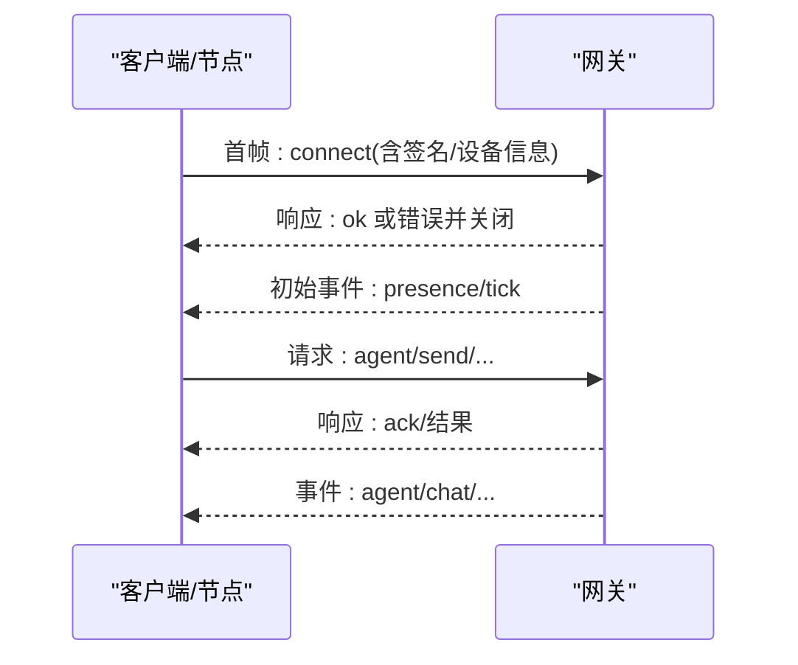
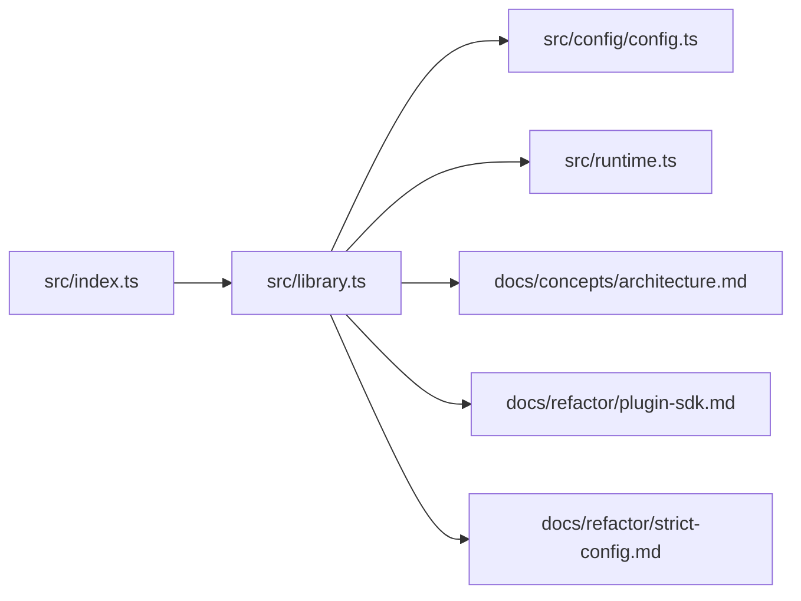

# 架构演进与重构

<cite>
**本文引用的文件**   
- [README.md](file://README.md)
- [index.ts](file://src/index.ts)
- [library.ts](file://src/library.ts)
- [runtime.ts](file://src/runtime.ts)
- [architecture.md](file://docs/concepts/architecture.md)
- [plugin-sdk.md](file://docs/refactor/plugin-sdk.md)
- [strict-config.md](file://docs/refactor/strict-config.md)
- [config.ts](file://src/config/config.ts)
</cite>

## 目录
1. [引言](#引言)
2. [项目结构](#项目结构)
3. [核心组件](#核心组件)
4. [架构总览](#架构总览)
5. [详细组件分析](#详细组件分析)
6. [依赖关系分析](#依赖关系分析)
7. [性能考量](#性能考量)
8. [故障排查指南](#故障排查指南)
9. [结论](#结论)
10. [附录](#附录)

## 引言
本指南面向 OpenClaw 的架构演进与重构工作，目标是建立一套可演进、可治理、可扩展的系统设计与实施路径。内容覆盖：
- 架构理念与设计模式：以“单网关控制平面 + 多客户端/节点 + 插件化通道”的核心范式，强调协议驱动、类型安全、最小运行时暴露面。
- 模块化设计原则：通过清晰的边界、稳定的 SDK、受控的运行时 API，实现“编译期稳定 + 运行期隔离”。
- 依赖注入与接口抽象：以“SDK 提供契约 + 运行时注入实现”的方式，避免插件直接耦合核心源码。
- 架构决策记录（ADR）与技术债务管理：以严格配置校验、迁移流程与命令门禁为核心，确保变更可追踪、可回滚。
- 重构策略：分阶段推进插件 SDK 化、严格配置校验与运行时门禁，降低升级风险。
- 性能优化与可扩展性：基于 WebSocket 协议、事件驱动、去重与节流等手段，保障高并发下的稳定性。
- 系统边界与实验机制：通过“插件化 + 文档链接 + 版本兼容”实现实验性能力的安全引入与验证。

## 项目结构
OpenClaw 采用多语言混合与多平台产物并存的组织方式：
- 核心运行时入口与导出：src/index.ts 负责全局错误处理与 CLI 启动；src/library.ts 统一导出公共 API；src/runtime.ts 定义运行时日志与退出行为。
- 文档与重构规划：docs/concepts/architecture.md 描述网关架构；docs/refactor 下的 plugin-sdk.md 与 strict-config.md 提供插件 SDK 化与严格配置校验的重构蓝图。
- 配置子系统：src/config/config.ts 汇总导出配置加载、校验、写入等能力，支撑严格配置策略落地。

图示来源
- [index.ts:1-58](file://src/index.ts#L1-L58)
- [library.ts:1-49](file://src/library.ts#L1-L49)
- [runtime.ts:1-54](file://src/runtime.ts#L1-L54)
- [config.ts:1-29](file://src/config/config.ts#L1-L29)
- [architecture.md:1-140](file://docs/concepts/architecture.md#L1-L140)
- [plugin-sdk.md:1-215](file://docs/refactor/plugin-sdk.md#L1-L215)
- [strict-config.md:1-94](file://docs/refactor/strict-config.md#L1-L94)

章节来源
- [README.md:1-560](file://README.md#L1-L560)
- [index.ts:1-58](file://src/index.ts#L1-L58)
- [library.ts:1-49](file://src/library.ts#L1-L49)
- [runtime.ts:1-54](file://src/runtime.ts#L1-L54)
- [config.ts:1-29](file://src/config/config.ts#L1-L29)
- [architecture.md:1-140](file://docs/concepts/architecture.md#L1-L140)
- [plugin-sdk.md:1-215](file://docs/refactor/plugin-sdk.md#L1-L215)
- [strict-config.md:1-94](file://docs/refactor/strict-config.md#L1-L94)

## 核心组件
- 入口与错误处理：src/index.ts 安装未处理拒绝与未捕获异常处理器，保证崩溃前有日志与退出码。
- 统一导出层：src/library.ts 将会话、配置、工具、执行、端口占用等能力集中导出，作为包根导出的聚合层。
- 运行时环境：src/runtime.ts 提供标准日志/错误输出与退出封装，并支持“非退出式运行时”用于测试。
- 网关架构：docs/concepts/architecture.md 明确了 WebSocket 控制面、事件模型、配对与本地信任、远程访问等关键约束。
- 插件 SDK 重构：docs/refactor/plugin-sdk.md 提出“SDK（编译期稳定）+ 运行时（受控注入）”的两层架构，禁止插件直接导入 src/**。
- 严格配置校验：docs/refactor/strict-config.md 规定未知键拒绝、插件必须提供 schema、启动时自动运行 doctor（dry-run），非法配置下仅允许诊断命令。

章节来源
- [index.ts:1-58](file://src/index.ts#L1-L58)
- [library.ts:1-49](file://src/library.ts#L1-L49)
- [runtime.ts:1-54](file://src/runtime.ts#L1-L54)
- [architecture.md:1-140](file://docs/concepts/architecture.md#L1-L140)
- [plugin-sdk.md:1-215](file://docs/refactor/plugin-sdk.md#L1-L215)
- [strict-config.md:1-94](file://docs/refactor/strict-config.md#L1-L94)

## 架构总览
OpenClaw 的控制面由单一网关承担，所有消息通道在此汇聚，客户端（macOS 应用、CLI、Web 管理界面、自动化）与节点（macOS/iOS/Android/headless）均通过 WebSocket 连接。协议采用 JSON 文本帧，首帧必须为连接请求；服务端对帧进行 JSON Schema 校验，事件不重放，客户端需在断连后刷新状态快照。

图示来源
- [architecture.md:27-140](file://docs/concepts/architecture.md#L27-L140)

章节来源
- [architecture.md:1-140](file://docs/concepts/architecture.md#L1-L140)

## 详细组件分析

### 组件A：入口与运行时（错误处理与日志）
- 设计要点
  - 全局安装未处理拒绝与未捕获异常处理器，避免静默崩溃。
  - 运行时日志具备进度行清理与条件输出控制，便于测试与 CI。
  - 提供“非退出式运行时”，便于单元测试中断言退出行为。
- 重构建议
  - 将 CLI 启动逻辑收敛到 library.ts 导出的 runLegacyCliEntry，保持入口职责单一。
  - 在测试环境中通过 OPENCLAW_TEST_RUNTIME_LOG 或 mock console.log 控制日志输出。

图示来源
- [index.ts:34-57](file://src/index.ts#L34-L57)
- [runtime.ts:21-44](file://src/runtime.ts#L21-L44)

章节来源
- [index.ts:1-58](file://src/index.ts#L1-L58)
- [runtime.ts:1-54](file://src/runtime.ts#L1-L54)

### 组件B：配置加载与严格校验（Doctor 驱动的迁移）
- 设计要点
  - 严格拒绝未知键（根与嵌套），插件必须提供 JSON Schema，否则禁止加载。
  - 启动时自动运行 doctor（dry-run），非法配置仅允许诊断命令。
  - 迁移逻辑集中在 doctor，不进行运行时自动迁移。
- 重构建议
  - 在 src/config 中逐步移除遗留自动迁移逻辑，统一走 doctor 流程。
  - 为每个插件提供 openclaw.plugin.json 并内联其配置 Schema，确保加载前即校验。

图示来源
- [strict-config.md:46-68](file://docs/refactor/strict-config.md#L46-L68)
- [config.ts:1-29](file://src/config/config.ts#L1-L29)

章节来源
- [strict-config.md:1-94](file://docs/refactor/strict-config.md#L1-L94)
- [config.ts:1-29](file://src/config/config.ts#L1-L29)

### 组件C：插件 SDK 与运行时（两层架构）
- 设计要点
  - SDK：稳定、可发布、无运行时副作用，仅提供类型、工具与配置辅助。
  - 运行时：通过 OpenClawPluginApi.runtime 暴露受控能力，插件不得直接导入 src/**。
  - 分阶段迁移：先桥接现有扩展，再清理直连核心代码，最终强制禁止 extensions/** 导入 src/**。
- 重构建议
  - 为每个通道插件提供 openclaw.plugin.json，声明所需运行时版本范围。
  - 建立适配器级单元测试与黄金测试，确保路由、配对、提及屏蔽等行为一致。

图示来源
- [plugin-sdk.md:48-145](file://docs/refactor/plugin-sdk.md#L48-L145)

章节来源
- [plugin-sdk.md:1-215](file://docs/refactor/plugin-sdk.md#L1-L215)

### 组件D：网关协议与事件流（WebSocket 控制面）
- 设计要点
  - 首帧必须为 connect；请求/响应与事件帧格式明确；支持幂等键与去重缓存。
  - 节点需声明 role 与能力；配对基于设备身份，本地连接可自动批准。
  - 类型安全：TypeBox Schema → JSON Schema → Swift 模型生成。
- 重构建议
  - 保持协议不变，逐步将通道实现迁移到插件 SDK + 运行时，减少核心耦合。

图示来源
- [architecture.md:59-92](file://docs/concepts/architecture.md#L59-L92)

章节来源
- [architecture.md:1-140](file://docs/concepts/architecture.md#L1-L140)

## 依赖关系分析
- 入口依赖库导出，库导出统一 API，避免上层直接依赖 src/**。
- 配置子系统被网关与 CLI 共同依赖，严格校验规则贯穿加载与写入。
- 插件 SDK 与运行时形成“编译期稳定 + 运行期隔离”的双层依赖，禁止插件直连核心。

图示来源
- [index.ts:1-58](file://src/index.ts#L1-L58)
- [library.ts:1-49](file://src/library.ts#L1-L49)
- [config.ts:1-29](file://src/config/config.ts#L1-L29)
- [runtime.ts:1-54](file://src/runtime.ts#L1-L54)
- [architecture.md:1-140](file://docs/concepts/architecture.md#L1-L140)
- [plugin-sdk.md:1-215](file://docs/refactor/plugin-sdk.md#L1-L215)
- [strict-config.md:1-94](file://docs/refactor/strict-config.md#L1-L94)

章节来源
- [index.ts:1-58](file://src/index.ts#L1-L58)
- [library.ts:1-49](file://src/library.ts#L1-L49)
- [config.ts:1-29](file://src/config/config.ts#L1-L29)
- [runtime.ts:1-54](file://src/runtime.ts#L1-L54)
- [architecture.md:1-140](file://docs/concepts/architecture.md#L1-L140)
- [plugin-sdk.md:1-215](file://docs/refactor/plugin-sdk.md#L1-L215)
- [strict-config.md:1-94](file://docs/refactor/strict-config.md#L1-L94)

## 性能考量
- 事件不重放：客户端需在断连后主动刷新状态快照，避免服务端重复投递历史事件。
- 幂等键与去重：对会产生副作用的方法（如发送/代理调用）要求幂等键，服务端维护短期去重缓存，提升重试安全性。
- 节流与去抖：运行时提供入站消息去抖器，按通道配置的节流参数合并批量处理，降低上游压力。
- 远程访问：优先使用 Tailscale/VPN，SSH 隧道作为备选；远程场景可启用 WS TLS 与可选证书固定。

章节来源
- [architecture.md:129-140](file://docs/concepts/architecture.md#L129-L140)
- [plugin-sdk.md:120-129](file://docs/refactor/plugin-sdk.md#L120-L129)

## 故障排查指南
- 启动失败与诊断命令门禁：当配置无效时，仅允许 doctor、logs、health、help、status、gateway status 等诊断命令；其他命令将被阻断并提示修复。
- Doctor 自动干跑：每次加载配置都会执行 doctor（dry-run），输出问题摘要与修复指引。
- 运行时日志：通过 runtime.ts 的日志/错误输出与进度行清理，结合 OPENCLAW_TEST_RUNTIME_LOG 或 mock 控制台，便于定位问题。

章节来源
- [strict-config.md:57-68](file://docs/refactor/strict-config.md#L57-L68)
- [strict-config.md:46-56](file://docs/refactor/strict-config.md#L46-L56)
- [runtime.ts:10-35](file://src/runtime.ts#L10-L35)

## 结论
OpenClaw 的架构演进应围绕“协议驱动 + 插件化 + 严格配置校验 + 受控运行时注入”展开。通过分阶段的 SDK 化与严格配置策略，既能降低升级成本，又能确保系统在演进过程中的稳定性与可治理性。建议将“插件 SDK + 运行时”作为未来所有通道接入的标准路径，并以 Doctor 驱动的迁移替代运行时自动迁移，使变更可审计、可回滚。

## 附录
- 实验性功能引入机制
  - 通过插件 SDK 与运行时注入，实验性能力以独立插件形式存在，不直接修改核心源码。
  - 插件通过 openclaw.plugin.json 声明所需运行时版本范围，确保兼容性。
  - 通过文档链接辅助与最小运行时表面，降低实验风险。
- 架构验证方法
  - 适配器级单元测试与黄金测试：确保路由、配对、提及屏蔽等行为与当前实现一致。
  - CI 中加入单插件安装、运行与冒烟测试，验证端到端可用性。

章节来源
- [plugin-sdk.md:194-199](file://docs/refactor/plugin-sdk.md#L194-L199)
- [plugin-sdk.md:200-213](file://docs/refactor/plugin-sdk.md#L200-L213)