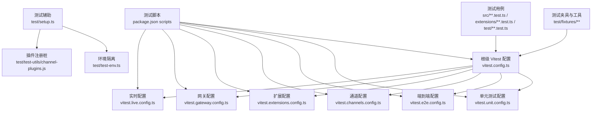
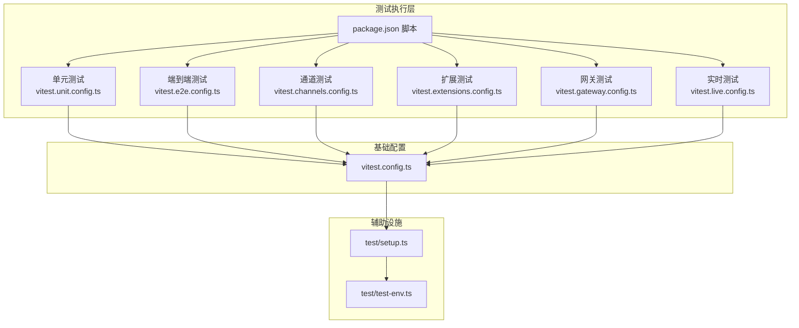
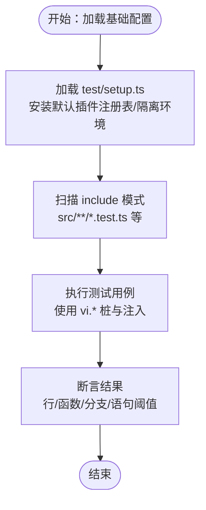
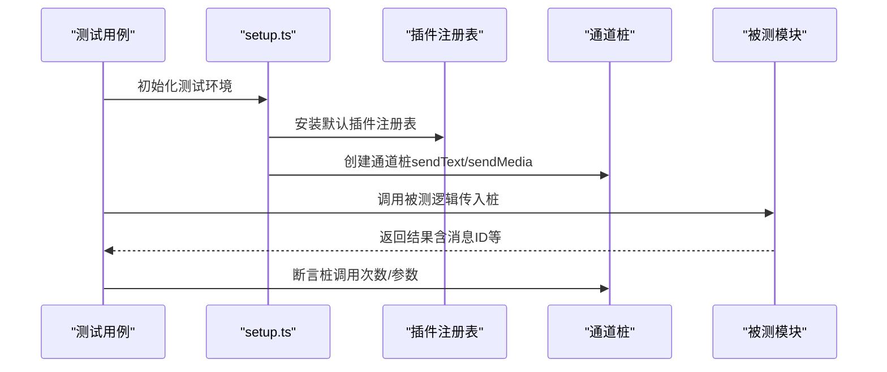
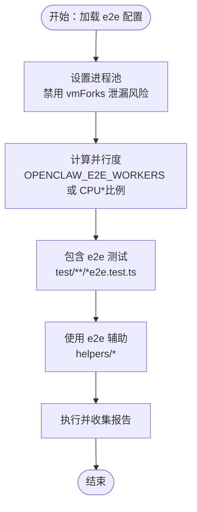
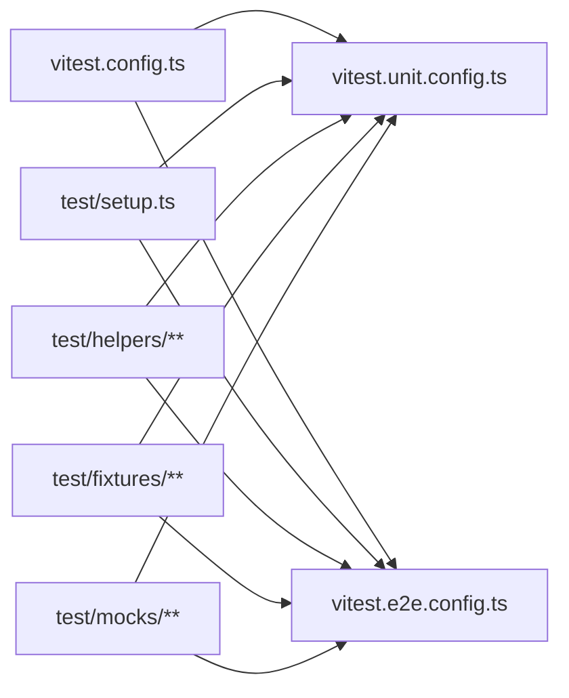

# 测试策略与实践

<cite>
**本文引用的文件**
- [vitest.config.ts](file://vitest.config.ts)
- [vitest.unit.config.ts](file://vitest.unit.config.ts)
- [vitest.e2e.config.ts](file://vitest.e2e.config.ts)
- [test/setup.ts](file://test/setup.ts)
- [test/global-setup.ts](file://test/global-setup.ts)
- [test/test-env.ts](file://test/test-env.ts)
- [package.json](file://package.json)
- [extensions/*/index.test.ts](file://extensions/anthropic/index.test.ts)
- [extensions/*/index.test.ts](file://extensions/anthropic/index.test.ts)
- [extensions/discord/src/monitor.tool-result.accepts-guild-messages-mentionpatterns-match.e2e.test.ts](file://extensions/discord/src/monitor.tool-result.accepts-guild-messages-mentionpatterns-match.e2e.test.ts)
- [src/agents/openai-ws-stream.e2e.test.ts](file://src/agents/openai-ws-stream.e2e.test.ts)
- [src/agents/pi-embedded-runner.e2e.test.ts](file://src/agents/pi-embedded-runner.e2e.test.ts)
- [src/agents/sandbox-agent-config.agent-specific-sandbox-config.e2e.test.ts](file://src/agents/sandbox-agent-config.agent-specific-sandbox-config.e2e.test.ts)
- [src/agents/subagent-registry.lifecycle-retry-grace.e2e.test.ts](file://src/agents/subagent-registry.lifecycle-retry-grace.e2e.test.ts)
- [src/auto-reply/reply/agent-runner.runreplyagent.e2e.test.ts](file://src/auto-reply/reply/agent-runner.runreplyagent.e2e.test.ts)
- [src/gateway/server.auth.compat-baseline.test.ts](file://src/gateway/server.auth.compat-baseline.test.ts)
- [src/gateway/client.test.ts](file://src/gateway/client.test.ts)
- [src/gateway/reconnect-gating.test.ts](file://src/gateway/reconnect-gating.test.ts)
- [src/gateway/protocol/connect-error-details.test.ts](file://src/gateway/protocol/connect-error-details.test.ts)
- [src/infra/outbound/outbound-session.ts](file://src/infra/outbound/outbound-session.ts)
- [src/memory/batch-gemini.ts](file://src/memory/batch-gemini.ts)
- [src/infra/state-migrations.ts](file://src/infra/state-migrations.ts)
- [src/infra/skills-remote.ts](file://src/infra/skills-remote.ts)
- [src/infra/update-check.ts](file://src/infra/update-check.ts)
- [src/infra/ports-inspect.ts](file://src/infra/ports-inspect.ts)
- [src/gateway/call.ts](file://src/gateway/call.ts)
- [src/process/tau-rpc.ts](file://src/process/tau-rpc.ts)
- [src/process/exec.ts](file://src/process/exec.ts)
- [src/tui/**](file://src/tui/**)
- [src/wizard/**](file://src/wizard/**)
- [src/browser/**](file://src/browser/**)
- [src/channels/web/**](file://src/channels/web/**)
- [src/webchat/**](file://src/webchat/**)
- [src/gateway/server.ts](file://src/gateway/server.ts)
- [src/gateway/client.ts](file://src/gateway/client.ts)
- [src/gateway/protocol/**](file://src/gateway/protocol/**)
- [src/infra/tailscale.ts](file://src/infra/tailscale.ts)
- [test/fixtures/**](file://test/fixtures/**)
- [test/helpers/**](file://test/helpers/**)
- [test/mocks/**](file://test/mocks/**)
- [test/scripts/**](file://test/scripts/**)
- [ui/vitest.config.ts](file://ui/vitest.config.ts)
- [ui/vitest.node.config.ts](file://ui/vitest.node.config.ts)
</cite>

## 目录
1. [引言](#引言)
2. [项目结构](#项目结构)
3. [核心组件](#核心组件)
4. [架构总览](#架构总览)
5. [详细组件分析](#详细组件分析)
6. [依赖关系分析](#依赖关系分析)
7. [性能考量](#性能考量)
8. [故障排查指南](#故障排查指南)
9. [结论](#结论)
10. [附录](#附录)

## 引言
本文件面向 OpenClaw 项目的测试体系，系统化阐述单元测试、集成测试、端到端测试与性能测试的设计原则与实施方法；详解 Vitest 测试框架的配置与使用、测试工具集与辅助函数；给出测试数据管理、模拟策略与断言模式的最佳实践；明确测试覆盖率目标、持续集成中的测试执行与测试报告分析；解释测试环境隔离与并行执行策略，并提供测试调试技巧。

## 项目结构
OpenClaw 的测试相关目录与文件分布如下：
- 根级 Vitest 配置：统一基础配置与多类专用配置（单元、端到端、通道、扩展、网关、实时等）
- 测试运行脚本：通过 package.json 脚本统一调度各套配置
- 测试辅助：全局 setup、环境隔离、插件注册桩、通道桩、超时与并发控制
- 测试用例：按模块划分，覆盖核心业务逻辑、通道适配器、扩展插件、网关协议与 UI 等
- 测试夹具与工具：fixtures、helpers、mocks、scripts

图表来源
- [vitest.config.ts](file://vitest.config.ts)
- [vitest.unit.config.ts](file://vitest.unit.config.ts)
- [vitest.e2e.config.ts](file://vitest.e2e.config.ts)
- [package.json](file://package.json)
- [test/setup.ts](file://test/setup.ts)
- [test/test-env.ts](file://test/test-env.ts)

章节来源
- [vitest.config.ts](file://vitest.config.ts)
- [package.json](file://package.json)

## 核心组件
- 基础 Vitest 配置：统一别名解析、超时、钩子、池类型、并发、包含/排除规则、覆盖率阈值与排除范围
- 单元测试配置：聚焦 src 下可独立验证的模块，排除大面集成与 UI
- 端到端配置：强调进程隔离、确定性与可调并行度，仅包含 e2e 测试
- 测试辅助：全局 setup 安装警告过滤、隔离 HOME、安装默认插件注册表、清理假定时器
- 测试环境：隔离真实用户态配置与状态，避免端到端污染
- 测试脚本：统一入口，支持并行、串行、实时、Docker 化 e2e、UI 测试等

章节来源
- [vitest.config.ts](file://vitest.config.ts)
- [vitest.unit.config.ts](file://vitest.unit.config.ts)
- [vitest.e2e.config.ts](file://vitest.e2e.config.ts)
- [test/setup.ts](file://test/setup.ts)
- [test/test-env.ts](file://test/test-env.ts)
- [package.json](file://package.json)

## 架构总览
下图展示测试执行在不同配置下的组织方式与交互：

图表来源
- [package.json](file://package.json)
- [vitest.config.ts](file://vitest.config.ts)
- [vitest.unit.config.ts](file://vitest.unit.config.ts)
- [vitest.e2e.config.ts](file://vitest.e2e.config.ts)
- [test/setup.ts](file://test/setup.ts)
- [test/test-env.ts](file://test/test-env.ts)

## 详细组件分析

### 单元测试策略与实现
- 设计原则
  - 小而快：聚焦纯函数、工具函数与可注入依赖的模块
  - 可替换：广泛使用桩与注入，避免真实网络/IO
  - 明确边界：对易变外部接口进行隔离
- 实施要点
  - 使用基础配置，配合单元专用配置缩小扫描范围
  - 利用 setup 安装默认插件注册表，确保通道能力测试稳定
  - 对易泄漏的全局（如环境变量、定时器）进行恢复
- 覆盖率目标
  - 行/函数/分支/语句均不低于 70%，以保证关键路径被覆盖
- 断言模式
  - 状态断言 + 行为断言（调用次数、参数匹配）
  - 对异步流程使用超时与重试策略
- 典型用例
  - 工具函数与纯逻辑模块
  - 插件 SDK 子路径别名解析
  - 扩展插件的内部逻辑（例如认证、序列化）

图表来源
- [vitest.config.ts](file://vitest.config.ts)
- [vitest.unit.config.ts](file://vitest.unit.config.ts)
- [test/setup.ts](file://test/setup.ts)

章节来源
- [vitest.config.ts](file://vitest.config.ts)
- [vitest.unit.config.ts](file://vitest.unit.config.ts)
- [test/setup.ts](file://test/setup.ts)

### 集成测试策略与实现
- 设计原则
  - 关注模块间协作与协议一致性
  - 通过最小化外部依赖进行可控验证
- 实施要点
  - 使用基础配置，结合专用配置（通道/扩展/网关）分别验证子域
  - 在 setup 中准备通道桩与插件注册表，确保发送/接收路径可验证
  - 对易变外部接口（如第三方 API）进行桩或本地代理
- 断言模式
  - 输入输出契约校验
  - 失败回退与重连策略验证
- 典型用例
  - 通道适配器的发送/接收流程
  - 扩展插件的配置解析与能力暴露
  - 网关协议的连接、鉴权与消息路由

图表来源
- [test/setup.ts](file://test/setup.ts)
- [vitest.config.ts](file://vitest.config.ts)

章节来源
- [test/setup.ts](file://test/setup.ts)
- [vitest.config.ts](file://vitest.config.ts)

### 端到端测试策略与实现
- 设计原则
  - 在真实或受控环境中验证完整链路
  - 优先保证确定性与可重复性，必要时降低并行度
- 实施要点
  - 使用端到端专用配置，强制进程隔离，避免 VM 状态泄漏
  - 通过环境变量控制并行度与日志详细程度
  - 使用测试夹具与 helpers 提供真实场景数据与辅助流程
- 并发与稳定性
  - 默认单进程或低并发，可通过环境变量调整
  - 避免跨文件共享可变状态
- 典型用例
  - 代理流式响应（WebSocket/HTTP 流）
  - 嵌入式模型运行与会话生命周期
  - 自动回复与子代理注册的端到端流程

图表来源
- [vitest.e2e.config.ts](file://vitest.e2e.config.ts)
- [test/helpers/**](file://test/helpers/**)

章节来源
- [vitest.e2e.config.ts](file://vitest.e2e.config.ts)
- [test/helpers/**](file://test/helpers/**)

### 性能测试策略与实现
- 设计原则
  - 以预算为导向，关注启动时间、内存占用与热点路径
- 实施要点
  - 使用专门脚本进行性能基线与热点分析
  - 结合覆盖率与端到端测试，定位瓶颈模块
- 典型用例
  - 启动内存检查
  - 性能热点分析
  - 预算告警与回归监控

章节来源
- [package.json](file://package.json)

### Vitest 配置与使用
- 基础配置
  - 别名映射：插件 SDK 与扩展 API 的路径别名
  - 超时与钩子：针对平台差异设置合理超时
  - 池类型与并发：默认进程池，CI 下根据平台限制并发
  - 包含/排除：按模块与 UI 分层控制扫描范围
  - 覆盖率：v8 提供器，稳定阈值，锚定 src/ 排除应用与 UI
- 单元配置
  - 进一步缩小范围，排除大面集成与 UI
- 端到端配置
  - 强制进程隔离，确定性并行度，静默/详细输出由环境变量控制

章节来源
- [vitest.config.ts](file://vitest.config.ts)
- [vitest.unit.config.ts](file://vitest.unit.config.ts)
- [vitest.e2e.config.ts](file://vitest.e2e.config.ts)

### 测试工具集与辅助函数
- 全局 setup
  - 安装警告过滤、隔离 HOME、安装默认插件注册表、清理假定时器
  - 提供通道桩工厂，统一发送文本/媒体的断言入口
- 测试环境
  - 安装测试环境，隔离 XDG/状态目录，避免真实密钥泄漏
  - 支持“实时”模式加载用户配置，便于与真实环境对比
- 测试夹具与工具
  - fixtures：系统运行审批、命令契约等结构化数据
  - helpers：入站分发捕获、网关 e2e 框架、轮询、临时 HOME 等
  - mocks：第三方库桩（如 Baileys）
  - scripts：UI 测试、边界检查等专项脚本

章节来源
- [test/setup.ts](file://test/setup.ts)
- [test/test-env.ts](file://test/test-env.ts)
- [test/fixtures/**](file://test/fixtures/**)
- [test/helpers/**](file://test/helpers/**)
- [test/mocks/**](file://test/mocks/**)
- [test/scripts/**](file://test/scripts/**)

### 测试数据管理与模拟策略
- 数据管理
  - 使用 fixtures 提供契约与运行参数的稳定样本
  - 通过 helpers 生成临时 HOME 与路径，确保可重复性
- 模拟策略
  - vi.mock 与 vi.stubEnv：按需作用于单文件或整个套件
  - 通道桩：统一 sendText/sendMedia 行为，便于断言
  - 插件注册表：默认注册多个通道插件，便于组合场景
- 断言模式
  - 行为断言：调用次数、参数匹配、返回结构
  - 状态断言：消息 ID、配置解析结果、能力暴露

章节来源
- [test/setup.ts](file://test/setup.ts)
- [test/fixtures/**](file://test/fixtures/**)
- [test/helpers/**](file://test/helpers/**)

### 覆盖率目标与持续集成
- 覆盖率目标
  - 行/函数/分支/语句：≥70%
- 排除策略
  - 应用与 UI、入口与桥接、大面集成与手动验证模块
- CI 执行
  - 使用脚本并行执行多类测试，结合 e2e 与实时测试
  - 通过报告（lcov/text）评估质量趋势

章节来源
- [vitest.config.ts](file://vitest.config.ts)
- [package.json](file://package.json)

### 测试环境配置、并行执行与调试
- 环境隔离
  - 通过 test-env 安装测试环境，隔离 HOME/XDG/端口/令牌
  - 支持实时模式加载用户配置，便于对比
- 并行执行
  - 基础配置按 CPU 动态分配 workers，CI 下 Windows 限制为 2，其他为 3
  - e2e 配置默认低并发，可通过环境变量调整
- 调试技巧
  - 使用真实计时器清理与假定时器保护
  - 通过 verbose 输出与最小化并行度定位问题
  - 使用 UI 子工程的 Vitest 配置进行前端组件测试

章节来源
- [test/test-env.ts](file://test/test-env.ts)
- [vitest.config.ts](file://vitest.config.ts)
- [vitest.e2e.config.ts](file://vitest.e2e.config.ts)
- [ui/vitest.config.ts](file://ui/vitest.config.ts)
- [ui/vitest.node.config.ts](file://ui/vitest.node.config.ts)

## 依赖关系分析
- 配置耦合
  - 单元/端到端配置继承基础配置，保持一致的别名与覆盖率策略
- 测试用例与辅助
  - 用例分布在 src、extensions、test 与 UI 子工程
  - 通过 setup 与 helpers 统一依赖注入与环境准备
- 排除清单
  - 覆盖率排除清单锚定 src，避免应用/UI/入口计入核心阈值

图表来源
- [vitest.config.ts](file://vitest.config.ts)
- [vitest.unit.config.ts](file://vitest.unit.config.ts)
- [vitest.e2e.config.ts](file://vitest.e2e.config.ts)
- [test/setup.ts](file://test/setup.ts)
- [test/helpers/**](file://test/helpers/**)
- [test/fixtures/**](file://test/fixtures/**)
- [test/mocks/**](file://test/mocks/**)

章节来源
- [vitest.config.ts](file://vitest.config.ts)
- [vitest.unit.config.ts](file://vitest.unit.config.ts)
- [vitest.e2e.config.ts](file://vitest.e2e.config.ts)
- [test/setup.ts](file://test/setup.ts)
- [test/helpers/**](file://test/helpers/**)
- [test/fixtures/**](file://test/fixtures/**)
- [test/mocks/**](file://test/mocks/**)

## 性能考量
- 启动与内存
  - 使用脚本检查 CLI 启动内存，避免回归
- 热点分析
  - 通过性能热点脚本识别高成本路径
- 预算与回归
  - 设置预算阈值并在 CI 中告警

章节来源
- [package.json](file://package.json)

## 故障排查指南
- 环境泄漏
  - 确保使用 setup 清理假定时器与恢复环境变量
- 并发问题
  - e2e 强制进程池，避免 vmForks 导致的状态泄漏
- 端口与令牌
  - 使用测试环境隔离端口与令牌，避免冲突与泄露
- 报告与日志
  - 通过 verbose 控制输出，结合 lcov 报告定位问题

章节来源
- [test/setup.ts](file://test/setup.ts)
- [test/test-env.ts](file://test/test-env.ts)
- [vitest.e2e.config.ts](file://vitest.e2e.config.ts)

## 结论
OpenClaw 的测试策略以 Vitest 为核心，通过基础配置与多类专用配置实现单元、集成、端到端与性能测试的分层落地。借助统一的测试辅助设施与严格的覆盖率与排除策略，项目在 CI 中实现了稳定、可重复且可扩展的测试流水线。建议持续优化热点路径与覆盖率阈值，完善 e2e 场景与实时测试，以进一步提升质量与可靠性。

## 附录
- 示例用例路径
  - 扩展插件单元测试：[extensions/anthropic/index.test.ts](file://extensions/anthropic/index.test.ts)
  - 端到端示例：[extensions/discord/src/monitor.tool-result.accepts-guild-messages-mentionpatterns-match.e2e.test.ts](file://extensions/discord/src/monitor.tool-result.accepts-guild-messages-mentionpatterns-match.e2e.test.ts)
  - 代理流式响应：[src/agents/openai-ws-stream.e2e.test.ts](file://src/agents/openai-ws-stream.e2e.test.ts)
  - 嵌入式模型运行：[src/agents/pi-embedded-runner.e2e.test.ts](file://src/agents/pi-embedded-runner.e2e.test.ts)
  - 自动回复与子代理：[src/auto-reply/reply/agent-runner.runreplyagent.e2e.test.ts](file://src/auto-reply/reply/agent-runner.runreplyagent.e2e.test.ts)
  - 网关鉴权兼容性：[src/gateway/server.auth.compat-baseline.test.ts](file://src/gateway/server.auth.compat-baseline.test.ts)、[src/gateway/client.test.ts](file://src/gateway/client.test.ts)、[src/gateway/reconnect-gating.test.ts](file://src/gateway/reconnect-gating.test.ts)、[src/gateway/protocol/connect-error-details.test.ts](file://src/gateway/protocol/connect-error-details.test.ts)