# 调试技巧和工具

<cite>
**本文引用的文件**
- [scripts/claude-auth-status.sh](file://scripts/claude-auth-status.sh)
- [scripts/clawlog.sh](file://scripts/clawlog.sh)
- [scripts/recover-orphaned-processes.sh](file://scripts/recover-orphaned-processes.sh)
- [scripts/debug-claude-usage.ts](file://scripts/debug-claude-usage.ts)
- [skills/session-logs/SKILL.md](file://skills/session-logs/SKILL.md)
- [src/logging/logger.ts](file://src/logging/logger.ts)
- [src/logging/levels.ts](file://src/logging/levels.ts)
- [src/logging/config.ts](file://src/logging/config.ts)
- [src/commands/status.scan.ts](file://src/commands/status.scan.ts)
- [src/commands/status.gateway-probe.ts](file://src/commands/status.gateway-probe.ts)
- [docs/help/debugging.md](file://docs/help/debugging.md)
- [docs/gateway/troubleshooting.md](file://docs/gateway/troubleshooting.md)
- [docs/cli/logs.md](file://docs/cli/logs.md)
- [docs/diagnostics/flags.md](file://docs/diagnostics/flags.md)
- [src/infra/diagnostic-flags.ts](file://src/infra/diagnostic-flags.ts)
- [src/agents/tool-loop-detection.ts](file://src/agents/tool-loop-detection.ts)
- [src/config/zod-schema.agent-runtime.ts](file://src/config/zod-schema.agent-runtime.ts)
- [src/browser/pw-session.ts](file://src/browser/pw-session.ts)
- [src/browser/client-actions-observe.ts](file://src/browser/client-actions-observe.ts)
- [src/browser/routes/basic.ts](file://src/browser/routes/basic.ts)
- [src/cli/browser-cli-inspect.ts](file://src/cli/browser-cli-inspect.ts)
- [src/browser/session-tab-registry.ts](file://src/browser/session-tab-registry.ts)
- [apps/ios/Sources/Model/NodeAppModel.swift](file://apps/ios/Sources/Model/NodeAppModel.swift)
- [src/gateway/server-methods/usage.ts](file://src/gateway/server-methods/usage.ts)
- [src/infra/session-cost-usage.ts](file://src/infra/session-cost-usage.ts)
- [ui/src/ui/views/usage-metrics.ts](file://ui/src/ui/views/usage-metrics.ts)
</cite>

## 目录
1. [简介](#简介)
2. [项目结构与调试相关模块概览](#项目结构与调试相关模块概览)
3. [核心调试工具与脚本](#核心调试工具与脚本)
4. [架构总览与日志系统](#架构总览与日志系统)
5. [详细组件分析与调试流程](#详细组件分析与调试流程)
6. [依赖关系与耦合分析](#依赖关系与耦合分析)
7. [性能分析与资源监控](#性能分析与资源监控)
8. [生产环境排障与工具链](#生产环境排障与工具链)
9. [结论](#结论)
10. [附录：常用命令与配置参考](#附录常用命令与配置参考)

## 简介
本指南面向OpenClaw项目的开发者与运维人员，系统性梳理调试工具、日志体系、常见问题排查流程与性能分析方法。内容覆盖：
- Claude使用情况监控与认证状态检查
- 日志采集与过滤（macOS统一日志、RPC远端日志、诊断标志）
- 进程恢复与孤儿进程处理
- 网关连接与通道集成故障定位
- 开发环境调试技巧（断点、变量检查、调用栈）
- 性能分析（内存、CPU、网络请求跟踪）
- 生产环境问题排查与工具链

## 项目结构与调试相关模块概览
OpenClaw在多语言与多平台下提供丰富的调试能力：
- Shell脚本：Claude认证状态检查、日志采集、孤儿进程恢复
- TypeScript/Node：日志系统、诊断标志、会话成本与用量统计
- Swift（iOS）：网关连接与TLS参数传递
- 浏览器子系统：CDP事件监听、请求/响应跟踪、快照抓取
- 文档与CLI：调试模式、远程日志、诊断标志启用

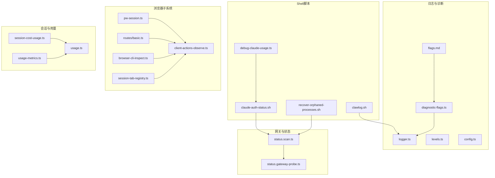

图表来源
- [scripts/claude-auth-status.sh](file://scripts/claude-auth-status.sh#L1-L281)
- [scripts/clawlog.sh](file://scripts/clawlog.sh#L1-L322)
- [scripts/recover-orphaned-processes.sh](file://scripts/recover-orphaned-processes.sh#L1-L192)
- [scripts/debug-claude-usage.ts](file://scripts/debug-claude-usage.ts#L297-L328)
- [src/logging/logger.ts](file://src/logging/logger.ts#L183-L233)
- [src/logging/levels.ts](file://src/logging/levels.ts#L1-L37)
- [src/logging/config.ts](file://src/logging/config.ts#L1-L25)
- [src/infra/diagnostic-flags.ts](file://src/infra/diagnostic-flags.ts#L1-L92)
- [docs/diagnostics/flags.md](file://docs/diagnostics/flags.md#L1-L92)
- [src/commands/status.scan.ts](file://src/commands/status.scan.ts#L75-L108)
- [src/commands/status.gateway-probe.ts](file://src/commands/status.gateway-probe.ts#L1-L24)
- [src/browser/pw-session.ts](file://src/browser/pw-session.ts#L229-L270)
- [src/browser/client-actions-observe.ts](file://src/browser/client-actions-observe.ts#L70-L114)
- [src/browser/routes/basic.ts](file://src/browser/routes/basic.ts#L42-L74)
- [src/cli/browser-cli-inspect.ts](file://src/cli/browser-cli-inspect.ts#L74-L98)
- [src/browser/session-tab-registry.ts](file://src/browser/session-tab-registry.ts#L51-L107)
- [src/infra/session-cost-usage.ts](file://src/infra/session-cost-usage.ts#L708-L876)
- [src/gateway/server-methods/usage.ts](file://src/gateway/server-methods/usage.ts#L623-L660)
- [ui/src/ui/views/usage-metrics.ts](file://ui/src/ui/views/usage-metrics.ts#L341-L516)

章节来源
- [scripts/claude-auth-status.sh](file://scripts/claude-auth-status.sh#L1-L281)
- [scripts/clawlog.sh](file://scripts/clawlog.sh#L1-L322)
- [scripts/recover-orphaned-processes.sh](file://scripts/recover-orphaned-processes.sh#L1-L192)
- [src/logging/logger.ts](file://src/logging/logger.ts#L183-L233)
- [src/logging/levels.ts](file://src/logging/levels.ts#L1-L37)
- [src/logging/config.ts](file://src/logging/config.ts#L1-L25)
- [src/infra/diagnostic-flags.ts](file://src/infra/diagnostic-flags.ts#L1-L92)
- [docs/diagnostics/flags.md](file://docs/diagnostics/flags.md#L1-L92)
- [src/commands/status.scan.ts](file://src/commands/status.scan.ts#L75-L108)
- [src/commands/status.gateway-probe.ts](file://src/commands/status.gateway-probe.ts#L1-L24)
- [src/browser/pw-session.ts](file://src/browser/pw-session.ts#L229-L270)
- [src/browser/client-actions-observe.ts](file://src/browser/client-actions-observe.ts#L70-L114)
- [src/browser/routes/basic.ts](file://src/browser/routes/basic.ts#L42-L74)
- [src/cli/browser-cli-inspect.ts](file://src/cli/browser-cli-inspect.ts#L74-L98)
- [src/browser/session-tab-registry.ts](file://src/browser/session-tab-registry.ts#L51-L107)
- [src/infra/session-cost-usage.ts](file://src/infra/session-cost-usage.ts#L708-L876)
- [src/gateway/server-methods/usage.ts](file://src/gateway/server-methods/usage.ts#L623-L660)
- [ui/src/ui/views/usage-metrics.ts](file://ui/src/ui/views/usage-metrics.ts#L341-L516)

## 核心调试工具与脚本
- Claude认证状态检查：检测Claude Code与OpenClaw的认证有效期与状态，支持全量/JSON/简单三种输出模式，并可联动服务状态判断。
- 日志采集工具：macOS统一日志采集器，支持按类别、时间范围、错误过滤、文本搜索、导出到文件、实时流式查看等。
- 孤儿进程恢复：扫描可能遗留的编码代理进程（如Codex/Claude），输出JSON诊断信息，包含PID、命令、工作目录、启动时间等。
- Claude用量调试：通过Web接口获取组织用量数据，辅助定位额度或配额问题。

章节来源
- [scripts/claude-auth-status.sh](file://scripts/claude-auth-status.sh#L1-L281)
- [scripts/clawlog.sh](file://scripts/clawlog.sh#L1-L322)
- [scripts/recover-orphaned-processes.sh](file://scripts/recover-orphaned-processes.sh#L1-L192)
- [scripts/debug-claude-usage.ts](file://scripts/debug-claude-usage.ts#L297-L328)

## 架构总览与日志系统
OpenClaw的日志系统由以下层次组成：
- 日志级别与最小级别映射：定义了从silent到trace的级别集合，并提供解析与归一化逻辑。
- 日志记录器构建：根据配置解析当前设置，缓存TsLogger实例，支持子日志器绑定与最小级别控制。
- 诊断标志：通过配置或环境变量启用特定子系统调试，避免全局提升日志级别带来的噪声。
- 日志文件配置：支持从主配置读取日志段大小限制等参数，保障日志滚动与磁盘空间管理。

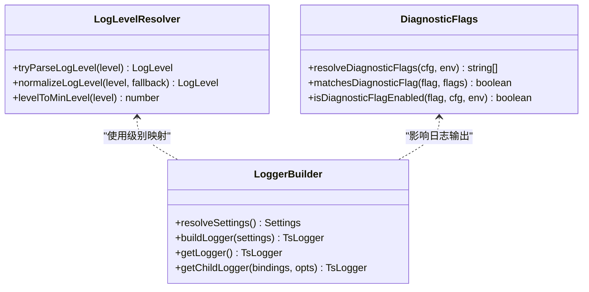

图表来源
- [src/logging/levels.ts](file://src/logging/levels.ts#L1-L37)
- [src/logging/logger.ts](file://src/logging/logger.ts#L183-L233)
- [src/infra/diagnostic-flags.ts](file://src/infra/diagnostic-flags.ts#L1-L92)

章节来源
- [src/logging/levels.ts](file://src/logging/levels.ts#L1-L37)
- [src/logging/logger.ts](file://src/logging/logger.ts#L183-L233)
- [src/infra/diagnostic-flags.ts](file://src/infra/diagnostic-flags.ts#L1-L92)
- [docs/diagnostics/flags.md](file://docs/diagnostics/flags.md#L1-L92)

## 详细组件分析与调试流程

### Claude认证状态与用量监控
- 认证状态检查：优先尝试JSON模式获取模型状态，回退到本地文件；对Claude Code与OpenClaw分别计算到期时间并给出“缺失/过期/即将过期/正常”状态。
- 用量调试：通过Web API查询组织用量，返回状态码与响应体，便于定位认证失败或配额不足问题。
- 实用建议：结合服务状态（systemctl）与认证状态脚本，快速判断是否需要重新授权或同步配置。

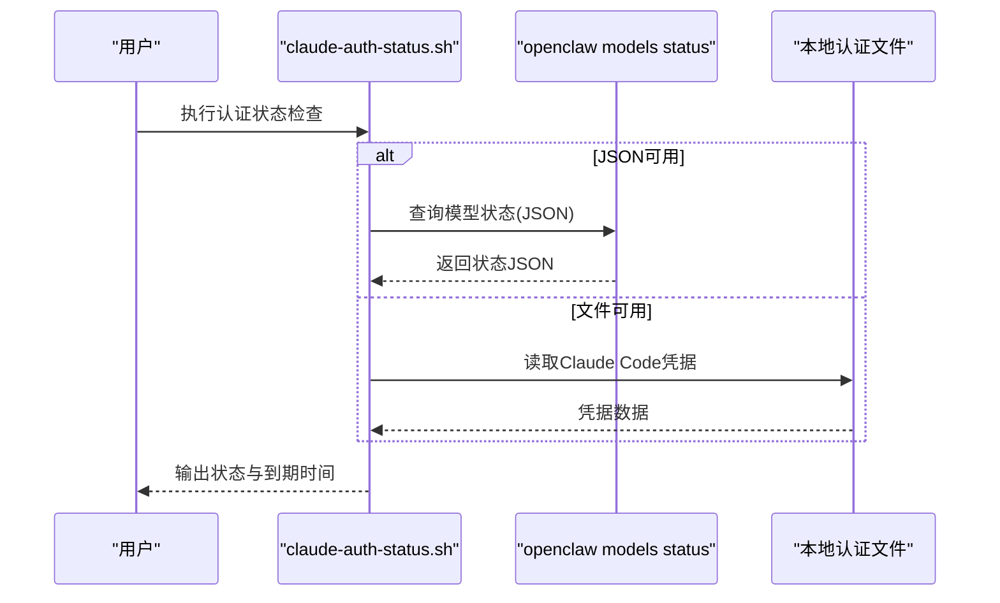

图表来源
- [scripts/claude-auth-status.sh](file://scripts/claude-auth-status.sh#L1-L281)
- [scripts/debug-claude-usage.ts](file://scripts/debug-claude-usage.ts#L297-L328)

章节来源
- [scripts/claude-auth-status.sh](file://scripts/claude-auth-status.sh#L1-L281)
- [scripts/debug-claude-usage.ts](file://scripts/debug-claude-usage.ts#L297-L328)

### 日志采集与过滤（macOS统一日志）
- 功能特性：支持按子系统、类别、错误级别、时间范围、关键词搜索、导出文件、实时流式查看、JSON输出等。
- 安全提示：默认隐私保护会隐藏敏感信息，可通过配置免密sudo以完整显示。
- 使用建议：先用错误过滤聚焦问题，再逐步放宽到类别或时间范围，最后导出用于离线分析。

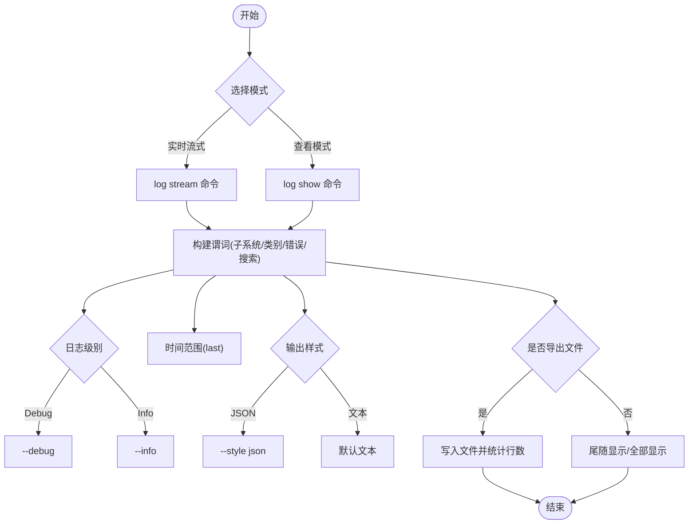

图表来源
- [scripts/clawlog.sh](file://scripts/clawlog.sh#L1-L322)

章节来源
- [scripts/clawlog.sh](file://scripts/clawlog.sh#L1-L322)

### 进程恢复与孤儿进程处理
- 扫描策略：优先使用pgrep进行预筛选，再对候选进程获取命令行；若pgrep不可用则按用户或全系统回退扫描。
- 过滤规则：仅匹配包含“codex|claude”的命令，排除网关、signal-cli、CLI二进制与自身脚本。
- 输出安全：对命令行中的敏感参数进行脱敏处理，避免泄露令牌或密钥。
- 结果：输出JSON对象，包含孤儿进程列表与时间戳，便于进一步处理或上报。

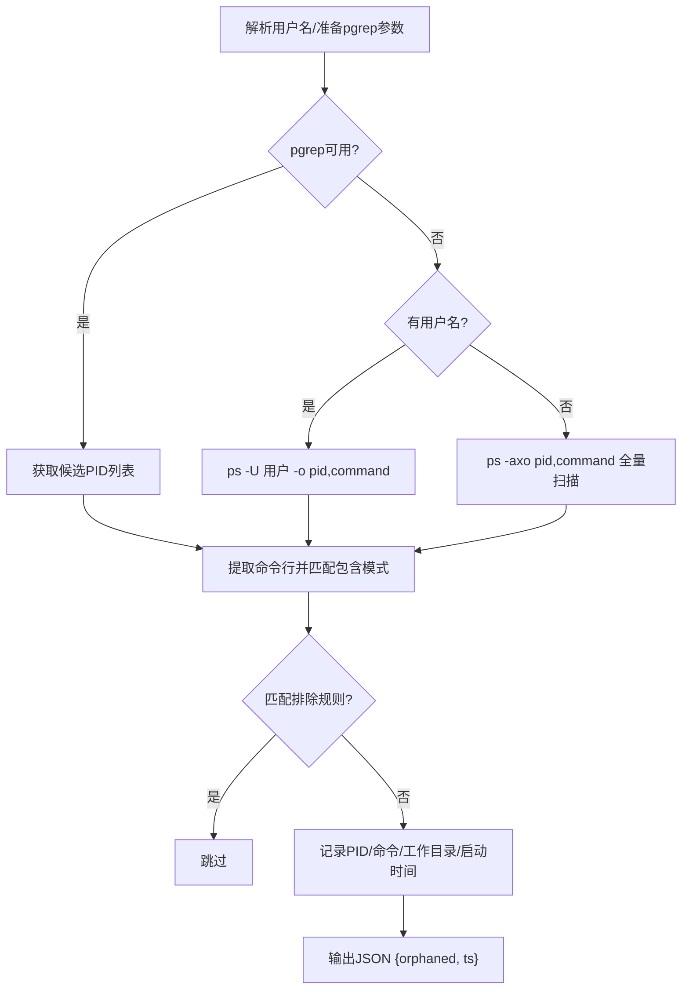

图表来源
- [scripts/recover-orphaned-processes.sh](file://scripts/recover-orphaned-processes.sh#L1-L192)

章节来源
- [scripts/recover-orphaned-processes.sh](file://scripts/recover-orphaned-processes.sh#L1-L192)

### 网关连接与通道集成故障排查
- 健康检查命令梯：status、gateway status、logs --follow、doctor、channels status --probe。
- 关键信号：运行时状态、RPC探测结果、通道连通性、设备/配对状态。
- 常见症状与定位：
  - 无回复：检查路由与策略（提及要求、允许白名单）、发送方配对状态。
  - 控制UI连接失败：校验URL、鉴权模式、设备身份挑战/签名流程。
  - 服务未运行：检查配置与端口冲突、非回环绑定缺少鉴权。
  - 通道消息不流动：检查权限/作用域、群组允许白名单、提及要求。
  - 定时任务/心跳：检查调度器状态、静默时段、目标账户有效性。

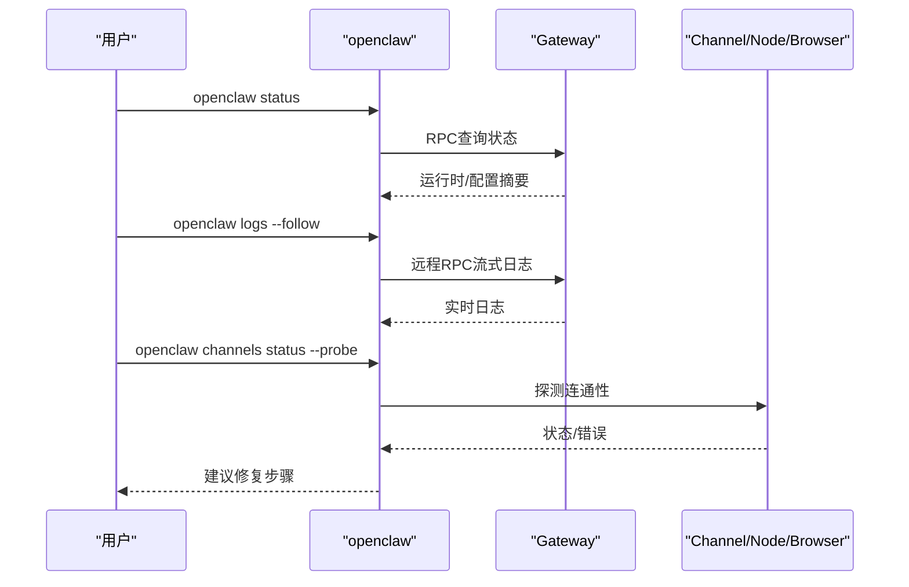

图表来源
- [docs/gateway/troubleshooting.md](file://docs/gateway/troubleshooting.md#L1-L367)
- [docs/cli/logs.md](file://docs/cli/logs.md#L1-L29)
- [src/commands/status.scan.ts](file://src/commands/status.scan.ts#L75-L108)
- [src/commands/status.gateway-probe.ts](file://src/commands/status.gateway-probe.ts#L1-L24)

章节来源
- [docs/gateway/troubleshooting.md](file://docs/gateway/troubleshooting.md#L1-L367)
- [docs/cli/logs.md](file://docs/cli/logs.md#L1-L29)
- [src/commands/status.scan.ts](file://src/commands/status.scan.ts#L75-L108)
- [src/commands/status.gateway-probe.ts](file://src/commands/status.gateway-probe.ts#L1-L24)

### 开发环境调试技巧
- 运行时调试覆盖：通过聊天中的/debug命令临时覆盖配置（仅内存生效），支持查看、设置、取消与重置。
- 热重启调试：使用gateway:watch在文件变更时自动重启网关，便于快速迭代。
- 开发配置隔离：使用--dev全局配置隔离状态目录与端口，配合dev网关自动创建默认配置与工作区。
- 原始流日志：开启原始助手流日志与原始块日志，捕获推理泄漏或分块解析前的数据，注意敏感信息脱敏与及时清理。

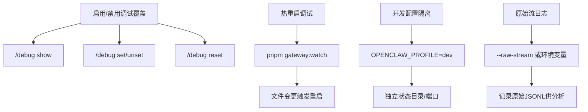

图表来源
- [docs/help/debugging.md](file://docs/help/debugging.md#L1-L163)

章节来源
- [docs/help/debugging.md](file://docs/help/debugging.md#L1-L163)

### 诊断标志与目标化调试
- 启用方式：配置文件或环境变量（OPENCLAW_DIAGNOSTICS），支持通配符与组合。
- 日志落盘：默认写入/tmp/openclaw/openclaw-YYYY-MM-DD.log，遵循JSONL格式与敏感信息脱敏策略。
- 提取与过滤：使用正则或tail -f配合rg进行关键字过滤，定位特定子系统问题。

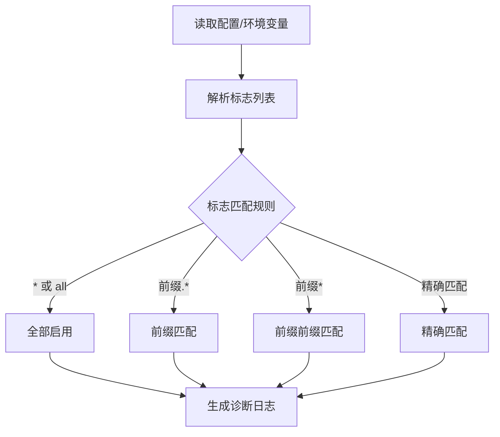

图表来源
- [src/infra/diagnostic-flags.ts](file://src/infra/diagnostic-flags.ts#L1-L92)
- [docs/diagnostics/flags.md](file://docs/diagnostics/flags.md#L1-L92)

章节来源
- [src/infra/diagnostic-flags.ts](file://src/infra/diagnostic-flags.ts#L1-L92)
- [docs/diagnostics/flags.md](file://docs/diagnostics/flags.md#L1-L92)

### 浏览器子系统调试与网络跟踪
- 事件监听：页面console消息、页面错误、请求/响应生命周期，维护固定长度队列以控制内存占用。
- 请求查询：通过HTTP接口获取当前目标的网络请求列表，支持过滤、清空与指定目标。
- 快照与跟踪：CLI支持快照抓取与跟踪启动，结合CDP进行截图、快照与源码采集。
- 会话标签追踪：记录会话与浏览器目标的关联，便于跨组件定位。

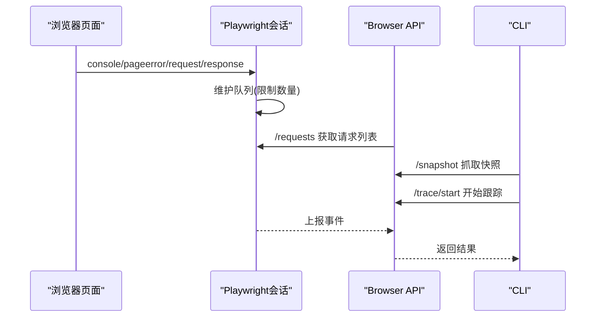

图表来源
- [src/browser/pw-session.ts](file://src/browser/pw-session.ts#L229-L270)
- [src/browser/client-actions-observe.ts](file://src/browser/client-actions-observe.ts#L70-L114)
- [src/cli/browser-cli-inspect.ts](file://src/cli/browser-cli-inspect.ts#L74-L98)
- [src/browser/routes/basic.ts](file://src/browser/routes/basic.ts#L42-L74)
- [src/browser/session-tab-registry.ts](file://src/browser/session-tab-registry.ts#L51-L107)

章节来源
- [src/browser/pw-session.ts](file://src/browser/pw-session.ts#L229-L270)
- [src/browser/client-actions-observe.ts](file://src/browser/client-actions-observe.ts#L70-L114)
- [src/cli/browser-cli-inspect.ts](file://src/cli/browser-cli-inspect.ts#L74-L98)
- [src/browser/routes/basic.ts](file://src/browser/routes/basic.ts#L42-L74)
- [src/browser/session-tab-registry.ts](file://src/browser/session-tab-registry.ts#L51-L107)

### 会话成本与用量统计
- 会话用量加载：支持按会话ID/文件路径加载时间序列、日志与用量统计，含每日分解、延迟统计、工具与模型用量聚合。
- 网关侧聚合：按模型/供应商维度合并用量与延迟，支持按天粒度统计。
- UI指标：按渠道、模型、供应商、代理聚合消息计数、工具调用次数、成本与延迟指标。

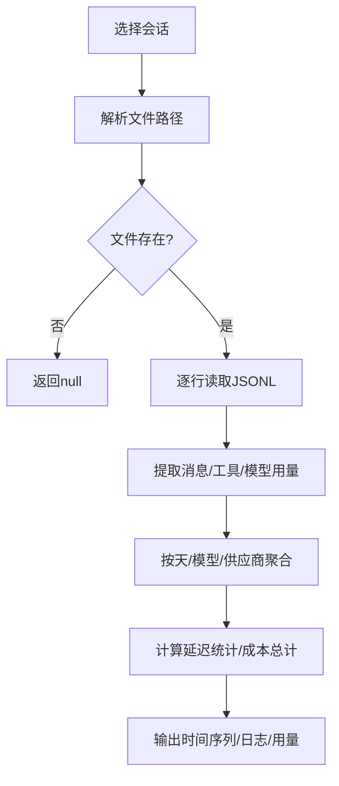

图表来源
- [src/infra/session-cost-usage.ts](file://src/infra/session-cost-usage.ts#L708-L876)
- [src/gateway/server-methods/usage.ts](file://src/gateway/server-methods/usage.ts#L623-L660)
- [ui/src/ui/views/usage-metrics.ts](file://ui/src/ui/views/usage-metrics.ts#L341-L516)

章节来源
- [src/infra/session-cost-usage.ts](file://src/infra/session-cost-usage.ts#L708-L876)
- [src/gateway/server-methods/usage.ts](file://src/gateway/server-methods/usage.ts#L623-L660)
- [ui/src/ui/views/usage-metrics.ts](file://ui/src/ui/views/usage-metrics.ts#L341-L516)

## 依赖关系与耦合分析
- 工具脚本与CLI：认证状态脚本依赖openclaw models status与本地认证文件；日志脚本依赖macOS log工具与sudo权限；孤儿进程脚本依赖ps/pgrep与Node。
- 日志系统：日志级别解析与最小级别映射被日志记录器构建器复用；诊断标志决定日志输出内容与粒度。
- 网关与状态：状态扫描与探针解析共同构成健康检查链路，支撑远程日志与故障定位。
- 浏览器子系统：Playwright事件监听与HTTP API相互配合，形成端到端的调试闭环。
- 会话与用量：底层会话用量加载与UI指标聚合解耦，便于在不同层面对用量进行可视化与分析。

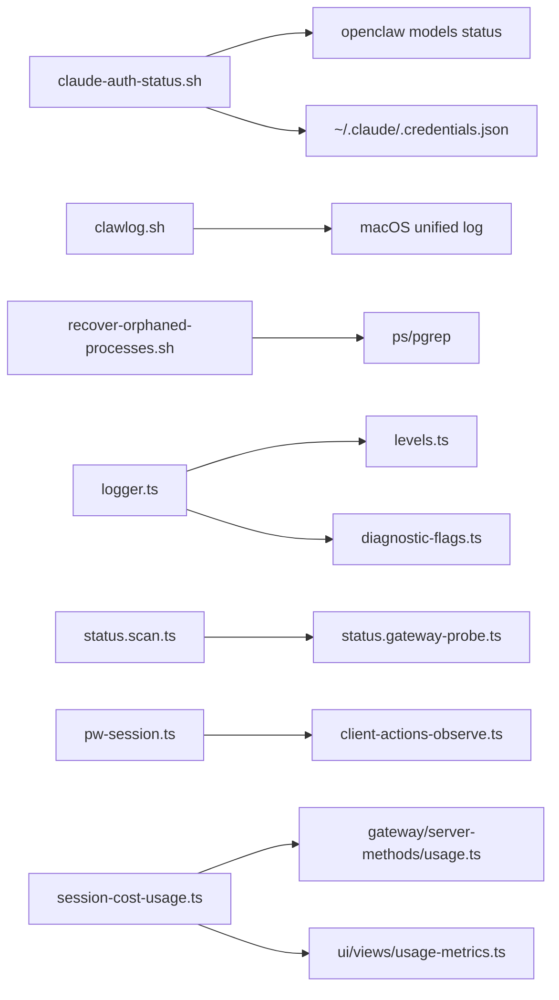

图表来源
- [scripts/claude-auth-status.sh](file://scripts/claude-auth-status.sh#L1-L281)
- [scripts/clawlog.sh](file://scripts/clawlog.sh#L1-L322)
- [scripts/recover-orphaned-processes.sh](file://scripts/recover-orphaned-processes.sh#L1-L192)
- [src/logging/logger.ts](file://src/logging/logger.ts#L183-L233)
- [src/logging/levels.ts](file://src/logging/levels.ts#L1-L37)
- [src/infra/diagnostic-flags.ts](file://src/infra/diagnostic-flags.ts#L1-L92)
- [src/commands/status.scan.ts](file://src/commands/status.scan.ts#L75-L108)
- [src/commands/status.gateway-probe.ts](file://src/commands/status.gateway-probe.ts#L1-L24)
- [src/browser/pw-session.ts](file://src/browser/pw-session.ts#L229-L270)
- [src/browser/client-actions-observe.ts](file://src/browser/client-actions-observe.ts#L70-L114)
- [src/infra/session-cost-usage.ts](file://src/infra/session-cost-usage.ts#L708-L876)
- [src/gateway/server-methods/usage.ts](file://src/gateway/server-methods/usage.ts#L623-L660)
- [ui/src/ui/views/usage-metrics.ts](file://ui/src/ui/views/usage-metrics.ts#L341-L516)

章节来源
- [scripts/claude-auth-status.sh](file://scripts/claude-auth-status.sh#L1-L281)
- [scripts/clawlog.sh](file://scripts/clawlog.sh#L1-L322)
- [scripts/recover-orphaned-processes.sh](file://scripts/recover-orphaned-processes.sh#L1-L192)
- [src/logging/logger.ts](file://src/logging/logger.ts#L183-L233)
- [src/logging/levels.ts](file://src/logging/levels.ts#L1-L37)
- [src/infra/diagnostic-flags.ts](file://src/infra/diagnostic-flags.ts#L1-L92)
- [src/commands/status.scan.ts](file://src/commands/status.scan.ts#L75-L108)
- [src/commands/status.gateway-probe.ts](file://src/commands/status.gateway-probe.ts#L1-L24)
- [src/browser/pw-session.ts](file://src/browser/pw-session.ts#L229-L270)
- [src/browser/client-actions-observe.ts](file://src/browser/client-actions-observe.ts#L70-L114)
- [src/infra/session-cost-usage.ts](file://src/infra/session-cost-usage.ts#L708-L876)
- [src/gateway/server-methods/usage.ts](file://src/gateway/server-methods/usage.ts#L623-L660)
- [ui/src/ui/views/usage-metrics.ts](file://ui/src/ui/views/usage-metrics.ts#L341-L516)

## 性能分析与资源监控
- 内存使用：通过memory子命令进行索引与检索，支持深度探测与强制重建，便于定位内存插件可用性与索引状态。
- CPU占用：结合系统监控工具（如top/htop）与日志中的延迟统计，定位热点会话与工具调用。
- 网络请求跟踪：利用浏览器子系统的请求/响应事件与HTTP接口，抓取关键目标的网络行为，辅助排查代理/鉴权/超时等问题。
- 用量与成本：基于会话级别的token、成本与延迟统计，识别高成本/低效会话，优化模型与工具选择。

章节来源
- [docs/cli/memory.md](file://docs/cli/memory.md#L1-L67)
- [src/browser/pw-session.ts](file://src/browser/pw-session.ts#L229-L270)
- [src/browser/client-actions-observe.ts](file://src/browser/client-actions-observe.ts#L70-L114)
- [src/infra/session-cost-usage.ts](file://src/infra/session-cost-usage.ts#L708-L876)

## 生产环境排障与工具链
- 远程日志：使用openclaw logs在远程模式下查看网关日志，支持JSON输出与本地时间渲染。
- 诊断标志：在不提升全局日志级别的情况下，启用特定子系统的诊断日志，便于精准定位问题。
- 网关健康：遵循命令梯（status、gateway status、logs --follow、doctor、channels status --probe）进行快速诊断。
- iOS网关连接：确认URL、稳定ID、TLS参数与鉴权，确保WebSocket会话建立成功。

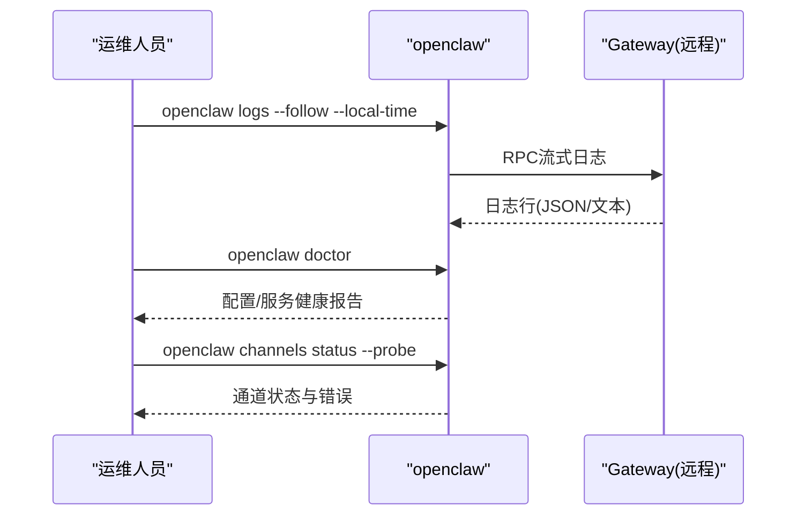

图表来源
- [docs/cli/logs.md](file://docs/cli/logs.md#L1-L29)
- [docs/gateway/troubleshooting.md](file://docs/gateway/troubleshooting.md#L1-L367)
- [apps/ios/Sources/Model/NodeAppModel.swift](file://apps/ios/Sources/Model/NodeAppModel.swift#L1639-L1661)

章节来源
- [docs/cli/logs.md](file://docs/cli/logs.md#L1-L29)
- [docs/gateway/troubleshooting.md](file://docs/gateway/troubleshooting.md#L1-L367)
- [apps/ios/Sources/Model/NodeAppModel.swift](file://apps/ios/Sources/Model/NodeAppModel.swift#L1639-L1661)

## 结论
OpenClaw提供了从认证状态、日志采集、进程恢复到网关与通道故障排查的完整工具链。通过合理使用诊断标志、远程日志与浏览器子系统，可以在开发与生产环境中高效定位问题。建议在日常工作中：
- 将诊断标志作为默认调试手段，避免全局提升日志级别
- 使用远程日志与命令梯进行快速健康检查
- 对高成本/高延迟会话进行用量与延迟分析
- 在浏览器调试中结合快照与跟踪，定位前端交互问题

## 附录：常用命令与配置参考
- Claude认证状态：脚本支持全量/JSON/简单输出，可联动服务状态判断
- 日志采集：按类别、时间范围、错误过滤、关键词搜索、导出文件、实时流式查看
- 远程日志：openclaw logs --follow --json --local-time
- 诊断标志：OPENCLAW_DIAGNOSTICS=telegram.http,telegram.payload 或配置文件中diagnostics.flags
- 网关健康命令梯：status、gateway status、logs --follow、doctor、channels status --probe
- 浏览器调试：/requests、/snapshot、/trace/start，结合CLI与CDP进行端到端分析
- 会话用量：按模型/供应商/渠道聚合的消息计数、工具调用次数、成本与延迟统计

章节来源
- [scripts/claude-auth-status.sh](file://scripts/claude-auth-status.sh#L1-L281)
- [scripts/clawlog.sh](file://scripts/clawlog.sh#L1-L322)
- [docs/cli/logs.md](file://docs/cli/logs.md#L1-L29)
- [docs/diagnostics/flags.md](file://docs/diagnostics/flags.md#L1-L92)
- [docs/gateway/troubleshooting.md](file://docs/gateway/troubleshooting.md#L1-L367)
- [src/browser/client-actions-observe.ts](file://src/browser/client-actions-observe.ts#L70-L114)
- [src/cli/browser-cli-inspect.ts](file://src/cli/browser-cli-inspect.ts#L74-L98)
- [src/infra/session-cost-usage.ts](file://src/infra/session-cost-usage.ts#L708-L876)