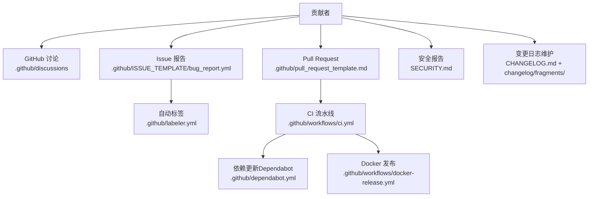
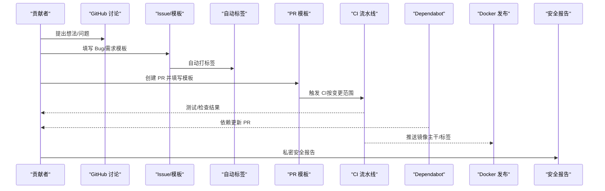
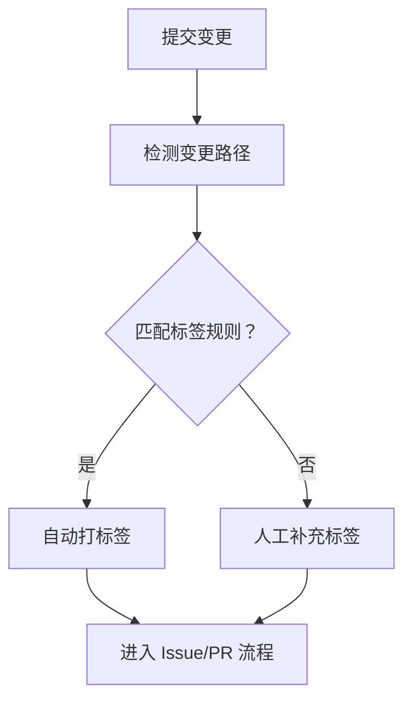
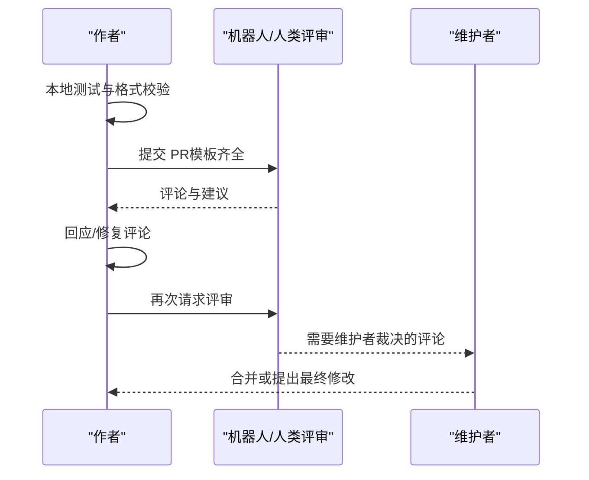
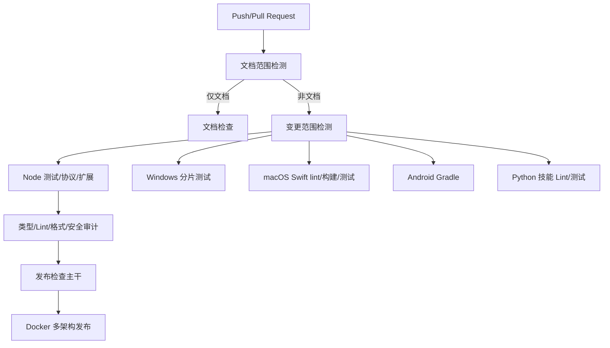
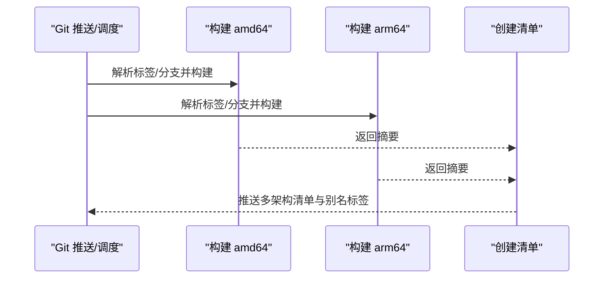
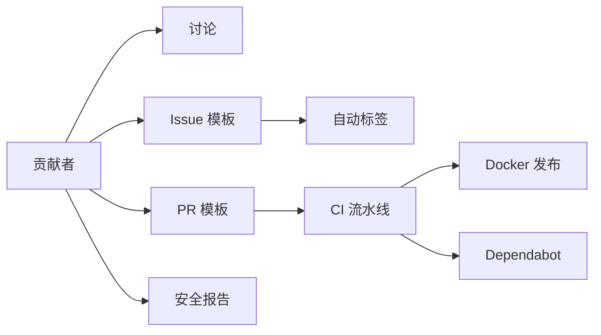

# 贡献流程与协作

<cite>
**本文引用的文件**
- [CONTRIBUTING.md](file://CONTRIBUTING.md)
- [SECURITY.md](file://SECURITY.md)
- [.github/pull_request_template.md](file://.github/pull_request_template.md)
- [.github/labeler.yml](file://.github/labeler.yml)
- [.github/dependabot.yml](file://.github/dependabot.yml)
- [.github/workflows/ci.yml](file://.github/workflows/ci.yml)
- [.github/workflows/docker-release.yml](file://.github/workflows/docker-release.yml)
- [.github/actionlint.yaml](file://.github/actionlint.yaml)
- [.github/ISSUE_TEMPLATE/bug_report.yml](file://.github/ISSUE_TEMPLATE/bug_report.yml)
- [VISION.md](file://VISION.md)
- [CHANGELOG.md](file://CHANGELOG.md)
- [changelog/fragments/](file://changelog/fragments/)
</cite>

## 目录
1. [简介](#简介)
2. [项目结构](#项目结构)
3. [核心组件](#核心组件)
4. [架构总览](#架构总览)
5. [详细组件分析](#详细组件分析)
6. [依赖分析](#依赖分析)
7. [性能考虑](#性能考虑)
8. [故障排查指南](#故障排查指南)
9. [结论](#结论)
10. [附录](#附录)

## 简介
本指南面向所有希望参与 OpenClaw 项目的贡献者，覆盖从问题报告、讨论、标签与任务分配，到 Pull Request（PR）创建、代码审查与合并的完整协作流程；同时包含社区行为准则、沟通规范、冲突解决机制、发布与版本管理、变更日志维护，以及新贡献者的入门建议与常见问题解答。文档中的所有流程与规则均以仓库现有配置与规范为依据。

## 项目结构
OpenClaw 是一个多语言、多平台的大型协作项目，包含核心运行时、CLI、网关、应用（macOS/iOS/Android）、插件生态、技能库、文档与自动化流水线等模块。贡献流程的关键入口与支撑文件主要集中在以下位置：
- 贡献与安全策略：CONTRIBUTING.md、SECURITY.md
- GitHub 模板与标签：.github/pull_request_template.md、.github/labeler.yml、.github/ISSUE_TEMPLATE/bug_report.yml
- 自动化与发布：.github/workflows/ci.yml、.github/workflows/docker-release.yml、.github/dependabot.yml、.github/actionlint.yaml
- 项目愿景与方向：VISION.md
- 变更日志：CHANGELOG.md 与 changelog/fragments/

图表来源
- [.github/labeler.yml:1-317](file://.github/labeler.yml#L1-L317)
- [.github/pull_request_template.md:1-116](file://.github/pull_request_template.md#L1-L116)
- [.github/ISSUE_TEMPLATE/bug_report.yml:1-138](file://.github/ISSUE_TEMPLATE/bug_report.yml#L1-L138)
- [.github/workflows/ci.yml:1-827](file://.github/workflows/ci.yml#L1-L827)
- [.github/workflows/docker-release.yml:1-384](file://.github/workflows/docker-release.yml#L1-L384)
- [.github/dependabot.yml:1-128](file://.github/dependabot.yml#L1-L128)
- [SECURITY.md:1-293](file://SECURITY.md#L1-L293)
- [CHANGELOG.md](file://CHANGELOG.md)
- [changelog/fragments/](file://changelog/fragments/)

章节来源
- [.github/labeler.yml:1-317](file://.github/labeler.yml#L1-L317)
- [.github/pull_request_template.md:1-116](file://.github/pull_request_template.md#L1-L116)
- [.github/ISSUE_TEMPLATE/bug_report.yml:1-138](file://.github/ISSUE_TEMPLATE/bug_report.yml#L1-L138)
- [.github/workflows/ci.yml:1-827](file://.github/workflows/ci.yml#L1-L827)
- [.github/workflows/docker-release.yml:1-384](file://.github/workflows/docker-release.yml#L1-L384)
- [.github/dependabot.yml:1-128](file://.github/dependabot.yml#L1-L128)
- [SECURITY.md:1-293](file://SECURITY.md#L1-L293)
- [CHANGELOG.md](file://CHANGELOG.md)
- [changelog/fragments/](file://changelog/fragments/)

## 核心组件
- 贡献与沟通
  - 快速链接与维护者信息、贡献前准备、评审对话责任归属、AI 协作提示等在 CONTRIBUTING.md 中明确。
  - 重大功能或架构变更需先在 GitHub Discussions 或 Discord 讨论，再进入 Issue/PR。
- Issue 与标签
  - Bug 报告模板标准化字段，便于可复现性与影响评估。
  - 自动标签器根据变更路径自动打标签，提升分类与分派效率。
- PR 流程与模板
  - 统一的 PR 模板帮助描述问题、变更范围、安全影响、验证步骤、兼容性与回滚方案。
- 安全与漏洞披露
  - 明确的私有披露渠道、报告清单、快速通道与信任模型，避免误报与重复。
- 发布与版本管理
  - CI 分层检测变更范围、按平台/语言矩阵执行测试与构建。
  - Docker 多架构镜像与清单发布，支持主干与标签回填。
  - Dependabot 自动化依赖更新与 PR 限制，降低升级成本。
- 变更日志
  - 采用片段式（fragment）方式维护 CHANGELOG.md，确保每次改动可追溯。

章节来源
- [CONTRIBUTING.md:82-199](file://CONTRIBUTING.md#L82-L199)
- [.github/ISSUE_TEMPLATE/bug_report.yml:1-138](file://.github/ISSUE_TEMPLATE/bug_report.yml#L1-L138)
- [.github/labeler.yml:1-317](file://.github/labeler.yml#L1-L317)
- [.github/pull_request_template.md:1-116](file://.github/pull_request_template.md#L1-L116)
- [.github/workflows/ci.yml:1-827](file://.github/workflows/ci.yml#L1-L827)
- [.github/workflows/docker-release.yml:1-384](file://.github/workflows/docker-release.yml#L1-L384)
- [.github/dependabot.yml:1-128](file://.github/dependabot.yml#L1-L128)
- [SECURITY.md:1-293](file://SECURITY.md#L1-L293)
- [CHANGELOG.md](file://CHANGELOG.md)
- [changelog/fragments/](file://changelog/fragments/)

## 架构总览
下图展示从“问题发现”到“代码合并”的端到端协作架构，包括讨论、标签、PR、CI、发布与安全通道：

图表来源
- [.github/ISSUE_TEMPLATE/bug_report.yml:1-138](file://.github/ISSUE_TEMPLATE/bug_report.yml#L1-L138)
- [.github/labeler.yml:1-317](file://.github/labeler.yml#L1-L317)
- [.github/pull_request_template.md:1-116](file://.github/pull_request_template.md#L1-L116)
- [.github/workflows/ci.yml:1-827](file://.github/workflows/ci.yml#L1-L827)
- [.github/workflows/docker-release.yml:1-384](file://.github/workflows/docker-release.yml#L1-L384)
- [.github/dependabot.yml:1-128](file://.github/dependabot.yml#L1-L128)
- [SECURITY.md:1-293](file://SECURITY.md#L1-L293)

## 详细组件分析

### GitHub 讨论与 Issue 报告
- 讨论优先：重大功能/架构变更需先在 Discussions 或 Discord 讨论，形成共识后再进入 Issue/PR。
- Bug 报告模板强制字段：类型、摘要、复现步骤、期望/实际行为、版本、操作系统、安装方式、模型与路由链路、配置位置、附加证据与影响评估。
- 价值：提高可复现性与可追踪性，减少无效 PR。

章节来源
- [CONTRIBUTING.md:84-86](file://CONTRIBUTING.md#L84-L86)
- [.github/ISSUE_TEMPLATE/bug_report.yml:1-138](file://.github/ISSUE_TEMPLATE/bug_report.yml#L1-L138)

### 自动标签系统与任务分配
- 自动标签规则基于变更路径匹配，覆盖频道扩展、应用平台、网关、CLI、命令、脚本、Docker、代理扩展、安全等维度。
- 作用：自动归类、便于筛选与分派给相应维护者；减少人工标注负担。

图表来源
- [.github/labeler.yml:1-317](file://.github/labeler.yml#L1-L317)

章节来源
- [.github/labeler.yml:1-317](file://.github/labeler.yml#L1-L317)

### Pull Request 创建与审查流程
- PR 模板强制字段：摘要、变更类型、范围、关联 Issue/PR、用户可见变更、安全影响、环境与步骤、证据、人工验证、兼容性与迁移、失败恢复、风险与缓解。
- 审查对话责任：机器人/人类评审后，作者需自行处理并回复评论，不得留待维护者清理。
- 评审标准：本地测试、CI 通过、聚焦单一主题、清晰描述“做了什么/为什么做”、UI/视觉变更需附前后截图、遵循拼写与风格约定、受 CODEOWNERS 保护的路径需获得授权或由拥有者审查。

图表来源
- [.github/pull_request_template.md:1-116](file://.github/pull_request_template.md#L1-L116)
- [CONTRIBUTING.md:88-111](file://CONTRIBUTING.md#L88-L111)

章节来源
- [.github/pull_request_template.md:1-116](file://.github/pull_request_template.md#L1-L116)
- [CONTRIBUTING.md:88-111](file://CONTRIBUTING.md#L88-L111)

### CI 流水线与质量门禁
- 文档变更快速路径：仅运行文档检查，跳过重型任务。
- 变更范围检测：按 Node/Windows/macOS/Android/技能 Python 等维度决定是否执行对应作业。
- 多语言/多平台矩阵：Node（含分片）、Bun 兼容、Windows 分片、macOS Swift lint/构建/测试、Android Gradle 任务。
- 质量门禁：类型检查、Lint、格式化、UI 外链策略检查、启动内存检查、Node 22 兼容性、Python 技能 Lint/测试、Secrets 审计、工作流安全审计、生产依赖审计。
- 行为准则：并发组名用于取消冗余任务，避免资源浪费。

图表来源
- [.github/workflows/ci.yml:1-827](file://.github/workflows/ci.yml#L1-L827)

章节来源
- [.github/workflows/ci.yml:1-827](file://.github/workflows/ci.yml#L1-L827)

### Docker 发布与多架构镜像
- 触发条件：主干推送、标签推送、手动触发（回填）。
- 多架构：amd64/arm64 并行构建，生成默认镜像与 slim 镜像，最后创建多架构清单。
- 标签策略：主干生成 main 标签，标签生成语义化版本标签，首次稳定版本同时生成 latest/slim。
- 安全与合规：使用 GitHub Container Registry 登录，保留 OCI 标签与构建时间。

图表来源
- [.github/workflows/docker-release.yml:1-384](file://.github/workflows/docker-release.yml#L1-L384)

章节来源
- [.github/workflows/docker-release.yml:1-384](file://.github/workflows/docker-release.yml#L1-L384)

### 依赖更新与维护节奏
- Dependabot 配置：根 npm、GitHub Actions、Swift（macOS 应用、共享库、Swabble）、Gradle（Android）、Docker 基础镜像。
- 更新策略：按组分层（生产/开发、actions/swift/android/docker），限定每日/每周频率与冷却期，限制同时打开的 PR 数量，避免过度打断。
- 价值：降低安全与兼容风险，保持生态健康。

章节来源
- [.github/dependabot.yml:1-128](file://.github/dependabot.yml#L1-L128)

### 安全与漏洞披露
- 报告渠道：按受影响子系统选择对应仓库或通过安全邮箱路由。
- 报告清单：标题、严重度、影响、受影响组件、技术复现、演示影响、环境、补救建议。
- 快速通道：包含精确路径、版本信息、PoC、证据、边界说明、范围排除说明等。
- 信任模型与范围：明确“单用户可信操作员”模型、HTTP 兼容端点的权限边界、插件信任基线、工作区与临时目录边界、多租户隔离建议等。
- 无赏金政策：鼓励直接提交修复 PR，优先处理高质量报告。

章节来源
- [SECURITY.md:1-293](file://SECURITY.md#L1-L293)

### 版本管理与变更日志
- 片段式变更日志：每个改动生成独立片段文件，合并时汇总至主 CHANGELOG.md，便于追踪与审计。
- 版本发布：结合 CI/Docker 发布工作流，主干与标签分别产生不同标签集。
- 建议：每次改动附带片段，避免遗漏；PR 合并时同步更新片段。

章节来源
- [CHANGELOG.md](file://CHANGELOG.md)
- [changelog/fragments/](file://changelog/fragments/)
- [.github/workflows/docker-release.yml:1-384](file://.github/workflows/docker-release.yml#L1-L384)

### 新贡献者入门与最佳实践
- 从 Discussions 开始：重大改动先讨论，再进入 Issue/PR。
- 本地验证：遵循贡献前准备清单，运行构建、检查与测试。
- PR 质量：聚焦单一主题、清晰描述动机、附带证据与截图、遵守拼写与风格。
- 审查对话：作者负责跟进机器人评论，必要时请维护者裁决。
- AI 协作：若使用 AI 辅助，请在 PR 中标注并提供测试情况与提示记录。

章节来源
- [CONTRIBUTING.md:82-142](file://CONTRIBUTING.md#L82-L142)

## 依赖分析
- 贡献者与工具链耦合
  - 贡献者依赖 Discussions/Issue/PR 模板与标签系统进行高效沟通与分派。
  - CI 依赖变更范围检测与多平台矩阵，确保质量门禁与资源利用平衡。
  - 发布依赖 Docker 多架构构建与清单，保障跨平台可用性。
  - 安全依赖私有披露流程与信任模型，降低误报与扩大影响面。
- 关键外部依赖
  - GitHub Actions Runner（自托管标签与忽略规则）、Docker Registry、包生态（npm、SwiftPM、Gradle）。
- 潜在循环依赖
  - 未见直接循环依赖；标签系统与 CI 通过变更检测解耦，避免强耦合。

图表来源
- [.github/labeler.yml:1-317](file://.github/labeler.yml#L1-L317)
- [.github/pull_request_template.md:1-116](file://.github/pull_request_template.md#L1-L116)
- [.github/workflows/ci.yml:1-827](file://.github/workflows/ci.yml#L1-L827)
- [.github/workflows/docker-release.yml:1-384](file://.github/workflows/docker-release.yml#L1-L384)
- [.github/dependabot.yml:1-128](file://.github/dependabot.yml#L1-L128)
- [SECURITY.md:1-293](file://SECURITY.md#L1-L293)

章节来源
- [.github/labeler.yml:1-317](file://.github/labeler.yml#L1-L317)
- [.github/pull_request_template.md:1-116](file://.github/pull_request_template.md#L1-L116)
- [.github/workflows/ci.yml:1-827](file://.github/workflows/ci.yml#L1-L827)
- [.github/workflows/docker-release.yml:1-384](file://.github/workflows/docker-release.yml#L1-L384)
- [.github/dependabot.yml:1-128](file://.github/dependabot.yml#L1-L128)
- [SECURITY.md:1-293](file://SECURITY.md#L1-L293)

## 性能考虑
- CI 并发与资源控制：通过并发组与分片策略，避免重复与资源争用；Windows 与 macOS 作业合并以提升队列利用率。
- 变更范围检测：仅对相关区域运行重型任务，缩短反馈周期。
- 依赖更新节奏：合理设置冷却与上限，避免频繁 PR 干扰主流程。
- Docker 多架构并行：amd64/arm64 并行构建，减少发布等待时间。

## 故障排查指南
- PR 被机器人反复评论
  - 逐条处理评论，按要求修改并在 PR 中回复；如不适用，简要说明原因。
  - 若本地已运行 Codex/Review，仍需在 PR 中体现处理结果。
- CI 失败
  - 查看失败作业日志，确认是否因文档变更被跳过或范围检测误判；必要时调整 PR 或补充注释。
  - Windows/macOS 任务失败通常与资源限制或缓存相关，可重试或缩小变更范围。
- Docker 发布失败
  - 检查标签格式与权限；手动回填需经环境批准。
- 安全报告被拒
  - 按快速通道清单补齐技术细节、证据与边界说明；避免仅凭推测或扫描结果。

章节来源
- [CONTRIBUTING.md:101-111](file://CONTRIBUTING.md#L101-L111)
- [.github/workflows/ci.yml:1-827](file://.github/workflows/ci.yml#L1-L827)
- [.github/workflows/docker-release.yml:1-384](file://.github/workflows/docker-release.yml#L1-L384)
- [SECURITY.md:33-47](file://SECURITY.md#L33-L47)

## 结论
OpenClaw 的贡献流程以“先讨论、后实现、模板驱动、自动化门禁、私密安全、片段化日志”为核心，既保证了协作效率与质量，也兼顾了安全性与可维护性。新贡献者应优先阅读 CONTRIBUTING.md 与 SECURITY.md，严格遵循模板与门禁；维护者则通过标签、CI 与发布工作流确保项目稳定演进。

## 附录
- 社区与沟通
  - 快速链接：GitHub、愿景、Discord、社交媒体。
  - 讨论优先：重大变更先在 Discussions 或 Discord 讨论。
- 维护者申请
  - 有意愿长期参与贡献者可邮件提交申请材料，维护团队将审慎评估。

章节来源
- [CONTRIBUTING.md:5-81](file://CONTRIBUTING.md#L5-L81)
- [CONTRIBUTING.md:154-172](file://CONTRIBUTING.md#L154-L172)
- [VISION.md:1-111](file://VISION.md#L1-L111)