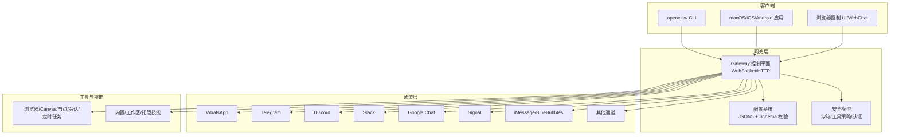
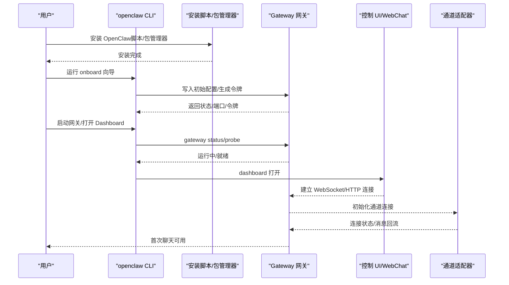

# 快速开始

<cite>
**本文引用的文件**
- [README.md](file://README.md)
- [package.json](file://package.json)
- [docs/start/getting-started.md](file://docs/start/getting-started.md)
- [docs/install/index.md](file://docs/install/index.md)
- [docs/install/node.md](file://docs/install/node.md)
- [docs/install/installer.md](file://docs/install/installer.md)
- [docs/cli/onboard.md](file://docs/cli/onboard.md)
- [docs/gateway/configuration.md](file://docs/gateway/configuration.md)
- [docs/gateway/configuration-examples.md](file://docs/gateway/configuration-examples.md)
- [docs/channels/pairing.md](file://docs/channels/pairing.md)
- [docs/help/troubleshooting.md](file://docs/help/troubleshooting.md)
- [docs/install/docker.md](file://docs/install/docker.md)
</cite>

## 目录
1. [简介](#简介)
2. [项目结构](#项目结构)
3. [核心组件](#核心组件)
4. [架构总览](#架构总览)
5. [详细组件分析](#详细组件分析)
6. [依赖分析](#依赖分析)
7. [性能考虑](#性能考虑)
8. [故障排除指南](#故障排除指南)
9. [结论](#结论)
10. [附录](#附录)

## 简介
本指南面向首次接触 OpenClaw 的用户，目标是在最短时间内完成安装、配置与首次运行，体验从零到一的完整流程。内容覆盖环境要求、多种安装方式（包管理器、脚本安装、源码构建）、首次配置与向导（openclaw onboard）使用、工作空间与渠道连接、以及安全配置要点（DM 访问控制与配对机制）。同时提供常见问题排查路径与实用命令示例，帮助你快速搭建并稳定运行 OpenClaw。

## 项目结构
OpenClaw 是一个跨平台的个人 AI 助手网关系统，支持多通道消息接入（如 WhatsApp、Telegram、Discord、Slack、Google Chat、Signal、iMessage、BlueBubbles、IRC、Microsoft Teams、Matrix、Feishu、LINE、Mattermost、Nextcloud Talk、Nostr、Synology Chat、Tlon、Twitch、Zalo、Zalo Personal、WebChat），并可在 macOS/iOS/Android 上通过节点执行本地能力（如摄像头、屏幕录制、通知、系统命令等）。其核心由“网关（Gateway）+ 控制 UI + 多通道适配器 + 工具与技能平台”构成。

图示来源
- [README.md](file://README.md#L185-L202)
- [docs/gateway/configuration.md](file://docs/gateway/configuration.md#L10-L24)

章节来源
- [README.md](file://README.md#L21-L28)
- [docs/start/getting-started.md](file://docs/start/getting-started.md#L9-L18)

## 核心组件
- 网关（Gateway）：单一路由控制平面，承载会话、通道、工具、事件与远程控制；提供 WebSocket 与 HTTP 接口。
- 配置系统：基于 JSON5 的可热重载配置，严格遵循 Schema 校验；支持分段 include 与环境变量注入。
- 安全模型：默认最小权限、工具沙箱、通道 DM 策略（配对/白名单/开放/禁用）、节点设备配对与权限校验。
- 通道适配器：多通道接入与路由，支持群组提及门控、媒体处理、心跳与钩子。
- 工具与技能：浏览器、Canvas、节点、会话、定时任务、钩子、技能平台等。

章节来源
- [docs/gateway/configuration.md](file://docs/gateway/configuration.md#L10-L24)
- [README.md](file://README.md#L112-L125)

## 架构总览
下图展示从终端到网关、再到各通道与工具的整体交互路径，以及首次运行的关键步骤。

图示来源
- [docs/start/getting-started.md](file://docs/start/getting-started.md#L28-L81)
- [docs/cli/onboard.md](file://docs/cli/onboard.md#L20-L27)
- [docs/install/installer.md](file://docs/install/installer.md#L67-L88)

章节来源
- [docs/start/getting-started.md](file://docs/start/getting-started.md#L28-L81)
- [docs/install/index.md](file://docs/install/index.md#L24-L70)

## 详细组件分析

### 环境要求与安装方式
- 系统要求
  - Node.js 版本：≥22（推荐使用安装脚本自动检测与安装）
  - 操作系统：macOS、Linux 或 Windows（建议在 WSL2 下运行）
  - 可选：pnpm（用于从源码构建）
- 安装方式
  - 安装器脚本（推荐）：一键检测/安装 Node、安装 OpenClaw 并启动向导
  - 包管理器：npm/pnpm 全局安装后运行向导
  - 从源码：克隆仓库、安装依赖、构建、链接 CLI 后运行向导
  - Docker：容器化网关与向导，适合隔离或验证流程

章节来源
- [docs/install/index.md](file://docs/install/index.md#L14-L22)
- [docs/install/node.md](file://docs/install/node.md#L12-L20)
- [docs/install/installer.md](file://docs/install/installer.md#L14-L18)
- [docs/install/docker.md](file://docs/install/docker.md#L13-L17)

### 首次配置与向导（openclaw onboard）
- 向导目标：引导完成网关配置、认证、可选通道与工作空间初始化
- 常用参数
  - --install-daemon：安装并启用后台服务（systemd/launchd）
  - --flow quickstart/manual：快速/手动模式
  - --mode remote/local：本地/远程网关模式
  - --non-interactive：非交互式自动化（配合密钥/令牌引用）
- 自动化要点
  - 支持以 SecretRef 存储密钥，避免明文写入
  - 支持自定义模型提供商与兼容模式
  - 支持网关令牌/密码模式与校验逻辑

章节来源
- [docs/cli/onboard.md](file://docs/cli/onboard.md#L8-L27)
- [docs/cli/onboard.md](file://docs/cli/onboard.md#L32-L56)
- [docs/cli/onboard.md](file://docs/cli/onboard.md#L64-L84)
- [docs/cli/onboard.md](file://docs/cli/onboard.md#L120-L128)

### 网关配置与工作空间
- 配置位置：~/.openclaw/openclaw.json（JSON5，支持注释与尾随逗号）
- 常见任务
  - 设置通道（WhatsApp/Telegram/Discord/Slack/Signal/iMessage/Google Chat/Mattermost/MS Teams 等）
  - 选择与配置模型（主模型与回退模型）
  - 控制 DM 访问（配对/允许列表/开放/禁用）
  - 群组提及门控与会话重置策略
  - 启用沙箱（Docker 隔离非主会话）
  - 配置心跳与钩子（Hooks）
- 热重载：大部分配置变更无需重启即可生效，关键项会在 hybrid 模式下自动重启

章节来源
- [docs/gateway/configuration.md](file://docs/gateway/configuration.md#L12-L24)
- [docs/gateway/configuration.md](file://docs/gateway/configuration.md#L74-L103)
- [docs/gateway/configuration.md](file://docs/gateway/configuration.md#L135-L146)
- [docs/gateway/configuration.md](file://docs/gateway/configuration.md#L349-L387)

### 渠道连接与工作空间设置
- 渠道配置要点
  - 每个通道在 channels.<provider> 下有独立配置
  - DM 策略统一遵循 dmPolicy（pairing/allowlist/open/disabled）
  - 群组可通过 groupPolicy 与 groupAllowFrom 控制
- 工作空间
  - 默认工作空间路径：~/.openclaw/workspace
  - 可在 agents.defaults.workspace 中调整
  - 支持多代理路由与绑定规则

章节来源
- [docs/gateway/configuration.md](file://docs/gateway/configuration.md#L77-L103)
- [docs/gateway/configuration-examples.md](file://docs/gateway/configuration-examples.md#L14-L47)
- [docs/gateway/configuration-examples.md](file://docs/gateway/configuration-examples.md#L448-L495)

### 安全配置：DM 访问控制与配对机制
- DM 策略
  - pairing：未知发件人需经配对批准
  - allowlist/open：仅允许白名单或开放所有入站 DM
  - 默认行为与风险提示详见安全指南
- 配对流程
  - DM 配对：发送者收到一次性配对码，批准后加入允许列表
  - 节点配对：通过 Telegram 等渠道接收 setup code 并在设备上确认
- 状态存储
  - DM 配对状态：~/.openclaw/credentials/<channel>-pairing.json 与 <channel>-allowFrom.json
  - 节点配对状态：~/.openclaw/devices/pending.json 与 paired.json

章节来源
- [README.md](file://README.md#L112-L124)
- [docs/channels/pairing.md](file://docs/channels/pairing.md#L20-L56)
- [docs/channels/pairing.md](file://docs/channels/pairing.md#L57-L98)

### 常见命令与实用流程
- 快速安装与向导
  - curl -fsSL https://openclaw.ai/install.sh | bash
  - openclaw onboard --install-daemon
- 检查网关状态与仪表盘
  - openclaw gateway status
  - openclaw dashboard
- 发送测试消息（需已配置通道）
  - openclaw message send --target +15555550123 --message "Hello from OpenClaw"
- 环境变量（可选）
  - OPENCLAW_HOME、OPENCLAW_STATE_DIR、OPENCLAW_CONFIG_PATH

章节来源
- [docs/start/getting-started.md](file://docs/start/getting-started.md#L28-L81)
- [docs/start/getting-started.md](file://docs/start/getting-started.md#L104-L112)

## 依赖分析
- 运行时依赖
  - Node.js ≥22（引擎声明）
  - 可选：pnpm（开发/构建）
- 第三方通道 SDK
  - Baileys（WhatsApp）、grammY（Telegram）、discord.js（Discord）、bolt（Slack）、signal-cli（Signal）、bluebubbles（iMessage）、matrix-sdk-crypto（Matrix）、google-gemini（Google Chat）、whiskeysockets/baileys（WhatsApp）、@napi-rs/canvas、node-llama-cpp 等
- 开发与工具链
  - tsx、vitest、oxlint、typescript、playwright-core、sharp、ws、yaml、zod 等

章节来源
- [package.json](file://package.json#L416-L418)
- [package.json](file://package.json#L335-L388)

## 性能考虑
- 本地优先：在本机运行网关可获得更低延迟与更佳体验；云主机建议使用 Docker 或 Podman 以获得一致的运行环境。
- 沙箱隔离：对非主会话启用 Docker 沙箱，降低工具执行带来的安全与资源风险。
- 浏览器与媒体：合理限制媒体大小与转录模型，避免高带宽与高算力消耗。
- 心跳与钩子：按需开启，避免不必要的周期性负载。

## 故障排除指南
- 快速诊断清单
  - openclaw status / openclaw status --all
  - openclaw gateway probe / openclaw gateway status
  - openclaw doctor
  - openclaw channels status --probe
  - openclaw logs --follow
- 常见问题定位
  - 无回复：检查通道连接、配对/允许列表、提及门控
  - 控制 UI 无法连接：检查网关端口/令牌/认证模式
  - 网关未启动：检查服务状态、绑定地址与鉴权
  - 通道已连但消息不流动：检查权限令牌、提及要求、配对状态
  - 节点已配对但工具失败：检查权限授予、前台状态、执行审批与允许列表
  - 浏览器工具失败：检查可执行路径、扩展/图形标志、CDP 目标可达性
- 决策树（症状导向）
  - 无回复、控制 UI 不连、网关未启动、通道已连消息不流、自动化未触发、节点已配对工具失败、浏览器工具失败

章节来源
- [docs/help/troubleshooting.md](file://docs/help/troubleshooting.md#L13-L35)
- [docs/help/troubleshooting.md](file://docs/help/troubleshooting.md#L68-L88)
- [docs/help/troubleshooting.md](file://docs/help/troubleshooting.md#L90-L296)

## 结论
通过本快速开始指南，你已经完成了 OpenClaw 的环境准备、安装与首次配置，并理解了网关、通道、工具与安全模型的基本关系。建议在生产环境中：
- 使用配对/允许列表策略控制 DM 访问
- 为网关启用强认证（令牌/密码）
- 在多用户场景下启用安全 DM 模式
- 按需启用 Docker 沙箱隔离非主会话
- 使用向导与配置示例作为起点，逐步完善模型、工具与自动化

## 附录

### A. 安装与更新
- 安装器脚本（推荐）
  - macOS/Linux/WSL2：curl -fsSL https://openclaw.ai/install.sh | bash
  - Windows（PowerShell）：iwr -useb https://openclaw.ai/install.ps1 | iex
- 包管理器安装
  - npm：npm install -g openclaw@latest
  - pnpm：pnpm add -g openclaw@latest
- 从源码构建
  - git clone + pnpm install + pnpm build + pnpm link --global
- 更新与卸载
  - openclaw doctor + openclaw update（查看更新指南）

章节来源
- [docs/install/index.md](file://docs/install/index.md#L24-L70)
- [docs/install/index.md](file://docs/install/index.md#L163-L179)
- [docs/install/installer.md](file://docs/install/installer.md#L20-L57)

### B. 配置参考与示例
- 最小配置示例
  - 仅包含工作空间与允许的 WhatsApp 发件人
- 推荐入门配置
  - 包含身份、模型、群组提及门控等
- 多平台/多代理/沙箱/钩子/心跳等高级示例
- 热重载与 RPC 更新
  - config.apply（整包替换）与 config.patch（部分更新）

章节来源
- [docs/gateway/configuration-examples.md](file://docs/gateway/configuration-examples.md#L14-L47)
- [docs/gateway/configuration-examples.md](file://docs/gateway/configuration-examples.md#L448-L495)
- [docs/gateway/configuration.md](file://docs/gateway/configuration.md#L389-L447)

### C. 容器化部署（Docker）
- 容器化网关（Compose）
  - ./docker-setup.sh 一键完成镜像构建、向导、启动与令牌生成
  - 支持预构建镜像、额外挂载、持久化家目录、安装系统依赖与扩展依赖
- 代理沙箱（宿主网关 + Docker 工具）
  - 非主会话工具在 Docker 容器内执行，支持网络/内存/进程限制与安全配置
- 健康检查与 E2E 测试
  - /healthz /readyz 探针与 smoke 测试脚本

章节来源
- [docs/install/docker.md](file://docs/install/docker.md#L35-L84)
- [docs/install/docker.md](file://docs/install/docker.md#L545-L664)
- [docs/install/docker.md](file://docs/install/docker.md#L469-L478)