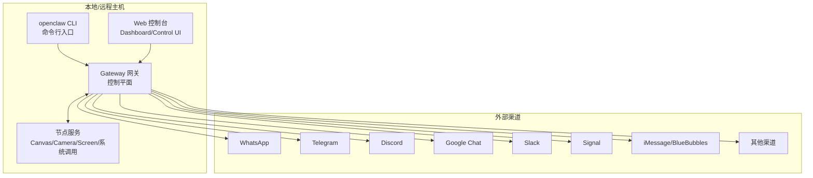

# 快速开始

<cite>
**本文引用的文件**
- [README.md](file://README.md)
- [package.json](file://package.json)
- [openclaw.mjs](file://openclaw.mjs)
- [scripts/install.sh](file://scripts/install.sh)
- [scripts/install.ps1](file://scripts/install.ps1)
- [docs/start/getting-started.md](file://docs/start/getting-started.md)
- [docs/start/wizard.md](file://docs/start/wizard.md)
- [docs/install/index.md](file://docs/install/index.md)
- [docs/cli/setup.md](file://docs/cli/setup.md)
- [docs/platforms/windows.md](file://docs/platforms/windows.md)
- [docs/platforms/macos.md](file://docs/platforms/macos.md)
- [docs/platforms/linux.md](file://docs/platforms/linux.md)
- [src/commands/onboard.ts](file://src/commands/onboard.ts)
</cite>

## 目录
1. [简介](#简介)
2. [系统要求与平台兼容性](#系统要求与平台兼容性)
3. [安装方式与选择建议](#安装方式与选择建议)
4. [向导驱动的设置流程](#向导驱动的设置流程)
5. [基础配置与初始设置](#基础配置与初始设置)
6. [常见初始化问题排查](#常见初始化问题排查)
7. [验证步骤与下一步](#验证步骤与下一步)
8. [架构概览](#架构概览)
9. [依赖关系分析](#依赖关系分析)
10. [性能与最佳实践](#性能与最佳实践)
11. [故障排除指南](#故障排除指南)
12. [结语](#结语)

## 简介
OpenClaw 是一款可在您自己的设备上运行的个人 AI 助手，支持多通道消息集成（如 WhatsApp、Telegram、Discord、Google Chat、Signal、iMessage、BlueBubbles、IRC、Microsoft Teams、Matrix、飞书、LINE、Mattermost、Nextcloud Talk、Nostr、Synology Chat、Tlon、Twitch、Zalo、Zalo Personal、WebChat 等），并可在 macOS/iOS/Android 上进行语音唤醒与实时画布协作。其核心是“网关（Gateway）控制平面”，配合 CLI、Web 控制台与移动端节点，构成完整的本地优先助手体系。

推荐使用终端中的向导驱动设置流程（openclaw setup 或 openclaw onboard），它会引导您完成网关安装、工作空间配置、渠道连接与技能设置等关键步骤，并在 macOS、Linux 和 Windows（强烈建议通过 WSL2）上提供一致体验。

## 系统要求与平台兼容性
- 运行时：Node.js ≥22（推荐 Node 24；当前 22 LTS 版本为 22.16+）
- 平台：macOS、Linux、Windows（强烈建议通过 WSL2）
- 包管理器：npm、pnpm、bun 均可使用，但推荐使用 npm 或 pnpm 安装以获得更稳定的构建体验

平台兼容性要点：
- Windows：强烈建议在 WSL2 中安装与运行，原生 Windows 支持正在改进，部分非交互式流程可能需要额外参数或限制
- macOS：支持菜单栏应用与权限管理，可作为本地网关或远程网关的节点桥接
- Linux：原生支持，推荐使用 systemd 用户服务或系统服务

章节来源
- [README.md: 21-31:21-31](file://README.md#L21-L31)
- [docs/platforms/windows.md: 11-27:11-27](file://docs/platforms/windows.md#L11-L27)
- [docs/platforms/macos.md: 9-13:9-13](file://docs/platforms/macos.md#L9-L13)
- [docs/platforms/linux.md: 11-14:11-14](file://docs/platforms/linux.md#L11-L14)
- [openclaw.mjs: 5-34:5-34](file://openclaw.mjs#L5-L34)

## 安装方式与选择建议
OpenClaw 提供多种安装路径，可根据场景选择：

- 推荐：安装脚本（自动检测/安装 Node 并全局安装 openclaw，随后启动向导）
  - macOS/Linux/WSL2：curl 脚本
  - Windows：PowerShell 脚本
- 包管理器：npm 或 pnpm 全局安装后运行向导
- 从源码构建：适合贡献者或需要自定义开发流程的用户
- 其他：Docker、Podman、Nix、Ansible、Bun 等

安装脚本优势：
- 自动处理 Node 检测与版本升级
- 下载 CLI 并全局安装
- 可直接进入向导流程，减少手动步骤

包管理器安装注意事项：
- npm/pnpm 需要 Node 24（或至少 22.16+）
- 若遇到 sharp 构建错误，可按文档指引设置环境变量或安装构建工具

章节来源
- [docs/install/index.md: 35-151:35-151](file://docs/install/index.md#L35-L151)
- [scripts/install.sh: 1-800:1-800](file://scripts/install.sh#L1-L800)
- [scripts/install.ps1: 1-360:1-360](file://scripts/install.ps1#L1-L360)
- [package.json: 437-440:437-440](file://package.json#L437-L440)

## 向导驱动的设置流程
openclaw setup --wizard 是推荐的首次配置方式，涵盖以下关键步骤：
- 模型与认证：选择提供商与认证方式（API Key、OAuth、Setup Token 等），并指定默认模型
- 工作空间：默认位于 ~/.openclaw/workspace，向导会生成必要的种子文件
- 网关：端口、绑定地址、认证模式、Tailscale 暴露策略
- 渠道：可选配置 WhatsApp、Telegram、Discord、Google Chat、Mattermost、Signal、BlueBubbles、iMessage 等
- 守护进程：在 macOS（LaunchAgent）或 Linux（systemd 用户单元）中安装并启用网关服务
- 健康检查：启动网关并验证运行状态
- 技能：安装推荐技能及可选依赖

非交互式运行：
- 适用于自动化部署或 CI 环境，需显式确认风险并提供必要参数

章节来源
- [docs/start/wizard.md: 10-126:10-126](file://docs/start/wizard.md#L10-L126)
- [docs/cli/setup.md: 10-44:10-44](file://docs/cli/setup.md#L10-L44)
- [src/commands/onboard.ts: 15-97:15-97](file://src/commands/onboard.ts#L15-L97)

## 基础配置与初始设置
- 快速入门（无需渠道）：通过 Dashboard 在浏览器中直接聊天
- 网关状态检查：openclaw gateway status
- 打开控制台：openclaw dashboard
- 发送测试消息：openclaw message send --target +15555550123 --message "Hello from OpenClaw"

环境变量（可选）：
- OPENCLAW_HOME：用于内部路径解析的家目录
- OPENCLAW_STATE_DIR：覆盖状态目录
- OPENCLAW_CONFIG_PATH：覆盖配置文件路径

章节来源
- [docs/start/getting-started.md: 28-102:28-102](file://docs/start/getting-started.md#L28-L102)
- [docs/install/index.md: 183-189:183-189](file://docs/install/index.md#L183-L189)

## 常见初始化问题排查
- openclaw 命令找不到
  - 检查 npm prefix -g 输出是否在 PATH 中
  - 在 macOS/Linux 将 $(npm prefix -g)/bin 追加到 PATH；在 Windows 追加 $(npm prefix -g)
- sharp 构建失败
  - macOS 使用 Homebrew 安装 libvips 时，可设置 SHARP_IGNORE_GLOBAL_LIBVIPS=1 强制使用预编译二进制
  - 缺少构建工具时，按提示安装 Xcode Command Line Tools 或相应发行版的 build-essential/cmake 等
- Windows 非交互式向导
  - 需要显式传入 --skip-health 或在受限环境中使用替代参数
- 权限与安全
  - 默认 DM 策略为“配对”（仅已批准发送方可对话），可通过配对流程添加允许列表
  - 使用 openclaw doctor 检查配置与潜在风险

章节来源
- [docs/install/index.md: 191-214:191-214](file://docs/install/index.md#L191-L214)
- [docs/platforms/windows.md: 39-61:39-61](file://docs/platforms/windows.md#L39-L61)
- [README.md: 112-124:112-124](file://README.md#L112-L124)

## 验证步骤与下一步
- 验证安装
  - openclaw doctor：检查配置问题
  - openclaw status：查看网关状态
  - openclaw dashboard：打开浏览器控制台
- 连接更多渠道：参考各渠道文档（如 Telegram、WhatsApp、Discord 等）
- 安全与隐私：了解 DM 配对与审批流程，必要时调整允许列表与认证模式
- 进阶：探索技能平台、自动化钩子与远程访问（SSH 隧道、Tailscale）

章节来源
- [docs/start/getting-started.md: 79-136:79-136](file://docs/start/getting-started.md#L79-L136)
- [docs/install/index.md: 173-182:173-182](file://docs/install/index.md#L173-L182)

## 架构概览
下图展示了 OpenClaw 的核心组件与数据流关系，帮助理解从 CLI 到网关再到各渠道与节点的交互方式。

```mermaid
graph TB
subgraph "本地/远程主机"
CLI["openclaw CLI<br/>命令行入口"]
Gateway["Gateway 网关<br/>控制平面"]
Browser["Web 控制台<br/>Dashboard/Control UI"]
Nodes["节点服务<br/>Canvas/Camera/Screen/系统调用"]
end
subgraph "外部渠道"
WA["WhatsApp"]
TG["Telegram"]
DC["Discord"]
GC["Google Chat"]
SL["Slack"]
SI["Signal"]
IM["iMessage/BlueBubbles"]
OT["其他渠道"]
end
CLI --> Gateway
Browser --> Gateway
Gateway --> WA
Gateway --> TG
Gateway --> DC
Gateway --> GC
Gateway --> SL
Gateway --> SI
Gateway --> IM
Gateway --> OT
Gateway <--> Nodes
```

图表来源
- [README.md: 185-202:185-202](file://README.md#L185-L202)
- [docs/platforms/macos.md: 15-33:15-33](file://docs/platforms/macos.md#L15-L33)

## 依赖关系分析
- 运行时依赖
  - Node.js 版本要求：≥22（推荐 24）
  - CLI 启动时会校验 Node 版本并给出升级建议
- 包管理器与构建
  - npm/pnpm：推荐用于安装与开发
  - bun：可用于 CLI 运行，但不建议用于网关（存在已知兼容性问题）
- 平台特定依赖
  - macOS：Xcode Command Line Tools、cmake（若缺失会由安装脚本提示）
  - Linux：build-essential、python3、make、g++、cmake（不同发行版命令略有差异）
  - Windows：WSL2 推荐；原生 Windows 支持逐步完善

章节来源
- [openclaw.mjs: 5-34:5-34](file://openclaw.mjs#L5-L34)
- [scripts/install.sh: 569-655:569-655](file://scripts/install.sh#L569-L655)
- [docs/platforms/windows.md: 11-27:11-27](file://docs/platforms/windows.md#L11-L27)
- [package.json: 437-440:437-440](file://package.json#L437-L440)

## 性能与最佳实践
- 运行时选择：Node 24 为推荐版本，可获得更佳的性能与稳定性
- 包管理器：pnpm 在首次安装后需要批准构建脚本（如 node-llama-cpp、sharp），批准后再进行向导安装
- 构建缓存：CLI 启动时会尝试启用模块编译缓存以提升启动速度
- 本地优先：尽量在本地运行网关，避免跨网络带来的延迟与安全风险
- 安全策略：默认 DM 策略为“配对”，建议在生产环境中开启密码认证或 SecretRef 管理令牌

章节来源
- [docs/install/index.md: 72-114:72-114](file://docs/install/index.md#L72-L114)
- [openclaw.mjs: 38-45:38-45](file://openclaw.mjs#L38-L45)
- [README.md: 112-124:112-124](file://README.md#L112-L124)

## 故障排除指南
- 安装脚本失败
  - 检查下载器（curl/wget）是否可用
  - 查看安装日志尾部输出，定位具体错误（如缺少构建工具、权限不足）
- npm 安装失败
  - 若提示缺少 make/cmake/python，请根据系统类型安装对应工具
  - macOS 可设置 SHARP_IGNORE_GLOBAL_LIBVIPS=1 解决 sharp 构建问题
- Windows 特有问题
  - 非交互式向导可能需要 --skip-health 参数
  - Scheduled Tasks 创建被拒绝时，回退到用户启动项并立即启动网关
- 配置健康检查
  - 使用 openclaw doctor 检查配置合法性与潜在风险
  - 使用 openclaw status 查看网关状态与端口占用情况

章节来源
- [scripts/install.sh: 785-800:785-800](file://scripts/install.sh#L785-L800)
- [docs/install/index.md: 191-214:191-214](file://docs/install/index.md#L191-L214)
- [docs/platforms/windows.md: 39-61:39-61](file://docs/platforms/windows.md#L39-L61)

## 结语
通过本快速开始指南，您已完成从安装到首次使用的全流程：选择合适的安装方式、运行向导完成网关与工作空间配置、连接常用渠道并验证运行状态。建议后续深入学习各渠道配置、技能平台与远程访问方案，以充分发挥 OpenClaw 的本地优先与多通道协作能力。