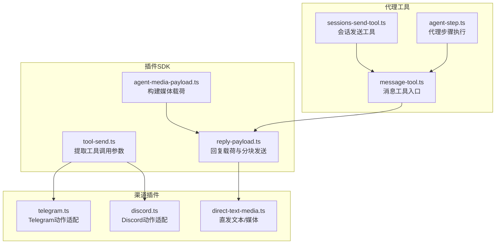
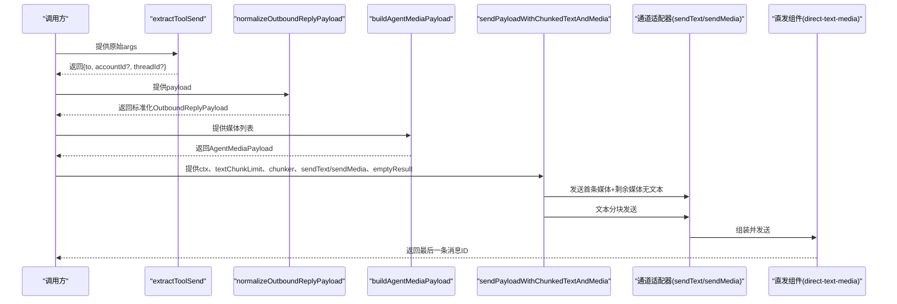
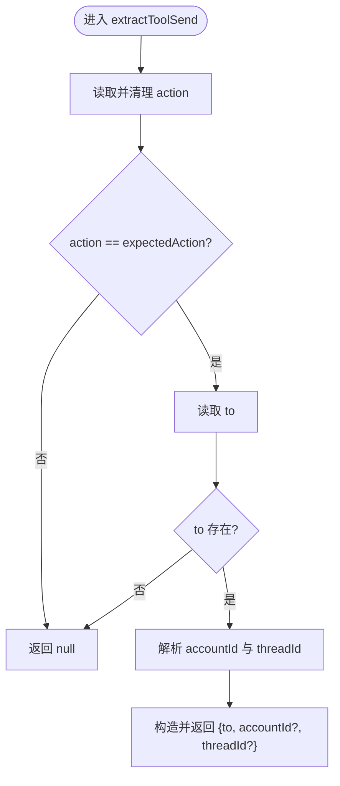
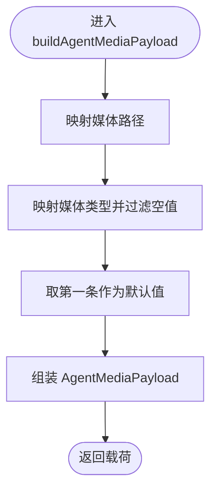
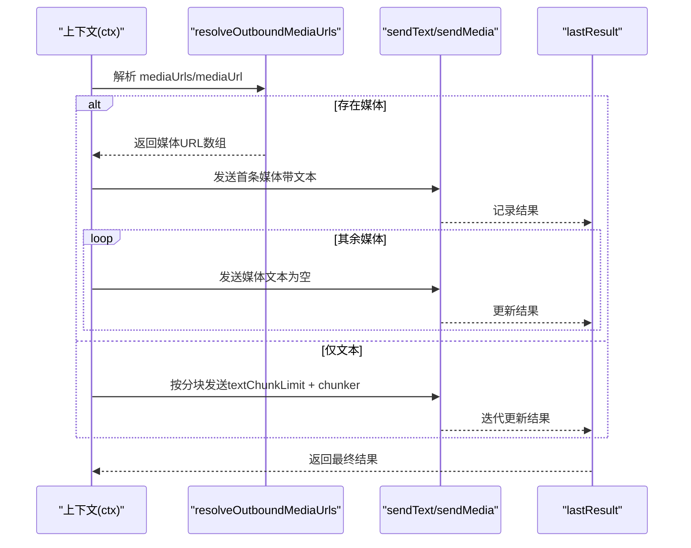
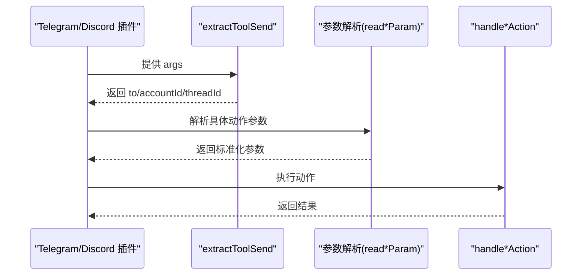
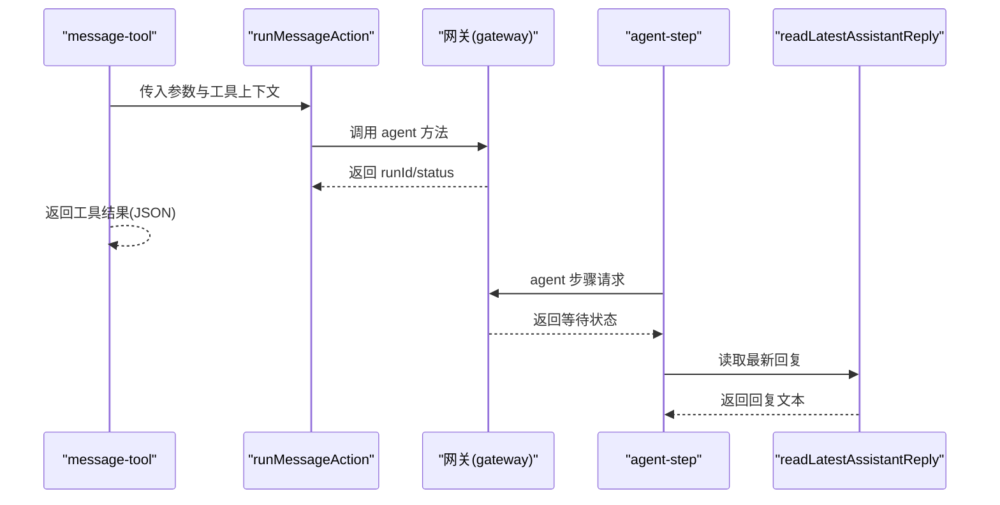
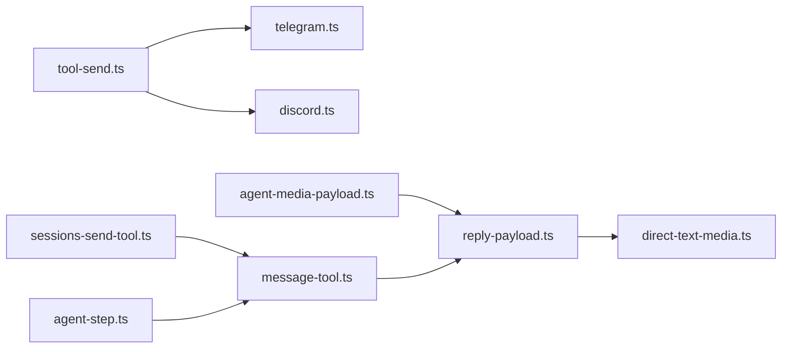

# 工具调用API

<cite>
**本文引用的文件**
- [src/plugin-sdk/tool-send.ts](file://src/plugin-sdk/tool-send.ts)
- [src/plugin-sdk/agent-media-payload.ts](file://src/plugin-sdk/agent-media-payload.ts)
- [src/plugin-sdk/reply-payload.ts](file://src/plugin-sdk/reply-payload.ts)
- [src/channels/plugins/actions/telegram.ts](file://src/channels/plugins/actions/telegram.ts)
- [src/channels/plugins/actions/discord.ts](file://src/channels/plugins/actions/discord.ts)
- [src/channels/plugins/outbound/direct-text-media.ts](file://src/channels/plugins/outbound/direct-text-media.ts)
- [src/agents/tools/message-tool.ts](file://src/agents/tools/message-tool.ts)
- [src/agents/tools/sessions-send-tool.ts](file://src/agents/tools/sessions-send-tool.ts)
- [src/agents/tools/agent-step.ts](file://src/agents/tools/agent-step.ts)
- [src/media-understanding/apply.ts](file://src/media-understanding/apply.ts)
- [src/plugin-sdk/reply-payload.test.ts](file://src/plugin-sdk/reply-payload.test.ts)
</cite>

## 目录
1. [简介](#简介)
2. [项目结构](#项目结构)
3. [核心组件](#核心组件)
4. [架构总览](#架构总览)
5. [详细组件分析](#详细组件分析)
6. [依赖关系分析](#依赖关系分析)
7. [性能考虑](#性能考虑)
8. [故障排查指南](#故障排查指南)
9. [结论](#结论)
10. [附录](#附录)

## 简介
本文件为 OpenClaw 工具调用 API 的完整参考文档，聚焦“工具调用”相关能力，覆盖以下关键主题：
- 工具调用生命周期：从工具定义、参数校验、执行到结果处理
- 核心工具调用函数详解：extractToolSend、buildAgentMediaPayload、sendPayloadWithChunkedTextAndMedia
- 媒体处理、文本分块、回复构建等辅助能力
- 错误处理策略、性能优化建议与最佳实践

## 项目结构
围绕工具调用 API 的相关源码主要分布在如下模块：
- 插件 SDK（plugin-sdk）：通用工具调用提取、媒体载荷构建、回复发送与分块
- 渠道插件（channels/plugins/actions）：各通道对工具调用的适配与参数解析
- 代理工具（agents/tools）：消息发送、会话转发、跨代理步骤等
- 媒体理解（media-understanding）：对媒体附件的理解与增强

图表来源
- [src/plugin-sdk/tool-send.ts](file://src/plugin-sdk/tool-send.ts#L1-L23)
- [src/plugin-sdk/agent-media-payload.ts](file://src/plugin-sdk/agent-media-payload.ts#L1-L25)
- [src/plugin-sdk/reply-payload.ts](file://src/plugin-sdk/reply-payload.ts#L1-L147)
- [src/channels/plugins/actions/telegram.ts](file://src/channels/plugins/actions/telegram.ts#L1-L288)
- [src/channels/plugins/actions/discord.ts](file://src/channels/plugins/actions/discord.ts#L1-L135)
- [src/channels/plugins/outbound/direct-text-media.ts](file://src/channels/plugins/outbound/direct-text-media.ts#L31-L67)
- [src/agents/tools/message-tool.ts](file://src/agents/tools/message-tool.ts#L749-L792)
- [src/agents/tools/sessions-send-tool.ts](file://src/agents/tools/sessions-send-tool.ts#L253-L300)
- [src/agents/tools/agent-step.ts](file://src/agents/tools/agent-step.ts#L33-L80)

章节来源
- [src/plugin-sdk/tool-send.ts](file://src/plugin-sdk/tool-send.ts#L1-L23)
- [src/plugin-sdk/agent-media-payload.ts](file://src/plugin-sdk/agent-media-payload.ts#L1-L25)
- [src/plugin-sdk/reply-payload.ts](file://src/plugin-sdk/reply-payload.ts#L1-L147)
- [src/channels/plugins/actions/telegram.ts](file://src/channels/plugins/actions/telegram.ts#L1-L288)
- [src/channels/plugins/actions/discord.ts](file://src/channels/plugins/actions/discord.ts#L1-L135)
- [src/channels/plugins/outbound/direct-text-media.ts](file://src/channels/plugins/outbound/direct-text-media.ts#L31-L67)
- [src/agents/tools/message-tool.ts](file://src/agents/tools/message-tool.ts#L749-L792)
- [src/agents/tools/sessions-send-tool.ts](file://src/agents/tools/sessions-send-tool.ts#L253-L300)
- [src/agents/tools/agent-step.ts](file://src/agents/tools/agent-step.ts#L33-L80)

## 核心组件
本节梳理工具调用 API 的关键函数与数据结构，给出职责、输入输出与典型用法。

- 工具调用参数提取
  - 函数：extractToolSend(args, expectedAction)
  - 职责：从工具调用参数中提取目标接收者、账号标识与线程标识
  - 输入：
    - args: Record<string, unknown>，工具调用参数对象
    - expectedAction: string，期望的动作名（默认 "sendMessage"）
  - 输出：{ to: string; accountId?: string; threadId?: string } | null
  - 使用场景：在各通道插件中识别并提取 send 动作的目标信息，用于后续路由与鉴权

- 媒体载荷构建
  - 类型：AgentMediaPayload
  - 字段：MediaPath/MediaType/MediaUrl/MediaPaths/MediaUrls/MediaTypes
  - 函数：buildAgentMediaPayload(mediaList)
  - 职责：将媒体列表转换为统一的 AgentMediaPayload 结构，便于下游发送
  - 输入：Array<{ path: string; contentType?: string | null }>
  - 输出：AgentMediaPayload

- 回复载荷与分块发送
  - 类型：OutboundReplyPayload
  - 字段：text?, mediaUrls?, mediaUrl?, replyToId?
  - 函数：
    - normalizeOutboundReplyPayload(payload)：标准化载荷
    - createNormalizedOutboundDeliverer(handler)：包装处理器以自动标准化
    - resolveOutboundMediaUrls(payload)：解析媒体 URL 列表
    - sendPayloadWithChunkedTextAndMedia(params)：按媒体优先或文本分块发送
    - isNumericTargetId(raw)：判断是否为数字目标 ID
    - formatTextWithAttachmentLinks(text, mediaUrls)：拼接带附件链接的文本
    - sendMediaWithLeadingCaption(params)：带头部说明发送媒体序列
  - 参数与返回：
    - sendPayloadWithChunkedTextAndMedia：支持 textChunkLimit、chunker 自定义分块策略；返回最后一次发送的结果
    - sendMediaWithLeadingCaption：逐个发送媒体，支持错误回调与跳过策略

章节来源
- [src/plugin-sdk/tool-send.ts](file://src/plugin-sdk/tool-send.ts#L1-L23)
- [src/plugin-sdk/agent-media-payload.ts](file://src/plugin-sdk/agent-media-payload.ts#L1-L25)
- [src/plugin-sdk/reply-payload.ts](file://src/plugin-sdk/reply-payload.ts#L1-L147)

## 架构总览
工具调用从“参数提取”开始，经“载荷标准化/构建”，再到“分块发送/媒体处理”，最终由“代理工具”完成消息投递与会话管理。

图表来源
- [src/plugin-sdk/tool-send.ts](file://src/plugin-sdk/tool-send.ts#L1-L23)
- [src/plugin-sdk/reply-payload.ts](file://src/plugin-sdk/reply-payload.ts#L52-L91)
- [src/channels/plugins/outbound/direct-text-media.ts](file://src/channels/plugins/outbound/direct-text-media.ts#L31-L67)

## 详细组件分析

### 组件A：工具调用参数提取 extractToolSend
- 职责：从工具调用参数中识别并提取目标接收者、账号与线程信息
- 关键逻辑：
  - 校验 action 是否匹配 expectedAction
  - 解析 to、accountId、threadId（字符串或数字转字符串）
  - 返回 null 表示不匹配或参数缺失
- 典型调用位置：
  - Telegram 插件：extractToolSend(args, "sendMessage")
  - Discord 插件：基于 action 分支提取 to 或 channel

图表来源
- [src/plugin-sdk/tool-send.ts](file://src/plugin-sdk/tool-send.ts#L1-L23)
- [src/channels/plugins/actions/telegram.ts](file://src/channels/plugins/actions/telegram.ts#L121-L123)
- [src/channels/plugins/actions/discord.ts](file://src/channels/plugins/actions/discord.ts#L103-L114)

章节来源
- [src/plugin-sdk/tool-send.ts](file://src/plugin-sdk/tool-send.ts#L1-L23)
- [src/channels/plugins/actions/telegram.ts](file://src/channels/plugins/actions/telegram.ts#L121-L123)
- [src/channels/plugins/actions/discord.ts](file://src/channels/plugins/actions/discord.ts#L103-L114)

### 组件B：媒体载荷构建 buildAgentMediaPayload
- 职责：将媒体列表映射为统一的 AgentMediaPayload 结构
- 输入：媒体数组（路径与可选类型）
- 输出：包含单个/多个媒体路径与类型的载荷对象
- 注意：当存在多种媒体类型时，仅保留非空类型

图表来源
- [src/plugin-sdk/agent-media-payload.ts](file://src/plugin-sdk/agent-media-payload.ts#L10-L24)

章节来源
- [src/plugin-sdk/agent-media-payload.ts](file://src/plugin-sdk/agent-media-payload.ts#L1-L25)

### 组件C：回复载荷与分块发送 sendPayloadWithChunkedTextAndMedia
- 职责：根据载荷内容决定发送策略：优先发送媒体（首条带文本，其余仅媒体），否则按分块发送文本
- 关键点：
  - resolveOutboundMediaUrls：解析媒体 URL 列表
  - textChunkLimit + chunker：自定义文本分块策略
  - emptyResult：当无文本也无媒体时返回的默认结果
- 测试覆盖：
  - 无文本无媒体：返回空结果
  - 首条媒体带文本，其余媒体仅媒体
  - 自定义分块器按指定长度切分

图表来源
- [src/plugin-sdk/reply-payload.ts](file://src/plugin-sdk/reply-payload.ts#L52-L91)
- [src/plugin-sdk/reply-payload.test.ts](file://src/plugin-sdk/reply-payload.test.ts#L1-L58)

章节来源
- [src/plugin-sdk/reply-payload.ts](file://src/plugin-sdk/reply-payload.ts#L1-L147)
- [src/plugin-sdk/reply-payload.test.ts](file://src/plugin-sdk/reply-payload.test.ts#L1-L58)

### 组件D：通道插件中的工具调用适配
- Telegram 插件
  - 提供 extractToolSend 包装，固定 expectedAction 为 "sendMessage"
  - 通过 readTelegramSendParams 解析 to、mediaUrl、caption、replyTo、threadId 等参数
  - 将解析后的参数交由 handleTelegramAction 执行
- Discord 插件
  - 支持多种 action，其中 sendMessage 与 threadReply 可被 extractToolSend 识别
  - 根据 action 分支提取 to 或 channel

图表来源
- [src/channels/plugins/actions/telegram.ts](file://src/channels/plugins/actions/telegram.ts#L24-L47)
- [src/channels/plugins/actions/telegram.ts](file://src/channels/plugins/actions/telegram.ts#L121-L136)
- [src/channels/plugins/actions/discord.ts](file://src/channels/plugins/actions/discord.ts#L103-L114)

章节来源
- [src/channels/plugins/actions/telegram.ts](file://src/channels/plugins/actions/telegram.ts#L1-L288)
- [src/channels/plugins/actions/discord.ts](file://src/channels/plugins/actions/discord.ts#L1-L135)

### 组件E：代理工具链路（消息发送、会话转发、跨代理步骤）
- 消息工具 message-tool
  - 在工具选项存在当前通道/线程/消息等上下文时，构建工具上下文并调用 runMessageAction
  - 返回工具结果或 JSON 结果
- 会话发送工具 sessions-send-tool
  - 通过网关调用 agent 方法提交发送任务，支持超时与错误处理
  - 返回 runId、状态与会话键
- 代理步骤 agent-step
  - 通过网关发起一次嵌套会话步骤，等待完成并读取最新助手回复

图表来源
- [src/agents/tools/message-tool.ts](file://src/agents/tools/message-tool.ts#L749-L792)
- [src/agents/tools/sessions-send-tool.ts](file://src/agents/tools/sessions-send-tool.ts#L253-L300)
- [src/agents/tools/agent-step.ts](file://src/agents/tools/agent-step.ts#L33-L80)

章节来源
- [src/agents/tools/message-tool.ts](file://src/agents/tools/message-tool.ts#L749-L792)
- [src/agents/tools/sessions-send-tool.ts](file://src/agents/tools/sessions-send-tool.ts#L253-L300)
- [src/agents/tools/agent-step.ts](file://src/agents/tools/agent-step.ts#L33-L80)

### 组件F：媒体理解与增强（可选）
- applyMediaUnderstanding
  - 对用户输入中的媒体附件进行理解与增强，生成描述/转写等输出
  - 支持并发运行不同能力（图像、音频、视频、文件等）
  - 将决策与输出合并到上下文中，影响后续消息体

章节来源
- [src/media-understanding/apply.ts](file://src/media-understanding/apply.ts#L466-L517)

## 依赖关系分析
- 低耦合高内聚
  - 插件 SDK 提供通用能力（参数提取、载荷构建、分块发送），通道插件仅负责参数解析与动作路由
  - 代理工具链路通过网关解耦，避免直接依赖具体通道实现
- 关键依赖链
  - Telegram/Discord 插件依赖 extractToolSend
  - 回复发送依赖 sendPayloadWithChunkedTextAndMedia 与直发组件
  - 媒体理解可前置增强消息内容，间接影响发送流程

图表来源
- [src/plugin-sdk/tool-send.ts](file://src/plugin-sdk/tool-send.ts#L1-L23)
- [src/channels/plugins/actions/telegram.ts](file://src/channels/plugins/actions/telegram.ts#L1-L288)
- [src/channels/plugins/actions/discord.ts](file://src/channels/plugins/actions/discord.ts#L1-L135)
- [src/plugin-sdk/agent-media-payload.ts](file://src/plugin-sdk/agent-media-payload.ts#L1-L25)
- [src/plugin-sdk/reply-payload.ts](file://src/plugin-sdk/reply-payload.ts#L1-L147)
- [src/channels/plugins/outbound/direct-text-media.ts](file://src/channels/plugins/outbound/direct-text-media.ts#L31-L67)
- [src/agents/tools/message-tool.ts](file://src/agents/tools/message-tool.ts#L749-L792)
- [src/agents/tools/sessions-send-tool.ts](file://src/agents/tools/sessions-send-tool.ts#L253-L300)
- [src/agents/tools/agent-step.ts](file://src/agents/tools/agent-step.ts#L33-L80)

章节来源
- [src/plugin-sdk/tool-send.ts](file://src/plugin-sdk/tool-send.ts#L1-L23)
- [src/plugin-sdk/agent-media-payload.ts](file://src/plugin-sdk/agent-media-payload.ts#L1-L25)
- [src/plugin-sdk/reply-payload.ts](file://src/plugin-sdk/reply-payload.ts#L1-L147)
- [src/channels/plugins/actions/telegram.ts](file://src/channels/plugins/actions/telegram.ts#L1-L288)
- [src/channels/plugins/actions/discord.ts](file://src/channels/plugins/actions/discord.ts#L1-L135)
- [src/channels/plugins/outbound/direct-text-media.ts](file://src/channels/plugins/outbound/direct-text-media.ts#L31-L67)
- [src/agents/tools/message-tool.ts](file://src/agents/tools/message-tool.ts#L749-L792)
- [src/agents/tools/sessions-send-tool.ts](file://src/agents/tools/sessions-send-tool.ts#L253-L300)
- [src/agents/tools/agent-step.ts](file://src/agents/tools/agent-step.ts#L33-L80)

## 性能考虑
- 文本分块策略
  - 使用 textChunkLimit 与自定义 chunker 控制每次发送的文本长度，减少单次发送失败的影响面
- 并发与重试
  - 媒体理解 applyMediaUnderstanding 支持按能力并发执行，提升整体吞吐
- 媒体发送优化
  - 首条媒体携带文本，后续媒体仅发送媒体，降低冗余文本传输
- 错误容忍
  - sendMediaWithLeadingCaption 支持单个媒体发送失败时继续处理下一个，提高整体成功率

## 故障排查指南
- 参数提取失败
  - 检查 action 名称大小写与空白字符，确保与 expectedAction 匹配
  - 确认 to、accountId、threadId 的类型与格式
- 媒体发送异常
  - 确认媒体 URL 可访问性与类型
  - 使用 sendMediaWithLeadingCaption 的 onError 回调定位失败媒体
- 文本分块异常
  - 检查 textChunkLimit 与 chunker 实现，确保分块后每段文本非空
- 代理工具链路
  - 关注 sessions-send-tool 的超时与错误返回，必要时增加重试或调整超时时间
  - agent-step 的等待状态需与网关超时设置匹配

章节来源
- [src/plugin-sdk/tool-send.ts](file://src/plugin-sdk/tool-send.ts#L1-L23)
- [src/plugin-sdk/reply-payload.ts](file://src/plugin-sdk/reply-payload.ts#L121-L147)
- [src/agents/tools/sessions-send-tool.ts](file://src/agents/tools/sessions-send-tool.ts#L253-L300)

## 结论
OpenClaw 的工具调用 API 通过“参数提取—载荷构建—分块发送—通道适配—代理工具链路”的清晰分层，实现了跨通道的一致性与可扩展性。借助标准化的数据结构与可配置的分块策略，系统在复杂媒体与长文本场景下仍能保持稳定与高效。建议在生产环境中结合业务需求定制分块策略与错误处理策略，以获得更优的用户体验与稳定性。

## 附录
- 最佳实践
  - 明确区分“媒体优先”与“文本分块”两种发送策略，优先使用媒体时首条携带文本
  - 对于长文本，合理设置 textChunkLimit 并提供稳定的 chunker
  - 在通道插件中严格校验参数，避免无效调用
  - 使用 createNormalizedOutboundDeliverer 统一处理载荷标准化
- 常见问题
  - 为什么 extractToolSend 返回 null？
    - action 不匹配或缺少 to 参数
  - 为什么媒体发送失败？
    - URL 不可达、类型不正确或通道限制
  - 如何避免重复发送？
    - 使用 isNumericTargetId 判断目标 ID，避免重复路由