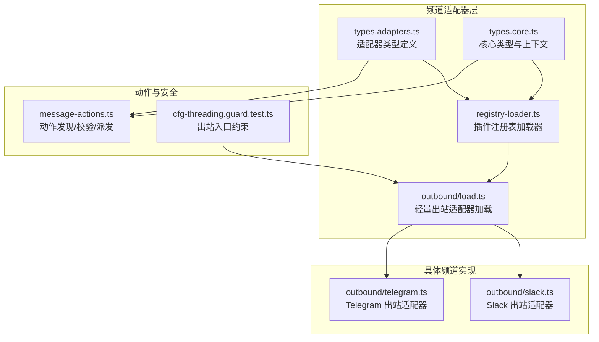
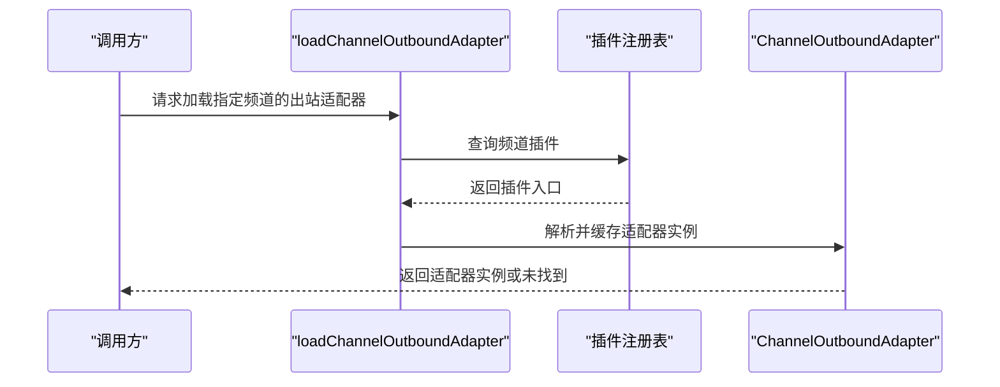
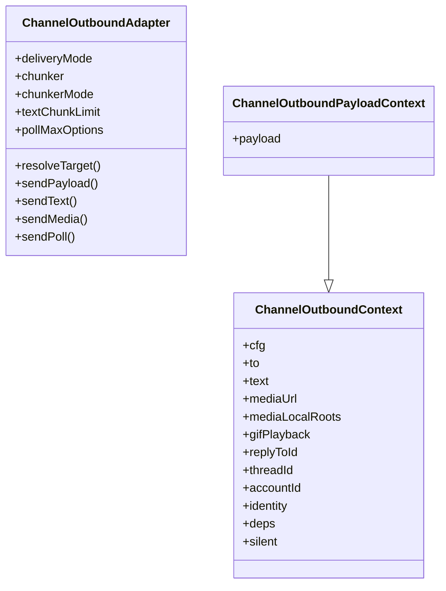
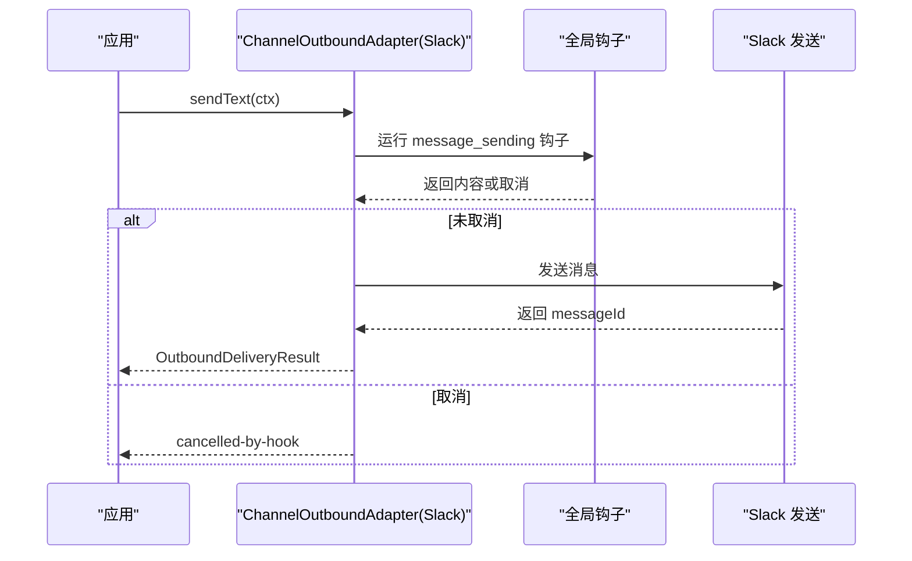
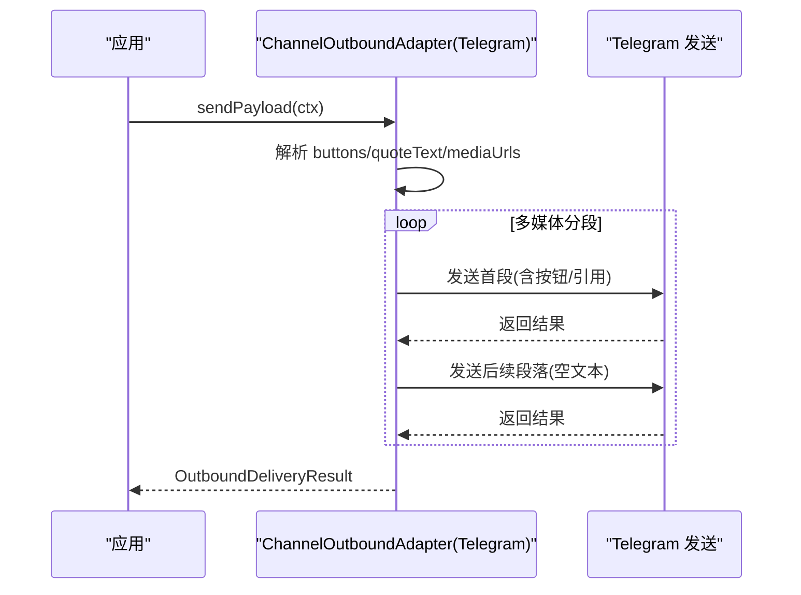
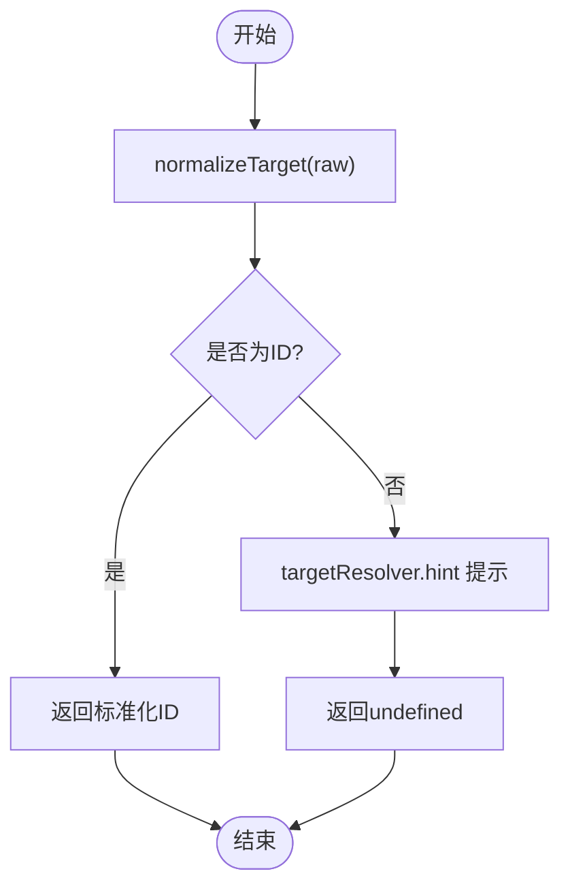
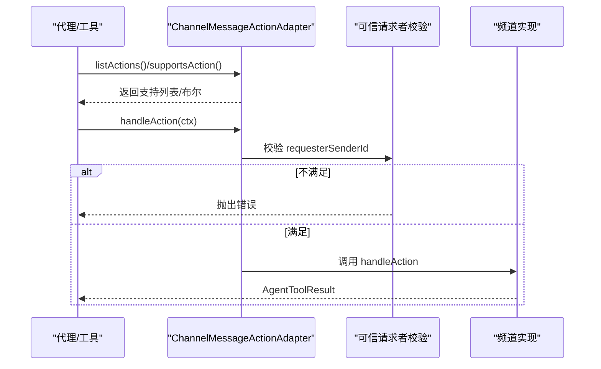
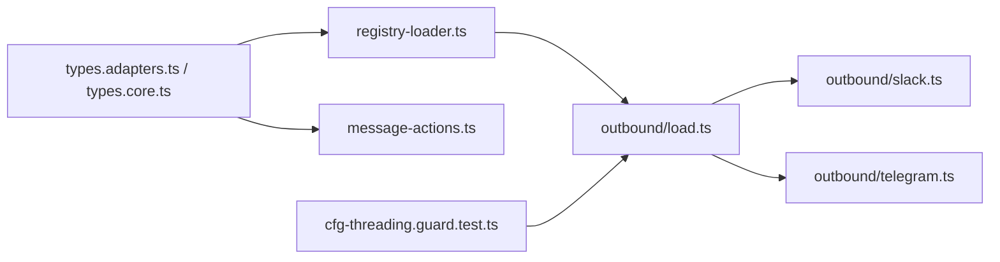
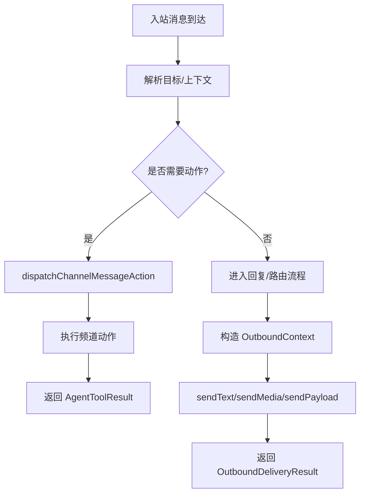

# 频道通信API

<cite>
**本文引用的文件**
- [src/channels/plugins/types.adapters.ts](file://src/channels/plugins/types.adapters.ts)
- [src/channels/plugins/types.core.ts](file://src/channels/plugins/types.core.ts)
- [src/channels/plugins/registry-loader.ts](file://src/channels/plugins/registry-loader.ts)
- [src/channels/plugins/outbound/load.ts](file://src/channels/plugins/outbound/load.ts)
- [src/channels/plugins/outbound/slack.ts](file://src/channels/plugins/outbound/slack.ts)
- [src/channels/plugins/outbound/telegram.ts](file://src/channels/plugins/outbound/telegram.ts)
- [src/channels/plugins/message-actions.ts](file://src/channels/plugins/message-actions.ts)
- [src/infra/outbound/cfg-threading.guard.test.ts](file://src/infra/outbound/cfg-threading.guard.test.ts)
</cite>

## 目录
1. [简介](#简介)
2. [项目结构](#项目结构)
3. [核心组件](#核心组件)
4. [架构总览](#架构总览)
5. [详细组件分析](#详细组件分析)
6. [依赖关系分析](#依赖关系分析)
7. [性能考量](#性能考量)
8. [故障排查指南](#故障排查指南)
9. [结论](#结论)
10. [附录](#附录)

## 简介
本文件为 OpenClaw 频道通信API的权威参考文档，聚焦于频道适配器体系，覆盖以下核心接口与能力：
- 出站适配器：ChannelOutboundAdapter（消息发送、分片策略、目标解析、轮询发送）
- 入站适配器：ChannelInboundAdapter（通过插件生态在各频道内实现，负责消息接收与上下文注入）
- 消息适配器：ChannelMessagingAdapter（目标标准化、解析器、显示格式化）
- 消息动作：ChannelMessageActionAdapter（频道特定动作发现、校验、执行）
- 基础类型：ChannelCapabilities、ChannelDirectoryEntry、ChannelThreadingContext 等

文档将从架构、数据流、处理逻辑、集成点、错误处理与性能优化等维度进行系统阐述，并提供面向开发者的使用场景、参数约束、错误处理与性能建议。

## 项目结构
OpenClaw 的频道适配器位于 src/channels/plugins 目录下，按职责拆分为：
- 类型定义：types.adapters.ts、types.core.ts
- 注册与加载：registry-loader.ts、outbound/load.ts
- 各频道实现：outbound/*.ts（如 slack.ts、telegram.ts）
- 动作处理：message-actions.ts
- 安全与约束：cfg-threading.guard.test.ts（限制出站入口加载配置）

**图表来源**
- [src/channels/plugins/types.adapters.ts](file://src/channels/plugins/types.adapters.ts#L1-L384)
- [src/channels/plugins/types.core.ts](file://src/channels/plugins/types.core.ts#L1-L391)
- [src/channels/plugins/registry-loader.ts](file://src/channels/plugins/registry-loader.ts#L1-L36)
- [src/channels/plugins/outbound/load.ts](file://src/channels/plugins/outbound/load.ts#L1-L17)
- [src/channels/plugins/outbound/slack.ts](file://src/channels/plugins/outbound/slack.ts#L1-L139)
- [src/channels/plugins/outbound/telegram.ts](file://src/channels/plugins/outbound/telegram.ts#L1-L140)
- [src/channels/plugins/message-actions.ts](file://src/channels/plugins/message-actions.ts#L1-L104)
- [src/infra/outbound/cfg-threading.guard.test.ts](file://src/infra/outbound/cfg-threading.guard.test.ts#L36-L179)

**章节来源**
- [src/channels/plugins/types.adapters.ts](file://src/channels/plugins/types.adapters.ts#L1-L384)
- [src/channels/plugins/types.core.ts](file://src/channels/plugins/types.core.ts#L1-L391)
- [src/channels/plugins/registry-loader.ts](file://src/channels/plugins/registry-loader.ts#L1-L36)
- [src/channels/plugins/outbound/load.ts](file://src/channels/plugins/outbound/load.ts#L1-L17)
- [src/channels/plugins/outbound/slack.ts](file://src/channels/plugins/outbound/slack.ts#L1-L139)
- [src/channels/plugins/outbound/telegram.ts](file://src/channels/plugins/outbound/telegram.ts#L1-L140)
- [src/channels/plugins/message-actions.ts](file://src/channels/plugins/message-actions.ts#L1-L104)
- [src/infra/outbound/cfg-threading.guard.test.ts](file://src/infra/outbound/cfg-threading.guard.test.ts#L36-L179)

## 核心组件
本节对关键适配器与类型进行深入解析，包括函数签名、参数说明、返回值类型与典型用法。

- ChannelOutboundAdapter
  - 职责：负责消息发送（文本、媒体、负载）、目标解析、分片策略、轮询发送
  - 关键字段与方法
    - deliveryMode: "direct" | "gateway" | "hybrid"
    - chunker?: (text: string, limit: number) => string[]
    - chunkerMode?: "text" | "markdown"
    - textChunkLimit?: number
    - pollMaxOptions?: number
    - resolveTarget?: (params) => { ok; to } | { ok; error }
    - sendPayload?: (ctx) => Promise<OutboundDeliveryResult>
    - sendText?: (ctx) => Promise<OutboundDeliveryResult>
    - sendMedia?: (ctx) => Promise<OutboundDeliveryResult>
    - sendPoll?: (ctx) => Promise<ChannelPollResult>
  - 上下文 ChannelOutboundContext/ChannelOutboundPayloadContext
    - 包含 to、text、mediaUrl、mediaLocalRoots、replyToId、threadId、accountId、identity、deps、silent 等
  - 返回值 OutboundDeliveryResult/ChannelPollResult
    - 包含 messageId、channelId、conversationId、pollId 等标识

- ChannelInboundAdapter
  - 职责：在各频道内实现入站消息接收、上下文注入、消息解包与转发
  - 实现方式：通过插件注册表加载，不同频道在各自插件中实现
  - 加载机制：使用 createChannelRegistryLoader 创建按频道ID缓存的加载器；出站入口采用轻量加载以避免昂贵初始化

- ChannelMessagingAdapter
  - 职责：目标标准化、解析器提示、显示格式化
  - 方法
    - normalizeTarget?: (raw) => string | undefined
    - targetResolver?: { looksLikeId?, hint? }
    - formatTargetDisplay?: (params) => string

- ChannelMessageActionAdapter
  - 职责：动作发现、支持性检查、动作执行
  - 方法
    - listActions?: (params) => ChannelMessageActionName[]
    - supportsAction?: (params) => boolean
    - supportsButtons?: (params) => boolean
    - supportsCards?: (params) => boolean
    - extractToolSend?: (params) => ChannelToolSend | null
    - handleAction?: (ctx) => Promise<AgentToolResult<unknown>>

- 核心类型
  - ChannelCapabilities：聊天类型、轮询、回复、编辑、反应、线程、媒体、原生命令等能力
  - ChannelDirectoryEntry：用户/群组/频道条目
  - ChannelThreadingContext：线程模式、回复模式、当前消息ID等
  - ChannelPollContext/ChannelPollResult：轮询输入与结果

**章节来源**
- [src/channels/plugins/types.adapters.ts](file://src/channels/plugins/types.adapters.ts#L89-L125)
- [src/channels/plugins/types.adapters.ts](file://src/channels/plugins/types.adapters.ts#L286-L297)
- [src/channels/plugins/types.adapters.ts](file://src/channels/plugins/types.adapters.ts#L347-L360)
- [src/channels/plugins/types.core.ts](file://src/channels/plugins/types.core.ts#L181-L194)
- [src/channels/plugins/types.core.ts](file://src/channels/plugins/types.core.ts#L305-L313)
- [src/channels/plugins/types.core.ts](file://src/channels/plugins/types.core.ts#L257-L284)
- [src/channels/plugins/types.core.ts](file://src/channels/plugins/types.core.ts#L370-L378)

## 架构总览
OpenClaw 的频道适配器采用“插件注册表 + 轻量加载”的架构：
- 插件注册表维护各频道插件的元信息与导出对象
- 通过 createChannelRegistryLoader 缓存解析结果，避免重复扫描
- 出站适配器加载器仅依赖最小依赖集，保证导入成本低
- 各频道在自身插件中实现 ChannelOutboundAdapter/ChannelInboundAdapter 等

**图表来源**
- [src/channels/plugins/outbound/load.ts](file://src/channels/plugins/outbound/load.ts#L13-L17)
- [src/channels/plugins/registry-loader.ts](file://src/channels/plugins/registry-loader.ts#L9-L35)

**章节来源**
- [src/channels/plugins/outbound/load.ts](file://src/channels/plugins/outbound/load.ts#L1-L17)
- [src/channels/plugins/registry-loader.ts](file://src/channels/plugins/registry-loader.ts#L1-L36)

## 详细组件分析

### ChannelOutboundAdapter 分析
- 设计要点
  - 分片策略：chunker 支持文本/Markdown，textChunkLimit 控制单段大小
  - 目标解析：resolveTarget 将原始目标标准化为平台可识别ID
  - 多形态发送：sendText、sendMedia、sendPayload、sendPoll
  - 交付模式：deliveryMode 决定直连/网关/混合模式
- 典型实现
  - Slack：直接调用底层发送函数，支持钩子拦截与身份设置
  - Telegram：Markdown 转 HTML 分片，支持按钮与引用文本，媒体多段发送

**图表来源**
- [src/channels/plugins/types.adapters.ts](file://src/channels/plugins/types.adapters.ts#L89-L125)

**章节来源**
- [src/channels/plugins/types.adapters.ts](file://src/channels/plugins/types.adapters.ts#L89-L125)

### ChannelOutboundAdapter 使用示例（Slack）
- 场景：发送文本/媒体消息，支持钩子拦截与身份设置
- 关键步骤
  - 构造 ChannelOutboundContext
  - 可选：设置 OutboundIdentity（用户名、头像、表情）
  - 调用 sendText/sendMedia 或 sendPayload
  - 处理 OutboundDeliveryResult
- 参数约束
  - to 必须为已解析的目标ID
  - mediaUrl 与 mediaLocalRoots 需配合使用
  - replyToId 与 threadId 用于回复/线程
- 错误处理
  - 钩子取消：返回 meta.cancelled 标记
  - 平台错误：由底层发送函数抛出异常或返回错误码
- 性能考虑
  - 合理设置 textChunkLimit，避免超长文本导致多次往返
  - 使用钩子前缀过滤减少不必要的发送

**图表来源**
- [src/channels/plugins/outbound/slack.ts](file://src/channels/plugins/outbound/slack.ts#L21-L93)

**章节来源**
- [src/channels/plugins/outbound/slack.ts](file://src/channels/plugins/outbound/slack.ts#L1-L139)

### ChannelOutboundAdapter 使用示例（Telegram）
- 场景：发送带按钮/引用的富媒体消息
- 关键步骤
  - 构造 ChannelOutboundContext
  - sendPayload 中读取 payload.channelData.telegram 的按钮与引用文本
  - 多媒体时，首段附带按钮，其余段落为空文本
- 参数约束
  - threadId 与 replyToId 经过解析后传入
  - textMode 固定为 "html"
- 错误处理
  - 底层发送失败时返回未知 messageId，需上层重试或降级
- 性能考虑
  - 多媒体分段发送，首段附带交互元素，后续段落仅传输媒体

**图表来源**
- [src/channels/plugins/outbound/telegram.ts](file://src/channels/plugins/outbound/telegram.ts#L85-L139)

**章节来源**
- [src/channels/plugins/outbound/telegram.ts](file://src/channels/plugins/outbound/telegram.ts#L1-L140)

### ChannelMessagingAdapter 分析
- 职责：统一目标标准化、解析器提示、显示格式化
- 方法
  - normalizeTarget：将原始字符串标准化为目标ID
  - targetResolver.looksLikeId/hint：辅助判断与提示
  - formatTargetDisplay：生成展示用的标签
- 使用场景
  - 在入站/出站流程中统一目标表示
  - 与 Directory/Resolver 协同工作

**图表来源**
- [src/channels/plugins/types.core.ts](file://src/channels/plugins/types.core.ts#L286-L297)

**章节来源**
- [src/channels/plugins/types.core.ts](file://src/channels/plugins/types.core.ts#L286-L297)

### ChannelMessageActionAdapter 分析
- 职责：动作发现、支持性检查、动作执行
- 方法
  - listActions：列举频道支持的动作
  - supportsAction/supportsButtons/supportsCards：能力探测
  - extractToolSend：从工具参数提取发送目标
  - handleAction：执行动作（可能需要可信请求者身份）
- 安全约束
  - 某些高危动作（如 timeout/kick/ban）要求可信请求者身份
  - 工具驱动上下文必须注入 requesterSenderId

**图表来源**
- [src/channels/plugins/message-actions.ts](file://src/channels/plugins/message-actions.ts#L87-L103)

**章节来源**
- [src/channels/plugins/message-actions.ts](file://src/channels/plugins/message-actions.ts#L1-L104)

## 依赖关系分析
- 适配器类型与核心上下文
  - ChannelOutboundAdapter 依赖 ChannelOutboundContext/PayloadContext
  - ChannelMessageActionAdapter 依赖 ChannelMessageActionContext
- 加载与缓存
  - createChannelRegistryLoader 通过插件注册表缓存适配器实例
  - loadChannelOutboundAdapter 仅加载出站适配器，保持导入成本低
- 安全约束
  - 出站入口禁止加载配置（通过测试保障），避免阻塞与副作用

**图表来源**
- [src/channels/plugins/types.adapters.ts](file://src/channels/plugins/types.adapters.ts#L1-L384)
- [src/channels/plugins/types.core.ts](file://src/channels/plugins/types.core.ts#L1-L391)
- [src/channels/plugins/registry-loader.ts](file://src/channels/plugins/registry-loader.ts#L1-L36)
- [src/channels/plugins/outbound/load.ts](file://src/channels/plugins/outbound/load.ts#L1-L17)
- [src/channels/plugins/outbound/slack.ts](file://src/channels/plugins/outbound/slack.ts#L1-L139)
- [src/channels/plugins/outbound/telegram.ts](file://src/channels/plugins/outbound/telegram.ts#L1-L140)
- [src/channels/plugins/message-actions.ts](file://src/channels/plugins/message-actions.ts#L1-L104)
- [src/infra/outbound/cfg-threading.guard.test.ts](file://src/infra/outbound/cfg-threading.guard.test.ts#L36-L179)

**章节来源**
- [src/channels/plugins/registry-loader.ts](file://src/channels/plugins/registry-loader.ts#L1-L36)
- [src/channels/plugins/outbound/load.ts](file://src/channels/plugins/outbound/load.ts#L1-L17)
- [src/infra/outbound/cfg-threading.guard.test.ts](file://src/infra/outbound/cfg-threading.guard.test.ts#L36-L179)

## 性能考量
- 分片与限流
  - 合理设置 textChunkLimit，避免单次发送过大导致平台限制或失败
  - 对支持 Markdown 的平台使用 chunkerMode="markdown"，提升渲染效率
- 目标解析
  - 使用 resolveTarget 缓存常见目标映射，减少重复解析
- 媒体处理
  - 多媒体分段发送时，首段携带交互元素（按钮/引用），后续段落尽量精简
- 加载与启动
  - 出站适配器入口避免加载配置，缩短冷启动时间
- 线程与回复
  - replyToId 与 threadId 合理传递，减少平台侧的二次查询

[本节为通用指导，无需列出具体文件来源]

## 故障排查指南
- 出站入口加载配置被拒绝
  - 现象：测试报错指出出站入口不得调用 loadConfig
  - 排查：检查 outbound.ts 与内联 channel.ts 的 outbound 块
  - 参考
    - [src/infra/outbound/cfg-threading.guard.test.ts](file://src/infra/outbound/cfg-threading.guard.test.ts#L155-L179)
- 钩子取消消息发送
  - 现象：返回 meta.cancelled=true
  - 排查：确认 message_sending 钩子是否取消
  - 参考
    - [src/channels/plugins/outbound/slack.ts](file://src/channels/plugins/outbound/slack.ts#L44-L47)
- 高危动作缺少可信请求者身份
  - 现象：抛出错误，提示需要可信发送者身份
  - 排查：确保工具驱动上下文中注入 requesterSenderId
  - 参考
    - [src/channels/plugins/message-actions.ts](file://src/channels/plugins/message-actions.ts#L90-L94)
- 目标解析失败
  - 现象：resolveTarget 返回 error
  - 排查：确认 normalizeTarget 与 targetResolver 配置
  - 参考
    - [src/channels/plugins/types.adapters.ts](file://src/channels/plugins/types.adapters.ts#L114-L120)
    - [src/channels/plugins/types.core.ts](file://src/channels/plugins/types.core.ts#L288-L291)

**章节来源**
- [src/infra/outbound/cfg-threading.guard.test.ts](file://src/infra/outbound/cfg-threading.guard.test.ts#L155-L179)
- [src/channels/plugins/outbound/slack.ts](file://src/channels/plugins/outbound/slack.ts#L44-L47)
- [src/channels/plugins/message-actions.ts](file://src/channels/plugins/message-actions.ts#L90-L94)
- [src/channels/plugins/types.adapters.ts](file://src/channels/plugins/types.adapters.ts#L114-L120)
- [src/channels/plugins/types.core.ts](file://src/channels/plugins/types.core.ts#L288-L291)

## 结论
OpenClaw 的频道通信API通过清晰的适配器接口与插件化架构，实现了跨频道的一致性与扩展性。开发者可通过 ChannelOutboundAdapter/ChannelMessagingAdapter/ChannelMessageActionAdapter 快速接入新频道或增强现有频道能力。遵循本文档的参数约束、错误处理与性能建议，可在保证稳定性的同时获得更优的用户体验。

[本节为总结性内容，无需列出具体文件来源]

## 附录
- 常用类型速览
  - ChannelCapabilities：聊天类型、轮询、回复、编辑、反应、线程、媒体、原生命令
  - ChannelDirectoryEntry：kind/id/name/handle/avatarUrl/rank/raw
  - ChannelThreadingContext：NativeChannelId/CurrentMessageId/ReplyToId/ThreadLabel 等
  - ChannelPollContext/ChannelPollResult：轮询输入与结果标识
- 典型流程图（概念性）

[本图为概念性流程示意，不对应具体源码文件，故无图表来源]