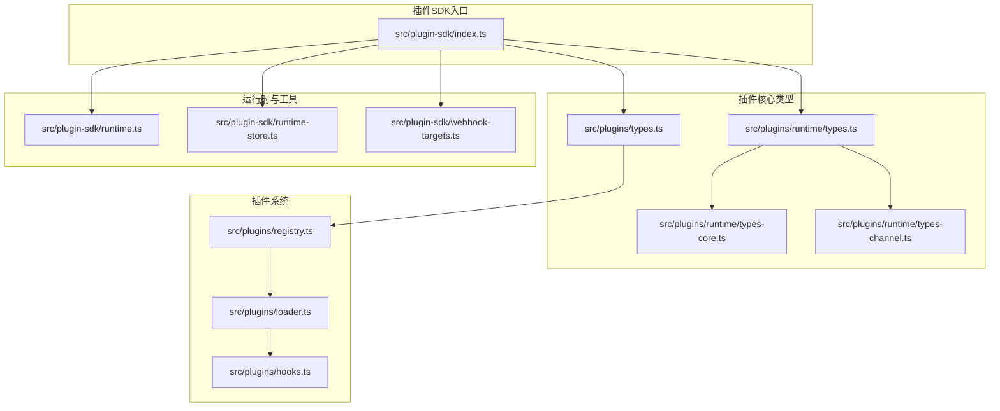
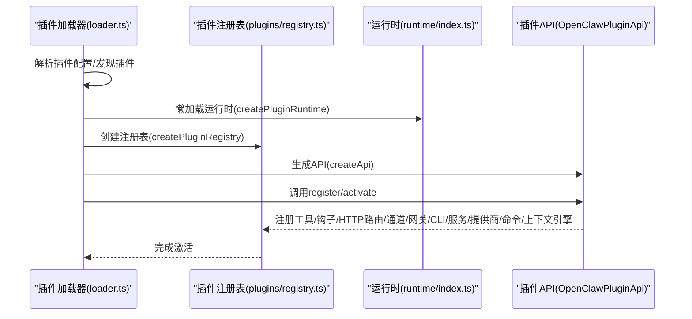
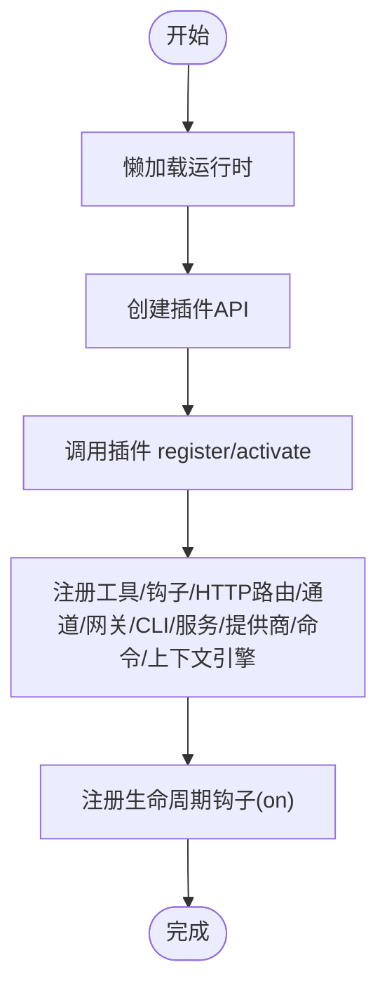
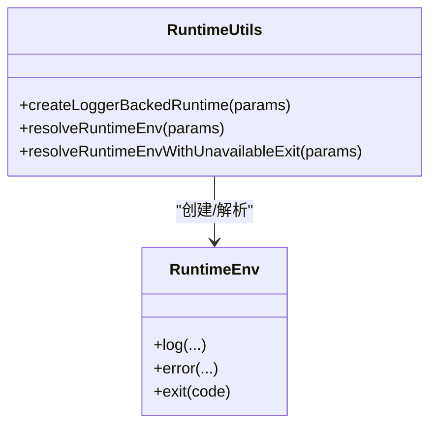
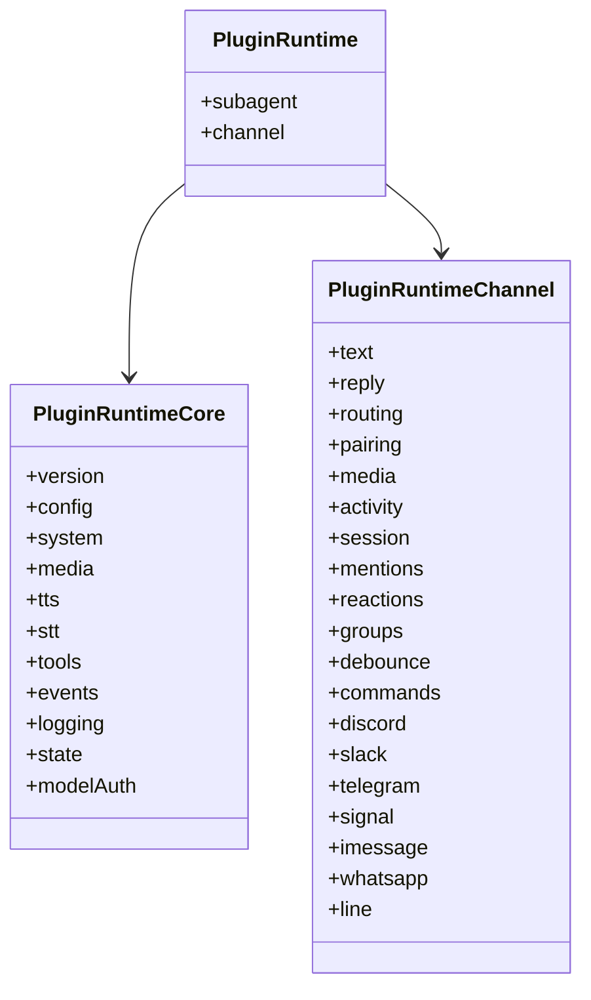
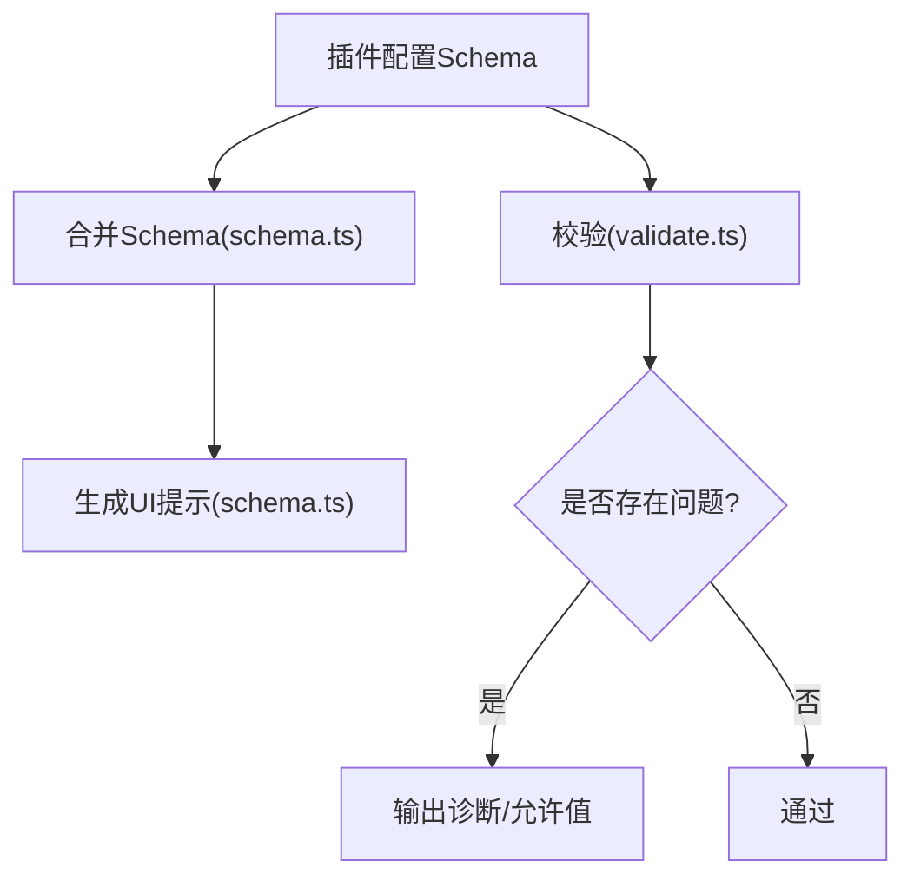
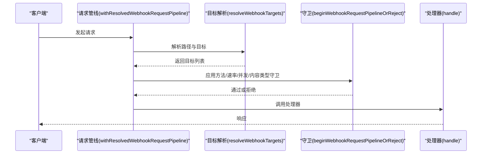
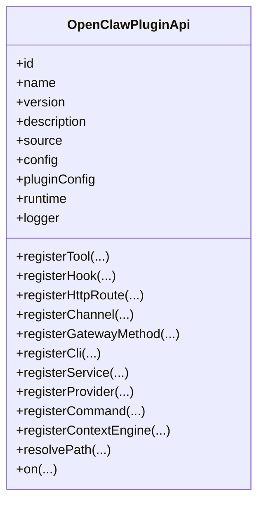
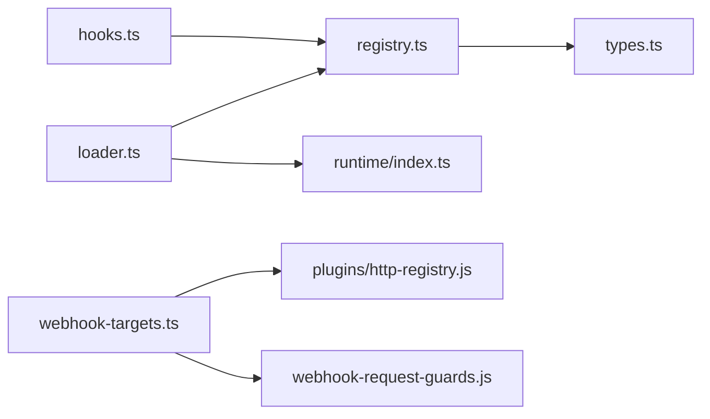

# 核心API接口

<cite>
**本文引用的文件**
- [index.ts](file://src/plugin-sdk/index.ts)
- [types.ts](file://src/plugins/types.ts)
- [runtime/types.ts](file://src/plugins/runtime/types.ts)
- [runtime/types-core.ts](file://src/plugins/runtime/types-core.ts)
- [runtime/types-channel.ts](file://src/plugins/runtime/types-channel.ts)
- [runtime.ts](file://src/plugin-sdk/runtime.ts)
- [runtime-store.ts](file://src/plugin-sdk/runtime-store.ts)
- [webhook-targets.ts](file://src/plugin-sdk/webhook-targets.ts)
- [loader.ts](file://src/plugins/loader.ts)
- [registry.ts](file://src/plugins/registry.ts)
- [hooks.ts](file://src/plugins/hooks.ts)
- [validation.ts](file://src/config/validation.ts)
- [schema.ts](file://src/config/schema.ts)
- [index.ts](file://extensions/memory-core/index.ts)
- [openclaw.plugin.json](file://extensions/memory-core/openclaw.plugin.json)
</cite>

## 目录
1. [简介](#简介)
2. [项目结构](#项目结构)
3. [核心组件](#核心组件)
4. [架构总览](#架构总览)
5. [详细组件分析](#详细组件分析)
6. [依赖分析](#依赖分析)
7. [性能考量](#性能考量)
8. [故障排查指南](#故障排查指南)
9. [结论](#结论)
10. [附录](#附录)

## 简介
本文件面向OpenClaw插件开发者，系统化梳理插件SDK的核心API接口与运行时能力，覆盖插件生命周期管理、运行时环境、配置管理、HTTP Webhook路由、通道适配、工具与CLI注册、钩子系统、以及错误处理与最佳实践。文档以“接口定义—参数与返回—使用场景—调用顺序—错误处理”为主线，辅以图示帮助快速理解。

## 项目结构
OpenClaw插件SDK通过统一入口导出大量类型与工具函数，核心位于src/plugin-sdk目录；插件注册、加载与激活逻辑集中在src/plugins目录；通道能力与运行时API在runtime子类型中组织。

图表来源
- [index.ts](file://src/plugin-sdk/index.ts#L1-L812)
- [types.ts](file://src/plugins/types.ts#L1-L893)
- [runtime/types.ts](file://src/plugins/runtime/types.ts#L1-L64)
- [runtime/types-core.ts](file://src/plugins/runtime/types-core.ts#L1-L68)
- [runtime/types-channel.ts](file://src/plugins/runtime/types-channel.ts#L1-L166)
- [runtime.ts](file://src/plugin-sdk/runtime.ts#L1-L45)
- [runtime-store.ts](file://src/plugin-sdk/runtime-store.ts#L1-L26)
- [webhook-targets.ts](file://src/plugin-sdk/webhook-targets.ts#L1-L282)
- [loader.ts](file://src/plugins/loader.ts#L1-L829)
- [registry.ts](file://src/plugins/registry.ts#L575-L608)
- [hooks.ts](file://src/plugins/hooks.ts#L184-L224)

章节来源
- [index.ts](file://src/plugin-sdk/index.ts#L1-L812)
- [loader.ts](file://src/plugins/loader.ts#L1-L200)

## 核心组件
- 插件API对象（OpenClawPluginApi）：插件注册与交互的统一入口，提供工具、钩子、HTTP路由、通道、网关方法、CLI、服务、提供商、命令、上下文引擎注册与路径解析等能力。
- 运行时环境（RuntimeEnv）：日志、错误退出、环境解析等能力封装。
- 运行时API（PluginRuntime）：系统、媒体、TTS/STT、工具、事件、日志、状态、模型鉴权等能力集合。
- 通道运行时（PluginRuntimeChannel）：各渠道文本、回复、路由、配对、媒体、活动、会话、提及、反应、群组策略、防抖、命令、以及各平台发送与监控等能力。
- Webhook目标注册与请求管线：动态路由注册、认证匹配、速率限制、并发限制、请求体读取与拒绝处理。
- 生命周期与钩子：插件加载、激活、注册阶段的钩子执行与错误处理。
- 配置管理：插件配置Schema合并、校验、UI提示、诊断输出。

章节来源
- [types.ts](file://src/plugins/types.ts#L263-L306)
- [runtime.ts](file://src/plugin-sdk/runtime.ts#L9-L44)
- [runtime/types.ts](file://src/plugins/runtime/types.ts#L51-L63)
- [runtime/types-core.ts](file://src/plugins/runtime/types-core.ts#L10-L67)
- [runtime/types-channel.ts](file://src/plugins/runtime/types-channel.ts#L16-L165)
- [webhook-targets.ts](file://src/plugin-sdk/webhook-targets.ts#L57-L162)
- [hooks.ts](file://src/plugins/hooks.ts#L184-L224)
- [validation.ts](file://src/config/validation.ts#L549-L604)
- [schema.ts](file://src/config/schema.ts#L298-L324)

## 架构总览
下图展示从插件加载到API创建、运行时代理、注册与激活的关键流程。

图表来源
- [loader.ts](file://src/plugins/loader.ts#L470-L507)
- [loader.ts](file://src/plugins/loader.ts#L769-L773)
- [registry.ts](file://src/plugins/registry.ts#L575-L608)

章节来源
- [loader.ts](file://src/plugins/loader.ts#L470-L507)
- [loader.ts](file://src/plugins/loader.ts#L769-L773)
- [registry.ts](file://src/plugins/registry.ts#L575-L608)

## 详细组件分析

### 插件生命周期管理接口
- 加载与懒加载运行时
  - 懒加载：仅在首次访问时初始化运行时，避免启动路径上无谓加载。
  - 运行时代理：通过Proxy延迟绑定属性，确保按需初始化。
- 注册与激活
  - 通过createApi生成插件API实例，注入config、pluginConfig、runtime、logger等。
  - 调用插件模块的register或activate回调完成注册。
- 生命周期钩子
  - 提供on(hookName, handler, opts)注册生命周期钩子，支持优先级。
  - 钩子执行采用并行异步，错误可被捕获或抛出。

图表来源
- [loader.ts](file://src/plugins/loader.ts#L470-L507)
- [loader.ts](file://src/plugins/loader.ts#L769-L773)
- [registry.ts](file://src/plugins/registry.ts#L575-L608)
- [hooks.ts](file://src/plugins/hooks.ts#L203-L224)

章节来源
- [loader.ts](file://src/plugins/loader.ts#L470-L507)
- [loader.ts](file://src/plugins/loader.ts#L769-L773)
- [registry.ts](file://src/plugins/registry.ts#L575-L608)
- [hooks.ts](file://src/plugins/hooks.ts#L184-L224)

### 运行时环境接口（RuntimeEnv）
- 能力
  - 日志：log/info、error。
  - 退出：exit(code)抛出错误或自定义错误构造器。
  - 环境解析：resolveRuntimeEnv/resolveRuntimeEnvWithUnavailableExit。
- 使用场景
  - 在插件内部需要统一的日志与退出行为时，通过createLoggerBackedRuntime包装外部logger。
  - 在无法提供exit实现的环境中，使用不可用退出版本以输出明确错误。

图表来源
- [runtime.ts](file://src/plugin-sdk/runtime.ts#L9-L44)

章节来源
- [runtime.ts](file://src/plugin-sdk/runtime.ts#L9-L44)

### 运行时API（PluginRuntime）与子系统
- 子系统能力
  - config：加载/写入配置。
  - system：系统事件、心跳触发、命令执行、原生依赖提示格式化。
  - media：远程媒体加载、MIME检测、图像元数据、音频兼容性、图片缩放。
  - tts/stt：电话语音合成、音频转录。
  - tools：内存搜索/获取工具、内存CLI注册。
  - events：代理事件、会话转录更新。
  - logging：日志级别判断、子日志器创建。
  - state：状态目录解析。
  - modelAuth：模型/提供商鉴权解析。
- 使用场景
  - 工具开发：使用tools.createMemorySearchTool/createMemoryGetTool构建检索与获取能力。
  - 媒体处理：使用media.loadWebMedia/detectMime处理外链资源。
  - 事件驱动：订阅会话转录更新，进行后处理或持久化。

图表来源
- [runtime/types.ts](file://src/plugins/runtime/types.ts#L51-L63)
- [runtime/types-core.ts](file://src/plugins/runtime/types-core.ts#L10-L67)
- [runtime/types-channel.ts](file://src/plugins/runtime/types-channel.ts#L16-L165)

章节来源
- [runtime/types.ts](file://src/plugins/runtime/types.ts#L51-L63)
- [runtime/types-core.ts](file://src/plugins/runtime/types-core.ts#L10-L67)
- [runtime/types-channel.ts](file://src/plugins/runtime/types-channel.ts#L16-L165)

### 配置管理接口
- 插件配置Schema
  - 支持safeParse/parse/validate/uiHints/jsonSchema。
  - 通过emptyPluginConfigSchema提供空Schema占位。
- 配置合并与UI提示
  - 合并多个插件Schema，生成统一配置视图与提示。
- 配置校验与诊断
  - 校验失败输出issues，包含允许值与隐藏数量。
  - 对已移除插件ID给出警告而非致命错误。
- 使用场景
  - 插件暴露配置项时，提供jsonSchema与uiHints提升用户体验。
  - 在插件启用/禁用与存在配置时，输出警告提示。

图表来源
- [schema.ts](file://src/config/schema.ts#L298-L324)
- [validation.ts](file://src/config/validation.ts#L549-L604)

章节来源
- [types.ts](file://src/plugins/types.ts#L44-L56)
- [schema.ts](file://src/config/schema.ts#L298-L324)
- [validation.ts](file://src/config/validation.ts#L549-L604)

### HTTP Webhook路由接口
- 动态路由注册
  - registerWebhookTarget/registerWebhookTargetWithPluginRoute：基于路径映射注册目标，必要时自动注册HTTP路由。
  - registerPluginHttpRoute：底层HTTP路由注册。
- 请求管线
  - withResolvedWebhookRequestPipeline：解析目标、执行守卫（方法、速率、并发、内容类型）、调用处理器。
  - resolveWebhookTargets：根据请求路径解析目标列表。
- 认证与匹配
  - resolveSingleWebhookTarget/resolveSingleWebhookTargetAsync：单目标匹配，支持同步与异步。
  - resolveWebhookTargetWithAuthOrReject/resolveWebhookTargetWithAuthOrRejectSync：认证匹配并拒绝处理。
  - rejectNonPostWebhookRequest：拒绝非POST请求。
- 使用场景
  - 插件对外暴露Webhook端点，按路径分发至不同目标，结合速率/并发限制与认证策略。

图表来源
- [webhook-targets.ts](file://src/plugin-sdk/webhook-targets.ts#L115-L162)
- [webhook-targets.ts](file://src/plugin-sdk/webhook-targets.ts#L102-L113)
- [webhook-targets.ts](file://src/plugin-sdk/webhook-targets.ts#L222-L248)

章节来源
- [webhook-targets.ts](file://src/plugin-sdk/webhook-targets.ts#L57-L162)
- [webhook-targets.ts](file://src/plugin-sdk/webhook-targets.ts#L169-L248)

### 插件API对象（OpenClawPluginApi）详解
- 关键方法
  - registerTool(tool|factory, opts?)：注册工具或工厂，支持命名与可选标记。
  - registerHook(events, handler, opts?)：注册通用钩子。
  - registerHttpRoute(params)：注册HTTP路由（含路径、处理器、认证、匹配模式、替换策略）。
  - registerChannel(registration|plugin)：注册通道适配器。
  - registerGatewayMethod(method, handler)：注册网关方法。
  - registerCli(registrar, opts?)：注册CLI命令。
  - registerService(service)：注册后台服务。
  - registerProvider(provider)：注册提供商（OAuth/密钥等）。
  - registerCommand(command)：注册简单命令（绕过LLM）。
  - registerContextEngine(id, factory)：注册上下文引擎（独占槽位）。
  - resolvePath(input)：解析用户路径。
  - on(hookName, handler, opts?)：注册生命周期钩子。
- 使用场景
  - 工具：通过runtime.tools创建内存工具并注册。
  - HTTP：通过registerHttpRoute暴露Webhook，结合认证与匹配策略。
  - CLI：通过registerCli注册命令集，配合runtime.tools.registerMemoryCli等。
  - 通道：通过registerChannel对接多平台消息与监控。
  - 网关：通过registerGatewayMethod扩展网关能力。
  - 提供商：通过registerProvider注册鉴权与模型能力。
  - 命令：通过registerCommand注册无需AI推理的状态切换命令。
  - 上下文引擎：通过registerContextEngine注册自定义上下文引擎。

图表来源
- [types.ts](file://src/plugins/types.ts#L263-L306)

章节来源
- [types.ts](file://src/plugins/types.ts#L263-L306)

### 示例：内存核心插件（memory-core）
- 插件清单：声明id、kind、空配置Schema。
- 注册流程：在register中注册内存搜索/获取工具与CLI命令。
- 使用场景：文件型记忆体检索与CLI操作。

章节来源
- [openclaw.plugin.json](file://extensions/memory-core/openclaw.plugin.json#L1-L10)
- [index.ts](file://extensions/memory-core/index.ts#L1-L39)

## 依赖分析
- 组件耦合
  - 插件加载器依赖运行时与注册表，运行时通过Proxy延迟初始化，降低启动成本。
  - 插件API由注册表创建，注入runtime与logger，形成松耦合。
  - Webhook目标注册依赖HTTP路由注册与守卫，形成清晰边界。
- 外部依赖
  - HTTP路由注册、守卫、请求体读取、速率/并发限制等均来自SDK内部模块。
  - 钩子系统提供统一错误处理策略（捕获或抛出）。

图表来源
- [loader.ts](file://src/plugins/loader.ts#L1-L200)
- [registry.ts](file://src/plugins/registry.ts#L575-L608)
- [webhook-targets.ts](file://src/plugin-sdk/webhook-targets.ts#L1-L282)

章节来源
- [loader.ts](file://src/plugins/loader.ts#L1-L200)
- [registry.ts](file://src/plugins/registry.ts#L575-L608)
- [webhook-targets.ts](file://src/plugin-sdk/webhook-targets.ts#L1-L282)

## 性能考量
- 懒加载运行时：仅在首次访问时初始化，减少冷启动开销。
- 并行钩子执行：runVoidHook并行触发多个钩子处理器，提高吞吐。
- 请求管线守卫：在进入业务处理前进行方法、速率、并发与内容类型检查，避免无效负载。
- 建议
  - 将重型初始化放入懒加载运行时，避免在插件加载阶段阻塞。
  - 钩子处理器尽量无阻塞，必要时拆分为独立任务。
  - Webhook路由采用精确路径与认证策略，避免冲突与重复处理。

[本节为通用指导，不直接分析具体文件]

## 故障排查指南
- Webhook请求被拒绝
  - 检查是否为POST方法，非POST会被拒绝并返回405。
  - 检查路径是否匹配目标，若无匹配返回401/404。
  - 检查认证策略与速率/并发限制，确认是否触发限流。
- 钩子错误处理
  - 若未开启捕获错误，钩子异常将导致抛出错误；建议在开发阶段开启捕获以避免中断。
- 配置校验失败
  - 查看issues中的允许值与隐藏数量，修正配置字段。
  - 对于已移除插件ID，查看警告并清理配置。
- 运行时未就绪
  - 使用createPluginRuntimeStore创建运行时存储，确保在调用getRuntime前已setRuntime。

章节来源
- [webhook-targets.ts](file://src/plugin-sdk/webhook-targets.ts#L273-L281)
- [hooks.ts](file://src/plugins/hooks.ts#L184-L197)
- [validation.ts](file://src/config/validation.ts#L549-L604)
- [runtime-store.ts](file://src/plugin-sdk/runtime-store.ts#L1-L26)

## 结论
OpenClaw插件SDK通过统一的API对象与运行时抽象，提供了从生命周期管理、运行时能力、配置Schema、HTTP Webhook路由到钩子系统的完整能力集。遵循懒加载、并行钩子、守卫前置与严格的配置校验，可获得稳定且高性能的插件体验。建议在实际开发中结合示例插件（如memory-core）与Webhook目标注册模式，快速构建高质量插件。

[本节为总结，不直接分析具体文件]

## 附录
- 最佳实践
  - 使用registerHttpRoute替代已废弃的registerHttpHandler，明确声明auth与match。
  - 在register中集中注册工具、CLI、命令与服务，保持职责单一。
  - 利用on注册生命周期钩子，避免在工具中直接耦合全局状态。
  - 为插件配置提供jsonSchema与uiHints，提升可维护性与用户体验。
- 错误处理
  - Webhook：使用rejectNonPostWebhookRequest与守卫拒绝非法请求。
  - 钩子：在开发阶段启用错误捕获，生产环境谨慎选择抛出策略。
  - 配置：严格校验并输出允许值，便于定位问题。

[本节为通用指导，不直接分析具体文件]