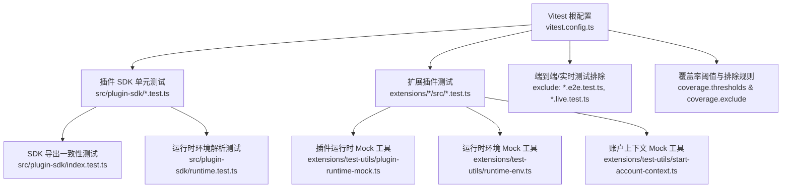
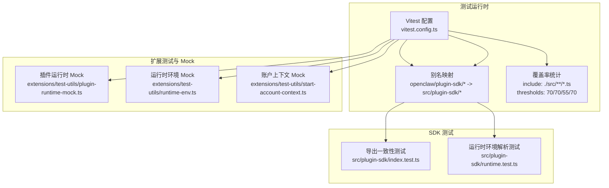
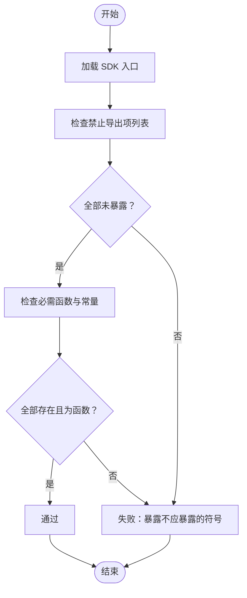
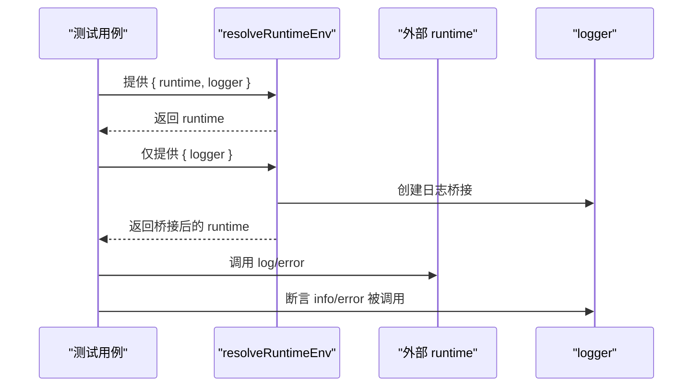
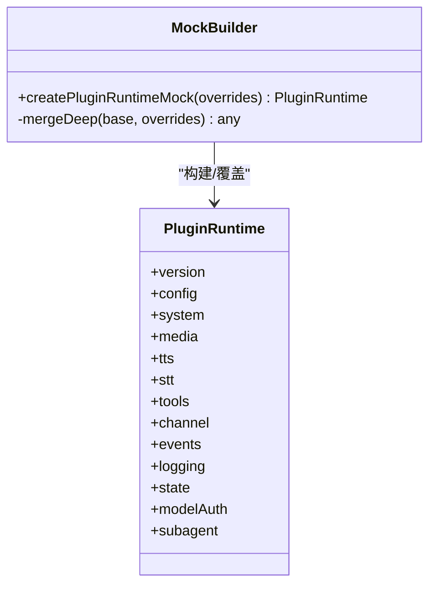
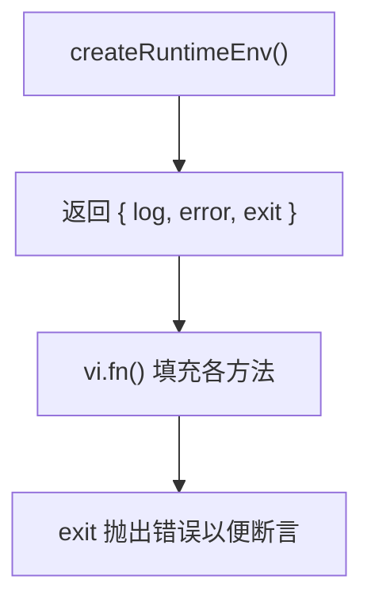
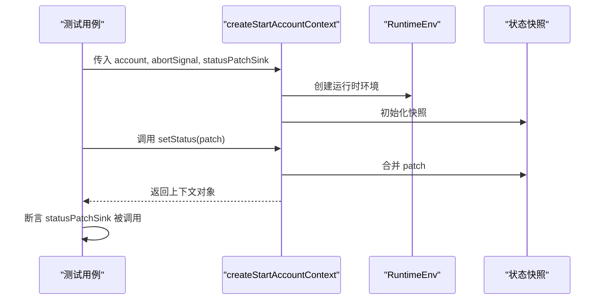
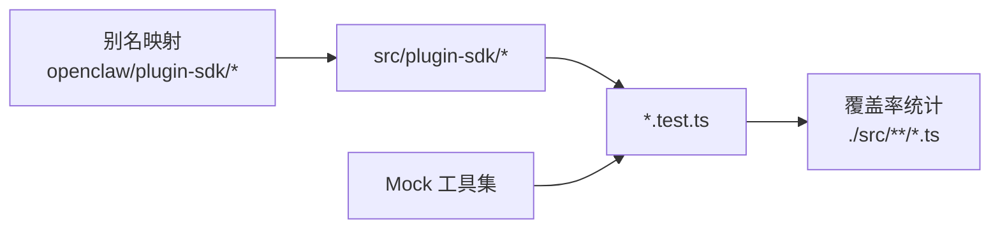

# 测试和调试

<cite>
**本文引用的文件**
- [src/plugin-sdk/index.test.ts](file://src/plugin-sdk/index.test.ts)
- [src/plugin-sdk/test-utils.ts](file://src/plugin-sdk/test-utils.ts)
- [src/plugin-sdk/runtime.test.ts](file://src/plugin-sdk/runtime.test.ts)
- [extensions/test-utils/plugin-runtime-mock.ts](file://extensions/test-utils/plugin-runtime-mock.ts)
- [extensions/test-utils/runtime-env.ts](file://extensions/test-utils/runtime-env.ts)
- [extensions/test-utils/start-account-context.ts](file://extensions/test-utils/start-account-context.ts)
- [vitest.config.ts](file://vitest.config.ts)
- [src/test-utils/vitest-mock-fn.ts](file://src/test-utils/vitest-mock-fn.ts)
- [src/test-helpers/state-dir-env.ts](file://src/test-helpers/state-dir-env.ts)
- [src/test-helpers/ssrf.ts](file://src/test-helpers/ssrf.ts)
- [src/test-helpers/workspace.ts](file://src/test-helpers/workspace.ts)
</cite>

## 目录
1. [引言](#引言)
2. [项目结构](#项目结构)
3. [核心组件](#核心组件)
4. [架构总览](#架构总览)
5. [详细组件分析](#详细组件分析)
6. [依赖关系分析](#依赖关系分析)
7. [性能考量](#性能考量)
8. [故障排查指南](#故障排查指南)
9. [结论](#结论)
10. [附录](#附录)

## 引言
本文件面向 OpenClaw 插件 SDK 的测试与调试，系统性梳理了仓库中的测试工具、模拟对象、断言策略与运行配置，并给出编写与运行插件测试的完整流程建议。内容覆盖单元测试、集成测试边界、模拟对象（Mock）与测试辅助工具，以及调试技巧与性能瓶颈排查方法。同时总结了测试覆盖率与质量保证的最佳实践，帮助开发者在本地与 CI 环境中稳定地验证插件行为。

## 项目结构
OpenClaw 采用多包工作区，测试体系围绕 Vitest 配置集中管理，通过别名映射到各子模块，确保对插件 SDK 的细粒度测试与稳定的覆盖率统计。测试范围涵盖核心 SDK、扩展插件与部分 UI 组件。

图表来源
- [vitest.config.ts](file://vitest.config.ts#L57-L202)
- [src/plugin-sdk/index.test.ts](file://src/plugin-sdk/index.test.ts#L1-L108)
- [src/plugin-sdk/runtime.test.ts](file://src/plugin-sdk/runtime.test.ts#L1-L40)
- [extensions/test-utils/plugin-runtime-mock.ts](file://extensions/test-utils/plugin-runtime-mock.ts#L1-L272)
- [extensions/test-utils/runtime-env.ts](file://extensions/test-utils/runtime-env.ts#L1-L13)
- [extensions/test-utils/start-account-context.ts](file://extensions/test-utils/start-account-context.ts#L1-L34)

章节来源
- [vitest.config.ts](file://vitest.config.ts#L57-L202)

## 核心组件
- 测试运行器与配置：基于 Vitest，启用 fork 池、按 CPU 数量动态 worker 数、严格的环境隔离（unstubEnvs/unstubGlobals），并针对 Windows 调整超时。
- 别名与子路径：通过别名将 openclaw/plugin-sdk/* 映射到 src/plugin-sdk 下的具体模块，便于在测试中精确导入与断言。
- 覆盖率策略：仅统计 src/ 内部实际被测试执行的源码，排除应用层、UI、入口与大型集成模块，设定行/函数/分支/语句 70%/70%/55%/70% 阈值。
- 测试辅助与 Mock：提供统一的 MockFn 类型、运行时环境 Mock、账户上下文 Mock 与运行时环境 Mock，用于快速搭建可预测的测试场景。

章节来源
- [vitest.config.ts](file://vitest.config.ts#L57-L202)
- [src/test-utils/vitest-mock-fn.ts](file://src/test-utils/vitest-mock-fn.ts#L1-L7)
- [extensions/test-utils/plugin-runtime-mock.ts](file://extensions/test-utils/plugin-runtime-mock.ts#L1-L272)
- [extensions/test-utils/runtime-env.ts](file://extensions/test-utils/runtime-env.ts#L1-L13)
- [extensions/test-utils/start-account-context.ts](file://extensions/test-utils/start-account-context.ts#L1-L34)

## 架构总览
下图展示了测试与调试在 OpenClaw 中的整体架构：从 Vitest 配置到 SDK 单测、扩展插件测试与 Mock 工具之间的交互关系。

图表来源
- [vitest.config.ts](file://vitest.config.ts#L57-L202)
- [src/plugin-sdk/index.test.ts](file://src/plugin-sdk/index.test.ts#L1-L108)
- [src/plugin-sdk/runtime.test.ts](file://src/plugin-sdk/runtime.test.ts#L1-L40)
- [extensions/test-utils/plugin-runtime-mock.ts](file://extensions/test-utils/plugin-runtime-mock.ts#L1-L272)
- [extensions/test-utils/runtime-env.ts](file://extensions/test-utils/runtime-env.ts#L1-L13)
- [extensions/test-utils/start-account-context.ts](file://extensions/test-utils/start-account-context.ts#L1-L34)

## 详细组件分析

### 组件一：SDK 导出一致性测试
该测试确保插件 SDK 在编译后不会暴露内部实现细节（如文本分片、命令授权、媒体发送等），同时保留扩展依赖的关键函数与常量。

图表来源
- [src/plugin-sdk/index.test.ts](file://src/plugin-sdk/index.test.ts#L4-L107)

章节来源
- [src/plugin-sdk/index.test.ts](file://src/plugin-sdk/index.test.ts#L1-L108)

### 组件二：运行时环境解析测试
该测试验证 resolveRuntimeEnv 在传入 runtime 或仅传入 logger 时的行为差异，确保日志桥接正确。

图表来源
- [src/plugin-sdk/runtime.test.ts](file://src/plugin-sdk/runtime.test.ts#L5-L39)

章节来源
- [src/plugin-sdk/runtime.test.ts](file://src/plugin-sdk/runtime.test.ts#L1-L40)

### 组件三：插件运行时 Mock（PluginRuntime）
该工具提供完整的 PluginRuntime 接口 Mock，支持深度合并覆盖、默认实现与类型安全，便于在扩展测试中快速构造可预测的运行时环境。

图表来源
- [extensions/test-utils/plugin-runtime-mock.ts](file://extensions/test-utils/plugin-runtime-mock.ts#L35-L271)

章节来源
- [extensions/test-utils/plugin-runtime-mock.ts](file://extensions/test-utils/plugin-runtime-mock.ts#L1-L272)

### 组件四：运行时环境 Mock（RuntimeEnv）
为测试提供最小化的 RuntimeEnv，包含日志与退出接口，便于在不启动真实运行时的情况下进行单元测试。

图表来源
- [extensions/test-utils/runtime-env.ts](file://extensions/test-utils/runtime-env.ts#L4-L12)

章节来源
- [extensions/test-utils/runtime-env.ts](file://extensions/test-utils/runtime-env.ts#L1-L13)

### 组件五：账户上下文 Mock（StartAccountContext）
为插件启动阶段提供可观察的状态快照与状态变更回调，便于断言状态流转与副作用。

图表来源
- [extensions/test-utils/start-account-context.ts](file://extensions/test-utils/start-account-context.ts#L9-L33)

章节来源
- [extensions/test-utils/start-account-context.ts](file://extensions/test-utils/start-account-context.ts#L1-L34)

### 组件六：测试辅助与工具
- 统一 MockFn 类型：避免 vi.fn() 推断导致的类型错误，集中化定义以提升可维护性。
- SSRF 辅助：提供测试中用于校验网络请求安全策略的工具。
- 状态目录环境：在测试中隔离状态目录，避免跨测试污染。

章节来源
- [src/test-utils/vitest-mock-fn.ts](file://src/test-utils/vitest-mock-fn.ts#L1-L7)
- [src/test-helpers/ssrf.ts](file://src/test-helpers/ssrf.ts)
- [src/test-helpers/state-dir-env.ts](file://src/test-helpers/state-dir-env.ts)
- [src/test-helpers/workspace.ts](file://src/test-helpers/workspace.ts)

## 依赖关系分析
- 别名映射：openclaw/plugin-sdk/* 到 src/plugin-sdk/* 的别名确保测试中可以按子路径导入具体模块，便于对单个通道或功能进行单元测试。
- 运行时依赖：插件运行时 Mock 依赖 Vitest 的 vi.fn()，并通过深度合并覆盖默认实现，降低测试耦合度。
- 覆盖率锚定：仅统计 src/ 下被测试执行的源码，排除应用层与 UI 层，使覆盖率阈值更聚焦于核心逻辑。

图表来源
- [vitest.config.ts](file://vitest.config.ts#L57-L202)
- [extensions/test-utils/plugin-runtime-mock.ts](file://extensions/test-utils/plugin-runtime-mock.ts#L1-L272)

章节来源
- [vitest.config.ts](file://vitest.config.ts#L57-L202)

## 性能考量
- 并发与资源：根据 CPU 核数动态设置最大 worker 数，CI 环境在 Windows 上限制为 2，在其他平台为 3，减少资源争用。
- 超时与稳定性：测试与钩子超时在 Windows 上延长，避免平台差异导致的误判。
- 排除大面集成：将大型集成模块与 UI 层排除在覆盖率之外，避免覆盖率阈值被稀释，同时通过 e2e/手动测试保障质量。

章节来源
- [vitest.config.ts](file://vitest.config.ts#L71-L100)
- [vitest.config.ts](file://vitest.config.ts#L101-L200)

## 故障排查指南
- 环境变量泄漏：启用 unstubEnvs 与 unstubGlobals，避免 vmForks 池中跨文件污染；若出现“奇怪”的测试间依赖，优先检查是否使用了全局/环境变量 stub。
- 日志与退出：使用 RuntimeEnv Mock 的 exit 抛错特性定位异常退出点；结合 resolveRuntimeEnv 的行为断言，确认日志桥接是否生效。
- 状态快照：通过账户上下文 Mock 的状态变更回调，捕获状态变化轨迹，定位状态更新问题。
- 超时与平台差异：Windows 平台测试超时延长，若出现超时，优先检查平台差异与并发任务数量。
- 覆盖率不达标：确认被测代码位于 src/ 且未被 exclude 规则屏蔽；必要时在测试中显式调用被排除模块的受控路径。

章节来源
- [vitest.config.ts](file://vitest.config.ts#L74-L78)
- [extensions/test-utils/runtime-env.ts](file://extensions/test-utils/runtime-env.ts#L8-L11)
- [extensions/test-utils/start-account-context.ts](file://extensions/test-utils/start-account-context.ts#L26-L32)

## 结论
OpenClaw 插件 SDK 的测试与调试体系以 Vitest 为核心，配合别名映射、Mock 工具与严格的覆盖率策略，实现了对 SDK 与扩展插件的高可靠验证。通过导出一致性测试、运行时环境解析测试与完善的 Mock 工具链，开发者可以在本地与 CI 环境中高效地编写、运行与调试插件测试，并以覆盖率阈值与排除策略确保质量门槛。

## 附录
- 测试环境搭建建议
  - 使用 Vitest 默认配置即可；如需自定义，参考根配置中的别名与覆盖率设置。
  - 在扩展测试中优先使用 plugin-runtime-mock.ts、runtime-env.ts 与 start-account-context.ts 快速搭建上下文。
- 编写与运行测试
  - 将测试文件命名为 *.test.ts，置于对应模块目录下，遵循现有命名与组织方式。
  - 使用 vi.expect 与 vi.fn() 进行断言与桩函数；必要时引入统一 MockFn 类型以避免类型错误。
  - 运行命令：在项目根目录执行 Vitest，默认包含 src/**, extensions/**, test/** 等路径。
- 调试技巧
  - 使用 vi.stubEnv/vi.restoreAllMocks 精准控制环境与全局 stub 生命周期。
  - 对状态变化敏感的逻辑，使用账户上下文 Mock 的状态回调进行断言。
  - 对网络与外部依赖，结合 SSRF 辅助工具与 Mock 进行隔离验证。
- 质量保证最佳实践
  - 保持覆盖率阈值稳定，避免过度排除；将大型集成模块交由 e2e/手动测试验证。
  - 对关键导出与运行时行为增加回归测试，防止 API 泄露与行为退化。
  - 在 CI 中开启严格超时与平台差异化配置，减少误报与资源浪费。