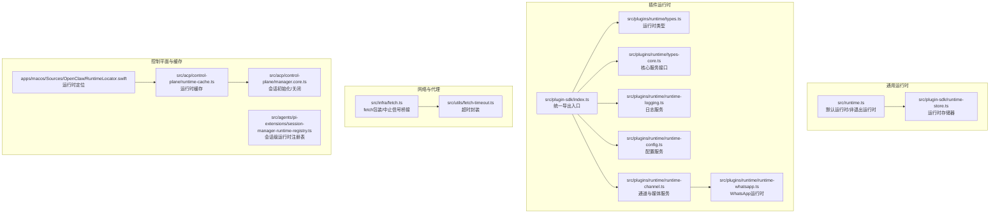
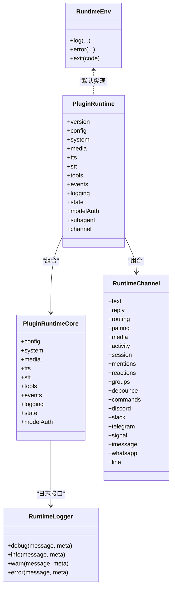
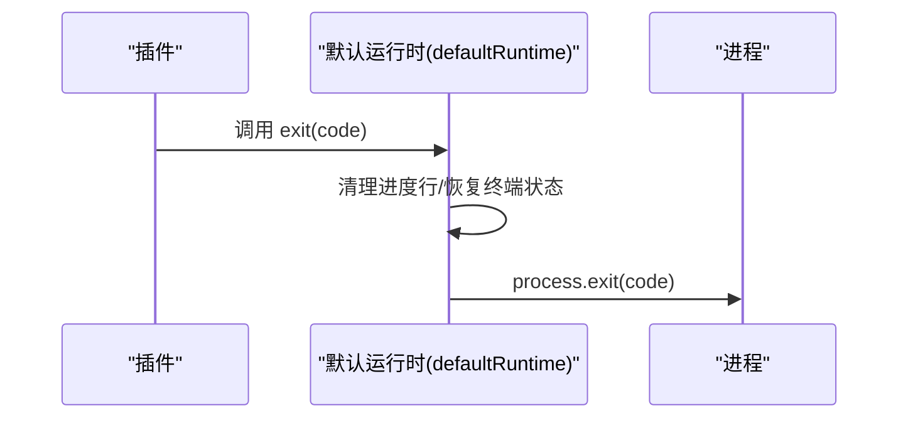
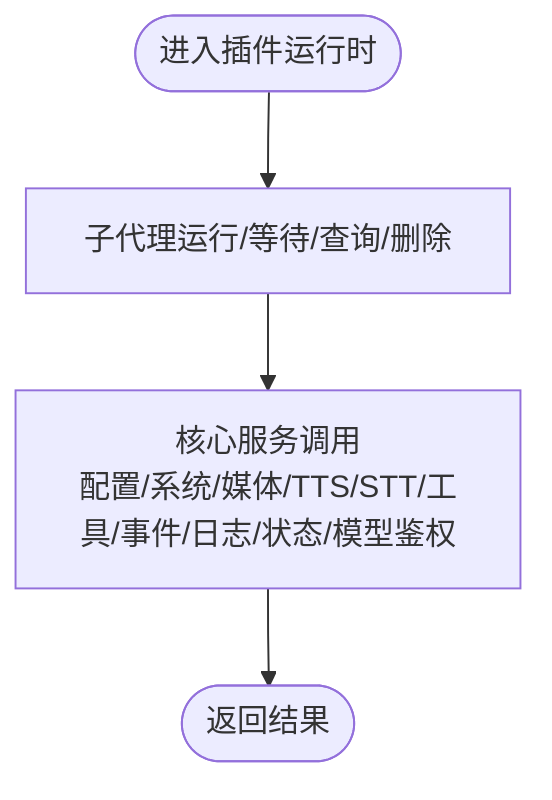
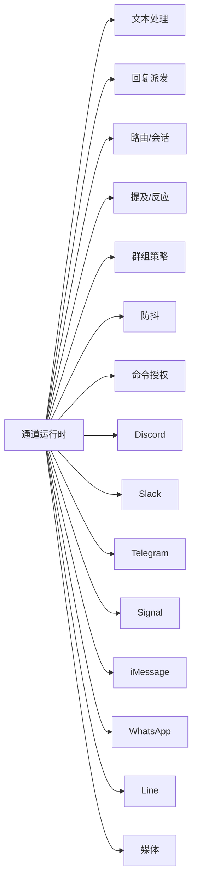
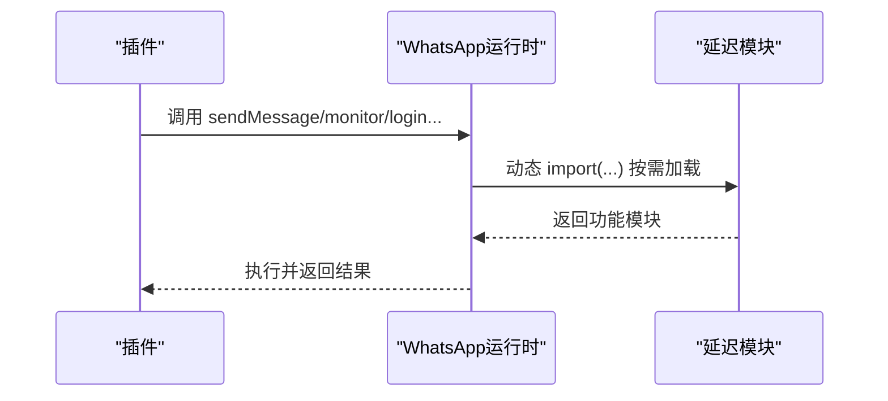
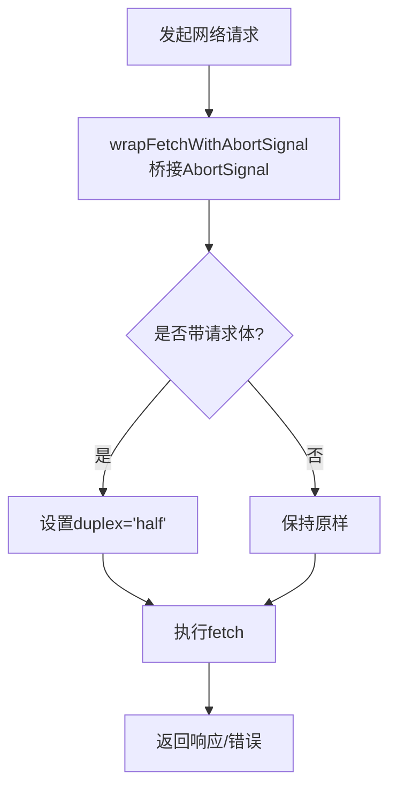
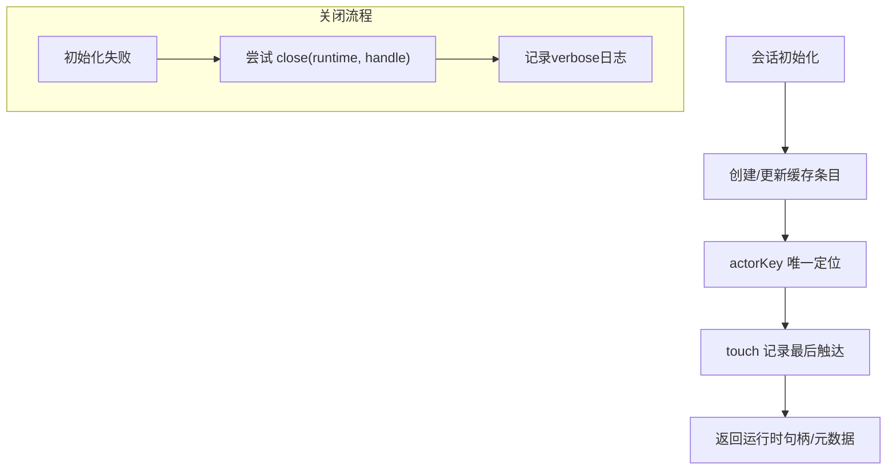
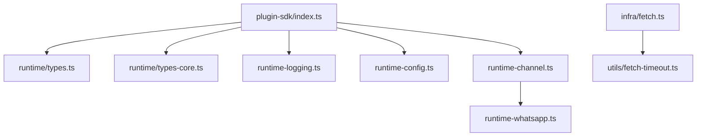

# 运行时环境

<cite>
**本文引用的文件**   
- [src/runtime.ts](file://src/runtime.ts)
- [src/plugin-sdk/index.ts](file://src/plugin-sdk/index.ts)
- [src/plugins/runtime/types.ts](file://src/plugins/runtime/types.ts)
- [src/plugins/runtime/types-core.ts](file://src/plugins/runtime/types-core.ts)
- [src/plugins/runtime/runtime-logging.ts](file://src/plugins/runtime/runtime-logging.ts)
- [src/plugins/runtime/runtime-config.ts](file://src/plugins/runtime/runtime-config.ts)
- [src/plugins/runtime/runtime-channel.ts](file://src/plugins/runtime/runtime-channel.ts)
- [src/plugins/runtime/runtime-whatsapp.ts](file://src/plugins/runtime/runtime-whatsapp.ts)
- [src/plugin-sdk/runtime-store.ts](file://src/plugin-sdk/runtime-store.ts)
- [src/infra/fetch.ts](file://src/infra/fetch.ts)
- [src/utils/fetch-timeout.ts](file://src/utils/fetch-timeout.ts)
- [apps/macos/Sources/OpenClaw/RuntimeLocator.swift](file://apps/macos/Sources/OpenClaw/RuntimeLocator.swift)
- [src/acp/control-plane/runtime-cache.ts](file://src/acp/control-plane/runtime-cache.ts)
- [src/acp/control-plane/manager.core.ts](file://src/acp/control-plane/manager.core.ts)
- [src/agents/pi-extensions/session-manager-runtime-registry.ts](file://src/agents/pi-extensions/session-manager-runtime-registry.ts)
</cite>

## 目录
1. [简介](#简介)
2. [项目结构](#项目结构)
3. [核心组件](#核心组件)
4. [架构总览](#架构总览)
5. [详细组件分析](#详细组件分析)
6. [依赖关系分析](#依赖关系分析)
7. [性能考量](#性能考量)
8. [故障排除指南](#故障排除指南)
9. [结论](#结论)
10. [附录](#附录)

## 简介
本文件面向OpenClaw插件SDK的运行时环境，系统性阐述其架构设计与实现要点，覆盖运行时生命周期管理、内存与资源分配策略、日志与配置服务、通道与网络能力、以及在插件中正确使用运行时服务的方法。同时给出性能优化建议与常见问题排查路径，帮助开发者在多平台（Node/macOS）环境中稳定高效地集成与扩展插件。

## 项目结构
运行时环境由“通用运行时接口”、“插件运行时类型与服务集合”、“通道与媒体能力封装”、“网络与代理支持”、“缓存与会话注册表”等模块组成，并通过统一入口导出供插件使用。

**图示来源**
- [src/runtime.ts](file://src/runtime.ts#L1-L54)
- [src/plugin-sdk/runtime-store.ts](file://src/plugin-sdk/runtime-store.ts#L1-L27)
- [src/plugin-sdk/index.ts](file://src/plugin-sdk/index.ts#L1-L812)
- [src/plugins/runtime/types.ts](file://src/plugins/runtime/types.ts#L1-L64)
- [src/plugins/runtime/types-core.ts](file://src/plugins/runtime/types-core.ts#L1-L68)
- [src/plugins/runtime/runtime-logging.ts](file://src/plugins/runtime/runtime-logging.ts#L1-L22)
- [src/plugins/runtime/runtime-config.ts](file://src/plugins/runtime/runtime-config.ts#L1-L10)
- [src/plugins/runtime/runtime-channel.ts](file://src/plugins/runtime/runtime-channel.ts#L1-L265)
- [src/plugins/runtime/runtime-whatsapp.ts](file://src/plugins/runtime/runtime-whatsapp.ts#L1-L110)
- [src/infra/fetch.ts](file://src/infra/fetch.ts#L1-L84)
- [src/utils/fetch-timeout.ts](file://src/utils/fetch-timeout.ts#L1-L37)
- [apps/macos/Sources/OpenClaw/RuntimeLocator.swift](file://apps/macos/Sources/OpenClaw/RuntimeLocator.swift#L1-L42)
- [src/acp/control-plane/runtime-cache.ts](file://src/acp/control-plane/runtime-cache.ts#L1-L59)
- [src/acp/control-plane/manager.core.ts](file://src/acp/control-plane/manager.core.ts#L289-L316)
- [src/agents/pi-extensions/session-manager-runtime-registry.ts](file://src/agents/pi-extensions/session-manager-runtime-registry.ts#L1-L29)

**章节来源**
- [src/runtime.ts](file://src/runtime.ts#L1-L54)
- [src/plugin-sdk/index.ts](file://src/plugin-sdk/index.ts#L1-L812)

## 核心组件
- 通用运行时接口：提供日志、错误输出与进程退出的统一抽象，默认实现会清理终端状态并退出；非退出版本用于测试或嵌入式场景。
- 插件运行时类型：定义子代理运行、等待、会话消息查询与删除等API；组合核心服务（配置、系统事件、媒体、TTS/STT、工具、事件、日志、状态目录、模型鉴权）。
- 通道与媒体服务：封装文本分块、回复派发、路由、配对、媒体拉取与保存、会话元数据记录、提及与反应、群组策略、防抖、命令授权、各渠道发送与监控等。
- 日志与配置：提供可继承的日志器工厂与级别规范化、配置加载与写入。
- 网络与代理：对fetch进行中止信号桥接与预连接增强，提供超时封装以保障请求稳定性。
- 缓存与会话注册表：运行时缓存（按actorKey缓存状态与最后触达时间）、会话级弱映射注册表、macOS运行时定位与版本解析。

**章节来源**
- [src/plugins/runtime/types.ts](file://src/plugins/runtime/types.ts#L1-L64)
- [src/plugins/runtime/types-core.ts](file://src/plugins/runtime/types-core.ts#L1-L68)
- [src/plugins/runtime/runtime-logging.ts](file://src/plugins/runtime/runtime-logging.ts#L1-L22)
- [src/plugins/runtime/runtime-config.ts](file://src/plugins/runtime/runtime-config.ts#L1-L10)
- [src/plugins/runtime/runtime-channel.ts](file://src/plugins/runtime/runtime-channel.ts#L1-L265)
- [src/infra/fetch.ts](file://src/infra/fetch.ts#L1-L84)
- [src/utils/fetch-timeout.ts](file://src/utils/fetch-timeout.ts#L1-L37)
- [src/acp/control-plane/runtime-cache.ts](file://src/acp/control-plane/runtime-cache.ts#L1-L59)
- [src/agents/pi-extensions/session-manager-runtime-registry.ts](file://src/agents/pi-extensions/session-manager-runtime-registry.ts#L1-L29)
- [apps/macos/Sources/OpenClaw/RuntimeLocator.swift](file://apps/macos/Sources/OpenClaw/RuntimeLocator.swift#L1-L42)

## 架构总览
运行时环境采用“类型驱动的服务聚合”模式：通过统一入口导出运行时类型与服务，插件仅依赖这些类型与工厂函数，避免直接耦合底层实现。通道与网络能力通过延迟加载与模块化组织，提升启动与运行效率。

**图示来源**
- [src/runtime.ts](file://src/runtime.ts#L4-L44)
- [src/plugins/runtime/types.ts](file://src/plugins/runtime/types.ts#L51-L63)
- [src/plugins/runtime/types-core.ts](file://src/plugins/runtime/types-core.ts#L10-L67)
- [src/plugins/runtime/runtime-channel.ts](file://src/plugins/runtime/runtime-channel.ts#L119-L264)

## 详细组件分析

### 通用运行时与生命周期
- 默认运行时负责清理终端状态后退出进程；非退出版本抛出异常而非真实退出，便于测试与嵌入式场景。
- 运行时日志在特定环境下抑制输出，避免测试噪声。
- 进程退出前恢复终端状态，确保交互式体验一致。

**图示来源**
- [src/runtime.ts](file://src/runtime.ts#L37-L44)

**章节来源**
- [src/runtime.ts](file://src/runtime.ts#L1-L54)

### 插件运行时类型与服务
- 子代理运行：支持运行、等待、获取会话消息、删除会话等；参数包含幂等键、消息、额外系统提示、队列标识等。
- 核心服务：配置读写、系统事件、心跳唤醒、命令执行、媒体加载与检测、TTS/STT、内存工具、会话转录事件、日志工厂、状态目录解析、模型鉴权（按模型或提供商）。
- 日志服务：提供是否启用详细日志的判断与子日志器工厂，支持按级别规范化。
- 配置服务：提供配置加载与原子写入。

**图示来源**
- [src/plugins/runtime/types.ts](file://src/plugins/runtime/types.ts#L8-L63)
- [src/plugins/runtime/types-core.ts](file://src/plugins/runtime/types-core.ts#L10-L67)
- [src/plugins/runtime/runtime-logging.ts](file://src/plugins/runtime/runtime-logging.ts#L6-L21)
- [src/plugins/runtime/runtime-config.ts](file://src/plugins/runtime/runtime-config.ts#L4-L9)

**章节来源**
- [src/plugins/runtime/types.ts](file://src/plugins/runtime/types.ts#L1-L64)
- [src/plugins/runtime/types-core.ts](file://src/plugins/runtime/types-core.ts#L1-L68)
- [src/plugins/runtime/runtime-logging.ts](file://src/plugins/runtime/runtime-logging.ts#L1-L22)
- [src/plugins/runtime/runtime-config.ts](file://src/plugins/runtime/runtime-config.ts#L1-L10)

### 通道与媒体服务
- 文本处理：分块策略、模式选择、Markdown表格转换。
- 回复派发：缓冲块派发器、打字反馈、入站上下文收尾、信封格式化。
- 路由与会话：会话键构建、路由解析、会话元数据记录、活动记录与查询。
- 提及与反应：正则构建、匹配、反应确认与移除。
- 群组策略：按渠道解析群组策略与是否需要@。
- 防抖：入站消息防抖器与延迟计算。
- 命令授权：命令检测与授权计算。
- 各渠道能力：Discord/Slack/Telegram/Signal/iMessage/WhatsApp/Line 的探测、目录、权限审计、消息发送、轮询、监控与动作处理。
- 媒体：远程媒体抓取、本地存储、MIME检测、图像元数据与缩放。

**图示来源**
- [src/plugins/runtime/runtime-channel.ts](file://src/plugins/runtime/runtime-channel.ts#L119-L264)

**章节来源**
- [src/plugins/runtime/runtime-channel.ts](file://src/plugins/runtime/runtime-channel.ts#L1-L265)

### WhatsApp运行时（延迟加载）
- 通过惰性导入方式按需加载登录、二维码登录、Web通道与动作处理模块，降低启动开销。
- 暴露Web认证信息查询、监听器、登录工具等能力。

**图示来源**
- [src/plugins/runtime/runtime-whatsapp.ts](file://src/plugins/runtime/runtime-whatsapp.ts#L12-L109)

**章节来源**
- [src/plugins/runtime/runtime-whatsapp.ts](file://src/plugins/runtime/runtime-whatsapp.ts#L1-L110)

### 网络与代理支持
- fetch包装：自动为带请求体的请求设置半双工流，确保兼容性；对AbortSignal进行桥接，保证中止信号正确传递。
- 超时封装：基于AbortController实现超时控制，避免长时间阻塞。
- 插件可通过运行时服务间接使用网络能力（例如通道发送），也可结合上述工具进行自定义网络请求。

**图示来源**
- [src/infra/fetch.ts](file://src/infra/fetch.ts#L36-L84)
- [src/utils/fetch-timeout.ts](file://src/utils/fetch-timeout.ts#L24-L37)

**章节来源**
- [src/infra/fetch.ts](file://src/infra/fetch.ts#L1-L84)
- [src/utils/fetch-timeout.ts](file://src/utils/fetch-timeout.ts#L1-L37)

### 控制平面与运行时缓存
- 运行时缓存：以actorKey为键缓存运行时句柄、后端、代理、会话模式、工作目录等，并记录最后触达时间，支持touch/peek与统计快照。
- 会话管理注册表：基于WeakMap的会话级运行时注册表，确保对象身份稳定的场景下值的生命周期与会话绑定。
- macOS运行时定位：版本比较与路径解析，支持从字符串解析版本号并进行比较。
- 会话初始化与关闭：在元数据写入失败时回滚关闭运行时，保证一致性。

**图示来源**
- [src/acp/control-plane/runtime-cache.ts](file://src/acp/control-plane/runtime-cache.ts#L25-L59)
- [src/agents/pi-extensions/session-manager-runtime-registry.ts](file://src/agents/pi-extensions/session-manager-runtime-registry.ts#L1-L29)
- [apps/macos/Sources/OpenClaw/RuntimeLocator.swift](file://apps/macos/Sources/OpenClaw/RuntimeLocator.swift#L8-L42)
- [src/acp/control-plane/manager.core.ts](file://src/acp/control-plane/manager.core.ts#L289-L316)

**章节来源**
- [src/acp/control-plane/runtime-cache.ts](file://src/acp/control-plane/runtime-cache.ts#L1-L59)
- [src/agents/pi-extensions/session-manager-runtime-registry.ts](file://src/agents/pi-extensions/session-manager-runtime-registry.ts#L1-L29)
- [apps/macos/Sources/OpenClaw/RuntimeLocator.swift](file://apps/macos/Sources/OpenClaw/RuntimeLocator.swift#L1-L42)
- [src/acp/control-plane/manager.core.ts](file://src/acp/control-plane/manager.core.ts#L289-L316)

## 依赖关系分析
- 统一导出入口：插件通过单一入口获取运行时类型与服务，降低耦合度。
- 模块内聚：通道与媒体能力集中在运行时通道模块，便于扩展与维护。
- 延迟加载：WhatsApp运行时按需加载，减少冷启动成本。
- 网络层解耦：fetch包装与超时工具独立于通道实现，可在不同场景复用。

**图示来源**
- [src/plugin-sdk/index.ts](file://src/plugin-sdk/index.ts#L1-L812)
- [src/plugins/runtime/types.ts](file://src/plugins/runtime/types.ts#L1-L64)
- [src/plugins/runtime/types-core.ts](file://src/plugins/runtime/types-core.ts#L1-L68)
- [src/plugins/runtime/runtime-logging.ts](file://src/plugins/runtime/runtime-logging.ts#L1-L22)
- [src/plugins/runtime/runtime-config.ts](file://src/plugins/runtime/runtime-config.ts#L1-L10)
- [src/plugins/runtime/runtime-channel.ts](file://src/plugins/runtime/runtime-channel.ts#L1-L265)
- [src/plugins/runtime/runtime-whatsapp.ts](file://src/plugins/runtime/runtime-whatsapp.ts#L1-L110)
- [src/infra/fetch.ts](file://src/infra/fetch.ts#L1-L84)
- [src/utils/fetch-timeout.ts](file://src/utils/fetch-timeout.ts#L1-L37)

**章节来源**
- [src/plugin-sdk/index.ts](file://src/plugin-sdk/index.ts#L1-L812)

## 性能考量
- 延迟加载：对高开销功能（如WhatsApp运行时）采用惰性导入，仅在首次调用时加载，显著降低启动时间。
- 请求优化：为带请求体的请求自动设置半双工流，减少不必要的传输开销；结合超时封装避免长时间阻塞。
- 缓存策略：运行时缓存记录最后触达时间，便于回收与复用；会话级注册表避免跨会话污染。
- 日志控制：在测试或静默环境下抑制日志输出，减少I/O开销。
- 终端状态恢复：退出前恢复终端状态，避免后续交互异常。

[本节为通用指导，不直接分析具体文件]

## 故障排除指南
- 初始化失败回滚：当元数据写入失败时，会尝试关闭运行时并记录详细日志，便于定位问题。
- 中止信号处理：若外部AbortSignal导致请求中止，fetch包装会正确桥接并清理监听器，避免内存泄漏。
- 超时控制：使用超时封装时，确保传入合理的超时时间，避免过短导致误判或过长影响响应。
- 日志级别：通过日志服务的级别规范化与子日志器工厂，快速定位问题域。
- 通道能力：检查对应渠道的探测与权限配置，确保发送与监控功能正常。

**章节来源**
- [src/acp/control-plane/manager.core.ts](file://src/acp/control-plane/manager.core.ts#L289-L316)
- [src/infra/fetch.ts](file://src/infra/fetch.ts#L41-L84)
- [src/utils/fetch-timeout.ts](file://src/utils/fetch-timeout.ts#L24-L37)
- [src/plugins/runtime/runtime-logging.ts](file://src/plugins/runtime/runtime-logging.ts#L6-L21)

## 结论
OpenClaw插件SDK运行时环境通过类型化服务聚合、延迟加载与缓存机制，在保证功能完整性的同时兼顾性能与可维护性。开发者应优先使用统一导出入口与运行时服务，遵循日志与网络最佳实践，并结合会话级注册表与缓存策略，确保插件在多平台环境中的稳定运行。

[本节为总结性内容，不直接分析具体文件]

## 附录
- 初始化与配置指南
  - 使用统一导出入口获取运行时类型与服务。
  - 通过配置服务加载与写入配置文件，确保路径与权限正确。
  - 在测试或嵌入式场景使用非退出运行时以避免真实进程退出。
- 在插件中正确使用运行时服务
  - 使用日志服务创建子日志器，按需设置级别。
  - 通过通道运行时进行消息发送、媒体处理与会话管理。
  - 对高开销操作采用延迟加载与缓存策略。
  - 使用网络工具进行超时控制与中止信号桥接。

[本节为通用指导，不直接分析具体文件]