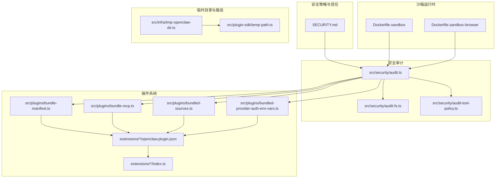
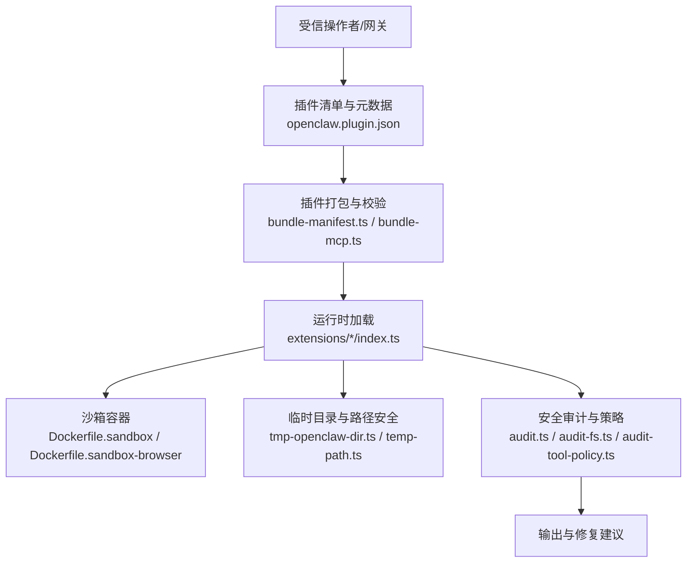
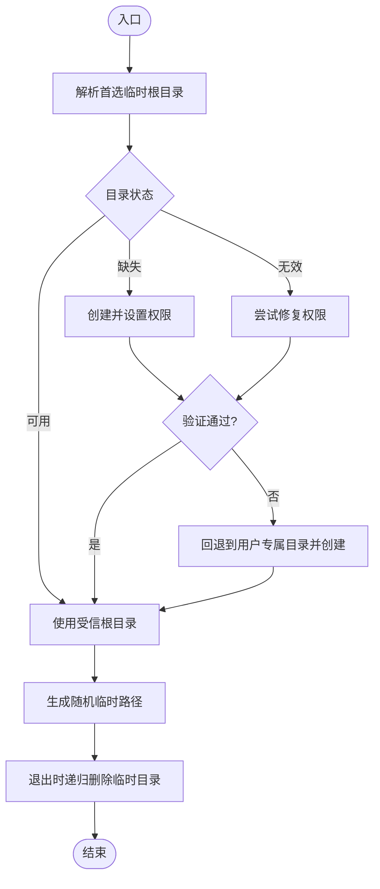
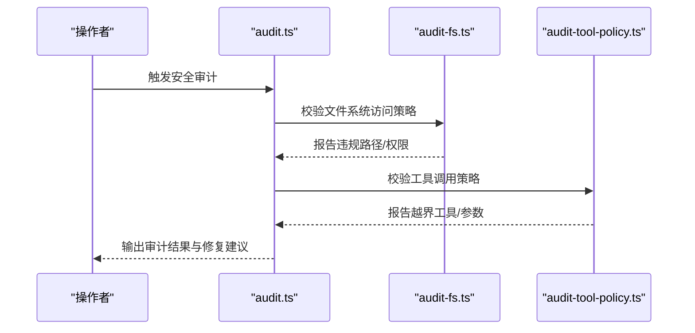
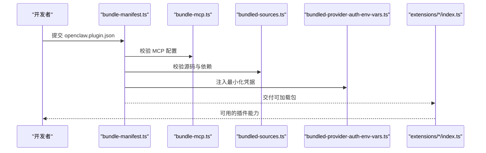
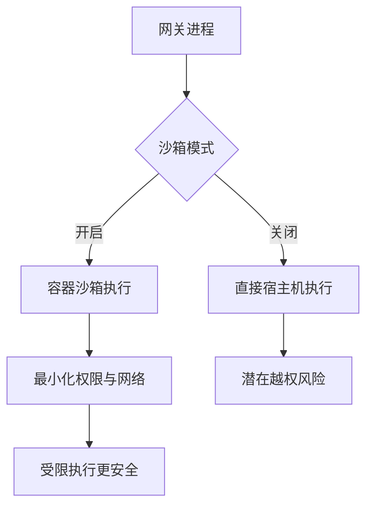
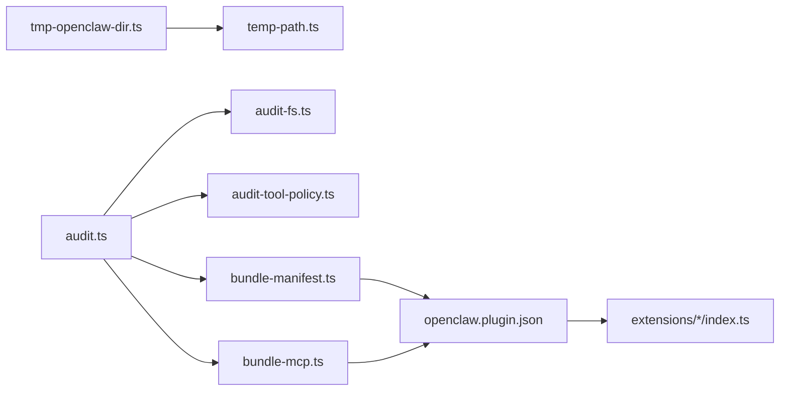

# 插件安全模型

<cite>
**本文引用的文件**
- [SECURITY.md](file://SECURITY.md)
- [Dockerfile.sandbox](file://Dockerfile.sandbox)
- [Dockerfile.sandbox-browser](file://Dockerfile.sandbox-browser)
- [tmp-openclaw-dir.ts](file://src/infra/tmp-openclaw-dir.ts)
- [temp-path.ts](file://src/plugin-sdk/temp-path.ts)
- [audit.ts](file://src/security/audit.ts)
- [audit-fs.ts](file://src/security/audit-fs.ts)
- [audit-tool-policy.ts](file://src/security/audit-tool-policy.ts)
- [bundle-manifest.ts](file://src/plugins/bundle-manifest.ts)
- [bundle-mcp.ts](file://src/plugins/bundle-mcp.ts)
- [bundled-sources.ts](file://src/plugins/bundled-sources.ts)
- [bundled-provider-auth-env-vars.ts](file://src/plugins/bundled-provider-auth-env-vars.ts)
- [manifest.json（示例）](file://extensions/anthropic/openclaw.plugin.json)
- [index.ts（示例）](file://extensions/anthropic/index.ts)
</cite>

## 目录
1. [引言](#引言)
2. [项目结构](#项目结构)
3. [核心组件](#核心组件)
4. [架构总览](#架构总览)
5. [详细组件分析](#详细组件分析)
6. [依赖关系分析](#依赖关系分析)
7. [性能考量](#性能考量)
8. [故障排查指南](#故障排查指南)
9. [结论](#结论)
10. [附录](#附录)

## 引言
本文件系统化阐述 OpenClaw 插件安全模型，覆盖安全架构、权限与信任边界、沙箱与资源限制、认证与授权、数据与隐私保护、以及安全配置与审计方法。OpenClaw 的安全模型以“个人助理”为前提：单用户/受信操作者、多代理协作，而非共享多租户边界。插件作为网关可信计算基的一部分，默认与本地运行代码同等信任；若需隔离，应启用严格沙箱与工具策略。

## 项目结构
围绕插件安全的关键目录与文件包括：
- 安全策略与信任模型：SECURITY.md
- 沙箱容器镜像：Dockerfile.sandbox、Dockerfile.sandbox-browser
- 临时目录与路径安全：src/infra/tmp-openclaw-dir.ts、src/plugin-sdk/temp-path.ts
- 安全审计：src/security/audit*.ts
- 插件打包与清单：src/plugins/bundle-*.ts、extensions/*/openclaw.plugin.json、extensions/*/index.ts

图表来源
- [SECURITY.md:108-114](file://SECURITY.md#L108-L114)
- [Dockerfile.sandbox:1-25](file://Dockerfile.sandbox#L1-L25)
- [Dockerfile.sandbox-browser:1-36](file://Dockerfile.sandbox-browser#L1-L36)
- [tmp-openclaw-dir.ts:1-170](file://src/infra/tmp-openclaw-dir.ts#L1-L170)
- [temp-path.ts:1-85](file://src/plugin-sdk/temp-path.ts#L1-L85)
- [audit.ts:1-200](file://src/security/audit.ts#L1-L200)
- [audit-fs.ts:1-200](file://src/security/audit-fs.ts#L1-L200)
- [audit-tool-policy.ts:1-200](file://src/security/audit-tool-policy.ts#L1-L200)
- [bundle-manifest.ts:1-200](file://src/plugins/bundle-manifest.ts#L1-L200)
- [bundle-mcp.ts:1-200](file://src/plugins/bundle-mcp.ts#L1-L200)
- [bundled-sources.ts:1-200](file://src/plugins/bundled-sources.ts#L1-L200)
- [bundled-provider-auth-env-vars.ts:1-200](file://src/plugins/bundled-provider-auth-env-vars.ts#L1-L200)
- [manifest.json（示例）](file://extensions/anthropic/openclaw.plugin.json)
- [index.ts（示例）](file://extensions/anthropic/index.ts)

章节来源
- [SECURITY.md:108-114](file://SECURITY.md#L108-L114)
- [Dockerfile.sandbox:1-25](file://Dockerfile.sandbox#L1-L25)
- [Dockerfile.sandbox-browser:1-36](file://Dockerfile.sandbox-browser#L1-L36)
- [tmp-openclaw-dir.ts:1-170](file://src/infra/tmp-openclaw-dir.ts#L1-L170)
- [temp-path.ts:1-85](file://src/plugin-sdk/temp-path.ts#L1-L85)
- [audit.ts:1-200](file://src/security/audit.ts#L1-L200)
- [audit-fs.ts:1-200](file://src/security/audit-fs.ts#L1-L200)
- [audit-tool-policy.ts:1-200](file://src/security/audit-tool-policy.ts#L1-L200)
- [bundle-manifest.ts:1-200](file://src/plugins/bundle-manifest.ts#L1-L200)
- [bundle-mcp.ts:1-200](file://src/plugins/bundle-mcp.ts#L1-L200)
- [bundled-sources.ts:1-200](file://src/plugins/bundled-sources.ts#L1-L200)
- [bundled-provider-auth-env-vars.ts:1-200](file://src/plugins/bundled-provider-auth-env-vars.ts#L1-L200)
- [manifest.json（示例）](file://extensions/anthropic/openclaw.plugin.json)
- [index.ts（示例）](file://extensions/anthropic/index.ts)

## 核心组件
- 信任与边界
  - 插件被视为网关可信计算基的一部分，安装/启用即授予与本地代码同等的信任级别；任何安全报告必须展示越界行为（如未授权加载、策略绕过、沙箱/路径安全绕过），而不仅是受信插件的恶意行为。
  - 网关 HTTP 兼容端点在该信任边界内，传递网关认证即等同于操作者权限，不提供细粒度的 per-user 授权边界。
- 沙箱与运行时
  - 提供专用沙箱镜像（无浏览器与带浏览器），默认非 root 用户，最小化安装，支持可选的 X11/远程桌面能力，便于受限的媒体/浏览器任务。
- 临时目录与路径安全
  - 统一解析首选 OpenClaw 临时根目录，强制 0o700 权限，避免符号链接与组/其他写权限，必要时自动修复或创建安全目录；插件 SDK 提供随机路径生成与下载临时文件的生命周期管理。
- 安全审计
  - 审计模块覆盖文件系统、工具策略、危险配置标志、外部内容处理等，提供“深度审计”与“修复建议”，并与插件打包/清单校验联动。
- 插件打包与清单
  - 清单定义插件元信息与能力；打包流程校验来源、MCP 配置、提供商凭据注入等，确保可追溯与最小暴露。

章节来源
- [SECURITY.md:108-114](file://SECURITY.md#L108-L114)
- [SECURITY.md:167-176](file://SECURITY.md#L167-L176)
- [Dockerfile.sandbox:1-25](file://Dockerfile.sandbox#L1-L25)
- [Dockerfile.sandbox-browser:1-36](file://Dockerfile.sandbox-browser#L1-L36)
- [tmp-openclaw-dir.ts:34-170](file://src/infra/tmp-openclaw-dir.ts#L34-L170)
- [temp-path.ts:43-85](file://src/plugin-sdk/temp-path.ts#L43-L85)
- [audit.ts:1-200](file://src/security/audit.ts#L1-L200)
- [bundle-manifest.ts:1-200](file://src/plugins/bundle-manifest.ts#L1-L200)
- [bundle-mcp.ts:1-200](file://src/plugins/bundle-mcp.ts#L1-L200)
- [bundled-sources.ts:1-200](file://src/plugins/bundled-sources.ts#L1-L200)
- [bundled-provider-auth-env-vars.ts:1-200](file://src/plugins/bundled-provider-auth-env-vars.ts#L1-L200)

## 架构总览
下图展示插件安全从“清单与打包”到“运行时沙箱与临时目录”的整体边界与控制点。

图表来源
- [bundle-manifest.ts:1-200](file://src/plugins/bundle-manifest.ts#L1-L200)
- [bundle-mcp.ts:1-200](file://src/plugins/bundle-mcp.ts#L1-L200)
- [manifest.json（示例）](file://extensions/anthropic/openclaw.plugin.json)
- [index.ts（示例）](file://extensions/anthropic/index.ts)
- [Dockerfile.sandbox:1-25](file://Dockerfile.sandbox#L1-L25)
- [Dockerfile.sandbox-browser:1-36](file://Dockerfile.sandbox-browser#L1-L36)
- [tmp-openclaw-dir.ts:34-170](file://src/infra/tmp-openclaw-dir.ts#L34-L170)
- [temp-path.ts:43-85](file://src/plugin-sdk/temp-path.ts#L43-L85)
- [audit.ts:1-200](file://src/security/audit.ts#L1-L200)
- [audit-fs.ts:1-200](file://src/security/audit-fs.ts#L1-L200)
- [audit-tool-policy.ts:1-200](file://src/security/audit-tool-policy.ts#L1-L200)

## 详细组件分析

### 临时目录与路径安全
- 设计要点
  - 解析首选临时根目录，优先使用受控路径，回退到用户专属目录，并强制 0o700 权限与所有者一致性检查。
  - 插件 SDK 提供随机文件名与临时目录生成，确保下载与中间文件隔离，退出时清理。
- 复杂度与性能
  - 路径解析与权限检查为 O(1)，I/O 成本低；临时目录清理采用异步删除，失败静默但记录告警，避免阻塞主流程。
- 错误处理
  - 对不可用/不安全目录抛出错误，必要时尝试修复权限；对清理阶段的 ENOENT 忽略，其他异常仅警告。

图表来源
- [tmp-openclaw-dir.ts:34-170](file://src/infra/tmp-openclaw-dir.ts#L34-L170)
- [temp-path.ts:43-85](file://src/plugin-sdk/temp-path.ts#L43-L85)

章节来源
- [tmp-openclaw-dir.ts:34-170](file://src/infra/tmp-openclaw-dir.ts#L34-L170)
- [temp-path.ts:43-85](file://src/plugin-sdk/temp-path.ts#L43-L85)

### 安全审计与策略
- 文件系统审计
  - 限制工具对工作区外路径的读写，防止越权访问与意外写入。
- 工具策略审计
  - 严格核对工具调用范围与参数，结合“执行审批”机制降低误执行风险。
- 危险配置与外部内容
  - 审计危险开关与外部内容处理选项，避免调试开关被误用导致安全风险。

图表来源
- [audit.ts:1-200](file://src/security/audit.ts#L1-L200)
- [audit-fs.ts:1-200](file://src/security/audit-fs.ts#L1-L200)
- [audit-tool-policy.ts:1-200](file://src/security/audit-tool-policy.ts#L1-L200)

章节来源
- [audit.ts:1-200](file://src/security/audit.ts#L1-L200)
- [audit-fs.ts:1-200](file://src/security/audit-fs.ts#L1-L200)
- [audit-tool-policy.ts:1-200](file://src/security/audit-tool-policy.ts#L1-L200)

### 插件清单与打包
- 清单（openclaw.plugin.json）
  - 定义插件 ID、版本、能力、入口脚本、依赖与权限声明；用于信任与审计的依据。
- 打包与校验
  - 校验来源完整性、MCP 配置正确性、提供商凭据注入的最小暴露原则；确保可复现与可追踪。
- 运行时加载
  - 在网关进程中以受信代码加载，具备与本地代码同等的系统权限；越权行为需证明存在边界绕过。

图表来源
- [bundle-manifest.ts:1-200](file://src/plugins/bundle-manifest.ts#L1-L200)
- [bundle-mcp.ts:1-200](file://src/plugins/bundle-mcp.ts#L1-L200)
- [bundled-sources.ts:1-200](file://src/plugins/bundled-sources.ts#L1-L200)
- [bundled-provider-auth-env-vars.ts:1-200](file://src/plugins/bundled-provider-auth-env-vars.ts#L1-L200)
- [manifest.json（示例）](file://extensions/anthropic/openclaw.plugin.json)
- [index.ts（示例）](file://extensions/anthropic/index.ts)

章节来源
- [bundle-manifest.ts:1-200](file://src/plugins/bundle-manifest.ts#L1-L200)
- [bundle-mcp.ts:1-200](file://src/plugins/bundle-mcp.ts#L1-L200)
- [bundled-sources.ts:1-200](file://src/plugins/bundled-sources.ts#L1-L200)
- [bundled-provider-auth-env-vars.ts:1-200](file://src/plugins/bundled-provider-auth-env-vars.ts#L1-L200)
- [manifest.json（示例）](file://extensions/anthropic/openclaw.plugin.json)
- [index.ts（示例）](file://extensions/anthropic/index.ts)

### 沙箱与资源限制
- 容器镜像
  - 无浏览器镜像：基础命令行工具集，非 root 用户，最小化攻击面。
  - 浏览器镜像：包含 Chromium/XVFB/novnc 等，暴露必要端口用于受限浏览/媒体任务。
- 默认行为
  - 网关默认“主机直连”模式，若未启用沙箱，则插件工具调用直接作用于宿主机；启用沙箱后，工具调用在受限环境中执行。
- 建议
  - 对高风险工具与外部交互，优先启用沙箱；严格限制网络与文件系统挂载。

图表来源
- [Dockerfile.sandbox:1-25](file://Dockerfile.sandbox#L1-L25)
- [Dockerfile.sandbox-browser:1-36](file://Dockerfile.sandbox-browser#L1-L36)
- [SECURITY.md:103-106](file://SECURITY.md#L103-L106)

章节来源
- [Dockerfile.sandbox:1-25](file://Dockerfile.sandbox#L1-L25)
- [Dockerfile.sandbox-browser:1-36](file://Dockerfile.sandbox-browser#L1-L36)
- [SECURITY.md:103-106](file://SECURITY.md#L103-L106)

### 认证、授权与信任模型
- 认证
  - 网关 HTTP 兼容端点以网关认证为准；通过认证即视为受信操作者。
- 授权
  - 不提供 per-user 授权边界；会话标识仅路由控制，非授权边界。
- 信任
  - 插件默认与本地代码同等信任；越权行为需证明存在边界绕过（未授权加载、策略绕过、沙箱/路径安全绕过）。

章节来源
- [SECURITY.md:91-107](file://SECURITY.md#L91-L107)
- [SECURITY.md:167-176](file://SECURITY.md#L167-L176)
- [SECURITY.md:187-194](file://SECURITY.md#L187-L194)

### 数据保护与隐私控制
- 临时目录边界
  - 仅允许绝对路径位于受控临时根目录，避免任意宿主临时路径成为媒体根目录。
- 工作区隔离
  - 工具策略与工作区只读/只写开关，限制对工作区外路径的访问。
- 外部内容处理
  - 审计外部内容加载与渲染选项，避免调试开关导致不受控内容进入。

章节来源
- [SECURITY.md:195-211](file://SECURITY.md#L195-L211)
- [audit-fs.ts:1-200](file://src/security/audit-fs.ts#L1-L200)
- [audit-tool-policy.ts:1-200](file://src/security/audit-tool-policy.ts#L1-L200)

## 依赖关系分析
- 组件耦合
  - 临时目录与路径安全模块相互依赖：路径 SDK 依赖目录解析器；目录解析器负责权限与安全校验。
  - 安全审计模块与插件打包/清单强关联：审计结果直接影响插件可用性与推荐配置。
- 外部依赖
  - Node.js 版本要求包含关键安全补丁；容器运行时遵循最小权限原则。
- 循环依赖
  - 当前模块设计避免循环依赖，职责清晰：解析器负责路径安全，SDK 负责生命周期管理，审计负责策略与合规。

图表来源
- [tmp-openclaw-dir.ts:34-170](file://src/infra/tmp-openclaw-dir.ts#L34-L170)
- [temp-path.ts:43-85](file://src/plugin-sdk/temp-path.ts#L43-L85)
- [audit.ts:1-200](file://src/security/audit.ts#L1-L200)
- [audit-fs.ts:1-200](file://src/security/audit-fs.ts#L1-L200)
- [audit-tool-policy.ts:1-200](file://src/security/audit-tool-policy.ts#L1-L200)
- [bundle-manifest.ts:1-200](file://src/plugins/bundle-manifest.ts#L1-L200)
- [bundle-mcp.ts:1-200](file://src/plugins/bundle-mcp.ts#L1-L200)
- [manifest.json（示例）](file://extensions/anthropic/openclaw.plugin.json)
- [index.ts（示例）](file://extensions/anthropic/index.ts)

章节来源
- [tmp-openclaw-dir.ts:34-170](file://src/infra/tmp-openclaw-dir.ts#L34-L170)
- [temp-path.ts:43-85](file://src/plugin-sdk/temp-path.ts#L43-L85)
- [audit.ts:1-200](file://src/security/audit.ts#L1-L200)
- [audit-fs.ts:1-200](file://src/security/audit-fs.ts#L1-L200)
- [audit-tool-policy.ts:1-200](file://src/security/audit-tool-policy.ts#L1-L200)
- [bundle-manifest.ts:1-200](file://src/plugins/bundle-manifest.ts#L1-L200)
- [bundle-mcp.ts:1-200](file://src/plugins/bundle-mcp.ts#L1-L200)
- [manifest.json（示例）](file://extensions/anthropic/openclaw.plugin.json)
- [index.ts（示例）](file://extensions/anthropic/index.ts)

## 性能考量
- 临时目录解析与权限检查为常数时间，对整体性能影响极小。
- 审计模块按需触发，建议在变更配置或部署后执行“深度审计”，以平衡安全与效率。
- 沙箱容器启动有额外开销，建议在高频工具调用场景中评估是否启用。

## 故障排查指南
- 临时目录不可用
  - 现象：无法创建/写入临时目录。
  - 排查：确认首选路径权限与所有者；查看自动修复日志；回退到用户专属目录。
- 路径越权
  - 现象：工具尝试访问工作区外路径。
  - 排查：检查工具策略与工作区只读/只写开关；确认未启用危险调试选项。
- 插件加载失败
  - 现象：插件清单校验失败或打包阶段报错。
  - 排查：核对清单字段、MCP 配置、提供商凭据注入；确保来源完整且最小暴露。
- 沙箱执行异常
  - 现象：浏览器/媒体任务在沙箱中不可用。
  - 排查：确认使用带浏览器的沙箱镜像；检查端口暴露与网络策略。

章节来源
- [tmp-openclaw-dir.ts:99-141](file://src/infra/tmp-openclaw-dir.ts#L99-L141)
- [audit-fs.ts:1-200](file://src/security/audit-fs.ts#L1-L200)
- [audit-tool-policy.ts:1-200](file://src/security/audit-tool-policy.ts#L1-L200)
- [bundle-manifest.ts:1-200](file://src/plugins/bundle-manifest.ts#L1-L200)
- [bundle-mcp.ts:1-200](file://src/plugins/bundle-mcp.ts#L1-L200)
- [Dockerfile.sandbox-browser:27-35](file://Dockerfile.sandbox-browser#L27-L35)

## 结论
OpenClaw 的插件安全模型以“受信操作者”为核心前提，插件默认与本地代码同等信任；越权行为需证明存在边界绕过。通过严格的临时目录与路径安全、安全审计与工具策略、以及可选的沙箱容器，系统在功能与安全之间取得平衡。建议在高风险场景启用沙箱与严格工具策略，并定期执行安全审计以持续加固。

## 附录
- 安全配置清单
  - 启用沙箱（非主线/全部）并保持严格工具策略。
  - 使用“深度审计”识别危险配置与外部内容处理风险。
  - 限制工作区外文件访问，避免越权写入。
- 常见风险与对策
  - 未授权插件加载：依赖清单与打包校验，严格允许列表。
  - 策略绕过：强化工具策略与执行审批，避免调试开关滥用。
  - 沙箱/路径安全绕过：统一临时目录边界，拒绝任意宿主临时路径。
- 安全审计方法
  - 使用内置审计命令进行“深度审计”，关注文件系统、工具策略与危险配置。
  - 对插件清单与打包流程进行回归测试，确保每次变更符合安全基线。