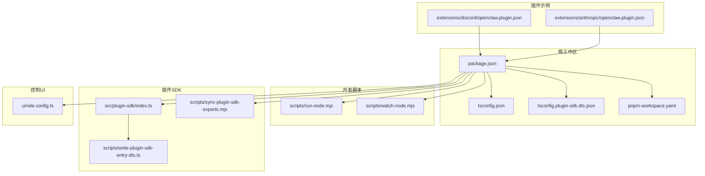
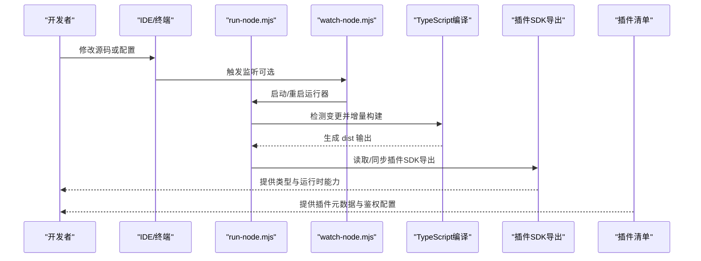
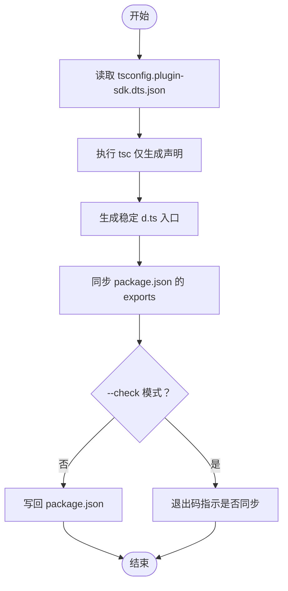
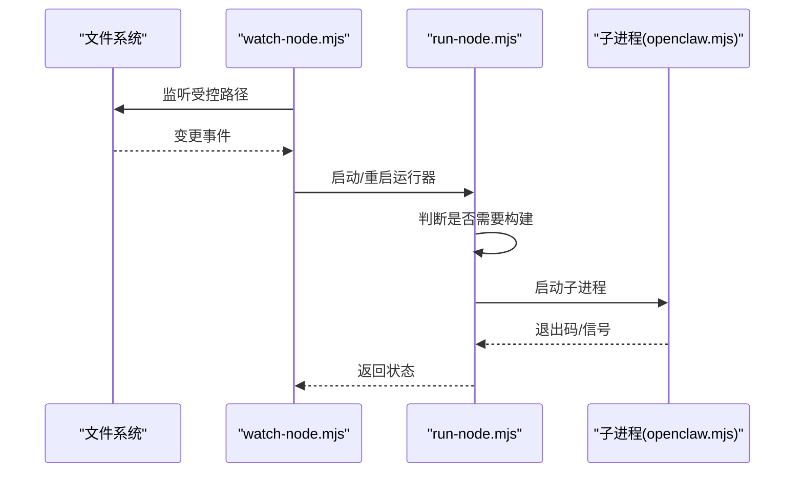
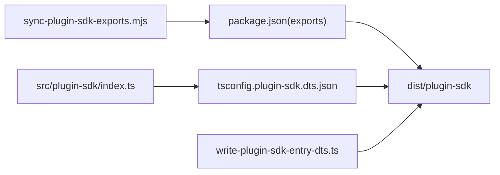

# 开发环境搭建

<cite>
**本文档引用的文件**
- [package.json](file://package.json)
- [tsconfig.json](file://tsconfig.json)
- [tsconfig.plugin-sdk.dts.json](file://tsconfig.plugin-sdk.dts.json)
- [pnpm-workspace.yaml](file://pnpm-workspace.yaml)
- [scripts/run-node.mjs](file://scripts/run-node.mjs)
- [scripts/watch-node.mjs](file://scripts/watch-node.mjs)
- [scripts/write-plugin-sdk-entry-dts.ts](file://scripts/write-plugin-sdk-entry-dts.ts)
- [scripts/sync-plugin-sdk-exports.mjs](file://scripts/sync-plugin-sdk-exports.mjs)
- [src/plugin-sdk/index.ts](file://src/plugin-sdk/index.ts)
- [extensions/discord/openclaw.plugin.json](file://extensions/discord/openclaw.plugin.json)
- [extensions/anthropic/openclaw.plugin.json](file://extensions/anthropic/openclaw.plugin.json)
- [ui/vite.config.ts](file://ui/vite.config.ts)
</cite>

## 目录
1. [简介](#简介)
2. [项目结构](#项目结构)
3. [核心组件](#核心组件)
4. [架构总览](#架构总览)
5. [详细组件分析](#详细组件分析)
6. [依赖关系分析](#依赖关系分析)
7. [性能考虑](#性能考虑)
8. [故障排除指南](#故障排除指南)
9. [结论](#结论)
10. [附录](#附录)

## 简介
本指南面向希望参与 OpenClaw 插件开发的工程师与技术作者，系统性说明从零搭建插件开发环境的完整流程，包括：
- 运行时与包管理器版本要求
- 依赖安装与工作区配置
- IDE 与调试工具配置
- 插件 SDK 安装与配置（TypeScript、构建工具、开发服务器）
- 开发环境验证步骤
- 常见问题排查
- 插件项目初始化模板与最佳实践

## 项目结构
OpenClaw 采用多包工作区（pnpm workspace）组织，核心与插件开发相关的关键目录与文件如下：
- 根级配置：package.json、tsconfig.json、tsconfig.plugin-sdk.dts.json、pnpm-workspace.yaml
- 开发运行脚本：scripts/run-node.mjs、scripts/watch-node.mjs
- 插件 SDK 入口与导出：src/plugin-sdk/index.ts、scripts/write-plugin-sdk-entry-dts.ts、scripts/sync-plugin-sdk-exports.mjs
- 插件示例清单：extensions/*/openclaw.plugin.json
- 控制界面开发服务器：ui/vite.config.ts

**图表来源**
- [package.json](file://package.json)
- [tsconfig.json](file://tsconfig.json)
- [tsconfig.plugin-sdk.dts.json](file://tsconfig.plugin-sdk.dts.json)
- [pnpm-workspace.yaml](file://pnpm-workspace.yaml)
- [scripts/run-node.mjs](file://scripts/run-node.mjs)
- [scripts/watch-node.mjs](file://scripts/watch-node.mjs)
- [src/plugin-sdk/index.ts](file://src/plugin-sdk/index.ts)
- [scripts/write-plugin-sdk-entry-dts.ts](file://scripts/write-plugin-sdk-entry-dts.ts)
- [scripts/sync-plugin-sdk-exports.mjs](file://scripts/sync-plugin-sdk-exports.mjs)
- [extensions/discord/openclaw.plugin.json](file://extensions/discord/openclaw.plugin.json)
- [extensions/anthropic/openclaw.plugin.json](file://extensions/anthropic/openclaw.plugin.json)
- [ui/vite.config.ts](file://ui/vite.config.ts)

**章节来源**
- [package.json](file://package.json)
- [tsconfig.json](file://tsconfig.json)
- [pnpm-workspace.yaml](file://pnpm-workspace.yaml)

## 核心组件
- 运行时与包管理器
  - Node.js 最低版本要求：参见 engines 字段
  - 包管理器：pnpm（版本在 package.json 中声明）
- TypeScript 编译配置
  - 根 tsconfig：严格模式、模块解析 NodeNext、目标 ES2023、路径映射等
  - 插件 SDK 声明生成：独立 tsconfig 仅输出 d.ts 并写入 dist/plugin-sdk
- 工作区与多包
  - pnpm-workspace.yaml 声明工作区范围，含根、ui、packages、extensions
- 开发运行与热重载
  - run-node.mjs：自动检测变更、增量构建、运行入口
  - watch-node.mjs：基于 chokidar 的监听器，支持重启与信号处理
- 插件 SDK 导出与类型
  - src/plugin-sdk/index.ts 汇总导出
  - write-plugin-sdk-entry-dts.ts 生成稳定 d.ts 入口
  - sync-plugin-sdk-exports.mjs 同步 package.json 的 exports 映射
- 插件清单与示例
  - extensions/*/openclaw.plugin.json 提供插件 ID、通道/提供商、鉴权变量、配置 Schema
- 控制 UI 开发服务器
  - ui/vite.config.ts 提供本地开发服务器、资源目录、构建输出与中间件

**章节来源**
- [package.json](file://package.json)
- [tsconfig.json](file://tsconfig.json)
- [tsconfig.plugin-sdk.dts.json](file://tsconfig.plugin-sdk.dts.json)
- [pnpm-workspace.yaml](file://pnpm-workspace.yaml)
- [scripts/run-node.mjs](file://scripts/run-node.mjs)
- [scripts/watch-node.mjs](file://scripts/watch-node.mjs)
- [src/plugin-sdk/index.ts](file://src/plugin-sdk/index.ts)
- [scripts/write-plugin-sdk-entry-dts.ts](file://scripts/write-plugin-sdk-entry-dts.ts)
- [scripts/sync-plugin-sdk-exports.mjs](file://scripts/sync-plugin-sdk-exports.mjs)
- [extensions/discord/openclaw.plugin.json](file://extensions/discord/openclaw.plugin.json)
- [extensions/anthropic/openclaw.plugin.json](file://extensions/anthropic/openclaw.plugin.json)
- [ui/vite.config.ts](file://ui/vite.config.ts)

## 架构总览
下图展示插件开发环境的核心交互：开发者通过 IDE/终端操作，借助 run-node/watch-node 实现热重载；TypeScript 编译与声明生成确保 SDK 类型可用；插件清单定义插件元数据；控制 UI 作为前端开发辅助。

**图表来源**
- [scripts/run-node.mjs](file://scripts/run-node.mjs)
- [scripts/watch-node.mjs](file://scripts/watch-node.mjs)
- [tsconfig.json](file://tsconfig.json)
- [tsconfig.plugin-sdk.dts.json](file://tsconfig.plugin-sdk.dts.json)
- [src/plugin-sdk/index.ts](file://src/plugin-sdk/index.ts)
- [scripts/sync-plugin-sdk-exports.mjs](file://scripts/sync-plugin-sdk-exports.mjs)
- [extensions/discord/openclaw.plugin.json](file://extensions/discord/openclaw.plugin.json)

## 详细组件分析

### 组件一：运行时与包管理器
- Node.js 版本要求
  - 在 engines 字段中声明最低版本，请以该字段为准
- 包管理器
  - 使用 pnpm，版本在 package.json 中声明
- 工作区范围
  - pnpm-workspace.yaml 声明根、ui、packages、extensions 等包范围

**章节来源**
- [package.json](file://package.json)
- [pnpm-workspace.yaml](file://pnpm-workspace.yaml)

### 组件二：TypeScript 配置与插件 SDK 声明生成
- 根 tsconfig
  - 严格模式、NodeNext 模块解析、目标 ES2023、路径映射到 src/plugin-sdk
- 插件 SDK 声明生成
  - 独立 tsconfig 仅输出 d.ts，输出到 dist/plugin-sdk
  - 写入脚本生成稳定入口 d.ts，确保 package.json 的 exports 能正确指向
- 导出同步
  - 同步脚本会扫描入口并更新 package.json 的 exports，支持 --check 模式校验一致性

**图表来源**
- [tsconfig.plugin-sdk.dts.json](file://tsconfig.plugin-sdk.dts.json)
- [scripts/write-plugin-sdk-entry-dts.ts](file://scripts/write-plugin-sdk-entry-dts.ts)
- [scripts/sync-plugin-sdk-exports.mjs](file://scripts/sync-plugin-sdk-exports.mjs)
- [package.json](file://package.json)

**章节来源**
- [tsconfig.json](file://tsconfig.json)
- [tsconfig.plugin-sdk.dts.json](file://tsconfig.plugin-sdk.dts.json)
- [scripts/write-plugin-sdk-entry-dts.ts](file://scripts/write-plugin-sdk-entry-dts.ts)
- [scripts/sync-plugin-sdk-exports.mjs](file://scripts/sync-plugin-sdk-exports.mjs)
- [package.json](file://package.json)

### 组件三：开发运行与热重载
- run-node.mjs
  - 自动检测源码变更、增量构建、运行入口 openclaw.mjs
  - 支持忽略测试文件、扩展元数据文件触发重启
- watch-node.mjs
  - 基于 chokidar 监听受控路径，支持 SIGTERM 重启、SIGINT/SIGTERM 优雅退出
  - 将 OPENCLAW_WATCH_MODE 等环境变量传递给子进程

**图表来源**
- [scripts/watch-node.mjs](file://scripts/watch-node.mjs)
- [scripts/run-node.mjs](file://scripts/run-node.mjs)

**章节来源**
- [scripts/run-node.mjs](file://scripts/run-node.mjs)
- [scripts/watch-node.mjs](file://scripts/watch-node.mjs)

### 组件四：插件清单与示例
- 清单字段
  - id：插件唯一标识
  - channels/providers：支持的通道/提供商列表
  - providerAuthEnvVars：提供商鉴权所需环境变量
  - configSchema：插件配置 Schema（JSON Schema）
- 示例清单
  - Discord、Anthropic 等插件提供标准参考

**章节来源**
- [extensions/discord/openclaw.plugin.json](file://extensions/discord/openclaw.plugin.json)
- [extensions/anthropic/openclaw.plugin.json](file://extensions/anthropic/openclaw.plugin.json)

### 组件五：控制 UI 开发服务器
- 本地开发服务器
  - Vite 配置提供 host: true、port: 5173、strictPort: true
  - 中间件提供控制 UI 配置占位响应，便于前端联调
- 构建输出
  - 输出到 dist/control-ui，启用 sourcemap

**章节来源**
- [ui/vite.config.ts](file://ui/vite.config.ts)

## 依赖关系分析
- 依赖安装与工作区
  - 使用 pnpm 安装根依赖与工作区内各包
  - pnpm-workspace.yaml 声明工作区范围，确保跨包引用与构建一致性
- 插件 SDK 与导出
  - package.json 的 exports 映射指向 dist/plugin-sdk 下的各入口
  - write-plugin-sdk-entry-dts.ts 与 sync-plugin-sdk-exports.mjs 协同保证导出稳定

**图表来源**
- [package.json](file://package.json)
- [src/plugin-sdk/index.ts](file://src/plugin-sdk/index.ts)
- [tsconfig.plugin-sdk.dts.json](file://tsconfig.plugin-sdk.dts.json)
- [scripts/write-plugin-sdk-entry-dts.ts](file://scripts/write-plugin-sdk-entry-dts.ts)
- [scripts/sync-plugin-sdk-exports.mjs](file://scripts/sync-plugin-sdk-exports.mjs)

**章节来源**
- [package.json](file://package.json)
- [pnpm-workspace.yaml](file://pnpm-workspace.yaml)
- [src/plugin-sdk/index.ts](file://src/plugin-sdk/index.ts)
- [tsconfig.plugin-sdk.dts.json](file://tsconfig.plugin-sdk.dts.json)
- [scripts/write-plugin-sdk-entry-dts.ts](file://scripts/write-plugin-sdk-entry-dts.ts)
- [scripts/sync-plugin-sdk-exports.mjs](file://scripts/sync-plugin-sdk-exports.mjs)

## 性能考虑
- 构建与缓存
  - run-node.mjs 基于时间戳与 Git HEAD 判定是否需要重建，避免不必要的全量构建
  - dist/.buildstamp 记录构建时间与 Git HEAD，用于增量判断
- 依赖优化
  - pnpm-workspace.yaml 中 onlyBuiltDependencies 列表减少非必要二进制依赖的安装成本
- UI 构建
  - ui/vite.config.ts 设置 chunkSizeWarningLimit，平衡打包体积与 CI 日志可读性

**章节来源**
- [scripts/run-node.mjs](file://scripts/run-node.mjs)
- [pnpm-workspace.yaml](file://pnpm-workspace.yaml)
- [ui/vite.config.ts](file://ui/vite.config.ts)

## 故障排除指南
- Node.js 版本不满足要求
  - 现象：安装或运行时报错
  - 处理：升级 Node.js 至 engines 指定的最低版本以上
- pnpm 版本或工作区异常
  - 现象：安装失败、包解析错误
  - 处理：确认 pnpm 版本与 package.json 声明一致；清理 node_modules 并重新安装
- 插件 SDK 导出不同步
  - 现象：IDE 无法解析插件 SDK 类型或运行时报找不到导出
  - 处理：执行导出同步脚本；使用 --check 模式检查差异
- 热重载未生效
  - 现象：修改源码后未触发重启
  - 处理：确认监听路径包含变更文件；检查 OPENCLAW_WATCH_MODE 环境变量；查看 watch-node.mjs 的日志输出
- 控制 UI 无法访问或端口占用
  - 现象：浏览器无法打开本地开发服务器
  - 处理：确认端口 5173 未被占用；检查 ui/vite.config.ts 的 server.host/port 配置

**章节来源**
- [package.json](file://package.json)
- [scripts/sync-plugin-sdk-exports.mjs](file://scripts/sync-plugin-sdk-exports.mjs)
- [scripts/watch-node.mjs](file://scripts/watch-node.mjs)
- [ui/vite.config.ts](file://ui/vite.config.ts)

## 结论
通过遵循本指南，您可以快速搭建 OpenClaw 插件开发环境：满足 Node.js 与 pnpm 版本要求，完成依赖安装与工作区配置，使用 run-node/watch-node 实现高效开发与热重载，配合 TypeScript 与插件 SDK 声明生成确保类型安全，并利用插件清单与控制 UI 辅助调试。遇到问题时，可依据故障排除章节进行定位与修复。

## 附录

### A. 插件开发环境搭建步骤
- 环境准备
  - 安装 Node.js（满足 engines 要求）
  - 安装 pnpm（版本与 package.json 声明一致）
- 仓库克隆与安装
  - 克隆仓库并进入根目录
  - 执行 pnpm install 安装依赖
- 启动开发服务器
  - 使用 run-node.mjs 或 watch-node.mjs 启动开发服务
  - 如需 UI 开发，可单独运行 ui 子包的开发脚本
- 验证 SDK 与导出
  - 执行插件 SDK 导出同步脚本，确保 exports 与入口一致
  - 使用 --check 模式验证导出一致性

**章节来源**
- [package.json](file://package.json)
- [scripts/run-node.mjs](file://scripts/run-node.mjs)
- [scripts/watch-node.mjs](file://scripts/watch-node.mjs)
- [scripts/sync-plugin-sdk-exports.mjs](file://scripts/sync-plugin-sdk-exports.mjs)

### B. 插件项目初始化模板（清单字段）
- 必填字段
  - id：插件唯一标识
  - channels/providers：支持的通道/提供商列表
- 可选字段
  - providerAuthEnvVars：提供商鉴权所需环境变量数组
  - configSchema：插件配置 Schema（JSON Schema）

**章节来源**
- [extensions/discord/openclaw.plugin.json](file://extensions/discord/openclaw.plugin.json)
- [extensions/anthropic/openclaw.plugin.json](file://extensions/anthropic/openclaw.plugin.json)

### C. 最佳实践建议
- 使用 watch-node.mjs 进行热重载开发，提升迭代效率
- 保持插件清单中的 configSchema 与实际配置一致，便于类型校验
- 在导出同步脚本执行后，提交 package.json 的变更以确保团队一致性
- 对于 UI 相关开发，优先使用 ui/vite.config.ts 提供的本地服务器与中间件

**章节来源**
- [scripts/watch-node.mjs](file://scripts/watch-node.mjs)
- [scripts/sync-plugin-sdk-exports.mjs](file://scripts/sync-plugin-sdk-exports.mjs)
- [ui/vite.config.ts](file://ui/vite.config.ts)