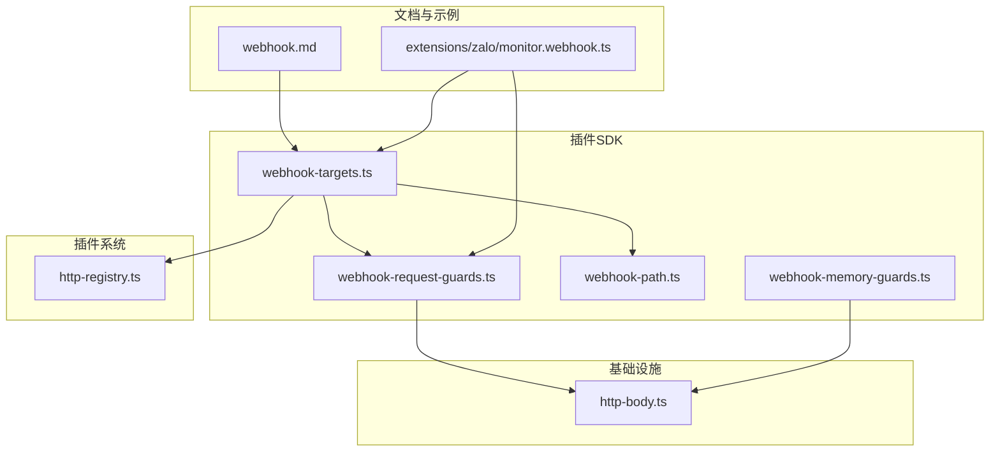
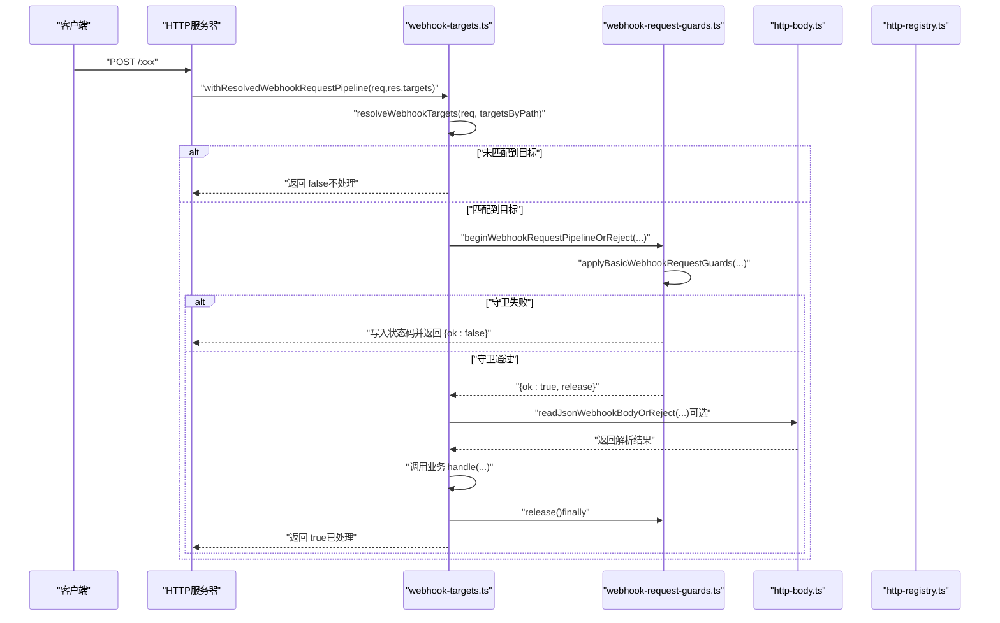
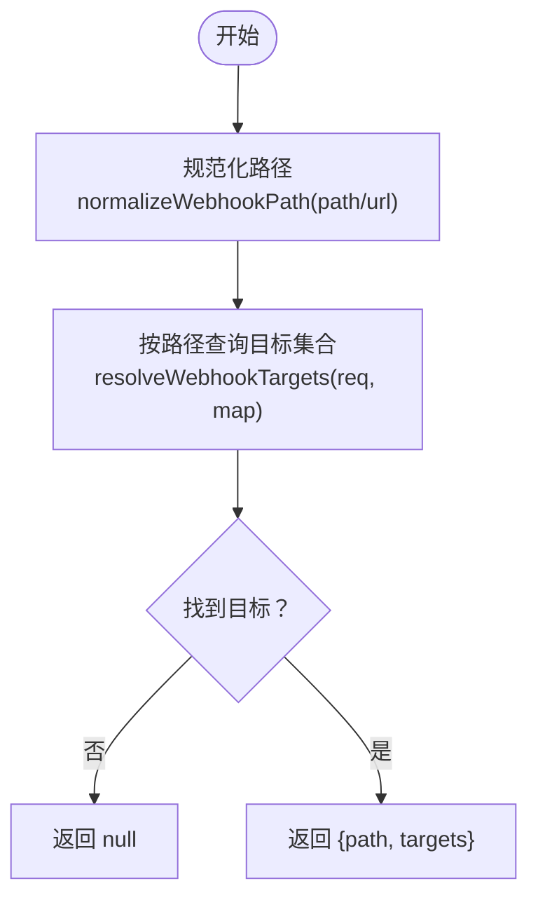
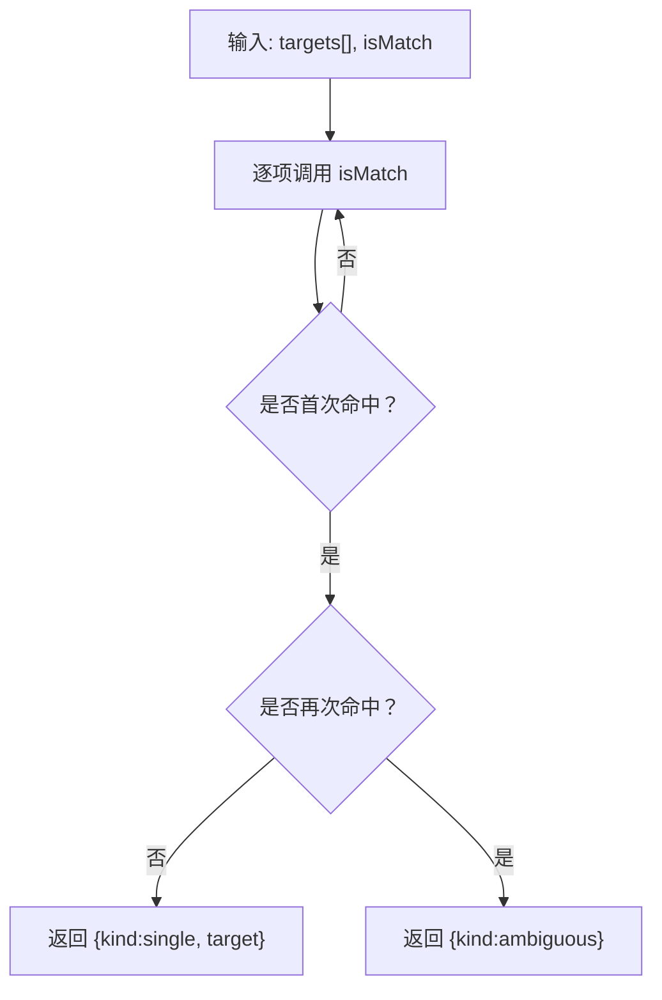
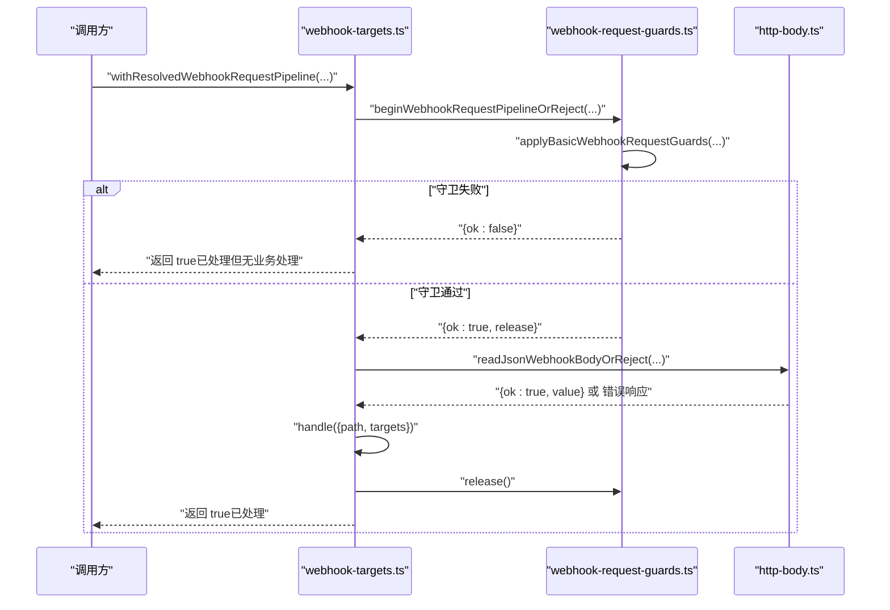
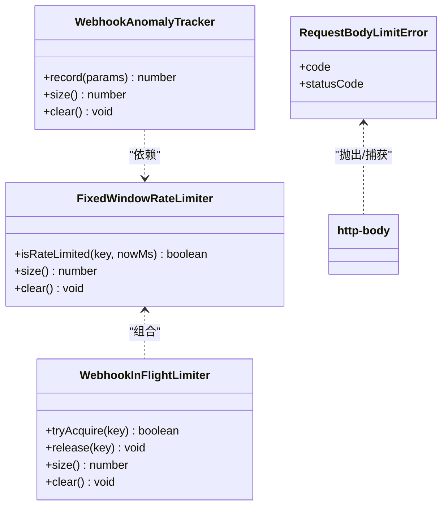
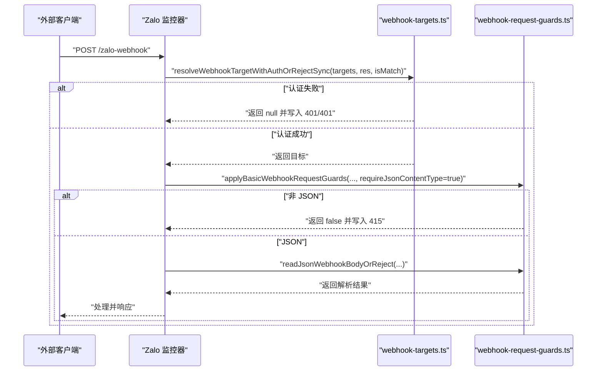
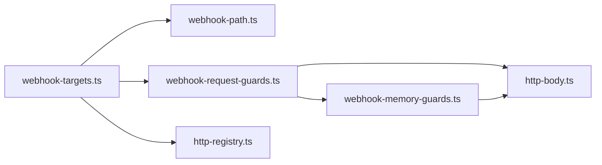

# Webhook 工具

<cite>
**本文引用的文件**
- [webhook-targets.ts](file://src/plugin-sdk/webhook-targets.ts)
- [webhook-request-guards.ts](file://src/plugin-sdk/webhook-request-guards.ts)
- [webhook-path.ts](file://src/plugin-sdk/webhook-path.ts)
- [webhook-memory-guards.ts](file://src/plugin-sdk/webhook-memory-guards.ts)
- [http-body.ts](file://src/infra/http-body.ts)
- [http-registry.ts](file://src/plugins/http-registry.ts)
- [webhook-targets.test.ts](file://src/plugin-sdk/webhook-targets.test.ts)
- [webhook-request-guards.test.ts](file://src/plugin-sdk/webhook-request-guards.test.ts)
- [webhook-memory-guards.test.ts](file://src/plugin-sdk/webhook-memory-guards.test.ts)
- [webhook.md](file://docs/automation/webhook.md)
- [monitor.webhook.ts](file://extensions/zalo/src/monitor.webhook.ts)
</cite>

## 目录
1. [简介](#简介)
2. [项目结构](#项目结构)
3. [核心组件](#核心组件)
4. [架构总览](#架构总览)
5. [详细组件分析](#详细组件分析)
6. [依赖关系分析](#依赖关系分析)
7. [性能考量](#性能考量)
8. [故障排查指南](#故障排查指南)
9. [结论](#结论)
10. [附录](#附录)

## 简介
本文件系统性梳理 OpenClaw 插件 SDK 中的 Webhook 工具函数，覆盖 Webhook 目标注册、路径解析、请求处理与安全防护等能力。重点包括：
- registerWebhookTarget：注册 Webhook 目标并自动管理插件路由生命周期
- resolveWebhookTargets：根据请求解析目标集合
- withResolvedWebhookRequestPipeline：统一的请求管道（方法校验、速率限制、并发限制、请求体读取）
- applyBasicWebhookRequestGuards：基础请求守卫（方法、速率、媒体类型）
- resolveWebhookTargetWithAuthOrReject/Sync：基于认证条件解析单目标
- 路径规范化与解析：normalizeWebhookPath、resolveWebhookPath
- 内存保护与安全：固定窗口限流、并发限制、异常计数追踪、请求体读取限制

## 项目结构
围绕 Webhook 的核心文件组织如下：
- plugin-sdk 层：webhook-targets.ts、webhook-request-guards.ts、webhook-path.ts、webhook-memory-guards.ts
- infra 层：http-body.ts（请求体读取与错误模型）
- plugins 层：http-registry.ts（插件 HTTP 路由注册）
- 文档与示例：docs/automation/webhook.md、extensions/*/monitor.webhook.ts

图表来源
- [webhook-targets.ts:1-282](file://src/plugin-sdk/webhook-targets.ts#L1-L282)
- [webhook-request-guards.ts:1-291](file://src/plugin-sdk/webhook-request-guards.ts#L1-L291)
- [webhook-path.ts:1-32](file://src/plugin-sdk/webhook-path.ts#L1-L32)
- [webhook-memory-guards.ts:1-197](file://src/plugin-sdk/webhook-memory-guards.ts#L1-L197)
- [http-body.ts:1-379](file://src/infra/http-body.ts#L1-L379)
- [http-registry.ts:1-93](file://src/plugins/http-registry.ts#L1-L93)
- [webhook.md:1-216](file://docs/automation/webhook.md#L1-L216)
- [monitor.webhook.ts:175-209](file://extensions/zalo/src/monitor.webhook.ts#L175-L209)

章节来源
- [webhook-targets.ts:1-282](file://src/plugin-sdk/webhook-targets.ts#L1-L282)
- [webhook-request-guards.ts:1-291](file://src/plugin-sdk/webhook-request-guards.ts#L1-L291)
- [webhook-path.ts:1-32](file://src/plugin-sdk/webhook-path.ts#L1-L32)
- [webhook-memory-guards.ts:1-197](file://src/plugin-sdk/webhook-memory-guards.ts#L1-L197)
- [http-body.ts:1-379](file://src/infra/http-body.ts#L1-L379)
- [http-registry.ts:1-93](file://src/plugins/http-registry.ts#L1-L93)
- [webhook.md:1-216](file://docs/automation/webhook.md#L1-L216)
- [monitor.webhook.ts:175-209](file://extensions/zalo/src/monitor.webhook.ts#L175-L209)

## 核心组件
- Webhook 目标注册与生命周期
  - registerWebhookTarget：标准化路径、登记目标、在首个目标时注册插件路由、在最后一个目标移除时清理
  - registerWebhookTargetWithPluginRoute：便捷包装，直接复用插件路由注册
- 路径解析与匹配
  - normalizeWebhookPath：路径规范化（去空白、补前缀斜杠、去末尾斜杠）
  - resolveWebhookPath：从路径或 URL 解析 Webhook 路径
  - resolveWebhookTargets：解析请求对应的路径与目标集合
  - resolveSingleWebhookTarget / Async：按条件查找唯一目标，支持歧义检测
  - resolveWebhookTargetWithAuthOrReject / Sync：认证通过后返回目标，否则写入相应状态码与消息
- 请求处理管道
  - withResolvedWebhookRequestPipeline：统一入口，负责路径解析、基础守卫、速率/并发限制、请求体读取、调用业务处理器
  - applyBasicWebhookRequestGuards：方法白名单、速率限制、JSON 媒体类型要求
  - beginWebhookRequestPipelineOrReject：整合守卫与并发限制，返回 release 钩子
  - readWebhookBodyOrReject / readJsonWebhookBodyOrReject：带配额的请求体读取
- 安全与内存保护
  - createFixedWindowRateLimiter：固定窗口限流器
  - createWebhookInFlightLimiter：并发请求数限制
  - createWebhookAnomalyTracker：异常状态码计数与日志
  - RequestBodyLimitError 及读取工具：超大/超时/连接关闭的统一处理

章节来源
- [webhook-targets.ts:57-100](file://src/plugin-sdk/webhook-targets.ts#L57-L100)
- [webhook-targets.ts:102-113](file://src/plugin-sdk/webhook-targets.ts#L102-L113)
- [webhook-targets.ts:186-248](file://src/plugin-sdk/webhook-targets.ts#L186-L248)
- [webhook-request-guards.ts:139-227](file://src/plugin-sdk/webhook-request-guards.ts#L139-L227)
- [webhook-request-guards.ts:229-290](file://src/plugin-sdk/webhook-request-guards.ts#L229-L290)
- [webhook-memory-guards.ts:51-104](file://src/plugin-sdk/webhook-memory-guards.ts#L51-L104)
- [webhook-memory-guards.ts:84-128](file://src/plugin-sdk/webhook-memory-guards.ts#L84-L128)
- [webhook-memory-guards.ts:164-196](file://src/plugin-sdk/webhook-memory-guards.ts#L164-L196)
- [http-body.ts:34-61](file://src/infra/http-body.ts#L34-L61)
- [http-body.ts:121-257](file://src/infra/http-body.ts#L121-L257)

## 架构总览
下图展示一次 Webhook 请求从到达至处理完成的关键步骤与模块交互。

图表来源
- [webhook-targets.ts:115-162](file://src/plugin-sdk/webhook-targets.ts#L115-L162)
- [webhook-request-guards.ts:179-227](file://src/plugin-sdk/webhook-request-guards.ts#L179-L227)
- [http-body.ts:225-257](file://src/infra/http-body.ts#L225-L257)

## 详细组件分析

### 组件A：Webhook 目标注册与路径解析
- registerWebhookTarget
  - 规范化路径并登记目标
  - 首个目标时执行 onFirstPathTarget（通常用于注册插件路由），最后一个目标移除时执行 onLastPathTargetRemoved 并调用 teardown
  - 返回可注销句柄，支持重复注销幂等
- registerWebhookTargetWithPluginRoute
  - 在首个目标时通过 registerPluginHttpRoute 注册插件路由；最后一个目标移除时自动清理
- resolveWebhookTargets
  - 解析请求 URL 的规范化路径，返回该路径下的所有目标
- normalizeWebhookPath / resolveWebhookPath
  - 规范化路径格式，支持从路径或 URL 提取路径

图表来源
- [webhook-path.ts:1-32](file://src/plugin-sdk/webhook-path.ts#L1-L32)
- [webhook-targets.ts:102-113](file://src/plugin-sdk/webhook-targets.ts#L102-L113)

章节来源
- [webhook-targets.ts:57-100](file://src/plugin-sdk/webhook-targets.ts#L57-L100)
- [webhook-targets.ts:102-113](file://src/plugin-sdk/webhook-targets.ts#L102-L113)
- [webhook-path.ts:1-32](file://src/plugin-sdk/webhook-path.ts#L1-L32)
- [http-registry.ts:12-92](file://src/plugins/http-registry.ts#L12-L92)

### 组件B：认证与目标解析
- resolveSingleWebhookTarget / Async
  - 顺序遍历目标，按 isMatch 判定；若出现第二匹配则判定为“歧义”
- resolveWebhookTargetWithAuthOrReject / Sync
  - 先解析目标，再根据结果写入 401/401（歧义）或返回目标
  - 支持同步与异步 isMatch

图表来源
- [webhook-targets.ts:186-220](file://src/plugin-sdk/webhook-targets.ts#L186-L220)
- [webhook-targets.ts:222-248](file://src/plugin-sdk/webhook-targets.ts#L222-L248)

章节来源
- [webhook-targets.ts:164-248](file://src/plugin-sdk/webhook-targets.ts#L164-L248)
- [webhook-targets.test.ts:251-290](file://src/plugin-sdk/webhook-targets.test.ts#L251-L290)
- [webhook-targets.test.ts:292-359](file://src/plugin-sdk/webhook-targets.test.ts#L292-L359)

### 组件C：请求处理管道与安全守卫
- withResolvedWebhookRequestPipeline
  - 解析路径与目标
  - 计算 inFlightKey（默认基于路径+远端地址）
  - 调用 beginWebhookRequestPipelineOrReject 执行守卫与并发限制
  - 调用 handle 并在 finally 释放并发槽
- applyBasicWebhookRequestGuards
  - 方法白名单校验
  - 固定窗口限流（可选）
  - JSON 媒体类型要求（可选）
- beginWebhookRequestPipelineOrReject
  - 整合守卫与并发限制，返回 release 钩子
- readWebhookBodyOrReject / readJsonWebhookBodyOrReject
  - 基于配置的字节上限与超时读取请求体
  - 统一错误响应（413/408/400）

图表来源
- [webhook-targets.ts:115-162](file://src/plugin-sdk/webhook-targets.ts#L115-L162)
- [webhook-request-guards.ts:179-227](file://src/plugin-sdk/webhook-request-guards.ts#L179-L227)
- [webhook-request-guards.ts:229-290](file://src/plugin-sdk/webhook-request-guards.ts#L229-L290)
- [http-body.ts:225-257](file://src/infra/http-body.ts#L225-L257)

章节来源
- [webhook-targets.ts:115-162](file://src/plugin-sdk/webhook-targets.ts#L115-L162)
- [webhook-request-guards.ts:139-227](file://src/plugin-sdk/webhook-request-guards.ts#L139-L227)
- [webhook-request-guards.test.ts:75-120](file://src/plugin-sdk/webhook-request-guards.test.ts#L75-L120)

### 组件D：内存保护与安全机制
- createFixedWindowRateLimiter
  - 固定时间窗内统计请求数，超过阈值即限流
  - 支持最大键数与修剪间隔
- createWebhookInFlightLimiter
  - 按 key 控制并发请求数，防止过载
- createWebhookAnomalyTracker
  - 对指定状态码进行计数与周期性日志输出
- RequestBodyLimitError 与读取工具
  - 统一处理超大、超时、连接关闭三类错误，避免进程崩溃

图表来源
- [webhook-memory-guards.ts:51-104](file://src/plugin-sdk/webhook-memory-guards.ts#L51-L104)
- [webhook-memory-guards.ts:84-128](file://src/plugin-sdk/webhook-memory-guards.ts#L84-L128)
- [webhook-memory-guards.ts:164-196](file://src/plugin-sdk/webhook-memory-guards.ts#L164-L196)
- [http-body.ts:34-61](file://src/infra/http-body.ts#L34-L61)

章节来源
- [webhook-memory-guards.ts:25-104](file://src/plugin-sdk/webhook-memory-guards.ts#L25-L104)
- [webhook-memory-guards.ts:164-196](file://src/plugin-sdk/webhook-memory-guards.ts#L164-L196)
- [webhook-memory-guards.test.ts:10-153](file://src/plugin-sdk/webhook-memory-guards.test.ts#L10-L153)
- [http-body.ts:34-61](file://src/infra/http-body.ts#L34-L61)

### 组件E：实际使用示例（Zalo 插件）
- 使用 resolveWebhookTargetWithAuthOrRejectSync 进行密钥认证
- 使用 applyBasicWebhookRequestGuards 强制 JSON 媒体类型
- 使用 readJsonWebhookBodyOrReject 读取并校验 JSON 负载
- 记录状态码以配合异常追踪

图表来源
- [monitor.webhook.ts:175-209](file://extensions/zalo/src/monitor.webhook.ts#L175-L209)
- [webhook-targets.ts:237-248](file://src/plugin-sdk/webhook-targets.ts#L237-L248)
- [webhook-request-guards.ts:139-177](file://src/plugin-sdk/webhook-request-guards.ts#L139-L177)
- [webhook-request-guards.ts:263-290](file://src/plugin-sdk/webhook-request-guards.ts#L263-L290)

章节来源
- [monitor.webhook.ts:175-209](file://extensions/zalo/src/monitor.webhook.ts#L175-L209)

## 依赖关系分析
- 模块耦合
  - webhook-targets.ts 依赖 webhook-path.ts（路径规范化）、webhook-request-guards.ts（请求管道）、http-registry.ts（插件路由）
  - webhook-request-guards.ts 依赖 http-body.ts（请求体读取与错误模型）、webhook-memory-guards.ts（限流/并发）
  - webhook-memory-guards.ts 依赖 infra/map-size.ts（键数修剪）
- 外部集成点
  - 插件路由注册：registerPluginHttpRoute
  - 请求体读取：readJsonBodyWithLimit/readRequestBodyWithLimit
  - 固定窗口限流：createFixedWindowRateLimiter
  - 并发限制：createWebhookInFlightLimiter

图表来源
- [webhook-targets.ts:1-9](file://src/plugin-sdk/webhook-targets.ts#L1-L9)
- [webhook-request-guards.ts:1-10](file://src/plugin-sdk/webhook-request-guards.ts#L1-L10)
- [webhook-memory-guards.ts:1-2](file://src/plugin-sdk/webhook-memory-guards.ts#L1-L2)
- [http-body.ts:1-5](file://src/infra/http-body.ts#L1-L5)
- [http-registry.ts:1-6](file://src/plugins/http-registry.ts#L1-L6)

章节来源
- [webhook-targets.ts:1-9](file://src/plugin-sdk/webhook-targets.ts#L1-L9)
- [webhook-request-guards.ts:1-10](file://src/plugin-sdk/webhook-request-guards.ts#L1-L10)
- [webhook-memory-guards.ts:1-2](file://src/plugin-sdk/webhook-memory-guards.ts#L1-L2)
- [http-body.ts:1-5](file://src/infra/http-body.ts#L1-L5)
- [http-registry.ts:1-6](file://src/plugins/http-registry.ts#L1-L6)

## 性能考量
- 路径规范化与映射
  - normalizeWebhookPath 与 resolveWebhookTargets 仅做 O(n) 遍历（n 为目标数量），复杂度低
- 限流与并发
  - 固定窗口限流与并发限制均使用 Map 存储状态，支持最大键数修剪，避免内存膨胀
  - 默认并发限制与最大跟踪键数可配置，建议结合部署规模调整
- 请求体读取
  - 采用分片累积与超时控制，避免阻塞与内存占用过高
- 日志与异常追踪
  - createWebhookAnomalyTracker 支持周期性日志输出，便于发现异常模式

## 故障排查指南
- 405 Method Not Allowed
  - 使用 rejectNonPostWebhookRequest 或 applyBasicWebhookRequestGuards 的 allowMethods 校验
- 413 Payload Too Large / 408 Request Timeout / 400 Connection Closed
  - 由 readRequestBodyWithLimit 抛出 RequestBodyLimitError，统一转换为对应状态码
- 415 Unsupported Media Type
  - applyBasicWebhookRequestGuards 在 requireJsonContentType=true 时强制 JSON 媒体类型
- 429 Too Many Requests
  - beginWebhookRequestPipelineOrReject 检查并发限制；applyBasicWebhookRequestGuards 检查固定窗口限流
- 401 Unauthorized / 401 Ambiguous
  - resolveWebhookTargetWithAuthOrReject / Sync 在无匹配或多匹配时写入相应状态码与消息
- 并发槽未释放
  - withResolvedWebhookRequestPipeline 在 finally 中调用 release，确保异常场景也能释放

章节来源
- [webhook-targets.ts:273-282](file://src/plugin-sdk/webhook-targets.ts#L273-L282)
- [webhook-request-guards.ts:139-177](file://src/plugin-sdk/webhook-request-guards.ts#L139-L177)
- [webhook-request-guards.ts:179-227](file://src/plugin-sdk/webhook-request-guards.ts#L179-L227)
- [webhook-request-guards.ts:229-290](file://src/plugin-sdk/webhook-request-guards.ts#L229-L290)
- [http-body.ts:34-61](file://src/infra/http-body.ts#L34-L61)
- [webhook-targets.test.ts:232-249](file://src/plugin-sdk/webhook-targets.test.ts#L232-L249)
- [webhook-request-guards.test.ts:75-120](file://src/plugin-sdk/webhook-request-guards.test.ts#L75-L120)

## 结论
OpenClaw 的 Webhook 工具链提供了从路径解析、目标认证、请求守卫到并发与内存保护的完整能力。通过统一的管道与可配置的安全策略，既能满足灵活的外部系统接入需求，又能有效抵御滥用与资源耗尽风险。建议在生产环境中：
- 明确路径规范与认证策略（如 JSON 强制、密钥校验）
- 合理设置限流与并发参数
- 使用异常追踪与日志记录辅助监控

## 附录
- Webhook 文档参考：[Webhooks:1-216](file://docs/automation/webhook.md#L1-L216)
- 示例实现参考：[Zalo 监控器:175-209](file://extensions/zalo/src/monitor.webhook.ts#L175-L209)