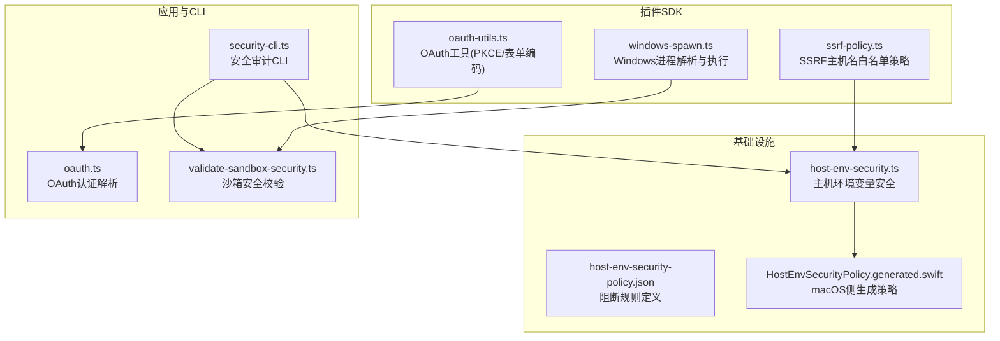
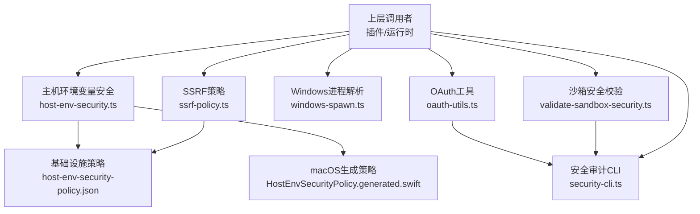
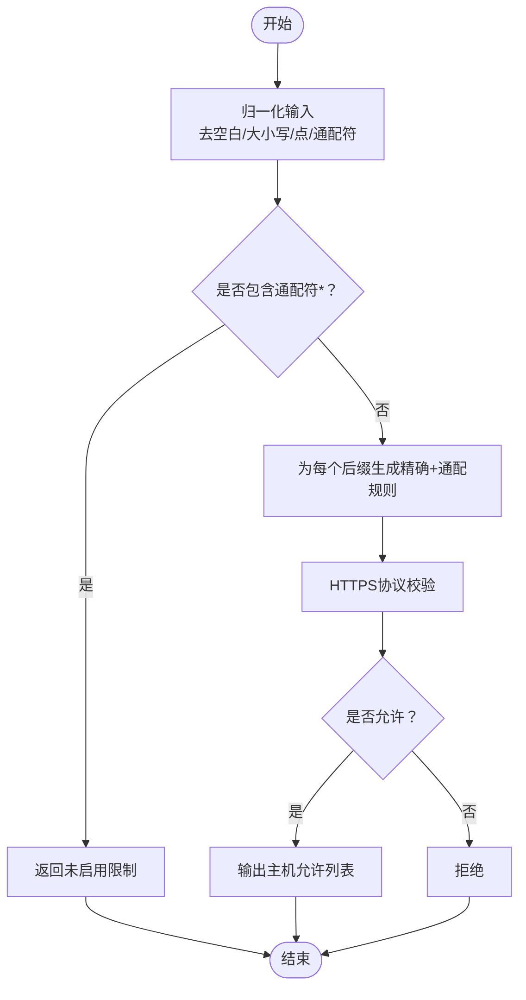
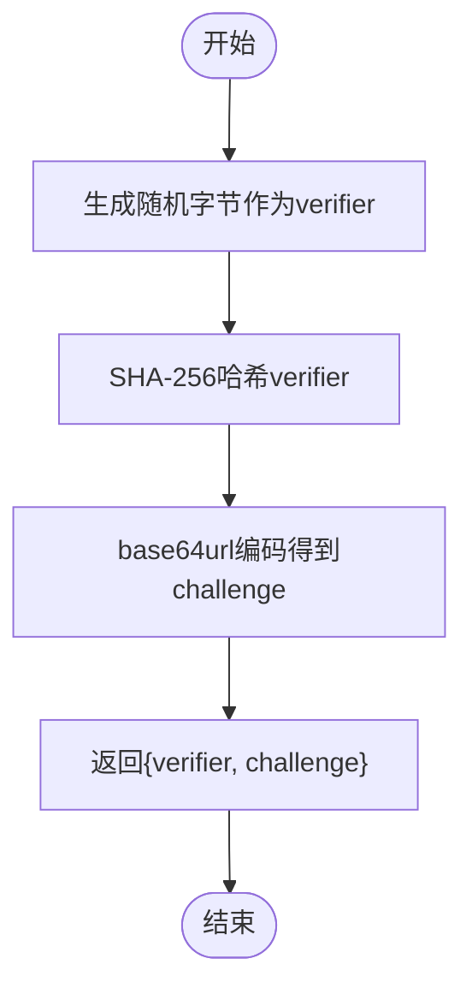
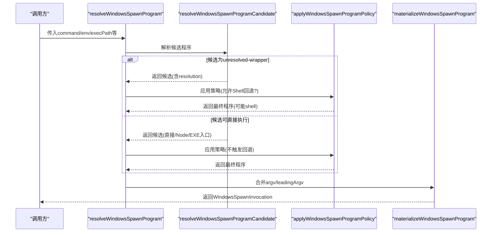
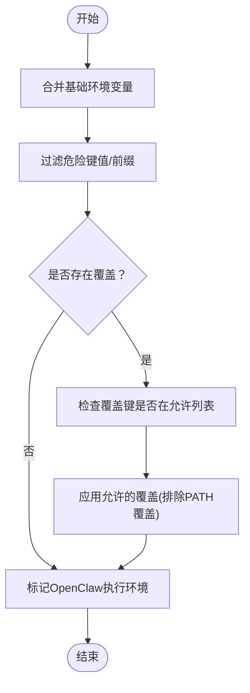
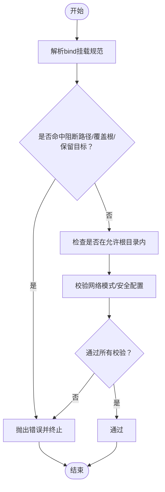
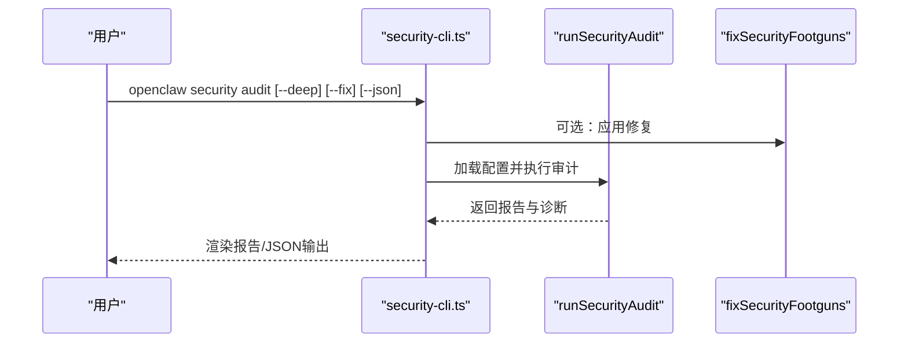
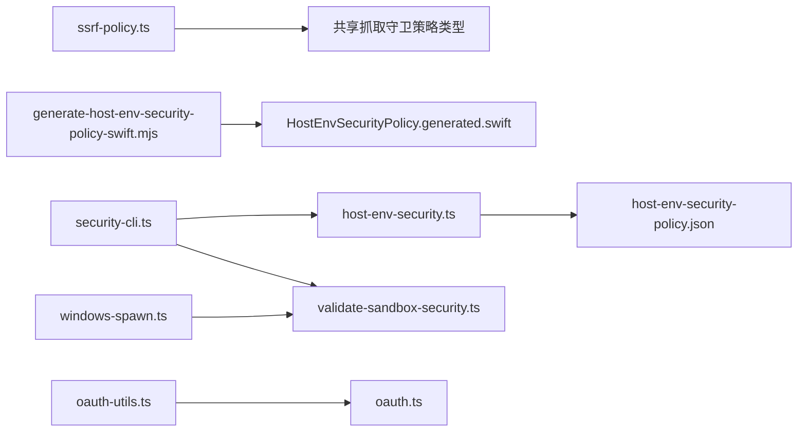

# 安全工具

<cite>
**本文引用的文件**
- [src/plugin-sdk/ssrf-policy.ts](file://src/plugin-sdk/ssrf-policy.ts)
- [src/plugin-sdk/ssrf-policy.test.ts](file://src/plugin-sdk/ssrf-policy.test.ts)
- [src/plugin-sdk/oauth-utils.ts](file://src/plugin-sdk/oauth-utils.ts)
- [src/plugin-sdk/windows-spawn.ts](file://src/plugin-sdk/windows-spawn.ts)
- [src/infra/host-env-security.ts](file://src/infra/host-env-security.ts)
- [src/infra/host-env-security-policy.json](file://src/infra/host-env-security-policy.json)
- [apps/macos/Sources/OpenClaw/HostEnvSecurityPolicy.generated.swift](file://apps/macos/Sources/OpenClaw/HostEnvSecurityPolicy.generated.swift)
- [scripts/generate-host-env-security-policy-swift.mjs](file://scripts/generate-host-env-security-policy-swift.mjs)
- [src/agents/auth-profiles/oauth.ts](file://src/agents/auth-profiles/oauth.ts)
- [src/agents/sandbox/validate-sandbox-security.ts](file://src/agents/sandbox/validate-sandbox-security.ts)
- [src/cli/security-cli.ts](file://src/cli/security-cli.ts)
</cite>

## 目录
1. [简介](#简介)
2. [项目结构](#项目结构)
3. [核心组件](#核心组件)
4. [架构总览](#架构总览)
5. [详细组件分析](#详细组件分析)
6. [依赖关系分析](#依赖关系分析)
7. [性能考量](#性能考量)
8. [故障排查指南](#故障排查指南)
9. [结论](#结论)
10. [附录](#附录)

## 简介
本文件聚焦于仓库中的安全相关工具函数与策略，覆盖以下主题：
- SSRF 防护：基于主机名后缀白名单构建主机允许列表策略，HTTPS 强制校验与 URL 合法性判断。
- OAuth 工具：表单编码与 PKCE（Proof Key for Code Exchange）挑战生成，用于增强授权流程安全性。
- Windows 进程安全：解析并规范化 Windows 可执行程序路径，选择 Node 或原生入口点，必要时回退到 Shell 执行，并统一产出可执行调用参数。
- 主机环境变量安全：定义阻断键值与前缀、覆盖键值与前缀，以及 Shell 包装器允许的覆盖键集合；提供环境变量清理与标记。
- 沙箱安全校验：禁止挂载系统敏感路径、保留容器目标路径、网络模式限制与安全配置文件校验。
- 安全审计 CLI：提供本地安全审计命令，支持深度探测、修复建议与机器可读输出。

## 项目结构
围绕安全工具的相关文件分布如下：
- 插件 SDK 层：SSRF 策略、OAuth 工具、Windows 进程解析与执行。
- 基础设施层：主机环境变量安全策略与实现。
- 应用层：macOS 平台生成的安全策略 Swift 枚举。
- 聚合与 CLI：OAuth 认证解析、沙箱安全校验、安全审计 CLI。

图表来源
- [src/plugin-sdk/ssrf-policy.ts:1-85](file://src/plugin-sdk/ssrf-policy.ts#L1-L85)
- [src/plugin-sdk/oauth-utils.ts:1-14](file://src/plugin-sdk/oauth-utils.ts#L1-L14)
- [src/plugin-sdk/windows-spawn.ts:1-300](file://src/plugin-sdk/windows-spawn.ts#L1-L300)
- [src/infra/host-env-security.ts:1-157](file://src/infra/host-env-security.ts#L1-L157)
- [src/infra/host-env-security-policy.json:1-52](file://src/infra/host-env-security-policy.json#L1-L52)
- [apps/macos/Sources/OpenClaw/HostEnvSecurityPolicy.generated.swift:1-67](file://apps/macos/Sources/OpenClaw/HostEnvSecurityPolicy.generated.swift#L1-L67)
- [src/agents/auth-profiles/oauth.ts:1-492](file://src/agents/auth-profiles/oauth.ts#L1-L492)
- [src/agents/sandbox/validate-sandbox-security.ts:1-344](file://src/agents/sandbox/validate-sandbox-security.ts#L1-L344)
- [src/cli/security-cli.ts:1-200](file://src/cli/security-cli.ts#L1-L200)

章节来源
- [src/plugin-sdk/ssrf-policy.ts:1-85](file://src/plugin-sdk/ssrf-policy.ts#L1-L85)
- [src/plugin-sdk/oauth-utils.ts:1-14](file://src/plugin-sdk/oauth-utils.ts#L1-L14)
- [src/plugin-sdk/windows-spawn.ts:1-300](file://src/plugin-sdk/windows-spawn.ts#L1-L300)
- [src/infra/host-env-security.ts:1-157](file://src/infra/host-env-security.ts#L1-L157)
- [src/infra/host-env-security-policy.json:1-52](file://src/infra/host-env-security-policy.json#L1-L52)
- [apps/macos/Sources/OpenClaw/HostEnvSecurityPolicy.generated.swift:1-67](file://apps/macos/Sources/OpenClaw/HostEnvSecurityPolicy.generated.swift#L1-L67)
- [src/agents/auth-profiles/oauth.ts:1-492](file://src/agents/auth-profiles/oauth.ts#L1-L492)
- [src/agents/sandbox/validate-sandbox-security.ts:1-344](file://src/agents/sandbox/validate-sandbox-security.ts#L1-L344)
- [src/cli/security-cli.ts:1-200](file://src/cli/security-cli.ts#L1-L200)

## 核心组件
- SSRF 主机名白名单策略
  - 规范化主机名后缀、HTTPS 强制校验、从后缀扩展为精确与通配主机允许列表。
  - 关键函数：normalizeHostnameSuffixAllowlist、isHttpsUrlAllowedByHostnameSuffixAllowlist、buildHostnameAllowlistPolicyFromSuffixAllowlist。
- OAuth 工具
  - 表单 URL 编码与 PKCE 挑战生成，确保授权码流程的安全性。
  - 关键函数：toFormUrlEncoded、generatePkceVerifierChallenge。
- Windows 进程安全
  - 解析命令为可执行路径，识别 JS/CMD/BAT 入口，选择 Node 或原生入口点，必要时回退 Shell。
  - 关键函数：resolveWindowsExecutablePath、resolveWindowsSpawnProgramCandidate、applyWindowsSpawnProgramPolicy、materializeWindowsSpawnProgram。
- 主机环境变量安全
  - 定义阻断键值/前缀与覆盖键值/前缀，提供环境变量清理与 Shell 包装器允许覆盖集合。
  - 关键函数：sanitizeHostExecEnv、sanitizeSystemRunEnvOverrides、isDangerousHostEnvVarName。
- 沙箱安全校验
  - 禁止挂载系统敏感路径、保留容器目标路径、网络模式限制、安全配置文件校验。
  - 关键函数：validateBindMounts、validateNetworkMode、validateSeccompProfile、validateApparmorProfile。
- 安全审计 CLI
  - 提供本地安全审计命令，支持深度探测、修复建议与机器可读输出。
  - 关键函数：registerSecurityCli、runSecurityAudit、fixSecurityFootguns。

章节来源
- [src/plugin-sdk/ssrf-policy.ts:27-85](file://src/plugin-sdk/ssrf-policy.ts#L27-L85)
- [src/plugin-sdk/oauth-utils.ts:3-13](file://src/plugin-sdk/oauth-utils.ts#L3-L13)
- [src/plugin-sdk/windows-spawn.ts:55-299](file://src/plugin-sdk/windows-spawn.ts#L55-L299)
- [src/infra/host-env-security.ts:100-156](file://src/infra/host-env-security.ts#L100-L156)
- [src/agents/sandbox/validate-sandbox-security.ts:234-343](file://src/agents/sandbox/validate-sandbox-security.ts#L234-L343)
- [src/cli/security-cli.ts:34-198](file://src/cli/security-cli.ts#L34-L198)

## 架构总览
下图展示安全工具在系统中的交互关系与职责边界：

图表来源
- [src/plugin-sdk/ssrf-policy.ts:1-85](file://src/plugin-sdk/ssrf-policy.ts#L1-L85)
- [src/plugin-sdk/oauth-utils.ts:1-14](file://src/plugin-sdk/oauth-utils.ts#L1-L14)
- [src/plugin-sdk/windows-spawn.ts:1-300](file://src/plugin-sdk/windows-spawn.ts#L1-L300)
- [src/infra/host-env-security.ts:1-157](file://src/infra/host-env-security.ts#L1-L157)
- [src/infra/host-env-security-policy.json:1-52](file://src/infra/host-env-security-policy.json#L1-L52)
- [apps/macos/Sources/OpenClaw/HostEnvSecurityPolicy.generated.swift:1-67](file://apps/macos/Sources/OpenClaw/HostEnvSecurityPolicy.generated.swift#L1-L67)
- [src/agents/sandbox/validate-sandbox-security.ts:1-344](file://src/agents/sandbox/validate-sandbox-security.ts#L1-L344)
- [src/cli/security-cli.ts:1-200](file://src/cli/security-cli.ts#L1-L200)

## 详细组件分析

### SSRF 防护策略
- 设计要点
  - 将“主机名后缀”风格的白名单转换为精确与通配主机允许列表，避免宽泛匹配导致的绕过。
  - HTTPS 协议强制校验，非 HTTPS URL 直接拒绝。
  - 支持通配符“*”禁用主机名限制（仅在显式允许时生效）。
- 关键流程
  - 输入归一化：去除空白、标准化大小写、移除前导/尾随点与通配符。
  - 后缀匹配：精确匹配或以“.”开头的后缀匹配。
  - 扩展策略：对每个后缀生成“精确 + 通配”两条规则。
  - 输出策略：返回主机允许列表，或在存在通配符时返回未启用限制。

图表来源
- [src/plugin-sdk/ssrf-policy.ts:3-85](file://src/plugin-sdk/ssrf-policy.ts#L3-L85)

章节来源
- [src/plugin-sdk/ssrf-policy.ts:27-85](file://src/plugin-sdk/ssrf-policy.ts#L27-L85)
- [src/plugin-sdk/ssrf-policy.test.ts:1-84](file://src/plugin-sdk/ssrf-policy.test.ts#L1-L84)

使用示例
- 将后缀白名单转换为主机允许列表，用于共享抓取守卫策略。
- 对外部 URL 进行 HTTPS 与主机名匹配校验，确保仅访问受信域。

### OAuth 工具
- 设计要点
  - 表单 URL 编码：将键值对序列化为 application/x-www-form-urlencoded 字符串。
  - PKCE 挑战生成：随机生成 verifier，使用 SHA-256 哈希生成 base64url 编码的 challenge。
- 实施细节
  - 使用 Node 内置 crypto 模块生成随机字节与哈希摘要。
  - 返回对象包含 verifier 与 challenge，便于授权码交换流程使用。

图表来源
- [src/plugin-sdk/oauth-utils.ts:9-13](file://src/plugin-sdk/oauth-utils.ts#L9-L13)

章节来源
- [src/plugin-sdk/oauth-utils.ts:3-13](file://src/plugin-sdk/oauth-utils.ts#L3-L13)

使用示例
- 在 OAuth 授权码流程中生成 PKCE 参数，提升授权端安全性。
- 将请求体参数进行表单编码，适配不同服务提供商的鉴权接口。

### Windows 进程安全
- 设计要点
  - 解析命令为绝对路径：优先使用 PATH 与 PATHEXT 查找可执行文件。
  - 入口点选择：JS 文件通过 Node 执行；.cmd/.bat 优先解析包装器指向的原生入口，否则回退到 Node。
  - 安全策略：当无法解析到原生入口且允许 Shell 回退时，使用 shell 执行；否则抛出错误。
  - 统一产出：materializeWindowsSpawnProgram 将候选程序与参数合并为最终调用对象。
- 关键流程

图表来源
- [src/plugin-sdk/windows-spawn.ts:191-299](file://src/plugin-sdk/windows-spawn.ts#L191-L299)

章节来源
- [src/plugin-sdk/windows-spawn.ts:55-299](file://src/plugin-sdk/windows-spawn.ts#L55-L299)

使用示例
- 在 Windows 上安全地解析并执行命令，避免通过 Shell 执行带来的注入风险。
- 当 CMD 包装器无法解析原生入口时，根据策略决定是否允许 Shell 回退。

### 主机环境变量安全
- 设计要点
  - 定义阻断键值与前缀、阻断覆盖键值与前缀、以及 Shell 包装器允许的覆盖键集合。
  - 提供环境变量清理函数：过滤危险键值、阻止 PATH 覆盖、仅允许特定覆盖键。
  - macOS 侧通过脚本生成 Swift 枚举，保持与 JSON 策略一致。
- 关键流程

图表来源
- [src/infra/host-env-security.ts:100-156](file://src/infra/host-env-security.ts#L100-L156)
- [src/infra/host-env-security-policy.json:1-52](file://src/infra/host-env-security-policy.json#L1-L52)
- [scripts/generate-host-env-security-policy-swift.mjs:1-78](file://scripts/generate-host-env-security-policy-swift.mjs#L1-L78)
- [apps/macos/Sources/OpenClaw/HostEnvSecurityPolicy.generated.swift:1-67](file://apps/macos/Sources/OpenClaw/HostEnvSecurityPolicy.generated.swift#L1-L67)

章节来源
- [src/infra/host-env-security.ts:100-156](file://src/infra/host-env-security.ts#L100-L156)
- [src/infra/host-env-security-policy.json:1-52](file://src/infra/host-env-security-policy.json#L1-L52)
- [scripts/generate-host-env-security-policy-swift.mjs:1-78](file://scripts/generate-host-env-security-policy-swift.mjs#L1-L78)
- [apps/macos/Sources/OpenClaw/HostEnvSecurityPolicy.generated.swift:1-67](file://apps/macos/Sources/OpenClaw/HostEnvSecurityPolicy.generated.swift#L1-L67)

使用示例
- 在执行外部命令或子进程时，清理并最小化传递给进程的环境变量，防止注入与权限提升。
- 仅允许必要的覆盖键（如终端语言与颜色），屏蔽潜在危险变量。

### 沙箱安全校验
- 设计要点
  - 禁止挂载系统敏感路径（如 /etc、/proc、/sys、/dev、/run/docker.sock 等）。
  - 禁止覆盖保留容器目标路径（如 /workspace、SANDBOX_AGENT_WORKSPACE_MOUNT）。
  - 网络模式限制：禁止 host 模式与容器命名空间加入模式。
  - 安全配置文件校验：禁止 unconfined 的 seccomp/AppArmor 配置。
- 关键流程

图表来源
- [src/agents/sandbox/validate-sandbox-security.ts:96-343](file://src/agents/sandbox/validate-sandbox-security.ts#L96-L343)

章节来源
- [src/agents/sandbox/validate-sandbox-security.ts:16-343](file://src/agents/sandbox/validate-sandbox-security.ts#L16-L343)

使用示例
- 在创建沙箱容器前，对挂载、网络与安全配置进行全面校验，避免破坏隔离边界。

### 安全审计 CLI
- 设计要点
  - 提供 openclaw security audit 子命令，支持深度探测、修复建议与 JSON 输出。
  - 与安全审计模块与修复模块集成，按严重级别渲染报告。
- 关键流程

图表来源
- [src/cli/security-cli.ts:62-198](file://src/cli/security-cli.ts#L62-L198)

章节来源
- [src/cli/security-cli.ts:34-198](file://src/cli/security-cli.ts#L34-L198)

使用示例
- 在本地运行安全审计，查看严重问题与修复建议，必要时自动应用安全修复。

## 依赖关系分析
- SSRF 策略依赖基础设施层的类型定义（共享抓取守卫策略）。
- 主机环境变量安全策略由 JSON 定义，macOS 侧通过脚本生成 Swift 枚举，保证跨平台一致性。
- Windows 进程安全与沙箱安全校验分别面向不同平台与运行时场景，共同服务于进程与容器隔离。
- OAuth 工具与 OAuth 认证解析配合，保障令牌刷新与兼容性处理。
- 安全审计 CLI 聚合多模块能力，形成统一的安全治理入口。

图表来源
- [src/plugin-sdk/ssrf-policy.ts:1-2](file://src/plugin-sdk/ssrf-policy.ts#L1-L2)
- [src/infra/host-env-security.ts:1-1](file://src/infra/host-env-security.ts#L1-L1)
- [src/infra/host-env-security-policy.json:1-52](file://src/infra/host-env-security-policy.json#L1-L52)
- [scripts/generate-host-env-security-policy-swift.mjs:1-78](file://scripts/generate-host-env-security-policy-swift.mjs#L1-L78)
- [apps/macos/Sources/OpenClaw/HostEnvSecurityPolicy.generated.swift:1-67](file://apps/macos/Sources/OpenClaw/HostEnvSecurityPolicy.generated.swift#L1-L67)
- [src/plugin-sdk/windows-spawn.ts:1-300](file://src/plugin-sdk/windows-spawn.ts#L1-L300)
- [src/agents/sandbox/validate-sandbox-security.ts:1-344](file://src/agents/sandbox/validate-sandbox-security.ts#L1-L344)
- [src/plugin-sdk/oauth-utils.ts:1-14](file://src/plugin-sdk/oauth-utils.ts#L1-L14)
- [src/agents/auth-profiles/oauth.ts:1-492](file://src/agents/auth-profiles/oauth.ts#L1-L492)
- [src/cli/security-cli.ts:1-200](file://src/cli/security-cli.ts#L1-L200)

章节来源
- [src/plugin-sdk/ssrf-policy.ts:1-2](file://src/plugin-sdk/ssrf-policy.ts#L1-L2)
- [src/infra/host-env-security.ts:1-1](file://src/infra/host-env-security.ts#L1-L1)
- [src/infra/host-env-security-policy.json:1-52](file://src/infra/host-env-security-policy.json#L1-L52)
- [scripts/generate-host-env-security-policy-swift.mjs:1-78](file://scripts/generate-host-env-security-policy-swift.mjs#L1-L78)
- [apps/macos/Sources/OpenClaw/HostEnvSecurityPolicy.generated.swift:1-67](file://apps/macos/Sources/OpenClaw/HostEnvSecurityPolicy.generated.swift#L1-L67)
- [src/plugin-sdk/windows-spawn.ts:1-300](file://src/plugin-sdk/windows-spawn.ts#L1-L300)
- [src/agents/sandbox/validate-sandbox-security.ts:1-344](file://src/agents/sandbox/validate-sandbox-security.ts#L1-L344)
- [src/plugin-sdk/oauth-utils.ts:1-14](file://src/plugin-sdk/oauth-utils.ts#L1-L14)
- [src/agents/auth-profiles/oauth.ts:1-492](file://src/agents/auth-profiles/oauth.ts#L1-L492)
- [src/cli/security-cli.ts:1-200](file://src/cli/security-cli.ts#L1-L200)

## 性能考量
- SSRF 策略采用集合与字符串匹配，时间复杂度近似线性于后缀数量与主机名长度，适合高频调用。
- Windows 进程解析在 PATH 与 PATHEXT 上进行线性扫描，建议缓存候选结果以减少重复 I/O。
- 主机环境变量清理为 O(n) 遍历，其中 n 为键值对数量，可通过预编译正则与集合加速。
- 沙箱安全校验在挂载较多时会增加路径解析与比较成本，建议在配置阶段集中校验并缓存结果。
- 安全审计 CLI 为一次性任务，性能瓶颈主要在文件系统与网络探测，建议异步并发与超时控制。

## 故障排查指南
- SSRF URL 不被允许
  - 确认 URL 使用 HTTPS 协议。
  - 检查主机名是否在后缀白名单中，必要时添加精确或通配规则。
  - 若使用通配符“*”，需明确其影响范围。
- Windows 进程执行失败
  - 检查命令是否为绝对路径或可在 PATH 中找到。
  - 对于 .cmd/.bat 包装器，确认其指向的原生入口是否存在。
  - 若不允许 Shell 回退，需提供可直接执行的原生入口。
- 环境变量被过滤
  - 确认覆盖键是否在允许列表中，避免使用危险键值。
  - PATH 覆盖默认被阻止，如需自定义请谨慎评估风险。
- 沙箱挂载被拒绝
  - 检查挂载源路径是否为绝对路径且位于允许根目录内。
  - 避免挂载系统敏感路径与保留容器目标路径。
- 安全审计报告
  - 使用 openclaw security audit --fix 自动应用安全修复。
  - 结合严重级别与修复建议逐项处理，必要时参考文档链接。

章节来源
- [src/plugin-sdk/ssrf-policy.ts:42-55](file://src/plugin-sdk/ssrf-policy.ts#L42-L55)
- [src/plugin-sdk/windows-spawn.ts:253-276](file://src/plugin-sdk/windows-spawn.ts#L253-L276)
- [src/infra/host-env-security.ts:121-134](file://src/infra/host-env-security.ts#L121-L134)
- [src/agents/sandbox/validate-sandbox-security.ts:182-227](file://src/agents/sandbox/validate-sandbox-security.ts#L182-L227)
- [src/cli/security-cli.ts:62-198](file://src/cli/security-cli.ts#L62-L198)

## 结论
本文件梳理了仓库中的安全工具与策略，包括 SSRF 防护、OAuth 工具、Windows 进程安全、主机环境变量安全、沙箱安全校验与安全审计 CLI。通过严格的输入归一化、最小权限原则与跨平台一致性设计，这些工具在不同运行时与平台上提供了可复用的安全基线。建议在实际使用中结合具体场景进行参数化配置与持续审计，确保安全策略的有效性与合规性。

## 附录
- 实现细节速览
  - buildHostnameAllowlistPolicyFromSuffixAllowlist：将后缀白名单扩展为精确与通配主机允许列表。
  - generatePkceVerifierChallenge：生成 PKCE verifier 与 challenge，用于授权码流程。
  - applyWindowsSpawnProgramPolicy：在无法解析原生入口时决定是否回退到 Shell 执行。
  - sanitizeHostExecEnv：清理并最小化传递给进程的环境变量。
  - validateSandboxSecurity：对挂载、网络与安全配置进行综合校验。
  - registerSecurityCli：提供统一的安全审计与修复入口。

章节来源
- [src/plugin-sdk/ssrf-policy.ts:65-85](file://src/plugin-sdk/ssrf-policy.ts#L65-L85)
- [src/plugin-sdk/oauth-utils.ts:9-13](file://src/plugin-sdk/oauth-utils.ts#L9-L13)
- [src/plugin-sdk/windows-spawn.ts:253-276](file://src/plugin-sdk/windows-spawn.ts#L253-L276)
- [src/infra/host-env-security.ts:100-135](file://src/infra/host-env-security.ts#L100-L135)
- [src/agents/sandbox/validate-sandbox-security.ts:328-343](file://src/agents/sandbox/validate-sandbox-security.ts#L328-L343)
- [src/cli/security-cli.ts:34-198](file://src/cli/security-cli.ts#L34-L198)