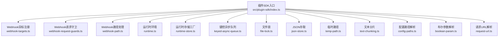
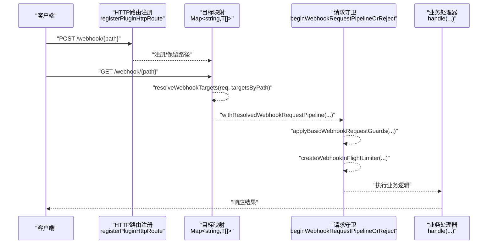
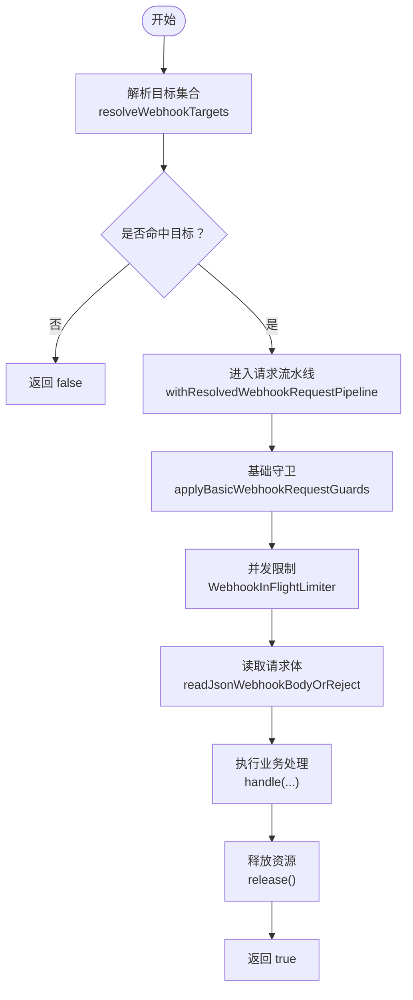
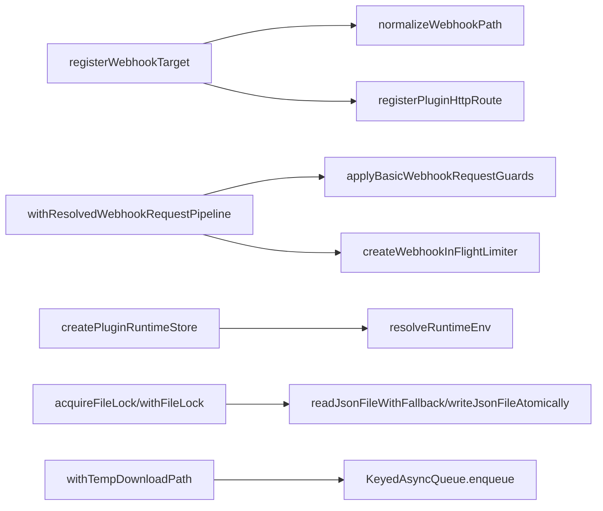

# 工具函数

<cite>
**本文引用的文件**
- [src/plugin-sdk/index.ts](file://src/plugin-sdk/index.ts)
- [src/plugin-sdk/webhook-targets.ts](file://src/plugin-sdk/webhook-targets.ts)
- [src/plugin-sdk/webhook-request-guards.ts](file://src/plugin-sdk/webhook-request-guards.ts)
- [src/plugin-sdk/webhook-path.ts](file://src/plugin-sdk/webhook-path.ts)
- [src/plugin-sdk/runtime.ts](file://src/plugin-sdk/runtime.ts)
- [src/plugin-sdk/runtime-store.ts](file://src/plugin-sdk/runtime-store.ts)
- [src/plugin-sdk/keyed-async-queue.ts](file://src/plugin-sdk/keyed-async-queue.ts)
- [src/plugin-sdk/file-lock.ts](file://src/plugin-sdk/file-lock.ts)
- [src/plugin-sdk/json-store.ts](file://src/plugin-sdk/json-store.ts)
- [src/plugin-sdk/temp-path.ts](file://src/plugin-sdk/temp-path.ts)
- [src/plugin-sdk/text-chunking.ts](file://src/plugin-sdk/text-chunking.ts)
- [src/plugin-sdk/config-paths.ts](file://src/plugin-sdk/config-paths.ts)
- [src/plugin-sdk/boolean-param.ts](file://src/plugin-sdk/boolean-param.ts)
- [src/plugin-sdk/request-url.ts](file://src/plugin-sdk/request-url.ts)
</cite>

## 目录
1. [简介](#简介)
2. [项目结构](#项目结构)
3. [核心组件](#核心组件)
4. [架构总览](#架构总览)
5. [详细组件分析](#详细组件分析)
6. [依赖关系分析](#依赖关系分析)
7. [性能考量](#性能考量)
8. [故障排查指南](#故障排查指南)
9. [结论](#结论)
10. [附录：函数速查与示例路径](#附录函数速查与示例路径)

## 简介
本文件系统性梳理插件 SDK 的实用工具函数，覆盖 Webhook 处理、运行时管理、配置解析、并发控制、文件锁、JSON 存取、临时路径、文本分片、布尔参数解析与请求 URL 解析等常见能力。重点解释 registerWebhookTarget、createPluginRuntimeStore、resolveRuntimeEnv 等常用函数的用途、参数、返回值与典型使用场景，并通过“示例路径”指引到仓库中可直接参考的实现位置。

## 项目结构
插件 SDK 的工具函数主要集中在 src/plugin-sdk 目录下，按功能域拆分模块，入口文件统一导出，便于插件作者按需引入。

图表来源
- [src/plugin-sdk/index.ts:188-214](file://src/plugin-sdk/index.ts#L188-L214)
- [src/plugin-sdk/webhook-targets.ts:1-100](file://src/plugin-sdk/webhook-targets.ts#L1-L100)
- [src/plugin-sdk/webhook-request-guards.ts:1-177](file://src/plugin-sdk/webhook-request-guards.ts#L1-L177)
- [src/plugin-sdk/webhook-path.ts:1-32](file://src/plugin-sdk/webhook-path.ts#L1-L32)
- [src/plugin-sdk/runtime.ts:1-45](file://src/plugin-sdk/runtime.ts#L1-L45)
- [src/plugin-sdk/runtime-store.ts:1-26](file://src/plugin-sdk/runtime-store.ts#L1-L26)
- [src/plugin-sdk/keyed-async-queue.ts:1-49](file://src/plugin-sdk/keyed-async-queue.ts#L1-L49)
- [src/plugin-sdk/file-lock.ts:1-162](file://src/plugin-sdk/file-lock.ts#L1-L162)
- [src/plugin-sdk/json-store.ts:1-32](file://src/plugin-sdk/json-store.ts#L1-L32)
- [src/plugin-sdk/temp-path.ts:1-85](file://src/plugin-sdk/temp-path.ts#L1-L85)
- [src/plugin-sdk/text-chunking.ts:1-10](file://src/plugin-sdk/text-chunking.ts#L1-L10)
- [src/plugin-sdk/config-paths.ts:1-16](file://src/plugin-sdk/config-paths.ts#L1-L16)
- [src/plugin-sdk/boolean-param.ts:1-20](file://src/plugin-sdk/boolean-param.ts#L1-L20)
- [src/plugin-sdk/request-url.ts:1-13](file://src/plugin-sdk/request-url.ts#L1-L13)

章节来源
- [src/plugin-sdk/index.ts:188-214](file://src/plugin-sdk/index.ts#L188-L214)

## 核心组件
- Webhook 目标注册与匹配：registerWebhookTarget、registerWebhookTargetWithPluginRoute、resolveWebhookTargets、withResolvedWebhookRequestPipeline、resolveSingleWebhookTarget、resolveSingleWebhookTargetAsync、resolveWebhookTargetWithAuthOrReject、resolveWebhookTargetWithAuthOrRejectSync、rejectNonPostWebhookRequest
- Webhook 请求守卫：applyBasicWebhookRequestGuards、beginWebhookRequestPipelineOrReject、createWebhookInFlightLimiter、isJsonContentType、readWebhookBodyOrReject、readJsonWebhookBodyOrReject、WEBHOOK_BODY_READ_DEFAULTS、WEBHOOK_IN_FLIGHT_DEFAULTS
- 运行时环境：createLoggerBackedRuntime、resolveRuntimeEnv、resolveRuntimeEnvWithUnavailableExit
- 运行时存储：createPluginRuntimeStore
- 并发与队列：KeyedAsyncQueue.enqueue（类）、enqueueKeyedTask（函数）
- 文件锁：acquireFileLock、withFileLock、FileLockHandle、FileLockOptions
- JSON 存取：readJsonFileWithFallback、writeJsonFileAtomically
- 临时路径：buildRandomTempFilePath、withTempDownloadPath
- 文本分片：chunkTextForOutbound
- 配置路径解析：resolveChannelAccountConfigBasePath
- 布尔参数解析：readBooleanParam
- 请求 URL 解析：resolveRequestUrl

章节来源
- [src/plugin-sdk/index.ts:188-214](file://src/plugin-sdk/index.ts#L188-L214)
- [src/plugin-sdk/webhook-targets.ts:1-100](file://src/plugin-sdk/webhook-targets.ts#L1-L100)
- [src/plugin-sdk/webhook-request-guards.ts:1-177](file://src/plugin-sdk/webhook-request-guards.ts#L1-L177)
- [src/plugin-sdk/runtime.ts:1-45](file://src/plugin-sdk/runtime.ts#L1-L45)
- [src/plugin-sdk/runtime-store.ts:1-26](file://src/plugin-sdk/runtime-store.ts#L1-L26)
- [src/plugin-sdk/keyed-async-queue.ts:1-49](file://src/plugin-sdk/keyed-async-queue.ts#L1-L49)
- [src/plugin-sdk/file-lock.ts:1-162](file://src/plugin-sdk/file-lock.ts#L1-L162)
- [src/plugin-sdk/json-store.ts:1-32](file://src/plugin-sdk/json-store.ts#L1-L32)
- [src/plugin-sdk/temp-path.ts:1-85](file://src/plugin-sdk/temp-path.ts#L1-L85)
- [src/plugin-sdk/text-chunking.ts:1-10](file://src/plugin-sdk/text-chunking.ts#L1-L10)
- [src/plugin-sdk/config-paths.ts:1-16](file://src/plugin-sdk/config-paths.ts#L1-L16)
- [src/plugin-sdk/boolean-param.ts:1-20](file://src/plugin-sdk/boolean-param.ts#L1-L20)
- [src/plugin-sdk/request-url.ts:1-13](file://src/plugin-sdk/request-url.ts#L1-L13)

## 架构总览
以下序列图展示 Webhook 请求从路由匹配到处理的完整流程，体现各工具函数之间的协作关系。

图表来源
- [src/plugin-sdk/webhook-targets.ts:102-162](file://src/plugin-sdk/webhook-targets.ts#L102-L162)
- [src/plugin-sdk/webhook-request-guards.ts:179-227](file://src/plugin-sdk/webhook-request-guards.ts#L179-L227)

## 详细组件分析

### Webhook 目标注册与处理
- registerWebhookTarget
  - 作用：将带路径的目标注册到 targetsByPath 映射中；当首个目标注册时触发 onFirstPathTarget 回调（常用于注册 HTTP 路由），移除到最后一个目标时触发 onLastPathTargetRemoved 回调。
  - 参数要点：target 必须包含 path 字段；支持自定义 onFirstPathTarget/onLastPathTargetRemoved。
  - 返回值：RegisteredWebhookTarget，包含 target 与 unregister 函数。
  - 使用场景：插件在启动时为每个 Webhook 路径注册处理器，自动维护路由生命周期。
  - 示例路径：[registerWebhookTarget:57-100](file://src/plugin-sdk/webhook-targets.ts#L57-L100)

- registerWebhookTargetWithPluginRoute
  - 作用：在注册 Webhook 目标的同时，通过 registerPluginHttpRoute 自动注册对应 HTTP 路由。
  - 参数要点：route 选项透传给 registerPluginHttpRoute，replaceExisting 默认启用。
  - 使用场景：快速将 Webhook 目标与路由绑定，减少重复样板代码。
  - 示例路径：[registerWebhookTargetWithPluginRoute:27-42](file://src/plugin-sdk/webhook-targets.ts#L27-L42)

- resolveWebhookTargets
  - 作用：根据请求 URL 解析并返回匹配的目标集合。
  - 返回值：null 或 { path, targets }。
  - 使用场景：在中间件或路由处理器中进行路径匹配。
  - 示例路径：[resolveWebhookTargets:102-113](file://src/plugin-sdk/webhook-targets.ts#L102-L113)

- withResolvedWebhookRequestPipeline
  - 作用：封装完整的 Webhook 请求处理流水线，包括方法白名单、速率限制、内容类型校验、并发限制、读取请求体、释放资源等。
  - 关键参数：allowMethods、rateLimiter、requireJsonContentType、inFlightLimiter、inFlightKey、handle 等。
  - 返回值：是否命中目标并完成处理。
  - 使用场景：统一处理 Webhook 入站请求，屏蔽底层细节。
  - 示例路径：[withResolvedWebhookRequestPipeline:115-162](file://src/plugin-sdk/webhook-targets.ts#L115-L162)

- resolveSingleWebhookTarget / resolveSingleWebhookTargetAsync
  - 作用：基于过滤条件从目标数组中解析唯一匹配项，若不唯一则返回歧义结果。
  - 返回值：WebhookTargetMatchResult，包含 none/single/ambiguous 三种状态。
  - 使用场景：鉴权或路由选择阶段，确保目标唯一性。
  - 示例路径：[resolveSingleWebhookTarget:186-202](file://src/plugin-sdk/webhook-targets.ts#L186-L202)、[resolveSingleWebhookTargetAsync:204-220](file://src/plugin-sdk/webhook-targets.ts#L204-L220)

- resolveWebhookTargetWithAuthOrReject / resolveWebhookTargetWithAuthOrRejectSync
  - 作用：结合鉴权回调解析单个目标，若不唯一或未命中则向客户端返回相应错误码与消息。
  - 返回值：匹配目标或 null。
  - 使用场景：鉴权后精确选择目标处理器。
  - 示例路径：[resolveWebhookTargetWithAuthOrReject:222-235](file://src/plugin-sdk/webhook-targets.ts#L222-L235)、[resolveWebhookTargetWithAuthOrRejectSync:237-248](file://src/plugin-sdk/webhook-targets.ts#L237-L248)

- rejectNonPostWebhookRequest
  - 作用：拒绝非 POST 方法的 Webhook 请求。
  - 使用场景：前置守卫，保证安全与一致性。
  - 示例路径：[rejectNonPostWebhookRequest:273-282](file://src/plugin-sdk/webhook-targets.ts#L273-L282)

图表来源
- [src/plugin-sdk/webhook-targets.ts:102-162](file://src/plugin-sdk/webhook-targets.ts#L102-L162)
- [src/plugin-sdk/webhook-request-guards.ts:179-227](file://src/plugin-sdk/webhook-request-guards.ts#L179-L227)

章节来源
- [src/plugin-sdk/webhook-targets.ts:1-282](file://src/plugin-sdk/webhook-targets.ts#L1-L282)

### Webhook 请求守卫
- applyBasicWebhookRequestGuards
  - 作用：校验方法白名单、速率限制、Content-Type 等。
  - 返回值：是否通过守卫。
  - 使用场景：通用前置校验。
  - 示例路径：[applyBasicWebhookRequestGuards:139-177](file://src/plugin-sdk/webhook-request-guards.ts#L139-L177)

- beginWebhookRequestPipelineOrReject
  - 作用：组合守卫、并发限制与资源释放，返回 { ok, release } 结构。
  - 返回值：通过则返回 release 以供 finally 释放。
  - 使用场景：统一的请求生命周期管理。
  - 示例路径：[beginWebhookRequestPipelineOrReject:179-227](file://src/plugin-sdk/webhook-request-guards.ts#L179-L227)

- createWebhookInFlightLimiter
  - 作用：创建并发限制器，支持每键最大并发与跟踪键上限裁剪。
  - 返回值：{ tryAcquire, release, size, clear }。
  - 使用场景：防止过载与内存膨胀。
  - 示例路径：[createWebhookInFlightLimiter:84-128](file://src/plugin-sdk/webhook-request-guards.ts#L84-L128)

- isJsonContentType
  - 作用：判断 Content-Type 是否为 application/json 或 +json。
  - 使用场景：严格 JSON 输入校验。
  - 示例路径：[isJsonContentType:130-137](file://src/plugin-sdk/webhook-request-guards.ts#L130-L137)

- readWebhookBodyOrReject / readJsonWebhookBodyOrReject
  - 作用：带超时与大小限制地读取原始或 JSON 请求体，失败时返回标准化错误。
  - 返回值：{ ok, value } 或错误响应。
  - 使用场景：安全读取入站数据。
  - 示例路径：[readWebhookBodyOrReject:229-261](file://src/plugin-sdk/webhook-request-guards.ts#L229-L261)、[readJsonWebhookBodyOrReject:263-290](file://src/plugin-sdk/webhook-request-guards.ts#L263-L290)

- WEBHOOK_BODY_READ_DEFAULTS / WEBHOOK_IN_FLIGHT_DEFAULTS
  - 作用：默认读取大小、超时与并发限制配置。
  - 使用场景：作为守卫参数的默认值。
  - 示例路径：[WEBHOOK_BODY_READ_DEFAULTS:13-27](file://src/plugin-sdk/webhook-request-guards.ts#L13-L27)、[WEBHOOK_IN_FLIGHT_DEFAULTS:24-27](file://src/plugin-sdk/webhook-request-guards.ts#L24-L27)

章节来源
- [src/plugin-sdk/webhook-request-guards.ts:1-291](file://src/plugin-sdk/webhook-request-guards.ts#L1-L291)

### 运行时环境与存储
- createLoggerBackedRuntime
  - 作用：将任意 LoggerLike 包装为 RuntimeEnv，提供 log、error、exit 接口。
  - 返回值：RuntimeEnv。
  - 使用场景：为插件运行时注入日志与退出策略。
  - 示例路径：[createLoggerBackedRuntime:9-24](file://src/plugin-sdk/runtime.ts#L9-L24)

- resolveRuntimeEnv / resolveRuntimeEnvWithUnavailableExit
  - 作用：优先使用传入 runtime，否则基于 logger 创建；后者在 exit 不可用时抛出指定错误。
  - 返回值：RuntimeEnv。
  - 使用场景：在不同宿主环境中适配运行时。
  - 示例路径：[resolveRuntimeEnv:26-32](file://src/plugin-sdk/runtime.ts#L26-L32)、[resolveRuntimeEnvWithUnavailableExit:34-44](file://src/plugin-sdk/runtime.ts#L34-L44)

- createPluginRuntimeStore
  - 作用：创建一个轻量运行时存储，支持 set/clear/tryGet/get。
  - 返回值：包含 setRuntime、clearRuntime、tryGetRuntime、getRuntime 的对象。
  - 使用场景：插件内部缓存运行时上下文（如配置、连接句柄）。
  - 示例路径：[createPluginRuntimeStore:1-26](file://src/plugin-sdk/runtime-store.ts#L1-L26)

章节来源
- [src/plugin-sdk/runtime.ts:1-45](file://src/plugin-sdk/runtime.ts#L1-L45)
- [src/plugin-sdk/runtime-store.ts:1-26](file://src/plugin-sdk/runtime-store.ts#L1-L26)

### 并发与队列
- KeyedAsyncQueue.enqueue / enqueueKeyedTask
  - 作用：按键串行化异步任务，确保同一键的任务顺序执行，尾部 Promise 用于清理。
  - 返回值：Promise<T>。
  - 使用场景：避免并发写冲突（如文件、数据库、外部 API）。
  - 示例路径：[KeyedAsyncQueue.enqueue:40-47](file://src/plugin-sdk/keyed-async-queue.ts#L40-L47)、[enqueueKeyedTask:6-31](file://src/plugin-sdk/keyed-async-queue.ts#L6-L31)

章节来源
- [src/plugin-sdk/keyed-async-queue.ts:1-49](file://src/plugin-sdk/keyed-async-queue.ts#L1-L49)

### 文件锁
- acquireFileLock / withFileLock
  - 作用：跨进程互斥文件锁，支持重试、抖动与过期检测；withFileLock 自动释放。
  - 返回值：FileLockHandle 或执行结果。
  - 使用场景：插件多实例部署下的共享资源保护。
  - 示例路径：[acquireFileLock:103-148](file://src/plugin-sdk/file-lock.ts#L103-L148)、[withFileLock:150-162](file://src/plugin-sdk/file-lock.ts#L150-L162)

- FileLockOptions / FileLockHandle
  - 作用：配置重试策略与过期时间；持有锁的句柄。
  - 使用场景：定制锁行为。
  - 示例路径：[FileLockOptions:6-15](file://src/plugin-sdk/file-lock.ts#L6-L15)、[FileLockHandle:84-87](file://src/plugin-sdk/file-lock.ts#L84-L87)

章节来源
- [src/plugin-sdk/file-lock.ts:1-162](file://src/plugin-sdk/file-lock.ts#L1-L162)

### JSON 存取
- readJsonFileWithFallback
  - 作用：读取 JSON 文件，解析失败或不存在时返回回退值。
  - 返回值：{ value, exists }。
  - 使用场景：配置文件容错加载。
  - 示例路径：[readJsonFileWithFallback:5-23](file://src/plugin-sdk/json-store.ts#L5-L23)

- writeJsonFileAtomically
  - 作用：原子写入 JSON 文件，设置权限与目录模式。
  - 返回值：void。
  - 使用场景：安全持久化配置或状态。
  - 示例路径：[writeJsonFileAtomically:25-31](file://src/plugin-sdk/json-store.ts#L25-L31)

章节来源
- [src/plugin-sdk/json-store.ts:1-32](file://src/plugin-sdk/json-store.ts#L1-L32)

### 临时路径
- buildRandomTempFilePath
  - 作用：生成随机临时文件路径，支持前缀、扩展名、时间戳与 UUID。
  - 返回值：字符串路径。
  - 使用场景：下载、解压、临时文件命名。
  - 示例路径：[buildRandomTempFilePath:43-59](file://src/plugin-sdk/temp-path.ts#L43-L59)

- withTempDownloadPath
  - 作用：创建临时目录并执行回调，最终清理目录。
  - 返回值：Promise<T>。
  - 使用场景：下载文件并确保清理。
  - 示例路径：[withTempDownloadPath:61-84](file://src/plugin-sdk/temp-path.ts#L61-L84)

章节来源
- [src/plugin-sdk/temp-path.ts:1-85](file://src/plugin-sdk/temp-path.ts#L1-L85)

### 文本分片
- chunkTextForOutbound
  - 作用：按换行或空格断句，避免破坏单词边界。
  - 返回值：字符串数组。
  - 使用场景：长文本拆分发送。
  - 示例路径：[chunkTextForOutbound:3-9](file://src/plugin-sdk/text-chunking.ts#L3-L9)

章节来源
- [src/plugin-sdk/text-chunking.ts:1-10](file://src/plugin-sdk/text-chunking.ts#L1-L10)

### 配置路径解析
- resolveChannelAccountConfigBasePath
  - 作用：根据通道与账户是否存在，决定配置基路径是 accounts 下还是通道根。
  - 返回值：字符串路径前缀。
  - 使用场景：动态定位配置键。
  - 示例路径：[resolveChannelAccountConfigBasePath:3-15](file://src/plugin-sdk/config-paths.ts#L3-L15)

章节来源
- [src/plugin-sdk/config-paths.ts:1-16](file://src/plugin-sdk/config-paths.ts#L1-L16)

### 布尔参数解析
- readBooleanParam
  - 作用：从参数对象读取布尔值，支持 "true"/"false" 字符串。
  - 返回值：boolean | undefined。
  - 使用场景：解析查询参数或表单字段。
  - 示例路径：[readBooleanParam:1-19](file://src/plugin-sdk/boolean-param.ts#L1-L19)

章节来源
- [src/plugin-sdk/boolean-param.ts:1-20](file://src/plugin-sdk/boolean-param.ts#L1-L20)

### 请求 URL 解析
- resolveRequestUrl
  - 作用：兼容多种输入形式，统一输出 URL 字符串。
  - 返回值：字符串。
  - 使用场景：兼容 fetch/原生 URL/自定义对象。
  - 示例路径：[resolveRequestUrl:1-12](file://src/plugin-sdk/request-url.ts#L1-L12)

章节来源
- [src/plugin-sdk/request-url.ts:1-13](file://src/plugin-sdk/request-url.ts#L1-L13)

## 依赖关系分析
- registerWebhookTarget 依赖 normalizeWebhookPath 与 registerPluginHttpRoute，形成“路径标准化 + 路由注册”的闭环。
- withResolvedWebhookRequestPipeline 依赖 applyBasicWebhookRequestGuards 与 createWebhookInFlightLimiter，形成“守卫 + 并发控制 + 资源释放”的流水线。
- createPluginRuntimeStore 与 resolveRuntimeEnv 协作，前者提供运行时上下文存储，后者提供日志与退出策略。
- file-lock 与 json-store 组合，保障并发安全的配置持久化。
- temp-path 与 keyed-async-queue 可配合使用，确保临时目录与并发任务有序清理。

图表来源
- [src/plugin-sdk/webhook-targets.ts:1-100](file://src/plugin-sdk/webhook-targets.ts#L1-L100)
- [src/plugin-sdk/webhook-request-guards.ts:179-227](file://src/plugin-sdk/webhook-request-guards.ts#L179-L227)
- [src/plugin-sdk/runtime-store.ts:1-26](file://src/plugin-sdk/runtime-store.ts#L1-L26)
- [src/plugin-sdk/runtime.ts:26-32](file://src/plugin-sdk/runtime.ts#L26-L32)
- [src/plugin-sdk/file-lock.ts:103-148](file://src/plugin-sdk/file-lock.ts#L103-L148)
- [src/plugin-sdk/json-store.ts:5-31](file://src/plugin-sdk/json-store.ts#L5-L31)
- [src/plugin-sdk/temp-path.ts:61-84](file://src/plugin-sdk/temp-path.ts#L61-L84)
- [src/plugin-sdk/keyed-async-queue.ts:40-47](file://src/plugin-sdk/keyed-async-queue.ts#L40-L47)

章节来源
- [src/plugin-sdk/index.ts:188-214](file://src/plugin-sdk/index.ts#L188-L214)

## 性能考量
- 并发限制：使用 createWebhookInFlightLimiter 控制每键并发数与跟踪键上限，避免内存膨胀与过载。
- 请求体读取：合理设置 WEBHOOK_BODY_READ_DEFAULTS，区分鉴权前后的读取限额与超时，降低慢客户端影响。
- 锁竞争：file-lock 在高并发下可能成为瓶颈，建议结合重试与抖动策略，并尽量缩短持锁时间。
- 临时文件：withTempDownloadPath 自动清理，但频繁创建/删除仍会带来 IO 压力，建议复用目录或批量清理。
- 文本分片：chunkTextForOutbound 按换行/空格断句，避免大块传输导致的网络拥塞。

## 故障排查指南
- Webhook 405 Method Not Allowed：检查 allowMethods 与 rejectNonPostWebhookRequest 的使用。
- Webhook 413/408/400：检查 readWebhookBodyOrReject/readJsonWebhookBodyOrReject 的错误分支与 requestBodyErrorToText 输出。
- Webhook 429 并发限制：调整 createWebhookInFlightLimiter 的 maxInFlightPerKey 与 maxTrackedKeys。
- 文件锁超时：增大 retries 与 stale 时间，确认锁文件是否被僵尸进程遗留。
- JSON 写入失败：检查 writeJsonFileAtomically 的权限与目录模式配置。
- 临时目录清理失败：留意 withTempDownloadPath 的异常捕获与日志提示。

章节来源
- [src/plugin-sdk/webhook-request-guards.ts:58-82](file://src/plugin-sdk/webhook-request-guards.ts#L58-L82)
- [src/plugin-sdk/file-lock.ts:131-147](file://src/plugin-sdk/file-lock.ts#L131-L147)
- [src/plugin-sdk/json-store.ts:25-31](file://src/plugin-sdk/json-store.ts#L25-L31)
- [src/plugin-sdk/temp-path.ts:76-83](file://src/plugin-sdk/temp-path.ts#L76-L83)

## 结论
插件 SDK 的工具函数围绕“安全、稳定、易用”设计：Webhook 目标注册与守卫确保请求处理的可控性；运行时环境与存储提供一致的上下文；并发控制、文件锁与临时路径保障多实例与高负载场景下的可靠性；配置解析、布尔参数与 URL 解析提升开发效率与健壮性。建议在插件开发中遵循这些工具函数的最佳实践，以获得更稳定的运行表现。

## 附录：函数速查与示例路径
- Webhook 注册与匹配
  - registerWebhookTarget：[函数定义:57-100](file://src/plugin-sdk/webhook-targets.ts#L57-L100)
  - registerWebhookTargetWithPluginRoute：[函数定义:27-42](file://src/plugin-sdk/webhook-targets.ts#L27-L42)
  - resolveWebhookTargets：[函数定义:102-113](file://src/plugin-sdk/webhook-targets.ts#L102-L113)
  - withResolvedWebhookRequestPipeline：[函数定义:115-162](file://src/plugin-sdk/webhook-targets.ts#L115-L162)
  - resolveSingleWebhookTarget / Async：[函数定义:186-220](file://src/plugin-sdk/webhook-targets.ts#L186-L220)
  - resolveWebhookTargetWithAuthOrReject / Sync：[函数定义:222-248](file://src/plugin-sdk/webhook-targets.ts#L222-L248)
  - rejectNonPostWebhookRequest：[函数定义:273-282](file://src/plugin-sdk/webhook-targets.ts#L273-L282)

- Webhook 守卫与限流
  - applyBasicWebhookRequestGuards：[函数定义:139-177](file://src/plugin-sdk/webhook-request-guards.ts#L139-L177)
  - beginWebhookRequestPipelineOrReject：[函数定义:179-227](file://src/plugin-sdk/webhook-request-guards.ts#L179-L227)
  - createWebhookInFlightLimiter：[函数定义:84-128](file://src/plugin-sdk/webhook-request-guards.ts#L84-L128)
  - isJsonContentType：[函数定义:130-137](file://src/plugin-sdk/webhook-request-guards.ts#L130-L137)
  - readWebhookBodyOrReject / readJsonWebhookBodyOrReject：[函数定义:229-290](file://src/plugin-sdk/webhook-request-guards.ts#L229-L290)
  - 默认配置：[WEBHOOK_BODY_READ_DEFAULTS:13-27](file://src/plugin-sdk/webhook-request-guards.ts#L13-L27)、[WEBHOOK_IN_FLIGHT_DEFAULTS:24-27](file://src/plugin-sdk/webhook-request-guards.ts#L24-L27)

- 运行时环境与存储
  - createLoggerBackedRuntime：[函数定义:9-24](file://src/plugin-sdk/runtime.ts#L9-L24)
  - resolveRuntimeEnv / WithUnavailableExit：[函数定义:26-44](file://src/plugin-sdk/runtime.ts#L26-L44)
  - createPluginRuntimeStore：[函数定义:1-26](file://src/plugin-sdk/runtime-store.ts#L1-L26)

- 并发与队列
  - KeyedAsyncQueue.enqueue / enqueueKeyedTask：[函数定义:40-47](file://src/plugin-sdk/keyed-async-queue.ts#L40-L47)

- 文件锁
  - acquireFileLock / withFileLock：[函数定义:103-162](file://src/plugin-sdk/file-lock.ts#L103-L162)
  - FileLockOptions / FileLockHandle：[类型定义:6-15](file://src/plugin-sdk/file-lock.ts#L6-L15)

- JSON 存取
  - readJsonFileWithFallback / writeJsonFileAtomically：[函数定义:5-31](file://src/plugin-sdk/json-store.ts#L5-L31)

- 临时路径
  - buildRandomTempFilePath / withTempDownloadPath：[函数定义:43-84](file://src/plugin-sdk/temp-path.ts#L43-L84)

- 文本分片
  - chunkTextForOutbound：[函数定义:3-9](file://src/plugin-sdk/text-chunking.ts#L3-L9)

- 配置路径解析
  - resolveChannelAccountConfigBasePath：[函数定义:3-15](file://src/plugin-sdk/config-paths.ts#L3-L15)

- 布尔参数解析
  - readBooleanParam：[函数定义:1-19](file://src/plugin-sdk/boolean-param.ts#L1-L19)

- 请求 URL 解析
  - resolveRequestUrl：[函数定义:1-12](file://src/plugin-sdk/request-url.ts#L1-L12)