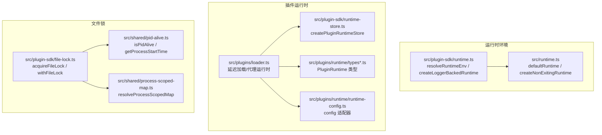
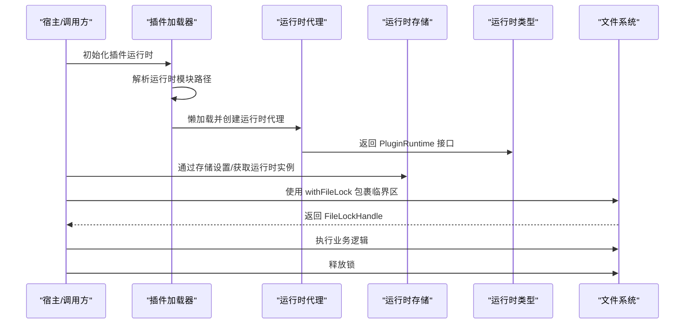
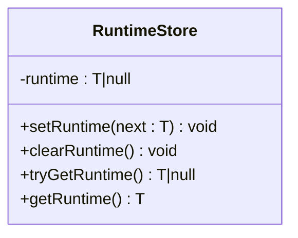
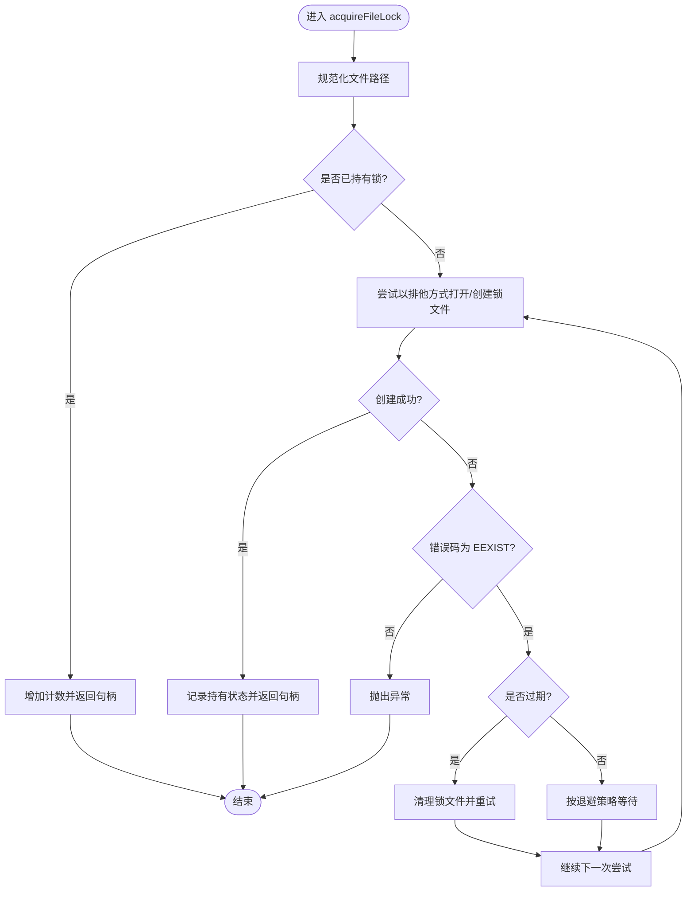
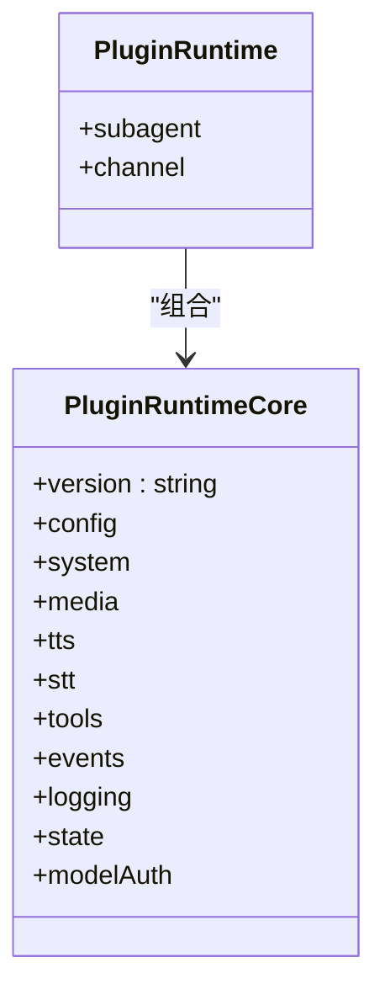
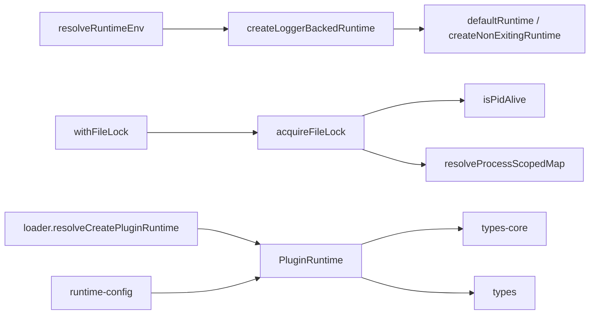

# 运行时工具

<cite>
**本文引用的文件**
- [src/plugin-sdk/runtime.ts](file://src/plugin-sdk/runtime.ts)
- [src/runtime.ts](file://src/runtime.ts)
- [src/plugin-sdk/runtime-store.ts](file://src/plugin-sdk/runtime-store.ts)
- [src/plugin-sdk/file-lock.ts](file://src/plugin-sdk/file-lock.ts)
- [src/shared/pid-alive.ts](file://src/shared/pid-alive.ts)
- [src/shared/process-scoped-map.ts](file://src/shared/process-scoped-map.ts)
- [src/plugins/loader.ts](file://src/plugins/loader.ts)
- [src/plugins/runtime/types-core.ts](file://src/plugins/runtime/types-core.ts)
- [src/plugins/runtime/types.ts](file://src/plugins/runtime/types.ts)
- [src/plugins/runtime/runtime-config.ts](file://src/plugins/runtime/runtime-config.ts)
- [src/plugin-sdk/runtime.test.ts](file://src/plugin-sdk/runtime.test.ts)
</cite>

## 目录
1. [简介](#简介)
2. [项目结构](#项目结构)
3. [核心组件](#核心组件)
4. [架构总览](#架构总览)
5. [详细组件分析](#详细组件分析)
6. [依赖关系分析](#依赖关系分析)
7. [性能考量](#性能考量)
8. [故障排查指南](#故障排查指南)
9. [结论](#结论)
10. [附录](#附录)

## 简介
本文件聚焦于运行时相关工具函数，覆盖运行时环境解析、插件运行时存储、文件锁机制等能力。重点解释以下核心函数与流程：
- 运行时环境解析：resolveRuntimeEnv、createLoggerBackedRuntime、createNonExitingRuntime
- 插件运行时存储：createPluginRuntimeStore
- 文件锁定：acquireFileLock、withFileLock 及其内部策略（重试、抖动、过期检测）
- 运行时配置与状态：PluginRuntime 类型体系、运行时配置适配器
- 生命周期与错误处理：进程级持有、释放、超时与清理
- 性能优化建议：延迟初始化、幂等获取、进程内缓存、最小化 IO

## 项目结构
围绕“运行时工具”的相关模块分布如下：
- 运行时环境与默认实现：src/runtime.ts、src/plugin-sdk/runtime.ts
- 插件运行时存储：src/plugin-sdk/runtime-store.ts
- 文件锁与会话写锁：src/plugin-sdk/file-lock.ts、src/agents/session-write-lock.ts（扩展能力）
- 进程辅助：src/shared/pid-alive.ts、src/shared/process-scoped-map.ts
- 插件运行时类型与配置：src/plugins/runtime/types*.ts、src/plugins/runtime/runtime-config.ts
- 延迟加载与代理运行时：src/plugins/loader.ts

图表来源
- [src/runtime.ts:1-54](file://src/runtime.ts#L1-L54)
- [src/plugin-sdk/runtime.ts:1-45](file://src/plugin-sdk/runtime.ts#L1-L45)
- [src/plugin-sdk/runtime-store.ts:1-27](file://src/plugin-sdk/runtime-store.ts#L1-L27)
- [src/plugins/runtime/types-core.ts:1-68](file://src/plugins/runtime/types-core.ts#L1-L68)
- [src/plugins/runtime/types.ts:1-64](file://src/plugins/runtime/types.ts#L1-L64)
- [src/plugins/runtime/runtime-config.ts:1-9](file://src/plugins/runtime/runtime-config.ts#L1-L9)
- [src/plugins/loader.ts:848-902](file://src/plugins/loader.ts#L848-L902)
- [src/plugin-sdk/file-lock.ts:1-162](file://src/plugin-sdk/file-lock.ts#L1-L162)
- [src/shared/pid-alive.ts:1-71](file://src/shared/pid-alive.ts#L1-L71)
- [src/shared/process-scoped-map.ts:1-13](file://src/shared/process-scoped-map.ts#L1-L13)

章节来源
- [src/runtime.ts:1-54](file://src/runtime.ts#L1-L54)
- [src/plugin-sdk/runtime.ts:1-45](file://src/plugin-sdk/runtime.ts#L1-L45)
- [src/plugin-sdk/runtime-store.ts:1-27](file://src/plugin-sdk/runtime-store.ts#L1-L27)
- [src/plugins/runtime/types-core.ts:1-68](file://src/plugins/runtime/types-core.ts#L1-L68)
- [src/plugins/runtime/types.ts:1-64](file://src/plugins/runtime/types.ts#L1-L64)
- [src/plugins/runtime/runtime-config.ts:1-9](file://src/plugins/runtime/runtime-config.ts#L1-L9)
- [src/plugins/loader.ts:848-902](file://src/plugins/loader.ts#L848-L902)
- [src/plugin-sdk/file-lock.ts:1-162](file://src/plugin-sdk/file-lock.ts#L1-L162)
- [src/shared/pid-alive.ts:1-71](file://src/shared/pid-alive.ts#L1-L71)
- [src/shared/process-scoped-map.ts:1-13](file://src/shared/process-scoped-map.ts#L1-L13)

## 核心组件
- 运行时环境解析与默认实现
  - resolveRuntimeEnv：在未提供外部运行时对象时，基于日志器创建一个具备 log/error/exit 能力的运行时。
  - createLoggerBackedRuntime：将 LoggerLike 封装为 RuntimeEnv。
  - defaultRuntime/createNonExitingRuntime：提供进程退出或非退出模式的默认运行时实现。
- 插件运行时存储
  - createPluginRuntimeStore：提供 set/clear/tryGet/get 的运行时容器，支持缺失时抛错提示。
- 文件锁定
  - acquireFileLock/withFileLock：基于文件锁的互斥访问，支持指数退避+抖动、过期检测、进程存活判断。
- 插件运行时类型与配置
  - PluginRuntime 类型：聚合系统事件、命令执行、媒体/语音、工具、日志、状态、模型鉴权等能力。
  - runtime-config 适配器：将配置读写能力注入到运行时中。

章节来源
- [src/plugin-sdk/runtime.ts:1-45](file://src/plugin-sdk/runtime.ts#L1-L45)
- [src/runtime.ts:1-54](file://src/runtime.ts#L1-L54)
- [src/plugin-sdk/runtime-store.ts:1-27](file://src/plugin-sdk/runtime-store.ts#L1-L27)
- [src/plugin-sdk/file-lock.ts:1-162](file://src/plugin-sdk/file-lock.ts#L1-L162)
- [src/plugins/runtime/types-core.ts:1-68](file://src/plugins/runtime/types-core.ts#L1-L68)
- [src/plugins/runtime/types.ts:1-64](file://src/plugins/runtime/types.ts#L1-L64)
- [src/plugins/runtime/runtime-config.ts:1-9](file://src/plugins/runtime/runtime-config.ts#L1-L9)

## 架构总览
运行时工具通过“环境解析—存储—锁—类型与配置—延迟加载/代理”的链路协同工作，确保插件在不同宿主环境下具有一致且可控的运行时体验。

图表来源
- [src/plugins/loader.ts:848-902](file://src/plugins/loader.ts#L848-L902)
- [src/plugin-sdk/runtime-store.ts:1-27](file://src/plugin-sdk/runtime-store.ts#L1-L27)
- [src/plugin-sdk/file-lock.ts:150-161](file://src/plugin-sdk/file-lock.ts#L150-L161)
- [src/plugins/runtime/types.ts:51-63](file://src/plugins/runtime/types.ts#L51-L63)

## 详细组件分析

### 运行时环境解析与默认实现
- resolveRuntimeEnv
  - 当传入 runtime 时直接返回；否则基于 logger 创建运行时，并可自定义 exitError。
  - 适合在 CLI 或服务端统一注入日志器与退出策略。
- createLoggerBackedRuntime
  - 将 info/error 映射为 log/error，exit 统一抛出异常或自定义错误。
- defaultRuntime / createNonExitingRuntime
  - defaultRuntime：退出时恢复终端状态并调用 process.exit。
  - createNonExitingRuntime：退出时抛错，便于测试或上层捕获。

图表来源
- [src/plugin-sdk/runtime.ts:26-44](file://src/plugin-sdk/runtime.ts#L26-L44)
- [src/runtime.ts:37-53](file://src/runtime.ts#L37-L53)

章节来源
- [src/plugin-sdk/runtime.ts:1-45](file://src/plugin-sdk/runtime.ts#L1-L45)
- [src/runtime.ts:1-54](file://src/runtime.ts#L1-L54)
- [src/plugin-sdk/runtime.test.ts:1-39](file://src/plugin-sdk/runtime.test.ts#L1-L39)

### 插件运行时存储
- createPluginRuntimeStore
  - 提供 setRuntime/clearRuntime/tryGetRuntime/getRuntime 四个操作。
  - getRuntime 在未设置时抛出带错误信息的异常，便于定位问题。
  - 适用于插件在不同阶段（发现、注册、执行）共享同一运行时实例。

图表来源
- [src/plugin-sdk/runtime-store.ts:1-27](file://src/plugin-sdk/runtime-store.ts#L1-L27)

章节来源
- [src/plugin-sdk/runtime-store.ts:1-27](file://src/plugin-sdk/runtime-store.ts#L1-L27)

### 文件锁定机制
- acquireFileLock
  - 规范化文件路径，生成 .lock 文件。
  - 若已持有锁则递增计数并复用句柄；否则尝试以排他方式创建锁文件并写入 pid/时间戳。
  - 支持重试策略：指数退避 + 抖动，最大/最小超时限制。
  - 过期检测：若锁文件对应的 pid 不存活、或 createdAt 超过 stale 阈值、或 mtime 超时，则认为过期并清理后重试。
  - 释放：计数减至 0 时关闭句柄并删除锁文件。
- withFileLock
  - 自动包裹业务逻辑并在 finally 中释放锁，简化调用方使用。

图表来源
- [src/plugin-sdk/file-lock.ts:103-148](file://src/plugin-sdk/file-lock.ts#L103-L148)
- [src/plugin-sdk/file-lock.ts:31-38](file://src/plugin-sdk/file-lock.ts#L31-L38)
- [src/plugin-sdk/file-lock.ts:65-82](file://src/plugin-sdk/file-lock.ts#L65-L82)
- [src/shared/pid-alive.ts:24-37](file://src/shared/pid-alive.ts#L24-L37)

章节来源
- [src/plugin-sdk/file-lock.ts:1-162](file://src/plugin-sdk/file-lock.ts#L1-L162)
- [src/shared/pid-alive.ts:1-71](file://src/shared/pid-alive.ts#L1-L71)
- [src/shared/process-scoped-map.ts:1-13](file://src/shared/process-scoped-map.ts#L1-L13)

### 插件运行时类型与配置
- PluginRuntime 类型
  - 聚合子代理运行、通道接口、系统事件、命令执行、媒体/语音、工具、事件监听、日志、状态、模型鉴权等能力。
- 运行时配置适配器
  - createRuntimeConfig：将 loadConfig/writeConfigFile 注入到运行时 config 字段，屏蔽底层实现差异。
- 延迟加载与代理运行时
  - loader 中通过 resolveCreatePluginRuntime 惰性加载运行时模块，并用 Proxy 将属性访问转发到实际运行时，避免启动路径上加载所有依赖树。

图表来源
- [src/plugins/runtime/types-core.ts:10-67](file://src/plugins/runtime/types-core.ts#L10-L67)
- [src/plugins/runtime/types.ts:51-63](file://src/plugins/runtime/types.ts#L51-L63)
- [src/plugins/runtime/runtime-config.ts:4-8](file://src/plugins/runtime/runtime-config.ts#L4-L8)
- [src/plugins/loader.ts:848-902](file://src/plugins/loader.ts#L848-L902)

章节来源
- [src/plugins/runtime/types-core.ts:1-68](file://src/plugins/runtime/types-core.ts#L1-L68)
- [src/plugins/runtime/types.ts:1-64](file://src/plugins/runtime/types.ts#L1-L64)
- [src/plugins/runtime/runtime-config.ts:1-9](file://src/plugins/runtime/runtime-config.ts#L1-L9)
- [src/plugins/loader.ts:848-902](file://src/plugins/loader.ts#L848-L902)

## 依赖关系分析
- 运行时环境
  - resolveRuntimeEnv 依赖 createLoggerBackedRuntime；defaultRuntime/createNonExitingRuntime 依赖控制台输出与进程退出。
- 文件锁
  - acquireFileLock 依赖 isPidAlive 与进程内 Map 缓存；withFileLock 依赖 acquireFileLock。
- 插件运行时
  - loader 依赖运行时模块导出 createPluginRuntime；运行时类型定义来自 types-core 与 types；runtime-config 适配配置读写。

图表来源
- [src/plugin-sdk/runtime.ts:26-44](file://src/plugin-sdk/runtime.ts#L26-L44)
- [src/runtime.ts:37-53](file://src/runtime.ts#L37-L53)
- [src/plugin-sdk/file-lock.ts:103-148](file://src/plugin-sdk/file-lock.ts#L103-L148)
- [src/shared/pid-alive.ts:24-37](file://src/shared/pid-alive.ts#L24-L37)
- [src/shared/process-scoped-map.ts:1-13](file://src/shared/process-scoped-map.ts#L1-L13)
- [src/plugins/loader.ts:848-902](file://src/plugins/loader.ts#L848-L902)
- [src/plugins/runtime/types-core.ts:10-67](file://src/plugins/runtime/types-core.ts#L10-L67)
- [src/plugins/runtime/types.ts:51-63](file://src/plugins/runtime/types.ts#L51-L63)
- [src/plugins/runtime/runtime-config.ts:4-8](file://src/plugins/runtime/runtime-config.ts#L4-L8)

章节来源
- [src/plugin-sdk/runtime.ts:1-45](file://src/plugin-sdk/runtime.ts#L1-L45)
- [src/runtime.ts:1-54](file://src/runtime.ts#L1-L54)
- [src/plugin-sdk/file-lock.ts:1-162](file://src/plugin-sdk/file-lock.ts#L1-L162)
- [src/shared/pid-alive.ts:1-71](file://src/shared/pid-alive.ts#L1-L71)
- [src/shared/process-scoped-map.ts:1-13](file://src/shared/process-scoped-map.ts#L1-L13)
- [src/plugins/loader.ts:848-902](file://src/plugins/loader.ts#L848-L902)
- [src/plugins/runtime/types-core.ts:1-68](file://src/plugins/runtime/types-core.ts#L1-L68)
- [src/plugins/runtime/types.ts:1-64](file://src/plugins/runtime/types.ts#L1-L64)
- [src/plugins/runtime/runtime-config.ts:1-9](file://src/plugins/runtime/runtime-config.ts#L1-L9)

## 性能考量
- 延迟初始化与惰性加载
  - 插件运行时通过 resolveCreatePluginRuntime 和 Proxy 实现懒加载，避免启动路径加载全部依赖树，降低冷启动成本。
- 进程内缓存
  - 使用 resolveProcessScopedMap 缓存已持有的锁，减少重复 IO 与进程检查开销。
- 退避策略与抖动
  - 指数退避+抖动可平滑竞争冲突，避免“惊群效应”，提升整体吞吐。
- 最小化 IO
  - acquireFileLock 先检查本地持有再尝试创建，减少不必要的磁盘写入。
- 日志与终端状态
  - defaultRuntime 在退出前恢复终端状态，避免影响用户交互。

章节来源
- [src/plugins/loader.ts:870-876](file://src/plugins/loader.ts#L870-L876)
- [src/plugin-sdk/file-lock.ts:28-29](file://src/plugin-sdk/file-lock.ts#L28-L29)
- [src/plugin-sdk/file-lock.ts:31-38](file://src/plugin-sdk/file-lock.ts#L31-L38)
- [src/runtime.ts:37-44](file://src/runtime.ts#L37-L44)

## 故障排查指南
- 运行时环境
  - 若调用 exit 后无输出或终端状态异常，确认是否使用了 defaultRuntime；如需测试场景下的 exit 捕获，请使用 createNonExitingRuntime。
  - resolveRuntimeEnv 未提供 runtime 时会自动创建，若日志未见输出，检查 LoggerLike 的实现与环境变量对测试日志的影响。
- 文件锁
  - “file lock timeout”：通常由锁文件过期但无法清理或竞争过于激烈导致。检查 stale 配置、磁盘权限、并发进程健康状况。
  - 锁文件残留：确保 withFileLock 正常执行 finally 分支，或手动调用 release 释放。
  - 进程回收：Linux 下若 PID 被回收，isPidAlive 会判定为死进程；必要时结合 starttime 判定 PID 复用。
- 插件运行时
  - 未找到运行时模块或导出：检查 resolvePluginRuntimeModulePath 与运行时模块是否导出 createPluginRuntime。
  - 代理访问异常：确认 Proxy 的 get/set/has 等拦截器未被意外覆写。

章节来源
- [src/plugin-sdk/runtime.ts:26-44](file://src/plugin-sdk/runtime.ts#L26-L44)
- [src/runtime.ts:10-19](file://src/runtime.ts#L10-L19)
- [src/plugin-sdk/file-lock.ts:147](file://src/plugin-sdk/file-lock.ts#L147)
- [src/shared/pid-alive.ts:24-37](file://src/shared/pid-alive.ts#L24-L37)
- [src/plugins/loader.ts:856-867](file://src/plugins/loader.ts#L856-L867)

## 结论
运行时工具通过“环境解析—存储—锁—类型与配置—延迟加载/代理”的设计，在保证一致性的同时兼顾性能与可靠性。合理使用这些工具可以：
- 快速在不同宿主环境中提供一致的运行时体验
- 以最小代价实现资源互斥与状态隔离
- 通过惰性加载与进程内缓存降低启动与运行时开销
- 在复杂并发场景下保持稳定与可观测性

## 附录
- 实用示例（步骤说明）
  - 运行时配置解析与使用
    - 使用 createRuntimeConfig 获取 config.loadConfig 与 config.writeConfigFile，封装到运行时中以便插件统一访问。
    - 参考路径：[src/plugins/runtime/runtime-config.ts:4-8](file://src/plugins/runtime/runtime-config.ts#L4-L8)
  - 运行时状态管理
    - 使用 createPluginRuntimeStore 存储运行时实例，避免重复初始化；在需要时通过 getRuntime 获取。
    - 参考路径：[src/plugin-sdk/runtime-store.ts:1-27](file://src/plugin-sdk/runtime-store.ts#L1-L27)
  - 资源访问与互斥
    - 对共享资源（如配置文件、会话文件）使用 withFileLock 包裹临界区，确保原子性与一致性。
    - 参考路径：[src/plugin-sdk/file-lock.ts:150-161](file://src/plugin-sdk/file-lock.ts#L150-L161)
  - 运行时生命周期管理
    - 通过 resolveRuntimeEnv 提供统一的日志与退出策略；在 CLI 场景使用 defaultRuntime，在测试/上层捕获场景使用 createNonExitingRuntime。
    - 参考路径：[src/plugin-sdk/runtime.ts:26-44](file://src/plugin-sdk/runtime.ts#L26-L44)，[src/runtime.ts:37-53](file://src/runtime.ts#L37-L53)
  - 错误处理与性能优化
    - 文件锁采用指数退避+抖动与过期检测，避免忙等；进程内缓存持有锁减少重复 IO。
    - 参考路径：[src/plugin-sdk/file-lock.ts:31-38](file://src/plugin-sdk/file-lock.ts#L31-L38)，[src/plugin-sdk/file-lock.ts:65-82](file://src/plugin-sdk/file-lock.ts#L65-L82)，[src/shared/process-scoped-map.ts:1-13](file://src/shared/process-scoped-map.ts#L1-L13)