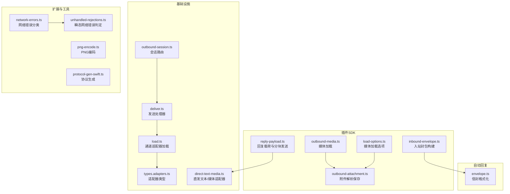
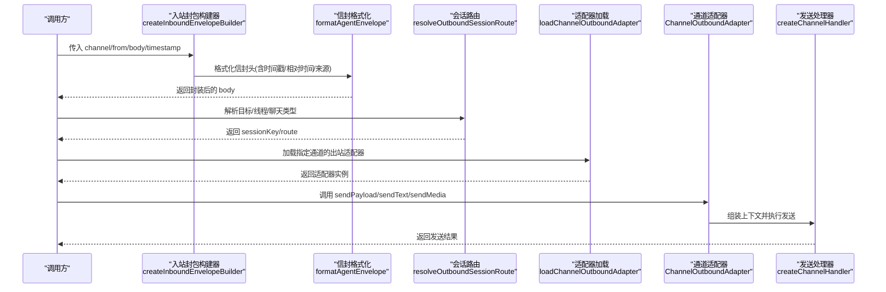
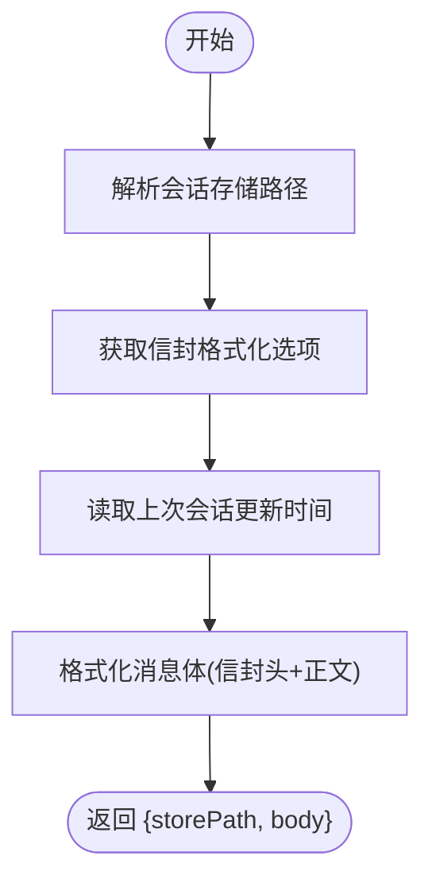
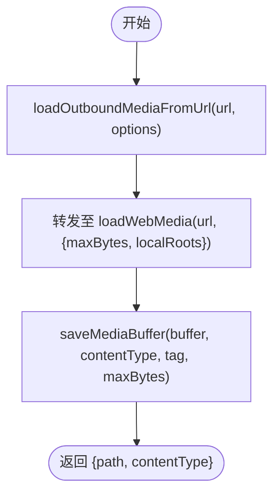
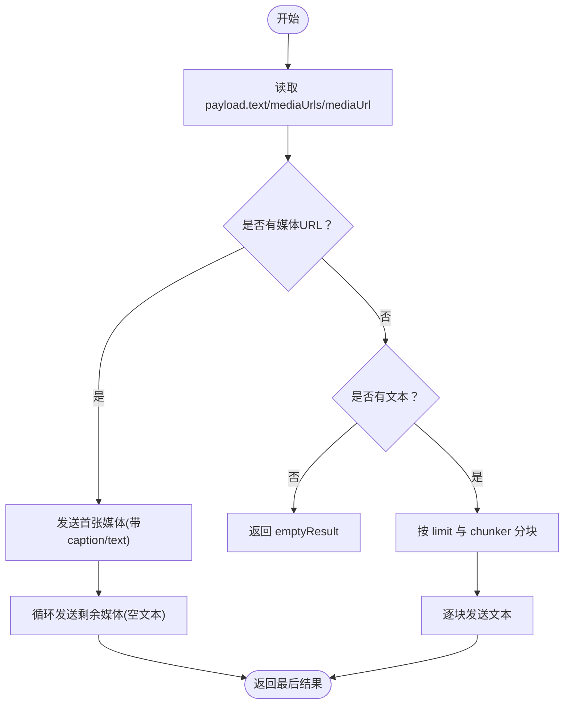
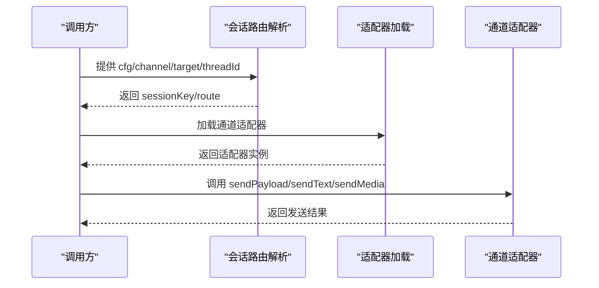
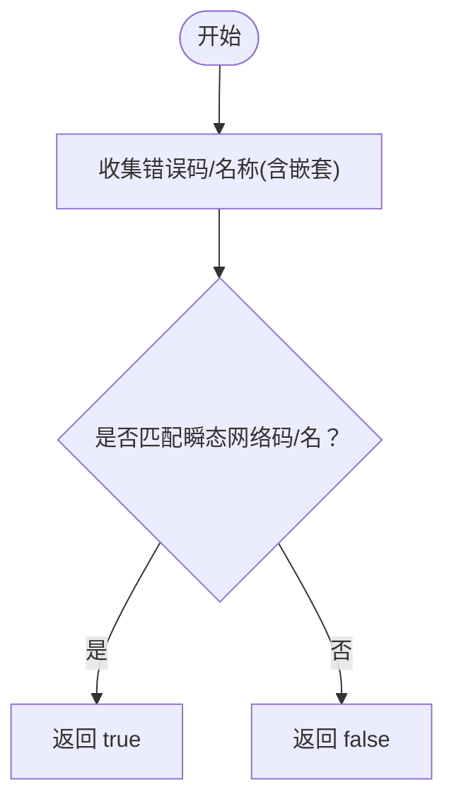
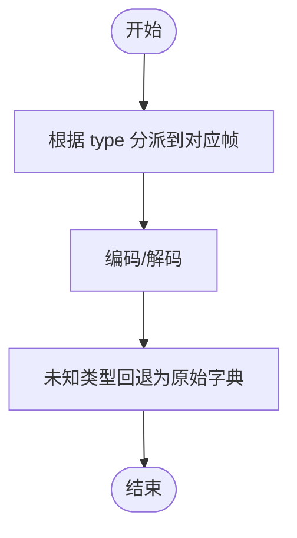
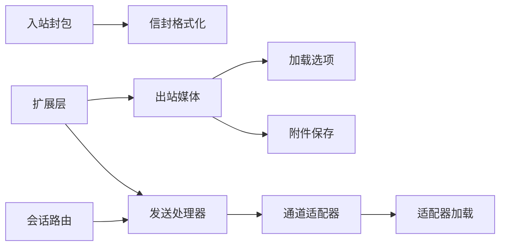

# 通信工具

<cite>
**本文引用的文件列表**
- [inbound-envelope.ts](file://src/plugin-sdk/inbound-envelope.ts)
- [reply-payload.ts](file://src/plugin-sdk/reply-payload.ts)
- [outbound-media.ts](file://src/plugin-sdk/outbound-media.ts)
- [load-options.ts](file://src/media/load-options.ts)
- [outbound-attachment.ts](file://src/media/outbound-attachment.ts)
- [envelope.ts](file://src/auto-reply/envelope.ts)
- [outbound-session.ts](file://src/infra/outbound/outbound-session.ts)
- [deliver.ts](file://src/infra/outbound/deliver.ts)
- [load.ts](file://src/channels/plugins/outbound/load.ts)
- [types.adapters.ts](file://src/channels/plugins/types.adapters.ts)
- [types.ts](file://src/channels/plugins/types.ts)
- [direct-text-media.ts](file://src/channels/plugins/outbound/direct-text-media.ts)
- [send-payload-contract.ts](file://src/test-utils/send-payload-contract.ts)
- [network-errors.ts](file://extensions/telegram/src/network-errors.ts)
- [unhandled-rejections.ts](file://src/infra/unhandled-rejections.ts)
- [png-encode.ts](file://src/media/png-encode.ts)
- [protocol-gen-swift.ts](file://scripts/protocol-gen-swift.ts)
</cite>

## 目录
1. [简介](#简介)
2. [项目结构与通信模块定位](#项目结构与通信模块定位)
3. [核心组件总览](#核心组件总览)
4. [架构概览](#架构概览)
5. [详细组件分析](#详细组件分析)
6. [依赖关系分析](#依赖关系分析)
7. [性能与可靠性考量](#性能与可靠性考量)
8. [故障排查指南](#故障排查指南)
9. [结论](#结论)
10. [附录：使用示例与最佳实践](#附录使用示例与最佳实践)

## 简介
本文件聚焦于 OpenClaw 的通信工具函数，系统性梳理入站消息封装、出站媒体处理与回复载荷构建等关键能力，深入解析以下核心函数：
- 入站消息封装：createInboundEnvelopeBuilder、resolveInboundRouteEnvelopeBuilder、formatAgentEnvelope、formatInboundEnvelope
- 出站媒体处理：loadOutboundMediaFromUrl、resolveOutboundAttachmentFromUrl、buildOutboundMediaLoadOptions
- 回复载荷构建：sendPayloadWithChunkedTextAndMedia、resolveOutboundMediaUrls、sendMediaWithLeadingCaption
- 消息路由与会话：resolveOutboundSessionRoute、ChannelOutboundAdapter、通道适配器加载
- 错误恢复与网络健壮性：isTransientNetworkError、isRecoverableTelegramNetworkError、PRE_CONNECT_ERROR_CODES
- 数据序列化与协议：GatewayFrame 编解码、PNG 压缩编码

目标是帮助开发者快速理解并正确使用这些工具，确保消息路由、媒体传输与负载格式化在多通道场景下稳定可靠。

## 项目结构与通信模块定位
通信工具分布在多个子模块中：
- 插件 SDK 层：入站封包、回复载荷、出站媒体加载
- 自动回复层：信封格式化（时间戳、时区、相对时间）
- 基础设施层：会话路由、通道适配器加载、发送流程
- 扩展层：特定通道的网络错误分类与恢复策略
- 工具脚本：协议生成与媒体编码

图表来源
- [inbound-envelope.ts:1-142](file://src/plugin-sdk/inbound-envelope.ts#L1-L142)
- [reply-payload.ts:1-147](file://src/plugin-sdk/reply-payload.ts#L1-L147)
- [outbound-media.ts:1-17](file://src/plugin-sdk/outbound-media.ts#L1-L17)
- [load-options.ts:1-28](file://src/media/load-options.ts#L1-L28)
- [outbound-attachment.ts:1-24](file://src/media/outbound-attachment.ts#L1-L24)
- [envelope.ts:1-260](file://src/auto-reply/envelope.ts#L1-L260)
- [outbound-session.ts:1-200](file://src/infra/outbound/outbound-session.ts#L1-L200)
- [deliver.ts:100-130](file://src/infra/outbound/deliver.ts#L100-L130)
- [load.ts:1-17](file://src/channels/plugins/outbound/load.ts#L1-L17)
- [types.adapters.ts:1-200](file://src/channels/plugins/types.adapters.ts#L1-L200)
- [direct-text-media.ts:35-193](file://src/channels/plugins/outbound/direct-text-media.ts#L35-L193)
- [network-errors.ts:1-45](file://extensions/telegram/src/network-errors.ts#L1-L45)
- [unhandled-rejections.ts:140-174](file://src/infra/unhandled-rejections.ts#L140-L174)
- [png-encode.ts:1-37](file://src/media/png-encode.ts#L1-L37)
- [protocol-gen-swift.ts:158-247](file://scripts/protocol-gen-swift.ts#L158-L247)

章节来源
- [inbound-envelope.ts:1-142](file://src/plugin-sdk/inbound-envelope.ts#L1-L142)
- [reply-payload.ts:1-147](file://src/plugin-sdk/reply-payload.ts#L1-L147)
- [outbound-media.ts:1-17](file://src/plugin-sdk/outbound-media.ts#L1-L17)
- [load-options.ts:1-28](file://src/media/load-options.ts#L1-L28)
- [outbound-attachment.ts:1-24](file://src/media/outbound-attachment.ts#L1-L24)
- [envelope.ts:1-260](file://src/auto-reply/envelope.ts#L1-L260)
- [outbound-session.ts:1-200](file://src/infra/outbound/outbound-session.ts#L1-L200)
- [deliver.ts:100-130](file://src/infra/outbound/deliver.ts#L100-L130)
- [load.ts:1-17](file://src/channels/plugins/outbound/load.ts#L1-L17)
- [types.adapters.ts:1-200](file://src/channels/plugins/types.adapters.ts#L1-L200)
- [direct-text-media.ts:35-193](file://src/channels/plugins/outbound/direct-text-media.ts#L35-L193)
- [network-errors.ts:1-45](file://extensions/telegram/src/network-errors.ts#L1-L45)
- [unhandled-rejections.ts:140-174](file://src/infra/unhandled-rejections.ts#L140-L174)
- [png-encode.ts:1-37](file://src/media/png-encode.ts#L1-L37)
- [protocol-gen-swift.ts:158-247](file://scripts/protocol-gen-swift.ts#L158-L247)

## 核心组件总览
- 入站消息封装
  - createInboundEnvelopeBuilder：根据配置与会话状态生成入站信封体与存储路径
  - formatAgentEnvelope / formatInboundEnvelope：将时间戳、相对时间、来源等元信息格式化到消息头
- 出站媒体处理
  - loadOutboundMediaFromUrl：从 URL 加载媒体，支持大小限制与本地根目录白名单
  - resolveOutboundAttachmentFromUrl：下载并保存媒体为本地文件，返回路径与内容类型
  - buildOutboundMediaLoadOptions / resolveOutboundMediaLocalRoots：构建加载选项与校验本地根目录
- 回复载荷构建
  - sendPayloadWithChunkedTextAndMedia：按文本分块或媒体序列发送，统一处理空载荷与错误
  - resolveOutboundMediaUrls：标准化媒体 URL 列表
  - sendMediaWithLeadingCaption：带首张图标题的媒体序列发送，支持错误回调
- 消息路由与会话
  - resolveOutboundSessionRoute：基于目标与通道特性推导会话键、聊天类型、线程 ID 等
  - ChannelOutboundAdapter：通道适配器接口，定义直发/网关模式、分块策略与发送方法
  - loadChannelOutboundAdapter：轻量级加载通道出站适配器，避免全量插件导入开销
- 错误恢复与网络健壮性
  - isTransientNetworkError：判断是否可恢复的瞬态网络错误
  - isRecoverableTelegramNetworkError / PRE_CONNECT_ERROR_CODES：Telegram 特定错误分类与安全重试规则
- 数据序列化与协议
  - GatewayFrame：通用帧枚举，支持请求/响应/事件及未知类型编解码
  - PNG 编码：最小化 PNG 编码器，用于二维码等图像生成

章节来源
- [inbound-envelope.ts:27-55](file://src/plugin-sdk/inbound-envelope.ts#L27-L55)
- [envelope.ts:152-220](file://src/auto-reply/envelope.ts#L152-L220)
- [outbound-media.ts:8-16](file://src/plugin-sdk/outbound-media.ts#L8-L16)
- [outbound-attachment.ts:5-24](file://src/media/outbound-attachment.ts#L5-L24)
- [load-options.ts:19-28](file://src/media/load-options.ts#L19-L28)
- [reply-payload.ts:52-91](file://src/plugin-sdk/reply-payload.ts#L52-L91)
- [reply-payload.ts:39-50](file://src/plugin-sdk/reply-payload.ts#L39-L50)
- [reply-payload.ts:121-146](file://src/plugin-sdk/reply-payload.ts#L121-L146)
- [outbound-session.ts:44-53](file://src/infra/outbound/outbound-session.ts#L44-L53)
- [types.adapters.ts:110-127](file://src/channels/plugins/types.adapters.ts#L110-L127)
- [load.ts:9-17](file://src/channels/plugins/outbound/load.ts#L9-L17)
- [network-errors.ts:10-27](file://extensions/telegram/src/network-errors.ts#L10-L27)
- [unhandled-rejections.ts:149-174](file://src/infra/unhandled-rejections.ts#L149-L174)
- [protocol-gen-swift.ts:158-211](file://scripts/protocol-gen-swift.ts#L158-L211)
- [png-encode.ts:19-37](file://src/media/png-encode.ts#L19-L37)

## 架构概览
下图展示从“回复载荷构建”到“通道适配器发送”的端到端流程，以及“入站封包构建”与“会话路由”的协作关系。

图表来源
- [inbound-envelope.ts:27-55](file://src/plugin-sdk/inbound-envelope.ts#L27-L55)
- [envelope.ts:152-188](file://src/auto-reply/envelope.ts#L152-L188)
- [outbound-session.ts:44-53](file://src/infra/outbound/outbound-session.ts#L44-L53)
- [load.ts:9-17](file://src/channels/plugins/outbound/load.ts#L9-L17)
- [types.adapters.ts:110-127](file://src/channels/plugins/types.adapters.ts#L110-L127)
- [deliver.ts:116-130](file://src/infra/outbound/deliver.ts#L116-L130)

## 详细组件分析

### 入站消息封装：createInboundEnvelopeBuilder 与相关工具
- 功能要点
  - 通过 resolveEnvelopeFormatOptions 获取信封格式化参数（时区、是否包含绝对时间、是否包含相对时间）
  - 读取会话更新时间以计算相对时间
  - 使用 formatAgentEnvelope 将元信息拼接到消息体前缀
  - 返回 storePath 与封装后的 body，供后续持久化或转发使用
- 关键流程

图表来源
- [inbound-envelope.ts:36-54](file://src/plugin-sdk/inbound-envelope.ts#L36-L54)
- [envelope.ts:65-84](file://src/auto-reply/envelope.ts#L65-L84)
- [envelope.ts:152-188](file://src/auto-reply/envelope.ts#L152-L188)

章节来源
- [inbound-envelope.ts:27-55](file://src/plugin-sdk/inbound-envelope.ts#L27-L55)
- [envelope.ts:65-84](file://src/auto-reply/envelope.ts#L65-L84)
- [envelope.ts:152-188](file://src/auto-reply/envelope.ts#L152-L188)

### 出站媒体处理：loadOutboundMediaFromUrl 与附件解析
- 功能要点
  - loadOutboundMediaFromUrl：对外暴露的媒体加载入口，转发至扩展层的 loadWebMedia，并支持 maxBytes 与本地根目录白名单
  - resolveOutboundAttachmentFromUrl：下载媒体后保存为本地文件，返回路径与内容类型，便于后续直发
  - buildOutboundMediaLoadOptions / resolveOutboundMediaLocalRoots：标准化加载参数，过滤空值与无效路径
- 关键流程

图表来源
- [outbound-media.ts:8-16](file://src/plugin-sdk/outbound-media.ts#L8-L16)
- [outbound-attachment.ts:5-24](file://src/media/outbound-attachment.ts#L5-L24)
- [load-options.ts:19-28](file://src/media/load-options.ts#L19-L28)

章节来源
- [outbound-media.ts:1-17](file://src/plugin-sdk/outbound-media.ts#L1-L17)
- [outbound-attachment.ts:1-24](file://src/media/outbound-attachment.ts#L1-L24)
- [load-options.ts:1-28](file://src/media/load-options.ts#L1-L28)

### 回复载荷构建：sendPayloadWithChunkedTextAndMedia
- 功能要点
  - 接收上下文与发送回调，自动识别文本与媒体 URL
  - 若存在媒体 URL：优先发送首张媒体，其余媒体以空文本逐条发送
  - 若仅文本：按 textChunkLimit 与 chunker 进行分块发送
  - 对空载荷直接返回 emptyResult；对异常提供可选错误回调
- 关键流程

图表来源
- [reply-payload.ts:52-91](file://src/plugin-sdk/reply-payload.ts#L52-L91)

章节来源
- [reply-payload.ts:52-91](file://src/plugin-sdk/reply-payload.ts#L52-L91)

### 消息路由与会话：resolveOutboundSessionRoute 与适配器
- 功能要点
  - resolveOutboundSessionRoute：综合通道特性、目标解析结果与线程 ID 推导 sessionKey、聊天类型、线程标识等
  - ChannelOutboundAdapter：定义直发/网关模式、分块策略、发送方法（sendText/sendMedia/sendPayload）与目标解析
  - loadChannelOutboundAdapter：轻量加载，避免全量插件导入成本
- 关键流程

图表来源
- [outbound-session.ts:44-53](file://src/infra/outbound/outbound-session.ts#L44-L53)
- [types.adapters.ts:110-127](file://src/channels/plugins/types.adapters.ts#L110-L127)
- [load.ts:9-17](file://src/channels/plugins/outbound/load.ts#L9-L17)

章节来源
- [outbound-session.ts:1-200](file://src/infra/outbound/outbound-session.ts#L1-L200)
- [types.adapters.ts:89-127](file://src/channels/plugins/types.adapters.ts#L89-L127)
- [load.ts:1-17](file://src/channels/plugins/outbound/load.ts#L1-L17)

### 错误恢复与网络健壮性
- 功能要点
  - isTransientNetworkError：遍历错误树收集错误码与名称，判断是否为瞬态网络错误
  - isRecoverableTelegramNetworkError / PRE_CONNECT_ERROR_CODES：区分连接前与连接后错误，决定是否安全重试
- 关键流程

图表来源
- [unhandled-rejections.ts:149-174](file://src/infra/unhandled-rejections.ts#L149-L174)
- [network-errors.ts:10-27](file://extensions/telegram/src/network-errors.ts#L10-L27)

章节来源
- [unhandled-rejections.ts:140-174](file://src/infra/unhandled-rejections.ts#L140-L174)
- [network-errors.ts:1-45](file://extensions/telegram/src/network-errors.ts#L1-L45)

### 数据序列化与协议：GatewayFrame 与 PNG 编码
- 功能要点
  - GatewayFrame：枚举型帧，支持 req/res/event 及 unknown 类型的编解码
  - PNG 编码：CRC32 计算与 chunk 组装，用于生成简单图像（如二维码）
- 关键流程

图表来源
- [protocol-gen-swift.ts:158-211](file://scripts/protocol-gen-swift.ts#L158-L211)
- [png-encode.ts:19-37](file://src/media/png-encode.ts#L19-L37)

章节来源
- [protocol-gen-swift.ts:158-247](file://scripts/protocol-gen-swift.ts#L158-L247)
- [png-encode.ts:1-37](file://src/media/png-encode.ts#L1-L37)

## 依赖关系分析
- 组件耦合
  - 入站封包依赖自动回复层的信封格式化工具
  - 出站媒体处理依赖媒体加载选项与本地存储保存
  - 通道适配器通过轻量加载器接入，降低导入成本
  - 发送流程依赖会话路由与适配器接口
- 外部依赖
  - 扩展层提供特定通道的媒体加载与网络错误分类
  - 工具脚本负责协议生成与媒体编码

图表来源
- [inbound-envelope.ts:27-55](file://src/plugin-sdk/inbound-envelope.ts#L27-L55)
- [envelope.ts:152-188](file://src/auto-reply/envelope.ts#L152-L188)
- [outbound-media.ts:8-16](file://src/plugin-sdk/outbound-media.ts#L8-L16)
- [load-options.ts:19-28](file://src/media/load-options.ts#L19-L28)
- [outbound-attachment.ts:5-24](file://src/media/outbound-attachment.ts#L5-L24)
- [outbound-session.ts:44-53](file://src/infra/outbound/outbound-session.ts#L44-L53)
- [deliver.ts:116-130](file://src/infra/outbound/deliver.ts#L116-L130)
- [load.ts:9-17](file://src/channels/plugins/outbound/load.ts#L9-L17)

章节来源
- [inbound-envelope.ts:1-142](file://src/plugin-sdk/inbound-envelope.ts#L1-L142)
- [reply-payload.ts:1-147](file://src/plugin-sdk/reply-payload.ts#L1-L147)
- [outbound-media.ts:1-17](file://src/plugin-sdk/outbound-media.ts#L1-L17)
- [load-options.ts:1-28](file://src/media/load-options.ts#L1-L28)
- [outbound-attachment.ts:1-24](file://src/media/outbound-attachment.ts#L1-L24)
- [envelope.ts:1-260](file://src/auto-reply/envelope.ts#L1-L260)
- [outbound-session.ts:1-200](file://src/infra/outbound/outbound-session.ts#L1-L200)
- [deliver.ts:100-130](file://src/infra/outbound/deliver.ts#L100-L130)
- [load.ts:1-17](file://src/channels/plugins/outbound/load.ts#L1-L17)

## 性能与可靠性考量
- 文本分块与媒体序列
  - sendPayloadWithChunkedTextAndMedia 支持自定义分块器与上限，避免单次消息过大导致失败
  - 媒体序列发送时首张带标题，其余空文本，减少冗余信息
- 媒体加载与缓存
  - 通过 maxBytes 限制内存占用，本地根目录白名单提升安全性
  - 保存为本地文件后复用路径，降低重复下载成本
- 会话路由与适配器
  - 通道适配器按需加载，避免全量插件导入带来的启动与运行时开销
- 网络健壮性
  - isTransientNetworkError 与 Telegram 特定错误分类，指导安全重试策略，避免重复投递

[本节为通用建议，不直接分析具体文件]

## 故障排查指南
- 常见问题与定位
  - 媒体无法加载：检查 URL 是否可达、是否命中本地根目录白名单、maxBytes 是否过小
  - 文本超长：确认 textChunkLimit 与 chunker 配置，必要时拆分为多段发送
  - 会话路由异常：核对目标解析结果、线程 ID 与聊天类型推导逻辑
  - 瞬态网络错误：利用 isTransientNetworkError 判断是否应重试，避免重复投递
- 相关工具函数
  - isTransientNetworkError：判断瞬态网络错误
  - isRecoverableTelegramNetworkError / PRE_CONNECT_ERROR_CODES：区分连接前后错误
  - send-payload 合约测试：验证 sendText 与 sendMedia 的委托行为

章节来源
- [unhandled-rejections.ts:149-174](file://src/infra/unhandled-rejections.ts#L149-L174)
- [network-errors.ts:10-27](file://extensions/telegram/src/network-errors.ts#L10-L27)
- [send-payload-contract.ts:25-49](file://src/test-utils/send-payload-contract.ts#L25-L49)

## 结论
本文系统梳理了 OpenClaw 的通信工具函数，覆盖入站封包、出站媒体处理与回复载荷构建三大领域，并结合会话路由、错误恢复与数据序列化给出整体架构视图。通过合理使用这些工具，可在多通道场景下实现稳定、高效的消息传递与媒体传输。

[本节为总结性内容，不直接分析具体文件]

## 附录：使用示例与最佳实践
- 入站消息封装
  - 使用 createInboundEnvelopeBuilder 生成带时间戳与相对时间的信封体，结合会话存储路径进行持久化或转发
  - 参考路径：[inbound-envelope.ts:27-55](file://src/plugin-sdk/inbound-envelope.ts#L27-L55)，[envelope.ts:152-188](file://src/auto-reply/envelope.ts#L152-L188)
- 出站媒体处理
  - 通过 loadOutboundMediaFromUrl 下载媒体，设置 maxBytes 与本地根目录白名单，再用 resolveOutboundAttachmentFromUrl 保存为本地文件
  - 参考路径：[outbound-media.ts:8-16](file://src/plugin-sdk/outbound-media.ts#L8-L16)，[outbound-attachment.ts:5-24](file://src/media/outbound-attachment.ts#L5-L24)，[load-options.ts:19-28](file://src/media/load-options.ts#L19-L28)
- 回复载荷构建
  - 使用 sendPayloadWithChunkedTextAndMedia 统一处理文本与媒体，自动分块或序列发送；对空载荷返回默认结果
  - 参考路径：[reply-payload.ts:52-91](file://src/plugin-sdk/reply-payload.ts#L52-L91)
- 消息路由与适配器
  - 通过 resolveOutboundSessionRoute 推导会话键与聊天类型，使用 loadChannelOutboundAdapter 加载适配器，再调用 sendText/sendMedia/sendPayload
  - 参考路径：[outbound-session.ts:44-53](file://src/infra/outbound/outbound-session.ts#L44-L53)，[load.ts:9-17](file://src/channels/plugins/outbound/load.ts#L9-L17)，[types.adapters.ts:110-127](file://src/channels/plugins/types.adapters.ts#L110-L127)
- 错误恢复
  - 使用 isTransientNetworkError 判断瞬态错误，结合 isRecoverableTelegramNetworkError 决策是否重试
  - 参考路径：[unhandled-rejections.ts:149-174](file://src/infra/unhandled-rejections.ts#L149-L174)，[network-errors.ts:10-27](file://extensions/telegram/src/network-errors.ts#L10-L27)
- 协议与数据序列化
  - 使用 GatewayFrame 编解码通用帧，或使用 PNG 编码生成图像
  - 参考路径：[protocol-gen-swift.ts:158-211](file://scripts/protocol-gen-swift.ts#L158-L211)，[png-encode.ts:19-37](file://src/media/png-encode.ts#L19-L37)