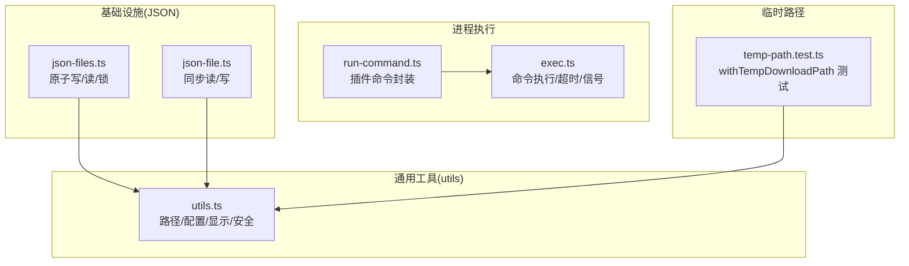
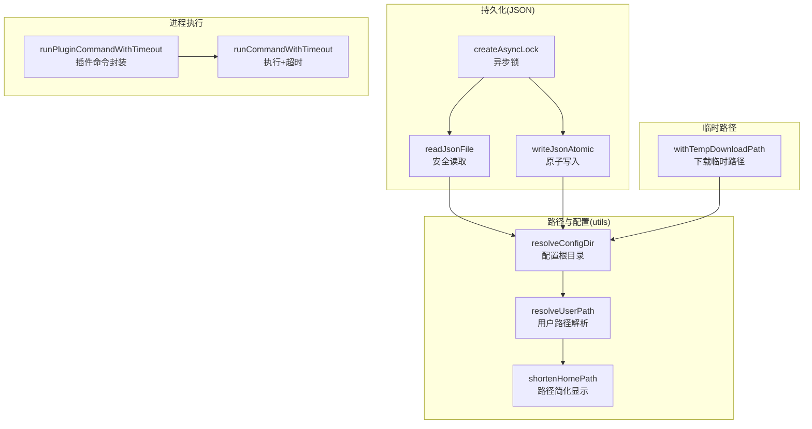
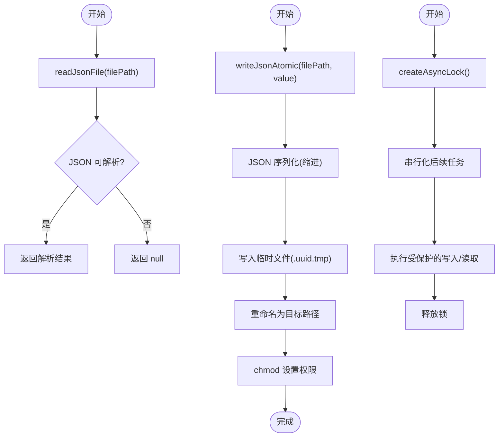
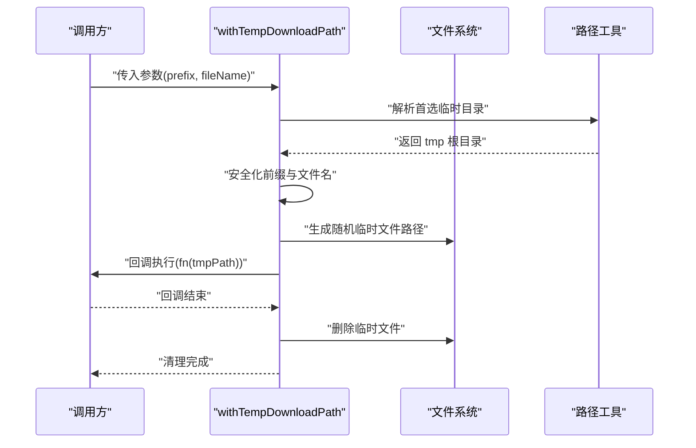
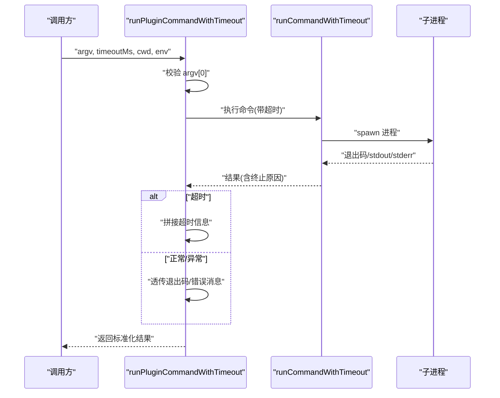
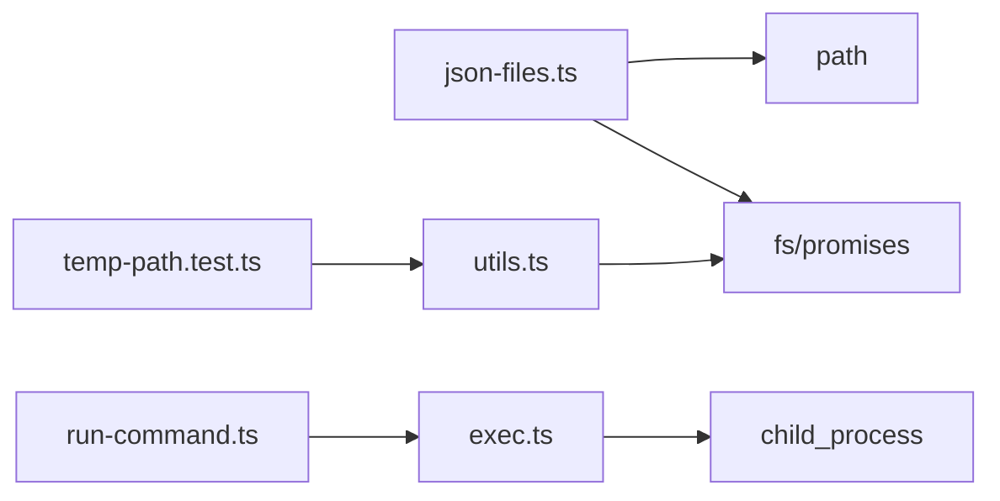

# 通用助手函数

<cite>
**本文引用的文件**
- [src/infra/json-files.ts](file://src/infra/json-files.ts)
- [src/infra/json-file.ts](file://src/infra/json-file.ts)
- [src/utils.ts](file://src/utils.ts)
- [src/plugin-sdk/run-command.ts](file://src/plugin-sdk/run-command.ts)
- [src/process/exec.ts](file://src/process/exec.ts)
- [src/plugin-sdk/temp-path.test.ts](file://src/plugin-sdk/temp-path.test.ts)
- [SECURITY.md](file://SECURITY.md)
</cite>

## 目录
1. [简介](#简介)
2. [项目结构](#项目结构)
3. [核心组件](#核心组件)
4. [架构总览](#架构总览)
5. [详细组件分析](#详细组件分析)
6. [依赖关系分析](#依赖关系分析)
7. [性能考量](#性能考量)
8. [故障排查指南](#故障排查指南)
9. [结论](#结论)
10. [附录](#附录)

## 简介
本文件系统性梳理并说明通用助手工具函数，覆盖以下关键能力：
- JSON 文件读写：原子化写入、安全解析、回退读取
- 临时路径管理：随机临时文件生成、下载路径封装、自动清理
- 命令执行：带超时的插件命令运行、输出与错误处理
- 资源清理与安全：临时文件删除、权限设置、路径规范化
- 性能与可靠性：异步锁、并发控制、平台兼容（含 Windows）

这些工具在插件生态、配置存储、媒体处理与进程调用中广泛使用，是构建稳定、可维护自动化流程的基础。

## 项目结构
围绕“通用助手函数”的相关模块主要分布在如下位置：
- JSON 工具：src/infra/json-files.ts、src/infra/json-file.ts
- 通用工具：src/utils.ts（路径解析、配置目录、显示格式化等）
- 进程执行：src/process/exec.ts、src/plugin-sdk/run-command.ts
- 临时路径：src/plugin-sdk/temp-path.test.ts（测试覆盖 withTempDownloadPath 等）

**图表来源**
- [src/infra/json-files.ts:1-75](file://src/infra/json-files.ts#L1-L75)
- [src/infra/json-file.ts:1-24](file://src/infra/json-file.ts#L1-L24)
- [src/utils.ts:1-376](file://src/utils.ts#L1-L376)
- [src/process/exec.ts](file://src/process/exec.ts)
- [src/plugin-sdk/run-command.ts:1-45](file://src/plugin-sdk/run-command.ts#L1-L45)
- [src/plugin-sdk/temp-path.test.ts:35-71](file://src/plugin-sdk/temp-path.test.ts#L35-L71)

**章节来源**
- [src/infra/json-files.ts:1-75](file://src/infra/json-files.ts#L1-L75)
- [src/infra/json-file.ts:1-24](file://src/infra/json-file.ts#L1-L24)
- [src/utils.ts:1-376](file://src/utils.ts#L1-L376)
- [src/plugin-sdk/run-command.ts:1-45](file://src/plugin-sdk/run-command.ts#L1-L45)
- [src/process/exec.ts](file://src/process/exec.ts)
- [src/plugin-sdk/temp-path.test.ts:35-71](file://src/plugin-sdk/temp-path.test.ts#L35-L71)

## 核心组件
本节聚焦三大类助手函数及其职责边界与使用场景：
- JSON 存储与回退读取：提供安全的 JSON 读取、原子写入与回退策略
- 临时路径管理：生成随机临时文件名、限定前缀与文件名、自动清理
- 命令执行：封装插件命令运行，统一超时、错误与输出处理

**章节来源**
- [src/infra/json-files.ts:5-75](file://src/infra/json-files.ts#L5-L75)
- [src/infra/json-file.ts:4-23](file://src/infra/json-file.ts#L4-L23)
- [src/plugin-sdk/run-command.ts:16-45](file://src/plugin-sdk/run-command.ts#L16-L45)
- [src/process/exec.ts](file://src/process/exec.ts)
- [src/plugin-sdk/temp-path.test.ts:35-71](file://src/plugin-sdk/temp-path.test.ts#L35-L71)

## 架构总览
下图展示“通用助手函数”在系统中的交互关系：JSON 工具负责持久化层，utils 提供路径与配置解析，进程执行模块负责外部命令调用，临时路径模块贯穿媒体下载与临时文件生命周期管理。

**图表来源**
- [src/infra/json-files.ts:5-75](file://src/infra/json-files.ts#L5-L75)
- [src/utils.ts:285-356](file://src/utils.ts#L285-L356)
- [src/process/exec.ts](file://src/process/exec.ts)
- [src/plugin-sdk/run-command.ts:16-45](file://src/plugin-sdk/run-command.ts#L16-L45)
- [src/plugin-sdk/temp-path.test.ts:35-71](file://src/plugin-sdk/temp-path.test.ts#L35-L71)

## 详细组件分析

### JSON 存储与回退读取
- readJsonFile：以 UTF-8 读取文本，尝试 JSON 解析；失败返回空值，避免抛错影响调用方
- writeJsonAtomic：将对象序列化为缩进格式，写入临时文件后重命名为目标路径，确保原子性；支持设置文件与目录权限、追加换行
- writeTextAtomic：通用文本原子写入，内部实现与 writeJsonAtomic 类似，用于非 JSON 场景
- createAsyncLock：基于 Promise 的串行化锁，保证并发写入的互斥与顺序

**图表来源**
- [src/infra/json-files.ts:5-75](file://src/infra/json-files.ts#L5-L75)

**章节来源**
- [src/infra/json-files.ts:5-75](file://src/infra/json-files.ts#L5-L75)

### 临时路径管理
- withTempDownloadPath：在首选临时目录下生成随机临时文件路径，回调结束后自动清理；支持对前缀与文件名进行安全化处理，防止路径穿越
- buildRandomTempFilePath：生成随机临时文件名，常与 withTempDownloadPath 搭配使用
- resolvePreferredOpenClawTmpDir：解析首选临时目录，作为 withTempDownloadPath 的根目录来源

**图表来源**
- [src/plugin-sdk/temp-path.test.ts:35-71](file://src/plugin-sdk/temp-path.test.ts#L35-L71)

**章节来源**
- [src/plugin-sdk/temp-path.test.ts:35-71](file://src/plugin-sdk/temp-path.test.ts#L35-L71)

### 命令执行与超时控制
- runPluginCommandWithTimeout：对插件命令进行统一封装，校验参数、调用底层执行器、处理超时与异常，返回标准化结果
- runCommandWithTimeout：底层执行器，负责进程启动、超时检测、信号处理与输出收集

**图表来源**
- [src/plugin-sdk/run-command.ts:16-45](file://src/plugin-sdk/run-command.ts#L16-L45)
- [src/process/exec.ts](file://src/process/exec.ts)

**章节来源**
- [src/plugin-sdk/run-command.ts:16-45](file://src/plugin-sdk/run-command.ts#L16-L45)
- [src/process/exec.ts](file://src/process/exec.ts)

### 安全与最佳实践
- 临时文件安全：优先使用 withTempDownloadPath 等封装，避免直接使用系统默认临时目录；路径穿越防护通过安全化处理实现
- 权限与可见性：原子写入时设置文件权限与目录权限，尽量最小化权限暴露
- 配置目录：通过 resolveConfigDir 统一解析配置根目录，支持环境变量覆盖

**章节来源**
- [SECURITY.md:205-205](file://SECURITY.md#L205-L205)
- [src/infra/json-files.ts:14-57](file://src/infra/json-files.ts#L14-L57)
- [src/utils.ts:285-303](file://src/utils.ts#L285-L303)

## 依赖关系分析
- JSON 工具依赖 Node 内置 fs/promises 与 path，提供跨平台的原子写入与安全读取
- 进程执行模块依赖 Node child_process，并结合超时与信号机制
- 临时路径模块依赖 utils 中的路径解析与权限设置
- 插件命令封装依赖底层执行器，统一错误与超时处理

**图表来源**
- [src/infra/json-files.ts:1-3](file://src/infra/json-files.ts#L1-L3)
- [src/plugin-sdk/run-command.ts:1-1](file://src/plugin-sdk/run-command.ts#L1-L1)
- [src/process/exec.ts](file://src/process/exec.ts)
- [src/utils.ts:1-11](file://src/utils.ts#L1-L11)
- [src/plugin-sdk/temp-path.test.ts:35-71](file://src/plugin-sdk/temp-path.test.ts#L35-L71)

**章节来源**
- [src/infra/json-files.ts:1-3](file://src/infra/json-files.ts#L1-L3)
- [src/plugin-sdk/run-command.ts:1-1](file://src/plugin-sdk/run-command.ts#L1-L1)
- [src/process/exec.ts](file://src/process/exec.ts)
- [src/utils.ts:1-11](file://src/utils.ts#L1-L11)
- [src/plugin-sdk/temp-path.test.ts:35-71](file://src/plugin-sdk/temp-path.test.ts#L35-L71)

## 性能考量
- 原子写入：通过临时文件 + 重命名减少部分写入阶段的不一致风险，提升可靠性
- 异步锁：createAsyncLock 串行化高并发写入，避免竞争条件与频繁 I/O 抖动
- 平台差异：chmod 在不同平台行为不同，代码采用“尽力而为”策略，避免阻塞主流程
- 超时控制：runCommandWithTimeout 限制进程运行时间，防止长时间占用资源

[本节为通用性能建议，不直接分析具体文件]

## 故障排查指南
- JSON 读取失败或为空：检查文件是否存在、是否为合法 JSON；必要时使用回退策略或日志记录
- 原子写入未生效：确认目标目录存在且具备写权限；留意临时文件残留（最终会清理，但可能短暂占用磁盘）
- 临时文件未清理：确认回调未提前退出或抛出异常；确保使用 withTempDownloadPath 的正确生命周期
- 命令执行超时：调整 timeoutMs 或检查外部程序性能；关注 stdout/stderr 是否包含超时提示
- 权限问题：在非 Windows 平台确认文件权限是否被正确设置；必要时手动修正

**章节来源**
- [src/infra/json-files.ts:5-75](file://src/infra/json-files.ts#L5-L75)
- [src/plugin-sdk/run-command.ts:16-45](file://src/plugin-sdk/run-command.ts#L16-L45)
- [src/plugin-sdk/temp-path.test.ts:35-71](file://src/plugin-sdk/temp-path.test.ts#L35-L71)

## 结论
通用助手函数通过“安全读取/原子写入”“临时路径封装/自动清理”“统一命令执行/超时控制”三大支柱，为上层插件与自动化流程提供了可靠、易用且可维护的基础设施。遵循本文的安全与最佳实践建议，可在多平台环境下获得更稳定的运行表现。

[本节为总结性内容，不直接分析具体文件]

## 附录
- 实用示例（步骤说明）：
  - JSON 写入：使用 writeJsonAtomic 写入配置对象，自动创建父目录并设置权限；读取时使用 readJsonFileWithFallback 作为回退策略
  - 临时文件：使用 withTempDownloadPath 生成随机临时文件路径，回调结束后自动清理；注意前缀与文件名的安全化
  - 命令执行：使用 runPluginCommandWithTimeout 执行插件命令，合理设置超时；根据返回码与错误信息进行分支处理
- 错误处理要点：
  - JSON：捕获解析异常并返回空值，避免中断流程
  - 临时文件：即使清理失败也应继续返回，保证调用方可控
  - 命令：区分超时与异常，分别构造可读的错误信息
- 性能优化建议：
  - 合理使用 createAsyncLock 控制写入并发
  - 对大文件写入采用流式处理（如适用）
  - 为命令设置合理的超时阈值，避免资源泄露

[本节为通用指导，不直接分析具体文件]