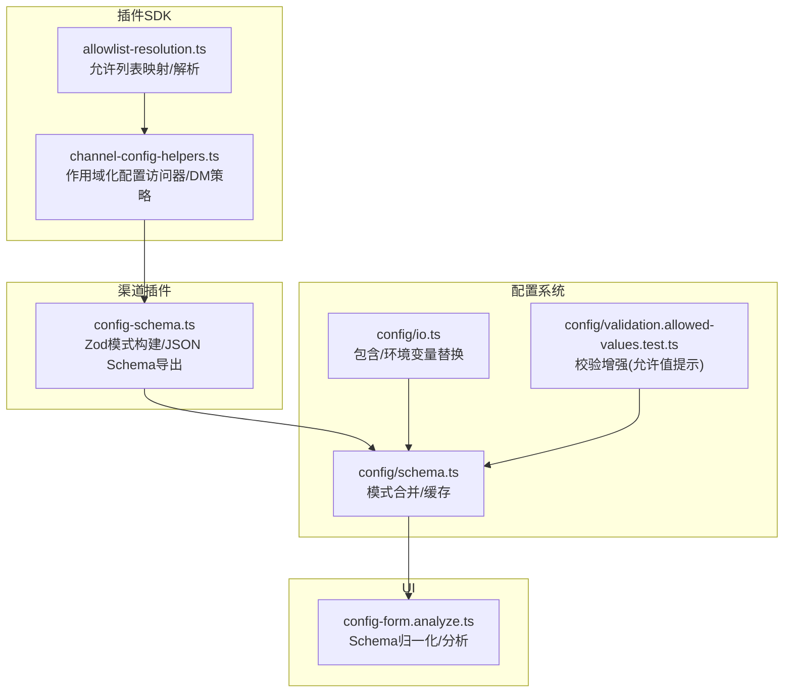
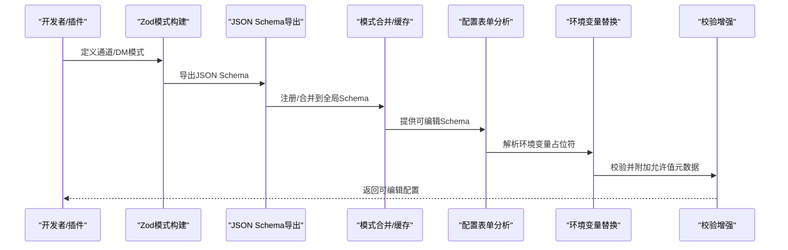
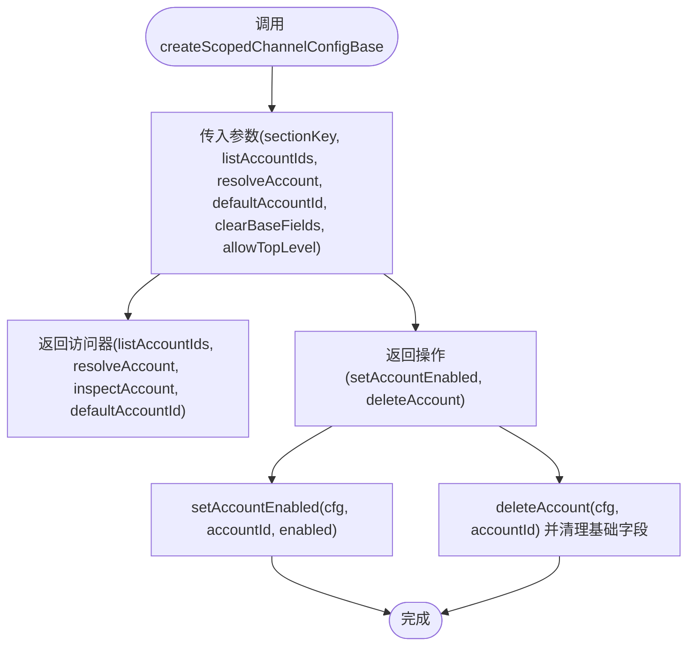
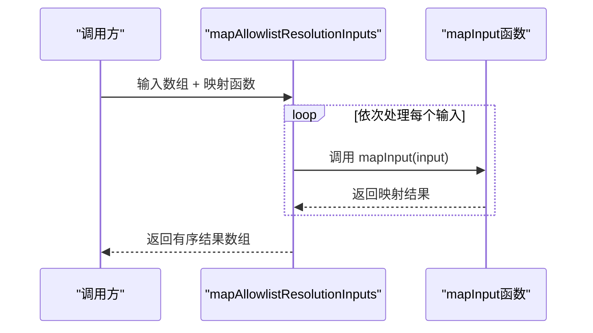
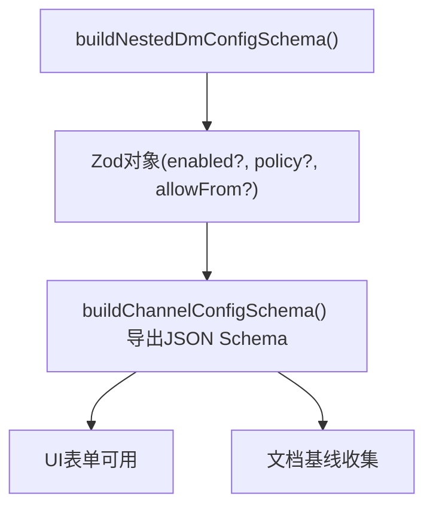
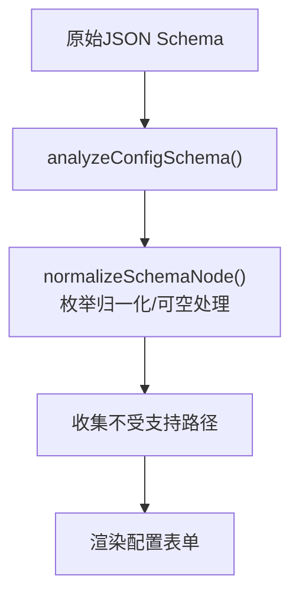
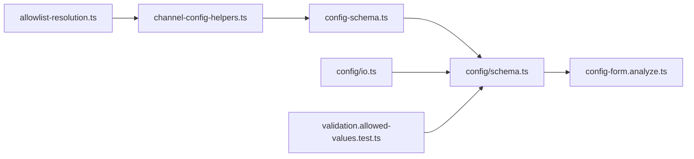

# 配置工具

<cite>
**本文引用的文件**
- [channel-config-helpers.ts](file://src/plugin-sdk/channel-config-helpers.ts)
- [allowlist-resolution.ts](file://src/plugin-sdk/allowlist-resolution.ts)
- [config-schema.ts](file://src/channels/plugins/config-schema.ts)
- [config.ts](file://src/config/schema.ts)
- [config-form.analyze.ts](file://ui/src/ui/views/config-form.analyze.ts)
- [config.ts](file://src/gateway/protocol/schema/config.ts)
- [config.ts](file://src/config/validation.allowed-values.test.ts)
- [config.ts](file://src/config/env-substitution.test.ts)
- [config.ts](file://src/config/io.ts)
- [config.ts](file://src/commands/doctor-legacy-config.ts)
- [config.ts](file://src/config/doc-baseline.ts)
- [config.ts](file://src/config/doc-baseline.test.ts)
- [config-schema-helpers.ts](file://extensions/shared/config-schema-helpers.ts)
</cite>

## 目录
1. [简介](#简介)
2. [项目结构](#项目结构)
3. [核心组件](#核心组件)
4. [架构总览](#架构总览)
5. [详细组件分析](#详细组件分析)
6. [依赖关系分析](#依赖关系分析)
7. [性能考量](#性能考量)
8. [故障排查指南](#故障排查指南)
9. [结论](#结论)
10. [附录](#附录)

## 简介
本文件聚焦于配置相关工具函数与模式定义，系统性梳理配置解析、验证、规范化与集成流程。重点覆盖以下核心能力：
- 作用域化通道配置基座：为多账户通道提供统一的配置访问器与管理接口
- 允许列表映射：对允许来源进行标准化、格式化与并行解析
- 嵌套私信策略模式：以 Zod 模式构建可复用的 DM 安全策略结构
- 配置模式与 UI 提示：从 JSON Schema 归一化到前端可编辑表单
- 默认值与类型安全：通过模式与校验保障配置一致性与可维护性

## 项目结构
围绕配置工具的相关模块分布如下：
- 插件 SDK 层：提供通用的配置访问器、允许列表处理与 DM 安全策略构建
- 渠道插件层：基于 Zod 构建通道配置模式，并输出 JSON Schema
- 配置系统层：负责模式合并、缓存、环境变量替换与校验增强
- UI 层：对 JSON Schema 进行归一化与分析，生成可编辑表单

图表来源
- [channel-config-helpers.ts:1-181](file://src/plugin-sdk/channel-config-helpers.ts#L1-L181)
- [allowlist-resolution.ts:1-31](file://src/plugin-sdk/allowlist-resolution.ts#L1-L31)
- [config-schema.ts:1-55](file://src/channels/plugins/config-schema.ts#L1-L55)
- [config.ts:336-354](file://src/config/schema.ts#L336-L354)
- [config.ts:680-718](file://src/config/io.ts#L680-L718)
- [config.ts:1-34](file://src/config/validation.allowed-values.test.ts#L1-L34)
- [config-form.analyze.ts:1-222](file://ui/src/ui/views/config-form.analyze.ts#L1-L222)

章节来源
- [channel-config-helpers.ts:1-181](file://src/plugin-sdk/channel-config-helpers.ts#L1-L181)
- [allowlist-resolution.ts:1-31](file://src/plugin-sdk/allowlist-resolution.ts#L1-L31)
- [config-schema.ts:1-55](file://src/channels/plugins/config-schema.ts#L1-L55)
- [config.ts:336-354](file://src/config/schema.ts#L336-L354)
- [config.ts:680-718](file://src/config/io.ts#L680-L718)
- [config.ts:1-34](file://src/config/validation.allowed-values.test.ts#L1-L34)
- [config-form.analyze.ts:1-222](file://ui/src/ui/views/config-form.analyze.ts#L1-L222)

## 核心组件
- createScopedChannelConfigBase：为通道配置提供作用域化的访问器与管理操作（列出账户、解析账户、默认账户、启用/删除账户）
- mapAllowlistResolutionInputs：对允许列表输入进行顺序映射与解析，保持输入顺序
- buildNestedDmConfigSchema：以 Zod 构建嵌套 DM 安全策略的可选对象模式，支持启用、策略与允许来源

章节来源
- [channel-config-helpers.ts:63-106](file://src/plugin-sdk/channel-config-helpers.ts#L63-L106)
- [allowlist-resolution.ts:21-30](file://src/plugin-sdk/allowlist-resolution.ts#L21-L30)
- [config-schema.ts:16-24](file://src/channels/plugins/config-schema.ts#L16-L24)

## 架构总览
配置工具链从“模式定义”到“解析/校验/渲染”的端到端流程如下：

图表来源
- [config-schema.ts:35-54](file://src/channels/plugins/config-schema.ts#L35-L54)
- [config.ts:336-354](file://src/config/schema.ts#L336-L354)
- [config-form.analyze.ts:27-32](file://ui/src/ui/views/config-form.analyze.ts#L27-L32)
- [config.ts:698-718](file://src/config/io.ts#L698-L718)
- [config.ts:5-18](file://src/config/validation.allowed-values.test.ts#L5-L18)

## 详细组件分析

### 组件A：作用域化通道配置基座（createScopedChannelConfigBase）
- 能力概述
  - 列出账户 ID、解析账户、检查账户、设置默认账户
  - 启用/禁用账户、删除账户（清理基础字段）
  - 可选择是否允许在顶层进行开关控制
- 关键参数
  - sectionKey：配置分段键
  - listAccountIds/defaultAccountId：账户枚举与默认账户解析
  - resolveAccount/inspectAccount：账户解析与检查
  - clearBaseFields：删除账户时清理的基础字段集合
  - allowTopLevel：是否允许顶层开关
- 使用场景
  - 多账户通道（如 WhatsApp、iMessage）的统一管理入口
  - 在 UI 中展示账户列表、切换启用状态、删除账户并清理残留字段

图表来源
- [channel-config-helpers.ts:63-106](file://src/plugin-sdk/channel-config-helpers.ts#L63-L106)

章节来源
- [channel-config-helpers.ts:63-106](file://src/plugin-sdk/channel-config-helpers.ts#L63-L106)

### 组件B：允许列表映射（mapAllowlistResolutionInputs）
- 能力概述
  - 对字符串数组进行顺序映射，支持同步或异步映射函数
  - 保持输入顺序，便于后续汇总与去重
- 典型用途
  - 将用户输入的允许来源（如群组名、ID）映射为统一格式
  - 支持并行解析但保留顺序，提升性能同时保证语义正确性

图表来源
- [allowlist-resolution.ts:21-30](file://src/plugin-sdk/allowlist-resolution.ts#L21-L30)

章节来源
- [allowlist-resolution.ts:21-30](file://src/plugin-sdk/allowlist-resolution.ts#L21-L30)

### 组件C：嵌套 DM 配置模式（buildNestedDmConfigSchema）
- 能力概述
  - 以 Zod 构建可选对象模式，包含 enabled、policy、allowFrom 字段
  - allowFrom 支持字符串与数字混合列表
  - 输出兼容 JSON Schema，用于 UI 表单与文档生成
- 扩展能力
  - 通过 buildCatchallMultiAccountChannelSchema 为账户对象提供 catchall 扩展与默认账户字段

图表来源
- [config-schema.ts:16-24](file://src/channels/plugins/config-schema.ts#L16-L24)
- [config-schema.ts:26-33](file://src/channels/plugins/config-schema.ts#L26-L33)
- [config-schema.ts:35-54](file://src/channels/plugins/config-schema.ts#L35-L54)

章节来源
- [config-schema.ts:16-24](file://src/channels/plugins/config-schema.ts#L16-L24)
- [config-schema.ts:26-33](file://src/channels/plugins/config-schema.ts#L26-L33)
- [config-schema.ts:35-54](file://src/channels/plugins/config-schema.ts#L35-L54)

### 组件D：配置模式与 UI 提示（Schema 归一化与分析）
- 能力概述
  - 分析 JSON Schema，识别不支持的联合类型、枚举归一化、可空性处理
  - 将 additionalProperties: true 视为动态对象键，支持编辑
  - 生成不受支持路径列表，辅助 UI 降级处理
- 与 UI 的集成
  - UI 侧根据分析结果渲染表单控件，支持标签、敏感项、占位符等提示

图表来源
- [config-form.analyze.ts:27-32](file://ui/src/ui/views/config-form.analyze.ts#L27-L32)
- [config-form.analyze.ts:34-119](file://ui/src/ui/views/config-form.analyze.ts#L34-L119)

章节来源
- [config-form.analyze.ts:1-222](file://ui/src/ui/views/config-form.analyze.ts#L1-L222)

### 组件E：配置模式响应与查找（ConfigSchemaResponse 与查找）
- 能力概述
  - 定义配置模式响应结构：schema、uiHints、version、generatedAt
  - 定义子节点查找结构：key、path、type、required、hasChildren、hint 等
- 用途
  - 作为跨进程/跨界面传递配置模式的标准契约

章节来源
- [config.ts:53-100](file://src/gateway/protocol/schema/config.ts#L53-L100)

### 组件F：允许值提示与校验增强
- 能力概述
  - 在校验失败时附加 allowedValues 与隐藏数量统计
  - 保留原生枚举消息，同时补充可读的允许值提示
- 场景
  - 当 update.channel 或 channels.<channel>.dmPolicy 出错时，提示合法值集合

章节来源
- [config.ts:1-34](file://src/config/validation.allowed-values.test.ts#L1-L34)

### 组件G：环境变量替换与包含文件
- 能力概述
  - 读取配置包含文件，解析 JSON5
  - 应用 config.env 到 process.env 后再进行占位符替换
  - 记录缺失变量警告，避免关键配置崩溃
- 注意
  - 非关键配置段落中未设置的变量以警告形式提示

章节来源
- [config.ts:680-718](file://src/config/io.ts#L680-L718)
- [config.ts:227-271](file://src/config/env-substitution.test.ts#L227-L271)

### 组件H：DM 策略约束（requireChannelOpenAllowFrom）
- 能力概述
  - 当 DM 策略为 open 时，要求 allowFrom 包含通配符条目
  - 通过 refine 上下文向校验器报告错误位置与消息
- 用途
  - 强制策略与允许列表的一致性，防止误配置

章节来源
- [config-schema-helpers.ts:11-25](file://extensions/shared/config-schema-helpers.ts#L11-L25)

## 依赖关系分析
- 插件 SDK 依赖渠道插件的 Zod 模式与 JSON Schema 导出
- 配置系统负责模式合并与缓存，为 UI 提供稳定契约
- UI 侧对 JSON Schema 进行归一化与分析，生成可编辑表单
- 环境变量替换与校验增强贯穿读取与写回流程

图表来源
- [channel-config-helpers.ts:1-181](file://src/plugin-sdk/channel-config-helpers.ts#L1-L181)
- [allowlist-resolution.ts:1-31](file://src/plugin-sdk/allowlist-resolution.ts#L1-L31)
- [config-schema.ts:1-55](file://src/channels/plugins/config-schema.ts#L1-L55)
- [config.ts:336-354](file://src/config/schema.ts#L336-L354)
- [config-form.analyze.ts:1-222](file://ui/src/ui/views/config-form.analyze.ts#L1-L222)
- [config.ts:680-718](file://src/config/io.ts#L680-L718)
- [config.ts:1-34](file://src/config/validation.allowed-values.test.ts#L1-L34)

章节来源
- [channel-config-helpers.ts:1-181](file://src/plugin-sdk/channel-config-helpers.ts#L1-L181)
- [allowlist-resolution.ts:1-31](file://src/plugin-sdk/allowlist-resolution.ts#L1-L31)
- [config-schema.ts:1-55](file://src/channels/plugins/config-schema.ts#L1-L55)
- [config.ts:336-354](file://src/config/schema.ts#L336-L354)
- [config-form.analyze.ts:1-222](file://ui/src/ui/views/config-form.analyze.ts#L1-L222)
- [config.ts:680-718](file://src/config/io.ts#L680-L718)
- [config.ts:1-34](file://src/config/validation.allowed-values.test.ts#L1-L34)

## 性能考量
- 允许列表映射采用顺序遍历，适合中小规模输入；若输入量大，建议结合批量去重与缓存策略
- 模式合并与缓存限制了重复计算，建议控制缓存大小上限并定期清理
- UI 归一化对复杂联合类型进行降级处理，避免渲染阻塞
- 环境变量替换在读取阶段一次性完成，减少运行时开销

## 故障排查指南
- 未知键导致校验失败
  - 现象：更新配置时报未知键错误
  - 排查：确认键名拼写与层级，参考严格配置重构说明
- 允许值提示缺失
  - 现象：校验错误未显示允许值列表
  - 排查：检查校验增强逻辑是否生效，确认枚举定义完整
- 环境变量未替换
  - 现象：配置中 ${VAR} 未被替换
  - 排查：确认 config.env 是否存在，检查占位符命名规范与大小写
- DM 策略与允许列表不一致
  - 现象：策略为 open 但未包含通配符条目
  - 排查：使用 requireChannelOpenAllowFrom 约束，确保 allowFrom 包含所需条目

章节来源
- [config.ts:1-34](file://src/config/validation.allowed-values.test.ts#L1-L34)
- [config.ts:227-271](file://src/config/env-substitution.test.ts#L227-L271)
- [config-schema-helpers.ts:11-25](file://extensions/shared/config-schema-helpers.ts#L11-L25)

## 结论
本文档系统化梳理了配置工具链的关键函数与模式，覆盖从模式定义、解析、校验到 UI 渲染的全流程。通过作用域化访问器、允许列表映射与嵌套 DM 模式，实现了多账户通道的统一管理与类型安全。配合环境变量替换与校验增强，提升了配置的可维护性与可观测性。

## 附录
- 实用示例（步骤化）
  - 定义通道 DM 模式：使用 buildNestedDmConfigSchema 构建对象模式，导出 JSON Schema
  - 注册到全局：将通道配置模式合并到全局 Schema，供 UI 与文档使用
  - 构建访问器：调用 createScopedChannelConfigBase，传入账户解析与清理字段
  - 允许列表处理：使用 mapAllowlistResolutionInputs 对输入进行顺序映射
  - 校验与提示：启用校验增强，确保错误时显示允许值列表
  - 环境变量：在读取阶段应用 config.env 并替换占位符，记录缺失警告

- 最佳实践
  - 使用 Zod 模式定义强类型配置，导出 JSON Schema 供 UI 使用
  - 对允许列表进行标准化与格式化，避免歧义
  - 严格校验策略与允许列表的关系，防止误配置
  - 将非关键配置段落的缺失变量以警告形式处理，避免整体崩溃