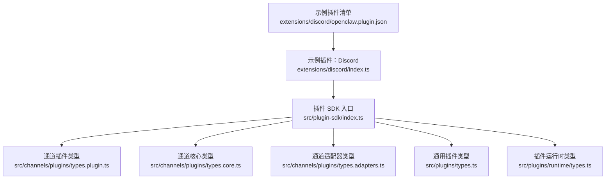
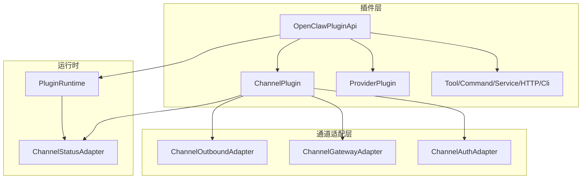
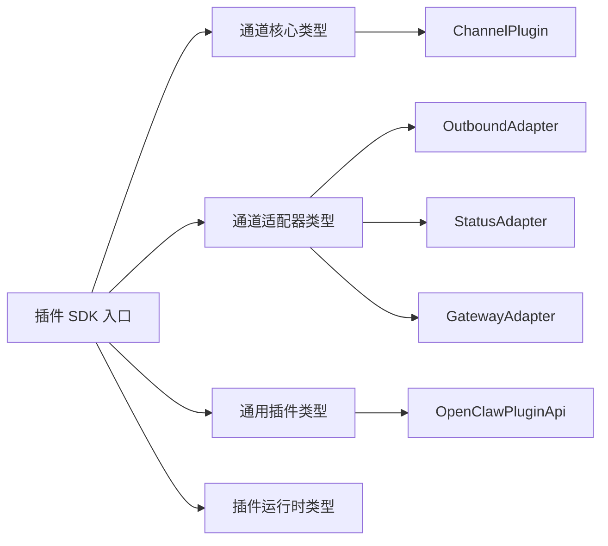

# 插件 SDK 参考

<cite>
**本文档引用的文件**
- [index.ts](file://src/plugin-sdk/index.ts)
- [types.plugin.ts](file://src/channels/plugins/types.plugin.ts)
- [types.core.ts](file://src/channels/plugins/types.core.ts)
- [types.adapters.ts](file://src/channels/plugins/types.adapters.ts)
- [types.ts](file://src/plugins/types.ts)
- [types.ts（运行时）](file://src/plugins/runtime/types.ts)
- [index.ts（Discord 插件）](file://extensions/discord/index.ts)
- [openclaw.plugin.json（Discord 插件清单）](file://extensions/discord/openclaw.plugin.json)
</cite>

## 目录
1. [简介](#简介)
2. [项目结构](#项目结构)
3. [核心组件](#核心组件)
4. [架构总览](#架构总览)
5. [详细组件分析](#详细组件分析)
6. [依赖关系分析](#依赖关系分析)
7. [性能考量](#性能考量)
8. [故障排查指南](#故障排查指南)
9. [结论](#结论)
10. [附录](#附录)

## 简介
本参考文档面向插件开发者，系统性梳理 OpenClaw 插件 SDK 的 API 接口、类型定义与工具函数，覆盖以下关键主题：
- 核心插件接口：ChannelPlugin、ProviderPlugin、ToolPlugin 等
- 插件生命周期钩子与事件处理机制
- 状态管理与运行时能力
- 参数说明、返回值类型与使用示例路径
- 错误处理模式与最佳实践

## 项目结构
OpenClaw 将插件 SDK 的导出集中在统一入口，并按职责拆分到通道适配器、运行时、工具与通用类型模块中。下图展示与插件开发相关的关键模块与文件：

图表来源
- [index.ts:1-872](file://src/plugin-sdk/index.ts#L1-L872)
- [types.plugin.ts:1-85](file://src/channels/plugins/types.plugin.ts#L1-L85)
- [types.core.ts:1-410](file://src/channels/plugins/types.core.ts#L1-L410)
- [types.adapters.ts:1-386](file://src/channels/plugins/types.adapters.ts#L1-L386)
- [types.ts:1-1775](file://src/plugins/types.ts#L1-L1775)
- [types.ts（运行时）:1-64](file://src/plugins/runtime/types.ts#L1-L64)
- [index.ts（Discord 插件）:1-23](file://extensions/discord/index.ts#L1-L23)
- [openclaw.plugin.json（Discord 插件清单）:1-10](file://extensions/discord/openclaw.plugin.json#L1-L10)

章节来源
- [index.ts:1-872](file://src/plugin-sdk/index.ts#L1-L872)

## 核心组件
本节概述插件 SDK 的三大核心类型族与运行时能力，帮助快速定位 API 范畴。

- 通道插件（ChannelPlugin）
  - 定义：通道插件是对接具体消息平台（如 Discord、Slack、Telegram 等）的扩展单元，负责配置、认证、消息收发、状态监控、网关交互等。
  - 关键类型：ChannelPlugin、ChannelConfigAdapter、ChannelOutboundAdapter、ChannelStatusAdapter、ChannelGatewayAdapter、ChannelAuthAdapter、ChannelGroupAdapter、ChannelMentionAdapter、ChannelThreadingAdapter、ChannelMessagingAdapter、ChannelAgentPromptAdapter、ChannelDirectoryAdapter、ChannelResolverAdapter、ChannelMessageActionAdapter、ChannelHeartbeatAdapter、ChannelElevatedAdapter、ChannelCommandAdapter、ChannelSecurityAdapter 等。
  - 入口类型：见 [types.plugin.ts:49-84](file://src/channels/plugins/types.plugin.ts#L49-L84)。

- 提供商插件（ProviderPlugin）
  - 定义：为模型提供商（如 OpenAI、Anthropic、Ollama 等）提供认证、目录发现、动态模型解析、流式包装、用量查询等能力。
  - 关键类型：ProviderPlugin、ProviderAuthMethod、ProviderCatalogContext、ProviderRuntimeModel、ProviderPrepareRuntimeAuthContext、ProviderResolveUsageAuthContext、ProviderFetchUsageSnapshotContext、ProviderPrepareExtraParamsContext、ProviderWrapStreamFnContext 等。
  - 入口类型：见 [types.ts:545-738](file://src/plugins/types.ts#L545-L738)。

- 工具插件（ToolPlugin）
  - 定义：通过注册 Agent 工具或工厂函数，向智能体暴露可调用能力；也可注册命令、交互式处理器、HTTP 路由、CLI 命令等。
  - 关键类型：OpenClawPluginApi、OpenClawPluginDefinition、OpenClawPluginToolFactory、OpenClawPluginCommandDefinition、PluginInteractiveHandlerRegistration、OpenClawPluginHttpRouteParams、OpenClawPluginCliRegistrar、OpenClawPluginService 等。
  - 入口类型：见 [types.ts:1083-1147](file://src/plugins/types.ts#L1083-L1147)。

- 运行时（PluginRuntime）
  - 定义：插件在运行期可访问的能力集合，包括子代理（subagent）调度、会话管理、通道辅助工具等。
  - 关键类型：PluginRuntime、SubagentRunParams、SubagentRunResult、SubagentWaitParams、SubagentWaitResult、SubagentGetSessionMessagesParams、SubagentGetSessionMessagesResult、SubagentDeleteSessionParams。
  - 入口类型：见 [types.ts（运行时）:51-63](file://src/plugins/runtime/types.ts#L51-L63)。

章节来源
- [types.plugin.ts:49-84](file://src/channels/plugins/types.plugin.ts#L49-L84)
- [types.core.ts:12-410](file://src/channels/plugins/types.core.ts#L12-L410)
- [types.adapters.ts:24-386](file://src/channels/plugins/types.adapters.ts#L24-L386)
- [types.ts:545-738](file://src/plugins/types.ts#L545-L738)
- [types.ts（运行时）:51-63](file://src/plugins/runtime/types.ts#L51-L63)

## 架构总览
下图展示插件 SDK 的高层架构：插件通过 OpenClawPluginApi 注册各类能力，通道插件对接具体平台，提供商插件提供模型与认证支持，运行时提供会话与子代理能力。

图表来源
- [types.ts:1100-1147](file://src/plugins/types.ts#L1100-L1147)
- [types.ts（运行时）:51-63](file://src/plugins/runtime/types.ts#L51-L63)
- [types.adapters.ts:110-291](file://src/channels/plugins/types.adapters.ts#L110-L291)
- [types.plugin.ts:49-84](file://src/channels/plugins/types.plugin.ts#L49-L84)

## 详细组件分析

### 通道插件（ChannelPlugin）API 规范
- 结构概览
  - 必填字段：id、meta、capabilities、config
  - 可选扩展：setup、pairing、security、groups、mentions、outbound、status、gatewayMethods、gateway、auth、elevated、commands、streaming、threading、messaging、agentPrompt、directory、resolver、actions、heartbeat、agentTools
  - 参考路径：[types.plugin.ts:49-84](file://src/channels/plugins/types.plugin.ts#L49-L84)

- 关键适配器说明
  - 配置与账户：ChannelConfigAdapter
  - 出站发送：ChannelOutboundAdapter（含 deliveryMode、chunker、resolveTarget、sendPayload、sendText、sendMedia、sendPoll）
  - 状态与探测：ChannelStatusAdapter（buildChannelSummary、probeAccount、auditAccount、buildAccountSnapshot、logSelfId、resolveAccountState、collectStatusIssues）
  - 网关与登录：ChannelGatewayAdapter（startAccount、stopAccount、loginWithQrStart、loginWithQrWait、logoutAccount）
  - 认证：ChannelAuthAdapter（login）
  - 分组与提及：ChannelGroupAdapter、ChannelMentionAdapter
  - 线程：ChannelThreadingAdapter（resolveReplyToMode、allowExplicitReplyTagsWhenOff、buildToolContext）
  - 消息：ChannelMessagingAdapter（normalizeTarget、targetResolver、formatTargetDisplay）
  - 代理提示：ChannelAgentPromptAdapter（messageToolHints）
  - 目录与解析：ChannelDirectoryAdapter、ChannelResolverAdapter
  - 动作：ChannelMessageActionAdapter（listActions、supportsAction、getCapabilities、extractToolSend、handleAction）
  - 心跳：ChannelHeartbeatAdapter（checkReady、resolveRecipients）
  - 提升权限：ChannelElevatedAdapter（allowFromFallback）
  - 命令：ChannelCommandAdapter（enforceOwnerForCommands、skipWhenConfigEmpty）
  - 安全：ChannelSecurityAdapter（resolveDmPolicy、collectWarnings）

- 使用示例路径
  - 注册通道插件：参见 [index.ts（Discord 插件）:12-20](file://extensions/discord/index.ts#L12-L20)
  - 清单声明：参见 [openclaw.plugin.json（Discord 插件清单）:1-10](file://extensions/discord/openclaw.plugin.json#L1-L10)

章节来源
- [types.plugin.ts:49-84](file://src/channels/plugins/types.plugin.ts#L49-L84)
- [types.adapters.ts:24-386](file://src/channels/plugins/types.adapters.ts#L24-L386)
- [types.core.ts:14-410](file://src/channels/plugins/types.core.ts#L14-L410)
- [index.ts（Discord 插件）:12-20](file://extensions/discord/index.ts#L12-L20)
- [openclaw.plugin.json（Discord 插件清单）:1-10](file://extensions/discord/openclaw.plugin.json#L1-L10)

### 提供商插件（ProviderPlugin）API 规范
- 结构概览
  - 必填：id、label、auth（ProviderAuthMethod 数组）
  - 可选扩展：catalog/discovery、resolveDynamicModel、prepareDynamicModel、normalizeResolvedModel、capabilities、prepareExtraParams、wrapStreamFn、prepareRuntimeAuth、resolveUsageAuth、fetchUsageSnapshot、isCacheTtlEligible、buildMissingAuthMessage、suppressBuiltInModel、augmentModelCatalog、isBinaryThinking、supportsXHighThinking、resolveDefaultThinkingLevel、isModernModelRef、wizard、formatApiKey、refreshOAuth、onModelSelected
  - 参考路径：[types.ts:545-738](file://src/plugins/types.ts#L545-L738)

- 认证与运行时
  - ProviderAuthContext、ProviderAuthResult、ProviderAuthMethod、ProviderAuthKind
  - ProviderPrepareRuntimeAuthContext、ProviderPreparedRuntimeAuth
  - ProviderResolveUsageAuthContext、ProviderResolvedUsageAuth、ProviderFetchUsageSnapshotContext
  - 参考路径：[types.ts:115-182](file://src/plugins/types.ts#L115-L182)

- 目录与模型
  - ProviderCatalogContext、ProviderCatalogResult、ProviderRuntimeModel
  - ProviderResolveDynamicModelContext、ProviderPrepareDynamicModelContext、ProviderNormalizeResolvedModelContext
  - 参考路径：[types.ts:197-276](file://src/plugins/types.ts#L197-L276)

- 使用示例路径
  - Provider 插件注册与能力扩展：参见 [types.ts:545-738](file://src/plugins/types.ts#L545-L738)

章节来源
- [types.ts:115-182](file://src/plugins/types.ts#L115-L182)
- [types.ts:197-276](file://src/plugins/types.ts#L197-L276)
- [types.ts:545-738](file://src/plugins/types.ts#L545-L738)

### 工具插件（ToolPlugin）与通用插件 API
- OpenClawPluginApi
  - 能力：registerTool、registerHook、registerHttpRoute、registerChannel、registerGatewayMethod、registerCli、registerService、registerProvider、registerWebSearchProvider、registerInteractiveHandler、registerCommand、registerContextEngine、resolvePath、on
  - 参考路径：[types.ts:1100-1147](file://src/plugins/types.ts#L1100-L1147)

- 工具与命令
  - OpenClawPluginToolFactory、OpenClawPluginToolContext、OpenClawPluginCommandDefinition
  - 参考路径：[types.ts:89-91](file://src/plugins/types.ts#L89-L91)、[types.ts:860-877](file://src/plugins/types.ts#L860-L877)

- 交互式处理器
  - PluginInteractiveHandlerRegistration（Telegram/Discord/Slack）
  - 参考路径：[types.ts:1035-1038](file://src/plugins/types.ts#L1035-L1038)、[types.ts:1011-1033](file://src/plugins/types.ts#L1011-L1033)、[types.ts:929-962](file://src/plugins/types.ts#L929-L962)、[types.ts:889-923](file://src/plugins/types.ts#L889-L923)

- HTTP 路由与 CLI
  - OpenClawPluginHttpRouteParams、OpenClawPluginCliRegistrar
  - 参考路径：[types.ts:1048-1054](file://src/plugins/types.ts#L1048-L1054)、[types.ts:1056-1063](file://src/plugins/types.ts#L1056-L1063)

- 服务与上下文引擎
  - OpenClawPluginService、registerContextEngine
  - 参考路径：[types.ts:1072-1076](file://src/plugins/types.ts#L1072-L1076)、[types.ts:1135-1139](file://src/plugins/types.ts#L1135-L1139)

- 使用示例路径
  - 插件注册与通道注册：参见 [index.ts（Discord 插件）:12-20](file://extensions/discord/index.ts#L12-L20)

章节来源
- [types.ts:89-91](file://src/plugins/types.ts#L89-L91)
- [types.ts:860-877](file://src/plugins/types.ts#L860-L877)
- [types.ts:1035-1038](file://src/plugins/types.ts#L1035-L1038)
- [types.ts:1011-1033](file://src/plugins/types.ts#L1011-L1033)
- [types.ts:929-962](file://src/plugins/types.ts#L929-L962)
- [types.ts:889-923](file://src/plugins/types.ts#L889-L923)
- [types.ts:1048-1054](file://src/plugins/types.ts#L1048-L1054)
- [types.ts:1056-1063](file://src/plugins/types.ts#L1056-L1063)
- [types.ts:1072-1076](file://src/plugins/types.ts#L1072-L1076)
- [types.ts:1135-1139](file://src/plugins/types.ts#L1135-L1139)
- [index.ts（Discord 插件）:12-20](file://extensions/discord/index.ts#L12-L20)

### 插件生命周期钩子与事件处理机制
- 钩子名称集合与校验
  - 包括：before_model_resolve、before_prompt_build、before_agent_start、llm_input、llm_output、agent_end、before_compaction、after_compaction、before_reset、inbound_claim、message_received、message_sending、message_sent、before_tool_call、after_tool_call、tool_result_persist、before_message_write、session_start、session_end、subagent_spawning、subagent_delivery_target、subagent_spawned、subagent_ended、gateway_start、gateway_stop
  - 参考路径：[types.ts:1166-1219](file://src/plugins/types.ts#L1166-L1219)

- 钩子事件与结果
  - 代理阶段：before_model_resolve、before_prompt_build、before_agent_start、llm_input、llm_output、agent_end
  - 内容压缩：before_compaction、after_compaction、before_reset
  - 消息阶段：inbound_claim、message_received、message_sending、message_sent
  - 工具阶段：before_tool_call、after_tool_call、tool_result_persist、before_message_write
  - 会话阶段：session_start、session_end
  - 子代理阶段：subagent_spawning、subagent_delivery_target、subagent_spawned、subagent_ended
  - 网关阶段：gateway_start、gateway_stop
  - 参考路径：[types.ts:1256-1766](file://src/plugins/types.ts#L1256-L1766)

- 钩子注册与优先级
  - 使用 on(hookName, handler, opts?) 注册，支持优先级控制
  - 参考路径：[types.ts:1142-1146](file://src/plugins/types.ts#L1142-L1146)

- 使用示例路径
  - 钩子注册与事件处理：参见 [types.ts:1665-1766](file://src/plugins/types.ts#L1665-L1766)

章节来源
- [types.ts:1166-1219](file://src/plugins/types.ts#L1166-L1219)
- [types.ts:1256-1766](file://src/plugins/types.ts#L1256-L1766)
- [types.ts:1142-1146](file://src/plugins/types.ts#L1142-L1146)

### 状态管理与运行时能力
- 运行时类型
  - PluginRuntime：包含 subagent 与 channel 两部分
  - Subagent API：run、waitForRun、getSessionMessages、getSession（已废弃）、deleteSession
  - 参考路径：[types.ts（运行时）:51-63](file://src/plugins/runtime/types.ts#L51-L63)

- 通道运行时（channelRuntime）
  - 外部通道插件可通过 ChannelGatewayContext.channelRuntime 访问 AI 回复派发、文本处理、会话管理、媒体加载、命令授权、群组策略、配对等功能
  - 参考路径：[types.adapters.ts:170-241](file://src/channels/plugins/types.adapters.ts#L170-L241)

- 使用示例路径
  - 运行时能力使用：参见 [types.ts（运行时）:51-63](file://src/plugins/runtime/types.ts#L51-L63)

章节来源
- [types.ts（运行时）:51-63](file://src/plugins/runtime/types.ts#L51-L63)
- [types.adapters.ts:170-241](file://src/channels/plugins/types.adapters.ts#L170-L241)

### 数据模型与工具函数
- 数据模型
  - ChannelAccountSnapshot、ChannelMeta、ChannelCapabilities、ChannelGroupContext、ChannelThreadingContext、ChannelThreadingToolContext、ChannelMessageActionContext、ChannelPollContext、BaseProbeResult、BaseTokenResolution
  - 参考路径：[types.core.ts:100-410](file://src/channels/plugins/types.core.ts#L100-L410)

- 工具函数（SDK 导出）
  - 文件锁：acquireFileLock、withFileLock
  - 请求 URL 解析：resolveRequestUrl
  - Discord 发送选项构建：buildDiscordSendOptions、buildDiscordSendMediaOptions、tagDiscordChannelResult
  - 键控异步队列：enqueueKeyedTask、KeyedAsyncQueue、KeyedAsyncQueueHooks
  - Webhook 路径与目标：normalizeWebhookPath、resolveWebhookPath、registerWebhookTarget、registerWebhookTargetWithPluginRoute、rejectNonPostWebhookRequest、resolveWebhookTargetWithAuthOrReject、resolveSingleWebhookTarget、resolveSingleWebhookTargetAsync、resolveWebhookTargets、withResolvedWebhookRequestPipeline
  - Webhook 请求守卫：applyBasicWebhookRequestGuards、beginWebhookRequestPipelineOrReject、createWebhookInFlightLimiter、isJsonContentType、readWebhookBodyOrReject、readJsonWebhookBodyOrReject、WEBHOOK_BODY_READ_DEFAULTS、WEBHOOK_IN_FLIGHT_DEFAULTS
  - 通道生命周期：createAccountStatusSink、keepHttpServerTaskAlive、runPassiveAccountLifecycle、waitUntilAbort
  - 媒体负载：buildAgentMediaPayload、buildMediaPayload
  - 状态汇总：buildBaseAccountStatusSnapshot、buildBaseChannelStatusSummary、buildComputedAccountStatusSnapshot、buildProbeChannelStatusSummary、buildRuntimeAccountStatusSnapshot、buildTokenChannelStatusSummary、collectStatusIssuesFromLastError、createDefaultChannelRuntimeState
  - 允许列表解析：mapAllowlistResolutionInputs、mapBasicAllowlistResolutionEntries、BasicAllowlistResolutionEntry
  - 组访问与命令授权：evaluateGroupRouteAccessForPolicy、evaluateMatchedGroupAccessForPolicy、evaluateSenderGroupAccess、evaluateSenderGroupAccessForPolicy、resolveSenderScopedGroupPolicy、resolveDirectDmAuthorizationOutcome、resolveSenderCommandAuthorization、resolveSenderCommandAuthorizationWithRuntime
  - 文本分块与布尔参数：chunkTextForOutbound、readBooleanParam
  - JSON 存储：readJsonFileWithFallback、writeJsonFileAtomically
  - OAuth 工具：generatePkceVerifierChallenge、toFormUrlEncoded
  - 临时路径：buildRandomTempFilePath、withTempDownloadPath
  - Windows 程序执行：applyWindowsSpawnProgramPolicy、materializeWindowsSpawnProgram、resolveWindowsExecutablePath、resolveWindowsSpawnProgramCandidate、resolveWindowsSpawnProgram、ResolveWindowsSpawnProgramCandidateParams、ResolveWindowsSpawnProgramParams、WindowsSpawnCandidateResolution、WindowsSpawnInvocation、WindowsSpawnProgramCandidate、WindowsSpawnProgram、WindowsSpawnResolution
  - 命令执行：runPluginCommandWithTimeout、PluginCommandRunOptions、PluginCommandRunResult
  - 时间格式化：formatUtcTimestamp、formatZonedTimestamp、resolveTimezone
  - Webhook 内存守卫：createBoundedCounter、createFixedWindowRateLimiter、createWebhookAnomalyTracker、WEBHOOK_ANOMALY_COUNTER_DEFAULTS、WEBHOOK_ANOMALY_STATUS_CODES、WEBHOOK_RATE_LIMIT_DEFAULTS
  - SSRF 政策：fetchWithSsrFGuard、SsrFBlockedError、isBlockedHostname、isBlockedHostnameOrIp、isPrivateIpAddress、buildHostnameAllowlistPolicyFromSuffixAllowlist、isHttpsUrlAllowedByHostnameSuffixAllowlist、normalizeHostnameSuffixAllowlist、SsrFPolicy
  - 获取令牌与鉴权：fetchWithBearerAuthScopeFallback、ScopeTokenProvider
  - 参考路径：[index.ts:172-491](file://src/plugin-sdk/index.ts#L172-L491)

章节来源
- [types.core.ts:100-410](file://src/channels/plugins/types.core.ts#L100-L410)
- [index.ts:172-491](file://src/plugin-sdk/index.ts#L172-L491)

## 依赖关系分析
- 模块耦合
  - 插件 SDK 入口集中导出，降低上层依赖复杂度
  - 通道插件与适配器强耦合，便于扩展不同平台
  - 运行时与通道运行时通过可选字段解耦外部插件与内置通道
- 外部依赖
  - 类型系统基于 TypeBox、Node HTTP、Carbon 组件等
- 循环依赖
  - 通过分层导出避免循环导入

图表来源
- [index.ts:1-872](file://src/plugin-sdk/index.ts#L1-L872)
- [types.core.ts:1-410](file://src/channels/plugins/types.core.ts#L1-L410)
- [types.adapters.ts:1-386](file://src/channels/plugins/types.adapters.ts#L1-L386)
- [types.ts:1-1775](file://src/plugins/types.ts#L1-L1775)
- [types.ts（运行时）:1-64](file://src/plugins/runtime/types.ts#L1-L64)

章节来源
- [index.ts:1-872](file://src/plugin-sdk/index.ts#L1-L872)

## 性能考量
- 异步与并发
  - 使用 KeyedAsyncQueue 控制并发任务，避免资源争用
  - Webhook 内存守卫与限流器减少峰值压力
- 文本与媒体
  - 合理设置文本分块阈值与 Markdown 处理模式，平衡传输效率与渲染质量
  - 媒体下载采用临时路径与原子写入，提升可靠性
- 运行时
  - 子代理会话按需清理，避免内存膨胀
  - 状态快照与探测结果缓存，减少重复开销

## 故障排查指南
- 常见问题
  - 鉴权失败：检查 ProviderAuthContext 中的凭据解析与非交互式流程
  - Webhook 请求被拒：确认内容类型、请求体大小限制与守卫规则
  - 并发冲突：使用 KeyedAsyncQueue 或限流器控制任务速率
  - 状态异常：通过 ChannelStatusAdapter.buildAccountSnapshot 与 collectStatusIssues 定位问题
- 建议
  - 在钩子中记录上下文信息，便于回溯
  - 对外网请求添加 SSRF 政策与超时控制
  - 使用运行时日志与诊断事件输出关键指标

章节来源
- [types.ts:115-182](file://src/plugins/types.ts#L115-L182)
- [index.ts:205-213](file://src/plugin-sdk/index.ts#L205-L213)
- [index.ts:480-491](file://src/plugin-sdk/index.ts#L480-L491)
- [types.adapters.ts:129-168](file://src/channels/plugins/types.adapters.ts#L129-L168)

## 结论
OpenClaw 插件 SDK 提供了清晰的类型体系与丰富的扩展点，涵盖通道适配、提供商集成、工具与命令、交互式处理、HTTP 路由、CLI 与服务等多维度能力。通过生命周期钩子与运行时 API，插件可在不侵入核心逻辑的前提下实现强大的定制化功能。建议开发者从通道插件与 ProviderPlugin 开始，逐步引入工具与钩子，结合运行时能力完成端到端集成。

## 附录
- 示例插件
  - Discord 插件：通过 OpenClawPluginApi.registerChannel 注册通道插件，参见 [index.ts（Discord 插件）:12-20](file://extensions/discord/index.ts#L12-L20)
  - 插件清单：参见 [openclaw.plugin.json（Discord 插件清单）:1-10](file://extensions/discord/openclaw.plugin.json#L1-L10)

章节来源
- [index.ts（Discord 插件）:12-20](file://extensions/discord/index.ts#L12-L20)
- [openclaw.plugin.json（Discord 插件清单）:1-10](file://extensions/discord/openclaw.plugin.json#L1-L10)