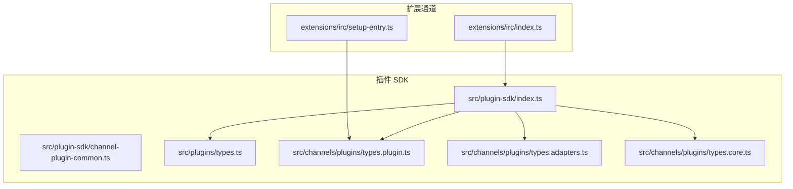
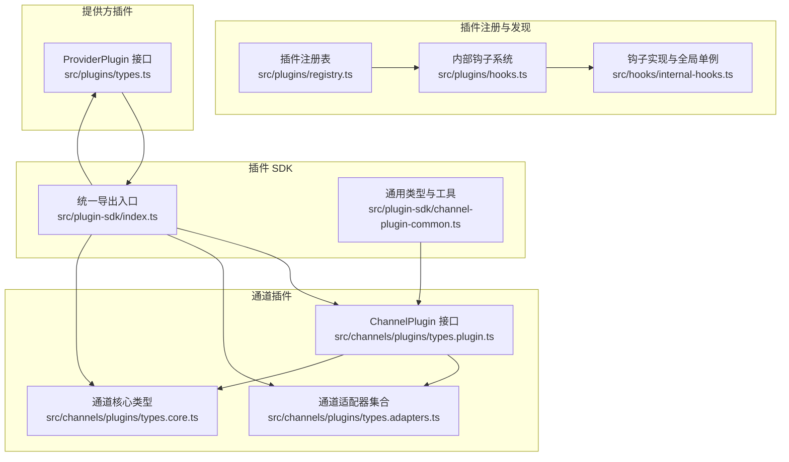
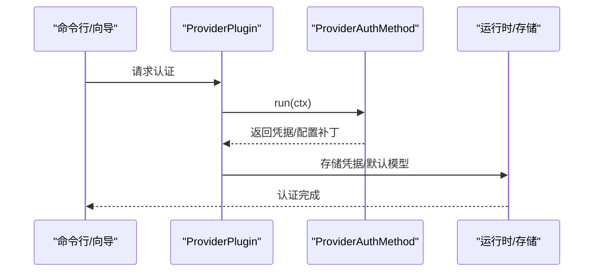
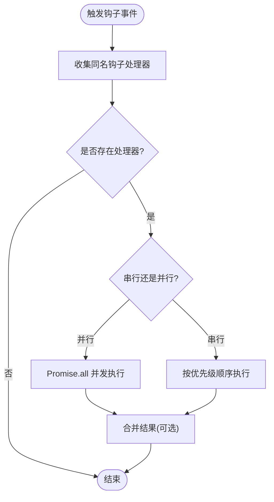
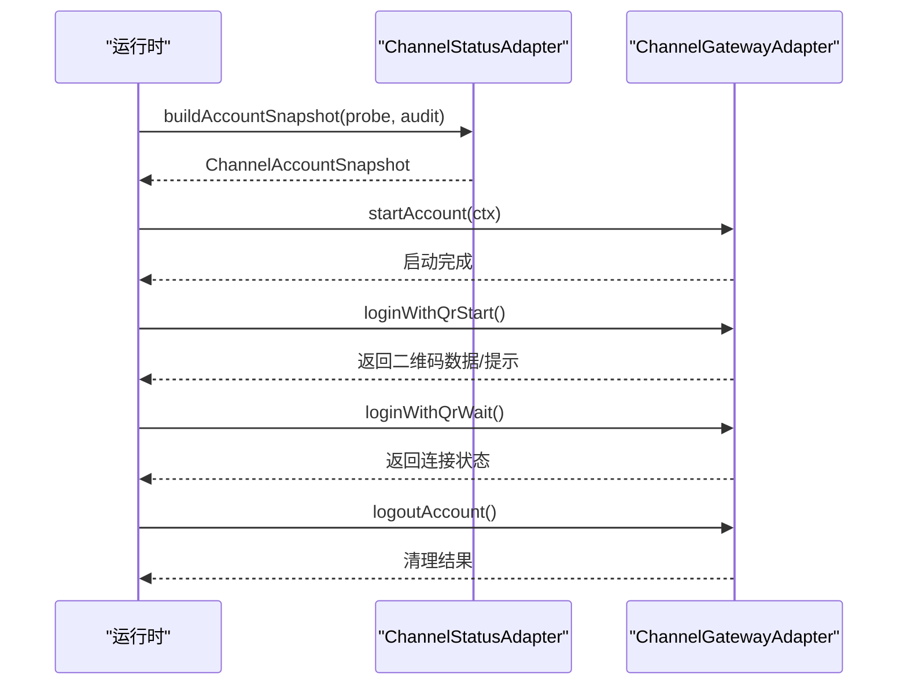
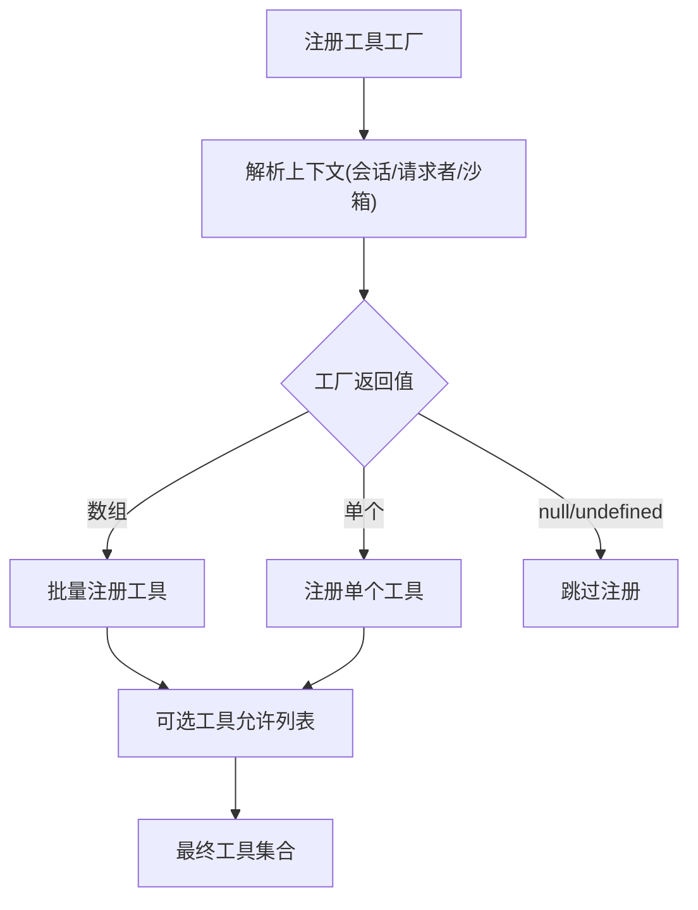
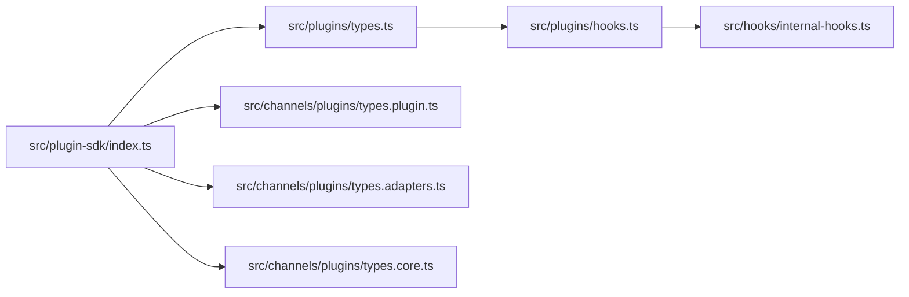

# 核心接口

<cite>
**本文引用的文件**
- [src/plugin-sdk/index.ts](file://src/plugin-sdk/index.ts)
- [src/channels/plugins/types.plugin.ts](file://src/channels/plugins/types.plugin.ts)
- [src/channels/plugins/types.adapters.ts](file://src/channels/plugins/types.adapters.ts)
- [src/channels/plugins/types.core.ts](file://src/channels/plugins/types.core.ts)
- [src/plugins/types.ts](file://src/plugins/types.ts)
- [src/plugins/registry.ts](file://src/plugins/registry.ts)
- [src/plugins/hooks.ts](file://src/plugins/hooks.ts)
- [src/hooks/internal-hooks.ts](file://src/hooks/internal-hooks.ts)
- [src/plugin-sdk/channel-plugin-common.ts](file://src/plugin-sdk/channel-plugin-common.ts)
- [extensions/irc/index.ts](file://extensions/irc/index.ts)
- [extensions/irc/setup-entry.ts](file://extensions/irc/setup-entry.ts)
</cite>

## 目录
1. [引言](#引言)
2. [项目结构](#项目结构)
3. [核心组件](#核心组件)
4. [架构总览](#架构总览)
5. [详细组件分析](#详细组件分析)
6. [依赖分析](#依赖分析)
7. [性能考虑](#性能考虑)
8. [故障排查指南](#故障排查指南)
9. [结论](#结论)
10. [附录](#附录)

## 引言
本文件聚焦于 OpenClaw 的核心插件接口与规范，系统性梳理并解释以下关键接口：
- ChannelPlugin：通道插件接口，定义消息通道能力边界与适配器集合
- ProviderPlugin：模型/推理提供方插件接口，定义认证、目录、动态模型解析、流式包装等扩展点
- ToolPlugin：工具插件（通过 OpenClaw 插件生态注册）的抽象与工厂模式

同时，文档覆盖插件生命周期钩子、事件处理机制、状态管理接口，并提供可落地的实现参考路径与最佳实践。

## 项目结构
OpenClaw 将“插件 SDK”与“内置通道/提供方实现”解耦：
- 插件 SDK 暴露统一的类型与 API，位于 src/plugin-sdk 与 src/plugins
- 具体通道（如 IRC、Discord、Slack 等）以扩展形式存在，通过 openclaw/plugin-sdk 导入类型与工具函数

图表来源
- [src/plugin-sdk/index.ts:1-800](file://src/plugin-sdk/index.ts#L1-L800)
- [src/channels/plugins/types.plugin.ts:1-85](file://src/channels/plugins/types.plugin.ts#L1-L85)
- [src/channels/plugins/types.adapters.ts:1-386](file://src/channels/plugins/types.adapters.ts#L1-L386)
- [src/channels/plugins/types.core.ts:1-410](file://src/channels/plugins/types.core.ts#L1-L410)
- [src/plugins/types.ts:1-800](file://src/plugins/types.ts#L1-L800)
- [extensions/irc/index.ts:1-17](file://extensions/irc/index.ts#L1-L17)
- [extensions/irc/setup-entry.ts:1-5](file://extensions/irc/setup-entry.ts#L1-L5)

章节来源
- [src/plugin-sdk/index.ts:1-800](file://src/plugin-sdk/index.ts#L1-L800)
- [src/channels/plugins/types.plugin.ts:1-85](file://src/channels/plugins/types.plugin.ts#L1-L85)
- [src/channels/plugins/types.adapters.ts:1-386](file://src/channels/plugins/types.adapters.ts#L1-L386)
- [src/channels/plugins/types.core.ts:1-410](file://src/channels/plugins/types.core.ts#L1-L410)
- [src/plugins/types.ts:1-800](file://src/plugins/types.ts#L1-L800)
- [extensions/irc/index.ts:1-17](file://extensions/irc/index.ts#L1-L17)
- [extensions/irc/setup-entry.ts:1-5](file://extensions/irc/setup-entry.ts#L1-L5)

## 核心组件
本节对三大核心接口进行分层说明：接口定义、方法签名、参数与返回值、生命周期与事件、状态管理。

- ChannelPlugin
  - 定义位置：[src/channels/plugins/types.plugin.ts:49-84](file://src/channels/plugins/types.plugin.ts#L49-L84)
  - 关键字段
    - id: ChannelId
    - meta: ChannelMeta
    - capabilities: ChannelCapabilities
    - config: ChannelConfigAdapter<ResolvedAccount>
    - configSchema?: ChannelConfigSchema
    - setup?: ChannelSetupAdapter
    - pairing?: ChannelPairingAdapter
    - security?: ChannelSecurityAdapter<ResolvedAccount>
    - groups?: ChannelGroupAdapter
    - mentions?: ChannelMentionAdapter
    - outbound?: ChannelOutboundAdapter
    - status?: ChannelStatusAdapter<ResolvedAccount, Probe, Audit>
    - gatewayMethods?: string[]
    - gateway?: ChannelGatewayAdapter<ResolvedAccount>
    - auth?: ChannelAuthAdapter
    - elevated?: ChannelElevatedAdapter
    - commands?: ChannelCommandAdapter
    - streaming?: ChannelStreamingAdapter
    - threading?: ChannelThreadingAdapter
    - messaging?: ChannelMessagingAdapter
    - agentPrompt?: ChannelAgentPromptAdapter
    - directory?: ChannelDirectoryAdapter
    - resolver?: ChannelResolverAdapter
    - actions?: ChannelMessageActionAdapter
    - heartbeat?: ChannelHeartbeatAdapter
    - agentTools?: ChannelAgentToolFactory | ChannelAgentTool[]
  - 生命周期与状态
    - 通过 status.adapter 提供探针、审计、快照构建与状态汇总
    - 通过 gateway.adapter 提供启动/停止账户、二维码登录、登出等生命周期操作
    - 通过 heartbeat.adapter 提供就绪检查与收件人解析
  - 适配器职责概览
    - 配置与设置：config、setup、pairing、security、elevated
    - 发送与投递：outbound、gateway、heartbeat
    - 认证与安全：auth、security
    - 命令与提示：commands、agentPrompt
    - 线程与消息：threading、messaging、actions
    - 目录与解析：directory、resolver
    - 工具与代理：agentTools、streaming

- ProviderPlugin
  - 定义位置：[src/plugins/types.ts:545-738](file://src/plugins/types.ts#L545-L738)
  - 关键字段
    - id: string
    - label: string
    - auth: ProviderAuthMethod[]
    - catalog?: ProviderPluginCatalog
    - resolveDynamicModel?: (ctx) => ProviderRuntimeModel | null | undefined
    - prepareDynamicModel?: (ctx) => Promise<void>
    - normalizeResolvedModel?: (ctx) => ProviderRuntimeModel | null | undefined
    - capabilities?: Partial<ProviderCapabilities>
    - prepareExtraParams?: (ctx) => Record<string, unknown> | null | undefined
    - wrapStreamFn?: (ctx) => StreamFn | null | undefined
    - prepareRuntimeAuth?: (ctx) => Promise<ProviderPreparedRuntimeAuth | null | undefined>
    - resolveUsageAuth?: (ctx) => ProviderResolvedUsageAuth | null | undefined
    - fetchUsageSnapshot?: (ctx) => ProviderUsageSnapshot | null | undefined
    - isCacheTtlEligible?: (ctx) => boolean | undefined
    - buildMissingAuthMessage?: (ctx) => string | null | undefined
    - suppressBuiltInModel?: (ctx) => ProviderBuiltInModelSuppressionResult | null | undefined
    - augmentModelCatalog?: (ctx) => ModelCatalogEntry[] | Promise<...> | null | undefined
    - isBinaryThinking?: (ctx) => boolean | undefined
    - supportsXHighThinking?: (ctx) => boolean | undefined
    - resolveDefaultThinkingLevel?: (ctx) => "off"|"minimal"|"low"|"medium"|"high"|"xhigh"|"adaptive" | null | undefined
    - isModernModelRef?: (ctx) => boolean | undefined
    - wizard?: ProviderPluginWizard
    - formatApiKey?: (cred) => string
    - refreshOAuth?: (cred) => Promise<OAuthCredential>
    - onModelSelected?: (ctx) => Promise<void>
  - 生命周期与事件
    - 认证阶段：ProviderAuthMethod.run/runNonInteractive
    - 目录阶段：catalog/augmentModelCatalog
    - 运行时阶段：prepareRuntimeAuth、wrapStreamFn、prepareExtraParams
    - 使用量阶段：resolveUsageAuth、fetchUsageSnapshot
  - 错误与提示
    - buildMissingAuthMessage 可定制缺失凭证时的错误提示
    - suppressBuiltInModel 支持隐藏或替换内置模型条目

- ToolPlugin（通过 OpenClaw 插件生态）
  - 工厂与上下文
    - OpenClawPluginToolFactory：(ctx) => AnyAgentTool | AnyAgentTool[] | null | undefined
    - OpenClawPluginToolContext：包含会话、请求者身份、沙箱标记等
  - 注册与发现
    - 通过 OpenClawPluginApi.registerTool 注册工具
    - 可选工具可通过工具名或插件组别显式允许
  - 示例参考
    - 扩展工具测试夹具：[extensions/feishu/src/tool-factory-test-harness.ts:1-38](file://extensions/feishu/src/tool-factory-test-harness.ts#L1-L38)

章节来源
- [src/channels/plugins/types.plugin.ts:49-84](file://src/channels/plugins/types.plugin.ts#L49-L84)
- [src/channels/plugins/types.adapters.ts:24-386](file://src/channels/plugins/types.adapters.ts#L24-L386)
- [src/channels/plugins/types.core.ts:16-410](file://src/channels/plugins/types.core.ts#L16-L410)
- [src/plugins/types.ts:72-91](file://src/plugins/types.ts#L72-L91)
- [src/plugins/types.ts:545-738](file://src/plugins/types.ts#L545-L738)
- [extensions/feishu/src/tool-factory-test-harness.ts:1-38](file://extensions/feishu/src/tool-factory-test-harness.ts#L1-L38)

## 架构总览
OpenClaw 插件体系由“插件 SDK + 注册表 + 生命周期钩子 + 通道/提供方适配器”构成，如下图所示：

图表来源
- [src/plugins/registry.ts:53-121](file://src/plugins/registry.ts#L53-L121)
- [src/plugins/hooks.ts:252-288](file://src/plugins/hooks.ts#L252-L288)
- [src/hooks/internal-hooks.ts:174-193](file://src/hooks/internal-hooks.ts#L174-L193)
- [src/channels/plugins/types.plugin.ts:49-84](file://src/channels/plugins/types.plugin.ts#L49-L84)
- [src/channels/plugins/types.adapters.ts:24-386](file://src/channels/plugins/types.adapters.ts#L24-L386)
- [src/channels/plugins/types.core.ts:16-410](file://src/channels/plugins/types.core.ts#L16-L410)
- [src/plugins/types.ts:545-738](file://src/plugins/types.ts#L545-L738)
- [src/plugin-sdk/index.ts:1-800](file://src/plugin-sdk/index.ts#L1-L800)
- [src/plugin-sdk/channel-plugin-common.ts:1-22](file://src/plugin-sdk/channel-plugin-common.ts#L1-L22)

## 详细组件分析

### ChannelPlugin 类型与适配器关系
ChannelPlugin 是通道能力的聚合体，其字段对应一组适配器，分别负责配置、发送、状态、网关、线程、消息、动作、心跳等。

```mermaid
classDiagram
class ChannelPlugin {
+id : ChannelId
+meta : ChannelMeta
+capabilities : ChannelCapabilities
+config : ChannelConfigAdapter
+configSchema? : ChannelConfigSchema
+setup? : ChannelSetupAdapter
+pairing? : ChannelPairingAdapter
+security? : ChannelSecurityAdapter
+groups? : ChannelGroupAdapter
+mentions? : ChannelMentionAdapter
+outbound? : ChannelOutboundAdapter
+status? : ChannelStatusAdapter
+gatewayMethods? : string[]
+gateway? : ChannelGatewayAdapter
+auth? : ChannelAuthAdapter
+elevated? : ChannelElevatedAdapter
+commands? : ChannelCommandAdapter
+streaming? : ChannelStreamingAdapter
+threading? : ChannelThreadingAdapter
+messaging? : ChannelMessagingAdapter
+agentPrompt? : ChannelAgentPromptAdapter
+directory? : ChannelDirectoryAdapter
+resolver? : ChannelResolverAdapter
+actions? : ChannelMessageActionAdapter
+heartbeat? : ChannelHeartbeatAdapter
+agentTools? : ChannelAgentToolFactory | ChannelAgentTool[]
}
class ChannelConfigAdapter
class ChannelSetupAdapter
class ChannelPairingAdapter
class ChannelSecurityAdapter
class ChannelGroupAdapter
class ChannelMentionAdapter
class ChannelOutboundAdapter
class ChannelStatusAdapter
class ChannelGatewayAdapter
class ChannelAuthAdapter
class ChannelElevatedAdapter
class ChannelCommandAdapter
class ChannelStreamingAdapter
class ChannelThreadingAdapter
class ChannelMessagingAdapter
class ChannelAgentPromptAdapter
class ChannelDirectoryAdapter
class ChannelResolverAdapter
class ChannelMessageActionAdapter
class ChannelHeartbeatAdapter
ChannelPlugin --> ChannelConfigAdapter
ChannelPlugin --> ChannelSetupAdapter
ChannelPlugin --> ChannelPairingAdapter
ChannelPlugin --> ChannelSecurityAdapter
ChannelPlugin --> ChannelGroupAdapter
ChannelPlugin --> ChannelMentionAdapter
ChannelPlugin --> ChannelOutboundAdapter
ChannelPlugin --> ChannelStatusAdapter
ChannelPlugin --> ChannelGatewayAdapter
ChannelPlugin --> ChannelAuthAdapter
ChannelPlugin --> ChannelElevatedAdapter
ChannelPlugin --> ChannelCommandAdapter
ChannelPlugin --> ChannelStreamingAdapter
ChannelPlugin --> ChannelThreadingAdapter
ChannelPlugin --> ChannelMessagingAdapter
ChannelPlugin --> ChannelAgentPromptAdapter
ChannelPlugin --> ChannelDirectoryAdapter
ChannelPlugin --> ChannelResolverAdapter
ChannelPlugin --> ChannelMessageActionAdapter
ChannelPlugin --> ChannelHeartbeatAdapter
```

图表来源
- [src/channels/plugins/types.plugin.ts:49-84](file://src/channels/plugins/types.plugin.ts#L49-L84)
- [src/channels/plugins/types.adapters.ts:24-386](file://src/channels/plugins/types.adapters.ts#L24-L386)
- [src/channels/plugins/types.core.ts:16-410](file://src/channels/plugins/types.core.ts#L16-L410)

章节来源
- [src/channels/plugins/types.plugin.ts:49-84](file://src/channels/plugins/types.plugin.ts#L49-L84)
- [src/channels/plugins/types.adapters.ts:24-386](file://src/channels/plugins/types.adapters.ts#L24-L386)
- [src/channels/plugins/types.core.ts:16-410](file://src/channels/plugins/types.core.ts#L16-L410)

### ProviderPlugin 生命周期与认证流程
ProviderPlugin 的认证与运行时扩展点形成清晰的生命周期：

图表来源
- [src/plugins/types.ts:108-143](file://src/plugins/types.ts#L108-L143)
- [src/plugins/types.ts:545-738](file://src/plugins/types.ts#L545-L738)

章节来源
- [src/plugins/types.ts:108-143](file://src/plugins/types.ts#L108-L143)
- [src/plugins/types.ts:545-738](file://src/plugins/types.ts#L545-L738)

### 钩子系统与事件处理
OpenClaw 通过内部钩子系统实现插件间解耦的事件驱动机制。钩子注册为全局单例映射，触发时按顺序执行或并发执行，支持结果合并与错误隔离。

图表来源
- [src/plugins/hooks.ts:252-288](file://src/plugins/hooks.ts#L252-L288)
- [src/hooks/internal-hooks.ts:174-193](file://src/hooks/internal-hooks.ts#L174-L193)

章节来源
- [src/plugins/hooks.ts:252-288](file://src/plugins/hooks.ts#L252-L288)
- [src/hooks/internal-hooks.ts:174-193](file://src/hooks/internal-hooks.ts#L174-L193)

### 状态管理与通道生命周期
通道状态管理通过 ChannelStatusAdapter 与 ChannelGatewayAdapter 协作完成：
- 探针与审计：probeAccount/auditAccount
- 快照与汇总：buildAccountSnapshot/buildChannelSummary
- 生命周期：startAccount/stopAccount、loginWithQrStart/loginWithQrWait/logoutAccount

图表来源
- [src/channels/plugins/types.adapters.ts:129-168](file://src/channels/plugins/types.adapters.ts#L129-L168)
- [src/channels/plugins/types.adapters.ts:277-291](file://src/channels/plugins/types.adapters.ts#L277-L291)
- [src/channels/plugins/types.core.ts:100-162](file://src/channels/plugins/types.core.ts#L100-L162)

章节来源
- [src/channels/plugins/types.adapters.ts:129-168](file://src/channels/plugins/types.adapters.ts#L129-L168)
- [src/channels/plugins/types.adapters.ts:277-291](file://src/channels/plugins/types.adapters.ts#L277-L291)
- [src/channels/plugins/types.core.ts:100-162](file://src/channels/plugins/types.core.ts#L100-L162)

### 工具插件注册与工厂模式
工具插件通过工厂在运行时生成具体工具实例，并可声明可选工具与命名冲突策略。

图表来源
- [src/plugins/types.ts:89-91](file://src/plugins/types.ts#L89-L91)
- [src/plugins/types.ts:72-91](file://src/plugins/types.ts#L72-L91)

章节来源
- [src/plugins/types.ts:89-91](file://src/plugins/types.ts#L89-L91)
- [src/plugins/types.ts:72-91](file://src/plugins/types.ts#L72-L91)

### 实现示例参考
- IRC 通道插件注册示例
  - 插件入口：[extensions/irc/index.ts:6-15](file://extensions/irc/index.ts#L6-L15)
  - 设置入口导出：[extensions/irc/setup-entry.ts:1-5](file://extensions/irc/setup-entry.ts#L1-L5)
- 通道插件类型与通用工具
  - 通道插件类型导出：[src/plugin-sdk/channel-plugin-common.ts:1-22](file://src/plugin-sdk/channel-plugin-common.ts#L1-L22)

章节来源
- [extensions/irc/index.ts:6-15](file://extensions/irc/index.ts#L6-L15)
- [extensions/irc/setup-entry.ts:1-5](file://extensions/irc/setup-entry.ts#L1-L5)
- [src/plugin-sdk/channel-plugin-common.ts:1-22](file://src/plugin-sdk/channel-plugin-common.ts#L1-L22)

## 依赖分析
- 插件 SDK 作为统一入口，集中导出通道与提供方类型、工具工厂、HTTP 路由注册、配置模式等
- 通道插件依赖适配器集合；提供方插件依赖认证与目录扩展点
- 钩子系统通过全局单例共享处理器映射，避免打包拆分导致的注册丢失

图表来源
- [src/plugin-sdk/index.ts:1-800](file://src/plugin-sdk/index.ts#L1-L800)
- [src/plugins/types.ts:1-800](file://src/plugins/types.ts#L1-L800)
- [src/channels/plugins/types.plugin.ts:1-85](file://src/channels/plugins/types.plugin.ts#L1-L85)
- [src/channels/plugins/types.adapters.ts:1-386](file://src/channels/plugins/types.adapters.ts#L1-L386)
- [src/channels/plugins/types.core.ts:1-410](file://src/channels/plugins/types.core.ts#L1-L410)
- [src/plugins/hooks.ts:252-288](file://src/plugins/hooks.ts#L252-L288)
- [src/hooks/internal-hooks.ts:174-193](file://src/hooks/internal-hooks.ts#L174-L193)

章节来源
- [src/plugin-sdk/index.ts:1-800](file://src/plugin-sdk/index.ts#L1-L800)
- [src/plugins/types.ts:1-800](file://src/plugins/types.ts#L1-L800)
- [src/channels/plugins/types.plugin.ts:1-85](file://src/channels/plugins/types.plugin.ts#L1-L85)
- [src/channels/plugins/types.adapters.ts:1-386](file://src/channels/plugins/types.adapters.ts#L1-L386)
- [src/channels/plugins/types.core.ts:1-410](file://src/channels/plugins/types.core.ts#L1-L410)
- [src/plugins/hooks.ts:252-288](file://src/plugins/hooks.ts#L252-L288)
- [src/hooks/internal-hooks.ts:174-193](file://src/hooks/internal-hooks.ts#L174-L193)

## 性能考虑
- 并行钩子执行：在无副作用合并场景下，使用 Promise.all 并发提升吞吐
- 串行钩子执行：当需要修改结果或有依赖顺序时，采用顺序执行确保一致性
- 通道状态快照与探针：合理设置超时与缓存，避免频繁网络调用
- 工具工厂：延迟初始化与按需生成，减少内存占用

## 故障排查指南
- 钩子未触发
  - 检查是否在同一模块打包中被重复加载导致注册表不一致
  - 确认内部钩子全局单例是否生效
- 通道状态异常
  - 核对 probe/audit/buildAccountSnapshot 的实现与超时设置
  - 检查 status.collectStatusIssues 是否正确汇总
- 提供方认证失败
  - 使用 buildMissingAuthMessage 自定义错误提示
  - 检查 resolveUsageAuth/fetchUsageSnapshot 的凭据解析逻辑
- 工具未注册
  - 确认工具工厂返回值与可选工具允许列表
  - 核对 OpenClawPluginApi.registerTool 的调用时机

章节来源
- [src/plugins/hooks.ts:252-288](file://src/plugins/hooks.ts#L252-L288)
- [src/hooks/internal-hooks.ts:174-193](file://src/hooks/internal-hooks.ts#L174-L193)
- [src/channels/plugins/types.adapters.ts:129-168](file://src/channels/plugins/types.adapters.ts#L129-L168)
- [src/plugins/types.ts:108-143](file://src/plugins/types.ts#L108-L143)
- [src/plugins/types.ts:89-91](file://src/plugins/types.ts#L89-L91)

## 结论
OpenClaw 的核心插件接口以“通道插件 + 提供方插件 + 工具插件”的分层设计，结合统一的插件 SDK 与钩子系统，实现了高扩展性与强解耦的运行时架构。遵循本文档的接口规范、生命周期与事件处理机制，可稳定地扩展消息通道与推理提供方能力，并通过状态管理与错误处理模式保障生产可用性。

## 附录
- 统一导出入口：[src/plugin-sdk/index.ts:1-800](file://src/plugin-sdk/index.ts#L1-L800)
- 通道插件类型：[src/channels/plugins/types.plugin.ts:49-84](file://src/channels/plugins/types.plugin.ts#L49-L84)
- 通道适配器集合：[src/channels/plugins/types.adapters.ts:24-386](file://src/channels/plugins/types.adapters.ts#L24-L386)
- 通道核心类型：[src/channels/plugins/types.core.ts:16-410](file://src/channels/plugins/types.core.ts#L16-L410)
- 提供方插件接口：[src/plugins/types.ts:545-738](file://src/plugins/types.ts#L545-L738)
- 工具工厂与上下文：[src/plugins/types.ts:72-91](file://src/plugins/types.ts#L72-L91)
- 钩子系统实现：[src/plugins/hooks.ts:252-288](file://src/plugins/hooks.ts#L252-L288)
- 钩子全局单例：[src/hooks/internal-hooks.ts:174-193](file://src/hooks/internal-hooks.ts#L174-L193)
- 通道插件通用工具：[src/plugin-sdk/channel-plugin-common.ts:1-22](file://src/plugin-sdk/channel-plugin-common.ts#L1-L22)
- IRC 插件示例：[extensions/irc/index.ts:6-15](file://extensions/irc/index.ts#L6-L15)、[extensions/irc/setup-entry.ts:1-5](file://extensions/irc/setup-entry.ts#L1-L5)